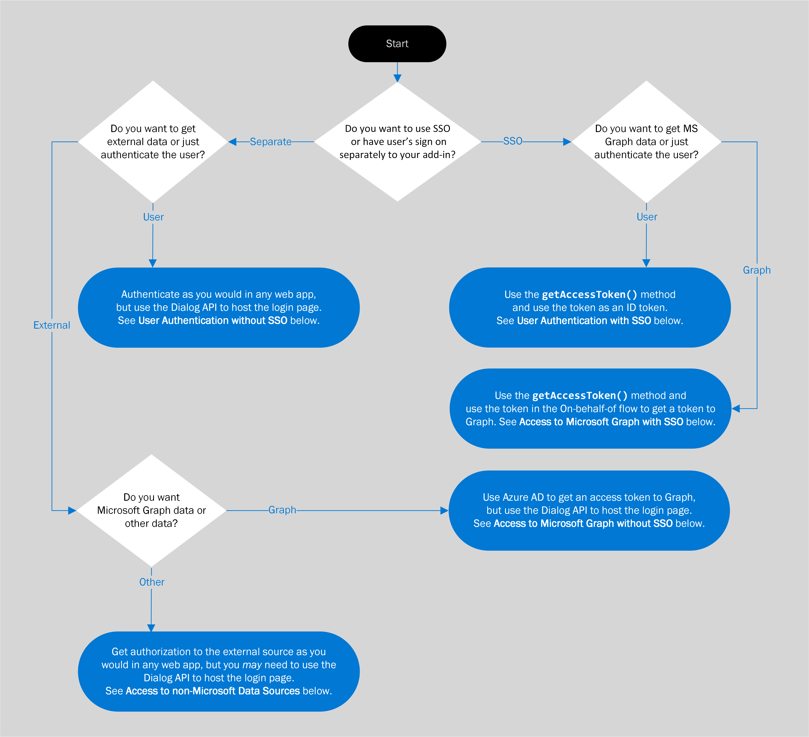

# Office アドインにおける認証と承認の概要

既定では、Web アプリケーション、つまり Office アドインでは匿名アクセスが許可されていますが、ログインによる認証をユーザーに要求できます。 たとえば、ユーザーに Microsoft アカウント、Microsoft 365 Education または職場アカウント、またはその他の一般的なアカウントでログインするように要求できます。 これによりユーザーの確認がアドインで可能になることから、このタスクはユーザー認証と呼ばれています。

アドインはまた、Microsoft Graph データ (ユーザーの Microsoft 365 プロファイル、OneDrive ファイル、SharePoint データなど) や Google、Facebook、LinkedIn、SalesForce、GitHub などの外部ソース内のデータにアクセスするためのユーザーの同意を取得することもできます。 これにより承認されるのはユーザーではなく*アドイン*であることから、このタスクはアドイン (またはアプリ) 承認と呼ばれています。

2 つのうちいずれかの方法を選択して、認証および承認を実行できます。

- **Office シングル サインオン (SSO)**: ユーザーが Office にログインすると、それがアドインへのログインとしても機能することを可能にするシステムです。 アドインでは、必要に応じて、Microsoft Graph へのアドインの承認を行うために、ユーザーの Office の資格情報を使用できます。 (Microsoft 以外のソースは、このシステムからはアクセスできません。)
- **Azure Active Directory での Web アプリケーションの認証と承認**: これは、新しい機能または特別な機能ではありません。 これは、Office SSO システムの導入以前に Office アドイン (およびその他の Web アプリ) でユーザーの認証とアプリの承認を行うために使用されていた方法で、Office SSO を使用できないシナリオでは現在でも使用されています。 また、SSO が利用可能でも、ユーザーがアドインに個別にログインしたい場合があります。たとえば、現在 Office にログインしているものとは別の ID を使用して、アドインにログインできるようにする必要がある場合です。

次のフローチャートは、アドイン開発者が判断する必要がある項目を示しています。 詳細については、この記事で後述します。

## SSO を使用しないユーザー認証

他の Web アプリケーションの場合と同様、Office アドインでのユーザーの認証は Azure Active Directory (AAD) を使用して行えますが、ログイン ページを iFrame 内で開くことが AAD により許可されていない点が異なります。 Office アドインが *Office on the web* で実行されている場合、作業ウィンドウとして iFrame が使用されます。 これは、AAD のログイン画面は、Office ダイアログ API を使用して開かれるダイアログ ボックスで開く必要があることを意味します。 このことは、認証ヘルパー ライブラリの使用方法に影響します。 詳細については、「[Office ダイアログ API を使用して認証および承認する](auth-with-office-dialog-api.md)」を参照してください。

AAD を使用した認証のプログラミングの詳細については、「[Microsoft ID プラットフォーム (v 2.0) の概要](/azure/active-directory/develop/v2-overview)」を参照してください。ここでは、多くのチュートリアルやガイド、関連するサンプルやライブラリへのリンクを見つけることができます。 「[Office ダイアログ API を使用して認証および承認する](auth-with-office-dialog-api.md)」の説明にあるように、Office ダイアログ ボックスで実行するサンプル内のコードを調整する必要がある場合があります。

## SSO を使用しないで Microsoft Graph にアクセスする

Azure Active Directory (AAD) から Graph へのアクセス トークンを取得することで、アドイン用の Microsoft Graph データへの承認を取得できます。 これは、Office SSO を使用せずに行えます。 方法の詳細については、「[Access to Microsoft Graph without SSO (SSO を使用せずに Microsoft Graph にアクセスする)](authorize-to-microsoft-graph-without-sso.md)」を参照してください。この記事には詳細情報やサンプルへのリンクが含まれています。

## SSO を使用したユーザー認証

SSO を使用してユーザーを認証するために、作業ウィンドウまたは関数ファイル内のコードが [getAccessToken](/javascript/api/office-runtime/officeruntime.auth#getaccesstoken-options-) メソッドを呼び出します。 ユーザーがサインインしていない場合、Office でダイアログ ボックスが開き、Azure Active Directory のログイン ページに移動します。 ユーザーがサインインする、またはユーザーが既にサインインしている場合、メソッドによりアクセス トークンが返されます。 このトークンは、**代理**フロー内のブートストラップ トークンです。 (「[Access to Microsoft Graph without SSO (SSO を使用せずに Microsoft Graph にアクセスする)](#access-to-microsoft-graph-with-sso)」を参照してください。) ただし、このトークンには `preferred_username`、`name`、`sub`、および `oid` を含む、現在のユーザーに固有の複数の要求が含まれるため、ID トークンとしても使用できます。 最終的なユーザー ID として使用するプロパティに関するガイダンスについては、「[Microsoft identity platform access tokens (Microsoft ID プラットフォームのアクセス トークン)](https://docs.microsoft.com/azure/active-directory/develop/access-tokens#payload-claims)」を参照してください。 これらのトークンの例については、「[アクセス トークンの例](sso-in-office-add-ins.md#example-access-token)」を参照してください。

コードにより目的の要求がトークンから抽出されると、管理下のユーザー テーブルまたはユーザー データベース内でその値を使用してユーザーが検索されます。 ユーザー設定やユーザーのアカウントの状態などのユーザー関連情報を格納するには、データベースを使用します。 SSO を使用しているため、ユーザーは個別にアドインにサインインを行いません。このため、ユーザーのパスワードを保存する必要はありません。

SSO を使用するユーザー認証を実装する前に、「[Office アドインのシングル サインオンを有効化する](sso-in-office-add-ins.md)」の記事を十分に理解しておく必要があります。次のサンプルも確認しておいてください。

- [Office アドイン NodeJS SSO](https://github.com/OfficeDev/Office-Add-in-NodeJS-SSO)、特に [ssoAuthES6.js](https://github.com/OfficeDev/Office-Add-in-NodeJS-SSO/blob/master/Complete/public/javascripts/ssoAuthES6.js) ファイル。
- [Office アドイン ASP.NET SSO](https://github.com/OfficeDev/Office-Add-in-ASPNET-SSO)。

ただし、これらの例では、トークンは ID トークンとしては使用されません。 ここでは、トークンは、**On-Behalf-Of** フローを使用して Microsoft Graph にアクセスするために使用されます。

## SSO を使用した Microsoft Graph へのアクセス

SSO を使用して Microsoft Graph にアクセスするために、作業ウィンドウまたは関数ファイル内のアドインが [getAccessToken](/javascript/api/office-runtime/officeruntime.auth#getaccesstoken-options-) メソッドを呼び出します。 ユーザーがサインインしていない場合、Office でダイアログ ボックスが開き、Azure Active Directory のログイン ページに移動します。 ユーザーがサインインする、またはユーザーが既にサインインしている場合、メソッドによりアクセス トークンが返されます。 このトークンは、**代理**フロー内のブートストラップ トークンです。 特に、このトークンには 値 `access_as_user` を持つ `scope` 要求が含まれます。 トークンでの要求に関するガイダンスについては、「[Microsoft identity platform access tokens (Microsoft ID プラットフォームのアクセス トークン)](https://docs.microsoft.com/azure/active-directory/develop/access-tokens#payload-claims)」を参照してください。 これらのトークンの例については、「[アクセス トークンの例](sso-in-office-add-ins.md#example-access-token)」を参照してください。

コードがトークンを取得すると、コードは**代理**フロー内でこのトークンを使用して、2 つ目のトークンである Microsoft Graph へのアクセス トークンを取得します。

Office SSO の実装を開始する前に、次の 2 つの記事を十分に理解しておく必要があります。

- [Office アドインのシングル サインオンを有効化する](sso-in-office-add-ins.md)
- [SSO を使用した Microsoft Graph への承認](authorize-to-microsoft-graph.md)

また、ここに示すチュートリアル記事のうち少なくとも 1 つに目を通してください。 これらの手順を実行しない場合でも、これらの記事にはOffice SSO の実装方法および**代理**フローに関する重要な情報が含まれています。 

- [シングル サインオンを使用する ASP.NET Office アドインを作成する](create-sso-office-add-ins-aspnet.md)
- [シングル サインオンを使用する Node.js Office アドインを作成する](create-sso-office-add-ins-nodejs.md)

次のサンプルにも目を通してください。

- [Office アドイン NodeJS SSO](https://github.com/OfficeDev/Office-Add-in-NodeJS-SSO)
- [Office アドイン ASP.NET SSO](https://github.com/OfficeDev/Office-Add-in-ASPNET-SSO)

## Microsoft 以外のデータ ソースへのアクセス

大手のオンライン サービス (Google、Facebook、LinkedIn、SalesForce、GitHub など) では、開発者は、ユーザーが自分のアカウントに別のアプリケーションからアクセスできるようにすることが可能です。 これにより、開発者はこれらのサービスを Office アドインに含めることができます。 アドインでこれを実行する方法の概要については、「[Authorize external services in your Office Add-in (Office アドインで外部サービスを承認する)](auth-external-add-ins.md)」を参照してください。

> [!IMPORTANT]
> コーディングを始める前に、データ ソースのログイン画面を iFrame で開くことがデータ ソースにより許可されているかどうかを確認します。 Office アドインが *Office on the web* で実行されている場合、作業ウィンドウとして iFrame が使用されます。 データ ソースのログインの画面を iFrame で開くことがデータ ソースにより許可されていない場合、ログイン画面は、Office ダイアログ API を使用して開かれるダイアログ ボックスで開く必要があります。 詳細については、「[Office ダイアログ API を使用して認証および承認する](auth-with-office-dialog-api.md)」を参照してください。
