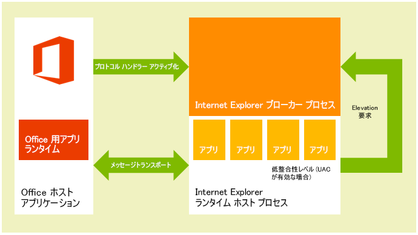

# <a name="privacy-and-security-for-office-add-ins"></a>Office アドインのプライバシーとセキュリティ

## <a name="understanding-the-add-in-runtime"></a>アドインのランタイムについて

Office アドインは、アドインのランタイム環境、複数層のアクセス許可モデル、およびパフォーマンス ガバナーによって保護されます。このフレームワークは、以下の方法でユーザーのエクスペリエンスを保護します。 


- ホスト アプリケーションの UI フレームへのアクセスが管理されます。

- ホスト アプリケーションの UI スレッドに対しては間接的なアクセスのみが許可されます。

- モーダルな操作は許可されていません。たとえば、JavaScript の **alert** 関数、**confirm** 関数、**prompt** 関数の呼び出しは、モーダルであるため許可されていません。

さらに、ランタイム フレームワークには、Office アドインによるユーザーの環境の破壊を防止するうえで以下の利点があります。


- アドインが実行されるプロセスを分離します。

- .dll や .exe の置き換えも、ActiveX コンポーネントも必要ありません。

- アドインのインストールとアンインストールが容易になります。

また、Office アドインによるメモリ、CPU、およびネットワーク リソースの使用が管理可能になり、良好なパフォーマンスと信頼性が確保されます。 

以降のセクションでは、Windows ベース デバイスの Office クライアント、OS X Mac デバイス、および Web 上の Office Online クライアントでのアドインの実行がランタイム アーキテクチャによってどのようにサポートされるかについて簡潔に説明します。

> **注:**WIP と Intune を Office アドインと一緒に使用することの詳細については、「[Office アドインを実行するドキュメントでエンタープライズ データを保護するために WIP と Intune を使用する](https://docs.microsoft.com/en-us/microsoft-365-enterprise/office-add-ins-wip)」を参照してください。

### <a name="clients-for-windows-and-os-x-devices"></a>Windows および OS X のデバイス用のクライアント

Excel、Outlook、および Outlook for Mac など、デスクトップおよびタブレット デバイス用のサポート対象クライアントでは、インプロセス コンポーネントである Office アドイン ランタイムを統合することで、Office アドインをサポートしています。このランタイムは、アドインのライフサイクルを管理し、アドインとクライアント アプリケーションの相互運用を可能にします。アドインの Web ページ自体は、プロセスの外部にホストされます。図 1 に示すように、Windows のデスクトップ デバイスやタブレット デバイスでは、アドインの Web ページは Internet Explorer コントロール内にホストされ、この Internet Explorer コントロールのほうはアドインのランタイム プロセス内にホストされます。そのようにして、セキュリティとパフォーマンスの分離が実現されます。

Windows デスクトップの場合は、制限付きサイト ゾーンに対して Internet Explorer の保護モードを有効にする必要があります。これは通常、既定で有効にされています。無効になっている場合、アドインを起動しようとすると[エラーが発生](https://support.microsoft.com/en-us/help/2761180/apps-for-office-don-t-start-if-you-disable-protected-mode-for-the-restricted-sites-zone-in-internet-explorer)します。

**図 1.Windows ベースのデスクトップおよびタブレットのクライアントにおける Office アドインのランタイム環境**



OS X Mac デスクトップの場合は、図 2 に示すように、アドインの Web ページはセキュリティで保護された WebKit ランタイム ホスト プロセス内にホストされ、それによって同様のレベルのセキュリティとパフォーマンスの保護が提供されます。 


**図 2.OS X Mac クライアントにおける Office アドインのランタイム環境**


Office アドイン ランタイムは、プロセス間通信、JavaScript API 呼び出しとイベントの固有形式への変換、および UI リモート処理サポートを管理し、アドインがドキュメント内や作業ウィンドウ内、あるいは電子メール メッセージ、会議出席依頼、予定の隣に表示されるようにします。


### <a name="web-clients"></a>Web クライアント

Excel Online や Outlook Web App などのサポート対象の Web クライアントの場合、Office アドインは HTML5 **sandbox** 属性を使用して実行される **iframe** でホストされます。ActiveX コンポーネントは許可されておらず、Web クライアントのメイン ページのナビゲートも許可されていません。Office アドインのサポートは、JavaScript API for Office の統合によって Web クライアントで有効になります。JavaScript API は、デスクトップ クライアント アプリケーションと類似の方法で、アドインのライフサイクルや、アドインと Web クライアントの相互運用性を管理します。この相互運用性は、特別なクロスフレーム投稿メッセージ通信インフラストラクチャを使用して実装されます。Web クライアントとの対話には、デスクトップ クライアントで使用されているものと同じ JavaScript ライブラリ (Office.js) を使用できます。図 3 に、Office Online (ブラウザーで実行) で Office アドインをサポートするインフラストラクチャと、それをサポートするために必要な関連コンポーネント (Web クライアント、**iframe**, Office アドイン ランタイム、JavaScript API for Office) を示します。


**図 3.Office Web クライアント内で Office アドインをサポートするインフラストラクチャ**


## <a name="add-in-integrity-in-the-office-store"></a>Office ストアでのアドインの完全性

Office アドインは、Office ストアで公開することで利用可能にできます。Office ストアでは、アドインの整合性を維持するために以下の規則が適用されます。


- Office アドインのホスト サーバーでは、通信に必ず Secure Socket Layer (SSL) を使用する必要があります。

- 開発者はアドインを提出する際に、ID の証明、契約上の合意、および法規制に準拠したプライバシー ポリシーを提供する必要があります。

- アドインのソースに読み取り専用モードでアクセスできるようにします。

- 使用可能なアドインに対するユーザーレビュー システムをサポートしてコミュニティの自己管理を促します。

## <a name="addressing-end-users-privacy-concerns"></a>エンド ユーザーのプライバシー問題への対応

ここでは、Office アドイン プラットフォームから提供される保護を顧客 (エンド ユーザー) の視点から説明し、ユーザーの期待に応える方法とユーザーの個人情報 (PII) を安全に取り扱う方法に関するガイドラインを提供します。


### <a name="end-users-perspective"></a>エンド ユーザーの認知

Office アドインは、ブラウザー コントロールまたは **iframe** 内で実行する Web テクノロジを使用して構築されています。そのため、アドインの使用は、インターネットまたはイントラネット上で Web サイトを閲覧することと似ています。アドインは、組織の外部に存在することも (Office ストアからアドインを入手する場合)、内部に存在することも (Exchange Server アドイン カタログ、SharePoint アドイン カタログ、または組織のネットワーク上のファイル共有からアドインを入手する場合) あります。アドインはネットワークへのアクセスが制限されますが、ほとんどのアドインはアクティブなドキュメントやメール アイテムの読み書きができます。ユーザーや管理者がアドインをインストールまたは起動する前に、アドイン プラットフォームによって特定の制約が課されます。ただし、拡張性モデルと同様に、未知のアドインの起動は慎重に行う必要があります。

アドイン プラットフォームは、エンド ユーザーのプライバシーの懸念に次のように対処します。


- コンテンツ アドイン、Outlook アドイン、または作業ウィンドウ アドインをホストする Web サーバーとやり取りされるデータ、およびアドインとそれが使用する Web サービス間の通信は、Secure Socket Layer (SSL) プロトコルを使用して暗号化する必要があります。

- ユーザーは、Office ストアからアドインをインストールする前に、そのアドインのプライバシー ポリシーと要件を表示できます。さらに、ユーザーのメールボックスとやり取りする Outlook アドインでは、アドインに必要なアクセス許可が具体的に表示されます。ユーザーは Outlook アドインをインストールする前に、使用条件、要求されるアクセス許可、およびプライバシー ポリシーを確認できます。

- ドキュメントを共有する場合、ユーザーはそのドキュメントに挿入されているアドインまたはそのドキュメントに関連付けられているアドインも共有することになります。ユーザーがこれまで使用したことのないアドインが含まれたドキュメントを開いた場合、ホスト アプリケーションは、そのドキュメントでアドインを実行するために必要なアクセス許可を付与するようにユーザーに促します。組織環境では、ドキュメントが外部ソースから取得される場合にも、Office ホスト アプリケーションは確認のためのプロンプトを表示します。

- ユーザーは、Office ストアへのアクセスを有効または無効にすることができます。コンテンツ アドインと作業ウィンドウ アドインの場合は、ユーザーがホスト Office クライアント上の **[セキュリティ センター]** (**[ファイル]** > **[オプション]** > **[セキュリティ センター]** > **[セキュリティ センターの設定]** > **[信頼できるアドイン カタログ]** から開く) から信頼できるアドインとカタログへのアクセスを管理します。Outlook アドインの場合は、**[アドインの管理]** ボタンを選択してアドインを管理できます。Outlook for Windows では、**[ファイル]** > **[アドインの管理]** を選択します。Outlook for Mac では、アドイン バーの **[アドインの管理]** ボタンを選択します。Outlook Web App の場合、**[設定]** メニュー (歯車アイコン) の **[アドインの管理]** を選択します。管理者は、[グループ ポリシーを使用](http://technet.microsoft.com/en-us/library/jj219429.aspx#BKMK_Managing)してこのアクセスを管理することもできます。

- アドイン プラットフォームの設計を通して、次のような方法でセキュリティとパフォーマンスがエンド ユーザーに提供されます。

  - Office アドインは、Office ホスト アプリケーションとは別のアドイン ランタイム環境でホストされている Web ブラウザーのコントロールで動作します。この設計により、ホスト アプリケーションからセキュリティとパフォーマンスの両方が分離されます。

  - アドインは Web ブラウザー コントロール下で動作するため、ブラウザーで動作する通常の Web ページとほぼ同じ処理を実行できますが、同時に、ドメイン分離のための同一生成元ポリシーとセキュリティ ゾーンを遵守するように制限されます。

Outlook アドイン固有のリソース使用量監視機能により、Outlook アドインはセキュリティとパフォーマンスの追加の機能を提供します。詳細については、「[Outlook アドインに関するプライバシー、アクセス許可、セキュリティ](../../docs/outlook/privacy-and-security.md)」を参照してください。


### <a name="developer-guidelines-to-handle-pii"></a>PII の取り扱いに関する開発ガイドライン

IT 管理者と開発者が PII を保護するための一般的なガイドラインは、「[人事管理アプリケーションの開発とテストにおけるプライバシーの保護](http://technet.microsoft.com/en-us/library/gg447064.aspx)」に記載されています。Office アドインを開発するときに適用される PII 保護ガイドラインを以下に示します。


- [Settings](http://dev.office.com/reference/add-ins/shared/settings) オブジェクトは、コンテンツ アドインまたは作業ウィンドウ アドインに関する設定やセッション間の状態データの永続化に使用できますが、パスワードやその他の機密性の高い PII を **Settings** オブジェクトに保存してはいけません。**Settings** オブジェクト内のデータはエンド ユーザーには表示されませんが、容易にアクセスできるドキュメントのファイル形式の一部として保存されます。アドインの PII の使用を制限し、アドインに必要な PII はユーザー保護リソースとしてアドインをホストするサーバーに保存する必要があります。

- 一部のアプリケーションを使用すると PII が公開されてしまう可能性があります。ユーザーの ID、所在、アクセス時間、およびその他の資格情報に関するデータが安全に保存されていて、アドインの他のユーザーが使用できないことを確認してください。

- アドインが Office ストアで入手可能な場合は、Office ストアの HTTPS 要件によって Web サーバーとクライアント コンピューターまたはデバイスとの間で転送される PII が保護されます。ただし、データを他のサーバーに再転送する場合は、これと同レベルの保護が適用されることを確認してください。

- ユーザーの PII を保存する場合は、その事実を明らかにし、ユーザーがそれを検査して削除できる方法を提供します。アドインを Office ストアに送信する場合は、収集するデータとその用途をプライバシーに関する声明の中で説明してください。


## <a name="developers-permission-choices-and-security-practices"></a>開発者によるアクセス許可の選択とセキュリティ手法

Office アドインのセキュリティ モデルをサポートするための以下の一般的なガイドラインを踏まえたうえで、アドインの種類ごとの詳細について調べます。


### <a name="permissions-choices"></a>アクセス許可の選択

アドイン プラットフォームは、アドインの機能に必要なユーザーのデータへのアクセス レベルを宣言するために使用する、アクセス許可モデルを提供します。各アクセス許可レベルは、アドインが機能実現のために使用が許可された JavaScript API for Office のサブセットに対応します。たとえば、コンテンツ アドインと作業ウィンドウ アドイン用の **WriteDocument** アクセス許可は、アドインによるユーザーのドキュメントへの書き込みを可能にする [Document.setSelectedDataAsync](http://dev.office.com/reference/add-ins/shared/document.setselecteddataasync) メソッドへのアクセスを許可しますが、ドキュメントからデータを読み取るメソッドへのアクセスは許可しません。このアクセス許可レベルは、ユーザーが自分のドキュメントに挿入するデータを問い合わせることができるアドインのように、ドキュメントへの書き込みだけが必要なアドインに適しています。

ベスト プラクティスとしては、_最小限の特権_の原則に基づいてアクセス許可を要求するべきです。つまり、アドインが正しく機能するために必要な最小限の API サブセットにのみアクセスする許可を要求します。たとえば、ユーザーのドキュメントのデータさえ読み込めばアドインが正しく機能する場合、**ReadDocument** 以外のアクセス許可を要求しません。(ただし、要求したアクセス許可が不十分な場合は、アドイン プラットフォームによってアドインによる一部の API の使用がブロックされ、ランタイム エラーが発生する可能性があることに注意してください)。

次の例に示すように、アドインのマニフェストでアクセス許可を指定すれば、エンド ユーザーは、アドインを初めてインストールまたはアクティブにする前に、アドインの要求されたアクセス許可レベルを確認できます。さらに、**ReadWriteMailbox** アクセス許可を要求する Outlook アドインをインストールするには、明示的な管理特権が必要になります。

次の例は、作業ウィンドウ アドインでそのマニフェストに **ReadDocument** アクセス許可を指定する方法を示しています。アクセス許可に注目できるようにマニフェスト内の他の要素は省略しています。


```xml
<?xml version="1.0" encoding="utf-8"?>
<OfficeApp xmlns="http://schemas.microsoft.com/office/appforoffice/1.0"
           xmlns:xsi="http://www.w3.org/2001/XMLSchema-instance" 
           xmlns:ver="http://schemas.microsoft.com/office/appforoffice/1.0"
           xsi:type="TaskPaneApp">

... <!-- To keep permissions as the focus, not displaying other elements. -->
  <Permissions>ReadDocument</Permissions>
...
</OfficeApp>
```

作業ウィンドウ アドインとコンテンツ アドインにおけるこの詳細については、「[Requesting permissions for API use in content and task pane add-ins](requesting-permissions-for-api-use-in-content-and-task-pane-add-ins.md)」を参照してください。

Outlook アドインにおけるこの詳細については、次のトピックを参照してください。

- [Outlook アドインに関するプライバシー、アクセス許可、セキュリティ](../../docs/outlook/privacy-and-security.md)

- [Outlook アドインのアクセス許可を理解する](../../docs/outlook/understanding-outlook-add-in-permissions.md)


### <a name="same-origin-policy"></a>同一生成元ポリシー

Office アドインは Web ブラウザー コントロール内で動作する Web ページのため、ブラウザーによって強制された同一生成元ポリシーに従う必要があります。既定で、あるドメイン内の Web ページから、それがホストされているドメイン以外のドメインに対して、[XmlHttpRequest](http://www.w3.org/TR/XMLHttpRequest/) Web サービス呼び出しを実行することはできません。

この制限に対処する 1 つの方法として JSON/P を使用します。JSON/P は、**script** タグと、別のドメインでホストされている一部のスクリプトを指している **src** 属性を追加することによって、Web サービスのプロキシを構成します。**src** 属性を指している URL を動的に作成し、URI クエリ パラメーター経由で URL にパラメーターを渡す **script** タグをプログラムで作成できます。Web サービス プロバイダーは、特定の URL で JavaScript コードを作成してホストし、URI クエリ パラメーターに応じて異なるスクリプトを返します。これらのスクリプトが挿入先で実行され、想定どおりに機能します。

Outlook アドインでの JSON/P の例を次に示します。 

```js
// Dynamically create an HTML SCRIPT element that obtains the details for the specified video.
function loadVideoDetails(videoIndex) {
    // Dynamically create a new HTML SCRIPT element in the webpage.
    var script = document.createElement("script");
    // Specify the URL to retrieve the indicated video from a feed of a current list of videos,
    // as the value of the src attribute of the SCRIPT element. 
    script.setAttribute("src", "https://gdata.youtube.com/feeds/api/videos/" + 
        videos[videoIndex].Id + "?alt=json-in-script&amp;callback=videoDetailsLoaded");
    // Insert the SCRIPT element at the end of the HEAD section.
    document.getElementsByTagName('head')[0].appendChild(script);
}
```

Exchange と SharePoint は、クロス ドメイン アクセスを可能にするためにクライアント側のプロキシを提供します。一般に、イントラネット上の同一生成元ポリシーは、インターネット上のポリシーほど厳密ではありません。詳細については、「[同一生成元ポリシー第 1 部: ピーク禁止](http://blogs.msdn.com/b/ieinternals/archive/2009/08/28/explaining-same-origin-policy-part-1-deny-read.aspx)」および「[Office アドインにおける同一生成元ポリシーの制限事項に対応する](../../docs/develop/addressing-same-origin-policy-limitations.md)」を参照してください。


### <a name="tips-to-prevent-malicious-cross-site-scripting"></a>悪意のあるクロスサイト スクリプティングを回避するヒント

悪意のあるユーザーは、アドインのドキュメントやフィールドを介して悪意のあるスクリプトを挿入することによって、アドインの原点を攻撃する可能性があります。開発者はドメイン内で悪意のあるユーザーの JavaScript が実行されないようにユーザーの入力を処理する必要があります。ドキュメントやメール メッセージからのユーザー入力、または、アドイン内のフィールド経由のユーザー入力を処理するために推奨されているいくつかの方法を以下に示します。


- 可能であれば、DOM プロパティの [innerHTML](http://msdn.microsoft.com/en-us/library/ie/ms533897.aspx) ではなく、[innerText](https://msdn.microsoft.com/library/ms533899.aspx) および [textContent](https://developer.mozilla.org/en-US/docs/DOM/Node.textContent) プロパティを使用します。次のように実行して、Internet Explorer と Firefox のクロス ブラウザー サポートを提供します。

```js
     var text = x.innerText || x.textContent
```

   **innerText** と **textContent** の違いについては、「[Node.textContent](https://developer.mozilla.org/en-US/docs/DOM/Node.textContent)」を参照してください。一般的なブラウザー間での DOM の互換性の詳細については、「[W3C DOM 互換性](http://www.quirksmode.org/dom/w3c_html.html#t07)」を参照してください。

- 
  **innerHTML** を使用する必要がある場合は、ユーザーの入力を **innerHTML** に渡す前に、悪意のあるコンテンツが含まれていないことを確認してください。**innerHTML** を安全に使用する方法とその例については、[innerHTML](http://msdn.microsoft.com/en-us/library/ie/ms533897.aspx) プロパティを参照してください。

- jQuery を使用している場合は、[.html()](http://api.jquery.com/text/) メソッドの代わりに [.text()](http://api.jquery.com/html/) メソッドを使用してください。

- 
  [toStaticHTML](http://msdn.microsoft.com/en-us/library/ie/cc848922.aspx) メソッドを使用して、ユーザーの入力から動的な HTML 要素と属性を削除したうえで、**innerHTML** に入力を渡してください。

- 
  [encodeURIComponent](http://msdn.microsoft.com/en-us/library/8202bce6-1342-40dc-a5ef-ac6d210a7d15.aspx) または [encodeURI](http://msdn.microsoft.com/en-us/library/17bab5a2-bcd4-46c2-8b52-b2b5a0ed98a3.aspx) 関数を使用して、参照元 URL またはユーザーの入力を含む URL として使用できるようにテキストをエンコードしてください。

- より安全に使用できる Web ソリューションを作成するためのその他のベスト プラクティスについては、「[セキュリティで保護されたアドインを開発する](http://msdn.microsoft.com/en-us/library/windows/apps/hh849625.aspx)」を参照してください。


### <a name="tips-to-prevent-clickjacking"></a>「クリックジャック」を防止するためのヒント

Office アドインは Office Online ホスト アプリケーションと通信するブラウザーの iframe 内でレンダリングされるため、次のヒントを参照して、[クリックジャック](http://en.wikipedia.org/wiki/Clickjacking)と呼ばれる、ユーザーをだまして機密情報を公開させようとするハッカーが利用するテクニックのリスクを最小限に抑えてください。

まず、アドインが実行できる機密性の高いアクションを特定します。これには、未承認のユーザーが悪用できる、財務トランザクションの開始や機密データの公開などのアクションが含まれます。たとえば、アドインが支払いをユーザー定義の受信者に送信できる場合があります。

2 番目に、機密性の高いアクションでは、アドインがアクションを実行する前に、ユーザーに確認を求める必要があります。この確認では、アクションの影響を詳細に示す必要があります。また、「許可しない」と書かれた特定のボタンを選択するか、確認を無視することで、必要に応じてユーザーがアクションを止める方法も詳細に示す必要があります。

3 番目に、潜在的な攻撃者が確認を非表示にしたり覆い隠したりする可能性がないようにするため、確認をアドインのコンテキストの外部 (HTML ダイアログ ボックスの外部) に表示する必要があります。

確認を取得できる方法の例を次にいくつか示します。


- 確認のリンクが含まれている電子メールをユーザーに送信します。

- ユーザーがアドインで入力できる確認コードが含まれているテキスト メッセージをユーザーに送信します。

- iframe に対応していないページについて、新しいブラウザー ウィンドウで確認ダイアログを開きます。これは通常、ログイン ページで使用するパターンです。新しいダイアログを作成するには、[ダイアログ API](https://dev.office.com/docs/add-ins/develop/dialog-api-in-office-add-ins) を使用します。

また、ユーザーへの連絡に使用されているアドレスが、潜在的な攻撃者によって提供されている可能性がないことを確認してください。たとえば、支払いの確認には、承認されたユーザーのアカウントに関するファイル内のアドレスを使用します。


### <a name="other-security-practices"></a>その他のセキュリティ手法

開発者は以下のセキュリティ手法にも注意する必要があります。


- ActiveX コントロールはアドイン プラットフォームのクロス プラットフォームの特性をサポートしていないため、開発者は Office アドインで ActiveX コントロールを使用しないようにしてください。

- コンテンツ アドインと作業ウィンドウ アドインは、Internet Explorer が既定で使用するものと同じ SSL 設定を使用することを前提としているため、ほとんどのコンテンツは SSL でのみ提供されていても問題ありません。Outlook アドインは、すべてのコンテンツが SSL で提供されている必要があります。開発者は、アドインの HTML ファイルの場所を示すときに、アドイン マニフェストの **SourceLocation** 要素で HTTPS を使用する URL を指定する必要があります。

    アドインが HTTP を使用してコンテンツを配信していないことを確認するために、開発者はアドインをテストするときに、Internet Explorer で次の設定が選択されていることと、テスト シナリオでセキュリティ警告が表示されないことを確認する必要があります。

    - **[インターネット]** ゾーンのセキュリティ設定で、**[混在したコンテンツを表示する]** が **[ダイアログを表示する]** に設定されていることを確認します。そのためには、Internet Explorer の **[インターネット オプション]** ダイアログ ボックスの **[セキュリティ]** タブで、**[インターネット]** ゾーンを選択し、**[レベルのカスタマイズ]** を選択します。スクロールして **[混在したコンテンツを表示する]** を見つけ、**[ダイアログを表示する]** を選択します (まだ選択されていない場合)。

    - **[インターネット オプション]** ダイアログ ボックスの **[詳細設定]** タブで、**[保護付き/保護なしのサイト間を移動する場合に警告する]** が選択されていることを確認します。

- アドインで CPU コアやメモリ リソースが過剰に使用され、クライアント コンピューターでサービス拒否が発生しないように、アドイン プラットフォームにはリソース使用量の上限が設けられています。開発者はテストの一環として、アドイン プラットフォームがリソース使用量の上限を超えていないかどうかを確認する必要があります。

- 開発者はアドインを発行する前に、アドイン ファイルで公開される個人を識別できる情報が保護されていることを確認する必要があります。

- 開発者は、アドインの HTML ページ内で直接サード パーティ API やサービス (Bing、Google、Facebook など) にアクセスするためのキーを埋め込まないようにしてください。代わりに、カスタム Web サービスを作成するか、キーを安全な Web ストレージの他の形態で保存して、キー値をアドインに渡すために呼び出すことができるようにする必要があります。

- 開発者は、Office ストアにアドインを提出するときに以下を行う必要があります。

  - SSL をサポートする Web サーバーで、提出するアドインをホストする。
  - 法規制に準拠したプライバシー ポリシーを記載した声明を作成する。
  - アドインの提出時に契約合意書に署名する。

Outlook アドインの開発者は、リソース使用量のルール以外に、アクティブ化ルールの指定と JavaScript API の使用に関する制限についてもアドインが遵守していることを確認する必要があります。詳細については、「[Outlook アドインのアクティブ化と JavaScript API に関する制限事項](http://msdn.microsoft.com/library/e0c9e3d0-517e-4333-b8bd-e169c51a07f6.aspx)」を参照してください。


## <a name="it-administrators-control"></a>IT 管理者による制御

企業の設定では、IT 管理者は、Office ストアとプライベート カタログへのアクセスの有効化または無効化に対して最終的な権限を持ちます。


## <a name="additional-resources"></a>その他のリソース


- [コンテンツ アドインと作業ウィンドウ アドインでの API 使用についてアクセス許可を要求する](http://msdn.microsoft.com/library/da2efadc-4ebf-45fe-be39-397ac1eb1dbd.aspx)

- [Outlook アドインに関するプライバシー、アクセス許可、セキュリティ](http://msdn.microsoft.com/library/44208fc4-05d4-42d8-ab20-faa89624de1c.aspx)

- [Outlook アドインのアクセス許可を理解する](http://msdn.microsoft.com/library/5bca69f2-b287-4e19-8f0f-78d896b2a3d3.aspx)

- [Outlook アドインのアクティブ化と JavaScript API の制限](http://msdn.microsoft.com/library/e0c9e3d0-517e-4333-b8bd-e169c51a07f6.aspx)

- [Office アドインにおける同一生成元ポリシーの制限への対処](http://msdn.microsoft.com/library/36c800ae-1dda-4ea8-a558-37c89ffb161b.aspx)

- [同一生成元ポリシー](http://www.w3.org/Security/wiki/Same_Origin_Policy)

- [同一生成元ポリシー パート 1:ピーク禁止](http://blogs.msdn.com/b/ieinternals/archive/2009/08/28/explaining-same-origin-policy-part-1-deny-read.aspx)

- [JavaScript の同一生成元ポリシー](https://developer.mozilla.org/En/Same_origin_policy_for_JavaScript)

- [IE 保護モード](https://support.microsoft.com/en-us/help/2761180/apps-for-office-don-t-start-if-you-disable-protected-mode-for-the-restricted-sites-zone-in-internet-explorer)
