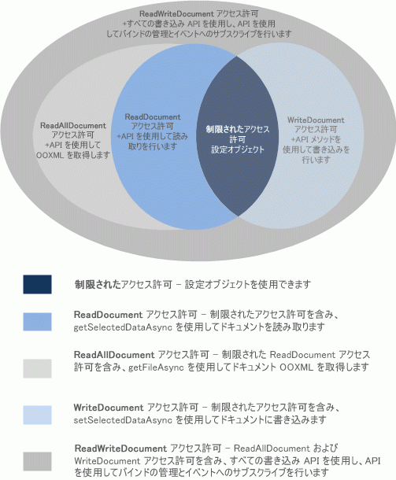

# <a name="requesting-permissions-for-api-use-in-add-ins"></a>アドインでの API 使用についてアクセス許可を要求する

この記事では、アドインの機能のために必要となる JavaScript API アクセスのレベルを指定するために、コンテンツ アドインまたは作業ウィンドウ アドインのマニフェストで宣言できるさまざまなアクセス許可レベルについて説明します。 

## <a name="permissions-model"></a>アクセス許可モデル

5 レベルの JavaScript API アクセス許可モデルは、コンテンツ アドインと作業ウィンドウ アドインでのユーザーのプライバシーとセキュリティの基礎となります。図 1 に、アドイン マニフェストで宣言できる 5 レベルの API アクセス許可を示します。

*図 1. コンテンツ アドインと作業ウィンドウ アドインの 5 レベル アクセス許可モデル*



これらのアクセス許可は、ユーザーがアドインを挿入してアクティブ化 (信頼) したときに、アドイン ランタイムがコンテンツ アドインまたはタスク ウィンドウ アドインに使用を許可する API のサブセットを指定します。コンテンツ アドインまたは作業ウィンドウ アドインに必要なアクセス許可レベルを宣言するには、アドインのマニフェストの [Permissions](/office/dev/add-ins/reference/manifest/permissions) 要素に、いずれかのアクセス許可テキスト値を指定します。以下の例では、ドキュメントに書き込みができる (しかし読み取りはできない) メソッドだけを許可する、 **WriteDocument** アクセス許可を要求します。

```XML
<Permissions>WriteDocument</Permissions>
```

ベスト プラクティスとしては、_最小限の特権_の原則に基づいてアクセス許可を要求するべきです。つまり、アドインが正しく機能するために必要な最小限の API サブセットにのみアクセスする許可を要求します。たとえば、ユーザーのドキュメントのデータさえ読み込めばアドインが正しく機能する場合、**ReadDocument** 以外のアクセス許可を要求しません。

各レベルのアクセス許可で使用可能になる JavaScript API のサブセットを次の表に示します。

|**アクセス許可**|**使用可能な API のサブセット**|
|:-----|:-----|
|**Restricted**|[Settings](/javascript/api/office/office.settings) オブジェクトのメソッドと [Document.getActiveViewAsync](/javascript/api/office/office.document#getactiveviewasync-options--callback-) メソッド。これは、コンテンツ アドインまたは作業ウィンドウ アドインで要求することができる、最小のアクセス許可レベルです。|
|**ReadDocument**|**制限**されたアクセス許可によって許可される api に加えて、ドキュメントの読み取りとバインドの管理に必要な api メンバーへのアクセスを追加します。これには以下の使用が含まれます。<br/><ul><li>選択されたテキスト、HTML (Word のみ)、または表形式のデータは取得するが、ドキュメント内のすべてのデータを含んでいる基礎となる Open Office XML (OOXML) コードは取得しない、<a href="/javascript/api/office/office.document#getselecteddataasync-coerciontype--options--callback-" target="_blank">Document.getSelectedDataAsync</a> メソッド。</p></li><li><p>ドキュメント内のすべてのテキストを取得するが、基礎となるドキュメントの OOXML バイナリ コピーは取得しない、<a href="/javascript/api/office/office.document#getfileasync-filetype--options--callback-" target="_blank">Document.getFileAsync</a> メソッド。</p></li><li><p>ドキュメント内のバインドされたデータを読み取るための <a href="/javascript/api/office/office.binding#getdataasync-options--callback-" target="_blank">Binding.getDataAsync</a> メソッド。</p></li><li><p>ドキュメントでバインディングを作成するための <a href="/javascript/api/office/office.bindings#addfromnameditemasync-itemname--bindingtype--options--callback-" target="_blank">Bindings</a> オブジェクトの <a href="/javascript/api/office/office.bindings#addfrompromptasync-bindingtype--options--callback-" target="_blank">addFromNamedItemAsync</a>、<a href="/javascript/api/office/office.bindings#addfromselectionasync-bindingtype--options--callback-" target="_blank">addFromPromptAsync</a>、<span class="keyword">addFromSelectionAsync</span> の各メソッド。</p></li><li><p>ドキュメントでバインディングにアクセスしてそれを削除するための <a href="/javascript/api/office/office.bindings#getallasync-options--callback-" target="_blank">Bindings</a> オブジェクトの <a href="/javascript/api/office/office.bindings#getbyidasync-id--options--callback-" target="_blank">getAllAsync</a>、<a href="/javascript/api/office/office.bindings#releasebyidasync-id--options--callback-" target="_blank">getByIdAsync</a>、および <span class="keyword">releaseByIdAsync</span> の各メソッド。</p></li><li><p>ドキュメントの URL など、ドキュメント ファイルのプロパティにアクセスするための <a href="/javascript/api/office/office.document#getfilepropertiesasync-options--callback-" target="_blank">Document.getFilePropertiesAsync</a> メソッド。</p></li><li><p>ドキュメント内で名前付きオブジェクトや場所に移動するための <a href="/javascript/api/office/office.document#gotobyidasync-id--gototype--options--callback-" target="_blank">Document.goToByIdAsync</a> メソッド。</p></li><li><p>Project 用の作業ウィンドウ アドインについては、<a href="/javascript/api/office/office.document" target="_blank">ProjectDocument</a> オブジェクトのすべての "get" メソッド。 </p></li></ul>|
|**ReadAllDocument**|**Restricted**および**readdocument**アクセス許可によって許可される API に加えて、ドキュメントデータに対する以下の追加のアクセスが許可されます。<br/><ul><li><p><span class="keyword">Document.getSelectedDataAsync</span> メソッドおよび <span class="keyword">Document.getFileAsync</span> メソッドは、ドキュメント (テキストだけでなく、書式設定、リンク、埋め込まれたグラフィックス、コメント、リビジョンなど) の基礎となる OOXML コードにアクセスできます。</p></li></ul>|
|**WriteDocument**|**制限**されたアクセス許可によって許可される api に加えて、以下の api メンバーに対するアクセス権が追加されます。<br/><ul><li><p>ドキュメントでのユーザーの選択内容に書き込むための <a href="/javascript/api/office/office.document#setselecteddataasync-data--options--callback-" target="_blank">Document.setSelectedDataAsync</a> メソッド。</p></li></ul>|
|**ReadWriteDocument**|**Restricted**、 **readdocument**、 **Readalldocument**、および**writedocument**アクセス許可によって許可される api に加えて、コンテンツアドインと作業ウィンドウアドインでサポートされているその他すべての api へのアクセス (イベントをサブスクライブする方法を含む) が含まれます。これらの追加の API メンバーにアクセスするには、 **Readwritedocument**アクセス許可を宣言する必要があります。<br/><ul><li><p>ドキュメントのバインドされている領域に書き込むための <a href="/javascript/api/office/office.binding#setdataasync-data--options--callback-" target="_blank">Binding.setDataAsync</a> メソッド。</p></li><li><p>バインド テーブルに行を追加するための <a href="/javascript/api/office/office.tablebinding#addrowsasync-rows--options--callback-" target="_blank">TableBinding.addRowsAsync</a> メソッド。</p></li><li><p>バインド テーブルに列を追加するための <a href="/javascript/api/office/office.tablebinding#addcolumnsasync-tabledata--options--callback-" target="_blank">TableBinding.addColumnsAsync</a> メソッド。</p></li><li><p>バインド テーブルからすべてのデータを削除するための <a href="/javascript/api/office/office.tablebinding#deletealldatavaluesasync-options--callback-" target="_blank">TableBinding.deleteAllDataValuesAsync</a> メソッド。</p></li><li><p>バインド テーブルに書式設定とオプションを設定するための <a href="/javascript/api/office/office.tablebinding#setformatsasync-cellformat--options--callback-" target="_blank">TableBinding</a> オブジェクトの <a href="/javascript/api/office/office.tablebinding#clearformatsasync-options--callback-" target="_blank">setFormatsAsync</a>、<a href="/javascript/api/office/office.tablebinding#settableoptionsasync-tableoptions--options--callback-" target="_blank">clearFormatsAsync</a>、および <span class="keyword">setTableOptionsAsync</span> の各メソッド。</p></li><li><p>
  <a href="/javascript/api/office/office.customxmlnode" target="_blank">CustomXmlNode</a>、<a href="/javascript/api/office/office.customxmlpart" target="_blank">CustomXmlPart</a>、<a href="/javascript/api/office/office.customxmlparts" target="_blank">CustomXmlParts</a>、および <a href="/javascript/api/office/office.customxmlprefixmappings" target="_blank">CustomXmlPrefixMappings</a> の各オブジェクトのすべてのメンバー。</p></li><li><p>コンテンツ アドインと作業ウィンドウ アドインによってサポートされるイベントにサブスクライブするためのすべてのメソッド、特に <span class="keyword">Binding</span>、<span class="keyword">CustomXmlPart</span>、<a href="/javascript/api/office/office.binding" target="_blank">Document</a>、<a href="/javascript/api/office/office.customxmlpart" target="_blank">ProjectDocument</a>、および <a href="/javascript/api/office/office.document" target="_blank">Settings</a> の各オブジェクトの <a href="/javascript/api/office/office.document" target="_blank">addHandlerAsync</a> メソッドおよび <a href="/javascript/api/office/office.document#settings" target="_blank">removeHandlerAsync</a> メソッド。</p></li></ul>|

## <a name="see-also"></a>関連項目

- [Office アドインのプライバシーとセキュリティ](../concepts/privacy-and-security.md)
