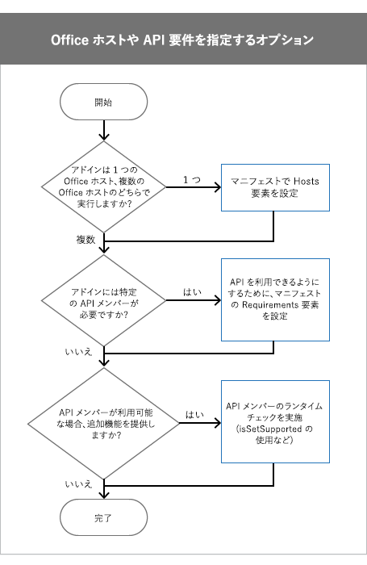

# <a name="specify-office-hosts-and-api-requirements"></a>Office のホストと API の要件を指定する

期待どおりの動作をするうえで、Office アドインは特定の Office ホスト、要件セット、API メンバー、または API のバージョンに依存することがあります。たとえば、次のようなアドインがあります。

- 1 つの Office アプリケーション (例: Word または Excel)、またはいくつかのアプリケーションで実行します。

- Office の一部のバージョンでのみ利用できる JavaScript API を使用します。たとえば、Excel 2016 で実行するアドインでは、Excel JavaScript API を使用することがあります。

- アドインが使用する API メンバーをサポートするバージョンの Office でのみ実行します。

この記事は、アドインが期待どおりに機能し、できるだけ多くのユーザーが利用できるようにするために選択する必要のあるオプションについて理解するのに役立ちます。

> [!NOTE]
> 現時点での Office アドインのサポート状況の概要については、「[Office アドインを使用できるホストおよびプラットフォーム](../overview/office-add-in-availability.md)」のページを参照してください。

この記事で説明する中心的な概念を次の表に示します。

|**概念**|**説明**|
|:-----|:-----|
|Office アプリケーション、Office ホスト アプリケーション、Office ホスト、またはホスト|アドインを実行するために使用される Office アプリケーション。たとえば、Word、Word Online、Excel など。|
|プラットフォーム|Office Online、Office for iPad などの Office ホストを実行する場所。|
|要件セット|関連する API メンバーの名前付きグループ。アドインは要件セットを使用して、Office ホストが、アドインによって使用される API メンバーをサポートしているかどうかを判別します。個々の API メンバーのサポートをテストするよりも、要件セットのサポートをテストするほうが簡単です。要件セットのサポートは、Office ホストと Office ホストのバージョンによって異なります。 <br >要件セットはマニフェスト ファイルで指定されます。 マニフェストで要件セットを指定するときは、アドインを実行するために Office ホストが提供する必要のある最小レベルの API サポートを設定します。 マニフェストで指定されている要件セットをサポートしていない Office ホストはアドインを実行できず、アドインは <span class="ui">[個人用アドイン]</span> に表示されません。これにより、アドインが利用できる場所が制限されます。 コードでは、ランタイム チェックを使用します。 要件セットの詳細な一覧については、「[Office アドインの要件セット](/office/dev/add-ins/reference/requirement-sets/office-add-in-requirement-sets)」を参照してください。|
|ランタイム チェック|アドインを実行している Office ホストが、アドインで使用されている要件セットまたはメソッドをサポートしているかどうかを判別するために実行時に行われるテスト。ランタイム チェックを実行するには、**if** ステートメントに **isSetSupported** メソッド、要件セット、または要件セットの一部ではないメソッド名を指定して使用します。ランタイム チェックを使用し、多くのユーザーが対象のアドインを使用できることを確認します。要件セットとは異なり、ランタイム チェックでは、対象アドインを実行するために Office ホストが提供する必要のある最小レベルの API サポートは指定しません。代わりに、**if** ステートメントを使用して API メンバーがサポートされているかどうかを判別します。サポートされている場合には、アドインで追加機能を提供できます。ランタイム チェックを使用するときは、自分のアドインは必ず **[個人用アドイン]** に表示されます。|

## <a name="before-you-begin"></a>始める前に

アドインで最新バージョンのアドイン マニフェスト スキーマを使用する必要があります。アドインでランタイム チェックを使用する場合は、最新の JavaScript API for Office (office.js) ライブラリを使用する必要があります。

### <a name="specify-the-latest-add-in-manifest-schema"></a>最新のアドイン マニフェスト スキーマを指定する

アドインのマニフェストでは、アドイン マニフェスト スキーマのバージョン 1.1 を使用する必要があります。アドイン マニフェストの **OfficeApp** 要素を次のように設定します。

```XML
<OfficeApp xmlns="http://schemas.microsoft.com/office/appforoffice/1.1" xmlns:xsi="https://www.w3.org/2001/XMLSchema-instance" xsi:type="TaskPaneApp">
```

### <a name="specify-the-latest-javascript-api-for-office-library"></a>最新の JavaScript API for Office ライブラリを指定する

ランタイム チェックを使用する場合、コンテンツ配信ネットワーク (CDN) から JavaScript API for Office ライブラリの最新版を参照します。その場合、HTML に次の `script` タグを追加します。CDN URL で `/1/` を使用することで、Office.js の最新版が参照されます。

```HTML
<script src="https://appsforoffice.microsoft.com/lib/1/hosted/Office.js" type="text/javascript"></script>
```

## <a name="options-to-specify-office-hosts-or-api-requirements"></a>Office のホストや API の要件を指定するオプション

Office ホストまたは API の要件を指定するときに、検討すべき事項がいくつかあります。次の図に、アドインで使用すべき手法の判別方法を示します。



- アドインを 1 つの Office ホストで実行する場合、マニフェストに **Hosts** 要素を設定します。詳しくは、「[Hosts 要素を設定する](#set-the-hosts-element)」を参照してください。

- アドインを実行するために Office ホストがサポートする必要のある最小レベルの要件セットまたは API メンバーを設定するには、マニフェストに **Requirements** 要素を設定します。詳しくは、「[マニフェストで Requirements 要素を設定する](#set-the-requirements-element-in-the-manifest)」をご覧ください。

- Office ホストで特定の要件セットまたは API メンバーが利用可能である場合に追加の機能を提供する場合は、アドインの JavaScript コードでランタイム チェックを実行します。 たとえば、アドインが Excel 2016 で機能する場合は、Excel JavaScript API の API メンバーを使用して追加の機能を提供します。 詳細については、「[JavaScript コードでランタイム チェックを使用する](#use-runtime-checks-in-your-javascript-code)」をご覧ください。

## <a name="set-the-hosts-element"></a>Hosts 要素を設定する

アドインを 1 つの Office ホスト アプリケーションで実行するには、マニフェストで **Hosts** 要素と **Host** 要素を使用します。**Hosts** 要素を指定しない場合、アドインはすべてのホストで実行されます。

たとえば、次の **Hosts** と **Host** の宣言は、アドインが Excel のすべてのリリース (これには、Windows での Excel、Excel Online、Excel for iPad が含まれる) で機能することを指定しています。

```xml
<Hosts>
  <Host Name="Workbook" />
</Hosts>
```

**Hosts** 要素には、1 つ以上の **Host** 要素を含めることができます。**Host** 要素は、アドインで必要な Office ホストを指定します。**Name** 属性は必須で、次のいずれかの値に設定できます。

| 名前          | Office ホスト アプリケーション                                                              |
|:--------------|:--------------------------------------------------------------------------------------|
| データベース      | Access Web アプリ                                                                       |
| Document      | Windows での Word、Word for Mac、Word for iPad、Word Online                         |
| メールボックス       | Windows での Outlook、Outlook for Mac、Outlook on the web、Outlook.com              |
| プレゼンテーション  | Windows での PowerPoint、PowerPoint for Mac、PowerPoint for iPad、PowerPoint Online |
| Project       | Windows での Project                                                                    |
| ブック      | Windows での Excel、Excel for Mac、Excel for iPad、Excel Online                     |

> [!NOTE]
> `Name` 属性により、アドインを実行できる Office ホスト アプリケーションが指定されます。Office ホストはさまざまなプラットフォームに対応しており、デスクトップ、Web ブラウザー、タブレット、モバイル デバイスで実行できます。アドインを実行するために使用するプラットフォームを指定することはできません。たとえば、`Mailbox` を指定した場合、Outlook と Outlook Web App の両方を利用してアドインを実行できます。


## <a name="set-the-requirements-element-in-the-manifest"></a>マニフェストで Requirements 要素を設定する

**Requirements** 要素は、アドインを実行するために Office ホストによってサポートされている必要がある最小要件セットまたは API メンバーを指定します。**Requirements** 要素は、アドインで使用される要件セットと個々のメソッドの両方を指定できます。アドイン マニフェスト スキーマのバージョン 1.1 では、**Requirements** 要素は Outlook アドイン以外のすべてのアドインで省略可能です。

> [!WARNING]
> アドインで必須の重要な要件セットまたは API メンバーを指定するには、**Requirements** 要素のみを使用します。Office ホストまたはプラットフォームが、**Requirements** 要素で指定した要件セットまたは API メンバーをサポートしない場合、アドインはそのホストまたはプラットフォームでは実行されず、**[個人用アドイン]** にも表示されません。代わりに、Windows での Excel、Excel Online、Excel for iPad などの Office ホストのすべてのプラットフォームでアドインを使用できるようにすることをお勧めします。_すべて_の Office ホストとプラットフォームでアドインを使用できるようにするには、**Requirements** 要素ではなく、ランタイム チェックを使用します。

次のものをサポートするすべての Office ホスト アプリケーションで読み込まれるアドインのコード例を以下に示します。

-  **TableBindings** 要件セット。最小バージョンは 1.1。

-  **OOXML** 要件セット。最小バージョンは 1.1。

-  **Document.getSelectedDataAsync** メソッド。

```XML
<Requirements>
   <Sets DefaultMinVersion="1.1">
      <Set Name="TableBindings" MinVersion="1.1"/>
      <Set Name="OOXML" MinVersion="1.1"/>
   </Sets>
   <Methods>
      <Method Name="Document.getSelectedDataAsync"/>
   </Methods>
</Requirements>
```

- **Requirements** 要素には **Sets** 子要素と **Methods** 子要素が含まれます。

- **Sets** 要素には、1 つ以上の **Set** 要素を含めることができます。**DefaultMinVersion** は、すべての **Set** 子要素の **MinVersion** の既定値を指定します。

- **Set** 要素は、アドインを実行するために Office ホストがサポートする必要のある要件セットを指定します。 **Name** 属性は、要件セットの名前を指定します。 **MinVersion** は、要件セットの最小バージョンを指定します。 **MinVersion** は、**DefaultMinVersion** の値よりも優先されます。 要件セットと API メンバーが属する要件セットのバージョンの詳細については、「[「Office アドインの要件セット](/office/dev/add-ins/reference/requirement-sets/office-add-in-requirement-sets)」を参照してください。

- **Methods** 要素には、1 つ以上の **Method** 要素を含めることができます。Outlook アドインで **Methods** 要素を使用することはできません。

- **Method** 要素は、アドインが実行される Office ホストでサポートされている必要のある個々のメソッドを指定します。**Name** 属性は必須であり、親オブジェクトで修飾されたメソッドの名前を指定します。


## <a name="use-runtime-checks-in-your-javascript-code"></a>JavaScript コードでランタイム チェックを使用する


特定の要件セットが Office ホストでサポートされる場合、追加の機能を提供すると効果的な場合があります。 たとえば、アドインで Word 2016 を実行する場合、既存のアドインで Word JavaScript API を使用することがあります。 その場合、要件セットの名前を指定し、[isSetSupported](/javascript/api/office/office.requirementsetsupport#issetsupported-name--minversion-) メソッドを使用します。 **isSetSupported** により実行時に、アドインを実行する Office ホストが要件セットをサポートするかどうかが判断されます。 要件セットがサポートされる場合、**isSetSupported** は **true** を返し、その要件セットから API メンバーを使用する追加コードを実行します。 Office ホストで要件セットがサポートされない場合、**isSetSupported** は **false** を返し、追加コードは実行されません。 次のコードは、**isSetSupported** と共に使用する構文を示しています。


```js
if (Office.context.requirements.isSetSupported(RequirementSetName, VersionNumber))
{
   // Code that uses API members from RequirementSetName.
}

```

-  _RequirementSetName_ (必須) は、要件セットの名前を表す文字列です。 利用できる要件セットの詳細については、「[Office アドインの要件セット](/office/dev/add-ins/reference/requirement-sets/office-add-in-requirement-sets)」を参照してください。
    
-  _VersionNumber_ (省略可能) は要件セットのバージョンです。

次のように、Office ホストに関連付けられている **RequirementSetName** と一緒に **isSetSupported** を使用します。

|Office ホスト|RequirementSetName|
|---|---|
|Excel|ExcelApi|
|OneNote|OneNoteApi|
|Outlook|Mailbox|
|Word|WordApi|

**isSetSupported** メソッドおよびこれらの要件セットは、CDN の最新の Office.js ファイルで利用できます。 CDN の Office.js を使用しない場合、アドインで例外が表示されることがあります。**isSetSupported** が定義されていないためです。 詳細については、「[最新の JavaScript API for Office ライブラリを指定する](#specify-the-latest-javascript-api-for-office-library)」を参照してください。

次のコードの例は、さまざまな要件セットや API メンバーをサポートするさまざまな Office ホストにおいて、アドインで各種の機能を提供する方法を示しています。

```js
if (Office.context.requirements.isSetSupported('WordApi', 1.1))
{
    // Run code that provides additional functionality using the Word JavaScript API when the add-in runs in Word 2016 or later.
}
else if (Office.context.requirements.isSetSupported('CustomXmlParts'))
{
    // Run code that uses API members from the CustomXmlParts requirement set.
}
else
{
    // Run additional code when the Office host is not Word 2016 or later and does not support the CustomXmlParts requirement set.
}

```


## <a name="runtime-checks-using-methods-not-in-a-requirement-set"></a>要件セットにないメソッドを使用したランタイム チェック

API の一部のメンバーは、要件のセットに属していません。 これは [JavaScript API for Office](/office/dev/add-ins/reference/javascript-api-for-office) 名前空間 ([Outlook Mailbox API](/javascript/api/outlook) を除く `Office.` で始まるすべての名前空間) に属する API メンバーにのみ適用され、[Word JavaScript API](/office/dev/add-ins/reference/overview/word-add-ins-reference-overview) 名前空間 (`Word.` で始まるすべての名前空間)、[Excel JavaScript API](/office/dev/add-ins/reference/overview/excel-add-ins-reference-overview) 名前空間 (`Excel.` で始まるすべての名前空間) や [OneNote JavaScript API](/office/dev/add-ins/reference/overview/onenote-add-ins-javascript-reference) (`OneNote.` で始まるすべての名前空間) に属する API メンバーには適用されません。 要件セットに属さないメソッドにアドインが依存するとき、ランタイム チェックを利用し、メソッドが Office ホストでサポートされているかどうかを判断できます。たとえば、次のコード例のようになります。 要件セットに属さないメソッドの詳細な一覧については、「[Office アドインの要件セット](/office/dev/add-ins/reference/requirement-sets/office-add-in-requirement-sets#methods-that-arent-part-of-a-requirement-set)」を参照してください。

> [!NOTE]
> アドインのコードでのこの種のランタイム チェックは、限定的に使用することをお勧めします。

次のコードの例は、ホストが **document.setSelectedDataAsync** をサポートしているかどうかをチェックします。

```js
if (Office.context.document.setSelectedDataAsync)
{
    // Run code that uses document.setSelectedDataAsync.
}
```


## <a name="see-also"></a>関連項目

- [Office アドインの XML マニフェスト](add-in-manifests.md)
- [Office アドインの要件セット](/office/dev/add-ins/reference/requirement-sets/office-add-in-requirement-sets)
- [Word-Add-in-Get-Set-EditOpen-XML](https://github.com/OfficeDev/Word-Add-in-Get-Set-EditOpen-XML)
