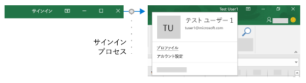

# <a name="enable-single-sign-on-for-office-add-ins-preview"></a><span data-ttu-id="40c85-103">Office アドインのシングル サインオンを有効化する (プレビュー)</span><span class="sxs-lookup"><span data-stu-id="40c85-103">Enable single sign-on for Office Add-ins (preview)</span></span>

<span data-ttu-id="40c85-104">ユーザーは個人用の Microsoft アカウントまたは職場や学校の (Office 365) アカウントのいずれかを使用して、Office (オンライン、モバイル、およびデスクトップ プラットフォーム) にサインインします。</span><span class="sxs-lookup"><span data-stu-id="40c85-104">Users sign in to Office (online, mobile, and desktop platforms) using either their personal Microsoft account or their work or school (Office 365) account.</span></span> <span data-ttu-id="40c85-105">これとシングル サインオン (SSO) を使用すれば、ユーザーに 2 度目のサインインを求めずに、ご自分のアドインをユーザーに許可できます。</span><span class="sxs-lookup"><span data-stu-id="40c85-105">You can take advantage of this and use single sign-on (SSO) to authorize the user to your add-in without requiring the user to sign in a second time.</span></span>



## <a name="preview-status"></a><span data-ttu-id="40c85-107">プレビューの状態</span><span class="sxs-lookup"><span data-stu-id="40c85-107">Preview Status</span></span>

<span data-ttu-id="40c85-108">現在、シングル サインオン API はプレビューのみでサポートされています。</span><span class="sxs-lookup"><span data-stu-id="40c85-108">The Single Sign-on API is currently supported in preview only.</span></span> <span data-ttu-id="40c85-109">これは、試験目的のみで開発者に提供されており、運用環境のアドインには使用してはいけません。</span><span class="sxs-lookup"><span data-stu-id="40c85-109">It is available to developers for experimentation; but it should not be used in a production add-in.</span></span> <span data-ttu-id="40c85-110">また、SSO を使用するアドインは [AppSource](https://appsource.microsoft.com) では許可されていません。</span><span class="sxs-lookup"><span data-stu-id="40c85-110">In addition, add-ins that use SSO are not accepted in [AppSource](https://appsource.microsoft.com).</span></span>

<span data-ttu-id="40c85-111">SSO には Office 365 (Office のサブスクリプション バージョン) が必要です。</span><span class="sxs-lookup"><span data-stu-id="40c85-111">SSO requires Office 365 (the subscription version of Office).</span></span> <span data-ttu-id="40c85-112">Insider チャネルからの最新の月次バージョンとビルドを使ってください。</span><span class="sxs-lookup"><span data-stu-id="40c85-112">You should use the latest monthly version and build from the Insiders channel.</span></span> <span data-ttu-id="40c85-113">このバージョンを入手するには、Office Insider への参加が必要です。</span><span class="sxs-lookup"><span data-stu-id="40c85-113">You need to be an Office Insider to get this version.</span></span> <span data-ttu-id="40c85-114">詳細については、「[Office Insider になる](https://products.office.com/office-insider?tab=tab-1)」を参照してください。</span><span class="sxs-lookup"><span data-stu-id="40c85-114">For more information, see [Be an Office Insider](https://products.office.com/office-insider?tab=tab-1).</span></span> <span data-ttu-id="40c85-115">ビルドが半期チャネルの運用に移行すると、そのビルドで SSO を含むプレビュー機能のサポートはオフになりますので、ご注意ください。</span><span class="sxs-lookup"><span data-stu-id="40c85-115">Please note that when a build graduates to the production semi-annual channel, support for preview features, including SSO, is turned off for that build.</span></span>

<span data-ttu-id="40c85-116">SSO のプレビューは、すべての Office アプリケーションではサポートされていません。</span><span class="sxs-lookup"><span data-stu-id="40c85-116">Not all Office applications support the SSO preview.</span></span> <span data-ttu-id="40c85-117">これは、Word、Excel、Outlook、および PowerPoint で利用できます。</span><span class="sxs-lookup"><span data-stu-id="40c85-117">It is available in Word, Excel, Outlook, and PowerPoint.</span></span> <span data-ttu-id="40c85-118">シングル サインオン API の現在のサポート状態に関する詳細は、「[IdentityAPI の要件セット](../reference/requirement-sets/identity-api-requirement-sets.md)」を参照してください。</span><span class="sxs-lookup"><span data-stu-id="40c85-118">For more information about where the Single Sign-on API is currently supported, see [IdentityAPI requirement sets](../reference/requirement-sets/identity-api-requirement-sets.md).</span></span>

## <a name="requirements-and-best-practices"></a><span data-ttu-id="40c85-119">要件とベスト プラクティス</span><span class="sxs-lookup"><span data-stu-id="40c85-119">Requirements and Best Practices</span></span>

> [!NOTE]
> [!INCLUDE [Information about using preview APIs](../includes/using-preview-apis.md)]

<span data-ttu-id="40c85-120">**Outlook** アドインで作業している場合は、Office 365 テナントの先進認証が有効になっていることを確認してください。</span><span class="sxs-lookup"><span data-stu-id="40c85-120">If you are working with an **Outlook** add-in, be sure to enable Modern Authentication for the Office 365 tenancy.</span></span> <span data-ttu-id="40c85-121">この方法の詳細については、「[Exchange Online: How to enable your tenant for modern authentication](https://social.technet.microsoft.com/wiki/contents/articles/32711.exchange-online-how-to-enable-your-tenant-for-modern-authentication.aspx)」 (Exchange Online: テナントの先進認証を有効にする方法) を参照してください。</span><span class="sxs-lookup"><span data-stu-id="40c85-121">For information about how to do this, see [Exchange Online: How to enable your tenant for modern authentication](https://social.technet.microsoft.com/wiki/contents/articles/32711.exchange-online-how-to-enable-your-tenant-for-modern-authentication.aspx).</span></span>

<span data-ttu-id="40c85-122">SSO をアドインの唯一の認証方法と*しない*ようにする必要があります。</span><span class="sxs-lookup"><span data-stu-id="40c85-122">You should *not* rely on SSO as your add-in's only method of authentication.</span></span> <span data-ttu-id="40c85-123">特定のエラー状況でアドインが切り替えることができる、別の認証システムを実装する必要があります。</span><span class="sxs-lookup"><span data-stu-id="40c85-123">You should implement an alternate authentication system that your add-in can fall back to in certain error situations.</span></span> <span data-ttu-id="40c85-124">ユーザー テーブルと認証のシステムを使用するか、ソーシャル ログイン プロバイダーの 1 つを活用できます。</span><span class="sxs-lookup"><span data-stu-id="40c85-124">You can use a system of user tables and authentication, or you can leverage one of the social login providers.</span></span> <span data-ttu-id="40c85-125">Office アドインでこれを実行する方法の詳細については、「[Office アドインで外部サービスを承認する](auth-external-add-ins.md)」を参照してください。</span><span class="sxs-lookup"><span data-stu-id="40c85-125">For more information about how to do this with an Office add-in, see [Authorize external services in your Office Add-in](auth-external-add-ins.md).</span></span> <span data-ttu-id="40c85-126">*Outlook* には推奨される代替システムがあります。</span><span class="sxs-lookup"><span data-stu-id="40c85-126">For *Outlook*, there is a recommended fallback system.</span></span> <span data-ttu-id="40c85-127">詳細については、「[シナリオ: Outlook アドインでサービスにシングル サインオンを実装する](../outlook/implement-sso-in-outlook-add-in.md)」を参照してください。</span><span class="sxs-lookup"><span data-stu-id="40c85-127">For more information, see [Scenario: Implement single sign-on to your service in an Outlook add-in](../outlook/implement-sso-in-outlook-add-in.md).</span></span> <span data-ttu-id="40c85-128">代替システムとして Azure Active Directory を使用するサンプルについては、「[Office アドイン NodeJS SSO](https://github.com/OfficeDev/Office-Add-in-NodeJS-SSO)」と「[Office アドイン ASP.NET SSO](https://github.com/OfficeDev/Office-Add-in-ASPNET-SSO)」を参照してください。</span><span class="sxs-lookup"><span data-stu-id="40c85-128">For samples that use Azure Active Directory as the fallback system, see [Office Add-in NodeJS SSO](https://github.com/OfficeDev/Office-Add-in-NodeJS-SSO) and [Office Add-in ASP.NET SSO](https://github.com/OfficeDev/Office-Add-in-ASPNET-SSO).</span></span>

## <a name="how-sso-works-at-runtime"></a><span data-ttu-id="40c85-129">実行時の SSO の動作のしくみ</span><span class="sxs-lookup"><span data-stu-id="40c85-129">How SSO works at runtime</span></span>

<span data-ttu-id="40c85-130">次の図は、SSO の動作のしくみを示しています。</span><span class="sxs-lookup"><span data-stu-id="40c85-130">The following diagram shows how the SSO process works.</span></span>


1. <span data-ttu-id="40c85-132">アドインで、JavaScript は新しい Office.js API [getAccessToken](/javascript/api/office-runtime/officeruntime.auth#getaccesstoken-options-) を呼び出します。</span><span class="sxs-lookup"><span data-stu-id="40c85-132">In the add-in, JavaScript calls a new Office.js API [getAccessToken](/javascript/api/office-runtime/officeruntime.auth#getaccesstoken-options-).</span></span> <span data-ttu-id="40c85-133">これにより、Office ホスト アプリケーションはアドインへのアクセス トークンを取得するように指示されます </span><span class="sxs-lookup"><span data-stu-id="40c85-133">This tells the Office host application to obtain an access token to the add-in.</span></span> <span data-ttu-id="40c85-134">「[アクセス トークンの例](#example-access-token)」を参照してください。</span><span class="sxs-lookup"><span data-stu-id="40c85-134">See [Example access token](#example-access-token).</span></span>
2. <span data-ttu-id="40c85-135">ユーザーがサインインしていない場合、Office ホスト アプリケーションはユーザーにサインインを求めるポップアップ ウィンドウを開きます。</span><span class="sxs-lookup"><span data-stu-id="40c85-135">If the user is not signed in, the Office host application opens a pop-up window for the user to sign in.</span></span>
3. <span data-ttu-id="40c85-136">現在のユーザーが初めてアドインを使用する場合は、そのユーザーに同意を求めるダイアログを表示します。</span><span class="sxs-lookup"><span data-stu-id="40c85-136">If this is the first time the current user has used your add-in, he or she is prompted to consent.</span></span>
4. <span data-ttu-id="40c85-137">Office ホスト アプリケーションは、Azure AD v2.0 エンドポイントから現在のユーザーの**アドイン トークン**を要求します。</span><span class="sxs-lookup"><span data-stu-id="40c85-137">The Office host application requests the **add-in token** from the Azure AD v2.0 endpoint for the current user.</span></span>
5. <span data-ttu-id="40c85-138">Azure AD は、Office ホスト アプリケーションにアドイン トークンを送信します。</span><span class="sxs-lookup"><span data-stu-id="40c85-138">Azure AD sends the add-in token to the Office host application.</span></span>
6. <span data-ttu-id="40c85-139">Office ホスト アプリケーションが、`getAccessToken` 呼び出しによって返される結果オブジェクトの一部として、アドインに**アドイン トークン**を送信します。</span><span class="sxs-lookup"><span data-stu-id="40c85-139">The Office host application sends the **add-in token** to the add-in as part of the result object returned by the `getAccessToken` call.</span></span>
7. <span data-ttu-id="40c85-140">アドイン内の JavaScript が、トークンを解析し、ユーザーのメール アドレスなど必要な情報を抽出します。</span><span class="sxs-lookup"><span data-stu-id="40c85-140">JavaScript in the add-in can parse the token and extract the information it needs, such as the user's email address.</span></span>
8. <span data-ttu-id="40c85-141">オプションで、アドインで HTTP 要求を送信して、ユーザー設定などユーザーに関する情報をさらにサーバー側から求めることができます。</span><span class="sxs-lookup"><span data-stu-id="40c85-141">Optionally, the add-in can send HTTP request to its server-side for more data about the user; such as the user's preferences.</span></span> <span data-ttu-id="40c85-142">または、アクセス トークン自体が解析および検証されるようにサーバー側に送信することができます。</span><span class="sxs-lookup"><span data-stu-id="40c85-142">Alternatively, the access token itself could be sent to the server-side for parsing and validation there.</span></span>

## <a name="develop-an-sso-add-in"></a><span data-ttu-id="40c85-143">SSO アドインの開発</span><span class="sxs-lookup"><span data-stu-id="40c85-143">Develop an SSO add-in</span></span>

<span data-ttu-id="40c85-144">このセクションでは、SSO を使用する Office アドインの作成に関連するタスクについて説明します。</span><span class="sxs-lookup"><span data-stu-id="40c85-144">This section describes the tasks involved in creating an Office Add-in that uses SSO.</span></span> <span data-ttu-id="40c85-145">ここでは、これらのタスクについて、言語とフレームワークに依存しない方法で説明しています。</span><span class="sxs-lookup"><span data-stu-id="40c85-145">These tasks are described here in a language- and framework-agnostic way.</span></span> <span data-ttu-id="40c85-146">詳細なチュートリアルについては、次を参照してください。</span><span class="sxs-lookup"><span data-stu-id="40c85-146">For detailed walkthroughs, see:</span></span>

* [<span data-ttu-id="40c85-147">シングル サインオンを使用する Node.js Office アドインを作成する</span><span class="sxs-lookup"><span data-stu-id="40c85-147">Create a Node.js Office Add-in that uses single sign-on</span></span>](create-sso-office-add-ins-nodejs.md)
* [<span data-ttu-id="40c85-148">シングル サインオンを使用する ASP.NET Office アドインを作成する</span><span class="sxs-lookup"><span data-stu-id="40c85-148">Create an ASP.NET Office Add-in that uses single sign-on</span></span>](create-sso-office-add-ins-aspnet.md)

> [!NOTE]
> <span data-ttu-id="40c85-149">SSO が有効な Node.js Office アドインの作成に Yeoman ジェネレーターを使用することができます。</span><span class="sxs-lookup"><span data-stu-id="40c85-149">You can use the Yeoman generator to create an SSO-enabled, Node.js Office Add-in.</span></span> <span data-ttu-id="40c85-150">Yeoman ジェネレーターは、Azure 内で SSO を構成するために必要な手順を自動化し、SSO を使用するために必要なコードを生成することで、SSO が有効なアドインの作成プロセスを簡素化します。</span><span class="sxs-lookup"><span data-stu-id="40c85-150">The Yeoman generator simplifies the process of creating an SSO-enabled add-in, by automating the steps required to configure SSO within Azure and generating the code that's necessary for an add-in to use SSO.</span></span> <span data-ttu-id="40c85-151">詳細については、「[シングル サインオン (SSO) のクイック スタート](../quickstarts/sso-quickstart.md)」を参照してください。</span><span class="sxs-lookup"><span data-stu-id="40c85-151">For more information, see the [Single sign-on (SSO) quick start](../quickstarts/sso-quickstart.md).</span></span>

### <a name="create-the-service-application"></a><span data-ttu-id="40c85-152">サービス アプリケーションを作成する</span><span class="sxs-lookup"><span data-stu-id="40c85-152">Create the service application</span></span>

<span data-ttu-id="40c85-p111">Azure v2.0 エンドポイントの登録ポータルでアドインを登録します。このプロセスには、次に示すタスクを含めて 5 分から 10 分の時間がかかります。</span><span class="sxs-lookup"><span data-stu-id="40c85-p111">Register the add-in at the registration portal for the Azure v2.0 endpoint. This is a 5–10 minute process that includes the following tasks:</span></span>

* <span data-ttu-id="40c85-155">アドインのクライアント ID とシークレットを取得します。</span><span class="sxs-lookup"><span data-stu-id="40c85-155">Get a client ID and secret for the add-in.</span></span>
* <span data-ttu-id="40c85-156">アドインが必要とする AAD v.2.0 エンドポイントへのアクセス許可を指定します </span><span class="sxs-lookup"><span data-stu-id="40c85-156">Specify the permissions that your add-in needs to AAD v.</span></span> <span data-ttu-id="40c85-157">(必要に応じて Microsoft Graph へも指定します)。</span><span class="sxs-lookup"><span data-stu-id="40c85-157">2.0 endpoint (and optionally to Microsoft Graph).</span></span> <span data-ttu-id="40c85-158">"profile" のアクセス許可は常に必要です。</span><span class="sxs-lookup"><span data-stu-id="40c85-158">The "profile" permission is always needed.</span></span>
* <span data-ttu-id="40c85-159">Office ホスト アプリケーションにアドインへの信頼を付与します。</span><span class="sxs-lookup"><span data-stu-id="40c85-159">Grant the Office host application trust to the add-in.</span></span>
* <span data-ttu-id="40c85-160">既定のアクセス許可 *access_as_user* を使用して、Office ホスト アプリケーションのアドインへのアクセスを事前認証します。</span><span class="sxs-lookup"><span data-stu-id="40c85-160">Preauthorize the Office host application to the add-in with the default permission *access_as_user*.</span></span>

<span data-ttu-id="40c85-161">この手順の詳細については、「[Azure AD v2.0 のエンドポイントに SSO を使用する Office アドインを登録する](register-sso-add-in-aad-v2.md)」をご覧ください。</span><span class="sxs-lookup"><span data-stu-id="40c85-161">For more details about this process, see [Register an Office Add-in that uses SSO with the Azure AD v2.0 endpoint](register-sso-add-in-aad-v2.md).</span></span>

### <a name="configure-the-add-in"></a><span data-ttu-id="40c85-162">アドインを構成する</span><span class="sxs-lookup"><span data-stu-id="40c85-162">Configure the add-in</span></span>

<span data-ttu-id="40c85-163">新しいマークアップをアドイン マニフェストに追加します。</span><span class="sxs-lookup"><span data-stu-id="40c85-163">Add new markup to the add-in manifest:</span></span>

* <span data-ttu-id="40c85-164">**WebApplicationInfo** - 次の要素の親。</span><span class="sxs-lookup"><span data-stu-id="40c85-164">**WebApplicationInfo** - The parent of the following elements.</span></span>
* <span data-ttu-id="40c85-165">**Id** -このアドインのクライアント ID。これはアドインを登録する一貫として取得するアプリケーション ID です。</span><span class="sxs-lookup"><span data-stu-id="40c85-165">**Id** - The client ID of the add-in This is an application ID that you obtain as part of registering the add-in.</span></span> <span data-ttu-id="40c85-166">詳細については、「[Azure AD v2.0 のエンドポイントに SSO を使用する Office アドインを登録する](register-sso-add-in-aad-v2.md)」をご覧ください。</span><span class="sxs-lookup"><span data-stu-id="40c85-166">See [Register an Office Add-in that uses SSO with the Azure AD v2.0 endpoint](register-sso-add-in-aad-v2.md).</span></span>
* <span data-ttu-id="40c85-167">**Resource** - アドインの URL。</span><span class="sxs-lookup"><span data-stu-id="40c85-167">**Resource** - The URL of the add-in.</span></span> <span data-ttu-id="40c85-168">これは、AAD にアドインを登録したときに使用したのと同じ URI (`api:` プロトコルを含む) です。</span><span class="sxs-lookup"><span data-stu-id="40c85-168">This is the same URI (including the `api:` protocol) that you used when registering the add-in in AAD.</span></span> <span data-ttu-id="40c85-169">この URI のドメイン部分は、アドインのマニフェストの `<Resources>` のセクションの URL で使用されている、すべてのサブドメインを含むドメインと一致している必要があります。</span><span class="sxs-lookup"><span data-stu-id="40c85-169">The domain part of this URI should match the domain, including any subdomains, used in the URLs in the `<Resources>` section of the add-in's manifest.</span></span>
* <span data-ttu-id="40c85-170">**Scopes** - 1 つ以上の **Scope** 要素の親。</span><span class="sxs-lookup"><span data-stu-id="40c85-170">**Scopes** - The parent of one or more **Scope** elements.</span></span>
* <span data-ttu-id="40c85-171">**Scope** - アドインが AAD に対して必要なアクセス許可を指定する。</span><span class="sxs-lookup"><span data-stu-id="40c85-171">**Scope** - Specifies a permission that the add-in needs to AAD.</span></span> <span data-ttu-id="40c85-172">`profile` のアクセス許可は常に必要です。ご使用のアドインが Microsoft Graph にアクセスしない場合、これは必要な唯一のアクセス許可になる場合があります。</span><span class="sxs-lookup"><span data-stu-id="40c85-172">The `profile` permission is always needed and it may be the only permission needed, if your add-in does not access Microsoft Graph.</span></span> <span data-ttu-id="40c85-173">アクセスする場合、Microsoft Graph へのアクセスに必要な許可として、`User.Read`、`Mail.Read` など **Scope** 要素も必要になります。</span><span class="sxs-lookup"><span data-stu-id="40c85-173">If it does, you also need **Scope** elements for the required Microsoft Graph permissions; for example, `User.Read`, `Mail.Read`.</span></span> <span data-ttu-id="40c85-174">コードで使用している、Microsoft Graph にアクセスするためのライブラリでは、他にもアクセス許可が必要な場合があります。</span><span class="sxs-lookup"><span data-stu-id="40c85-174">Libraries that you use in your code to access Microsoft Graph may need additional permissions.</span></span> <span data-ttu-id="40c85-175">たとえば、.NET 用の Microsoft 認証ライブラリ (MSAL) では、`offline_access` のアクセス許可が必要です。</span><span class="sxs-lookup"><span data-stu-id="40c85-175">For example, Microsoft Authentication Library (MSAL) for .NET requires `offline_access` permission.</span></span> <span data-ttu-id="40c85-176">詳細については、「[Office アドインで Microsoft Graph へ承認](authorize-to-microsoft-graph.md)」を参照してください。</span><span class="sxs-lookup"><span data-stu-id="40c85-176">For more information, see [Authorize to Microsoft Graph from an Office Add-in](authorize-to-microsoft-graph.md).</span></span>

<span data-ttu-id="40c85-p116">Outlook 以外の Office ホストでは、`<VersionOverrides ... xsi:type="VersionOverridesV1_0">` セクションの末尾にマークアップを追加します。Outlook では、`<VersionOverrides ... xsi:type="VersionOverridesV1_1">` セクションの末尾にマークアップを追加します。</span><span class="sxs-lookup"><span data-stu-id="40c85-p116">For Office hosts other than Outlook, add the markup to the end of the `<VersionOverrides ... xsi:type="VersionOverridesV1_0">` section. For Outlook, add the markup to the end of the `<VersionOverrides ... xsi:type="VersionOverridesV1_1">` section.</span></span>

<span data-ttu-id="40c85-179">マークアップの例を次に示します。</span><span class="sxs-lookup"><span data-stu-id="40c85-179">The following is an example of the markup:</span></span>

```xml
<WebApplicationInfo>
    <Id>5661fed9-f33d-4e95-b6cf-624a34a2f51d</Id>
    <Resource>api://addin.contoso.com/5661fed9-f33d-4e95-b6cf-624a34a2f51d</Resource>
    <Scopes>
        <Scope>user.read</Scope>
        <Scope>files.read</Scope>
        <Scope>profile</Scope>
    </Scopes>
</WebApplicationInfo>
```

### <a name="add-client-side-code"></a><span data-ttu-id="40c85-180">クライアント側のコードを追加する</span><span class="sxs-lookup"><span data-stu-id="40c85-180">Add client-side code</span></span>

<span data-ttu-id="40c85-181">アドインに次のために JavaScript を追加します。</span><span class="sxs-lookup"><span data-stu-id="40c85-181">Add JavaScript to the add-in to:</span></span>

* <span data-ttu-id="40c85-182">[getAccessToken](/javascript/api/office-runtime/officeruntime.auth#getaccesstoken-options-) を呼び出します。</span><span class="sxs-lookup"><span data-stu-id="40c85-182">Call [getAccessToken](/javascript/api/office-runtime/officeruntime.auth#getaccesstoken-options-).</span></span>

* <span data-ttu-id="40c85-183">アクセス トークンを解析するか、それをアドインのサーバー側コードに渡す。</span><span class="sxs-lookup"><span data-stu-id="40c85-183">Parse the access token or pass it to the add-in’s server-side code.</span></span>

<span data-ttu-id="40c85-184">`getAccessToken` への呼び出しの単純な例を示します。</span><span class="sxs-lookup"><span data-stu-id="40c85-184">Here's a simple example of a call to `getAccessToken`.</span></span>

> [!NOTE]
> <span data-ttu-id="40c85-185">この例では、1 種類のエラーのみを明示的に処理します。</span><span class="sxs-lookup"><span data-stu-id="40c85-185">This example handles only one kind of error explicitly.</span></span> <span data-ttu-id="40c85-186">より複雑なエラー処理の例については、「[Office アドイン NodeJS SSO](https://github.com/OfficeDev/Office-Add-in-NodeJS-SSO)」と「[Office アドイン ASP.NET SSO](https://github.com/OfficeDev/Office-Add-in-ASPNET-SSO)」を参照してください。</span><span class="sxs-lookup"><span data-stu-id="40c85-186">For examples of more elaborate error handling, see [Office Add-in NodeJS SSO](https://github.com/OfficeDev/Office-Add-in-NodeJS-SSO) and [Office Add-in ASP.NET SSO](https://github.com/OfficeDev/Office-Add-in-ASPNET-SSO).</span></span>


```js
async function getGraphData() {
    try {
        let bootstrapToken = await OfficeRuntime.auth.getAccessToken({ allowSignInPrompt: true, forMSGraphAccess: true });

        // The /api/values controller will make the token exchange and use the
        // access token it gets back to make the call to MS Graph.
        getData("/api/DoSomething", bootstrapToken);
    }
    catch (exception) {
        if (exception.code === 13003) {
            // SSO is not supported for domain user accounts, only
            // work or school (Office 365) or Microsoft Account IDs.
        } else {
            // Handle error
        }
    }
}
```

<span data-ttu-id="40c85-187">サーバー側にアドイン トークンを渡す単純な例を次に示します。</span><span class="sxs-lookup"><span data-stu-id="40c85-187">Here's a simple example of passing the add-in token to the server-side.</span></span> <span data-ttu-id="40c85-188">このトークンは、サーバー側に要求を戻すときの `Authorization` ヘッダーとして含まれています。</span><span class="sxs-lookup"><span data-stu-id="40c85-188">The token is included as an `Authorization` header when sending a request back to the server-side.</span></span> <span data-ttu-id="40c85-189">この例では JSON データの送信が想定されているので、`POST` メソッドを使用しています。ただし、サーバーに書き込まない場合は、アクセス トークンの送信に `GET` で十分です。</span><span class="sxs-lookup"><span data-stu-id="40c85-189">This example envisions sending JSON data, so it uses the `POST` method, but `GET` is sufficient to send the access token when you are not writing to the server.</span></span>

```js
$.ajax({
    type: "POST",
    url: "/api/DoSomething",
    headers: {
        "Authorization": "Bearer " + bootstrapToken
    },
    data: { /* some JSON payload */ },
    contentType: "application/json; charset=utf-8"
}).done(function (data) {
    // Handle success
}).fail(function (error) {
    // Handle error
}).always(function () {
    // Cleanup
});
```

#### <a name="when-to-call-the-method"></a><span data-ttu-id="40c85-190">メソッドを呼び出すタイミング</span><span class="sxs-lookup"><span data-stu-id="40c85-190">When to call the method</span></span>

<span data-ttu-id="40c85-191">Office にログインしているユーザーがいないときにアドインを使用できない場合、*アドインを起動するときに* `getAccessToken` を呼び出し、`getAccessToken` の `options` パラメーターで `allowSignInPrompt: true` を渡す必要があります。</span><span class="sxs-lookup"><span data-stu-id="40c85-191">If your add-in cannot be used when no user is logged into Office, then you should call `getAccessToken` *when the add-in launches* and pass `allowSignInPrompt: true` in the `options` parameter of `getAccessToken`.</span></span>

<span data-ttu-id="40c85-192">アドインに、ログイン ユーザーを必要としない機能がある場合、*ユーザーがログイン ユーザーを必要とするアクションを実行するときに* `getAccessToken` を呼び出します。</span><span class="sxs-lookup"><span data-stu-id="40c85-192">If the add-in has some functionality that doesn't require a logged in user, then you call `getAccessToken` *when the user takes an action that requires a logged in user*.</span></span> <span data-ttu-id="40c85-193">`getAccessToken` の重複呼び出しによってパフォーマンスが大幅に低下することはありません。これは、Office ではブートストラップ トークンがキャッシュされ、それが期限切れになるまで、</span><span class="sxs-lookup"><span data-stu-id="40c85-193">There is no significant performance degradation with redundant calls of `getAccessToken` because Office caches the bootstrap token and will reuse it, until it expires, without making another call to the AAD v.</span></span> <span data-ttu-id="40c85-194">`getAccessToken` が呼び出されても AAD V.2.0 エンドポイントが再度呼び出されずに再利用されるためです。</span><span class="sxs-lookup"><span data-stu-id="40c85-194">2.0 endpoint whenever `getAccessToken` is called.</span></span> <span data-ttu-id="40c85-195">このため、`getAccessToken` の呼び出しを、このトークンが必要とされる場所でアクションを開始するすべての関数とハンドラーに追加できます。</span><span class="sxs-lookup"><span data-stu-id="40c85-195">So you can add calls of `getAccessToken` to all functions and handlers that initiate an action where the token is needed.</span></span>

### <a name="add-server-side-code"></a><span data-ttu-id="40c85-196">サーバー側のコードを追加する</span><span class="sxs-lookup"><span data-stu-id="40c85-196">Add server-side code</span></span>

<span data-ttu-id="40c85-197">ほとんどの場合、アドインがサーバー側に渡してそこで使用しない場合は、アクセス トークンを取得してもあまり意味はありません。</span><span class="sxs-lookup"><span data-stu-id="40c85-197">In most scenarios, there would be little point to obtaining the access token, if your add-in does not pass it on to a server-side and use it there.</span></span> <span data-ttu-id="40c85-198">アドインでは、次のいくつかのサーバー側のタスクを実行できます。</span><span class="sxs-lookup"><span data-stu-id="40c85-198">Some server-side tasks your add-in could do:</span></span>

* <span data-ttu-id="40c85-199">ホストされている使用しているデータベースのユーザー設定を検索するメソッドなど、トークンから抽出されるユーザーに関する情報を使用する 1 つ以上の Web API メソッドを作成します。</span><span class="sxs-lookup"><span data-stu-id="40c85-199">Create one or more Web API methods that use information about the user that is extracted from the token; for example, a method that looks up the user's preferences in your hosted data base.</span></span> <span data-ttu-id="40c85-200">(以下の「**ID として SSO トークンを使用する**」を参照) 使用する言語とフレームワークによっては、記述する必要のあるコードを簡単に記述できるライブラリが使用できることがあります。</span><span class="sxs-lookup"><span data-stu-id="40c85-200">(See **Using the SSO token as an identity** below.) Depending on your language and framework, libraries might be available that will simplify the code you have to write.</span></span>
* <span data-ttu-id="40c85-201">Microsoft Graph データを取得します。</span><span class="sxs-lookup"><span data-stu-id="40c85-201">Get Microsoft Graph data.</span></span> <span data-ttu-id="40c85-202">サーバー側のコードでは、次に示す操作を実行する必要があります。</span><span class="sxs-lookup"><span data-stu-id="40c85-202">Your server-side code should do the following:</span></span>

    * <span data-ttu-id="40c85-203">Azure AD v2.0 エンドポイントを呼び出して、「代理」フローを開始します。これには、アクセス トークン、ユーザーに関するメタデータ、およびアドインの資格情報 (ID とシークレット) を含めます。</span><span class="sxs-lookup"><span data-stu-id="40c85-203">Initiate the “on behalf of” flow with a call to the Azure AD v2.0 endpoint that includes the access token, some metadata about the user, and the credentials of the add-in (its ID and secret).</span></span> <span data-ttu-id="40c85-204">このコンテキストでは、アクセス トークンはブートストラップ トークンと呼ばれます。</span><span class="sxs-lookup"><span data-stu-id="40c85-204">In this context, the access token is called the bootstrap token.</span></span>
    * <span data-ttu-id="40c85-205">新しいトークンを使用して Microsoft Graph からデータを取得します。</span><span class="sxs-lookup"><span data-stu-id="40c85-205">Get data from Microsoft Graph by using the new token.</span></span>
    * <span data-ttu-id="40c85-206">必要に応じて、フローを開始する前に、アクセス トークンを検証します (以下の「**アクセス トークンを検証する**」を参照)。</span><span class="sxs-lookup"><span data-stu-id="40c85-206">Optionally, before initiating the flow, validate the access token (see **Validate the access token** below).</span></span>
    * <span data-ttu-id="40c85-207">必要に応じて、On-Behalf-Of フローの完了後に、フローから返される新しいアクセス トークンをキャッシュし、有効期限が切れるまで Microsoft Graph への他の呼び出しに再利用できるようにします。</span><span class="sxs-lookup"><span data-stu-id="40c85-207">Optionally, after the on-behalf-of flow completes, cache the new access token that is returned from the flow so that it an be reused in other calls to Microsoft Graph until it expires.</span></span>

 <span data-ttu-id="40c85-208">ユーザーの Microsoft Graph のデータへのアクセス許可を取得するには、「[Microsoft Graph への認証](authorize-to-microsoft-graph.md)」を参照してください。</span><span class="sxs-lookup"><span data-stu-id="40c85-208">For more details about getting authorized access to the user's Microsoft Graph data, see [Authorize to Microsoft Graph in your Office Add-in](authorize-to-microsoft-graph.md).</span></span>

#### <a name="validate-the-access-token"></a><span data-ttu-id="40c85-209">アクセス トークンを検証する</span><span class="sxs-lookup"><span data-stu-id="40c85-209">Validate the access token</span></span>

<span data-ttu-id="40c85-210">Web API でアクセス トークンを受信したら、そのアクセス トークンを使用する前に検証することができます。</span><span class="sxs-lookup"><span data-stu-id="40c85-210">Once the Web API receives the access token, it can validate it before using it.</span></span> <span data-ttu-id="40c85-211">このトークンは、JSON Web トークン (JWT) です。そのため、この検証は最も標準的な OAuth でのトークンの検証とまったく同様に動作します。</span><span class="sxs-lookup"><span data-stu-id="40c85-211">The token is a JSON Web Token (JWT), which means that validation works just like token validation in most standard OAuth flows.</span></span> <span data-ttu-id="40c85-212">JWT の検証を処理できるライブラリが複数入手可能ですが、その基本は次のとおりです。</span><span class="sxs-lookup"><span data-stu-id="40c85-212">There are a number of libraries available that can handle JWT validation, but the basics include:</span></span>

- <span data-ttu-id="40c85-213">トークンが整形式であることを確認する</span><span class="sxs-lookup"><span data-stu-id="40c85-213">Checking that the token is well-formed</span></span>
- <span data-ttu-id="40c85-214">トークンが意図した証明機関から発行されたことを確認する</span><span class="sxs-lookup"><span data-stu-id="40c85-214">Checking that the token was issued by the intended authority</span></span>
- <span data-ttu-id="40c85-215">トークンが Web API を対象にしていることを確認する</span><span class="sxs-lookup"><span data-stu-id="40c85-215">Checking that the token is targeted to the Web API</span></span>

<span data-ttu-id="40c85-216">トークンの検証時には、次のガイドラインに注意してください。</span><span class="sxs-lookup"><span data-stu-id="40c85-216">Keep in mind the following guidelines when validating the token:</span></span>

- <span data-ttu-id="40c85-217">有効な SSO トークンは Azure 証明機関 `https://login.microsoftonline.com` から発行されます。</span><span class="sxs-lookup"><span data-stu-id="40c85-217">Valid SSO tokens will be issued by the Azure authority, `https://login.microsoftonline.com`.</span></span> <span data-ttu-id="40c85-218">トークン内の `iss` クレームは、この値で始まっている必要があります。</span><span class="sxs-lookup"><span data-stu-id="40c85-218">The `iss` claim in the token should start with this value.</span></span>
- <span data-ttu-id="40c85-219">トークンの `aud` パラメーターは、アドインの登録のアプリケーション ID に設定します。</span><span class="sxs-lookup"><span data-stu-id="40c85-219">The token's `aud` parameter will be set to the application ID of the add-in's registration.</span></span>
- <span data-ttu-id="40c85-220">トークンの `scp` パラメーターは `access_as_user` に設定します。</span><span class="sxs-lookup"><span data-stu-id="40c85-220">The token's `scp` parameter will be set to `access_as_user`.</span></span>

#### <a name="using-the-sso-token-as-an-identity"></a><span data-ttu-id="40c85-221">ID として SSO トークンを使用する</span><span class="sxs-lookup"><span data-stu-id="40c85-221">Using the SSO token as an identity</span></span>

<span data-ttu-id="40c85-222">アドインでユーザーの ID を検証する必要がある場合、SSO トークンには ID を確定するために使用できる情報が含まれています。</span><span class="sxs-lookup"><span data-stu-id="40c85-222">If your add-in needs to verify the user's identity, the SSO token contains information that can be used to establish the identity.</span></span> <span data-ttu-id="40c85-223">ID に関連するトークン内のクレームは次のとおりです。</span><span class="sxs-lookup"><span data-stu-id="40c85-223">The following claims in the token relate to identity.</span></span>

- <span data-ttu-id="40c85-224">`name`: ユーザーの表示名。</span><span class="sxs-lookup"><span data-stu-id="40c85-224">`name` - The user's display name.</span></span>
- <span data-ttu-id="40c85-225">`preferred_username`: ユーザーの電子メール アドレス。</span><span class="sxs-lookup"><span data-stu-id="40c85-225">`preferred_username` - The user's email address.</span></span>
- <span data-ttu-id="40c85-226">`oid`: Azure Active Directory でユーザーの ID を表す GUID。</span><span class="sxs-lookup"><span data-stu-id="40c85-226">`oid` - A GUID representing the ID of the user in the Azure Active Directory.</span></span>
- <span data-ttu-id="40c85-227">`tid`: Azure Active Directory でユーザーの組織の ID を表す GUID。</span><span class="sxs-lookup"><span data-stu-id="40c85-227">`tid` - A GUID representing the ID of the user's organization in the Azure Active Directory.</span></span>

<span data-ttu-id="40c85-228">`name` と `preferred_username` の値は変化することがあるため、この ID とバックエンドの承認サービスを、`oid` と `tid` の値を使用して関連付けることをお勧めします。</span><span class="sxs-lookup"><span data-stu-id="40c85-228">Since the `name` and `preferred_username` values could change, we recommend that the `oid` and `tid` values be used to correlate the identity with your back-end's authorization service.</span></span>

<span data-ttu-id="40c85-229">たとえば、サービスでは、これらの値を `{oid-value}@{tid-value}` のような形式にまとめて、内部ユーザー データベースのユーザーのレコードに値として保存できます。</span><span class="sxs-lookup"><span data-stu-id="40c85-229">For example, your service could format those values together like `{oid-value}@{tid-value}`, then store that as a value on the user's record in your internal user database.</span></span> <span data-ttu-id="40c85-230">その後の要求では、同じ値を使用してユーザーを取得できるようになり、特定のリソースへのアクセスについては既存のアクセス制御メカニズムに基づいて決定できます。</span><span class="sxs-lookup"><span data-stu-id="40c85-230">Then on subsequent requests, the user could be retrieved by using the same value, and access to specific resources could be determined based on your existing access control mechanisms.</span></span>

### <a name="example-access-token"></a><span data-ttu-id="40c85-231">アクセス トークンの例</span><span class="sxs-lookup"><span data-stu-id="40c85-231">Example access token</span></span>

<span data-ttu-id="40c85-232">アクセス トークンの標準的なデコードされたペイロードを次に示します。</span><span class="sxs-lookup"><span data-stu-id="40c85-232">The following is a typical decoded payload of an access token.</span></span> <span data-ttu-id="40c85-233">プロパティの詳細については、[Azure Active Directory v2.0 トークンのリファレンス](/azure/active-directory/develop/active-directory-v2-tokens)に関するページを参照してください。</span><span class="sxs-lookup"><span data-stu-id="40c85-233">For information about the properties, see [Azure Active Directory v2.0 tokens reference](/azure/active-directory/develop/active-directory-v2-tokens).</span></span>

```js
{
    aud: "2c3caa80-93f9-425e-8b85-0745f50c0d24",
    iss: "https://login.microsoftonline.com/fec4f964-8bc9-4fac-b972-1c1da35adbcd/v2.0",
    iat: 1521143967,
    nbf: 1521143967,
    exp: 1521147867,
    aio: "ATQAy/8GAAAA0agfnU4DTJUlEqGLisMtBk5q6z+6DB+sgiRjB/Ni73q83y0B86yBHU/WFJnlMQJ8",
    azp: "e4590ed6-62b3-5102-beff-bad2292ab01c",
    azpacr: "0",
    e_exp: 262800,
    name: "Mila Nikolova",
    oid: "6467882c-fdfd-4354-a1ed-4e13f064be25",
    preferred_username: "milan@contoso.com",
    scp: "access_as_user",
    sub: "XkjgWjdmaZ-_xDmhgN1BMP2vL2YOfeVxfPT_o8GRWaw",
    tid: "fec4f964-8bc9-4fac-b972-1c1da35adbcd",
    uti: "MICAQyhrH02ov54bCtIDAA",
    ver: "2.0"
}
```

## <a name="using-sso-with-an-outlook-add-in"></a><span data-ttu-id="40c85-234">Outlook のアドインで SSO を使用する</span><span class="sxs-lookup"><span data-stu-id="40c85-234">Using SSO with an Outlook add-in</span></span>

<span data-ttu-id="40c85-235">Excel、PowerPoint、または Word のアドインで SSO を使用する場合と Outlook のアドインでそれを使用する場合とでは、小さいけれど重要な違いがいくつかあります。</span><span class="sxs-lookup"><span data-stu-id="40c85-235">There are some small, but important differences in using SSO in an Outlook add-in from using it in an Excel, PowerPoint, or Word add-in.</span></span> <span data-ttu-id="40c85-236">「[Authenticate a user with a single sign-on token in an Outlook add-in](../outlook/authenticate-a-user-with-an-sso-token.md)」 (Outlook アドインでシングル サインオン トークンを使用してユーザーを認証する) と「[シナリオ: Outlook アドインでサービスにシングル サインオンを実装する](../outlook/implement-sso-in-outlook-add-in.md)」を参照してください。</span><span class="sxs-lookup"><span data-stu-id="40c85-236">Be sure to read [Authenticate a user with a single sign-on token in an Outlook add-in](../outlook/authenticate-a-user-with-an-sso-token.md) and [Scenario: Implement single sign-on to your service in an Outlook add-in](../outlook/implement-sso-in-outlook-add-in.md).</span></span>

## <a name="sso-api-reference"></a><span data-ttu-id="40c85-237">SSO API リファレンス</span><span class="sxs-lookup"><span data-stu-id="40c85-237">SSO API reference</span></span>

### <a name="getaccesstoken"></a><span data-ttu-id="40c85-238">getAccessToken</span><span class="sxs-lookup"><span data-stu-id="40c85-238">getAccessToken</span></span>

<span data-ttu-id="40c85-239">OfficeRuntime [Auth](/javascript/api/office-runtime/officeruntime.auth) 名前空間 (`OfficeRuntime.Auth`) には、Office ホストがアドインの Web アプリケーションへのアクセス トークンを取得することを可能にする `getAccessToken` というメソッドがあります。</span><span class="sxs-lookup"><span data-stu-id="40c85-239">The OfficeRuntime [Auth](/javascript/api/office-runtime/officeruntime.auth) namespace, `OfficeRuntime.Auth`, provides a method, `getAccessToken` that enables the Office host to obtain an access token to the add-in's web application.</span></span> <span data-ttu-id="40c85-240">これにより、間接的に、サインインしたユーザーの Microsoft Graph データにアドインがアクセスできるようにもなります。ユーザーがもう一度サインインする必要はありません。</span><span class="sxs-lookup"><span data-stu-id="40c85-240">Indirectly, this also enables the add-in to access the signed-in user's Microsoft Graph data without requiring the user to sign in a second time.</span></span>

```typescript
getAccessToken(options?: AuthOptions: (result: AsyncResult<string>) => void): void;
```

<span data-ttu-id="40c85-241">このメソッドは、Azure Active Directory V 2.0 のエンドポイントを呼び出して、アドインの Web アプリケーションへのアクセス トークンを取得します。</span><span class="sxs-lookup"><span data-stu-id="40c85-241">The method calls the Azure Active Directory V 2.0 endpoint to get an access token to your add-in's web application.</span></span> <span data-ttu-id="40c85-242">これにより、アドインがユーザーを識別できるようになります。</span><span class="sxs-lookup"><span data-stu-id="40c85-242">This enables add-ins to identify users.</span></span> <span data-ttu-id="40c85-243">["on behalf of" OAuth フロー](/azure/active-directory/develop/active-directory-v2-protocols-oauth-on-behalf-of)を使用することにより、サーバー側のコードはこのトークンを使用して、アドインの Web アプリケーションの Microsoft Graph にアクセスできます。</span><span class="sxs-lookup"><span data-stu-id="40c85-243">Server side code can use this token to access Microsoft Graph for the add-in's web application by using the ["on behalf of" OAuth flow](/azure/active-directory/develop/active-directory-v2-protocols-oauth-on-behalf-of).</span></span>

> [!NOTE]
> <span data-ttu-id="40c85-244">Outlook でアドインが Outlook.com または Gmail のメールボックスに読み込まれている場合、この API はサポートされません。</span><span class="sxs-lookup"><span data-stu-id="40c85-244">In Outlook, this API is not supported if the add-in is loaded in an Outlook.com or Gmail mailbox.</span></span>

|<span data-ttu-id="40c85-245">ホスト</span><span class="sxs-lookup"><span data-stu-id="40c85-245">Hosts</span></span>|<span data-ttu-id="40c85-246">Excel、OneNote、Outlook、PowerPoint、Word</span><span class="sxs-lookup"><span data-stu-id="40c85-246">Excel, OneNote, Outlook, PowerPoint, Word</span></span>|
|---|---|
|[<span data-ttu-id="40c85-247">要件セット</span><span class="sxs-lookup"><span data-stu-id="40c85-247">Requirement sets</span></span>](specify-office-hosts-and-api-requirements.md)|[<span data-ttu-id="40c85-248">IdentityAPI</span><span class="sxs-lookup"><span data-stu-id="40c85-248">IdentityAPI</span></span>](../reference/requirement-sets/identity-api-requirement-sets.md)|

#### <a name="parameters"></a><span data-ttu-id="40c85-249">パラメーター</span><span class="sxs-lookup"><span data-stu-id="40c85-249">Parameters</span></span>

<span data-ttu-id="40c85-250">`options` - 省略可能。</span><span class="sxs-lookup"><span data-stu-id="40c85-250">`options` - Optional.</span></span> <span data-ttu-id="40c85-251">[AuthOptions](/javascript/api/office-runtime/officeruntime.authoptions) オブジェクト（下記参照）を、サインオン動作を定義するために受け入れます。</span><span class="sxs-lookup"><span data-stu-id="40c85-251">Accepts an [AuthOptions](/javascript/api/office-runtime/officeruntime.authoptions) object (see below) to define sign-on behaviors.</span></span>

<span data-ttu-id="40c85-252">`callback` - 省略可能。</span><span class="sxs-lookup"><span data-stu-id="40c85-252">`callback` - Optional.</span></span> <span data-ttu-id="40c85-253">ユーザー ID 用のトークンを解析できるコールバック メソッドが許可されます。または、トークンを Microsoft Graph へのアクセスを取得するために、「代理」フローで使用します。</span><span class="sxs-lookup"><span data-stu-id="40c85-253">Accepts a callback method that can parse the token for the user's ID or use the token in the "on behalf of" flow to get access to Microsoft Graph.</span></span> <span data-ttu-id="40c85-254">[AsyncResult](/javascript/api/office/office.asyncresult)`.status` が "succeeded" である場合、`AsyncResult.value` が生の AAD v.</span><span class="sxs-lookup"><span data-stu-id="40c85-254">If [AsyncResult](/javascript/api/office/office.asyncresult)`.status` is "succeeded", then `AsyncResult.value` is the raw AAD v.</span></span> <span data-ttu-id="40c85-255">2.0 形式のアクセス トークンになります。</span><span class="sxs-lookup"><span data-stu-id="40c85-255">2.0-formatted access token.</span></span>

<span data-ttu-id="40c85-256">[AuthOptions](/javascript/api/office-runtime/officeruntime.authoptions) インターフェイスは、OfficeがAAD vからアドインへのアクセストークンを取得するときのユーザーエクスペリエンスのためのオプションを提供します。</span><span class="sxs-lookup"><span data-stu-id="40c85-256">The [AuthOptions](/javascript/api/office-runtime/officeruntime.authoptions) interface provides options for the user experience when Office obtains an access token to the add-in from AAD v.</span></span> <span data-ttu-id="40c85-257">`getAccessToken` メソッドを使用して AAD v. 2.0 からアドインに対するアクセス トークンを取得する場合用のユーザー エクスペリエンス用のオプションがあります。</span><span class="sxs-lookup"><span data-stu-id="40c85-257">2.0 with the `getAccessToken` method.</span></span>
