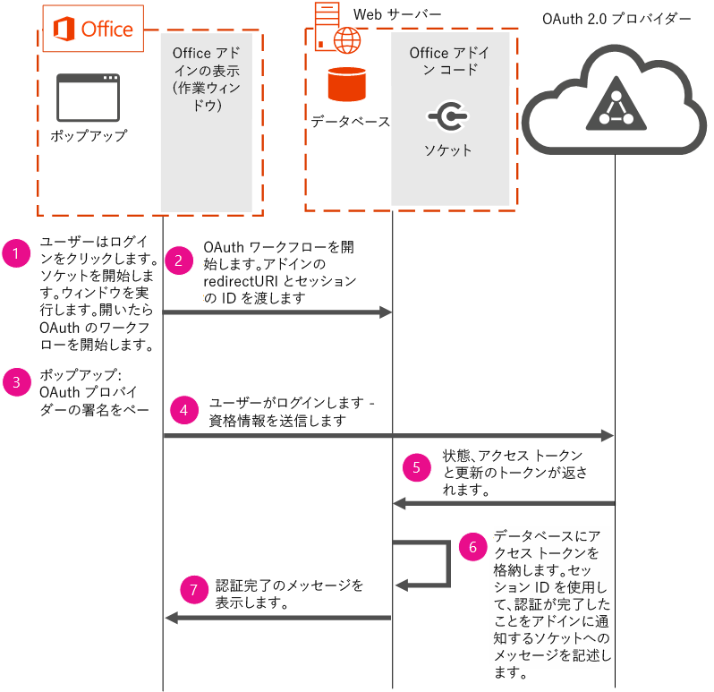

# <a name="use-the-oauth-authorization-framework-in-an-office-add-in"></a><span data-ttu-id="20242-102">Office アドインで OAuth 認証フレームワークを使用する</span><span class="sxs-lookup"><span data-stu-id="20242-102">Use the OAuth authorization framework in an Office Add-in</span></span>

<span data-ttu-id="20242-p101">OAuth は、Office 365、Facebook、Google、SalesForce、LinkedIn などのオンライン サービス プロバイダーがユーザー認証を実行するのに使用する認証のオープン標準です。OAuth 認証フレームワークは、Azure と Office 365 で使用される既定の認証プロトコルです。OAuth 認証フレームワークは、エンタープライズ (企業) とコンシューマー シナリオの両方で使用されます。</span><span class="sxs-lookup"><span data-stu-id="20242-p101">OAuth is the open standard for authorization that online service providers such as Office 365, Facebook, Google, SalesForce, LinkedIn and others use to perform user authentication. The OAuth authorization framework is the default authorization protocol used in Azure and Office 365. The OAuth authorization framework is used in both enterprise (corporate) and consumer scenarios.</span></span>

<span data-ttu-id="20242-106">オンライン サービス プロバイダーは、REST 経由で公開されているパブリック API を提供している場合あります。</span><span class="sxs-lookup"><span data-stu-id="20242-106">Online service providers may provide public APIs exposed via REST.</span></span> <span data-ttu-id="20242-107">開発者は、Office アドインでこれらのパブリック API を使用し、オンライン サービス プロバイダーのデータを読み取ったり書き込んだりすることができます。</span><span class="sxs-lookup"><span data-stu-id="20242-107">Developers can use these public APIs in their Office Add-ins to read or write data to the online service provider.</span></span> <span data-ttu-id="20242-108">オンライン サービス プロバイダーからのデータを統合すると、アドインの価値が高まり、ユーザーの採用が増えます。</span><span class="sxs-lookup"><span data-stu-id="20242-108">Integrating data from online service providers in an add-in increases its value, which leads to greater user adoption.</span></span> <span data-ttu-id="20242-109">アドインでこれらの API を使用する場合、ユーザーは OAuth 認証フレームワークを使用して認証される必要があります。</span><span class="sxs-lookup"><span data-stu-id="20242-109">When using these APIs in your add-in, users will be required to authenticate using the OAuth authorization framework.</span></span>

<span data-ttu-id="20242-p103">このトピックでは、アドインで認証フローを実装して、ユーザー認証を実行する方法について説明します。このトピックに含まれているコード セグメントは、[Office-Add-in-NodeJS-ServerAuth](https://github.com/OfficeDev/Office-Add-in-NodeJS-ServerAuth) のコード サンプルから採用されています。</span><span class="sxs-lookup"><span data-stu-id="20242-p103">This topic describes how to implement an authentication flow in your add-in to perform user authentication. Code segments included in this topic are taken from the [Office-Add-in-NodeJS-ServerAuth](https://github.com/OfficeDev/Office-Add-in-NodeJS-ServerAuth) code sample.</span></span>

> [!NOTE]
> <span data-ttu-id="20242-p104">セキュリティ上の理由から、ブラウザーは IFrame のサインイン ページを表示できません。お客様が使用している Office のバージョンによって、特に Web ベースのバージョンによっては、アドインは IFrame で表示されます。これは、認証フローを管理する方法におけるいくつかの考慮事項を提起します。 </span><span class="sxs-lookup"><span data-stu-id="20242-p104">For security reasons, browsers are not allowed to display sign-in pages in an IFrame. Depending on the version of Office that your customers use, most notably web-based versions, your add-in is displayed in an IFrame. This imposes some considerations on how to manage the authentication flow.</span></span> 

<span data-ttu-id="20242-115">次のダイアグラムは、必要なコンポーネントと、アドインで認証を実装するときに発生するイベントのフローを示します。</span><span class="sxs-lookup"><span data-stu-id="20242-115">The following diagram shows the required components and the flow of events that occur when implementing authentication in your add-in.</span></span>



<span data-ttu-id="20242-117">ダイアグラムは、次の必要なコンポーネントを使用する方法を示しています。</span><span class="sxs-lookup"><span data-stu-id="20242-117">The diagram shows how the following required components are used:</span></span>


- <span data-ttu-id="20242-p105">Office は作業ウィンドウ アドインをユーザーのコンピューター上で実行します。アドインは、認証フローを開始するためのポップアップ ウィンドウを開きます。使用するプラットホームによりますが、アドインは IFRAME で実行される可能性があるため、アドインが認証フローを直接開始することはできません。セキュリティ上の理由から、OAuth サインイン ページは IFRAME に表示できません。</span><span class="sxs-lookup"><span data-stu-id="20242-p105">Office runs a task pane add-in on the user's computer. Your add-in opens a pop-up window to start the authentication flow. Add-ins cannot start authentication flows directly because add-ins, depending on the platform used, may run in an IFRAME. For security reasons, OAuth sign-in pages can't be displayed in an IFRAME.</span></span> 
    
- <span data-ttu-id="20242-p106">Web サーバーはアドインのコードをホストします。このコード サンプルでは、ユーザーのアクセス トークンを格納するために Web サーバーで実行されているデータベース サーバーを使用します。アクセス トークンの保持が必要です。そうすれば、ポップアップ ウィンドウを使用して認証が完了した後、メインのアドインのページが同じトークンを使用してオンライン サービスからのデータにアクセスできます。アドインまたはポップアップから渡される情報に依存できないため、サーバー側のオプションを使用してトークンを保存することが必要です。</span><span class="sxs-lookup"><span data-stu-id="20242-p106">A web server hosts your add-in's code. This code sample uses a database server running on the web server to store the user's access token. Persisting the access token is necessary so that after authentication completes using the pop-up window, the main add-in's pages can use the same tokens to access data from the online service. Saving the tokens by using server-side options is necessary because you can't rely on information passed from the add-in or the pop-up.</span></span>
    
- <span data-ttu-id="20242-126">OAuth 2.0 プロバイダーはユーザー認証を行います。</span><span class="sxs-lookup"><span data-stu-id="20242-126">The OAuth 2.0 provider performs user authentication.</span></span>
    

    
> [!IMPORTANT]
> <span data-ttu-id="20242-p107">アクセス トークンは作業ウィンドウに返すことはできませんが、サーバー上で使用することができます。このコード サンプルでは、アクセス トークンはデータベースに 2 分間保存されます。2 分後、トークンは、データベースから削除され、ユーザーは再認証するよう求められます。独自の実装でこの期間を変更する前に、2 分よりも長い期間データベースにアクセス トークンを格納する場合のセキュリティ上のリスクを考慮してください。</span><span class="sxs-lookup"><span data-stu-id="20242-p107">Access tokens can't be returned to the task pane, but they can be used on the server. In this code sample, the access tokens are stored in the database for 2 minutes. After 2 minutes, tokens are purged from the database and users are prompted to re-authenticate. Before changing this time period in your own implementation, consider the security risks associated with storing access tokens in a database for a time period that is longer than 2 minutes.</span></span>


## <a name="step-1---start-socket-and-open-a-pop-up-window"></a><span data-ttu-id="20242-131">手順 1 - ソケットを開始してポップアップ ウィンドウを開く</span><span class="sxs-lookup"><span data-stu-id="20242-131">Step 1 - Start socket and open a pop-up window</span></span>

<span data-ttu-id="20242-p108">このコード サンプルを実行すると、Office で作業ウィンドウ アドインが表示されます。ユーザーがログインするのに OAuth プロバイダーを選択すると、アドインはまずソケットを作成します。このサンプルでは、アドインで優れたユーザー エクスペリエンスを提供するためにソケットを使用します。アドインは、ユーザーに認証の成否を伝達するためにソケットを使用します。ソケットを使用すれば、アドインのメイン ページは認証状態で簡単に更新され、ユーザーの操作またはポーリングを必要としません。routes/connect.js から取られた次のコード セグメントでは、ソケットを開始する方法を示します。ソケットには、アドインのセッション ID である **decodedNodeCookie** を使用して名前を付けます。このコード サンプルは、[socket.io](https://socket.io/) を使用してソケットを作成します。</span><span class="sxs-lookup"><span data-stu-id="20242-p108">When you run this code sample, a task pane add-in displays in Office. When the user chooses an OAuth provider to log into, the add-in first creates a socket. This sample uses a socket to provide a good user experience in the add-in. The add-in uses the socket to communicate the success or failure of the authentication to the user. By using a socket, the add-in's main page is easily updated with the authentication status, and doesn't require user interaction or polling. The following code segment, taken from routes/connect.js, shows how to start the socket. The socket is named using  **decodedNodeCookie**, which is the add-in's session ID. This code sample creates the socket by using [socket.io](https://socket.io/).</span></span>


```js
io.on('connection', function (socket) {
  console.log('Socket connection established');
  var jsonCookie =
    cookie.parse(socket
      .handshake
      .headers
      .cookie);
  var decodedNodeCookie =
    cookieParser
      .signedCookie(jsonCookie.nodecookie, '<Insert a random string>');
  console.log('Decoded cookie: ' + decodedNodeCookie);
  // The session ID becomes the room name for this session.
  socket.join(decodedNodeCookie);
  io.to(decodedNodeCookie).emit('init', 'Private socket session established');
});

```

<span data-ttu-id="20242-p109">次に、アドインはソケットに接続します。次のコードが /public/javascripts/client.js にあります。</span><span class="sxs-lookup"><span data-stu-id="20242-p109">Next, the add-in connects to the socket. The following code can be found in /public/javascripts/client.js.</span></span>


```js
var socket = io.connect('https://localhost:3001', { secure: true });
```

<span data-ttu-id="20242-p110">次に、アドインは、**window.open** を使用してユーザーのコンピューター上でポップアップ ウィンドウを開きます。**window.open** を実行する場合、リダイレクト URI とアドインのセッション ID が URL で渡されるようにします。アドインのセッション ID は、アドインの UI に認証状態情報を送信するときに、使用するソケットを指定するために使用されます。次のコード セグメントが、views/index.jade にあります。</span><span class="sxs-lookup"><span data-stu-id="20242-p110">Next, the add-in opens a pop-up window on the user's computer using  **window.open**. When running  **window.open**, ensure the redirect URI and session ID of the add-in is passed in the URL. The session ID of the add-in is used to identify the socket to use when sending authentication status information to the add-in's UI. The following code segment can be found in views/index.jade.</span></span>


```js
onclick="window.open('/connect/azure/#{sessionID}', 'AuthPopup', 'width=500,height=500,centerscreen=1,menubar=0,toolbar=0,location=0,personalbar=0,status=0,titlebar=0,dialog=1')")
```


## <a name="steps-2-amp-3---start-the-authentication-flow-and-show-the-sign-in-page"></a><span data-ttu-id="20242-146">手順 2 と 3 - 認証フローを開始して、サインイン ページを表示する</span><span class="sxs-lookup"><span data-stu-id="20242-146">Steps 2 &amp; 3 - Start the authentication flow and show the sign-in page</span></span>

<span data-ttu-id="20242-p111">アドインは認証フローを開始する必要があります。次のコード セグメントでは、Passport OAuth ライブラリを使用します。認証フローを開始するときは、OAuth プロバイダーの認証 URL と、アドインのセッション ID を渡すことを確認します。アドインのセッション ID は、State パラメーターで渡す必要があります。ポップアップ ウィンドウに、ユーザーがサインインするための OAuth プロバイダーのサインイン ページが表示されます。</span><span class="sxs-lookup"><span data-stu-id="20242-p111">The add-in must start the authentication flow. The code segment below uses the Passport OAuth library. When starting the authentication flow, ensure that you pass the authorization URL of the OAuth provider, and the session ID of the add-in. The session ID of the add-in must be passed in the state parameter. The pop-up window now displays the OAuth provider's sign-in page so that users can sign in.</span></span>


```js
router.get('/azure/:sessionID', function(req, res, next) { 
   passport.authenticate( 
     'azure',  
     { state: req.params.sessionID }, 

```


## <a name="steps-4-5-amp-6---user-signs-in-and-web-server-receives-tokens"></a><span data-ttu-id="20242-152">手順 4、5、6 - ユーザーがサインインして、Web サーバーでトークンを受信する</span><span class="sxs-lookup"><span data-stu-id="20242-152">Steps 4, 5 &amp; 6 - User signs in and web server receives tokens</span></span>

 <span data-ttu-id="20242-p112">正常にサインインした後で、アクセス トークン、リフレッシュ トークン、State パラメーターがアドインに返されます。State パラメーターには、セッション ID が含まれます。これは、手順 7 でソケットへ認証状態情報を送信するために使用されます。app.js から取られた次のコード セグメントは、データベースにアクセス トークンを格納します。</span><span class="sxs-lookup"><span data-stu-id="20242-p112">After a successful sign-in, an access token, refresh token, and state parameter are returned to the add-in. The state parameter contains the session ID, which is used to send authentication status information to the socket in step 7. The following code segment, taken from app.js, stores the access token in the database.</span></span>


```js
  dbHelperInstance.insertDoc(userData, null, 
         function (err, body) { 
           if (!err) { 
             console.log("Inserted session entry [" + userData.sessid + "] id: " + body.id); 
           } 
           done(err, userData); 
         }); 

```


## <a name="step-7---show-authentication-information-in-the-add-ins-ui"></a><span data-ttu-id="20242-156">手順 7 - アドインの UI で認証情報を表示する</span><span class="sxs-lookup"><span data-stu-id="20242-156">Step 7 - Show authentication information in the add-in's UI</span></span>

<span data-ttu-id="20242-p113">connect.js から取られた次のコード セグメントは、認証状態情報を使用してアドインの UI を更新します。手順 1 で作成されたソケットを使用して、アドインの UI が更新されます。</span><span class="sxs-lookup"><span data-stu-id="20242-p113">The following code segment, taken from connect.js, updates the add-in's UI with the authentication status information. The add-in's UI is updated by using the socket that was created in step 1.</span></span>


```js
  
       io.to(user.sessid).emit('auth_success', providers); 
       next(); 

```


## <a name="see-also"></a><span data-ttu-id="20242-159">関連項目</span><span class="sxs-lookup"><span data-stu-id="20242-159">See also</span></span>

- [<span data-ttu-id="20242-160">Node.js 用 Office アドインのサーバー認証サンプル</span><span class="sxs-lookup"><span data-stu-id="20242-160">Office Add-in Server Authentication Sample for Node.js</span></span>](https://github.com/OfficeDev/Office-Add-in-Nodejs-ServerAuth/blob/master/README.md)
    
