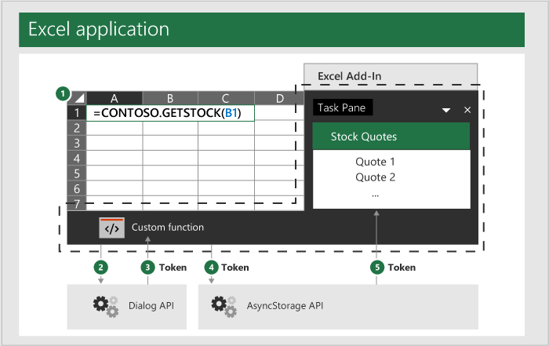

# <a name="authentication-for-ui-less-custom-functions"></a>UI レスカスタム関数の認証

一部のシナリオでは、作業ウィンドウまたは他のユーザー インターフェイス要素 (UI レスのカスタム関数) を使用しないカスタム関数は、保護されたリソースにアクセスするためにユーザーを認証する必要があります。 UI レスのカスタム関数は JavaScript 専用ランタイムで実行されます。 この理由から、JavaScript 専用ランタイムと、オブジェクトと Dialog API を使用するほとんどのアドインで使用される一般的なブラウザー エンジン ランタイムとの間でデータを前後に渡す必要があります。 `OfficeRuntime.storage`

[!include[Excel custom functions note](../includes/excel-custom-functions-note.md)]

[!include[Shared runtime note](../includes/shared-runtime-note.md)]

## <a name="officeruntimestorage-object"></a>OfficeRuntime.storage オブジェクト

UI レスのカスタム関数で使用される JavaScript 専用ランタイムは、通常はデータを格納するグローバル ウィンドウでオブジェクト `localStorage` を使用できません。 代わりに [、OfficeRuntime.storage](/javascript/api/office-runtime/officeruntime.storage) を使用してデータを設定および取得することで、UI レスのカスタム関数と作業ウィンドウ間でデータを共有する必要があります。

### <a name="suggested-usage"></a>おすすめの使用法

UI レスのカスタム関数から認証する必要がある場合は、アクセス トークンが既に取得 `storage` 済みか確認します。 取得されていない場合は、ダイアログ API を使用してユーザーを認証し、アクセストークンを取得して、後で使用するために `storage` に保存します。

## <a name="dialog-api"></a>ダイアログ API

トークンが存在しない場合は、ユーザーにサインインを求めるダイアログ API を表示する必要があります。 ユーザーが資格情報を入力すると、結果のアクセストークンが `storage` に保存されます。

> [!NOTE]
> JavaScript 専用ランタイムは、作業ウィンドウで使用されるブラウザー エンジン ランタイムの Dialog オブジェクトとは若干異なる Dialog オブジェクトを使用します。 これらはどちらも "Dialog API" と呼ばれますが、JavaScript 専用ランタイムでユーザーを認証 `OfficeRuntime.Dialog` するために使用します。

この基本的な手順を次の図に示します。 点線は、UI レスのカスタム関数とアドインの作業ウィンドウが、アドイン全体の両方の一部であり、個別のランタイムを使用します。

1. UI レスのカスタム関数呼び出しは、ブック内のセルからExcelします。
2. UI レスのカスタム関数は、ユーザー `Dialog` 資格情報を Web サイトに渡す場合に使用します。
3. この Web サイトは、UI レスのカスタム関数にアクセス トークンを返します。
4. その後、UI レスのカスタム関数は、このアクセス トークンを `storage` .
5. アドインの作業ウィンドウは、`storage` からトークンにアクセスします。



## <a name="storing-the-token"></a>トークンの格納

次の例は、[カスタム関数の OfficeRuntime.storage を使用 ](https://github.com/OfficeDev/PnP-OfficeAddins/tree/master/Excel-custom-functions/AsyncStorage)したコードサンプルです。 UI レスのカスタム関数と作業ウィンドウ間でデータを共有する完全な例については、このコード サンプルを参照してください。

UI レスのカスタム関数が認証された場合、アクセス トークンを受け取り、そのトークンを格納する必要があります `storage` 。 次のコードサンプルは、`storage.setItem`メソッドを呼び出して値を格納する方法を示します。 この関数は UI レスのカスタム関数で、たとえばユーザーの値 `storeValue` を格納します。 必要なトークン値を格納するように変更できます。

```js
/**
 * Stores a key-value pair into OfficeRuntime.storage.
 * @customfunction
 * @param {string} key Key of item to put into storage.
 * @param {*} value Value of item to put into storage.
 */
function storeValue(key, value) {
  return OfficeRuntime.storage.setItem(key, value).then(function (result) {
      return "Success: Item with key '" + key + "' saved to storage.";
  }, function (error) {
      return "Error: Unable to save item with key '" + key + "' to storage. " + error;
  });
}
```

作業ウィンドウにアクセストークンが必要な場合は、`storage`から トークンを取得できます。 次のコードサンプルは、`storage.getItem`メソッドを使用してトークンを取得する方法を示します。

```js
/**
 * Read a token from storage.
 * @customfunction GETTOKEN
 */
function receiveTokenFromCustomFunction() {
  var key = "token";
  var tokenSendStatus = document.getElementById('tokenSendStatus');
  OfficeRuntime.storage.getItem(key).then(function (result) {
     tokenSendStatus.value = "Success: Item with key '" + key + "' read from storage.";
     document.getElementById('tokenTextBox2').value = result;
  }, function (error) {
     tokenSendStatus.value = "Error: Unable to read item with key '" + key + "' from storage. " + error;
  });
}
```

## <a name="general-guidance"></a>一般的なガイダンス

Office アドインは web ベースで、あらゆる web 認証技術を使用できます。 UI レスのカスタム関数を使用して独自の認証を実装するために従う必要がある特定のパターンやメソッドはありません。 さまざまな認証パターンに関するドキュメントを参照してください。 [この記事では、外部サービスによる認証について説明します。](../develop/auth-external-add-ins.md)  

カスタム関数を開発する場合は、次の場所を使用してデータを格納しないようにします。

- `localStorage`: UI レスのカスタム関数はグローバル オブジェクトにアクセスできないので、に格納されている `window` データにアクセスできない `localStorage` 。
- `Office.context.document.settings`: この場所は安全ではないため、アドインを使用しているユーザーが情報を抽出できます。

## <a name="dialog-box-api-example"></a>ダイアログ ボックス API の例

次のコード サンプルでは、関数は API の関数を `getTokenViaDialog` `Dialog` 使用 `displayWebDialogOptions` してダイアログ ボックスを表示します。 このサンプルは、認証方法を示すのではなく、オブジェクトの機能 `Dialog` を示すサンプルです。

```JavaScript
/**
 * Function retrieves a cached token or opens a dialog box if there is no saved token. Note that this is not a sufficient example of authentication but is intended to show the capabilities of the Dialog object.
 * @param {string} url URL for a stored token.
 */
function getTokenViaDialog(url) {
  return new Promise (function (resolve, reject) {
    if (_dialogOpen) {
      // Can only have one dialog box open at once. Wait for previous dialog box's token.
      let timeout = 5;
      let count = 0;
      var intervalId = setInterval(function () {
        count++;
        if(_cachedToken) {
          resolve(_cachedToken);
          clearInterval(intervalId);
        }
        if(count >= timeout) {
          reject("Timeout while waiting for token");
          clearInterval(intervalId);
        }
      }, 1000);
    } else {
      _dialogOpen = true;
      OfficeRuntime.displayWebDialog(url, {
        height: '50%',
        width: '50%',
        onMessage: function (message, dialog) {
          _cachedToken = message;
          resolve(message);
          dialog.close();
          return;
        },
        onRuntimeError: function(error, dialog) {
          reject(error);
        },
      }).catch(function (e) {
        reject(e);
      });
    }
  });
}
```

## <a name="next-steps"></a>次の手順
UI レスの [カスタム関数をデバッグする方法について説明します](custom-functions-debugging.md)。

## <a name="see-also"></a>関連項目

* [UI レス のカスタム関数Excelランタイム](custom-functions-runtime.md)
* [Excel カスタム関数のチュートリアル](../tutorials/excel-tutorial-create-custom-functions.md)