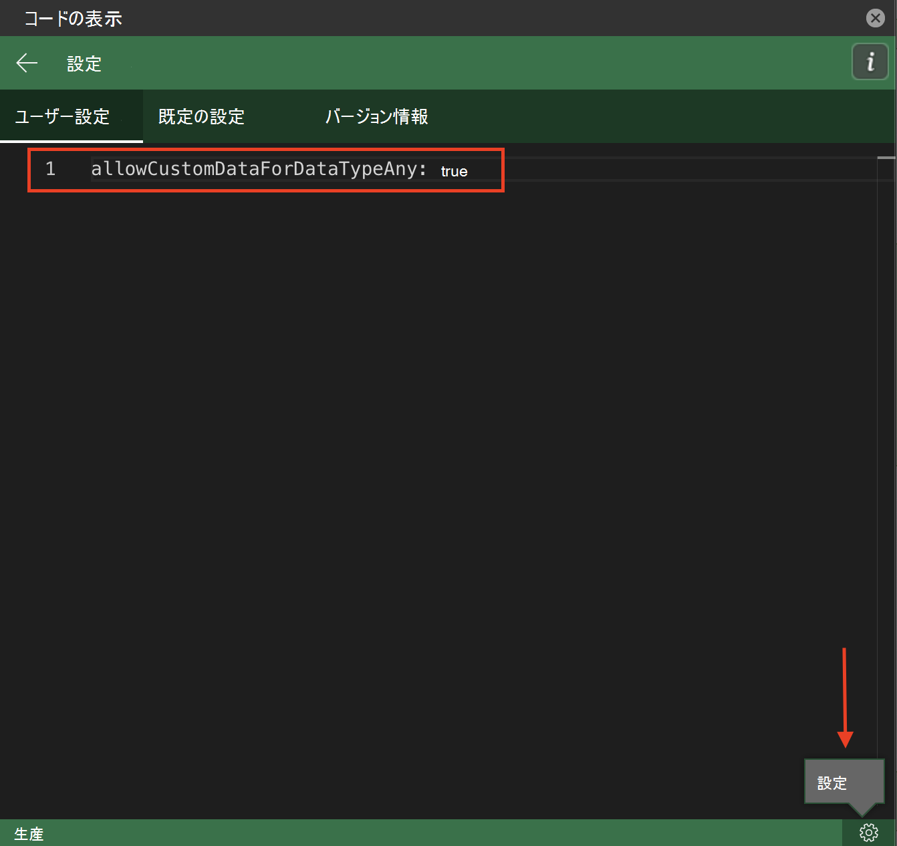

# <a name="use-data-types-with-custom-functions-in-excel-preview"></a>Excel のカスタム関数でデータ型を使用する (プレビュー)

[!include[Custom functions and data types availability note](../includes/excel-custom-functions-data-types-note.md)]

データ型は Excel JavaScript API を拡張して、元の 4 つのセル値タイプ (文字列、数値、ブール値、エラー) 以外のデータ型もサポートします。 データ型には、Web イメージ、書式設定された数値、エンティティ値、エンティティ値内の配列のサポートが含まれます。

これらのデータ型はカスタム関数の能力を強化します。というのは、カスタム関数が入力値と出力値の両方としてデータ型を受け入れるからです。 カスタム関数を使用してデータ型を生成することも、既存のデータ型を関数引数として計算に取り込んだりすることもできます。 データ型の JSON スキーマが設定されると、このスキーマは計算全体で維持されます。

Excel アドインでのデータ型の使用の詳細については、「[Excel アドインのデータ型の概要](excel-data-types-overview.md)」を参照してください。

## <a name="how-custom-functions-handle-data-types"></a>カスタム関数がデータ型を処理する方法

カスタム関数はデータ型を認識し、それらをパラメーター値として受け入れることができます。 カスタム関数は、戻り値の新しいデータ型を作成できます。 カスタム関数は、Excel JavaScript API と同じデータ型の JSON スキーマを使用し、この JSON スキーマは、カスタム関数が計算および評価するときに維持されます。

> [!NOTE]
> カスタム関数は、データ型によって提供される拡張エラー オブジェクトの全機能をサポートしていません。 カスタム関数はデータ型エラー オブジェクトを受け入れることができますが、計算全体を通じて維持されることはありません。 現時点では、カスタム関数は [CustomFunctions.Error オブジェクト](custom-functions-errors.md)に含まれるエラーのみをサポートしています。

## <a name="enable-data-types-for-custom-functions"></a>カスタム関数のデータ型を有効にする

この機能を使用するには、JSON メタデータを手動で更新する必要があります。 より一時的なテストの場合は、JSON メタデータを手動で更新する代わりに、Script Lab の設定をカスタマイズできます。 以下のセクションでは、これらの手順の概要を説明します。

### <a name="manually-update-json-metadata"></a>JSON メタデータを手動で更新する

カスタム関数プロジェクトには、JSON メタデータ ファイルが含まれています。 この JSON メタデータ ファイルは、データ型 API で使用される JSON スキーマとは異なります。 データ型とカスタム関数の統合を使用するには、カスタム関数の JSON メタデータ ファイルを手動で更新して、プロパティ `allowCustomDataForDataTypeAny` を含める必要があります。 このプロパティを `true` に設定します。

手動の JSON 作成プロセスの詳細については、「[カスタム関数の JSON メタデータを手動で作成する](custom-functions-json.md)」を参照してください。このプロパティの詳細については、「[allowCustomDataForDataTypeAny](custom-functions-json.md#allowcustomdatafordatatypeany-preview)」を参照してください。

### <a name="script-lab-option"></a>Script Lab オプション

前のセクションで説明した手動の JSON メタデータの更新に加えて、データ型とのカスタム関数の統合を Script Lab でのテストに使用できます。 Script Lab の詳細については、「[Script Lab を使用して Office JavaScript API を探索する](../overview/explore-with-script-lab.md)」を参照してください。 Script Lab でこの機能をテストするには、次の手順を使用して設定を更新します。

1. Script Lab の **[コード]** 作業ウィンドウを開きます。
1. 右下の **[設定]** ボタンを選択します。
1. **[ユーザー設定]** タブに移動し、`allowCustomDataForDataTypeAny: true` と入力します。



## <a name="output-a-formatted-number-value"></a>書式設定された数値を出力する

次のコード サンプルは、カスタム関数を使用して [FormattedNumberCellValue](/javascript/api/excel/excel.formattednumbercellvalue) データ型を作成する方法を示しています。 この関数は、基本数値と書式設定を入力パラメーターとして受け取り、書式設定された数値データ型を出力として返します。

```js
/**
 * Take a number as the input value and return a formatted number value as the output.
 * @customfunction
 * @param {number} value
 * @param {string} format (e.g. "0.00%")
 * @returns A formatted number value.
 */
function createFormattedNumber(value, format) {
    return {
        type: "FormattedNumber",
        basicValue: value,
        numberFormat: format
    }
}
```

## <a name="input-an-entity-value"></a>エンティティ値の入力

次のコード サンプルは、[EntityCellValue](/javascript/api/excel/excel.entitycellvalue) データ型を入力として受け取るカスタム関数を示しています。 `attribute` パラメータが `text` に設定されている場合、関数はエンティティ値の `text` プロパティを返します。 それ以外の場合、関数はエンティティ値の `basicValue` プロパティを返します。

```js
/**
 * Accept an entity value data type as a function input.
 * @customfunction
 * @param {any} value
 * @param {string} attribute
 * @returns {any} The text value of the entity.
 */
function getEntityAttribute(value, attribute) {
    if (value.type == "Entity") {
        if (attribute == "text") {
            return value.text;
        } else {
            return value.properties[attribute].basicValue;
        }
    } else {
        return JSON.stringify(value);
    }
}
```

## <a name="see-also"></a>関連項目

* [Excel アドインのデータ型の概要](excel-data-types-overview.md)
* [Excel データ型の主要概念](excel-data-types-concepts.md)
* [共有ランタイムを使用するように Office アドインを構成する](../develop/configure-your-add-in-to-use-a-shared-runtime.md)
