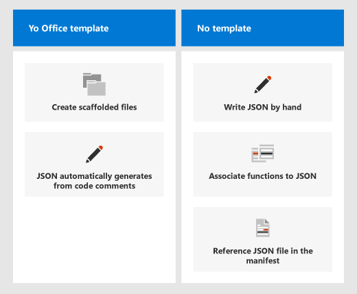

# <a name="manually-create-json-metadata-for-custom-functions"></a><span data-ttu-id="4ac8a-103">カスタム関数の JSON メタデータを手動で作成する</span><span class="sxs-lookup"><span data-stu-id="4ac8a-103">Manually create JSON metadata for custom functions</span></span>

<span data-ttu-id="4ac8a-104">カスタム関数の [概要](custom-functions-overview.md) の記事で説明されているように、カスタム関数プロジェクトには、JSON メタデータファイルとスクリプト (JavaScript または TypeScript) の両方を含める必要があります。関数を登録するには、このファイルを使用できるようにします。</span><span class="sxs-lookup"><span data-stu-id="4ac8a-104">As described in the [custom functions overview](custom-functions-overview.md) article, a custom functions project must include both a JSON metadata file and a script (either JavaScript or TypeScript) file to register a function, making it available for use.</span></span> <span data-ttu-id="4ac8a-105">ユーザーが初めてアドインを実行したときに、すべてのブックの同じユーザーがそのアドインを使用できるようになると、カスタム関数が登録されます。</span><span class="sxs-lookup"><span data-stu-id="4ac8a-105">Custom functions are registered when the user runs the add-in for the first time and after that are available to the same user in all workbooks.</span></span>

[!include[Excel custom functions note](../includes/excel-custom-functions-note.md)]

<span data-ttu-id="4ac8a-106">Json ファイルを作成する代わりに、可能な場合は json 自動生成を使用することをお勧めします。</span><span class="sxs-lookup"><span data-stu-id="4ac8a-106">We recommend using JSON autogeneration when possible instead of creating your own JSON file.</span></span> <span data-ttu-id="4ac8a-107">Autogeneration は、ユーザーエラーが発生しにくく、 `yo office` スキャフォールディングファイルに既に含まれています。</span><span class="sxs-lookup"><span data-stu-id="4ac8a-107">Autogeneration is less prone to user error and the `yo office` scaffolded files already include this.</span></span> <span data-ttu-id="4ac8a-108">JSDoc タグと JSON 自動生成プロセスの詳細については、「 [カスタム関数の json メタデータの](custom-functions-json-autogeneration.md)自動生成」を参照してください。</span><span class="sxs-lookup"><span data-stu-id="4ac8a-108">For more information on JSDoc tags and the JSON autogeneration process, see [Autogenerate JSON metadata for custom functions](custom-functions-json-autogeneration.md).</span></span>

<span data-ttu-id="4ac8a-109">ただし、カスタム関数プロジェクトを最初から作成することができます。</span><span class="sxs-lookup"><span data-stu-id="4ac8a-109">However, you can make a custom functions project from scratch.</span></span> <span data-ttu-id="4ac8a-110">このプロセスでは、次のことを行う必要があります。</span><span class="sxs-lookup"><span data-stu-id="4ac8a-110">This process requires you to:</span></span>

- <span data-ttu-id="4ac8a-111">JSON ファイルを作成します。</span><span class="sxs-lookup"><span data-stu-id="4ac8a-111">Write your JSON file.</span></span>
- <span data-ttu-id="4ac8a-112">マニフェストファイルが JSON ファイルに接続されていることを確認します。</span><span class="sxs-lookup"><span data-stu-id="4ac8a-112">Check that your manifest file is connected to your JSON file.</span></span>
- <span data-ttu-id="4ac8a-113">関数を `id` `name` 登録するために、スクリプトファイルの関数とプロパティを関連付けます。</span><span class="sxs-lookup"><span data-stu-id="4ac8a-113">Associate your functions' `id` and `name` properties in the script file in order to register your functions.</span></span>

<span data-ttu-id="4ac8a-114">次の図は、スキャフォールディングファイルを使用すること `yo office` と、JSON を一から作成することの違いについて説明しています。</span><span class="sxs-lookup"><span data-stu-id="4ac8a-114">The following image explains the differences between using `yo office` scaffold files and writing JSON from scratch.</span></span>



> [!NOTE]
> <span data-ttu-id="4ac8a-116">ジェネレーターを使用しない `<Resources>` 場合は、XML マニフェストファイルのセクションを使用して、作成した JSON ファイルにマニフェストを必ず接続してください `yo office` 。</span><span class="sxs-lookup"><span data-stu-id="4ac8a-116">Remember to connect your manifest to the JSON file you create, through the `<Resources>` section in your XML manifest file if you do not use the `yo office` generator.</span></span>

## <a name="authoring-metadata-and-connecting-to-the-manifest"></a><span data-ttu-id="4ac8a-117">メタデータの作成とマニフェストへの接続</span><span class="sxs-lookup"><span data-stu-id="4ac8a-117">Authoring metadata and connecting to the manifest</span></span>

<span data-ttu-id="4ac8a-118">プロジェクトで JSON ファイルを作成し、関数のパラメーターなど、関数に関するすべての詳細情報を提供します。</span><span class="sxs-lookup"><span data-stu-id="4ac8a-118">Create a JSON file in your project and provide all the details about your functions in it, such as the function's parameters.</span></span> <span data-ttu-id="4ac8a-119">関数プロパティの完全なリストについては、 [次のメタデータの例](#json-metadata-example) と [メタデータリファレンス](#metadata-reference) を参照してください。</span><span class="sxs-lookup"><span data-stu-id="4ac8a-119">See the [following metadata example](#json-metadata-example) and [the metadata reference](#metadata-reference) for a complete list of function properties.</span></span>

<span data-ttu-id="4ac8a-120">次の例に示すように、XML マニフェストファイルで、セクション内の JSON ファイルを参照するようにし `<Resources>` ます。</span><span class="sxs-lookup"><span data-stu-id="4ac8a-120">Ensure your XML manifest file references your JSON file in the `<Resources>` section, similar to the following example.</span></span>

```json
<Resources>
    <bt:Urls>
        <bt:Url id="JSON-URL" DefaultValue="https://subdomain.contoso.com/config/customfunctions.json"/>
        <bt:Url id="JS-URL" DefaultValue="https://subdomain.contoso.com/dist/win32/ship/index.win32.bundle"/>
            <bt:Url id="HTML-URL" DefaultValue="https://subdomain.contoso.com/index.html"/>
    </bt:Urls>
    <bt:ShortStrings>
        <bt:String id="namespace" DefaultValue="CONTOSO"/>
    </bt:ShortStrings>
</Resources>
```

## <a name="json-metadata-example"></a><span data-ttu-id="4ac8a-121">JSON メタデータの例</span><span class="sxs-lookup"><span data-stu-id="4ac8a-121">JSON metadata example</span></span>

<span data-ttu-id="4ac8a-122">次の例では、カスタム関数を定義するアドインの JSON メタデータ ファイルの内容を示します。</span><span class="sxs-lookup"><span data-stu-id="4ac8a-122">The following example shows the contents of a JSON metadata file for an add-in that defines custom functions.</span></span> <span data-ttu-id="4ac8a-123">この例の後に続くセクションでは、JSON の例に含まれる個々のプロパティの詳細について説明します。</span><span class="sxs-lookup"><span data-stu-id="4ac8a-123">The sections that follow this example provide detailed information about the individual properties within this JSON example.</span></span>

```json
{
  "functions": [
    {
      "id": "ADD",
      "name": "ADD",
      "description": "Add two numbers",
      "helpUrl": "http://www.contoso.com/help",
      "result": {
        "type": "number",
        "dimensionality": "scalar"
      },
      "parameters": [
        {
          "name": "first",
          "description": "first number to add",
          "type": "number",
          "dimensionality": "scalar"
        },
        {
          "name": "second",
          "description": "second number to add",
          "type": "number",
          "dimensionality": "scalar"
        }
      ]
    },
    {
      "id": "GETDAY",
      "name": "GETDAY",
      "description": "Get the day of the week",
      "helpUrl": "http://www.contoso.com/help",
      "result": {
        "dimensionality": "scalar"
      },
      "parameters": []
    },
    {
      "id": "INCREMENTVALUE",
      "name": "INCREMENTVALUE",
      "description": "Count up from zero",
      "helpUrl": "http://www.contoso.com/help",
      "result": {
        "dimensionality": "scalar"
      },
      "parameters": [
        {
          "name": "increment",
          "description": "the number to be added each time",
          "type": "number",
          "dimensionality": "scalar"
        }
      ],
      "options": {
        "stream": true,
        "cancelable": true
      }
    },
    {
      "id": "SECONDHIGHEST",
      "name": "SECONDHIGHEST",
      "description": "Get the second highest number from a range",
      "helpUrl": "http://www.contoso.com/help",
      "result": {
        "dimensionality": "scalar"
      },
      "parameters": [
        {
          "name": "range",
          "description": "the input range",
          "type": "number",
          "dimensionality": "matrix"
        }
      ]
    }
  ]
}
```

> [!NOTE]
> <span data-ttu-id="4ac8a-124">完全なサンプル JSON ファイルは、 [Officedev/Excel-カスタム機能](https://github.com/OfficeDev/Excel-Custom-Functions/blob/77760adb1dcc53469183049bea08196734dbc114/config/customfunctions.json) GitHub リポジトリのコミット履歴で入手できます。</span><span class="sxs-lookup"><span data-stu-id="4ac8a-124">A complete sample JSON file is available in the [OfficeDev/Excel-Custom-Functions](https://github.com/OfficeDev/Excel-Custom-Functions/blob/77760adb1dcc53469183049bea08196734dbc114/config/customfunctions.json) GitHub repository's commit history.</span></span> <span data-ttu-id="4ac8a-125">JSON を自動的に生成するようにプロジェクトが調整されているため、手書きの JSON の完全なサンプルは、プロジェクトの以前のバージョンでのみ使用できます。</span><span class="sxs-lookup"><span data-stu-id="4ac8a-125">As the project has been adjusted to automatically generate JSON, a full sample of handwritten JSON is only available in previous versions of the project.</span></span>

## <a name="metadata-reference"></a><span data-ttu-id="4ac8a-126">メタデータリファレンス</span><span class="sxs-lookup"><span data-stu-id="4ac8a-126">Metadata reference</span></span>

### <a name="functions"></a><span data-ttu-id="4ac8a-127">functions</span><span class="sxs-lookup"><span data-stu-id="4ac8a-127">functions</span></span>

<span data-ttu-id="4ac8a-128">`functions` プロパティは、カスタム関数オブジェクトの配列です。</span><span class="sxs-lookup"><span data-stu-id="4ac8a-128">The `functions` property is an array of custom function objects.</span></span> <span data-ttu-id="4ac8a-129">次の表に、各オブジェクトのプロパティを示します。</span><span class="sxs-lookup"><span data-stu-id="4ac8a-129">The following table lists the properties of each object.</span></span>

| <span data-ttu-id="4ac8a-130">プロパティ</span><span class="sxs-lookup"><span data-stu-id="4ac8a-130">Property</span></span>      | <span data-ttu-id="4ac8a-131">データ型</span><span class="sxs-lookup"><span data-stu-id="4ac8a-131">Data type</span></span> | <span data-ttu-id="4ac8a-132">必須</span><span class="sxs-lookup"><span data-stu-id="4ac8a-132">Required</span></span> | <span data-ttu-id="4ac8a-133">説明</span><span class="sxs-lookup"><span data-stu-id="4ac8a-133">Description</span></span>                                                                                                                                                                      |
| :------------ | :-------- | :------- | :------------------------------------------------------------------------------------------------------------------------------------------------------------------------------- |
| `description` | <span data-ttu-id="4ac8a-134">string</span><span class="sxs-lookup"><span data-stu-id="4ac8a-134">string</span></span>    | <span data-ttu-id="4ac8a-135">いいえ</span><span class="sxs-lookup"><span data-stu-id="4ac8a-135">No</span></span>       | <span data-ttu-id="4ac8a-136">Excel でエンド ユーザーに表示される関数の説明です。</span><span class="sxs-lookup"><span data-stu-id="4ac8a-136">The description of the function that end users see in Excel.</span></span> <span data-ttu-id="4ac8a-137">たとえば、「 **華氏の値を摂氏に変換する** 」です。</span><span class="sxs-lookup"><span data-stu-id="4ac8a-137">For example, **Converts a Celsius value to Fahrenheit**.</span></span>                                                            |
| `helpUrl`     | <span data-ttu-id="4ac8a-138">文字列</span><span class="sxs-lookup"><span data-stu-id="4ac8a-138">string</span></span>    | <span data-ttu-id="4ac8a-139">いいえ</span><span class="sxs-lookup"><span data-stu-id="4ac8a-139">No</span></span>       | <span data-ttu-id="4ac8a-140">関数に関する情報を提供する URL です </span><span class="sxs-lookup"><span data-stu-id="4ac8a-140">URL that provides information about the function.</span></span> <span data-ttu-id="4ac8a-141">(作業ウィンドウに表示されます)。たとえば、`http://contoso.com/help/convertcelsiustofahrenheit.html` です。</span><span class="sxs-lookup"><span data-stu-id="4ac8a-141">(It is displayed in a task pane.) For example, `http://contoso.com/help/convertcelsiustofahrenheit.html`.</span></span>                      |
| `id`          | <span data-ttu-id="4ac8a-142">文字列</span><span class="sxs-lookup"><span data-stu-id="4ac8a-142">string</span></span>    | <span data-ttu-id="4ac8a-143">はい</span><span class="sxs-lookup"><span data-stu-id="4ac8a-143">Yes</span></span>      | <span data-ttu-id="4ac8a-144">関数の一意の ID です。</span><span class="sxs-lookup"><span data-stu-id="4ac8a-144">A unique ID for the function.</span></span> <span data-ttu-id="4ac8a-145">この ID には、英数字とピリオドしか使用できません。また、設定後に変更してはいけません。</span><span class="sxs-lookup"><span data-stu-id="4ac8a-145">This ID can only contain alphanumeric characters and periods and should not be changed after it is set.</span></span>                                            |
| `name`        | <span data-ttu-id="4ac8a-146">文字列</span><span class="sxs-lookup"><span data-stu-id="4ac8a-146">string</span></span>    | <span data-ttu-id="4ac8a-147">はい</span><span class="sxs-lookup"><span data-stu-id="4ac8a-147">Yes</span></span>      | <span data-ttu-id="4ac8a-148">Excel でエンド ユーザーに表示される関数の名前です。</span><span class="sxs-lookup"><span data-stu-id="4ac8a-148">The name of the function that end users see in Excel.</span></span> <span data-ttu-id="4ac8a-149">Excel では、この関数名は、XML マニフェストファイルで指定されているカスタム関数の名前空間でプレフィックスされます。</span><span class="sxs-lookup"><span data-stu-id="4ac8a-149">In Excel, this function name is prefixed by the custom functions namespace that's specified in the XML manifest file.</span></span> |
| `options`     | <span data-ttu-id="4ac8a-150">オブジェクト</span><span class="sxs-lookup"><span data-stu-id="4ac8a-150">object</span></span>    | <span data-ttu-id="4ac8a-151">いいえ</span><span class="sxs-lookup"><span data-stu-id="4ac8a-151">No</span></span>       | <span data-ttu-id="4ac8a-152">Excel で関数を実行する方法とタイミングの一部をユーザーがカスタマイズできます。</span><span class="sxs-lookup"><span data-stu-id="4ac8a-152">Enables you to customize some aspects of how and when Excel executes the function.</span></span> <span data-ttu-id="4ac8a-153">詳細については、[options](#options) に関する説明を参照してください。</span><span class="sxs-lookup"><span data-stu-id="4ac8a-153">See [options](#options) for details.</span></span>                                                          |
| `parameters`  | <span data-ttu-id="4ac8a-154">配列</span><span class="sxs-lookup"><span data-stu-id="4ac8a-154">array</span></span>     | <span data-ttu-id="4ac8a-155">はい</span><span class="sxs-lookup"><span data-stu-id="4ac8a-155">Yes</span></span>      | <span data-ttu-id="4ac8a-156">関数の入力パラメーターを定義する配列です。</span><span class="sxs-lookup"><span data-stu-id="4ac8a-156">Array that defines the input parameters for the function.</span></span> <span data-ttu-id="4ac8a-157">詳細については、「 [parameters](#parameters) 」を参照してください。</span><span class="sxs-lookup"><span data-stu-id="4ac8a-157">See [parameters](#parameters) for details.</span></span>                                                                             |
| `result`      | <span data-ttu-id="4ac8a-158">object</span><span class="sxs-lookup"><span data-stu-id="4ac8a-158">object</span></span>    | <span data-ttu-id="4ac8a-159">はい</span><span class="sxs-lookup"><span data-stu-id="4ac8a-159">Yes</span></span>      | <span data-ttu-id="4ac8a-160">関数が返す情報の種類を定義するオブジェクトです。</span><span class="sxs-lookup"><span data-stu-id="4ac8a-160">Object that defines the type of information that is returned by the function.</span></span> <span data-ttu-id="4ac8a-161">詳細については、[result](#result) に関する説明を参照してください。</span><span class="sxs-lookup"><span data-stu-id="4ac8a-161">See [result](#result) for details.</span></span>                                                                 |

### <a name="options"></a><span data-ttu-id="4ac8a-162">options</span><span class="sxs-lookup"><span data-stu-id="4ac8a-162">options</span></span>

<span data-ttu-id="4ac8a-163">`options` オブジェクトでは、Excel で関数を実行する方法とタイミングの一部をユーザーがカスタマイズできます。</span><span class="sxs-lookup"><span data-stu-id="4ac8a-163">The `options` object enables you to customize some aspects of how and when Excel executes the function.</span></span> <span data-ttu-id="4ac8a-164">次の表に、`options` オブジェクトのプロパティを示します。</span><span class="sxs-lookup"><span data-stu-id="4ac8a-164">The following table lists the properties of the `options` object.</span></span>

| <span data-ttu-id="4ac8a-165">プロパティ</span><span class="sxs-lookup"><span data-stu-id="4ac8a-165">Property</span></span>          | <span data-ttu-id="4ac8a-166">データ型</span><span class="sxs-lookup"><span data-stu-id="4ac8a-166">Data type</span></span> | <span data-ttu-id="4ac8a-167">必須</span><span class="sxs-lookup"><span data-stu-id="4ac8a-167">Required</span></span>                               | <span data-ttu-id="4ac8a-168">説明</span><span class="sxs-lookup"><span data-stu-id="4ac8a-168">Description</span></span> |
| :---------------- | :-------- | :------------------------------------- | :---------- |
| `cancelable`      | <span data-ttu-id="4ac8a-169">ブール</span><span class="sxs-lookup"><span data-stu-id="4ac8a-169">boolean</span></span>   | <span data-ttu-id="4ac8a-170">いいえ</span><span class="sxs-lookup"><span data-stu-id="4ac8a-170">No</span></span><br/><br/><span data-ttu-id="4ac8a-171">既定値は、`false` です。</span><span class="sxs-lookup"><span data-stu-id="4ac8a-171">Default value is `false`.</span></span>  | <span data-ttu-id="4ac8a-172">`true` の場合、手動での再計算のトリガーや、関数によって参照されているセルの編集など、関数をキャンセルする効果のある操作をユーザーが実行すると、Excel によって `CancelableInvocation` ハンドラーが呼び出されます。</span><span class="sxs-lookup"><span data-stu-id="4ac8a-172">If `true`, Excel calls the `CancelableInvocation` handler whenever the user takes an action that has the effect of canceling the function; for example, manually triggering recalculation or editing a cell that is referenced by the function.</span></span> <span data-ttu-id="4ac8a-173">通常、取り消し可能な関数は、1つの結果を返す非同期関数で、データの要求のキャンセルを処理する必要がある場合にのみ使用されます。</span><span class="sxs-lookup"><span data-stu-id="4ac8a-173">Cancelable functions are typically only used for asynchronous functions that return a single result and need to handle the cancellation of a request for data.</span></span> <span data-ttu-id="4ac8a-174">関数は、ストリーミングと取り消しの両方にすることはできません。</span><span class="sxs-lookup"><span data-stu-id="4ac8a-174">A function cannot be both streaming and cancelable.</span></span> <span data-ttu-id="4ac8a-175">詳細については、「 [ストリーミング機能を作成する](custom-functions-web-reqs.md#make-a-streaming-function)」の最後の方にあるメモを参照してください。</span><span class="sxs-lookup"><span data-stu-id="4ac8a-175">For more information, see the note near the end of [Make a streaming function](custom-functions-web-reqs.md#make-a-streaming-function).</span></span> |
| `requiresAddress` | <span data-ttu-id="4ac8a-176">ブール</span><span class="sxs-lookup"><span data-stu-id="4ac8a-176">boolean</span></span>   | <span data-ttu-id="4ac8a-177">いいえ</span><span class="sxs-lookup"><span data-stu-id="4ac8a-177">No</span></span> <br/><br/><span data-ttu-id="4ac8a-178">既定値は、`false` です。</span><span class="sxs-lookup"><span data-stu-id="4ac8a-178">Default value is `false`.</span></span> | <span data-ttu-id="4ac8a-179">の場合は、カスタム関数を `true` 呼び出したセルのアドレスにカスタム関数からアクセスできます。</span><span class="sxs-lookup"><span data-stu-id="4ac8a-179">If `true`, your custom function can access the address of the cell that invoked your custom function.</span></span> <span data-ttu-id="4ac8a-180">カスタム関数を呼び出したセルのアドレスを取得するには、カスタム関数で context を使用します。</span><span class="sxs-lookup"><span data-stu-id="4ac8a-180">To get the address of the cell that invoked your custom function, use context.address in your custom function.</span></span> <span data-ttu-id="4ac8a-181">カスタム関数は、streaming と requiresAddress の両方として設定することはできません。</span><span class="sxs-lookup"><span data-stu-id="4ac8a-181">Custom functions cannot be set as both streaming and requiresAddress.</span></span> <span data-ttu-id="4ac8a-182">このオプションを使用する場合、' 呼び ' パラメーターは、オプションで渡された最後のパラメーターである必要があります。</span><span class="sxs-lookup"><span data-stu-id="4ac8a-182">When using this option, the 'invocation' parameter must be the last parameter passed in options.</span></span> |
| `stream`          | <span data-ttu-id="4ac8a-183">ブール</span><span class="sxs-lookup"><span data-stu-id="4ac8a-183">boolean</span></span>   | <span data-ttu-id="4ac8a-184">いいえ</span><span class="sxs-lookup"><span data-stu-id="4ac8a-184">No</span></span><br/><br/><span data-ttu-id="4ac8a-185">既定値は、`false` です。</span><span class="sxs-lookup"><span data-stu-id="4ac8a-185">Default value is `false`.</span></span>  | <span data-ttu-id="4ac8a-186">`true` の場合、1 回のみ呼び出されたときにも、関数はセルに繰り返し出力できます。</span><span class="sxs-lookup"><span data-stu-id="4ac8a-186">If `true`, the function can output repeatedly to the cell even when invoked only once.</span></span> <span data-ttu-id="4ac8a-187">このオプションは、株価などの急速に変化するデータ ソースに便利です。</span><span class="sxs-lookup"><span data-stu-id="4ac8a-187">This option is useful for rapidly-changing data sources, such as a stock price.</span></span> <span data-ttu-id="4ac8a-188">この関数には、`return` ステートメントは含めないようにする必要があります。</span><span class="sxs-lookup"><span data-stu-id="4ac8a-188">The function should have no `return` statement.</span></span> <span data-ttu-id="4ac8a-189">代わりに、結果の値は `StreamingInvocation.setResult` コールバック メソッドの引数として渡されます。</span><span class="sxs-lookup"><span data-stu-id="4ac8a-189">Instead, the result value is passed as the argument of the `StreamingInvocation.setResult` callback method.</span></span> <span data-ttu-id="4ac8a-190">詳細については、「[ストリーミング関数](custom-functions-web-reqs.md#make-a-streaming-function)」を参照してください。</span><span class="sxs-lookup"><span data-stu-id="4ac8a-190">For more information, see [Streaming functions](custom-functions-web-reqs.md#make-a-streaming-function).</span></span> |
| `volatile`        | <span data-ttu-id="4ac8a-191">ブール</span><span class="sxs-lookup"><span data-stu-id="4ac8a-191">boolean</span></span>   | <span data-ttu-id="4ac8a-192">いいえ</span><span class="sxs-lookup"><span data-stu-id="4ac8a-192">No</span></span> <br/><br/><span data-ttu-id="4ac8a-193">既定値は、`false` です。</span><span class="sxs-lookup"><span data-stu-id="4ac8a-193">Default value is `false`.</span></span> | <span data-ttu-id="4ac8a-194">場合は、 `true` 数式の依存値が変更されたときだけでなく、Excel が再計算するたびに関数が再計算されます。</span><span class="sxs-lookup"><span data-stu-id="4ac8a-194">If `true`, the function recalculates each time Excel recalculates, instead of only when the formula's dependent values have changed.</span></span> <span data-ttu-id="4ac8a-195">関数は、ストリーミングと揮発性の両方にすることはできません。</span><span class="sxs-lookup"><span data-stu-id="4ac8a-195">A function cannot be both streaming and volatile.</span></span> <span data-ttu-id="4ac8a-196">`stream` と `volatile` の両方のプロパティが `true` に設定されている場合は、揮発性のオプションが無視されます。</span><span class="sxs-lookup"><span data-stu-id="4ac8a-196">If the `stream` and `volatile` properties are both set to `true`, the volatile option will be ignored.</span></span> |

### <a name="parameters"></a><span data-ttu-id="4ac8a-197">parameters</span><span class="sxs-lookup"><span data-stu-id="4ac8a-197">parameters</span></span>

<span data-ttu-id="4ac8a-198">`parameters` プロパティは、パラメーター オブジェクトの配列です。</span><span class="sxs-lookup"><span data-stu-id="4ac8a-198">The `parameters` property is an array of parameter objects.</span></span> <span data-ttu-id="4ac8a-199">次の表に、各オブジェクトのプロパティを示します。</span><span class="sxs-lookup"><span data-stu-id="4ac8a-199">The following table lists the properties of each object.</span></span>

|  <span data-ttu-id="4ac8a-200">プロパティ</span><span class="sxs-lookup"><span data-stu-id="4ac8a-200">Property</span></span>  |  <span data-ttu-id="4ac8a-201">データ型</span><span class="sxs-lookup"><span data-stu-id="4ac8a-201">Data type</span></span>  |  <span data-ttu-id="4ac8a-202">必須</span><span class="sxs-lookup"><span data-stu-id="4ac8a-202">Required</span></span>  |  <span data-ttu-id="4ac8a-203">説明</span><span class="sxs-lookup"><span data-stu-id="4ac8a-203">Description</span></span>  |
|:-----|:-----|:-----|:-----|
|  `description`  |  <span data-ttu-id="4ac8a-204">string</span><span class="sxs-lookup"><span data-stu-id="4ac8a-204">string</span></span>  |  <span data-ttu-id="4ac8a-205">いいえ</span><span class="sxs-lookup"><span data-stu-id="4ac8a-205">No</span></span> |  <span data-ttu-id="4ac8a-206">パラメーターの説明です。</span><span class="sxs-lookup"><span data-stu-id="4ac8a-206">A description of the parameter.</span></span> <span data-ttu-id="4ac8a-207">これは、Excel の IntelliSense に表示されます。</span><span class="sxs-lookup"><span data-stu-id="4ac8a-207">This is displayed in Excel's IntelliSense.</span></span>  |
|  `dimensionality`  |  <span data-ttu-id="4ac8a-208">文字列</span><span class="sxs-lookup"><span data-stu-id="4ac8a-208">string</span></span>  |  <span data-ttu-id="4ac8a-209">いいえ</span><span class="sxs-lookup"><span data-stu-id="4ac8a-209">No</span></span>  |  <span data-ttu-id="4ac8a-210">**スカラー** (配列以外の値) または **マトリックス** (2 次元配列) のいずれかである必要があります。</span><span class="sxs-lookup"><span data-stu-id="4ac8a-210">Must be either **scalar** (a non-array value) or **matrix** (a 2-dimensional array).</span></span>  |
|  `name`  |  <span data-ttu-id="4ac8a-211">文字列</span><span class="sxs-lookup"><span data-stu-id="4ac8a-211">string</span></span>  |  <span data-ttu-id="4ac8a-212">はい</span><span class="sxs-lookup"><span data-stu-id="4ac8a-212">Yes</span></span>  |  <span data-ttu-id="4ac8a-213">パラメーターの名前です。</span><span class="sxs-lookup"><span data-stu-id="4ac8a-213">The name of the parameter.</span></span> <span data-ttu-id="4ac8a-214">この名前は、Excel の IntelliSense に表示されます。</span><span class="sxs-lookup"><span data-stu-id="4ac8a-214">This name is displayed in Excel's IntelliSense.</span></span>  |
|  `type`  |  <span data-ttu-id="4ac8a-215">文字列</span><span class="sxs-lookup"><span data-stu-id="4ac8a-215">string</span></span>  |  <span data-ttu-id="4ac8a-216">いいえ</span><span class="sxs-lookup"><span data-stu-id="4ac8a-216">No</span></span>  |  <span data-ttu-id="4ac8a-217">パラメーターのデータ型です。</span><span class="sxs-lookup"><span data-stu-id="4ac8a-217">The data type of the parameter.</span></span> <span data-ttu-id="4ac8a-218">**boolean** 、 **number** 、 **string** 、または **any** が可能です。ここでは、前の 3 種類のいずれかを使用できます。</span><span class="sxs-lookup"><span data-stu-id="4ac8a-218">Can be **boolean** , **number** , **string** , or **any** , which allows you to use of any of the previous three types.</span></span> <span data-ttu-id="4ac8a-219">このプロパティが指定されていない場合、データ型の既定は **any** です。</span><span class="sxs-lookup"><span data-stu-id="4ac8a-219">If this property is not specified, the data type defaults to **any**.</span></span> |
|  `optional`  | <span data-ttu-id="4ac8a-220">ブール</span><span class="sxs-lookup"><span data-stu-id="4ac8a-220">boolean</span></span> | <span data-ttu-id="4ac8a-221">いいえ</span><span class="sxs-lookup"><span data-stu-id="4ac8a-221">No</span></span> | <span data-ttu-id="4ac8a-222">`true` の場合、パラメーターは省略可能です。</span><span class="sxs-lookup"><span data-stu-id="4ac8a-222">If `true`, the parameter is optional.</span></span> |
|`repeating`| <span data-ttu-id="4ac8a-223">ブール</span><span class="sxs-lookup"><span data-stu-id="4ac8a-223">boolean</span></span> | <span data-ttu-id="4ac8a-224">いいえ</span><span class="sxs-lookup"><span data-stu-id="4ac8a-224">No</span></span> | <span data-ttu-id="4ac8a-225">If は `true` 、指定された配列からパラメーターを設定します。</span><span class="sxs-lookup"><span data-stu-id="4ac8a-225">If `true`, parameters populate from a specified array.</span></span> <span data-ttu-id="4ac8a-226">すべての繰り返しパラメーターは、定義によって省略可能なパラメーターとして扱われることに注意してください。</span><span class="sxs-lookup"><span data-stu-id="4ac8a-226">Note that functions all repeating parameters are considered optional parameters by definition.</span></span>  |

### <a name="result"></a><span data-ttu-id="4ac8a-227">result</span><span class="sxs-lookup"><span data-stu-id="4ac8a-227">result</span></span>

<span data-ttu-id="4ac8a-228">`result` オブジェクトは、この関数が返す情報の種類を定義します。</span><span class="sxs-lookup"><span data-stu-id="4ac8a-228">The `result` object defines the type of information that is returned by the function.</span></span> <span data-ttu-id="4ac8a-229">次の表に、`result` オブジェクトのプロパティを示します。</span><span class="sxs-lookup"><span data-stu-id="4ac8a-229">The following table lists the properties of the `result` object.</span></span>

| <span data-ttu-id="4ac8a-230">プロパティ</span><span class="sxs-lookup"><span data-stu-id="4ac8a-230">Property</span></span>         | <span data-ttu-id="4ac8a-231">データ型</span><span class="sxs-lookup"><span data-stu-id="4ac8a-231">Data type</span></span> | <span data-ttu-id="4ac8a-232">必須</span><span class="sxs-lookup"><span data-stu-id="4ac8a-232">Required</span></span> | <span data-ttu-id="4ac8a-233">説明</span><span class="sxs-lookup"><span data-stu-id="4ac8a-233">Description</span></span>                                                                          |
| :--------------- | :-------- | :------- | :----------------------------------------------------------------------------------- |
| `dimensionality` | <span data-ttu-id="4ac8a-234">string</span><span class="sxs-lookup"><span data-stu-id="4ac8a-234">string</span></span>    | <span data-ttu-id="4ac8a-235">いいえ</span><span class="sxs-lookup"><span data-stu-id="4ac8a-235">No</span></span>       | <span data-ttu-id="4ac8a-236">**スカラー** (配列以外の値) または **マトリックス** (2 次元配列) のいずれかである必要があります。</span><span class="sxs-lookup"><span data-stu-id="4ac8a-236">Must be either **scalar** (a non-array value) or **matrix** (a 2-dimensional array).</span></span> |

## <a name="associating-function-names-with-json-metadata"></a><span data-ttu-id="4ac8a-237">関数名を JSON メタデータに関連付ける</span><span class="sxs-lookup"><span data-stu-id="4ac8a-237">Associating function names with JSON metadata</span></span>

<span data-ttu-id="4ac8a-238">関数が正しく動作するには、関数のプロパティを JavaScript 実装に関連付ける必要があり `id` ます。</span><span class="sxs-lookup"><span data-stu-id="4ac8a-238">For a function to work properly, you need to associate the function's `id` property with the JavaScript implementation.</span></span> <span data-ttu-id="4ac8a-239">関連付けがあることを確認してください。そうしないと、関数は登録されず、Excel で使用できません。</span><span class="sxs-lookup"><span data-stu-id="4ac8a-239">Make sure there is an association, otherwise the function won't be registered and isn't useable in Excel.</span></span> <span data-ttu-id="4ac8a-240">次のコードサンプルは、メソッドを使用して関連付けを行う方法を示して `CustomFunctions.associate()` います。</span><span class="sxs-lookup"><span data-stu-id="4ac8a-240">The following code sample shows how to make the association using the `CustomFunctions.associate()` method.</span></span> <span data-ttu-id="4ac8a-241">このサンプルではカスタム関数 `add` を定義し、それを `id` プロパティ値が **ADD** の、JSON メタデータ ファイル内のオブジェクトに関連付けます。</span><span class="sxs-lookup"><span data-stu-id="4ac8a-241">The sample defines the custom function `add` and associates it with the object in the JSON metadata file where the value of the `id` property is **ADD**.</span></span>

```js
/**
 * Add two numbers
 * @customfunction
 * @param {number} first First number
 * @param {number} second Second number
 * @returns {number} The sum of the two numbers.
 */
function add(first, second) {
  return first + second;
}

CustomFunctions.associate("ADD", add);
```

<span data-ttu-id="4ac8a-242">次の JSON は、以前のカスタム関数 JavaScript コードに関連付けられている JSON メタデータを示しています。</span><span class="sxs-lookup"><span data-stu-id="4ac8a-242">The following JSON shows the JSON metadata that is associated with the previous custom function JavaScript code.</span></span>

```json
{
  "functions": [
    {
      "description": "Add two numbers",
      "id": "ADD",
      "name": "ADD",
      "parameters": [
        {
          "description": "First number",
          "name": "first",
          "type": "number"
        },
        {
          "description": "Second number",
          "name": "second",
          "type": "number"
        }
      ],
      "result": {
        "type": "number"
      }
    }
  ]
}
```

<span data-ttu-id="4ac8a-243">JavaScript ファイルでカスタム関数を作成し、JSON のメタデータ ファイルに対応する情報を指定するときは、次のベスト プラクティスに留意してください。</span><span class="sxs-lookup"><span data-stu-id="4ac8a-243">Keep in mind the following best practices when creating custom functions in your JavaScript file and specifying corresponding information in the JSON metadata file.</span></span>

- <span data-ttu-id="4ac8a-244">JSON のメタデータ ファイルにそれぞれの `id` プロパティには、英数字とピリオドのみが含まれています。</span><span class="sxs-lookup"><span data-stu-id="4ac8a-244">In the JSON metadata file, ensure that the value of each `id` property contains only alphanumeric characters and periods.</span></span>

- <span data-ttu-id="4ac8a-245">JSON のメタデータ ファイルで、各 `id` プロパティの値が、ファイルのスコープ内で一意であることを確認します。</span><span class="sxs-lookup"><span data-stu-id="4ac8a-245">In the JSON metadata file, ensure that the value of each `id` property is unique within the scope of the file.</span></span> <span data-ttu-id="4ac8a-246">すなわち、メタデータ ファイル内の 2 つの関数オブジェクトは同じ `id` 値であってはいけません。</span><span class="sxs-lookup"><span data-stu-id="4ac8a-246">That is, no two function objects in the metadata file should have the same `id` value.</span></span>

- <span data-ttu-id="4ac8a-247">対応する JavaScript 関数の名前に関連付けられた後では、JSON のメタデータ ファイル内の `id` プロパティの値を変更しないでください。</span><span class="sxs-lookup"><span data-stu-id="4ac8a-247">Do not change the value of an `id` property in the JSON metadata file after it's been associated with a corresponding JavaScript function name.</span></span> <span data-ttu-id="4ac8a-248">JSON のメタデータ ファイル内の `name` プロパティを更新することによって Excel でエンド ユーザーに表示される関数の名前を変更することができます。しかし、確立された後は、 `id` プロパティの値を決して変更しないでください。</span><span class="sxs-lookup"><span data-stu-id="4ac8a-248">You can change the function name that end users see in Excel by updating the `name` property within the JSON metadata file, but you should never change the value of an `id` property after it's been established.</span></span>

- <span data-ttu-id="4ac8a-249">JavaScript ファイルで、各関数の後に、カスタム関数の関連付けを指定し `CustomFunctions.associate` ます。</span><span class="sxs-lookup"><span data-stu-id="4ac8a-249">In the JavaScript file, specify a custom function association using `CustomFunctions.associate` after each function.</span></span>

<span data-ttu-id="4ac8a-250">次の例は、前の JavaScript コードサンプルで定義されている関数に対応する JSON メタデータを示しています。</span><span class="sxs-lookup"><span data-stu-id="4ac8a-250">The following sample shows the JSON metadata that corresponds to the functions defined in the preceding JavaScript code sample.</span></span> <span data-ttu-id="4ac8a-251">`id`プロパティと `name` プロパティの値は、大文字で記述します。これは、カスタム関数を記述するときのベストプラクティスです。</span><span class="sxs-lookup"><span data-stu-id="4ac8a-251">The `id` and `name` property values are in uppercase, which is a best practice when describing your custom functions.</span></span> <span data-ttu-id="4ac8a-252">この JSON を追加する必要があるのは、自動生成を使用せずに、手動で独自の JSON ファイルを準備する場合だけです。</span><span class="sxs-lookup"><span data-stu-id="4ac8a-252">You only need to add this JSON if you are preparing your own JSON file manually and not using autogeneration.</span></span> <span data-ttu-id="4ac8a-253">Autogeneration の詳細については、「 [カスタム関数の JSON メタデータの](custom-functions-json-autogeneration.md)自動生成」を参照してください。</span><span class="sxs-lookup"><span data-stu-id="4ac8a-253">For more information on autogeneration, see [Autogenerate JSON metadata for custom functions](custom-functions-json-autogeneration.md).</span></span>

```json
{
  "$schema": "https://developer.microsoft.com/en-us/json-schemas/office-js/custom-functions.schema.json",
  "functions": [
    {
      "id": "ADD",
      "name": "ADD",
      ...
    },
    {
      "id": "INCREMENT",
      "name": "INCREMENT",
      ...
    }
  ]
}
```

## <a name="next-steps"></a><span data-ttu-id="4ac8a-254">次の手順</span><span class="sxs-lookup"><span data-stu-id="4ac8a-254">Next steps</span></span>

<span data-ttu-id="4ac8a-255">[関数に名前を付けるためのベストプラクティス](custom-functions-naming.md)、または前述の手書き JSON メソッドを使用して[関数をローカライズ](custom-functions-localize.md)する方法について説明します。</span><span class="sxs-lookup"><span data-stu-id="4ac8a-255">Learn the [best practices for naming your function](custom-functions-naming.md) or discover how to [localize your function](custom-functions-localize.md) using the previously described handwritten JSON method.</span></span>

## <a name="see-also"></a><span data-ttu-id="4ac8a-256">関連項目</span><span class="sxs-lookup"><span data-stu-id="4ac8a-256">See also</span></span>

- [<span data-ttu-id="4ac8a-257">カスタム関数用の JSON メタデータの自動生成</span><span class="sxs-lookup"><span data-stu-id="4ac8a-257">Autogenerate JSON metadata for custom functions</span></span>](custom-functions-json-autogeneration.md)
- [<span data-ttu-id="4ac8a-258">カスタム関数のパラメータオプション</span><span class="sxs-lookup"><span data-stu-id="4ac8a-258">Custom functions parameter options</span></span>](custom-functions-parameter-options.md)
- [<span data-ttu-id="4ac8a-259">Excel でカスタム関数を作成する</span><span class="sxs-lookup"><span data-stu-id="4ac8a-259">Create custom functions in Excel</span></span>](custom-functions-overview.md)
