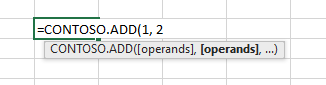

# <a name="custom-functions-parameter-options"></a>カスタム関数のパラメータオプション

カスタム関数は、さまざまなパラメーターのオプションを使用して構成できます。

[!include[Excel custom functions note](../includes/excel-custom-functions-note.md)]

## <a name="optional-parameters"></a>オプションのパラメーター

通常のパラメーターは必須ですが、省略可能なパラメーターは必須ではありません。 ユーザーが Excel で関数を呼び出すと、角かっこで囲まれた省略可能なパラメーターが表示されます。 次の例では、add 関数で3番目の番号を追加することもできます。 この関数は Excel `=CONTOSO.ADD(first, second, [third])`のように表示されます。

#### <a name="javascript"></a>[JavaScript](#tab/javascript)

```js
/**
 * Calculates the sum of the specified numbers
 * @customfunction
 * @param {number} first First number.
 * @param {number} second Second number.
 * @param {number} [third] Third number to add. If omitted, third = 0.
 * @returns {number} The sum of the numbers.
 */
function add(first, second, third) {
  if (third === null) {
    third = 0;
  }
  return first + second + third;
}
```

#### <a name="typescript"></a>[TypeScript](#tab/typescript)

```typescript
/**
 * Calculates the sum of the specified numbers
 * @customfunction
 * @param first First number.
 * @param second Second number.
 * @param [third] Third number to add. If omitted, third = 0.
 * @returns The sum of the numbers.
 */
function add(first: number, second: number, third?: number): number {
  if (third === null) {
    third = 0;
  }
  return first + second + third;
}
```

---

> [!NOTE]
> 省略可能なパラメーターに値が指定されていない場合、 `null`Excel によって値が割り当てられます。 これは、TypeScript の既定の初期化されたパラメーターが期待どおりに動作しないことを意味します。 そのため、この構文`function add(first:number, second:number, third=0):number`は0に初期化`third`されないため、使用しないでください。 その代わりに、前の例のように TypeScript 構文を使用します。

1つ以上のオプションパラメーターを含む関数を定義するときは、省略可能なパラメーターが null の場合の処理を指定する必要があります。 次の例の `zipCode` と `dayOfWeek` は、どちらも `getWeatherReport` 関数の省略可能なパラメーターです。 `zipCode`パラメーターが null の場合、既定値はに`98052`設定されます。 `dayOfWeek`パラメーターが null の場合は、水曜日に設定します。

#### <a name="javascript"></a>[JavaScript](#tab/javascript)

```js
/**
 * Gets a weather report for a specified zipCode and dayOfWeek
 * @customfunction
 * @param {number} [zipCode] Zip code. If omitted, zipCode = 98052.
 * @param {string} [dayOfWeek] Day of the week. If omitted, dayOfWeek = Wednesday.
 * @returns {string} Weather report for the day of the week in that zip code.
 */
function getWeatherReport(zipCode, dayOfWeek) {
  if (zipCode === null) {
    zipCode = 98052;
  }

  if (dayOfWeek === null) {
    dayOfWeek = "Wednesday";
  }

  // Get weather report for specified zipCode and dayOfWeek.
  // ...
}
```

#### <a name="typescript"></a>[TypeScript](#tab/typescript)

```typescript
/**
 * Gets a weather report for a specified zipCode and dayOfWeek
 * @customfunction
 * @param zipCode Zip code. If omitted, zipCode = 98052.
 * @param [dayOfWeek] Day of the week. If omitted, dayOfWeek = Wednesday.
 * @returns Weather report for the day of the week in that zip code.
 */
function getWeatherReport(zipCode?: number, dayOfWeek?: string): string {
  if (zipCode === null) {
    zipCode = 98052;
  }

  if (dayOfWeek === null) {
    dayOfWeek = "Wednesday";
  }

  // Get weather report for specified zipCode and dayOfWeek.
  // ...
}
```

---

## <a name="range-parameters"></a>範囲パラメーター

カスタム関数は、入力パラメーターとして範囲のセルデータを受け入れることができます。 関数は、データの範囲を返すこともできます。 Excel は、セルデータの範囲を2次元配列として渡します。

例えば、関数が Excel に保存されている数値の範囲から 2 番目に大きい値を返すとします。 次の関数は、`Excel.CustomFunctionDimensionality.matrix` 型の `values` パラメーターを受け入れます。 この関数の JSON メタデータでは、パラメーターの`type`プロパティがに`matrix`設定されていることに注意してください。

```js
/**
 * Returns the second highest value in a matrixed range of values.
 * @customfunction
 * @param {number[][]} values Multiple ranges of values.
 */
function secondHighest(values) {
  let highest = values[0][0],
    secondHighest = values[0][0];
  for (var i = 0; i < values.length; i++) {
    for (var j = 0; j < values[i].length; j++) {
      if (values[i][j] >= highest) {
        secondHighest = highest;
        highest = values[i][j];
      } else if (values[i][j] >= secondHighest) {
        secondHighest = values[i][j];
      }
    }
  }
  return secondHighest;
}
```

## <a name="repeating-parameters"></a>繰り返しパラメーター

繰り返しパラメーターを使用すると、ユーザーは関数に一連のオプションの引数を入力できます。 関数が呼び出されると、パラメーターの配列に値が提供されます。 パラメーター名が数値で終わる場合、各引数は、などの数値をインクリメントし`ADD(number1, [number2], [number3],…)`ます。 これは、Excel の組み込み関数で使用される規則に一致します。

次の関数は、合計数、セルの住所、および範囲 (入力した場合) を合計します。

```TS
/**
* The sum of all of the numbers.
* @customfunction
* @param operands A number (such as 1 or 3.1415), a cell address (such as A1 or $E$11), or a range of cell addresses (such as B3:F12)
*/

function ADD(operands: number[][][]): number {
  let total: number = 0;

  operands.forEach(range => {
    range.forEach(row => {
      row.forEach(num => {
        total += num;
      });
    });
  });

  return total;
}
```

この関数は`=CONTOSO.ADD([operands], [operands]...)` 、Excel ブックに表示されます。



### <a name="repeating-single-value-parameter"></a>繰り返し単一値パラメータ

繰り返し単一の値のパラメーターを使用すると、複数の単一の値を渡すことができます。 たとえば、ユーザーは、「ADD (1, B2, 3)」と入力することができます。 次の例は、単一の値のパラメーターを宣言する方法を示しています。

```JS
/**
 * @customfunction
 * @param {number[]} singleValue An array of numbers that are repeating parameters.
 */
function addSingleValue(singleValue) {
  let total = 0;
  singleValue.forEach(value => {
    total += value;
  })

  return total;
}
```

### <a name="single-range-parameter"></a>単一範囲のパラメーター

単精度浮動小数点型 (single) のパラメーターは、技術的には繰り返しパラメーターではありませんが、宣言は繰り返しパラメーターによく似ているので、ここに記載されています。 ユーザーには、Excel から1つの範囲が渡される追加 (A2: B3) として表示されます。 次の例は、1つの range パラメーターを宣言する方法を示しています。

```JS
/**
 * @customfunction
 * @param {number[][]} singleRange
 */
function addSingleRange(singleRange) {
  let total = 0;
  singleRange.forEach(setOfSingleValues => {
    setOfSingleValues.forEach(value => {
      total += value;
    })
  })
  return total;
}
```

### <a name="repeating-range-parameter"></a>繰り返し範囲のパラメーター

繰り返し範囲パラメーターを使用すると、複数の範囲または数値を渡すことができます。 たとえば、ユーザーは ADD (5、B2、C3、8、E5: E8) を入力することができます。 通常、繰り返し範囲は3次元の`number[][][]`行列として型で指定されます。 サンプルについては、繰り返しパラメーター (#repeating パラメーター) の主なサンプルを参照してください。


### <a name="declaring-repeating-parameters"></a>繰り返しパラメーターの宣言
Typescript で、パラメーターが多次元であることを示します。 たとえば、 `ADD(values: number[])`は1次元配列`ADD(values:number[][])`を示し、2次元配列というように指定します。

JavaScript では、 `@param values {number[]}` 1 次元`@param <name> {number[][]}`配列、2次元配列、およびその他の次元で使用します。

手動で作成した JSON では、パラメーターが JSON `"repeating": true`ファイルで指定されていること、およびパラメーターがにマークさ`"dimensionality": matrix`れていることを確認することを確認してください。

>[!NOTE]
>繰り返しパラメーターを含む関数には、最後のパラメーターとして、呼び出しパラメーターが自動的に含まれています。 呼び出しパラメーターの詳細については、以下のセクションを参照してください。

## <a name="invocation-parameter"></a>呼び出しパラメーター

すべてのカスタム関数には、 `invocation`最後の引数として引数が自動的に渡されます。 この引数は、呼び出し元のセルのアドレスなど、追加のコンテキストを取得するために使用できます。 また、関数[をキャンセル](custom-functions-web-reqs.md#make-a-streaming-function)する関数ハンドラーなど、Excel に情報を送信するために使用することもできます。 パラメーターを宣言しない場合でも、カスタム関数にはこのパラメーターがあります。 この引数は、Excel のユーザーには表示されません。 カスタム関数でを使用`invocation`する場合は、最後のパラメーターとして宣言します。

次のコードサンプルでは、 `invocation`コンテキストが参照に対して明示的に指定されています。

```js
/**
 * Add two numbers.
 * @customfunction
 * @param {number} first First number.
 * @param {number} second Second number.
 * @returns {number} The sum of the two (or optionally three) numbers.
 */
function add(first, second, invocation) {
  return first + second;
}
```

このパラメーターを使用すると、呼び出し元のセルのコンテキストを取得できます。これは、[カスタム関数を呼び出すセルのアドレスを検索](#addressing-cells-context-parameter)するなどの一部のシナリオで役立ちます。

### <a name="addressing-cells-context-parameter"></a>アドレス指定セルのコンテキストパラメーター

場合によっては、カスタム関数を呼び出したセルのアドレスを取得する必要があります。 これは、次のシナリオで役立ちます。

- 範囲の書式設定: セルのアドレスをキーとして使用し、データを保存します[。](../excel/custom-functions-runtime.md#storing-and-accessing-data) Excel で [onCalculated](/javascript/api/excel/excel.worksheet#oncalculated) を使用して`OfficeRuntime.storage` からキーを読み込みます。
- キャッシュされた値を表示させる: 関数がオフラインで使用される場合、`onCalculated` を使用して `OfficeRuntime.storage` に格納されているキャッシュされた値を表示します。
- 調整: セル アドレスを使用して元のセルを検出し、処理が発生している場所での調整を行えます。

関数内のアドレス指定セルのコンテキストを要求するには、次の例のように、関数を使用してセルのアドレスを検索する必要があります。 セルのアドレスに関する情報は、関数のコメント`@requiresAddress`にタグ付けされている場合にのみ公開されます。

```js
/**
 * Function that gets the address of a cell.
 * @customfunction
 * @param {CustomFunctions.Invocation} invocation Uses the invocation parameter present in each cell.
 * @requiresAddress
 * @returns {string} Returns address of cell.
 */

function getAddress(invocation) {
  return invocation.address;
}
```

既定では、`getAddress` 関数が返す値は次の形式に従います: `SheetName!CellNumber`。 たとえば、ある関数が Expenses という名前のシートのセル B2 から呼び出される場合の戻り値は `Expenses!B2` になります。

## <a name="next-steps"></a>次の手順

カスタム関数の[状態を保存](custom-functions-save-state.md)する方法、または[カスタム関数で揮発性の値](custom-functions-volatile.md)を使用する方法について説明します。

## <a name="see-also"></a>関連項目

* [カスタム関数でデータを受信して​​処理する](custom-functions-web-reqs.md)
* [カスタム関数のメタデータ](custom-functions-json.md)
* [カスタム関数用の JSON メタデータの自動生成](custom-functions-json-autogeneration.md)
* [Excel でカスタム関数を作成する](custom-functions-overview.md)
* [Excel カスタム関数のチュートリアル](../tutorials/excel-tutorial-create-custom-functions.md)