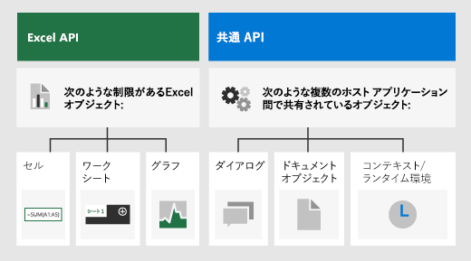

# <a name="advanced-programming-concepts-with-the-excel-javascript-api"></a><span data-ttu-id="f0045-103">Excel JavaScript API を使用した高度なプログラミングの概念</span><span class="sxs-lookup"><span data-stu-id="f0045-103">Advanced programming concepts with the Excel JavaScript API</span></span>

<span data-ttu-id="f0045-104">この記事では、「[Excel JavaScript API を使用した基本的なプログラミングの概念](excel-add-ins-core-concepts.md)」の情報を基にして、より高度な概念をいくつか説明します。これらは Excel 2016 以降の複雑なアドインを構築するために不可欠です。</span><span class="sxs-lookup"><span data-stu-id="f0045-104">This article builds upon the information in [Fundamental programming concepts with the Excel JavaScript API](excel-add-ins-core-concepts.md) to describe some of the more advanced concepts that are essential to building complex add-ins for Excel 2016 or later.</span></span>

## <a name="officejs-apis-for-excel"></a><span data-ttu-id="f0045-105">Excel 用の Office.js API</span><span class="sxs-lookup"><span data-stu-id="f0045-105">Office.js APIs for Excel</span></span>

<span data-ttu-id="f0045-106">Excel アドインは、次の 2 つの JavaScript オブジェクト モデルを含む Office JavaScript API を使用して、Excel のオブジェクトを操作します。</span><span class="sxs-lookup"><span data-stu-id="f0045-106">An Excel add-in interacts with objects in Excel by using the Office JavaScript API, which includes two JavaScript object models:</span></span>

* <span data-ttu-id="f0045-107">**Excel JavaScript API**:Office 2016 で導入された [Excel JavaScript API](../reference/overview/excel-add-ins-reference-overview.md) には、ワークシート、範囲、表、グラフなどへのアクセスに使用できる、厳密に型指定されたオブジェクトが用意されています。</span><span class="sxs-lookup"><span data-stu-id="f0045-107">**Excel JavaScript API**: Introduced with Office 2016, the [Excel JavaScript API](../reference/overview/excel-add-ins-reference-overview.md) provides strongly-typed objects that you can use to access worksheets, ranges, tables, charts, and more.</span></span>

* <span data-ttu-id="f0045-108">**共通 API**: Office 2013 で導入された[共通 API](/javascript/api/office) を使用すると、複数の種類の Office アプリケーション間で共通の UI、ダイアログ、クライアント設定などの機能にアクセスすることができます。</span><span class="sxs-lookup"><span data-stu-id="f0045-108">**Common APIs**: Introduced with Office 2013, the [Common API](/javascript/api/office) can be used to access features such as UI, dialogs, and client settings that are common across multiple types of Office applications.</span></span>

<span data-ttu-id="f0045-109">Excel 2016 以降を対象にしたアドインでは、機能の大部分を Excel JavaScript API を使用して開発する可能性がありますが、共通 API のオブジェクトも使用します。</span><span class="sxs-lookup"><span data-stu-id="f0045-109">While you'll likely use the Excel JavaScript API to develop the majority of functionality in add-ins that target Excel 2016 or later, you'll also use objects in the Common API.</span></span> <span data-ttu-id="f0045-110">例:</span><span class="sxs-lookup"><span data-stu-id="f0045-110">For example:</span></span>

- <span data-ttu-id="f0045-p102">[Context](/javascript/api/office/office.context): `Context`Context`contentLanguage` オブジェクトは、アドインのランタイム環境を表し、API の主要なオブジェクトへのアクセスを提供します。 これは `officeTheme` や `host` などのブック構成の詳細で構成され、`platform` や `requirements.isSetSupported()` などのアドインのランタイム環境に関する情報も提供します。 さらに、 メソッドも提供されます。これを使用すると、指定した要件セットが、アドインが実行されている Excel アプリケーションでサポートされているかどうかを確認できます。</span><span class="sxs-lookup"><span data-stu-id="f0045-p102">[Context](/javascript/api/office/office.context): The `Context` object represents the runtime environment of the add-in and provides access to key objects of the API. It consists of workbook configuration details such as `contentLanguage` and `officeTheme` and also provides information about the add-in's runtime environment such as `host` and `platform`. Additionally, it provides the `requirements.isSetSupported()` method, which you can use to check whether the specified requirement set is supported by the Excel application where the add-in is running.</span></span>

- <span data-ttu-id="f0045-114">[Document](/javascript/api/office/office.document): `Document` オブジェクトは `getFileAsync()` メソッドを提供します。これを使用すると、アドインが実行されている Excel ファイルをダウンロードできます。</span><span class="sxs-lookup"><span data-stu-id="f0045-114">[Document](/javascript/api/office/office.document): The `Document` object provides the `getFileAsync()` method, which you can use to download the Excel file where the add-in is running.</span></span>

<span data-ttu-id="f0045-115">次の図は、Excel JavaScript API または共通 API を使用するタイミングを示しています。</span><span class="sxs-lookup"><span data-stu-id="f0045-115">The following image illustrates when you might use the Excel JavaScript API or the Common APIs.</span></span>



## <a name="requirement-sets"></a><span data-ttu-id="f0045-117">要件セット</span><span class="sxs-lookup"><span data-stu-id="f0045-117">Requirement sets</span></span>

<span data-ttu-id="f0045-p103">要件セットは、API メンバーの名前付きグループです。 Office アドインはランタイム チェックを実行できます。または、マニフェストで指定されている要件セットを使用して、Office ホストがアドインに必要な API をサポートしているかどうかを確認できます。 サポートされている各プラットフォームで使用できる特定の要件セットを確認するには、「[Excel JavaScript API の要件セット](../reference/requirement-sets/excel-api-requirement-sets.md)」を参照してください。</span><span class="sxs-lookup"><span data-stu-id="f0045-p103">Requirement sets are named groups of API members. An Office Add-in can perform a runtime check or use requirement sets specified in the manifest to determine whether an Office host supports the APIs that the add-in needs. To identify the specific requirement sets that are available on each supported platform, see [Excel JavaScript API requirement sets](../reference/requirement-sets/excel-api-requirement-sets.md).</span></span>

### <a name="checking-for-requirement-set-support-at-runtime"></a><span data-ttu-id="f0045-121">実行時に要件セットのサポートを確認する</span><span class="sxs-lookup"><span data-stu-id="f0045-121">Checking for requirement set support at runtime</span></span>

<span data-ttu-id="f0045-122">次のコード サンプルは、アドインが実行されているホスト アプリケーションが指定された API の要件セットをサポートしているかどうかを確認する方法を示しています。</span><span class="sxs-lookup"><span data-stu-id="f0045-122">The following code sample shows how to determine whether the host application where the add-in is running supports the specified API requirement set.</span></span>

```js
if (Office.context.requirements.isSetSupported('ExcelApi', '1.3')) {
  /// perform actions
}
else {
  /// provide alternate flow/logic
}
```

### <a name="defining-requirement-set-support-in-the-manifest"></a><span data-ttu-id="f0045-123">マニフェストで要件セットのサポートを定義する</span><span class="sxs-lookup"><span data-stu-id="f0045-123">Defining requirement set support in the manifest</span></span>

<span data-ttu-id="f0045-p104">アドインのマニフェストで [Requirements 要素](../reference/manifest/requirements.md) を使用して、アドインをアクティブにするために必要な最小要件セットや API メソッド (またはその両方) を指定できます。 Office ホストまたはプラットフォームが、マニフェストの `Requirements`Requirements\*\* 要素で指定した要件セットまたは API メソッドをサポートしない場合、アドインはそのホストまたはプラットフォームでは実行されず、\*\*[個人用アドイン] に表示されるアドインの一覧にも表示されません。</span><span class="sxs-lookup"><span data-stu-id="f0045-p104">You can use the [Requirements element](../reference/manifest/requirements.md) in the add-in manifest to specify the minimal requirement sets and/or API methods that your add-in requires to activate. If the Office host or platform doesn't support the requirement sets or API methods that are specified in the `Requirements` element of the manifest, the add-in won't run in that host or platform, and won't display in the list of add-ins that are shown in **My Add-ins**.</span></span>

<span data-ttu-id="f0045-126">次のコード サンプルは、アドインが ExcelApi 要件セットのバージョン 1.3 以上をサポートする Office ホスト アプリケーションのすべて読み込まれる必要があることを指定する、アドインのマニフェストの `Requirements`Requirements 要素を示しています。</span><span class="sxs-lookup"><span data-stu-id="f0045-126">The following code sample shows the `Requirements` element in an add-in manifest which specifies that the add-in should load in all Office host applications that support ExcelApi requirement set version 1.3 or greater.</span></span>

```xml
<Requirements>
   <Sets DefaultMinVersion="1.3">
      <Set Name="ExcelApi" MinVersion="1.3"/>
   </Sets>
</Requirements>
```

> [!NOTE]
> <span data-ttu-id="f0045-127">Excel on the web、Windows、iPad などの Office ホストのプラットフォームすべてでアドインを使用できるようにするには、マニフェストで要件セットのサポートを定義するのではなく、実行時に要件のサポートを確認することをお勧めします。</span><span class="sxs-lookup"><span data-stu-id="f0045-127">To make your add-in available on all platforms of an Office host, such as Excel on the web, Windows, and iPad, we recommend that you check for requirement support at runtime instead of defining requirement set support in the manifest.</span></span>

### <a name="requirement-sets-for-the-officejs-common-api"></a><span data-ttu-id="f0045-128">Office.js 共通 API の要件セット</span><span class="sxs-lookup"><span data-stu-id="f0045-128">Requirement sets for the Office.js Common API</span></span>

<span data-ttu-id="f0045-129">共通 API の要件セットの詳細については、「[Office 共通 API の要件セット](../reference/requirement-sets/office-add-in-requirement-sets.md)」をご覧ください。</span><span class="sxs-lookup"><span data-stu-id="f0045-129">For information about Common API requirement sets, see [Office Common API requirement sets](../reference/requirement-sets/office-add-in-requirement-sets.md).</span></span>

## <a name="loading-the-properties-of-an-object"></a><span data-ttu-id="f0045-130">オブジェクトのプロパティを読み込む</span><span class="sxs-lookup"><span data-stu-id="f0045-130">Loading the properties of an object</span></span>

<span data-ttu-id="f0045-p105">Excel JavaScript オブジェクトで `load()` メソッドを呼び出すと、API は `sync()` メソッドの実行時にオブジェクトを JavaScript メモリに読み込むように指示されます。 `load()` メソッドには、読み込むプロパティのコンマで区切られた名前を含む文字列や、読み込むプロパティを指定するオブジェクト、改ページのオプションなどを指定できます。</span><span class="sxs-lookup"><span data-stu-id="f0045-p105">Calling the `load()` method on an Excel JavaScript object instructs the API to load the object into JavaScript memory when the `sync()` method runs. The `load()` method accepts a string that contains comma-delimited names of properties to load or an object that specifies properties to load, pagination options, etc.</span></span>

### <a name="method-details"></a><span data-ttu-id="f0045-133">メソッドの詳細</span><span class="sxs-lookup"><span data-stu-id="f0045-133">Method details</span></span>

#### `load(propertyNames?: string | string[])`

<span data-ttu-id="f0045-134">オブジェクトの指定されたプロパティを読み込むコマンドを待ち行列に入れます。</span><span class="sxs-lookup"><span data-stu-id="f0045-134">Queues up a command to load the specified properties of the object.</span></span> <span data-ttu-id="f0045-135">プロパティを読み取る前に、`context.sync()` を呼び出す必要があります。</span><span class="sxs-lookup"><span data-stu-id="f0045-135">You must call `context.sync()` before reading the properties.</span></span>

#### <a name="syntax"></a><span data-ttu-id="f0045-136">構文</span><span class="sxs-lookup"><span data-stu-id="f0045-136">Syntax</span></span>

```js
object.load(param);
```

#### <a name="parameters"></a><span data-ttu-id="f0045-137">パラメーター</span><span class="sxs-lookup"><span data-stu-id="f0045-137">Parameters</span></span>

|<span data-ttu-id="f0045-138">**パラメーター**</span><span class="sxs-lookup"><span data-stu-id="f0045-138">**Parameter**</span></span>|<span data-ttu-id="f0045-139">**型**</span><span class="sxs-lookup"><span data-stu-id="f0045-139">**Type**</span></span>|<span data-ttu-id="f0045-140">**説明**</span><span class="sxs-lookup"><span data-stu-id="f0045-140">**Description**</span></span>|
|:------------|:-------|:----------|
|`propertyNames`|<span data-ttu-id="f0045-141">object</span><span class="sxs-lookup"><span data-stu-id="f0045-141">object</span></span>|<span data-ttu-id="f0045-142">オプション。</span><span class="sxs-lookup"><span data-stu-id="f0045-142">Optional.</span></span> <span data-ttu-id="f0045-143">プロパティ名を、コンマで区切られた文字列または 1 つの配列として指定します。</span><span class="sxs-lookup"><span data-stu-id="f0045-143">Accepts property names as comma-delimited string or an array.</span></span>|

#### <a name="returns"></a><span data-ttu-id="f0045-144">戻り値</span><span class="sxs-lookup"><span data-stu-id="f0045-144">Returns</span></span>

<span data-ttu-id="f0045-145">void</span><span class="sxs-lookup"><span data-stu-id="f0045-145">void</span></span>

#### <a name="example"></a><span data-ttu-id="f0045-146">例</span><span class="sxs-lookup"><span data-stu-id="f0045-146">Example</span></span>

<span data-ttu-id="f0045-p108">次のコード サンプルでは、別の範囲のプロパティをコピーして 1 つの Excel 範囲のプロパティを設定します。 プロパティ値にアクセスして対象範囲に書き込む前に、ソース オブジェクトを最初に読み込む必要があることに注意してください。 この例では、2 つの範囲 (**B2:E2** および **B7:E7**) のデータがあり、2 つの範囲の書式設定が最初は異なっていると仮定します。</span><span class="sxs-lookup"><span data-stu-id="f0045-p108">The following code sample sets the properties of one Excel range by copying the properties of another range. Note that the source object must be loaded first, before its property values can be accessed and written to the target range. This example assumes that there is data the two ranges (**B2:E2** and **B7:E7**) and that the two ranges are initially formatted differently.</span></span>

```js
Excel.run(function (ctx) {
    var sheet = ctx.workbook.worksheets.getItem("Sample");
    var sourceRange = sheet.getRange("B2:E2");
    sourceRange.load("format/fill/color, format/font/name, format/font/color");

    return ctx.sync()
        .then(function () {
            var targetRange = sheet.getRange("B7:E7");
            targetRange.set(sourceRange);
            targetRange.format.autofitColumns();

            return ctx.sync();
        });
}).catch(function(error) {
    console.log("Error: " + error);
    if (error instanceof OfficeExtension.Error) {
        console.log("Debug info: " + JSON.stringify(error.debugInfo));
    }
});
```

### <a name="load-option-properties"></a><span data-ttu-id="f0045-150">オプションのプロパティを読み込む</span><span class="sxs-lookup"><span data-stu-id="f0045-150">Load option properties</span></span>

<span data-ttu-id="f0045-151">`load()` メソッドを呼び出すときに、コンマで区切られた文字列または配列を渡す代わりに、次のプロパティを含むオブジェクトを渡すことができます。</span><span class="sxs-lookup"><span data-stu-id="f0045-151">As an alternative to passing a comma-delimited string or array when you call the `load()` method, you can pass an object that contains the following properties.</span></span>

|<span data-ttu-id="f0045-152">**プロパティ**</span><span class="sxs-lookup"><span data-stu-id="f0045-152">**Property**</span></span>|<span data-ttu-id="f0045-153">**型**</span><span class="sxs-lookup"><span data-stu-id="f0045-153">**Type**</span></span>|<span data-ttu-id="f0045-154">**説明**</span><span class="sxs-lookup"><span data-stu-id="f0045-154">**Description**</span></span>|
|:-----------|:-------|:----------|
|`select`|<span data-ttu-id="f0045-155">object</span><span class="sxs-lookup"><span data-stu-id="f0045-155">object</span></span>|<span data-ttu-id="f0045-p109">スカラー プロパティ名のコンマ区切りリストまたは配列が含まれています。省略可能。</span><span class="sxs-lookup"><span data-stu-id="f0045-p109">Contains a comma-delimited list or an array of scalar property names. Optional.</span></span>|
|`expand`|<span data-ttu-id="f0045-158">object</span><span class="sxs-lookup"><span data-stu-id="f0045-158">object</span></span>|<span data-ttu-id="f0045-p110">ナビゲーション プロパティ名のコンマ区切りリストまたは配列が含まれています。省略可能。</span><span class="sxs-lookup"><span data-stu-id="f0045-p110">Contains a comma-delimited list or an array of navigational property names. Optional.</span></span>|
|`top`|<span data-ttu-id="f0045-161">int</span><span class="sxs-lookup"><span data-stu-id="f0045-161">int</span></span>| <span data-ttu-id="f0045-p111">結果に含めることができるコレクション項目の最大数を指定します。省略可能。このオプションは、オブジェクト表記オプションを使用する場合にのみ使用できます。</span><span class="sxs-lookup"><span data-stu-id="f0045-p111">Specifies the maximum number of collection items that can be included in the result. Optional. You can only use this option when you use the object notation option.</span></span>|
|`skip`|<span data-ttu-id="f0045-165">int</span><span class="sxs-lookup"><span data-stu-id="f0045-165">int</span></span>|<span data-ttu-id="f0045-p112">スキップされて結果に組み込まれないコレクション内の項目の数を指定します。`top` が指定されている場合は、指定された数の項目がスキップされた後で結果セットが開始されます。省略可能。このオプションは、オブジェクト表記オプションを使用する場合にのみ使用できます。</span><span class="sxs-lookup"><span data-stu-id="f0045-p112">Specify the number of items in the collection that are to be skipped and not included in the result. If `top` is specified, the result set will start after skipping the specified number of items. Optional. You can only use this option when you use the object notation option.</span></span>|

<span data-ttu-id="f0045-170">次のコードサンプルは、`name` プロパティと `address`コレクション内の各ワークシートの使用範囲を選択して、ワークシートコレクションを読み込みます。</span><span class="sxs-lookup"><span data-stu-id="f0045-170">The following code sample loads a worksheet collection by selecting the `name` property and the `address` of the used range for each worksheet in the collection.</span></span> <span data-ttu-id="f0045-171">また、コレクションの上位 5 つのワークシートのみを読み込むように指定しています。</span><span class="sxs-lookup"><span data-stu-id="f0045-171">It also specifies that only the top five worksheets in the collection should be loaded.</span></span> <span data-ttu-id="f0045-172">`top: 10` と `skip: 5` を属性値として指定することで、次の 5 つのワークシートのセットを処理できます。</span><span class="sxs-lookup"><span data-stu-id="f0045-172">You could process the next set of five worksheets by specifying `top: 10` and `skip: 5` as attribute values.</span></span>

```js
myWorksheets.load({
    select: 'name, userRange/address',
    expand: 'tables',
    top: 5,
    skip: 0
});
```

### <a name="calling-load-without-parameters"></a><span data-ttu-id="f0045-173">パラメーターを使用せずに `load` を呼び出す</span><span class="sxs-lookup"><span data-stu-id="f0045-173">Calling `load` without parameters</span></span>

<span data-ttu-id="f0045-p114">パラメーターを指定せずにオブジェクト (またはコレクション) の `load()` メソッドを呼び出すと、オブジェクトのすべてのスカラー プロパティ (またはコレクション内のすべてのオブジェクトのすべてのスカラー プロパティ) が読み込まれます。 Excel ホスト アプリケーションとアドイン間のデータ転送量を減らすには、読み込むプロパティを明示的に指定しないで `load()` メソッドを呼び出さないようにします。</span><span class="sxs-lookup"><span data-stu-id="f0045-p114">If you call the `load()` method on an object (or collection) without specifying any parameters, all scalar properties of the object (or all scalar properties of all objects in the collection) will be loaded. To reduce the amount of data transfer between the Excel host application and the add-in, you should avoid calling the `load()` method without explicitly specifying which properties to load.</span></span>

> [!IMPORTANT]
> <span data-ttu-id="f0045-176">パラメーターのない `load` ステートメントで返されるデータの量は、サービスのサイズ制限を超える場合があります。</span><span class="sxs-lookup"><span data-stu-id="f0045-176">The amount of data returned by a parameter-less `load` statement can exceed the size limits of the service.</span></span> <span data-ttu-id="f0045-177">古いアドインのリスクを軽減するために、明示的に要求しない限り `load` によって返されないプロパティがあります。</span><span class="sxs-lookup"><span data-stu-id="f0045-177">To reduce the risks to older add-ins, some properties are not returned by `load` without explicitly requesting them.</span></span> <span data-ttu-id="f0045-178">次のプロパティは、そのような負荷操作から除外されます。</span><span class="sxs-lookup"><span data-stu-id="f0045-178">The following properties are excluded from such load operations:</span></span>
>
> * `Excel.Range.numberFormatCategories`

## <a name="scalar-and-navigation-properties"></a><span data-ttu-id="f0045-179">スカラー プロパティとナビゲーション プロパティ</span><span class="sxs-lookup"><span data-stu-id="f0045-179">Scalar and navigation properties</span></span>

<span data-ttu-id="f0045-180">プロパティには、**スカラー**と**ナビゲーション**という 2 つのカテゴリがあります。</span><span class="sxs-lookup"><span data-stu-id="f0045-180">There are two categories of properties: **scalar** and **navigational**.</span></span> <span data-ttu-id="f0045-181">スカラー プロパティは、文字列、整数、JSON 構造体などの割り当て可能な型です。</span><span class="sxs-lookup"><span data-stu-id="f0045-181">Scalar properties are assignable types such as strings, integers, and JSON structs.</span></span> <span data-ttu-id="f0045-182">ナビゲーション プロパティは、プロパティを直接割り当てるのではなく、読み取り専用のオブジェクトと、そのフィールドが割り当てられているオブジェクトのコレクションです。</span><span class="sxs-lookup"><span data-stu-id="f0045-182">Navigation properties are readonly objects and collections of objects that have their fields assigned, instead of directly assigning the property.</span></span> <span data-ttu-id="f0045-183">たとえば、[ワークシート](/javascript/api/excel/excel.worksheet) オブジェクトの `name` メンバーと `position` メンバーはスカラー プロパティですが、`protection` と `tables` はナビゲーション プロパティです。</span><span class="sxs-lookup"><span data-stu-id="f0045-183">For example, `name` and `position` members on the [Worksheet](/javascript/api/excel/excel.worksheet) object are scalar properties, whereas `protection` and `tables` are navigation properties.</span></span> <span data-ttu-id="f0045-184">[DataValidation](/javascript/api/excel/excel.datavalidation) オブジェクトの `prompt` は、サブプロパティ (`dv.prompt.title = "MyPrompt" // will not set the title`) を設定するのではなく、JSON オブジェクト (`dv.prompt = { title: "MyPrompt"}`) を使用して設定する必要があるスカラー プロパティの例です。</span><span class="sxs-lookup"><span data-stu-id="f0045-184">`prompt` on the [DataValidation](/javascript/api/excel/excel.datavalidation) object is an example of a scalar property that must be set using a JSON object (`dv.prompt = { title: "MyPrompt"}`), instead of setting the sub-properties (`dv.prompt.title = "MyPrompt" // will not set the title`).</span></span>

### <a name="scalar-properties-and-navigation-properties-with-objectload"></a><span data-ttu-id="f0045-185">`object.load()` を使用したスカラー プロパティとナビゲーション プロパティ</span><span class="sxs-lookup"><span data-stu-id="f0045-185">Scalar properties and navigation properties with `object.load()`</span></span>

<span data-ttu-id="f0045-p117">パラメーターを指定しないで `object.load()` メソッドを呼び出すと、オブジェクトのすべてのスカラー プロパティが読み込まれます。オブジェクトのナビゲーション プロパティは読み込まれません。 さらに、ナビゲーション プロパティを直接読み込むことはできません。 その代わりに、`load()` メソッドを使用して、目的のナビゲーション プロパティ内のスカラー プロパティを個別に参照する必要があります。 たとえば、範囲のフォント名を読み込むには、`format`name`font` プロパティへのパスとして `name`format および font ナビゲーション プロパティを指定する必要があります。</span><span class="sxs-lookup"><span data-stu-id="f0045-p117">Calling the `object.load()` method with no parameters specified will load all scalar properties of the object; navigation properties of the object will not be loaded. Additionally, navigation properties cannot be loaded directly. Instead, you should use the `load()` method to reference individual scalar properties within the desired navigation property. For example, to load the font name for a range, you must specify the `format` and `font` navigation properties as the path to the `name` property:</span></span>

```js
someRange.load("format/font/name")
```

> [!NOTE]
> <span data-ttu-id="f0045-p118">Excel JavaScript API を使用すると、パスを詳しく調べることでナビゲーション プロパティのスカラー プロパティを設定できます。 たとえば、`someRange.format.font.size = 10;` を使用して範囲のフォント サイズを設定できます。 設定前にプロパティを読み込む必要はありません。</span><span class="sxs-lookup"><span data-stu-id="f0045-p118">With the Excel JavaScript API, you can set scalar properties of a navigation property by traversing the path. For example, you could set the font size for a range by using `someRange.format.font.size = 10;`. You do not need to load the property before you set it.</span></span> 

## <a name="setting-properties-of-an-object"></a><span data-ttu-id="f0045-193">オブジェクトのプロパティを設定する</span><span class="sxs-lookup"><span data-stu-id="f0045-193">Setting properties of an object</span></span>

<span data-ttu-id="f0045-p119">入れ子になったナビゲーション プロパティを持つオブジェクトのプロパティを設定するのは面倒です。 前述のナビゲーション パスを使用してプロパティを個別に設定する代わりに、Excel JavaScript API のすべてのオブジェクトで使用できる、`object.set()` メソッドを使用できます。 このメソッドを使用すると、同じ Office.js 型の別のオブジェクト、またはメソッドが呼び出されるオブジェクトのプロパティと同様に構造化されたプロパティを持つ JavaScript オブジェクトを渡すことによって、オブジェクトの複数のプロパティを一度に設定できます。</span><span class="sxs-lookup"><span data-stu-id="f0045-p119">Setting properties on an object with nested navigation properties can be cumbersome. As an alternative to setting individual properties using navigation paths as described above, you can use the `object.set()` method that is available on all objects in the Excel JavaScript API. With this method, you can set multiple properties of an object at once by passing either another object of the same Office.js type or a JavaScript object with properties that are structured like the properties of the object on which the method is called.</span></span>

> [!NOTE]
> <span data-ttu-id="f0045-p120">`set()` メソッドは、Excel JavaScript API などホスト固有の Office JavaScript API のオブジェクトでのみ実装されます。 共通 (共有) API は、このメソッドをサポートしていません。</span><span class="sxs-lookup"><span data-stu-id="f0045-p120">The `set()` method is implemented only for objects within the host-specific Office JavaScript APIs, such as the Excel JavaScript API. The common (shared) APIs do not support this method.</span></span> 

### <a name="set-properties-object-options-object"></a><span data-ttu-id="f0045-199">set (properties: object, options: object)</span><span class="sxs-lookup"><span data-stu-id="f0045-199">set (properties: object, options: object)</span></span>

<span data-ttu-id="f0045-p121">メソッドが呼び出されるオブジェクトのプロパティは、渡されたオブジェクトの対応するプロパテに指定された値に設定されます。`properties` パラメーターが JavaScript オブジェクトの場合、メソッドが呼び出される読み取り専用プロパティに対応する渡されたオブジェクトの任意のプロパティは、`options` パラメーターの値に応じて、無視されるか、例外のスローが発生します。</span><span class="sxs-lookup"><span data-stu-id="f0045-p121">Properties of the object on which the method is called are set to the values that are specified by the corresponding properties of the passed-in object. If the `properties` parameter is a JavaScript object, any property of the passed-in object that corresponds to a read-only property in the object on which the method is called will either be ignored or cause an exception to be thrown, depending on the value of the `options` parameter.</span></span>

#### <a name="syntax"></a><span data-ttu-id="f0045-202">構文</span><span class="sxs-lookup"><span data-stu-id="f0045-202">Syntax</span></span>

```js
object.set(properties[, options]);
```

#### <a name="parameters"></a><span data-ttu-id="f0045-203">パラメーター</span><span class="sxs-lookup"><span data-stu-id="f0045-203">Parameters</span></span>

|<span data-ttu-id="f0045-204">**パラメーター**</span><span class="sxs-lookup"><span data-stu-id="f0045-204">**Parameter**</span></span>|<span data-ttu-id="f0045-205">**型**</span><span class="sxs-lookup"><span data-stu-id="f0045-205">**Type**</span></span>|<span data-ttu-id="f0045-206">**説明**</span><span class="sxs-lookup"><span data-stu-id="f0045-206">**Description**</span></span>|
|:------------|:--------|:----------|
|`properties`|<span data-ttu-id="f0045-207">object</span><span class="sxs-lookup"><span data-stu-id="f0045-207">object</span></span>|<span data-ttu-id="f0045-208">メソッドが呼び出されるオブジェクトの同じ Office.js 型のオブジェクト、またはメソッドが呼び出されるオブジェクトの構造を反映するプロパティ名と型を持つ JavaScript オブジェクトのいずれかです。</span><span class="sxs-lookup"><span data-stu-id="f0045-208">Either an object of the same Office.js type of the object on which the method is called, or a JavaScript object with property names and types that mirror the structure of the object on which the method is called.</span></span>|
|`options`|<span data-ttu-id="f0045-209">object</span><span class="sxs-lookup"><span data-stu-id="f0045-209">object</span></span>|<span data-ttu-id="f0045-p122">省略可能。最初のパラメーターが JavaScript オブジェクトの場合にのみ渡すことができます。オブジェクトには、次のプロパティを含めることができます。`throwOnReadOnly?: boolean` (既定値は `true`。渡された JavaScript オブジェクトに読み取り専用プロパティが含まれている場合は、エラーをスローします。)</span><span class="sxs-lookup"><span data-stu-id="f0045-p122">Optional. Can only be passed when the first parameter is a JavaScript object. The object can contain the following property: `throwOnReadOnly?: boolean` (Default is `true`: throw an error if the passed in JavaScript object includes read-only properties.)</span></span>|

#### <a name="returns"></a><span data-ttu-id="f0045-213">戻り値</span><span class="sxs-lookup"><span data-stu-id="f0045-213">Returns</span></span>

<span data-ttu-id="f0045-214">void</span><span class="sxs-lookup"><span data-stu-id="f0045-214">void</span></span>

#### <a name="example"></a><span data-ttu-id="f0045-215">例</span><span class="sxs-lookup"><span data-stu-id="f0045-215">Example</span></span>

<span data-ttu-id="f0045-p123">次のコード サンプルは、`set()` メソッドを呼び出し、`Range`Range\*\* オブジェクトのプロパティの構造を反映するプロパティ名と型を持つ JavaScript オブジェクトを渡すことによって、範囲のいくつかの書式プロパティを設定します。この例では、範囲 \*\*B2:E2 にデータがあると仮定します。</span><span class="sxs-lookup"><span data-stu-id="f0045-p123">The following code sample sets several format properties of a range by calling the `set()` method and passing in a JavaScript object with property names and types that mirror the structure of properties in the `Range` object. This example assumes that there is data in range **B2:E2**.</span></span>

```js
Excel.run(function (ctx) {
    var sheet = ctx.workbook.worksheets.getItem("Sample");
    var range = sheet.getRange("B2:E2");
    range.set({
        format: {
            fill: {
                color: '#4472C4'
            },
            font: {
                name: 'Verdana',
                color: 'white'
            }
        }
    });
    range.format.autofitColumns();

    return ctx.sync();
}).catch(function(error) {
    console.log("Error: " + error);
    if (error instanceof OfficeExtension.Error) {
        console.log("Debug info: " + JSON.stringify(error.debugInfo));
    }
});
```

## <a name="42ornullobject-methods"></a><span data-ttu-id="f0045-218">&#42;OrNullObject メソッド</span><span class="sxs-lookup"><span data-stu-id="f0045-218">&#42;OrNullObject methods</span></span>

<span data-ttu-id="f0045-p124">多くの Excel JavaScript API メソッドは、API の条件が満たされない場合に例外を返します。 たとえば、ブックに存在しないワークシート名を指定してワークシートを取得しようとすると、`getItem()` メソッドは `ItemNotFound` 例外を返します。</span><span class="sxs-lookup"><span data-stu-id="f0045-p124">Many Excel JavaScript API methods will return an exception when the condition of the API is not met. For example, if you attempt to get a worksheet by specifying a worksheet name that doesn't exist in the workbook, the `getItem()` method will return an `ItemNotFound` exception.</span></span> 

<span data-ttu-id="f0045-p125">このようなシナリオの複雑な例外処理ロジックを実装する代わりに、Excel JavaScript API のいくつかのメソッドで使用できる `*OrNullObject` メソッドのバリエーションを使用できます。 指定された項目が存在しない場合、`*OrNullObject` メソッドは例外をスローするのではなく、null オブジェクト (JavaScript `null` ではない) を返します。 たとえば、`getItemOrNullObject()` などのコレクションで \*\*\*\* メソッドを呼び出して、コレクションからのアイテムの取得を試行できます。 `getItemOrNullObject()` メソッドは、指定された項目が存在する場合はその項目を返し、それ以外の場合は null オブジェクトを返します。 返される null オブジェクトには、ブール型プロパティ `isNullObject` が含まれています。これを評価して、オブジェクトが存在するかどうかを判断できます。</span><span class="sxs-lookup"><span data-stu-id="f0045-p125">Instead of implementing complex exception handling logic for scenarios like this, you can use the `*OrNullObject` method variant that's available for several methods in the Excel JavaScript API. An `*OrNullObject` method will return a null object (not the JavaScript `null`) rather than throwing an exception if the specified item doesn't exist. For example, you can call the `getItemOrNullObject()` method on a collection such as **Worksheets** to attempt to retrieve an item from the collection. The `getItemOrNullObject()` method returns the specified item if it exists; otherwise, it returns a null object. The null object that is returned contains the boolean property `isNullObject` that you can evaluate to determine whether the object exists.</span></span>

<span data-ttu-id="f0045-p126">次のコード サンプルは `getItemOrNullObject()` メソッドを使用して、"Data" という名前のワークシートの取得を試行します。 メソッドが null オブジェクトを返す場合は、新しいシートを作成し、そのシート上で操作を実行する必要があります。</span><span class="sxs-lookup"><span data-stu-id="f0045-p126">The following code sample attempts to retrieve a worksheet named "Data" by using the `getItemOrNullObject()` method. If the method returns a null object, a new sheet needs to be created before actions can taken on the sheet.</span></span>

```js
var dataSheet = context.workbook.worksheets.getItemOrNullObject("Data");

return context.sync()
  .then(function() {
    if (dataSheet.isNullObject) {
        // Create the sheet
    }

    dataSheet.position = 1;
    //...
  })
```

## <a name="see-also"></a><span data-ttu-id="f0045-228">関連項目</span><span class="sxs-lookup"><span data-stu-id="f0045-228">See also</span></span>

* [<span data-ttu-id="f0045-229">Excel JavaScript API を使用した基本的なプログラミングの概念</span><span class="sxs-lookup"><span data-stu-id="f0045-229">Fundamental programming concepts with the Excel JavaScript API</span></span>](excel-add-ins-core-concepts.md)
* [<span data-ttu-id="f0045-230">Excel アドインのコード サンプル</span><span class="sxs-lookup"><span data-stu-id="f0045-230">Excel add-ins code samples</span></span>](https://developer.microsoft.com/office/gallery/?filterBy=Samples,Excel)
* [<span data-ttu-id="f0045-231">Excel の JavaScript API を使用した、パフォーマンスの最適化</span><span class="sxs-lookup"><span data-stu-id="f0045-231">Excel JavaScript API performance optimization</span></span>](performance.md)
* [<span data-ttu-id="f0045-232">Excel JavaScript API リファレンス</span><span class="sxs-lookup"><span data-stu-id="f0045-232">Excel JavaScript API reference</span></span>](../reference/overview/excel-add-ins-reference-overview.md)
