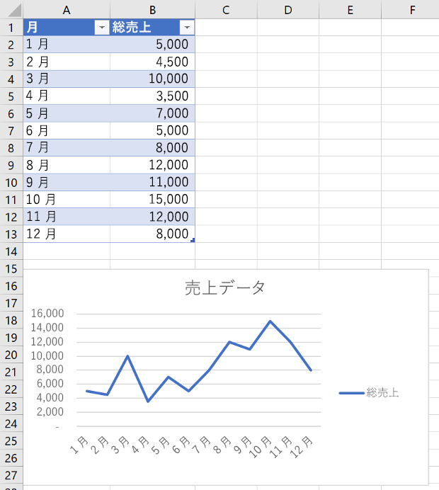
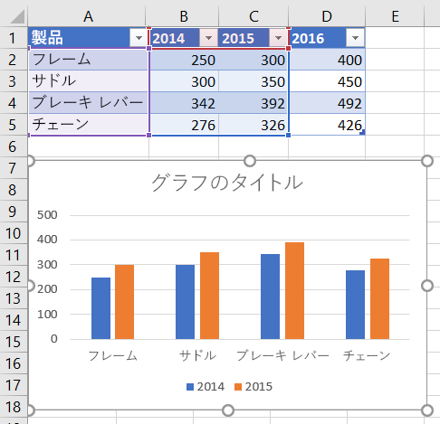
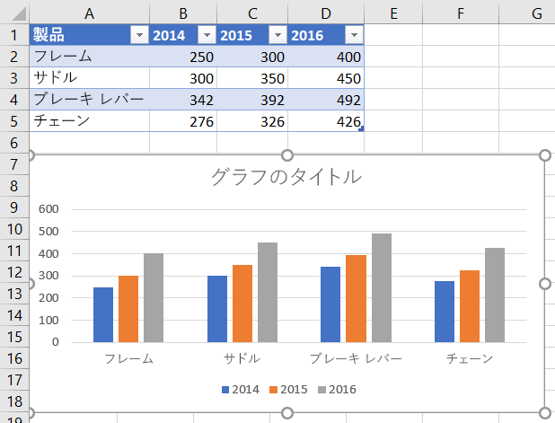
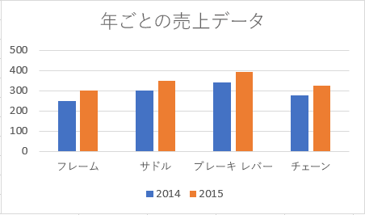
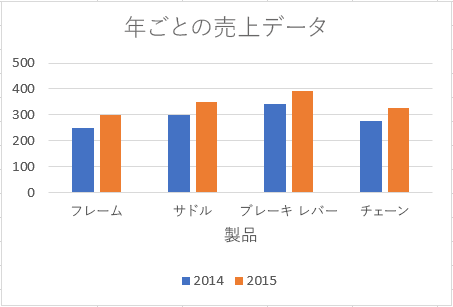
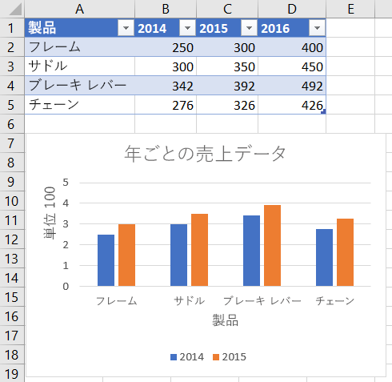
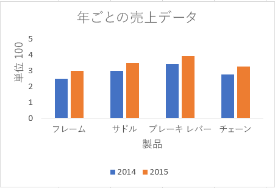
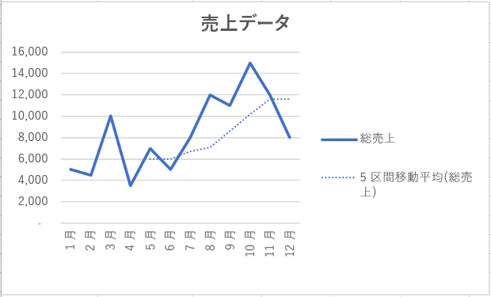
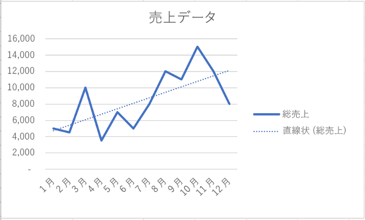

# <a name="work-with-charts-using-the-excel-javascript-api"></a>Excel JavaScript API を使用してグラフを操作する

この記事では、Excel JavaScript API を使用して、グラフの一般的なタスクを実行する方法のサンプル コードを提供します。 **Chart** オブジェクトと **ChartCollection** オブジェクトをサポートするプロパティとメソッドの完全なリストについては、「[Chart Object オブジェクト (JavaScript API for Excel)](https://dev.office.com/reference/add-ins/excel/chart)」および「[Chart Collection オブジェクト (JavaScript API for Excel)](https://dev.office.com/reference/add-ins/excel/chartcollection)」を参照してください。

## <a name="create-a-chart"></a>グラフを作成する

次のコード サンプルでは、**Sample** というワークシートにグラフを作成します。 グラフは、範囲 **A1:B13** のデータに基づいた**折れ線**グラフです。

```js
Excel.run(function (context) {
    var sheet = context.workbook.worksheets.getItem("Sample");
    var dataRange = sheet.getRange("A1:B13");
    var chart = sheet.charts.add("Line", dataRange, "auto");

    chart.title.text = "Sales Data";
    chart.legend.position = "right"
    chart.legend.format.fill.setSolidColor("white");
    chart.dataLabels.format.font.size = 15;
    chart.dataLabels.format.font.color = "black";

    return context.sync();
}).catch(errorHandlerFunction);
```

**新しい折れ線グラフ**




## <a name="add-a-data-series-to-a-chart"></a>データ系列をグラフに追加する

次のコード サンプルは、ワークシートの最初のグラフにデータ系列を追加します。 新しいデータ系列は **2016** という名前の列に対応し、範囲 **D2:D5** のデータに基づいています。

> [!NOTE]
> このサンプルでは、現在、パブリック プレビュー (ベータ版) でのみ使用可能な API を使用しています。 このサンプルを実行するには、Office.js CDN のベータ版ライブラリ (https://appsforoffice.microsoft.com/lib/beta/hosted/office.js) を使用する必要があります。

```js
Excel.run(function (context) {
    var sheet = context.workbook.worksheets.getItem("Sample");
    var chart = sheet.charts.getItemAt(0);
    var dataRange = sheet.getRange("D2:D5");

    var newSeries = chart.series.add("2016");
    newSeries.setValues(dataRange);

    return context.sync();
}).catch(errorHandlerFunction);
```

**2016 データ系列が追加される前のグラフ**



**2016 データ系列が追加された後のグラフ**



## <a name="set-chart-title"></a>グラフ タイトルを設定する

次のコード サンプルは、ワークシートの最初のグラフのタイトルを **Sales Data by Year** に設定します。 

```js
Excel.run(function (context) {
    var sheet = context.workbook.worksheets.getItem("Sample");

    var chart = sheet.charts.getItemAt(0);
    chart.title.text = "Sales Data by Year";

    return context.sync();
}).catch(errorHandlerFunction);
```

**タイトル設定後のグラフ**



## <a name="set-properties-of-an-axis-in-a-chart"></a>グラフの軸のプロパティを設定する

縦棒グラフ、横棒グラフ、散布図などの[デカルト座標系](https://en.wikipedia.org/wiki/Cartesian_coordinate_system)を使用するグラフには、項目軸と数値軸が含まれています。 次の例で、タイトルを設定し、グラフの軸の単位を表示する方法を示します。

### <a name="set-axis-title"></a>軸のタイトルを設定する

次のコード サンプルは、ワークシートの最初のグラフの、項目軸のタイトルを **Product** に設定します。

```js
Excel.run(function (context) {
    var sheet = context.workbook.worksheets.getItem("Sample");

    var chart = sheet.charts.getItemAt(0);
    chart.axes.categoryAxis.title.text = "Product";

    return context.sync();
}).catch(errorHandlerFunction);
```

**項目軸のタイトルが設定された後のグラフ**



### <a name="set-axis-display-unit"></a>軸の表示単位を設定する

次のコード サンプルは、ワークシートの最初のグラフの、数値軸の表示単位を **Hundreds** に設定します。

> [!NOTE]
> このサンプルでは、現在、パブリック プレビュー (ベータ版) でのみ使用可能な API を使用しています。 このサンプルを実行するには、Office.js CDN のベータ版ライブラリ (https://appsforoffice.microsoft.com/lib/beta/hosted/office.js) を使用する必要があります。

```js
Excel.run(function (context) {
    var sheet = context.workbook.worksheets.getItem("Sample");

    var chart = sheet.charts.getItemAt(0);
    chart.axes.valueAxis.displayUnit = "Hundreds";

    return context.sync();
}).catch(errorHandlerFunction);
```

**数値軸の表示単位が設定された後のグラフ**



## <a name="set-visibility-of-gridlines-in-a-chart"></a>グラフの枠線の表示/非表示を設定する

次のコード サンプルは、ワークシートの最初のグラフの、数値軸の主な枠線を非表示にします。 `chart.axes.valueAxis.majorGridlines.visible` を **true** に設定すると、グラフの数値軸の主な枠線を表示できます。

```js
Excel.run(function (context) {
    var sheet = context.workbook.worksheets.getItem("Sample");

    var chart = sheet.charts.getItemAt(0);
    chart.axes.valueAxis.majorGridlines.visible = false;

    return context.sync();
}).catch(errorHandlerFunction);
```

**枠線が非表示にされたグラフ**



## <a name="chart-trendlines"></a>グラフの近似曲線

### <a name="add-a-trendline"></a>近似曲線を追加する

次のコード サンプルは、**Sample** という名前のワークシートの、最初のグラフの最初の系列に移動平均の近似曲線を追加します。近似曲線は 5 期間にわたる移動平均を示します。

> [!NOTE]
> このサンプルでは、現在、パブリック プレビュー (ベータ版) でのみ使用可能な API を使用しています。 このサンプルを実行するには、Office.js CDN のベータ版ライブラリ (https://appsforoffice.microsoft.com/lib/beta/hosted/office.js) を使用する必要があります。

```js
Excel.run(function (context) {
    var sheet = context.workbook.worksheets.getItem("Sample");

    var chart = sheet.charts.getItemAt(0);
    var seriesCollection = chart.series;
    seriesCollection.getItemAt(0).trendlines.add("MovingAverage").movingAveragePeriod = 5;

    return context.sync();
}).catch(errorHandlerFunction);
```

**移動平均の近似曲線が記入されたグラフ**



### <a name="update-a-trendline"></a>近似曲線を更新する

次のコード サンプルは、**Sample** という名前のワークシートの、最初のグラフの最初の系列に対して、近似曲線の種類を**線形**に設定しています。

> [!NOTE]
> このサンプルでは、現在、パブリック プレビュー (ベータ版) でのみ使用可能な API を使用しています。 このサンプルを実行するには、Office.js CDN のベータ版ライブラリ (https://appsforoffice.microsoft.com/lib/beta/hosted/office.js) を使用する必要があります。

```js
Excel.run(function (context) {
    var sheet = context.workbook.worksheets.getItem("Sample");

    var chart = sheet.charts.getItemAt(0);
    var seriesCollection = chart.series;
    var series = seriesCollection.getItemAt(0);
    series.trendlines.getItem(0).type = "Linear";

    return context.sync();
}).catch(errorHandlerFunction);
```

**線形の近似曲線が記入されたグラフ**



## <a name="see-also"></a>関連項目

- [Excel JavaScript API の中心概念](excel-add-ins-core-concepts.md)
- [Chart オブジェクト (JavaScript API for Excel)](https://dev.office.com/reference/add-ins/excel/chart) 
- [Chart Collection オブジェクト (JavaScript API for Excel)](https://dev.office.com/reference/add-ins/excel/chartcollection)