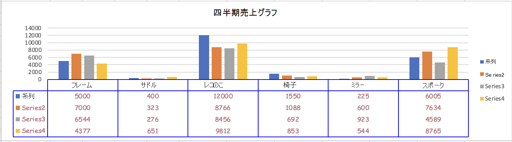

# <a name="work-with-charts-using-the-excel-javascript-api"></a>Excel JavaScript API を使用してグラフを操作する

この記事では、Excel JavaScript API を使用して、グラフの一般的なタスクを実行する方法のサンプル コードを提供します。
and オブジェクトがサポートするプロパティとメソッドの完全な一覧については、「Chart [Object (JavaScript API for Excel)](/javascript/api/excel/excel.chart)」および「Chart [Collection Object (JavaScript API for Excel)」を参照](/javascript/api/excel/excel.chartcollection)してください。`Chart` `ChartCollection`

## <a name="create-a-chart"></a>グラフの作成

次のコード サンプルでは、**Sample** というワークシートにグラフを作成します。 グラフは、範囲 **A1:B13** のデータに基づいた **折れ線** グラフです。

```js
await Excel.run(async (context) => {
    let sheet = context.workbook.worksheets.getItem("Sample");
    let dataRange = sheet.getRange("A1:B13");
    let chart = sheet.charts.add(
      Excel.ChartType.line, 
      dataRange, 
      Excel.ChartSeriesBy.auto);

    chart.title.text = "Sales Data";
    chart.legend.position = Excel.ChartLegendPosition.right;
    chart.legend.format.fill.setSolidColor("white");
    chart.dataLabels.format.font.size = 15;
    chart.dataLabels.format.font.color = "black";

    await context.sync();
});
```

### <a name="new-line-chart"></a>新しい折れ線グラフ


## <a name="add-a-data-series-to-a-chart"></a>データ系列をグラフに追加する

次のコード サンプルは、ワークシートの最初のグラフにデータ系列を追加します。 新しいデータ系列は **2016** という名前の列に対応し、範囲 **D2:D5** のデータに基づいています。

```js
await Excel.run(async (context) => {
    let sheet = context.workbook.worksheets.getItem("Sample");
    let chart = sheet.charts.getItemAt(0);
    let dataRange = sheet.getRange("D2:D5");

    let newSeries = chart.series.add("2016");
    newSeries.setValues(dataRange);

    await context.sync();
});
```

### <a name="chart-before-the-2016-data-series-is-added"></a>2016 データ系列が追加される前のグラフ


### <a name="chart-after-the-2016-data-series-is-added"></a>2016 データ系列が追加された後のグラフ


## <a name="set-chart-title"></a>グラフ タイトルを設定する

次のコード サンプルは、ワークシートの最初のグラフのタイトルを **Sales Data by Year** に設定します。

```js
await Excel.run(async (context) => {
    let sheet = context.workbook.worksheets.getItem("Sample");

    let chart = sheet.charts.getItemAt(0);
    chart.title.text = "Sales Data by Year";

    await context.sync();
});
```

### <a name="chart-after-title-is-set"></a>タイトル設定後のグラフ


## <a name="set-properties-of-an-axis-in-a-chart"></a>グラフの軸のプロパティを設定する

縦棒グラフ、横棒グラフ、散布図などの[デカルト座標系](https://en.wikipedia.org/wiki/Cartesian_coordinate_system)を使用するグラフには、項目軸と数値軸が含まれています。 次の例で、タイトルを設定し、グラフの軸の単位を表示する方法を示します。

### <a name="set-axis-title"></a>軸のタイトルを設定する

次のコード サンプルは、ワークシートの最初のグラフの、項目軸のタイトルを **Product** に設定します。

```js
await Excel.run(async (context) => {
    let sheet = context.workbook.worksheets.getItem("Sample");

    let chart = sheet.charts.getItemAt(0);
    chart.axes.categoryAxis.title.text = "Product";

    await context.sync();
});
```

### <a name="chart-after-title-of-category-axis-is-set"></a>項目軸のタイトルが設定された後のグラフ


### <a name="set-axis-display-unit"></a>軸の表示単位を設定する

次のコード サンプルは、ワークシートの最初のグラフの、数値軸の表示単位を **Hundreds** に設定します。

```js
await Excel.run(async (context) => {
    let sheet = context.workbook.worksheets.getItem("Sample");

    let chart = sheet.charts.getItemAt(0);
    chart.axes.valueAxis.displayUnit = "Hundreds";

    await context.sync();
});
```

### <a name="chart-after-display-unit-of-value-axis-is-set"></a>数値軸の表示単位が設定された後のグラフ


## <a name="set-visibility-of-gridlines-in-a-chart"></a>グラフの枠線の表示/非表示を設定する

次のコード サンプルは、ワークシートの最初のグラフの、数値軸の主な枠線を非表示にします。 に設定すると、グラフの値軸の大きなグリッド線を表示 `chart.axes.valueAxis.majorGridlines.visible` できます `true`。

```js
await Excel.run(async (context) => {
    let sheet = context.workbook.worksheets.getItem("Sample");

    let chart = sheet.charts.getItemAt(0);
    chart.axes.valueAxis.majorGridlines.visible = false;

    await context.sync();
});
```

### <a name="chart-with-gridlines-hidden"></a>枠線が非表示にされたグラフ


## <a name="chart-trendlines"></a>グラフの近似曲線

### <a name="add-a-trendline"></a>近似曲線を追加する

次のコード サンプルは、**Sample** という名前のワークシートの、最初のグラフの最初の系列に移動平均の近似曲線を追加します。近似曲線は 5 期間にわたる移動平均を示します。

```js
await Excel.run(async (context) => {
    let sheet = context.workbook.worksheets.getItem("Sample");

    let chart = sheet.charts.getItemAt(0);
    let seriesCollection = chart.series;
    seriesCollection.getItemAt(0).trendlines.add("MovingAverage").movingAveragePeriod = 5;

    await context.sync();
});
```

#### <a name="chart-with-moving-average-trendline"></a>移動平均の近似曲線が記入されたグラフ


### <a name="update-a-trendline"></a>近似曲線を更新する

次のコード サンプルは、`Linear`Sample という名前のワークシートの最初のグラフの最初の系列の傾向線を **入力します。**

```js
await Excel.run(async (context) => {
    let sheet = context.workbook.worksheets.getItem("Sample");

    let chart = sheet.charts.getItemAt(0);
    let seriesCollection = chart.series;
    let series = seriesCollection.getItemAt(0);
    series.trendlines.getItem(0).type = "Linear";

    await context.sync();
});
```

#### <a name="chart-with-linear-trendline"></a>線形の近似曲線が記入されたグラフ


## <a name="add-and-format-a-chart-data-table"></a>グラフ データ テーブルの追加と書式設定

メソッドを使用して、グラフのデータ テーブル要素にアクセス [`Chart.getDataTableOrNullObject`](/javascript/api/excel/excel.chart#excel-excel-chart-getdatatableornullobject-member(1)) できます。 このメソッドは、オブジェクトを返 [`ChartDataTable`](/javascript/api/excel/excel.chartdatatable) します。 オブジェクト `ChartDataTable` には、、、、などのブール型 `visible`の書式設定プロパティ `showLegendKey`があります `showHorizontalBorder`。

プロパティ `ChartDataTable.format` はオブジェクトを返 [`ChartDataTableFormat`](/javascript/api/excel/excel.chartdatatableformat) します。これにより、データ テーブルの書式とスタイルを設定できます。 オブジェクト`ChartDataTableFormat`は、、プロパティ`border``fill`を提供`font`します。

次のコード サンプルは、グラフにデータ テーブルを追加し、and オブジェクトを使用してそのデータ テーブルの書式を設定する方法を `ChartDataTable` 示 `ChartDataTableFormat` しています。

```js
// This code sample adds a data table to a chart that already exists on the worksheet, 
// and then adjusts the display and format of that data table.
await Excel.run(async (context) => {
    // Retrieve the chart on the "Sample" worksheet.
    let chart = context.workbook.worksheets.getItem("Sample").charts.getItemAt(0);

    // Get the chart data table object and load its properties.
    let chartDataTable = chart.getDataTableOrNullObject();
    chartDataTable.load();

    // Set the display properties of the chart data table.
    chartDataTable.visible = true;
    chartDataTable.showLegendKey = true;
    chartDataTable.showHorizontalBorder = false;
    chartDataTable.showVerticalBorder = true;
    chartDataTable.showOutlineBorder = true;

    // Retrieve the chart data table format object and set font and border properties. 
    let chartDataTableFormat = chartDataTable.format;
    chartDataTableFormat.font.color = "#B76E79";
    chartDataTableFormat.font.name = "Comic Sans";
    chartDataTableFormat.border.color = "blue";

    await context.sync();
});
```

次のスクリーンショットは、前のコード サンプルが作成するデータ テーブルを示しています。



## <a name="export-a-chart-as-an-image"></a>グラフを画像としてエクスポートする

グラフを Excel の外部で画像としてレンダリングできます。 `Chart.getImage` からは、グラフを JPEG 画像として表す base 64 エンコード文字列が返されます。 次のコードでは、画像の文字列を取得してコンソールに表示する方法を示します。

```js
await Excel.run(async (context) => {
    let chart = context.workbook.worksheets.getItem("Sheet1").charts.getItem("Chart1");
    let imageAsString = chart.getImage();
    await context.sync();
    
    console.log(imageAsString.value);
    // Instead of logging, your add-in may use the base64-encoded string to save the image as a file or insert it in HTML.
});
```

`Chart.getImage` は、省略可能なパラメーターとして幅、高さ、自動調整モードの 3 つを受け取ります。

```typescript
getImage(width?: number, height?: number, fittingMode?: Excel.ImageFittingMode): OfficeExtension.ClientResult<string>;
```

これらのパラメーターにより、画像のサイズが決まります。 画像は常に同じ縦横比でスケーリングされます。 幅と高さのパラメーターにより、スケーリングされた画像の上端または下端が設定されます。 `ImageFittingMode` 次の動作を持つ 3 つの値があります。

- `Fill`: イメージの最小の高さまたは幅は、指定された高さまたは幅です (イメージのスケーリング時に最初に到達した方)。 これは、自動調整モードが指定されていない場合の既定の動作です。
- `Fit`: イメージの最大の高さまたは幅は、指定された高さまたは幅です (イメージのスケーリング時に最初に到達した方)。
- `FitAndCenter`: イメージの最大の高さまたは幅は、指定された高さまたは幅です (イメージのスケーリング時に最初に到達した方)。 結果の画像は、他の寸法について中央に配置されます。

## <a name="see-also"></a>関連項目

- [Office アドインの Excel JavaScript オブジェクト モデル](excel-add-ins-core-concepts.md)
