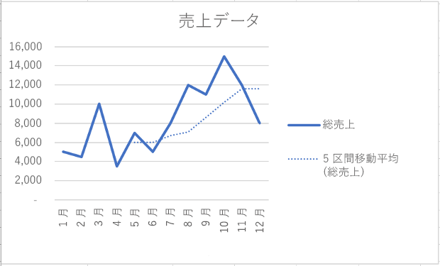

# <a name="work-with-charts-using-the-excel-javascript-api"></a><span data-ttu-id="9c3fe-102">Excel JavaScript API を使用してグラフを操作する</span><span class="sxs-lookup"><span data-stu-id="9c3fe-102">Work with Charts using the Excel JavaScript API</span></span>

<span data-ttu-id="9c3fe-103">この記事では、Excel JavaScript API を使用して、グラフの一般的なタスクを実行する方法のサンプル コードを提供します。</span><span class="sxs-lookup"><span data-stu-id="9c3fe-103">This article provides code samples that show how to perform common tasks with charts using the Excel JavaScript API.</span></span> <span data-ttu-id="9c3fe-104">**Chart** オブジェクトと **ChartCollection** オブジェクトをサポートするプロパティとメソッドの完全なリストについては、「[Chart Object オブジェクト (JavaScript API for Excel)](https://dev.office.com/reference/add-ins/excel/chart)」および「[Chart Collection オブジェクト (JavaScript API for Excel)](https://dev.office.com/reference/add-ins/excel/chartcollection)」を参照してください。</span><span class="sxs-lookup"><span data-stu-id="9c3fe-104">For the complete list of properties and methods that the **Chart** and **ChartCollection** objects support, see [Chart Object (JavaScript API for Excel)](https://dev.office.com/reference/add-ins/excel/chart) and [Chart Collection Object (JavaScript API for Excel)](https://dev.office.com/reference/add-ins/excel/chartcollection).</span></span>

## <a name="create-a-chart"></a><span data-ttu-id="9c3fe-105">グラフを作成する</span><span class="sxs-lookup"><span data-stu-id="9c3fe-105">Create a chart</span></span>

<span data-ttu-id="9c3fe-106">次のコード サンプルでは、**Sample** というワークシートにグラフを作成します。</span><span class="sxs-lookup"><span data-stu-id="9c3fe-106">The following code sample creates a chart in the worksheet named **Sample**.</span></span> <span data-ttu-id="9c3fe-107">グラフは、範囲 **A1:B13** のデータに基づいた**折れ線**グラフです。</span><span class="sxs-lookup"><span data-stu-id="9c3fe-107">The chart is a **Line** chart that is based upon data in the range **A1:B13**.</span></span>

```js
Excel.run(function (context) {
    var sheet = context.workbook.worksheets.getItem("Sample");
    var dataRange = sheet.getRange("A1:B13");
    var chart = sheet.charts.add("Line", dataRange, "auto");

    chart.title.text = "Sales Data";
    chart.legend.position = "right"
    chart.legend.format.fill.setSolidColor("white");
    chart.dataLabels.format.font.size = 15;
    chart.dataLabels.format.font.color = "black";

    return context.sync();
}).catch(errorHandlerFunction);
```

<span data-ttu-id="9c3fe-108">**新しい折れ線グラフ**</span><span class="sxs-lookup"><span data-stu-id="9c3fe-108">**New line chart**</span></span>


## <a name="add-a-data-series-to-a-chart"></a><span data-ttu-id="9c3fe-110">データ系列をグラフに追加する</span><span class="sxs-lookup"><span data-stu-id="9c3fe-110">Add a data series to a chart</span></span>

<span data-ttu-id="9c3fe-111">次のコード サンプルは、ワークシートの最初のグラフにデータ系列を追加します。</span><span class="sxs-lookup"><span data-stu-id="9c3fe-111">The following code sample adds a data series to the first chart in the worksheet.</span></span> <span data-ttu-id="9c3fe-112">新しいデータ系列は **2016** という名前の列に対応し、範囲 **D2:D5** のデータに基づいています。</span><span class="sxs-lookup"><span data-stu-id="9c3fe-112">The new data series corresponds to the column named **2016** and is based upon data in the range **D2:D5**.</span></span>

> [!NOTE]
> <span data-ttu-id="9c3fe-113">このサンプルでは、現在パブリック プレビュー (ベータ版) でのみ使用可能な API を使用しています。</span><span class="sxs-lookup"><span data-stu-id="9c3fe-113">This sample uses APIs that are currently available only in public preview (beta).</span></span> <span data-ttu-id="9c3fe-114">このサンプルを実行するには、Office.js CDNのベータライブラリを使用する必要があります。 https://appsforoffice.microsoft.com/lib/beta/hosted/office.js。</span><span class="sxs-lookup"><span data-stu-id="9c3fe-114">To run this sample, you must use the beta library of the Office.js CDN: https://appsforoffice.microsoft.com/lib/beta/hosted/office.js.</span></span>

```js
Excel.run(function (context) {
    var sheet = context.workbook.worksheets.getItem("Sample");
    var chart = sheet.charts.getItemAt(0);
    var dataRange = sheet.getRange("D2:D5");

    var newSeries = chart.series.add("2016");
    newSeries.setValues(dataRange);

    return context.sync();
}).catch(errorHandlerFunction);
```

<span data-ttu-id="9c3fe-115">**2016 データ系列が追加される前のグラフ**</span><span class="sxs-lookup"><span data-stu-id="9c3fe-115">**Chart before the 2016 data series is added**</span></span>


<span data-ttu-id="9c3fe-117">**2016 データ系列が追加された後のグラフ**</span><span class="sxs-lookup"><span data-stu-id="9c3fe-117">**Chart after the 2016 data series is added**</span></span>


## <a name="set-chart-title"></a><span data-ttu-id="9c3fe-119">グラフ タイトルを設定する</span><span class="sxs-lookup"><span data-stu-id="9c3fe-119">Set chart title</span></span>

<span data-ttu-id="9c3fe-120">次のコード サンプルは、ワークシートの最初のグラフのタイトルを **Sales Data by Year** に設定します。</span><span class="sxs-lookup"><span data-stu-id="9c3fe-120">The following code sample sets the title of the first chart in the worksheet to **Sales Data by Year**.</span></span> 

```js
Excel.run(function (context) {
    var sheet = context.workbook.worksheets.getItem("Sample");

    var chart = sheet.charts.getItemAt(0);
    chart.title.text = "Sales Data by Year";

    return context.sync();
}).catch(errorHandlerFunction);
```

<span data-ttu-id="9c3fe-121">**タイトル設定後のグラフ**</span><span class="sxs-lookup"><span data-stu-id="9c3fe-121">**Chart after title is set**</span></span>


## <a name="set-properties-of-an-axis-in-a-chart"></a><span data-ttu-id="9c3fe-123">グラフの軸のプロパティを設定する</span><span class="sxs-lookup"><span data-stu-id="9c3fe-123">Set properties of an axis in a chart</span></span>

<span data-ttu-id="9c3fe-124">縦棒グラフ、横棒グラフ、散布図などの[デカルト座標系](https://en.wikipedia.org/wiki/Cartesian_coordinate_system)を使用するグラフには、項目軸と数値軸が含まれています。</span><span class="sxs-lookup"><span data-stu-id="9c3fe-124">Charts that use the [Cartesian coordinate system](https://en.wikipedia.org/wiki/Cartesian_coordinate_system) such as column charts, bar charts, and scatter charts contain a category axis and a value axis.</span></span> <span data-ttu-id="9c3fe-125">次の例で、タイトルを設定し、グラフの軸の単位を表示する方法を示します。</span><span class="sxs-lookup"><span data-stu-id="9c3fe-125">These examples show how to set the title and display unit of an axis in a chart.</span></span>

### <a name="set-axis-title"></a><span data-ttu-id="9c3fe-126">軸のタイトルを設定する</span><span class="sxs-lookup"><span data-stu-id="9c3fe-126">Set axis title</span></span>

<span data-ttu-id="9c3fe-127">次のコード サンプルは、ワークシートの最初のグラフの、項目軸のタイトルを **Product** に設定します。</span><span class="sxs-lookup"><span data-stu-id="9c3fe-127">The following code sample sets the title of the category axis for the first chart in the worksheet to **Product**.</span></span>

```js
Excel.run(function (context) {
    var sheet = context.workbook.worksheets.getItem("Sample");

    var chart = sheet.charts.getItemAt(0);
    chart.axes.categoryAxis.title.text = "Product";

    return context.sync();
}).catch(errorHandlerFunction);
```

<span data-ttu-id="9c3fe-128">**項目軸のタイトルが設定された後のグラフ**</span><span class="sxs-lookup"><span data-stu-id="9c3fe-128">**Chart after title of category axis is set**</span></span>


### <a name="set-axis-display-unit"></a><span data-ttu-id="9c3fe-130">軸の表示単位を設定する</span><span class="sxs-lookup"><span data-stu-id="9c3fe-130">Set axis display unit</span></span>

<span data-ttu-id="9c3fe-131">次のコード サンプルは、ワークシートの最初のグラフの、数値軸の表示単位を **Hundreds** に設定します。</span><span class="sxs-lookup"><span data-stu-id="9c3fe-131">The following code sample sets the display unit of the value axis for the first chart in the worksheet to **Hundreds**.</span></span>

> [!NOTE]
> <span data-ttu-id="9c3fe-132">このサンプルでは、現在パブリック プレビュー (ベータ版) でのみ使用可能な API を使用しています。</span><span class="sxs-lookup"><span data-stu-id="9c3fe-132">This sample uses APIs that are currently available only in public preview (beta).</span></span> <span data-ttu-id="9c3fe-133">このサンプルを実行するには、Office.js CDNのベータライブラリを使用する必要があります。 https://appsforoffice.microsoft.com/lib/beta/hosted/office.js。</span><span class="sxs-lookup"><span data-stu-id="9c3fe-133">To run this sample, you must use the beta library of the Office.js CDN: https://appsforoffice.microsoft.com/lib/beta/hosted/office.js.</span></span>

```js
Excel.run(function (context) {
    var sheet = context.workbook.worksheets.getItem("Sample");

    var chart = sheet.charts.getItemAt(0);
    chart.axes.valueAxis.displayUnit = "Hundreds";

    return context.sync();
}).catch(errorHandlerFunction);
```

<span data-ttu-id="9c3fe-134">**数値軸の表示単位が設定された後のグラフ**</span><span class="sxs-lookup"><span data-stu-id="9c3fe-134">**Chart after display unit of value axis is set**</span></span>


## <a name="set-visibility-of-gridlines-in-a-chart"></a><span data-ttu-id="9c3fe-136">グラフの枠線の表示/非表示を設定する</span><span class="sxs-lookup"><span data-stu-id="9c3fe-136">Set visibility of gridlines in a chart</span></span>

<span data-ttu-id="9c3fe-137">次のコード サンプルは、ワークシートの最初のグラフの、数値軸の主な枠線を非表示にします。</span><span class="sxs-lookup"><span data-stu-id="9c3fe-137">The following code sample hides the major gridlines for the value axis of the first chart in the worksheet.</span></span> <span data-ttu-id="9c3fe-138">を **true** に設定すると、グラフの数値軸の主な枠線を表示できます。`chart.axes.valueAxis.majorGridlines.visible`</span><span class="sxs-lookup"><span data-stu-id="9c3fe-138">You can show the major gridlines for the value axis of the chart, by setting `chart.axes.valueAxis.majorGridlines.visible` to **true**.</span></span>

```js
Excel.run(function (context) {
    var sheet = context.workbook.worksheets.getItem("Sample");

    var chart = sheet.charts.getItemAt(0);
    chart.axes.valueAxis.majorGridlines.visible = false;

    return context.sync();
}).catch(errorHandlerFunction);
```

<span data-ttu-id="9c3fe-139">**枠線が非表示にされたグラフ**</span><span class="sxs-lookup"><span data-stu-id="9c3fe-139">**Chart with gridlines hidden**</span></span>


## <a name="chart-trendlines"></a><span data-ttu-id="9c3fe-141">グラフの近似曲線</span><span class="sxs-lookup"><span data-stu-id="9c3fe-141">Chart trendlines</span></span>

### <a name="add-a-trendline"></a><span data-ttu-id="9c3fe-142">近似曲線を追加する</span><span class="sxs-lookup"><span data-stu-id="9c3fe-142">Add a trendline</span></span>

<span data-ttu-id="9c3fe-p108">次のコード サンプルは、**Sample** という名前のワークシートの、最初のグラフの最初の系列に移動平均の近似曲線を追加します。近似曲線は 5 期間にわたる移動平均を示します。</span><span class="sxs-lookup"><span data-stu-id="9c3fe-p108">The following code sample adds a moving average trendline to the first series in the first chart in the worksheet named **Sample**. The trendline shows a moving average over 5 periods.</span></span>

> [!NOTE]
> <span data-ttu-id="9c3fe-145">このサンプルでは、現在パブリック プレビュー (ベータ版) でのみ使用可能な API を使用しています。</span><span class="sxs-lookup"><span data-stu-id="9c3fe-145">This sample uses APIs that are currently available only in public preview (beta).</span></span> <span data-ttu-id="9c3fe-146">このサンプルを実行するには、Office.js CDNのベータライブラリを使用する必要があります。 https://appsforoffice.microsoft.com/lib/beta/hosted/office.js。</span><span class="sxs-lookup"><span data-stu-id="9c3fe-146">To run this sample, you must use the beta library of the Office.js CDN: https://appsforoffice.microsoft.com/lib/beta/hosted/office.js.</span></span>

```js
Excel.run(function (context) {
    var sheet = context.workbook.worksheets.getItem("Sample");

    var chart = sheet.charts.getItemAt(0);
    var seriesCollection = chart.series;
    seriesCollection.getItemAt(0).trendlines.add("MovingAverage").movingAveragePeriod = 5;

    return context.sync();
}).catch(errorHandlerFunction);
```

<span data-ttu-id="9c3fe-147">**移動平均の近似曲線が記入されたグラフ**</span><span class="sxs-lookup"><span data-stu-id="9c3fe-147">**Chart with moving average trendline**</span></span>



### <a name="update-a-trendline"></a><span data-ttu-id="9c3fe-149">近似曲線を更新する</span><span class="sxs-lookup"><span data-stu-id="9c3fe-149">Update a trendline</span></span>

<span data-ttu-id="9c3fe-150">次のコード サンプルは、**Sample** という名前のワークシートの、最初のグラフの最初の系列に対して、近似曲線の種類を**線形**に設定しています。</span><span class="sxs-lookup"><span data-stu-id="9c3fe-150">The following code sample sets the trendline to type **Linear** for the first series in the first chart in the worksheet named **Sample**.</span></span>

> [!NOTE]
> <span data-ttu-id="9c3fe-151">このサンプルでは、現在パブリック プレビュー (ベータ版) でのみ使用可能な API を使用しています。</span><span class="sxs-lookup"><span data-stu-id="9c3fe-151">This sample uses APIs that are currently available only in public preview (beta).</span></span> <span data-ttu-id="9c3fe-152">このサンプルを実行するには、Office.js CDNのベータライブラリを使用する必要があります。 https://appsforoffice.microsoft.com/lib/beta/hosted/office.js。</span><span class="sxs-lookup"><span data-stu-id="9c3fe-152">To run this sample, you must use the beta library of the Office.js CDN: https://appsforoffice.microsoft.com/lib/beta/hosted/office.js.</span></span>

```js
Excel.run(function (context) {
    var sheet = context.workbook.worksheets.getItem("Sample");

    var chart = sheet.charts.getItemAt(0);
    var seriesCollection = chart.series;
    var series = seriesCollection.getItemAt(0);
    series.trendlines.getItem(0).type = "Linear";

    return context.sync();
}).catch(errorHandlerFunction);
```

<span data-ttu-id="9c3fe-153">**線形の近似曲線が記入されたグラフ**</span><span class="sxs-lookup"><span data-stu-id="9c3fe-153">**Chart with linear trendline**</span></span>


## <a name="see-also"></a><span data-ttu-id="9c3fe-155">関連項目</span><span class="sxs-lookup"><span data-stu-id="9c3fe-155">See also</span></span>

- [<span data-ttu-id="9c3fe-156">Excel JavaScript API の中心概念</span><span class="sxs-lookup"><span data-stu-id="9c3fe-156">Excel JavaScript API core concepts</span></span>](excel-add-ins-core-concepts.md)
- [<span data-ttu-id="9c3fe-157">Chart オブジェクト (JavaScript API for Excel)</span><span class="sxs-lookup"><span data-stu-id="9c3fe-157">Chart Object (JavaScript API for Excel)</span></span>](https://dev.office.com/reference/add-ins/excel/chart) 
- [<span data-ttu-id="9c3fe-158">Chart Collection オブジェクト (JavaScript API for Excel)</span><span class="sxs-lookup"><span data-stu-id="9c3fe-158">Chart Collection Object (JavaScript API for Excel)</span></span>](https://dev.office.com/reference/add-ins/excel/chartcollection)