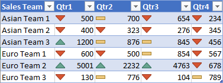

# <a name="apply-conditional-formatting-to-excel-ranges"></a><span data-ttu-id="14df2-101">Excel の範囲に条件付き書式を適用する</span><span class="sxs-lookup"><span data-stu-id="14df2-101">Apply conditional formatting to Excel ranges</span></span>

<span data-ttu-id="14df2-102">Excel の JavaScript ライブラリは、ワークシートのデータ範囲に条件付き書式を適用するための API を提供します。</span><span class="sxs-lookup"><span data-stu-id="14df2-102">The Excel JavaScript Library provides APIs to apply conditional formatting to data ranges in your worksheets.</span></span> <span data-ttu-id="14df2-103">この機能により、大量のデータ セットの視覚的な解析を簡単に行うことができます。</span><span class="sxs-lookup"><span data-stu-id="14df2-103">This functionality makes large sets of data easy to visually parse.</span></span> <span data-ttu-id="14df2-104">範囲内で行われた変更に応じて、書式も動的に更新されます。</span><span class="sxs-lookup"><span data-stu-id="14df2-104">The formatting also dynamically updates based on changes within the range.</span></span> 

> [!NOTE] 
> <span data-ttu-id="14df2-105">この記事では、Excel の JavaScript のアドインのコンテキストにおける条件付き書式について説明します。次の記事では、Excel の完全な条件付き書式機能に関する詳細情報を提供しています。</span><span class="sxs-lookup"><span data-stu-id="14df2-105">This article covers conditional formatting in the context of Excel JavaScript add-ins. The following articles provide detailed information about the full conditional formatting capabilities within Excel.</span></span>
-   [<span data-ttu-id="14df2-106">条件付き書式を追加、変更、またはクリアする</span><span class="sxs-lookup"><span data-stu-id="14df2-106">Add, change, or clear conditional formats</span></span>](https://support.office.com/article/add-change-or-clear-conditional-formats-8a1cc355-b113-41b7-a483-58460332a1af)
-   [<span data-ttu-id="14df2-107">数式を使って条件付き書式を適用する</span><span class="sxs-lookup"><span data-stu-id="14df2-107">Use formulas with conditional formatting</span></span>](https://support.office.com/article/Use-formulas-with-conditional-formatting-FED60DFA-1D3F-4E13-9ECB-F1951FF89D7F)

## <a name="programmatic-control-of-conditional-formatting"></a><span data-ttu-id="14df2-108">条件付き書式のプログラムによる制御</span><span class="sxs-lookup"><span data-stu-id="14df2-108">Programmatic control of conditional formatting</span></span>

<span data-ttu-id="14df2-109">`Range.conditionalFormats` プロパティは、範囲に適用される [ConditionalFormat](https://docs.microsoft.com/javascript/api/excel/excel.conditionalformat) オブジェクトのコレクションです。</span><span class="sxs-lookup"><span data-stu-id="14df2-109">The `Range.conditionalFormats` property is a collection of [ConditionalFormat](https://docs.microsoft.com/javascript/api/excel/excel.conditionalformat) objects that apply to the range.</span></span>  <span data-ttu-id="14df2-110">`ConditionalFormat` オブジェクトには、[ConditionalFormatType](https://docs.microsoft.com/javascript/api/excel/excel.conditionalformattype) に基づいて適用される書式を定義するためのプロパティがいくつか含まれています。</span><span class="sxs-lookup"><span data-stu-id="14df2-110">The `ConditionalFormat` object contains several properties that define the format to be applied based on the [ConditionalFormatType](https://docs.microsoft.com/javascript/api/excel/excel.conditionalformattype).</span></span> 

-   `cellValue`
-   `colorScale`
-   `custom`
-   `dataBar`
-   `iconSet`
-   `preset`
-   `textComparison`
-   `topBottom`

> [!NOTE]
> <span data-ttu-id="14df2-111">これらの書式設定プロパティにはそれぞれ、対応する `*OrNullObject` バリアントが存在します。</span><span class="sxs-lookup"><span data-stu-id="14df2-111">Each of these formatting properties has a corresponding `*OrNullObject` variant.</span></span> <span data-ttu-id="14df2-112">そのパターンの詳細については、「[\*OrNullObject メソッド](https://docs.microsoft.com/office/dev/add-ins/excel/excel-add-ins-advanced-concepts#42ornullobject-methods)」セクションを参照してください。</span><span class="sxs-lookup"><span data-stu-id="14df2-112">Learn more about that pattern in the [\*OrNullObject methods](https://docs.microsoft.com/office/dev/add-ins/excel/excel-add-ins-advanced-concepts#42ornullobject-methods) section.</span></span>

<span data-ttu-id="14df2-113">ConditionalFormat オブジェクトに設定することができる書式の種類は、1 つのみです。</span><span class="sxs-lookup"><span data-stu-id="14df2-113">Only one format type can be set for the ConditionalFormat object.</span></span> <span data-ttu-id="14df2-114">この種類は、[ConditionalFormatType](https://docs.microsoft.com/javascript/api/excel/excel.conditionalformattype) の列挙値である `type` プロパティによって決定されます。</span><span class="sxs-lookup"><span data-stu-id="14df2-114">This is determined by the `type` property, which is a [ConditionalFormatType](https://docs.microsoft.com/javascript/api/excel/excel.conditionalformattype) enum value.</span></span> <span data-ttu-id="14df2-115">`type` は、範囲に条件付き書式を追加するときに設定されます。</span><span class="sxs-lookup"><span data-stu-id="14df2-115">`type` is set when adding a conditional format to a range.</span></span> 

## <a name="creating-conditional-formatting-rules"></a><span data-ttu-id="14df2-116">条件付き書式のルールの作成</span><span class="sxs-lookup"><span data-stu-id="14df2-116">Altering conditional formatting rules.</span></span>

<span data-ttu-id="14df2-117">条件付き書式を範囲に追加するには、`conditionalFormats.add` を使用します。</span><span class="sxs-lookup"><span data-stu-id="14df2-117">Conditional formats are added to a range by using `conditionalFormats.add`.</span></span> <span data-ttu-id="14df2-118">追加後、その条件付き書式に固有のプロパティを設定できます。</span><span class="sxs-lookup"><span data-stu-id="14df2-118">Once added, the properties specific to the conditional format can be set.</span></span> <span data-ttu-id="14df2-119">以下に、さまざまな種類の書式の作成例を示します。</span><span class="sxs-lookup"><span data-stu-id="14df2-119">The following examples show the creation of different formatting types.</span></span>

### <a name="cell-valuehttpsdocsmicrosoftcomjavascriptapiexcelexcelcellvalueconditionalformat"></a>[<span data-ttu-id="14df2-120">セルの値</span><span class="sxs-lookup"><span data-stu-id="14df2-120">Cell value</span></span>](https://docs.microsoft.com/javascript/api/excel/excel.cellvalueconditionalformat)

<span data-ttu-id="14df2-121">セルの値の条件付き書式では、[ConditionalCellValueRule]( https://docs.microsoft.com/javascript/api/excel/excel.conditionalcellvaluerule) 内の 1 つまたは 2 つの数式の結果に基づいて、ユーザー定義の書式を適用することができます。</span><span class="sxs-lookup"><span data-stu-id="14df2-121">Cell value conditional formatting applies a user-defined format based on the results of one or two formulas in the [ConditionalCellValueRule]( https://docs.microsoft.com/javascript/api/excel/excel.conditionalcellvaluerule).</span></span> <span data-ttu-id="14df2-122">`operator` プロパティは、結果式がどのように書式に関係するかを定義する [ConditionalCellValueOperator]( https://docs.microsoft.com/javascript/api/excel/excel.conditionalcellvalueoperator) です。</span><span class="sxs-lookup"><span data-stu-id="14df2-122">The `operator` property is a [ConditionalCellValueOperator]( https://docs.microsoft.com/javascript/api/excel/excel.conditionalcellvalueoperator) defining how the resulting expressions relate to the formatting.</span></span> 

<span data-ttu-id="14df2-123">次に、範囲内の 0 未満の値すべてに赤のフォント色を適用する例を示します。</span><span class="sxs-lookup"><span data-stu-id="14df2-123">The following example shows red font coloring applied to any value in the range less than zero.</span></span>


```typescript
const sheet = context.workbook.worksheets.getItem("Sample");
const range = sheet.getRange("B21:E23");
const conditionalFormat = range.conditionalFormats.add(
    Excel.ConditionalFormatType.cellValue
);

// set the font of negative numbers to red
conditionalFormat.cellValue.format.font.color = "red";
conditionalFormat.cellValue.rule = { formula1: "=0", operator: "LessThan" };

await context.sync();
```

### <a name="color-scalehttpsdocsmicrosoftcomjavascriptapiexcelexcelcolorscaleconditionalformat"></a>[<span data-ttu-id="14df2-125">カラー スケール</span><span class="sxs-lookup"><span data-stu-id="14df2-125">Color scale</span></span>](https://docs.microsoft.com/javascript/api/excel/excel.colorscaleconditionalformat)

<span data-ttu-id="14df2-126">カラー スケールの条件付き書式では、データの範囲に色のグラデーションを適用することができます。</span><span class="sxs-lookup"><span data-stu-id="14df2-126">Color scale conditional formatting applies a color gradient across the data range.</span></span> <span data-ttu-id="14df2-127">`ColorScaleConditionalFormat` 上の `criteria` プロパティは、3 つの [ConditionalColorScaleCriterion](https://docs.microsoft.com/javascript/api/excel/excel.conditionalcolorscalecriterion) を定義します: `minimum`、`maximum`、`midpoint` (オプション) です。</span><span class="sxs-lookup"><span data-stu-id="14df2-127">The `criteria` property on the `ColorScaleConditionalFormat` defines three [ConditionalColorScaleCriterion](https://docs.microsoft.com/javascript/api/excel/excel.conditionalcolorscalecriterion): `minimum`, `maximum`, and, optionally, `midpoint`.</span></span> <span data-ttu-id="14df2-128">これらの条件スケール ポイントにはそれぞれ、3 つのプロパティが存在します。</span><span class="sxs-lookup"><span data-stu-id="14df2-128">Each of the criterion scale points have three properties:</span></span>

-   <span data-ttu-id="14df2-129">`color` - エンドポイントに対する HTML カラー コード。</span><span class="sxs-lookup"><span data-stu-id="14df2-129">`color` - The HTML color code for the endpoint.</span></span>
-   <span data-ttu-id="14df2-130">`formula` - エンドポイントを表す数値または数式。</span><span class="sxs-lookup"><span data-stu-id="14df2-130">`formula` - A number or formula representing the endpoint.</span></span> <span data-ttu-id="14df2-131">`type` が `lowestValue` または `highestValue` の場合、`null` となります。</span><span class="sxs-lookup"><span data-stu-id="14df2-131">This will be `null` if `type` is `lowestValue` or `highestValue`.</span></span>
-   <span data-ttu-id="14df2-132">`type` - 数式の評価方法。</span><span class="sxs-lookup"><span data-stu-id="14df2-132">`type` - How the formula should be evaluated.</span></span> <span data-ttu-id="14df2-133">`highestValue` と `lowestValue` は、書式設定対象の範囲内の値を参照します。</span><span class="sxs-lookup"><span data-stu-id="14df2-133">`highestValue` and `lowestValue` refer to values in the range being formatted.</span></span>

<span data-ttu-id="14df2-134">次に、範囲内の色を青から黄色、そして赤に設定する例を示します。</span><span class="sxs-lookup"><span data-stu-id="14df2-134">The following example shows a range being colored blue to yellow to red.</span></span> <span data-ttu-id="14df2-135">`minimum` と `maximum` はそれぞれ最低値と最高値を表すものであり、`null` 数式を使用します。</span><span class="sxs-lookup"><span data-stu-id="14df2-135">Note that `minimum` and `maximum` are the lowest and highest values respectively and use `null` formulas.</span></span> <span data-ttu-id="14df2-136">`midpoint` では、種類 `percentage` を数式 `”=50”` で使用しています。従って、中間の値を含むセルが黄色になります。</span><span class="sxs-lookup"><span data-stu-id="14df2-136">`midpoint` is using the `percentage` type with a formula of `”=50”` so the yellowest cell is the mean value.</span></span>


```typescript
const sheet = context.workbook.worksheets.getItem("Sample");
const range = sheet.getRange("B2:M5");
const conditionalFormat = range.conditionalFormats.add(
      Excel.ConditionalFormatType.colorScale
);

// color the backgrounds of the cells from blue to yellow to red based on value
const criteria = {
      minimum: {
           formula: null,
           type: Excel.ConditionalFormatColorCriterionType.lowestValue,
           color: "blue"
      },
      midpoint: {
           formula: "50",
           type: Excel.ConditionalFormatColorCriterionType.percent,
           color: "yellow"
      },
      maximum: {
           formula: null,
           type: Excel.ConditionalFormatColorCriterionType.highestValue,
           color: "red"
      }
};
conditionalFormat.colorScale.criteria = criteria;

await context.sync();
```

### <a name="customhttpsdocsmicrosoftcomjavascriptapiexcelexcelcustomconditionalformat"></a>[<span data-ttu-id="14df2-138">ユーザー設定</span><span class="sxs-lookup"><span data-stu-id="14df2-138">Custom</span></span>](https://docs.microsoft.com/javascript/api/excel/excel.customconditionalformat) 

<span data-ttu-id="14df2-139">ユーザー設定の条件付き書式では、任意の複雑な数式に基づいて、ユーザー定義の書式をセルに適用することができます。</span><span class="sxs-lookup"><span data-stu-id="14df2-139">Custom conditional formatting applies a user-defined format to the cells based on a formula of arbitrary complexity.</span></span> <span data-ttu-id="14df2-140">[ConditionalFormatRule](https://docs.microsoft.com/javascript/api/excel/excel.conditionalformatrule) オブジェクトでは、さまざまな表記で数式を定義することができます。</span><span class="sxs-lookup"><span data-stu-id="14df2-140">The [ConditionalFormatRule](https://docs.microsoft.com/javascript/api/excel/excel.conditionalformatrule) object lets you define the formula in different notations:</span></span>

-   <span data-ttu-id="14df2-141">`formula` - 標準の表記法。</span><span class="sxs-lookup"><span data-stu-id="14df2-141">`formula` - Standard notation.</span></span> 
-   <span data-ttu-id="14df2-142">`formulaLocal` - ユーザーの言語の地域向けの表記法。</span><span class="sxs-lookup"><span data-stu-id="14df2-142">`formulaLocal` - Localized based on the user’s language.</span></span>
-   <span data-ttu-id="14df2-143">`formulaR1C1` - R1C1 スタイルの表記法。</span><span class="sxs-lookup"><span data-stu-id="14df2-143">`formulaR1C1` - R1C1-style notation.</span></span>

<span data-ttu-id="14df2-144">次に、左側にあるセルより高い数値を含むセルのフォント色を、緑にする例を示します。</span><span class="sxs-lookup"><span data-stu-id="14df2-144">The following example colors the fonts green of cells with higher values than the cell to their left.</span></span>


```typescript
const sheet = context.workbook.worksheets.getItem("Sample");
const range = sheet.getRange("B8:E13");
const conditionalFormat = range.conditionalFormats.add(
     Excel.ConditionalFormatType.custom
);

// if a cell has a higher value than the one to its left, set that cell’s font to green
conditionalFormat.custom.rule.formula = '=IF(B8>INDIRECT("RC[-1]",0),TRUE)';
conditionalFormat.custom.format.font.color = "green";

await context.sync();

```
### <a name="data-barhttpsdocsmicrosoftcomjavascriptapiexcelexceldatabarconditionalformat"></a>[<span data-ttu-id="14df2-146">データ バー</span><span class="sxs-lookup"><span data-stu-id="14df2-146">Data bar</span></span>](https://docs.microsoft.com/javascript/api/excel/excel.databarconditionalformat)

<span data-ttu-id="14df2-147">データ バーの条件付き書式では、セルにデータ バーを追加することができます。</span><span class="sxs-lookup"><span data-stu-id="14df2-147">Data bar conditional formatting adds data bars to the cells.</span></span> <span data-ttu-id="14df2-148">既定では、範囲内の最小値と最大値を基準にデータ バーのサイズ比が決まります。</span><span class="sxs-lookup"><span data-stu-id="14df2-148">By default, the minimum and maximum values in the Range form the bounds and proportional sizes of the data bars.</span></span> <span data-ttu-id="14df2-149">`DataBarConditionalFormat` オブジェクトには、バーの外観を制御するプロパティがいくつか存在します。</span><span class="sxs-lookup"><span data-stu-id="14df2-149">The `DataBarConditionalFormat` object has several properties to control the bar’s appearance.</span></span> 

<span data-ttu-id="14df2-150">次に、範囲内でデータ バーを左から右にグラデーション表示する例を示します。</span><span class="sxs-lookup"><span data-stu-id="14df2-150">The following example formats the range with data bars filling left-to-right.</span></span>


```typescript
const sheet = context.workbook.worksheets.getItem("Sample");
const range = sheet.getRange("B8:E13");
const conditionalFormat = range.conditionalFormats.add(
     Excel.ConditionalFormatType.dataBar
);

// give left-to-right, default-appearance data bars to all the cells
conditionalFormat.dataBar.barDirection = Excel.ConditionalDataBarDirection.leftToRight;
await context.sync();
```

### <a name="icon-sethttpsdocsmicrosoftcomjavascriptapiexcelexceliconsetconditionalformat"></a>[<span data-ttu-id="14df2-152">アイコン セット</span><span class="sxs-lookup"><span data-stu-id="14df2-152">Icon set</span></span>](https://docs.microsoft.com/javascript/api/excel/excel.iconsetconditionalformat)

<span data-ttu-id="14df2-153">アイコン セットの条件付き書式では、Excel の[アイコン]( https://docs.microsoft.com/javascript/api/excel/excel.icon)を使用してセルを強調表示することができます。</span><span class="sxs-lookup"><span data-stu-id="14df2-153">Icon set conditional formatting uses Excel [Icons]( https://docs.microsoft.com/javascript/api/excel/excel.icon) to highlight cells.</span></span> <span data-ttu-id="14df2-154">`criteria` プロパティは、[ConditionalIconCriterion](https://docs.microsoft.com/javascript/api/excel/excel.ConditionalIconCriterion) の配列です。挿入する記号と、その記号の挿入条件を定義します。</span><span class="sxs-lookup"><span data-stu-id="14df2-154">The `criteria` property is an array of [ConditionalIconCriterion](https://docs.microsoft.com/javascript/api/excel/excel.ConditionalIconCriterion), which define the symbol to be inserted and the condition under which it is inserted.</span></span> <span data-ttu-id="14df2-155">この配列には、既定のプロパティを持つ条件要素が事前設定されています。</span><span class="sxs-lookup"><span data-stu-id="14df2-155">This array is automatically prepopulated with criterion elements with default properties.</span></span> <span data-ttu-id="14df2-156">個々のプロパティは上書きできません。</span><span class="sxs-lookup"><span data-stu-id="14df2-156">Individual properties cannot be overwritten.</span></span> <span data-ttu-id="14df2-157">プロパティを書き換えるには、条件オブジェクト全体を置き換える必要があります。</span><span class="sxs-lookup"><span data-stu-id="14df2-157">Instead, the whole criteria object must be replaced.</span></span> 

<span data-ttu-id="14df2-158">次に、3 つの三角形のアイコン セットを範囲に適用する例を示します。</span><span class="sxs-lookup"><span data-stu-id="14df2-158">The following example shows a three-triangle icon set applied across the range.</span></span>



```typescript
const sheet = context.workbook.worksheets.getItem("Sample");
const range = sheet.getRange("B8:E13");
const conditionalFormat = range.conditionalFormats.add(
     Excel.ConditionalFormatType.iconSet
);

const iconSetCF = conditionalFormat.iconSet;
iconSetCF.style = Excel.IconSet.threeTriangles;

/*
   With a "three*” icon set style, such as "threeTriangles", the third
    element in the criteria array (criteria[2]) defines the "top" icon;
    e.g., a green triangle. The second (criteria[1]) defines the "middle"
    icon, The first (criteria[0]) defines the "low" icon, but it can often 
    be left empty as this method does below, because every cell that
   does not match the other two criteria always gets the low icon.
*/
iconSetCF.criteria = [
    {} as any,
      {
        type: Excel.ConditionalFormatIconRuleType.number,
        operator: Excel.ConditionalIconCriterionOperator.greaterThanOrEqual,
        formula: "=700"
      },
      {
        type: Excel.ConditionalFormatIconRuleType.number,
        operator: Excel.ConditionalIconCriterionOperator.greaterThanOrEqual,
        formula: "=1000"
      }
];

await context.sync();
```

### <a name="preset-criteriahttpsdocsmicrosoftcomjavascriptapiexcelexcelpresetcriteriaconditionalformat"></a>[<span data-ttu-id="14df2-160">事前設定の条件</span><span class="sxs-lookup"><span data-stu-id="14df2-160">Preset criteria</span></span>](https://docs.microsoft.com/javascript/api/excel/excel.presetcriteriaconditionalformat)

<span data-ttu-id="14df2-161">事前設定の条件付き書式では、選択した標準ルールに基づいて、ユーザー定義の書式を範囲に適用することができます。</span><span class="sxs-lookup"><span data-stu-id="14df2-161">Preset conditional formatting applies a user-defined format to the range based on a selected standard rule.</span></span> <span data-ttu-id="14df2-162">これらのルールは、[ConditionalPresetCriteriaRule](https://docs.microsoft.com/javascript/api/excel/excel.conditionalpresetcriteriarule) 内の [ConditionalFormatPresetCriterion](https://docs.microsoft.com/javascript/api/excel/excel.ConditionalFormatPresetCriterion) で定義します。</span><span class="sxs-lookup"><span data-stu-id="14df2-162">These rules are defined by the [ConditionalFormatPresetCriterion](https://docs.microsoft.com/javascript/api/excel/excel.ConditionalFormatPresetCriterion) in the [ConditionalPresetCriteriaRule](https://docs.microsoft.com/javascript/api/excel/excel.conditionalpresetcriteriarule).</span></span> 

<span data-ttu-id="14df2-163">次に、セルの値が、範囲の平均値を超える少なくとも 1 つの標準偏差である場合、フォント色を白に設定する例を示します。</span><span class="sxs-lookup"><span data-stu-id="14df2-163">The following example colors the font white wherever a cell’s value is at least one standard deviation above the range’s average.</span></span>


```typescript
const sheet = context.workbook.worksheets.getItem("Sample");
const range = sheet.getRange("B2:M5");
const conditionalFormat = range.conditionalFormats.add(
     Excel.ConditionalFormatType.presetCriteria
);

// color every cell’s font white that is one standard deviation above average relative to the range
conditionalFormat.preset.format.font.color = "white";
conditionalFormat.preset.rule = {
     criterion: Excel.ConditionalFormatPresetCriterion.oneStdDevAboveAverage
};

await context.sync();
```

### <a name="text-comparisonhttpsdocsmicrosoftcomjavascriptapiexcelexceltextconditionalformat"></a>[<span data-ttu-id="14df2-165">テキストの比較</span><span class="sxs-lookup"><span data-stu-id="14df2-165">Text comparison</span></span>](https://docs.microsoft.com/javascript/api/excel/excel.textconditionalformat)

<span data-ttu-id="14df2-166">テキストの比較の条件付き書式では、条件として文字列比較を使用します。</span><span class="sxs-lookup"><span data-stu-id="14df2-166">Text comparison conditional formatting uses string comparisons as the condition.</span></span> <span data-ttu-id="14df2-167">`rule` プロパティは、セルと比較する文字列と、比較の種類を指定する演算子を定義する、[ConditionalTextComparisonRule](https://docs.microsoft.com/javascript/api/excel/excel.conditionaltextcomparisonrule) です。</span><span class="sxs-lookup"><span data-stu-id="14df2-167">The `rule` property is a [ConditionalTextComparisonRule](https://docs.microsoft.com/javascript/api/excel/excel.conditionaltextcomparisonrule) defining a string to compare with the cell and an operator to specify the type of comparison.</span></span> 

<span data-ttu-id="14df2-168">次に、セルのテキストとして "Delayed" が含まれている場合に、そのセルのフォント色を赤に設定する例を示します。</span><span class="sxs-lookup"><span data-stu-id="14df2-168">The following example formats the font color red when a cell’s text contains “Delayed”.</span></span>


```typescript
const sheet = context.workbook.worksheets.getItem("Sample");
const range = sheet.getRange("B16:D18");
const conditionalFormat = range.conditionalFormats.add(
     Excel.ConditionalFormatType.containsText
);

// color the font of every cell containing “Delayed”
conditionalFormat.textComparison.format.font.color = "red";
conditionalFormat.textComparison.rule = {
     operator: Excel.ConditionalTextOperator.contains,
     text: "Delayed"
};

await context.sync();
```

### <a name="topbottomhttpsdocsmicrosoftcomjavascriptapiexcelexceltopbottomconditionalformat"></a>[<span data-ttu-id="14df2-170">上位/下位</span><span class="sxs-lookup"><span data-stu-id="14df2-170">TopBottom</span></span>](https://docs.microsoft.com/javascript/api/excel/excel.TopBottomconditionalformat)

<span data-ttu-id="14df2-171">上位/下位の条件付き書式では、範囲内の上位または下位の値を持つセルに書式を適用することができます。</span><span class="sxs-lookup"><span data-stu-id="14df2-171">Top/bottom conditional formatting applies a format to the highest or lowest values in a range.</span></span> <span data-ttu-id="14df2-172">[ConditionalTopBottomRule](https://docs.microsoft.com/javascript/api/excel/excel.conditionaltopbottomrule) の種類である `rule` プロパティでは、条件を上位または下位のどちらで設定するのか、また順位とパーセンテージのどちらでランクを決定するのかを、設定します。</span><span class="sxs-lookup"><span data-stu-id="14df2-172">The `rule` property, which is of type [ConditionalTopBottomRule](https://docs.microsoft.com/javascript/api/excel/excel.conditionaltopbottomrule), sets whether the condition is based on the highest or lowest, as well as whether the evaluation is ranked or percentage-based.</span></span> 

<span data-ttu-id="14df2-173">次に、範囲内で一番上位の値を持つセルの色を緑に設定する例を示します。</span><span class="sxs-lookup"><span data-stu-id="14df2-173">The following example applies a green highlight to the highest value cell in the range.</span></span>


```typescript
const sheet = context.workbook.worksheets.getItem("Sample");
const range = sheet.getRange("B21:E23");
const conditionalFormat = range.conditionalFormats.add(
     Excel.ConditionalFormatType.topBottom
);

// for the highest valued cell in the range, make the background green
conditionalFormat.topBottom.format.fill.color = "green"
conditionalFormat.topBottom.rule = { rank: 1, type: "TopItems"}

await context.sync();
```

## <a name="multiple-formats-and-priority"></a><span data-ttu-id="14df2-175">複数の書式と優先度</span><span class="sxs-lookup"><span data-stu-id="14df2-175">Multiple formats and priority</span></span>

<span data-ttu-id="14df2-176">範囲には、複数の条件付き書式を適用することができます。</span><span class="sxs-lookup"><span data-stu-id="14df2-176">You can apply multiple conditional formats to a range.</span></span> <span data-ttu-id="14df2-177">フォント色が異なるなど、書式間で競合する要素がある場合、ある 1 つの書式のみがその競合要素に対して適用されます。</span><span class="sxs-lookup"><span data-stu-id="14df2-177">If the formats have conflicting elements, such as differing font colors, only one format applies that particular element.</span></span> <span data-ttu-id="14df2-178">優先度は、`ConditionalFormat.priority` プロパティで定義します。</span><span class="sxs-lookup"><span data-stu-id="14df2-178">Precedence is defined by the `ConditionalFormat.priority` property.</span></span> <span data-ttu-id="14df2-179">優先度は数値 (`ConditionalFormatCollection` のインデックスと同じ) です。書式を作成するときに設定することができます。</span><span class="sxs-lookup"><span data-stu-id="14df2-179">Priority is a number (equal to the index in the `ConditionalFormatCollection`) and can be set when creating the format.</span></span> <span data-ttu-id="14df2-180">`priority` の値が低いほど、その書式の優先度が高くなります。</span><span class="sxs-lookup"><span data-stu-id="14df2-180">The lowerer the `priority` value, the higher the priority of the format is.</span></span>

<span data-ttu-id="14df2-181">次に、選択されるフォント色が 2 つの書式間で競合している例を示します。</span><span class="sxs-lookup"><span data-stu-id="14df2-181">The following example shows a conflicting font color choice between the two formats.</span></span> <span data-ttu-id="14df2-182">ここでは、負の数値に太字のフォントは割り当てられますが、フォント色は赤ではなく青となります。青のフォント色を指定する書式の優先度の方が高いためです。</span><span class="sxs-lookup"><span data-stu-id="14df2-182">Negative numbers will get a bold font, but NOT a red font, because priority goes to the format that gives them a blue font.</span></span>


```typescript
const sheet = context.workbook.worksheets.getItem("Sample");
const temperatureDataRange = sheet.tables.getItem("TemperatureTable").getDataBodyRange();


// Set low numbers to bold, dark red font and assign priority 1.
const presetFormat = temperatureDataRange.conditionalFormats
    .add(Excel.ConditionalFormatType.presetCriteria);
presetFormat.preset.format.font.color = "red";
presetFormat.preset.format.font.bold = true;
presetFormat.preset.rule = { criterion: Excel.ConditionalFormatPresetCriterion.oneStdDevBelowAverage };
presetFormat.priority = 1;

// Set negative numbers to blue font with green background and set priority 0.
const cellValueFormat = temperatureDataRange.conditionalFormats
    .add(Excel.ConditionalFormatType.cellValue);
cellValueFormat.cellValue.format.font.color = "blue";
cellValueFormat.cellValue.format.fill.color = "lightgreen";
cellValueFormat.cellValue.rule = { formula1: "=0", operator: "LessThan" };
cellValueFormat.priority = 0;

await context.sync();

```

### <a name="mutually-exclusive-conditional-formats"></a><span data-ttu-id="14df2-184">同時使用不可の条件付き書式</span><span class="sxs-lookup"><span data-stu-id="14df2-184">Mutually exclusive conditional formats</span></span>

<span data-ttu-id="14df2-185">`ConditionalFormat` の `stopIfTrue` を使用すると、優先度の低い条件付き書式を範囲に適用しないように設定することができます。</span><span class="sxs-lookup"><span data-stu-id="14df2-185">The `stopIfTrue` property of `ConditionalFormat` prevents lower priority conditional formats from being applied to the range.</span></span> <span data-ttu-id="14df2-186">`stopIfTrue === true` が設定された条件付き書式が条件に一致して範囲に適用されると、その後ほかの条件付き書式は、書式の内容が競合していない場合であっても、一切適用されません。</span><span class="sxs-lookup"><span data-stu-id="14df2-186">When a range matching the conditional format with `stopIfTrue === true` is applied, no subsequent conditional formats are applied, even if their formatting details are not contradictory.</span></span>

<span data-ttu-id="14df2-187">次に、2 つの条件付き書式が範囲に追加されている例を示します。</span><span class="sxs-lookup"><span data-stu-id="14df2-187">The following example shows two conditional formats being added to a range.</span></span> <span data-ttu-id="14df2-188">ここでは、負の数値に、もう一方の条件付き書式が一致するかどうかに関わらず、青のフォント色と淡い緑の背景が適用されます。</span><span class="sxs-lookup"><span data-stu-id="14df2-188">Negative numbers will have a blue font with a light green background, regardless of whether the other format condition is true.</span></span>


```typescript
const sheet = context.workbook.worksheets.getItem("Sample");
const temperatureDataRange = sheet.tables.getItem("TemperatureTable").getDataBodyRange();

// Set low numbers to bold, dark red font and assign priority 1.
const presetFormat = temperatureDataRange.conditionalFormats
    .add(Excel.ConditionalFormatType.presetCriteria);
presetFormat.preset.format.font.color = "red";
presetFormat.preset.format.font.bold = true;
presetFormat.preset.rule = { criterion: Excel.ConditionalFormatPresetCriterion.oneStdDevBelowAverage };
presetFormat.priority = 1;

// Set negative numbers to blue font with green background and 
// set priority 0, but set stopIfTrue to true, so none of the 
// formatting of the conditional format with the higher priority
// value will apply, not even the bolding of the font.
const cellValueFormat = temperatureDataRange.conditionalFormats
    .add(Excel.ConditionalFormatType.cellValue);
cellValueFormat.cellValue.format.font.color = "blue";
cellValueFormat.cellValue.format.fill.color = "lightgreen";
cellValueFormat.cellValue.rule = { formula1: "=0", operator: "LessThan" };
cellValueFormat.priority = 0;
cellValueFormat.stopIfTrue = true;

await context.sync();
```

## <a name="see-also"></a><span data-ttu-id="14df2-190">関連項目</span><span class="sxs-lookup"><span data-stu-id="14df2-190">See also</span></span>
-   [<span data-ttu-id="14df2-191">Excel JavaScript API を使用した基本的なプログラミングの概念</span><span class="sxs-lookup"><span data-stu-id="14df2-191">Fundamental programming concepts with the Excel JavaScript API</span></span>]( https://docs.microsoft.com/office/dev/add-ins/excel/excel-add-ins-core-concepts)
-   [<span data-ttu-id="14df2-192">Excel JavaScript API を使用して範囲を操作する</span><span class="sxs-lookup"><span data-stu-id="14df2-192">Work with ranges using the Excel JavaScript API</span></span>](https://docs.microsoft.com/office/dev/add-ins/excel/excel-add-ins-ranges)
-   [<span data-ttu-id="14df2-193">ConditionalFormat オブジェクト (JavaScript API for Excel)</span><span class="sxs-lookup"><span data-stu-id="14df2-193">ConditionalFormat Object (JavaScript API for Excel)</span></span>]( https://docs.microsoft.com/javascript/api/excel/excel.conditionalformat)
-   [<span data-ttu-id="14df2-194">条件付き書式を追加、変更、またはクリアする</span><span class="sxs-lookup"><span data-stu-id="14df2-194">Add, change, or clear conditional formats</span></span>](https://support.office.com/article/add-change-or-clear-conditional-formats-8a1cc355-b113-41b7-a483-58460332a1af)
-   [<span data-ttu-id="14df2-195">数式を使って条件付き書式を適用する</span><span class="sxs-lookup"><span data-stu-id="14df2-195">Use formulas with conditional formatting</span></span>](https://support.office.com/article/Use-formulas-with-conditional-formatting-FED60DFA-1D3F-4E13-9ECB-F1951FF89D7F)
