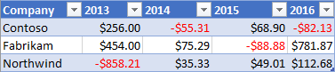
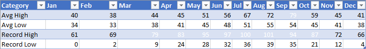

# <a name="apply-conditional-formatting-to-excel-ranges"></a>Excel の範囲に条件付き書式を適用する

Excel の JavaScript ライブラリは、ワークシートのデータ範囲に条件付き書式を適用するための API を提供します。 この機能により、大量のデータ セットの視覚的な解析を簡単に行うことができます。 範囲内で行われた変更に応じて、書式も動的に更新されます。 

> [!NOTE]
> この記事では、Excel の JavaScript のアドインのコンテキストにおける条件付き書式について説明します。次の記事では、Excel の完全な条件付き書式機能に関する詳細情報を提供しています。
> -  [条件付き書式を追加、変更、またはクリアする](https://support.office.com/article/add-change-or-clear-conditional-formats-8a1cc355-b113-41b7-a483-58460332a1af)
> -  [数式を使って条件付き書式を適用する](https://support.office.com/article/Use-formulas-with-conditional-formatting-FED60DFA-1D3F-4E13-9ECB-F1951FF89D7F)

## <a name="programmatic-control-of-conditional-formatting"></a>条件付き書式のプログラムによる制御

`Range.conditionalFormats` プロパティは、範囲に適用される [ConditionalFormat](/javascript/api/excel/excel.conditionalformat) オブジェクトのコレクションです。  `ConditionalFormat` オブジェクトには、[ConditionalFormatType](/javascript/api/excel/excel.conditionalformattype) に基づいて適用される書式を定義するためのプロパティがいくつか含まれています。 

-    `cellValue`
-    `colorScale`
-    `custom`
-    `dataBar`
-    `iconSet`
-    `preset`
-    `textComparison`
-    `topBottom`

> [!NOTE]
> これらの書式設定プロパティにはそれぞれ、対応する `*OrNullObject` バリアントが存在します。 そのパターンの詳細については、「[*OrNullObject メソッド](../excel/excel-add-ins-advanced-concepts.md#ornullobject-methods)」セクションを参照してください。

ConditionalFormat オブジェクトに設定することができる書式の種類は、1 つのみです。 この種類は、[ConditionalFormatType](/javascript/api/excel/excel.conditionalformattype) の列挙値である `type` プロパティによって決定されます。 `type` は、範囲に条件付き書式を追加するときに設定されます。 

## <a name="creating-conditional-formatting-rules"></a>条件付き書式のルールの作成

条件付き書式を範囲に追加するには、`conditionalFormats.add` を使用します。 追加後、その条件付き書式に固有のプロパティを設定できます。 以下に、さまざまな種類の書式の作成例を示します。

### <a name="cell-value"></a>[セルの値](/javascript/api/excel/excel.cellvalueconditionalformat)

セルの値の条件付き書式では、[ConditionalCellValueRule](/javascript/api/excel/excel.conditionalcellvaluerule) 内の 1 つまたは 2 つの数式の結果に基づいて、ユーザー定義の書式を適用することができます。 `operator` プロパティは、結果式がどのように書式に関係するかを定義する [ConditionalCellValueOperator](/javascript/api/excel/excel.conditionalcellvalueoperator) です。

次に、範囲内の 0 未満の値すべてに赤のフォント色を適用する例を示します。



```typescript
const sheet = context.workbook.worksheets.getItem("Sample");
const range = sheet.getRange("B21:E23");
const conditionalFormat = range.conditionalFormats.add(
    Excel.ConditionalFormatType.cellValue
);

// set the font of negative numbers to red
conditionalFormat.cellValue.format.font.color = "red";
conditionalFormat.cellValue.rule = { formula1: "=0", operator: "LessThan" };

await context.sync();
```

### <a name="color-scale"></a>[カラー スケール](/javascript/api/excel/excel.colorscaleconditionalformat)

カラー スケールの条件付き書式では、データの範囲に色のグラデーションを適用することができます。 `ColorScaleConditionalFormat` 上の `criteria` プロパティは、3 つの [ConditionalColorScaleCriterion](/javascript/api/excel/excel.conditionalcolorscalecriterion) を定義します: `minimum`、`maximum`、`midpoint` (オプション) です。 これらの条件スケール ポイントにはそれぞれ、3 つのプロパティが存在します。

-    `color` - エンドポイントに対する HTML カラー コード。
-    `formula` - エンドポイントを表す数値または数式。 `type` が `lowestValue` または `highestValue` の場合、`null` となります。
-    `type` - 数式の評価方法。 `highestValue` と `lowestValue` は、書式設定対象の範囲内の値を参照します。

次に、範囲内の色を青から黄色、そして赤に設定する例を示します。 `minimum` と `maximum` はそれぞれ最低値と最高値を表すものであり、`null` 数式を使用します。 `midpoint` では、種類 `percentage` を数式 `"=50"` で使用しています。従って、中間の値を含むセルが黄色になります。


```typescript
const sheet = context.workbook.worksheets.getItem("Sample");
const range = sheet.getRange("B2:M5");
const conditionalFormat = range.conditionalFormats.add(
      Excel.ConditionalFormatType.colorScale
);

// color the backgrounds of the cells from blue to yellow to red based on value
const criteria = {
      minimum: {
           formula: null,
           type: Excel.ConditionalFormatColorCriterionType.lowestValue,
           color: "blue"
      },
      midpoint: {
           formula: "50",
           type: Excel.ConditionalFormatColorCriterionType.percent,
           color: "yellow"
      },
      maximum: {
           formula: null,
           type: Excel.ConditionalFormatColorCriterionType.highestValue,
           color: "red"
      }
};
conditionalFormat.colorScale.criteria = criteria;

await context.sync();
```

### <a name="custom"></a>[ユーザー設定](/javascript/api/excel/excel.customconditionalformat)

ユーザー設定の条件付き書式では、任意の複雑な数式に基づいて、ユーザー定義の書式をセルに適用することができます。 [ConditionalFormatRule](/javascript/api/excel/excel.conditionalformatrule) オブジェクトでは、さまざまな表記で数式を定義することができます。

-    `formula` - 標準の表記法。
-    `formulaLocal`-ユーザーの言語に基づいてローカライズされます。
-    `formulaR1C1` - R1C1 スタイルの表記法。

次に、左側にあるセルより高い数値を含むセルのフォント色を、緑にする例を示します。


```typescript
const sheet = context.workbook.worksheets.getItem("Sample");
const range = sheet.getRange("B8:E13");
const conditionalFormat = range.conditionalFormats.add(
     Excel.ConditionalFormatType.custom
);

// if a cell has a higher value than the one to its left, set that cell's font to green
conditionalFormat.custom.rule.formula = '=IF(B8>INDIRECT("RC[-1]",0),TRUE)';
conditionalFormat.custom.format.font.color = "green";

await context.sync();

```
### <a name="data-bar"></a>[データ バー](/javascript/api/excel/excel.databarconditionalformat)

データ バーの条件付き書式では、セルにデータ バーを追加することができます。 既定では、範囲内の最小値と最大値を基準にデータ バーのサイズ比が決まります。 `DataBarConditionalFormat`オブジェクトには、バーの外観を制御するプロパティがいくつかあります。 

次に、範囲内でデータ バーを左から右にグラデーション表示する例を示します。


```typescript
const sheet = context.workbook.worksheets.getItem("Sample");
const range = sheet.getRange("B8:E13");
const conditionalFormat = range.conditionalFormats.add(
     Excel.ConditionalFormatType.dataBar
);

// give left-to-right, default-appearance data bars to all the cells
conditionalFormat.dataBar.barDirection = Excel.ConditionalDataBarDirection.leftToRight;
await context.sync();
```

### <a name="icon-set"></a>[アイコン セット](/javascript/api/excel/excel.iconsetconditionalformat)

アイコン セットの条件付き書式では、Excel の[アイコン](/javascript/api/excel/excel.icon)を使用してセルを強調表示することができます。 `criteria` プロパティは、[ConditionalIconCriterion](/javascript/api/excel/excel.ConditionalIconCriterion) の配列です。挿入する記号と、その記号の挿入条件を定義します。 この配列には、既定のプロパティを持つ条件要素が事前設定されています。 個々のプロパティは上書きできません。 プロパティを書き換えるには、条件オブジェクト全体を置き換える必要があります。 

次に、3 つの三角形のアイコン セットを範囲に適用する例を示します。


```typescript
const sheet = context.workbook.worksheets.getItem("Sample");
const range = sheet.getRange("B8:E13");
const conditionalFormat = range.conditionalFormats.add(
     Excel.ConditionalFormatType.iconSet
);

const iconSetCF = conditionalFormat.iconSet;
iconSetCF.style = Excel.IconSet.threeTriangles;

/*
   With a "three*" icon set style, such as "threeTriangles", the third
    element in the criteria array (criteria[2]) defines the "top" icon;
    e.g., a green triangle. The second (criteria[1]) defines the "middle"
    icon, The first (criteria[0]) defines the "low" icon, but it can often 
    be left empty as this method does below, because every cell that
   does not match the other two criteria always gets the low icon.
*/
iconSetCF.criteria = [
    {} as any,
      {
        type: Excel.ConditionalFormatIconRuleType.number,
        operator: Excel.ConditionalIconCriterionOperator.greaterThanOrEqual,
        formula: "=700"
      },
      {
        type: Excel.ConditionalFormatIconRuleType.number,
        operator: Excel.ConditionalIconCriterionOperator.greaterThanOrEqual,
        formula: "=1000"
      }
];

await context.sync();
```

### <a name="preset-criteria"></a>[事前設定の条件](/javascript/api/excel/excel.presetcriteriaconditionalformat)

事前設定の条件付き書式では、選択した標準ルールに基づいて、ユーザー定義の書式を範囲に適用することができます。 これらのルールは、[ConditionalPresetCriteriaRule](/javascript/api/excel/excel.conditionalpresetcriteriarule) 内の [ConditionalFormatPresetCriterion](/javascript/api/excel/excel.ConditionalFormatPresetCriterion) で定義します。 

次の使用例は、セルの値が範囲の平均の1つ以上の標準偏差にある場合、その白に白の白のフォントを色を指定します。



```typescript
const sheet = context.workbook.worksheets.getItem("Sample");
const range = sheet.getRange("B2:M5");
const conditionalFormat = range.conditionalFormats.add(
     Excel.ConditionalFormatType.presetCriteria
);

// color every cell's font white that is one standard deviation above average relative to the range
conditionalFormat.preset.format.font.color = "white";
conditionalFormat.preset.rule = {
     criterion: Excel.ConditionalFormatPresetCriterion.oneStdDevAboveAverage
};

await context.sync();
```

### <a name="text-comparison"></a>[テキストの比較](/javascript/api/excel/excel.textconditionalformat)

テキストの比較の条件付き書式では、条件として文字列比較を使用します。 `rule` プロパティは、セルと比較する文字列と、比較の種類を指定する演算子を定義する、[ConditionalTextComparisonRule](/javascript/api/excel/excel.conditionaltextcomparisonrule) です。 

次の使用例は、セルのテキストに "遅延" が含まれている場合に、フォントの色を赤に設定します。


```typescript
const sheet = context.workbook.worksheets.getItem("Sample");
const range = sheet.getRange("B16:D18");
const conditionalFormat = range.conditionalFormats.add(
     Excel.ConditionalFormatType.containsText
);

// color the font of every cell containing "Delayed"
conditionalFormat.textComparison.format.font.color = "red";
conditionalFormat.textComparison.rule = {
     operator: Excel.ConditionalTextOperator.contains,
     text: "Delayed"
};

await context.sync();
```

### <a name="topbottom"></a>[上位/下位](/javascript/api/excel/excel.TopBottomconditionalformat)

上位/下位の条件付き書式では、範囲内の上位または下位の値を持つセルに書式を適用することができます。 [ConditionalTopBottomRule](/javascript/api/excel/excel.conditionaltopbottomrule) の種類である `rule` プロパティでは、条件を上位または下位のどちらで設定するのか、また順位とパーセンテージのどちらでランクを決定するのかを、設定します。 

次に、範囲内で一番上位の値を持つセルの色を緑に設定する例を示します。


```typescript
const sheet = context.workbook.worksheets.getItem("Sample");
const range = sheet.getRange("B21:E23");
const conditionalFormat = range.conditionalFormats.add(
     Excel.ConditionalFormatType.topBottom
);

// for the highest valued cell in the range, make the background green
conditionalFormat.topBottom.format.fill.color = "green"
conditionalFormat.topBottom.rule = { rank: 1, type: "TopItems"}

await context.sync();
```

## <a name="multiple-formats-and-priority"></a>複数の書式と優先度

範囲には、複数の条件付き書式を適用することができます。 フォント色が異なるなど、書式間で競合する要素がある場合、ある 1 つの書式のみがその競合要素に対して適用されます。 優先度は、`ConditionalFormat.priority` プロパティで定義します。 優先度は数値 (`ConditionalFormatCollection` のインデックスと同じ) です。書式を作成するときに設定することができます。 `priority` の値が低いほど、その書式の優先度が高くなります。

次に、選択されるフォント色が 2 つの書式間で競合している例を示します。 ここでは、負の数値に太字のフォントは割り当てられますが、フォント色は赤ではなく青となります。青のフォント色を指定する書式の優先度の方が高いためです。


```typescript
const sheet = context.workbook.worksheets.getItem("Sample");
const temperatureDataRange = sheet.tables.getItem("TemperatureTable").getDataBodyRange();


// Set low numbers to bold, dark red font and assign priority 1.
const presetFormat = temperatureDataRange.conditionalFormats
    .add(Excel.ConditionalFormatType.presetCriteria);
presetFormat.preset.format.font.color = "red";
presetFormat.preset.format.font.bold = true;
presetFormat.preset.rule = { criterion: Excel.ConditionalFormatPresetCriterion.oneStdDevBelowAverage };
presetFormat.priority = 1;

// Set negative numbers to blue font with green background and set priority 0.
const cellValueFormat = temperatureDataRange.conditionalFormats
    .add(Excel.ConditionalFormatType.cellValue);
cellValueFormat.cellValue.format.font.color = "blue";
cellValueFormat.cellValue.format.fill.color = "lightgreen";
cellValueFormat.cellValue.rule = { formula1: "=0", operator: "LessThan" };
cellValueFormat.priority = 0;

await context.sync();

```

### <a name="mutually-exclusive-conditional-formats"></a>同時使用不可の条件付き書式

`ConditionalFormat` の `stopIfTrue` を使用すると、優先度の低い条件付き書式を範囲に適用しないように設定することができます。 `stopIfTrue === true` が設定された条件付き書式が条件に一致して範囲に適用されると、その後ほかの条件付き書式は、書式の内容が競合していない場合であっても、一切適用されません。

次に、2 つの条件付き書式が範囲に追加されている例を示します。 ここでは、負の数値に、もう一方の条件付き書式が一致するかどうかに関わらず、青のフォント色と淡い緑の背景が適用されます。


```typescript
const sheet = context.workbook.worksheets.getItem("Sample");
const temperatureDataRange = sheet.tables.getItem("TemperatureTable").getDataBodyRange();

// Set low numbers to bold, dark red font and assign priority 1.
const presetFormat = temperatureDataRange.conditionalFormats
    .add(Excel.ConditionalFormatType.presetCriteria);
presetFormat.preset.format.font.color = "red";
presetFormat.preset.format.font.bold = true;
presetFormat.preset.rule = { criterion: Excel.ConditionalFormatPresetCriterion.oneStdDevBelowAverage };
presetFormat.priority = 1;

// Set negative numbers to blue font with green background and 
// set priority 0, but set stopIfTrue to true, so none of the 
// formatting of the conditional format with the higher priority
// value will apply, not even the bolding of the font.
const cellValueFormat = temperatureDataRange.conditionalFormats
    .add(Excel.ConditionalFormatType.cellValue);
cellValueFormat.cellValue.format.font.color = "blue";
cellValueFormat.cellValue.format.fill.color = "lightgreen";
cellValueFormat.cellValue.rule = { formula1: "=0", operator: "LessThan" };
cellValueFormat.priority = 0;
cellValueFormat.stopIfTrue = true;

await context.sync();
```

## <a name="see-also"></a>関連項目

- [Excel JavaScript API を使用した基本的なプログラミングの概念](../excel/excel-add-ins-core-concepts.md)
- [Excel JavaScript API を使用して範囲を操作する](../excel/excel-add-ins-ranges.md)
- [ConditionalFormat オブジェクト (JavaScript API for Excel)](/javascript/api/excel/excel.conditionalformat)
- [条件付き書式を追加、変更、またはクリアする](https://support.office.com/article/add-change-or-clear-conditional-formats-8a1cc355-b113-41b7-a483-58460332a1af)
- [数式を使って条件付き書式を適用する](https://support.office.com/article/Use-formulas-with-conditional-formatting-FED60DFA-1D3F-4E13-9ECB-F1951FF89D7F)
