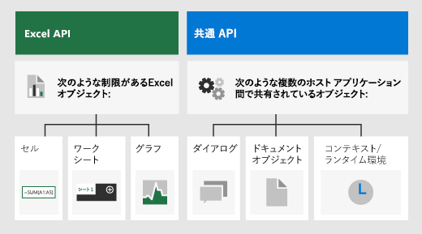

# <a name="fundamental-programming-concepts-with-the-excel-javascript-api"></a><span data-ttu-id="9a6a4-103">Excel JavaScript API を使用した基本的なプログラミングの概念</span><span class="sxs-lookup"><span data-stu-id="9a6a4-103">Fundamental programming concepts with the Excel JavaScript API</span></span>

<span data-ttu-id="9a6a4-104">この記事では、[Excel JavaScript API](../reference/overview/excel-add-ins-reference-overview.md) を使用して Excel 2016 以降のアドインをビルドする方法について説明します。</span><span class="sxs-lookup"><span data-stu-id="9a6a4-104">This article describes how to use the [Excel JavaScript API](../reference/overview/excel-add-ins-reference-overview.md) to build add-ins for Excel 2016 or later.</span></span> <span data-ttu-id="9a6a4-105">ここでは API の使用の基本となる中心概念について説明し、広い範囲に対する読み取り、書き込み、一定範囲内すべてのセルの更新など、特定のタスクを実行するためのガイダンスを提供します。</span><span class="sxs-lookup"><span data-stu-id="9a6a4-105">It introduces core concepts that are fundamental to using the API and provides guidance for performing specific tasks such as reading or writing to a large range, updating all cells in range, and more.</span></span>

> [!IMPORTANT]
> <span data-ttu-id="9a6a4-106">Excel API の非同期性とブックでの動作方法については、「[Using the application-specific API model (アプリケーション固有の API モデルの使用)](../develop/application-specific-api-model.md)」を参照してください。</span><span class="sxs-lookup"><span data-stu-id="9a6a4-106">See [Using the application-specific API model](../develop/application-specific-api-model.md) to learn about the asynchronous nature of the Excel APIs and how they work with the workbook.</span></span>  

## <a name="officejs-apis-for-excel"></a><span data-ttu-id="9a6a4-107">Excel 用の Office.js API</span><span class="sxs-lookup"><span data-stu-id="9a6a4-107">Office.js APIs for Excel</span></span>

<span data-ttu-id="9a6a4-108">Excel アドインは、次の 2 つの JavaScript オブジェクト モデルを含む Office JavaScript API を使用して、Excel のオブジェクトを操作します。</span><span class="sxs-lookup"><span data-stu-id="9a6a4-108">An Excel add-in interacts with objects in Excel by using the Office JavaScript API, which includes two JavaScript object models:</span></span>

* <span data-ttu-id="9a6a4-109">**Excel JavaScript API**:Office 2016 で導入された [Excel JavaScript API](../reference/overview/excel-add-ins-reference-overview.md) には、ワークシート、範囲、表、グラフなどへのアクセスに使用できる、厳密に型指定されたオブジェクトが用意されています。</span><span class="sxs-lookup"><span data-stu-id="9a6a4-109">**Excel JavaScript API**: Introduced with Office 2016, the [Excel JavaScript API](../reference/overview/excel-add-ins-reference-overview.md) provides strongly-typed objects that you can use to access worksheets, ranges, tables, charts, and more.</span></span>

* <span data-ttu-id="9a6a4-110">**共通 API**: Office 2013 で導入された[共通 API](/javascript/api/office) を使用すると、複数の種類の Office アプリケーション間で共通の UI、ダイアログ、クライアント設定などの機能にアクセスすることができます。</span><span class="sxs-lookup"><span data-stu-id="9a6a4-110">**Common APIs**: Introduced with Office 2013, the [Common API](/javascript/api/office) can be used to access features such as UI, dialogs, and client settings that are common across multiple types of Office applications.</span></span>

<span data-ttu-id="9a6a4-111">Excel 2016 以降を対象にしたアドインでは、機能の大部分を Excel JavaScript API を使用して開発する可能性がありますが、共通 API のオブジェクトも使用します。</span><span class="sxs-lookup"><span data-stu-id="9a6a4-111">While you'll likely use the Excel JavaScript API to develop the majority of functionality in add-ins that target Excel 2016 or later, you'll also use objects in the Common API.</span></span> <span data-ttu-id="9a6a4-112">例:</span><span class="sxs-lookup"><span data-stu-id="9a6a4-112">For example:</span></span>

* <span data-ttu-id="9a6a4-p103">[Context](/javascript/api/office/office.context): `Context`Context`contentLanguage` オブジェクトは、アドインのランタイム環境を表し、API の主要なオブジェクトへのアクセスを提供します。 これは `officeTheme` や `host` などのブック構成の詳細で構成され、`platform` や `requirements.isSetSupported()` などのアドインのランタイム環境に関する情報も提供します。 さらに、 メソッドも提供されます。これを使用すると、指定した要件セットが、アドインが実行されている Excel アプリケーションでサポートされているかどうかを確認できます。</span><span class="sxs-lookup"><span data-stu-id="9a6a4-p103">[Context](/javascript/api/office/office.context): The `Context` object represents the runtime environment of the add-in and provides access to key objects of the API. It consists of workbook configuration details such as `contentLanguage` and `officeTheme` and also provides information about the add-in's runtime environment such as `host` and `platform`. Additionally, it provides the `requirements.isSetSupported()` method, which you can use to check whether the specified requirement set is supported by the Excel application where the add-in is running.</span></span>
* <span data-ttu-id="9a6a4-116">[Document](/javascript/api/office/office.document): `Document` オブジェクトは `getFileAsync()` メソッドを提供します。これを使用すると、アドインが実行されている Excel ファイルをダウンロードできます。</span><span class="sxs-lookup"><span data-stu-id="9a6a4-116">[Document](/javascript/api/office/office.document): The `Document` object provides the `getFileAsync()` method, which you can use to download the Excel file where the add-in is running.</span></span>

<span data-ttu-id="9a6a4-117">次の図は、Excel JavaScript API または共通 API を使用するタイミングを示しています。</span><span class="sxs-lookup"><span data-stu-id="9a6a4-117">The following image illustrates when you might use the Excel JavaScript API or the Common APIs.</span></span>



## <a name="object-model"></a><span data-ttu-id="9a6a4-119">オブジェクト モデル</span><span class="sxs-lookup"><span data-stu-id="9a6a4-119">Object model</span></span>

<span data-ttu-id="9a6a4-120">Excel API について理解するには、ブックの構成要素が互いにどのように関連しているかを理解する必要があります。</span><span class="sxs-lookup"><span data-stu-id="9a6a4-120">To understand the Excel APIs, you must understand how the components of a workbook are related to one another.</span></span>

* <span data-ttu-id="9a6a4-121">**ブック** には、1 つ以上の **ワークシート** が含まれます。</span><span class="sxs-lookup"><span data-stu-id="9a6a4-121">A **Workbook** contains one or more **Worksheets**.</span></span>
* <span data-ttu-id="9a6a4-122">**ワークシート** では、**Range** オブジェクトを介してセルにアクセスできます。</span><span class="sxs-lookup"><span data-stu-id="9a6a4-122">A **Worksheet** gives access to cells through **Range** objects.</span></span>
* <span data-ttu-id="9a6a4-123">**Range** は、連続したセルのグループを表します。</span><span class="sxs-lookup"><span data-stu-id="9a6a4-123">A **Range** represents a group of contiguous cells.</span></span>
* <span data-ttu-id="9a6a4-124">**Range** は、**表**、**グラフ**、**図形**、およびその他のデータ可視化や組織オブジェクトを作成して配置するために使用されます。</span><span class="sxs-lookup"><span data-stu-id="9a6a4-124">**Ranges** are used to create and place **Tables**, **Charts**, **Shapes**, and other data visualization or organization objects.</span></span>
* <span data-ttu-id="9a6a4-125">**ワークシート** には、個々のシートに存在するデータ オブジェクトのコレクションが含まれます。</span><span class="sxs-lookup"><span data-stu-id="9a6a4-125">A **Worksheet** contains collections of those data objects that are present in the individual sheet.</span></span>
* <span data-ttu-id="9a6a4-126">**ブック** には、**ブック** 全体のデータ オブジェクト (**表** など) の一部のコレクションが含まれます。</span><span class="sxs-lookup"><span data-stu-id="9a6a4-126">**Workbooks** contain collections of some of those data objects (such as **Tables**) for the entire **Workbook**.</span></span>

### <a name="ranges"></a><span data-ttu-id="9a6a4-127">範囲</span><span class="sxs-lookup"><span data-stu-id="9a6a4-127">Ranges</span></span>

<span data-ttu-id="9a6a4-128">範囲とは、ブック内の連続したセルのグループのことです。</span><span class="sxs-lookup"><span data-stu-id="9a6a4-128">A range is a group of contiguous cells in the workbook.</span></span> <span data-ttu-id="9a6a4-129">アドインでは、範囲を定義するのに通常 A1 形式の表記が使用されます (例: **B3** は、列 **B**、行 **3** の単一のセルで、**C2:F4** は、列 **C** から **F**、行 **2** から **4** までのセル)。</span><span class="sxs-lookup"><span data-stu-id="9a6a4-129">Add-ins typically use A1-style notation (e.g. **B3** for the single cell in column **B** and row **3** or **C2:F4** for the cells from columns **C** through **F** and rows **2** through **4**) to define ranges.</span></span>

<span data-ttu-id="9a6a4-130">範囲には `values`、`formulas`、`format` の 3 つの主要なプロパティがあります。</span><span class="sxs-lookup"><span data-stu-id="9a6a4-130">Ranges have three core properties: `values`, `formulas`, and `format`.</span></span> <span data-ttu-id="9a6a4-131">これらのプロパティで、セルの値、評価する数式、およびセルの視覚的な書式設定を取得または設定します。</span><span class="sxs-lookup"><span data-stu-id="9a6a4-131">These properties get or set the cell values, formulas to be evaluated, and the visual formatting of the cells.</span></span>

#### <a name="range-sample"></a><span data-ttu-id="9a6a4-132">サンプル範囲</span><span class="sxs-lookup"><span data-stu-id="9a6a4-132">Range sample</span></span>

<span data-ttu-id="9a6a4-133">次のサンプルで、売上記録の作成方法を示します。</span><span class="sxs-lookup"><span data-stu-id="9a6a4-133">The following sample shows how to create sales records.</span></span> <span data-ttu-id="9a6a4-134">この関数は、`Range` オブジェクトを使用して、値、数式、書式を設定します。</span><span class="sxs-lookup"><span data-stu-id="9a6a4-134">This function uses `Range` objects to set the values, formulas, and formats.</span></span>

```js
Excel.run(function (context) {
    var sheet = context.workbook.worksheets.getActiveWorksheet();

    // Create the headers and format them to stand out.
    var headers = [
      ["Product", "Quantity", "Unit Price", "Totals"]
    ];
    var headerRange = sheet.getRange("B2:E2");
    headerRange.values = headers;
    headerRange.format.fill.color = "#4472C4";
    headerRange.format.font.color = "white";

    // Create the product data rows.
    var productData = [
      ["Almonds", 6, 7.5],
      ["Coffee", 20, 34.5],
      ["Chocolate", 10, 9.56],
    ];
    var dataRange = sheet.getRange("B3:D5");
    dataRange.values = productData;

    // Create the formulas to total the amounts sold.
    var totalFormulas = [
      ["=C3 * D3"],
      ["=C4 * D4"],
      ["=C5 * D5"],
      ["=SUM(E3:E5)"]
    ];
    var totalRange = sheet.getRange("E3:E6");
    totalRange.formulas = totalFormulas;
    totalRange.format.font.bold = true;

    // Display the totals as US dollar amounts.
    totalRange.numberFormat = [["$0.00"]];

    return context.sync();
});
```

<span data-ttu-id="9a6a4-135">このサンプルは、現在のワークシートに次のデータを作成します。</span><span class="sxs-lookup"><span data-stu-id="9a6a4-135">This sample creates the following data in the current worksheet:</span></span>


### <a name="charts-tables-and-other-data-objects"></a><span data-ttu-id="9a6a4-137">グラフ、表、およびその他のデータ オブジェクト</span><span class="sxs-lookup"><span data-stu-id="9a6a4-137">Charts, tables, and other data objects</span></span>

<span data-ttu-id="9a6a4-138">Excel JavaScript API を使用することにより、Excel 内でデータ構造やビジュアル化を作成および操作できます。</span><span class="sxs-lookup"><span data-stu-id="9a6a4-138">The Excel JavaScript APIs can create and manipulate the data structures and visualizations within Excel.</span></span> <span data-ttu-id="9a6a4-139">表とグラフの 2 つのオブジェクトが頻繁に使用されますが、API はピボットテーブル、図形、画像などもサポートしています。</span><span class="sxs-lookup"><span data-stu-id="9a6a4-139">Tables and charts are two of the more commonly used objects, but the APIs support PivotTables, shapes, images, and more.</span></span>

#### <a name="creating-a-table"></a><span data-ttu-id="9a6a4-140">表の作成</span><span class="sxs-lookup"><span data-stu-id="9a6a4-140">Creating a table</span></span>

<span data-ttu-id="9a6a4-141">データが入力された範囲を使用することにより、表を作成します。</span><span class="sxs-lookup"><span data-stu-id="9a6a4-141">Create tables by using data-filled ranges.</span></span> <span data-ttu-id="9a6a4-142">書式設定とテーブル コントロール (フィルターなど) が自動的に範囲に適用されます。</span><span class="sxs-lookup"><span data-stu-id="9a6a4-142">Formatting and table controls (such as filters) are automatically applied to the range.</span></span>

<span data-ttu-id="9a6a4-143">次のサンプルでは、前のサンプルの範囲を使用して表を作成します。</span><span class="sxs-lookup"><span data-stu-id="9a6a4-143">The following sample creates a table using the ranges from the previous sample.</span></span>

```js
Excel.run(function (context) {
    var sheet = context.workbook.worksheets.getActiveWorksheet();
    sheet.tables.add("B2:E5", true);
    return context.sync();
});
```

<span data-ttu-id="9a6a4-144">前のデータを含むワークシート上でこのサンプル コードを使用すると、次のテーブルが作成されます。</span><span class="sxs-lookup"><span data-stu-id="9a6a4-144">Using this sample code on the worksheet with the previous data creates the following table:</span></span>


#### <a name="creating-a-chart"></a><span data-ttu-id="9a6a4-146">グラフの作成</span><span class="sxs-lookup"><span data-stu-id="9a6a4-146">Creating a chart</span></span>

<span data-ttu-id="9a6a4-147">グラフを作成すると、範囲内のデータを視覚化できます。</span><span class="sxs-lookup"><span data-stu-id="9a6a4-147">Create charts to visualize the data in a range.</span></span> <span data-ttu-id="9a6a4-148">この API は、さまざまな種類のグラフをサポートしています。いずれのグラフも、必要に応じてカスタマイズできます。</span><span class="sxs-lookup"><span data-stu-id="9a6a4-148">The APIs support dozens of chart varieties, each of which can be customized to suit your needs.</span></span>

<span data-ttu-id="9a6a4-149">次のサンプルでは 3 つの品目の簡単な縦棒グラフが作成され、ワークシートの上端から 100 ピクセル下に配置されます。</span><span class="sxs-lookup"><span data-stu-id="9a6a4-149">The following sample creates a simple column chart for three items and places it 100 pixels below the top of the worksheet.</span></span>

```js
Excel.run(function (context) {
    var sheet = context.workbook.worksheets.getActiveWorksheet();
    var chart = sheet.charts.add(Excel.ChartType.columnStacked, sheet.getRange("B3:C5"));
    chart.top = 100;
    return context.sync();
});
```

<span data-ttu-id="9a6a4-150">前の表を含むワークシート上でこのサンプルを実行すると、次のグラフが作成されます。</span><span class="sxs-lookup"><span data-stu-id="9a6a4-150">Running this sample on the worksheet with the previous table creates the following chart:</span></span>


## <a name="run-options"></a><span data-ttu-id="9a6a4-152">実行オプション</span><span class="sxs-lookup"><span data-stu-id="9a6a4-152">Run options</span></span>

<span data-ttu-id="9a6a4-153">`Excel.run` には、[RunOptions](/javascript/api/excel/excel.runoptions) オブジェクトを使用するオーバーロードがあります。</span><span class="sxs-lookup"><span data-stu-id="9a6a4-153">`Excel.run` has an overload that takes in a [RunOptions](/javascript/api/excel/excel.runoptions) object.</span></span> <span data-ttu-id="9a6a4-154">これには、関数の実行時にプラットフォームの動作に影響を与えるプロパティのセットが含まれています。</span><span class="sxs-lookup"><span data-stu-id="9a6a4-154">This contains a set of properties that affect platform behavior when the function runs.</span></span> <span data-ttu-id="9a6a4-155">次のプロパティが現在サポートされています。</span><span class="sxs-lookup"><span data-stu-id="9a6a4-155">The following property is currently supported:</span></span>

* <span data-ttu-id="9a6a4-156">`delayForCellEdit`: ユーザーがセル編集モードを終了するまでバッチ要求を延期するかどうかを指定します。</span><span class="sxs-lookup"><span data-stu-id="9a6a4-156">`delayForCellEdit`: Determines whether Excel delays the batch request until the user exits cell edit mode.</span></span> <span data-ttu-id="9a6a4-157">**true** の場合、バッチ要求は延期され、ユーザーがセル編集モードを終了した時点で実行されます。</span><span class="sxs-lookup"><span data-stu-id="9a6a4-157">When **true**, the batch request is delayed and runs when the user exits cell edit mode.</span></span> <span data-ttu-id="9a6a4-158">**false** の場合、バッチ要求は、ユーザーがセル編集モードにある場合、自動的に失敗します (ユーザーにエラーが表示されます)。</span><span class="sxs-lookup"><span data-stu-id="9a6a4-158">When **false**, the batch request automatically fails if the user is in cell edit mode (causing an error to reach the user).</span></span> <span data-ttu-id="9a6a4-159">`delayForCellEdit` プロパティが指定されていない場合の既定の動作は、このプロパティが **false** の場合と同じ動作となります。</span><span class="sxs-lookup"><span data-stu-id="9a6a4-159">The default behavior with no `delayForCellEdit` property specified is equivalent to when it is **false**.</span></span>

```js
Excel.run({ delayForCellEdit: true }, function (context) { ... })
```

## <a name="null-or-blank-property-values"></a><span data-ttu-id="9a6a4-160">null または空白のプロパティ値</span><span class="sxs-lookup"><span data-stu-id="9a6a4-160">null or blank property values</span></span>

<span data-ttu-id="9a6a4-161">`null` と空の文字列は、Excel JavaScript API では特別な意味を持ちます。</span><span class="sxs-lookup"><span data-stu-id="9a6a4-161">`null` and empty strings have special implications in the Excel JavaScript APIs.</span></span> <span data-ttu-id="9a6a4-162">これらは、空のセル、書式設定なし、既定値を表すために使用されます。</span><span class="sxs-lookup"><span data-stu-id="9a6a4-162">They're used to represent empty cells, no formatting, or default values.</span></span> <span data-ttu-id="9a6a4-163">このセクションでは、プロパティの取得や設定を行うときに `null` や空の文字列を使用する方法について詳しく説明します。</span><span class="sxs-lookup"><span data-stu-id="9a6a4-163">This section details the use of `null` and empty string when getting and setting properties.</span></span>

### <a name="null-input-in-2-d-array"></a><span data-ttu-id="9a6a4-164">2 次元配列での null の入力</span><span class="sxs-lookup"><span data-stu-id="9a6a4-164">null input in 2-D Array</span></span>

<span data-ttu-id="9a6a4-p113">Excel では、範囲は 2 次元配列で表され、最初のディメンションは行、2 番目のディメンションは列を示します。 範囲内の特定のセルだけに値、数値書式、または数式を設定するには、2 次元配列内のそのセルに値、数値書式、または数式を指定し、2 次元配列内のその他のすべてのセルに `null` を指定します。</span><span class="sxs-lookup"><span data-stu-id="9a6a4-p113">In Excel, a range is represented by a 2-D array, where the first dimension is rows and the second dimension is columns. To set values, number format, or formula for only specific cells within a range, specify the values, number format, or formula for those cells in the 2-D array, and specify `null` for all other cells in the 2-D array.</span></span>

<span data-ttu-id="9a6a4-p114">たとえば、範囲内の 1 つのセルの数値書式を更新し、範囲内の他のセルすべての既存の数値書式を保持する場合、更新するセルに新しい数値書式を指定し、他のセルすべてに `null` を指定します。 次のコード スニペットでは、範囲内の 4 番目のセルに新しい数値書式を設定し、その前の 3 つのセルについては数値書式を変更せずに保持します。</span><span class="sxs-lookup"><span data-stu-id="9a6a4-p114">For example, to update the number format for only one cell within a range, and retain the existing number format for all other cells in the range, specify the new number format for the cell to update, and specify `null` for all other cells. The following code snippet sets a new number format for the fourth cell in the range, and leaves the number format unchanged for the first three cells in the range.</span></span>

```js
range.values = [['Eurasia', '29.96', '0.25', '15-Feb' ]];
range.numberFormat = [[null, null, null, 'm/d/yyyy;@']];
```

### <a name="null-input-for-a-property"></a><span data-ttu-id="9a6a4-169">プロパティに対する null の入力</span><span class="sxs-lookup"><span data-stu-id="9a6a4-169">null input for a property</span></span>

<span data-ttu-id="9a6a4-p115">`null` は単一プロパティに有効な入力ではありません。たとえば、次のコード スニペットは、範囲の `values` プロパティを `null` に設定できないため無効です。</span><span class="sxs-lookup"><span data-stu-id="9a6a4-p115">`null` is not a valid input for single property. For example, the following code snippet is not valid, as the `values` property of the range cannot be set to `null`.</span></span>

```js
range.values = null;
```

<span data-ttu-id="9a6a4-172">同様に、次のコード スニペットは、`null` が `color` プロパティで有効な値ではないため無効です。</span><span class="sxs-lookup"><span data-stu-id="9a6a4-172">Likewise, the following code snippet is not valid, as `null` is not a valid value for the `color` property.</span></span>

```js
range.format.fill.color =  null;
```

### <a name="null-property-values-in-the-response"></a><span data-ttu-id="9a6a4-173">応答内の null プロパティ値</span><span class="sxs-lookup"><span data-stu-id="9a6a4-173">null property values in the response</span></span>

<span data-ttu-id="9a6a4-p116">指定の範囲に複数の値がある場合、`size` および `color` などの書式設定プロパティでは、応答に `null` 値が含まれます。 たとえば、範囲を取得してその `format.font.color` プロパティを読み込む場合:</span><span class="sxs-lookup"><span data-stu-id="9a6a4-p116">Formatting properties such as `size` and `color` will contain `null` values in the response when different values exist in the specified range. For example, if you retrieve a range and load its `format.font.color` property:</span></span>

* <span data-ttu-id="9a6a4-176">範囲内のすべてのセルのフォントの色が同じ場合、`range.format.font.color` がその色を指定します。</span><span class="sxs-lookup"><span data-stu-id="9a6a4-176">If all cells in the range have the same font color, `range.format.font.color` specifies that color.</span></span>
* <span data-ttu-id="9a6a4-177">範囲内に複数のフォントの色がある場合、`range.format.font.color` は `null` です。</span><span class="sxs-lookup"><span data-stu-id="9a6a4-177">If multiple font colors are present within the range, `range.format.font.color` is `null`.</span></span>

### <a name="blank-input-for-a-property"></a><span data-ttu-id="9a6a4-178">プロパティに対する空白の入力</span><span class="sxs-lookup"><span data-stu-id="9a6a4-178">Blank input for a property</span></span>

<span data-ttu-id="9a6a4-p117">プロパティに空白の値 (`''` の間にスペースのない 2 つの引用符) を指定すると、プロパティをクリアまたはリセットする指示として解釈されます。例:</span><span class="sxs-lookup"><span data-stu-id="9a6a4-p117">When you specify a blank value for a property (i.e., two quotation marks with no space in-between `''`), it will be interpreted as an instruction to clear or reset the property. For example:</span></span>

* <span data-ttu-id="9a6a4-181">範囲の `values` プロパティに空白の値を指定すると、範囲のコンテンツはクリアされます。</span><span class="sxs-lookup"><span data-stu-id="9a6a4-181">If you specify a blank value for the `values` property of a range, the content of the range is cleared.</span></span>
* <span data-ttu-id="9a6a4-182">`numberFormat` プロパティに空白の値を指定すると、数値書式は `General` にリセットされます。</span><span class="sxs-lookup"><span data-stu-id="9a6a4-182">If you specify a blank value for the `numberFormat` property, the number format is reset to `General`.</span></span>
* <span data-ttu-id="9a6a4-183">`formula` プロパティと `formulaLocale` プロパティに空白の値を指定すると、数式の値はクリアされます。</span><span class="sxs-lookup"><span data-stu-id="9a6a4-183">If you specify a blank value for the `formula` property and `formulaLocale` property, the formula values are cleared.</span></span>

### <a name="blank-property-values-in-the-response"></a><span data-ttu-id="9a6a4-184">応答内の空白のプロパティ値</span><span class="sxs-lookup"><span data-stu-id="9a6a4-184">Blank property values in the response</span></span>

<span data-ttu-id="9a6a4-p118">読み取り操作では、応答内の空白のプロパティ値 (`''` の間にスペースのない、2 つの引用符) は、セルにデータまたは値がないことを示します。 次の 1 番目の例では、範囲内の最初と最後のセルにデータがありません。 2 番目の例では、範囲内の最初の 2 つのセルに数式がありません。</span><span class="sxs-lookup"><span data-stu-id="9a6a4-p118">For read operations, a blank property value in the response (i.e., two quotation marks with no space in-between `''`) indicates that cell contains no data or value. In the first example below, the first and last cell in the range contain no data. In the second example, the first two cells in the range do not contain a formula.</span></span>

```js
range.values = [['', 'some', 'data', 'in', 'other', 'cells', '']];
```

```js
range.formula = [['', '', '=Rand()']];
```

## <a name="requirement-sets"></a><span data-ttu-id="9a6a4-188">要件セット</span><span class="sxs-lookup"><span data-stu-id="9a6a4-188">Requirement sets</span></span>

<span data-ttu-id="9a6a4-189">要件セットは、API メンバーの名前付きグループです。</span><span class="sxs-lookup"><span data-stu-id="9a6a4-189">Requirement sets are named groups of API members.</span></span> <span data-ttu-id="9a6a4-190">Office アドインはランタイム チェックを実行できます。または、マニフェストで指定されている要件セットを使用して、Office アプリケーションがアドインに必要な API をサポートしているかどうかを確認できます。</span><span class="sxs-lookup"><span data-stu-id="9a6a4-190">An Office Add-in can perform a runtime check or use requirement sets specified in the manifest to determine whether an Office application supports the APIs that the add-in needs.</span></span> <span data-ttu-id="9a6a4-191">サポートされている各プラットフォームで使用できる特定の要件セットを確認するには、「[Excel JavaScript API の要件セット](../reference/requirement-sets/excel-api-requirement-sets.md)」を参照してください。</span><span class="sxs-lookup"><span data-stu-id="9a6a4-191">To identify the specific requirement sets that are available on each supported platform, see [Excel JavaScript API requirement sets](../reference/requirement-sets/excel-api-requirement-sets.md).</span></span>

### <a name="checking-for-requirement-set-support-at-runtime"></a><span data-ttu-id="9a6a4-192">実行時に要件セットのサポートを確認する</span><span class="sxs-lookup"><span data-stu-id="9a6a4-192">Checking for requirement set support at runtime</span></span>

<span data-ttu-id="9a6a4-193">次のコード サンプルは、アドインが実行されている Office アプリケーションが指定された API の要件セットをサポートしているかどうかを確認する方法を示しています。</span><span class="sxs-lookup"><span data-stu-id="9a6a4-193">The following code sample shows how to determine whether the Office application where the add-in is running supports the specified API requirement set.</span></span>

```js
if (Office.context.requirements.isSetSupported('ExcelApi', '1.3')) {
  /// perform actions
}
else {
  /// provide alternate flow/logic
}
```

### <a name="defining-requirement-set-support-in-the-manifest"></a><span data-ttu-id="9a6a4-194">マニフェストで要件セットのサポートを定義する</span><span class="sxs-lookup"><span data-stu-id="9a6a4-194">Defining requirement set support in the manifest</span></span>

<span data-ttu-id="9a6a4-195">アドインのマニフェストで [Requirements 要素](../reference/manifest/requirements.md) を使用して、アドインをアクティブにするために必要な最小要件セットや API メソッド (またはその両方) を指定できます。</span><span class="sxs-lookup"><span data-stu-id="9a6a4-195">You can use the [Requirements element](../reference/manifest/requirements.md) in the add-in manifest to specify the minimal requirement sets and/or API methods that your add-in requires to activate.</span></span> <span data-ttu-id="9a6a4-196">Office アプリケーションやプラットフォームが、マニフェストの `Requirements` 要素で指定した要件セットまたは API メソッドをサポートしない場合、アドインはそのアプリケーションまたはプラットフォームでは実行されず、**[個人用アドイン]** に表示されるアドインの一覧にも表示されません。</span><span class="sxs-lookup"><span data-stu-id="9a6a4-196">If the Office application or platform doesn't support the requirement sets or API methods that are specified in the `Requirements` element of the manifest, the add-in won't run in that application or platform, and it won't display in the list of add-ins that are shown in **My Add-ins**.</span></span>

<span data-ttu-id="9a6a4-197">次のコード サンプルは、アドインが ExcelApi 要件セットのバージョン 1.3 以上をサポートする Office クライアント アプリケーションのすべてで読み込まれる必要があることを指定する、アドインのマニフェストの `Requirements` 要素を示しています。</span><span class="sxs-lookup"><span data-stu-id="9a6a4-197">The following code sample shows the `Requirements` element in an add-in manifest which specifies that the add-in should load in all Office client applications that support ExcelApi requirement set version 1.3 or greater.</span></span>

```xml
<Requirements>
   <Sets DefaultMinVersion="1.3">
      <Set Name="ExcelApi" MinVersion="1.3"/>
   </Sets>
</Requirements>
```

> [!NOTE]
> <span data-ttu-id="9a6a4-198">Excel on the web、Windows、iPad などの Office アプリケーションのプラットフォームすべてでアドインを使用できるようにするには、マニフェストで要件セットのサポートを定義するのではなく、実行時に要件のサポートを確認することをお勧めします。</span><span class="sxs-lookup"><span data-stu-id="9a6a4-198">To make your add-in available on all platforms of an Office application, such as Excel on the web, Windows, and iPad, we recommend that you check for requirement support at runtime instead of defining requirement set support in the manifest.</span></span>

### <a name="requirement-sets-for-the-officejs-common-api"></a><span data-ttu-id="9a6a4-199">Office.js 共通 API の要件セット</span><span class="sxs-lookup"><span data-stu-id="9a6a4-199">Requirement sets for the Office.js Common API</span></span>

<span data-ttu-id="9a6a4-200">共通 API の要件セットの詳細については、「[Office 共通 API の要件セット](../reference/requirement-sets/office-add-in-requirement-sets.md)」をご覧ください。</span><span class="sxs-lookup"><span data-stu-id="9a6a4-200">For information about Common API requirement sets, see [Office Common API requirement sets](../reference/requirement-sets/office-add-in-requirement-sets.md).</span></span>

## <a name="handle-errors"></a><span data-ttu-id="9a6a4-201">エラーを処理する</span><span class="sxs-lookup"><span data-stu-id="9a6a4-201">Handle errors</span></span>

<span data-ttu-id="9a6a4-202">API エラーが発生すると、API はコードとメッセージを含む `error` オブジェクトを返します。</span><span class="sxs-lookup"><span data-stu-id="9a6a4-202">When an API error occurs, the API returns an `error` object that contains a code and a message.</span></span> <span data-ttu-id="9a6a4-203">エラーの処理に関する詳細と、API エラーの一覧については、「[エラー処理](excel-add-ins-error-handling.md)」を参照してください。</span><span class="sxs-lookup"><span data-stu-id="9a6a4-203">For detailed information about error handling, including a list of API errors, see [Error handling](excel-add-ins-error-handling.md).</span></span>

## <a name="see-also"></a><span data-ttu-id="9a6a4-204">関連項目</span><span class="sxs-lookup"><span data-stu-id="9a6a4-204">See also</span></span>

* [<span data-ttu-id="9a6a4-205">最初の Excel アドインをビルドする</span><span class="sxs-lookup"><span data-stu-id="9a6a4-205">Build your first Excel add-in</span></span>](../quickstarts/excel-quickstart-jquery.md)
* [<span data-ttu-id="9a6a4-206">Excel アドインのコード サンプル</span><span class="sxs-lookup"><span data-stu-id="9a6a4-206">Excel add-ins code samples</span></span>](https://developer.microsoft.com/office/gallery/?filterBy=Samples,Excel)
* [<span data-ttu-id="9a6a4-207">Excel の JavaScript API を使用した、パフォーマンスの最適化</span><span class="sxs-lookup"><span data-stu-id="9a6a4-207">Excel JavaScript API performance optimization</span></span>](../excel/performance.md)
* [<span data-ttu-id="9a6a4-208">Excel JavaScript API リファレンス</span><span class="sxs-lookup"><span data-stu-id="9a6a4-208">Excel JavaScript API reference</span></span>](../reference/overview/excel-add-ins-reference-overview.md)
