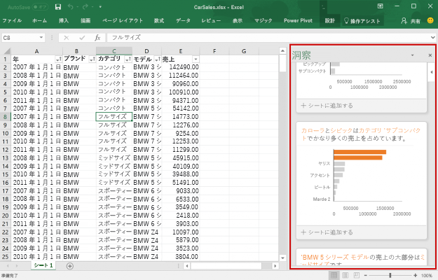
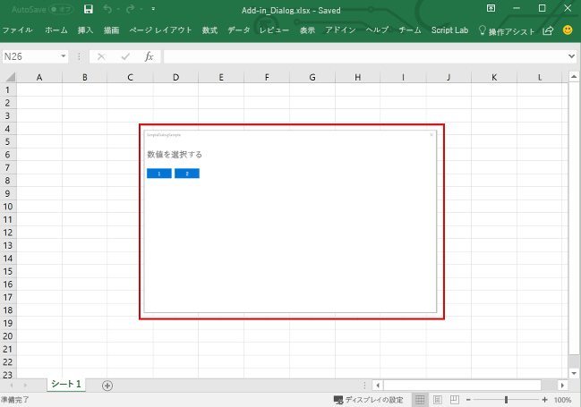
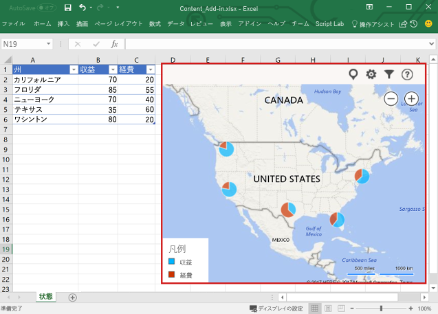

# Excel の機能を拡張する

Excel アドインでは、ブックのコンテンツとやりとりするだけでなく、カスタムのリボン ボタンやメニュー コマンドを追加したり、作業ウィンドウを挿入したり、ダイアログ ボックスを開いたり、豊富な Web ベースのコンテンツをワークシートに直接埋め込んだりすることもできます。

## アドイン コマンド

アドイン コマンドは、Excel UI を拡張し、アドインでアクションを開始する UI 要素です。 アドイン コマンドを使用すると、リボン上のボタンやアイテムを Excel のコンテキスト メニューに追加できます。 ユーザーがアドイン コマンドを選択すると、JavaScript コードを実行したり、アドインのページを作業ウィンドウに表示したりするなどのアクションが開始されます。 

**アドイン コマンド**

コマンドの機能、サポートされているプラットフォーム、およびアドイン コマンド開発のベスト プラクティスについては、「[Excel、Word、および PowerPoint のアドイン コマンド](../design/add-in-commands.md)」を参照してください。

## 作業ウィンドウ

作業ウィンドウは、通常 Excel 内のウィンドウの右側に表示されるインターフェイスのサーフェスです。 作業ウィンドウにより、ユーザーはコードを実行して Excel ドキュメントを修正したり、データ ソースからデータを表示したりするインターフェイス コントロールにアクセスできます。 

**作業ウィンドウ**

作業ウィンドウの詳細については、「[Office アドインの作業ウィンドウ](../design/task-pane-add-ins.md)」を参照してください。Excel の作業ウィンドウを実装するサンプルについては、「[Excel アドインの JS WoodGrove Expense Trends](https://github.com/OfficeDev/Excel-Add-in-WoodGrove-Expense-Trends)」を参照してください。

## ダイアログ ボックス

ダイアログ ボックスは、作業中の Excel アプリケーション ウィンドウの手前に浮動するサーフェスです。 ダイアログ ボックスは、作業ウィンドウに直接開くことができないサインイン ページの表示、ユーザーによるアクションを確認するための要求、作業ウィンドウ内で再生すると小さすぎるビデオのホストなどの作業に使用できます。 Excel アドインでダイアログ ボックスを開くには、[ダイアログ API](../../reference/shared/officeui.md) を使用します。

**ダイアログ ボックス**

ダイアログ ボックスとダイアログ API の詳細については、「[Office アドインのダイアログ ボックス](../design/dialog-boxes.md)」と「[Office アドインでダイアログ API を使用する](../develop/dialog-api-in-office-add-ins.md)」を参照してください。

## コンテンツ アドイン

コンテンツ アドインは、Excel ドキュメントに直接埋め込むことができるサーフェスです。 コンテンツ アドインを使用すると、グラフ、データのビジュアル化、メディアなど豊富な Web ベース オブジェクトをワークシートに埋め込んだり、Excel ドキュメントの変更またはデータ ソースのデータの表示のためのコードを実行するインターフェイス コントロールへのアクセスをユーザーに提供したりできます。 機能を直接ドキュメントに埋め込む場合は、コンテンツ アドインを使用します。

**コンテンツ アドイン**

コンテンツ アドインの詳細については、「[コンテンツ Office アドイン](../design/content-add-ins.md)」を参照してください。Excel のコンテンツ アドインの実装サンプルについては、GitHub の「[Excel コンテンツ アドイン Humongous Insurance](https://github.com/OfficeDev/Excel-Content-Add-in-Humongous-Insurance)」を参照してください。

## その他のリソース

- [Excel、Word、PowerPoint のアドイン コマンド](../design/add-in-commands.md)
- [マニフェストでアドイン コマンドを定義する](../develop/define-add-in-commands.md)
- [GitHub における Office アドイン コマンドのサンプル](https://github.com/OfficeDev/Office-Add-in-Commands-Samples/)
- [Office アドインの作業ウィンドウ](../design/task-pane-add-ins.md)
- [Excel アドイン:JS WoodGrove Expense Trends](https://github.com/OfficeDev/Excel-Add-in-WoodGrove-Expense-Trends)
- [Office アドインのダイアログ ボックス](../design/dialog-boxes.md)
- [Office アドインでダイアログ API を使用する](../develop/dialog-api-in-office-add-ins.md)
- [Office アドイン ダイアログ API の例](https://github.com/OfficeDev/Office-Add-in-Dialog-API-Simple-Example)
- [コンテンツ Office アドイン](../design/content-add-ins.md)
- [Excel コンテンツ アドイン:Humongous Insurance](https://github.com/OfficeDev/Excel-Content-Add-in-Humongous-Insurance)
