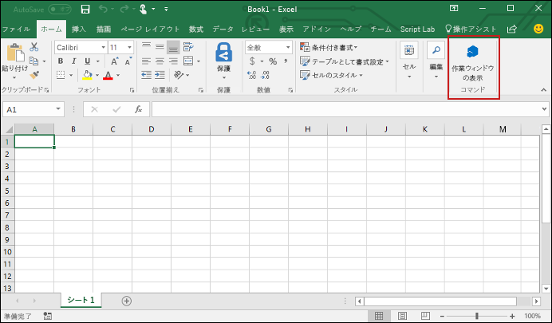
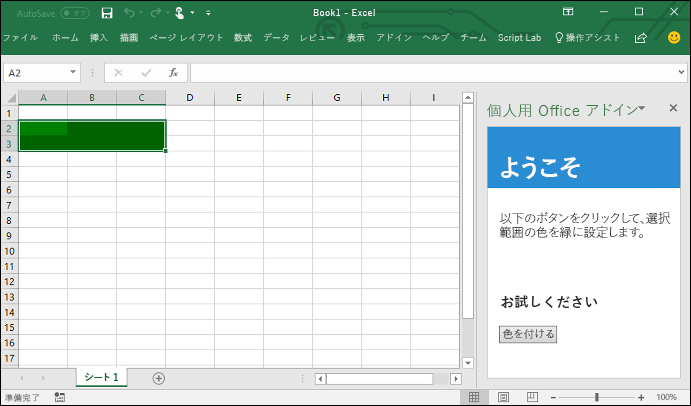

# <a name="build-an-excel-add-in-using-jquery"></a>jQuery を使用して Excel のアドインを作成する

この記事では、jQuery と Excel の JavaScript API を使用して Excel アドインを構築する手順について説明します。

## <a name="prerequisites"></a>前提条件

[Yeoman](https://github.com/yeoman/yo) と [Office アドイン用の Yeoman ジェネレーター](https://github.com/OfficeDev/generator-office)をグローバルにインストールします (まだインストールしていない場合)。

    ```bash
    npm install -g yo generator-office
    ```

## <a name="create-the-web-app"></a>Web アプリを作成する

1. ローカル ドライブにフォルダーを作成し、**my-addin** という名前を付けます。 ここにアプリのファイルを作成します。

2. アプリ フォルダーに移動します。

    ```bash
    cd my-addin
    ```

3. Yeoman ジェネレーター使用して、アドインのマニフェスト ファイルを生成します。 次のコマンドを実行し、以下のスクリーンショットに示すとおり、プロンプトに応答します。

    ```bash
    yo office
    ```
    


4. コード エディターで、プロジェクトのルートにある **index.html** を開きます。 このファイルでは、アドインの作業ウィンドウにレンダリングされる HTML を指定します。 
 
5. 生成された `header` タグを次に示すマークアップに置き換えます。
 
    ```html
    <div id="content-header">
        <div class="padding">
            <h1>Welcome</h1>
        </div>
    </div>
    ```

6. 生成された `main` タグを次に示すマークアップに置き換えて、ファイルを保存します。

    ```html
    <div id="content-main">
        <div class="padding">
            <p>Choose the button below to set the color of the selected range to green.</p>
            <br />
            <h3>Try it out</h3>
            <button class="ms-Button" id="set-color">Set color</button>
        </div>
    </div>
    ```

7. **app.js** ファイルを開いて、アドインのスクリプトを指定します。 すぐに呼び出される生成された関数式を次に示すコードに置き換えて、ファイルを保存します。

    ```js
    (function () {
        "use strict";

        Office.initialize = function (reason) {
            $(document).ready(function () {
                $('#set-color').click(setColor);
            });
        };

        function setColor() {
            Excel.run(function (context) {
                var range = context.workbook.getSelectedRange();
                range.format.fill.color = 'green';

                return context.sync();
            }).catch(function (error) {
                console.log("Error: " + error);
                if (error instanceof OfficeExtension.Error) {
                    console.log("Debug info: " + JSON.stringify(error.debugInfo));
                }
            });
        }
    })();
    ```

8. **app.css** ファイルを開いて、アドインのカスタム スタイルを指定します。 コンテンツ (著作権のコメント以外) を次のものに置き換えて、ファイルを保存します。

    ```css
    #content-header {
        background: #2a8dd4;
        color: #fff;
        position: absolute;
        top: 0;
        left: 0;
        width: 100%;
        height: 80px; 
        overflow: hidden;
    }

    #content-main {
        background: #fff;
        position: fixed;
        top: 80px;
        left: 0;
        right: 0;
        bottom: 0;
        overflow: auto; 
    }

    .padding {
        padding: 15px;
    }
    ```

## <a name="configure-the-manifest-file-and-sideload-the-add-in"></a>マニフェスト ファイルを構成してアドインをサイドロードする

1. **my-office-add-in-manifest.xml** ファイルを開いて、アドインの設定と機能を定義します。 

2. **ProviderName** タグには、プレースホルダーの値が設定されています。 これを `Microsoft` に変更します。

3. **DisplayName** タグの **DefaultValue** には、プレースホルダーの値が設定されています。 これを `A task pane add-in for Excel` に変更します。 

4. ファイルを閉じずに保存します。

## <a name="configure-to-use-http"></a>HTTP を使用するように構成する

Office Web アドインは、開発中であっても HTTP ではなく HTTPS を使用する必要があります。 ただし、すぐにアドインを稼働状態にして実行するために、このクイック スタートでは HTTP を使用します。 これを有効にするには、次の手順を実行します。

1. マニフェスト ファイルの **my-office-add-in-manifest.xml** で、すべての "https" を "http" に置き換えます。 ファイルを保存して閉じます。

2. プロジェクトのルートにある **bsconfig.json** ファイルを開きます。 **https** プロパティの値を `false` に変更します。 ファイルを保存します。


## <a name="try-it-out"></a>お試しください

1. アドインを実行して、Excel 内のアドインをサイドロードするのに使用するプラットフォームの手順に従います。

    - Windows:[Windows でのテスト用に Office アドインをサイドロードする](../testing/create-a-network-shared-folder-catalog-for-task-pane-and-content-add-ins.md)
    - Excel Online:[Office Online で Office アドインをサイドロードする](../testing/sideload-office-add-ins-for-testing.md#sideload-an-office-add-in-on-office-online)
    - iPad および Mac: [iPad と Mac で Office アドインをサイドロードする](../testing/sideload-an-office-add-in-on-ipad-and-mac.md)

2. プロジェクトのルートで bash ターミナルを開いて、次に示すコマンドを実行して開発用サーバーを起動します。

    ```bash
    npm start
    ```

   > **注**: アドインが含まれているブラウザー ウィンドウが開きます。 このウィンドウを閉じます。

3. Excel で、**[ホーム]** タブを選択し、リボンの **[作業ウィンドウの表示]** ボタンをクリックして、アドインの作業ウィンドウを開きます。

    

4. ワークシート内で任意のセルの範囲を選択します。

5. 作業ウィンドウで、**[色の選択]** ボタンをクリックして、選択範囲の色を緑に設定します。

    

## <a name="next-steps"></a>次の手順

これで完了です。jQuery を使用して Excel アドインが正常に作成されました。 次に、Excel アドイン構築の[中心概念](excel-add-ins-core-concepts.md)の詳細について説明します。

## <a name="additional-resources"></a>その他のリソース

* [Excel JavaScript API の中心概念](excel-add-ins-core-concepts.md)
* [Script Lab でスニペットを探す](https://store.office.com/en-001/app.aspx?assetid=WA104380862&ui=en-US&rs=en-001&ad=US&appredirect=false)
* [Excel アドインのコード サンプル](http://dev.office.com/code-samples#?filters=excel,office%20add-ins)
* [Excel JavaScript API リファレンス](http://dev.office.com/reference/add-ins/excel/excel-add-ins-reference-overview)
