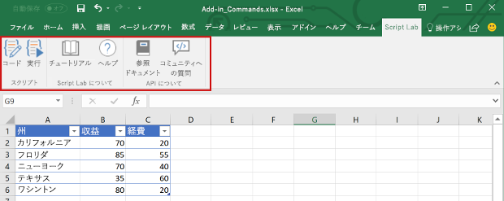

# Excel アドインの概要

Excel アドインを使用すると、Windows、Mac、iPad、ブラウザーなどの複数のプラットフォームで Excel アプリケーションの機能を拡張できます。ブック内で Excel アドインを使用すると、次の操作を実行できます。

- Excel オブジェクトを操作して Excel データを読み書きします。
- Web ベースの作業ウィンドウまたはコンテンツ ウィンドウを使用して機能を拡張します
- カスタム リボン ボタンやコンテキスト メニューの項目を追加します
- カスタム関数を追加します
- ダイアログ ウィンドウを使用して充実した操作を提供します

Office アドインのプラットフォームには、Excel アドインの作成と実行を可能にするフレームワークと Office.js JavaScript API が用意されています。Office アドインのプラットフォームを使用した Excel アドインの作成には、次の利点があります。

* **クロスプラットフォーム サポート**: Excel アドインは、Office on the web、Windows、Mac、iPad で実行できます。
* **一元展開**: 管理者は、組織全体のユーザーに Excel アドインをすばやく簡単に展開できます。
* **標準の Web テクノロジの使用**: HTML、CSS、JavaScript などの一般的な Web テクノロジを使用する Excel アドインを作成します。
* **AppSource を経由した配布**: Excel アドインを [AppSource](https://appsource.microsoft.com/marketplace/apps?product=office&page=1&src=office&corrid=53245fad-fcbe-41f8-9f97-b0840264f97c&omexanonuid=4a0102fb-b31a-4b9f-9bb0-39d4cc6b789d) に公開することで、幅広いユーザーと共有します。

> [!NOTE]
> Excel アドインは、Windows での Office でのみ実行する、以前の Office 統合ソリューションである COM アドインや VSTO アドインとは異なります。COM アドインとは異なり、Excel アドインではユーザーのデバイスや Excel 内にコードをインストールする必要はありません。

## Excel アドインのコンポーネント

Excel アドインには 2 つの基本コンポーネントが含まれています。Web アプリケーションと、マニフェスト ファイルと呼ばれる構成ファイルです。 

Web アプリケーションは、[Office JavaScript API](../reference/javascript-api-for-office.md) を使用して Excel のオブジェクトを操作します。また、オンライン リソースとの相互操作を簡単にすることもできます。 たとえば、アドインでは次の操作を実行できます。

* ブック内のデータ (ワークシート、範囲、表、グラフ、名前付きの項目など) を作成、読み込み、更新、および削除します。
* 標準の OAuth 2.0 のフローを使用して、オンライン サービスでユーザー認証を実行します。
* Microsoft Graph やその他の API に、API 要求を発行します。

Web アプリケーションは、任意の Web サーバー上でホストできます。また、クライアント側のフレームワーク (Angular、React、jQuery など) や、サーバー側のテクノロジ (ASP.NET、Node.js、PHP など) を使用して構築できます。

[マニフェスト](../develop/add-in-manifests.md)は XML 構成ファイルであり、次のような設定と機能を指定することによって、アドインと Office クライアントを統合する方法を定義します。

* アドインの Web アプリケーションの URL。
* アドインの表示名、説明、ID、バージョン、および既定のロケール。
* アドインと Excel を統合する方法。アドインが作成する任意のカスタム UI (リボンのボタン、コンテキスト メニューなど) の統合を含む。
* ドキュメントの読み取り、書き込みなど、アドインに必要なアクセス許可。

エンドユーザーが Excel アドインをインストールして使用できるようにするには、そのマニフェストを AppSource かアドイン カタログに公開する必要があります。 AppSource の発行の詳細について、「[AppSource と Office 内でソリューションを使用できるようにする](/office/dev/store/submit-to-appsource-via-partner-center)」を参照してください。

## Excel アドインの機能

ブック内のコンテンツの操作の他に、Excel アドインでは、カスタム リボンのボタンやメニュー コマンドを追加したり、作業ウィンドウを挿入したり、カスタム関数を追加したり、ダイアログ ボックスを開いたり、グラフや対話型のビジュアル化などの豊富な Web ベースのオブジェクトをワークシート内に埋め込むことができます。

### アドイン コマンド

アドイン コマンドは、Excel UI を拡張する UI 要素であり、アドインのアクションを開始します。アドイン コマンドを使って、Excel のリボンにボタンを追加したり、コンテキスト メニューに項目を追加したりできます。ユーザーがアドイン コマンドを選択するときは、JavaScript コードの実行や、作業ウィンドウでのアドインのページの表示といったアクションを開始します。 

**アドイン コマンド**

コマンドの機能、サポートされているプラットフォーム、およびアドイン コマンド開発のベスト プラクティスについては、「[Excel、Word、および PowerPoint のアドイン コマンド](../design/add-in-commands.md)」を参照してください。

### 作業ウィンドウ

作業ウィンドウは、通常 Excel 内のウィンドウの右側に表示されるインターフェイスのサーフェスです。作業ウィンドウにより、ユーザーはコードを実行して Excel ドキュメントを修正したり、データ ソースからデータを表示したりするインターフェイス コントロールにアクセスできます。 

**作業ウィンドウ**

作業ウィンドウの詳細については、「[Office アドインの作業ウィンドウ](../design/task-pane-add-ins.md)」を参照してください。Excel の作業ウィンドウを実装するサンプルについては、「[Excel アドインの JS WoodGrove Expense Trends](https://github.com/OfficeDev/Excel-Add-in-WoodGrove-Expense-Trends)」を参照してください。

### カスタム関数

開発者は、カスタム関数を使用して関数をアドインの一部として JavaScript で定義することによって、Excel に新しい関数を追加できます。 ユーザーは Excel 内から、`SUM()` などの Excel のあらゆるネイティブ関数の場合と同じようにカスタム関数にアクセスできます。 

**カスタム関数**

カスタム関数の詳細については、「[Excel でカスタム関数を作成する](custom-functions-overview.md)」を参照してください。

### ダイアログ ボックス

ダイアログ ボックスは、作業中の Excel アプリケーション ウィンドウの手前に浮動するサーフェスです。 ダイアログ ボックスは、作業ウィンドウに直接開くことができないサインイン ページの表示、ユーザーによるアクションを確認するための要求、作業ウィンドウ内で再生すると小さすぎるビデオのホストなどの作業に使用できます。 Excel アドインでダイアログ ボックスを開くには、[ダイアログ API](/javascript/api/office/office.ui) を使用します。

**ダイアログ ボックス**

ダイアログ ボックスとダイアログ API の詳細については、「[Office アドインのダイアログ ボックス](../design/dialog-boxes.md)」と「[Office アドインでダイアログ API を使用する](../develop/dialog-api-in-office-add-ins.md)」を参照してください。

### コンテンツ アドイン

コンテンツ アドインは、Excel ドキュメントに直接埋め込むことができるサーフェスです。 コンテンツ アドインを使用すると、グラフ、データのビジュアル化、メディアなど豊富な Web ベース オブジェクトをワークシートに埋め込んだり、Excel ドキュメントの変更またはデータ ソースのデータの表示のためのコードを実行するインターフェイス コントロールへのアクセスをユーザーに提供したりできます。 機能を直接ドキュメントに埋め込む場合は、コンテンツ アドインを使用します。

**コンテンツ アドイン**

コンテンツ アドインの詳細については、「[コンテンツ Office アドイン](../design/content-add-ins.md)」を参照してください。Excel のコンテンツ アドインの実装サンプルについては、GitHub の「[Excel コンテンツ アドイン Humongous Insurance](https://github.com/OfficeDev/Excel-Content-Add-in-Humongous-Insurance)」を参照してください。

## ブックのコンテンツを操作する JavaScript API

Excel アドインは、次の 2 つの JavaScript オブジェクト モデルを含む [Office JavaScript API](../reference/javascript-api-for-office.md) を使用して、Excel のオブジェクトを操作します。

* **Excel JavaScript API**:Office 2016 で導入された [Excel JavaScript API](../reference/overview/excel-add-ins-reference-overview.md) には、ワークシート、範囲、表、グラフなどへのアクセスに使用できる、厳密に型指定された Excel オブジェクトが用意されています。 

* **共通 API**: Office 2013 で導入された共通 API を使用すると、複数の種類の Office アプリケーション間で共通の UI、ダイアログ、クライアント設定などの機能にアクセスすることができます。 共通 API は Excel の操作に限られた機能を提供します。そのため、アドインを Excel 2013 で実行する必要がある場合に使用できます。

## 次の手順

[最初の Excel アドインを作成する](../quickstarts/excel-quickstart-jquery.md)ことから始めます。 次に、Excel アドイン構築の[中心概念](excel-add-ins-core-concepts.md)について説明します。

## 関連項目

- [Office アドイン プラットフォームの概要](../overview/office-add-ins.md)
- [Office アドインを構築する](../overview/office-add-ins-fundamentals.md)
- [Excel JavaScript API を使用した基本的なプログラミングの概念](excel-add-ins-core-concepts.md)
- [Excel JavaScript API リファレンス](../reference/overview/excel-add-ins-reference-overview.md)