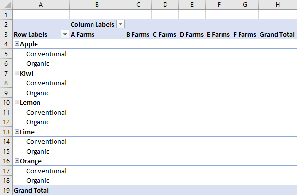

# <a name="work-with-pivottables-using-the-excel-javascript-api"></a><span data-ttu-id="493b3-103">Excel JavaScript API を使用してピボットテーブルを操作する</span><span class="sxs-lookup"><span data-stu-id="493b3-103">Work with PivotTables using the Excel JavaScript API</span></span>

<span data-ttu-id="493b3-104">ピボットテーブルは、より大きなデータセットを合理化します。</span><span class="sxs-lookup"><span data-stu-id="493b3-104">PivotTables streamline larger data sets.</span></span> <span data-ttu-id="493b3-105">グループ化されたデータのクイック操作を可能にします。</span><span class="sxs-lookup"><span data-stu-id="493b3-105">They allow the quick manipulation of grouped data.</span></span> <span data-ttu-id="493b3-106">Excel JavaScript API を使用すると、アドインでピボットテーブルを作成し、それらのコンポーネントを操作できます。</span><span class="sxs-lookup"><span data-stu-id="493b3-106">The Excel JavaScript API lets your add-in create PivotTables and interact with their components.</span></span> <span data-ttu-id="493b3-107">この記事では、Office JavaScript API によってピボットテーブルがどのように表現されるかについて説明し、主要なシナリオのコードサンプルを示します。</span><span class="sxs-lookup"><span data-stu-id="493b3-107">This article describes how PivotTables are represented by the Office JavaScript API and provides code samples for key scenarios.</span></span>

<span data-ttu-id="493b3-108">ピボットテーブルの機能についてよく知らない場合は、エンドユーザーとしての調査を検討してください。</span><span class="sxs-lookup"><span data-stu-id="493b3-108">If you are unfamiliar with the functionality of PivotTables, consider exploring them as an end user.</span></span>
<span data-ttu-id="493b3-109">これらのツールの詳細については、「[ワークシートデータを分析するためのピボットテーブルを作成する](https://support.office.com/article/Import-and-analyze-data-ccd3c4a6-272f-4c97-afbb-d3f27407fcde#ID0EAABAAA=PivotTables)」を参照してください。</span><span class="sxs-lookup"><span data-stu-id="493b3-109">See [Create a PivotTable to analyze worksheet data](https://support.office.com/article/Import-and-analyze-data-ccd3c4a6-272f-4c97-afbb-d3f27407fcde#ID0EAABAAA=PivotTables) for a good primer on these tools.</span></span>

> [!IMPORTANT]
> <span data-ttu-id="493b3-110">OLAP を使用して作成されたピボットテーブルは現在サポートされていません。</span><span class="sxs-lookup"><span data-stu-id="493b3-110">PivotTables created with OLAP are not currently supported.</span></span> <span data-ttu-id="493b3-111">Power Pivot もサポートされていません。</span><span class="sxs-lookup"><span data-stu-id="493b3-111">There is also no support for Power Pivot.</span></span>

## <a name="object-model"></a><span data-ttu-id="493b3-112">オブジェクト モデル</span><span class="sxs-lookup"><span data-stu-id="493b3-112">Object model</span></span>

<span data-ttu-id="493b3-113">[PivotTable](/javascript/api/excel/excel.pivottable)は、OFFICE JavaScript API のピボットテーブルの中心的なオブジェクトです。</span><span class="sxs-lookup"><span data-stu-id="493b3-113">The [PivotTable](/javascript/api/excel/excel.pivottable) is the central object for PivotTables in the Office JavaScript API.</span></span>

- <span data-ttu-id="493b3-114">`Workbook.pivotTables`および`Worksheet.pivotTables`は、ブックとワークシートの[ピボットテーブル](/javascript/api/excel/excel.pivottable)をそれぞれ含む[PivotTableCollections](/javascript/api/excel/excel.pivottablecollection)です。</span><span class="sxs-lookup"><span data-stu-id="493b3-114">`Workbook.pivotTables` and `Worksheet.pivotTables` are [PivotTableCollections](/javascript/api/excel/excel.pivottablecollection) that contain the [PivotTables](/javascript/api/excel/excel.pivottable) in the workbook and worksheet, respectively.</span></span>
- <span data-ttu-id="493b3-115">[ピボットテーブル](/javascript/api/excel/excel.pivottable)に、複数の[PivotHierarchies](/javascript/api/excel/excel.pivothierarchy)を持つ[PivotTableCollections](/javascript/api/excel/excel.pivottablecollection)が含まれています。</span><span class="sxs-lookup"><span data-stu-id="493b3-115">A [PivotTable](/javascript/api/excel/excel.pivottable) contains a [PivotTableCollections](/javascript/api/excel/excel.pivottablecollection) that has multiple [PivotHierarchies](/javascript/api/excel/excel.pivothierarchy).</span></span>
- <span data-ttu-id="493b3-116">[PivotHierarchy](/javascript/api/excel/excel.pivothierarchy)には、1つだけの[PivotField](/javascript/api/excel/excel.pivotfield)を持つ[pivotfieldcollection](/javascript/api/excel/excel.pivotfieldcollection)が含まれています。</span><span class="sxs-lookup"><span data-stu-id="493b3-116">A [PivotHierarchy](/javascript/api/excel/excel.pivothierarchy) contains a [PivotFieldCollection](/javascript/api/excel/excel.pivotfieldcollection) that has exactly one [PivotField](/javascript/api/excel/excel.pivotfield).</span></span> <span data-ttu-id="493b3-117">デザインを拡張して OLAP ピボットテーブルが含まれる場合は、これが変更されることがあります。</span><span class="sxs-lookup"><span data-stu-id="493b3-117">If the design expands to include OLAP PivotTables, this may change.</span></span>
- <span data-ttu-id="493b3-118">[PivotField](/javascript/api/excel/excel.pivotfield)には、複数の[PivotItems](/javascript/api/excel/excel.pivotitem)を持つ[PivotItemCollection](/javascript/api/excel/excel.pivotitemcollection)が含まれています。</span><span class="sxs-lookup"><span data-stu-id="493b3-118">A [PivotField](/javascript/api/excel/excel.pivotfield) contains a [PivotItemCollection](/javascript/api/excel/excel.pivotitemcollection) that has multiple [PivotItems](/javascript/api/excel/excel.pivotitem).</span></span>
- <span data-ttu-id="493b3-119">[ピボットテーブル](/javascript/api/excel/excel.pivottable)には、ピボット[フィールド](/javascript/api/excel/excel.pivotfield)と[PivotItems](/javascript/api/excel/excel.pivotitem)をワークシートのどこに表示するかを定義する[PivotLayout](/javascript/api/excel/excel.pivotlayout)が含まれています。</span><span class="sxs-lookup"><span data-stu-id="493b3-119">A [PivotTable](/javascript/api/excel/excel.pivottable) contains a [PivotLayout](/javascript/api/excel/excel.pivotlayout) that defines where the [PivotFields](/javascript/api/excel/excel.pivotfield) and [PivotItems](/javascript/api/excel/excel.pivotitem) are displayed in the worksheet.</span></span>

<span data-ttu-id="493b3-120">これらの関係がいくつかの例のデータにどのように適用されるかを見てみましょう。</span><span class="sxs-lookup"><span data-stu-id="493b3-120">Let's look at how these relationships apply to some example data.</span></span> <span data-ttu-id="493b3-121">次のデータは、さまざまなファームからの果物販売を示しています。</span><span class="sxs-lookup"><span data-stu-id="493b3-121">The following data describes fruit sales from various farms.</span></span> <span data-ttu-id="493b3-122">この記事全体の例を示します。</span><span class="sxs-lookup"><span data-stu-id="493b3-122">It will be the example throughout this article.</span></span>


<span data-ttu-id="493b3-124">この果物 farm sales データは、ピボットテーブルを作成するために使用されます。</span><span class="sxs-lookup"><span data-stu-id="493b3-124">This fruit farm sales data will be used to make a PivotTable.</span></span> <span data-ttu-id="493b3-125">**Types**などの各列は、 `PivotHierarchy`です。</span><span class="sxs-lookup"><span data-stu-id="493b3-125">Each column, such as **Types**, is a `PivotHierarchy`.</span></span> <span data-ttu-id="493b3-126">**種類**の階層には、[**種類**] フィールドが含まれています。</span><span class="sxs-lookup"><span data-stu-id="493b3-126">The **Types** hierarchy contains the **Types** field.</span></span> <span data-ttu-id="493b3-127">[**種類**] フィールドには、 **Apple**、 **Kiwi**、**レモン**、**黄**、**オレンジ色**の項目が含まれています。</span><span class="sxs-lookup"><span data-stu-id="493b3-127">The **Types** field contains the items **Apple**, **Kiwi**, **Lemon**, **Lime**, and **Orange**.</span></span>

### <a name="hierarchies"></a><span data-ttu-id="493b3-128">Hierarchies</span><span class="sxs-lookup"><span data-stu-id="493b3-128">Hierarchies</span></span>

<span data-ttu-id="493b3-129">ピボットテーブルは、[行](/javascript/api/excel/excel.rowcolumnpivothierarchy)、[列](/javascript/api/excel/excel.rowcolumnpivothierarchy)、[データ](/javascript/api/excel/excel.datapivothierarchy)、および[フィルター](/javascript/api/excel/excel.filterpivothierarchy)の4つの階層カテゴリに基づいて編成されます。</span><span class="sxs-lookup"><span data-stu-id="493b3-129">PivotTables are organized based on four hierarchy categories: [row](/javascript/api/excel/excel.rowcolumnpivothierarchy), [column](/javascript/api/excel/excel.rowcolumnpivothierarchy), [data](/javascript/api/excel/excel.datapivothierarchy), and [filter](/javascript/api/excel/excel.filterpivothierarchy).</span></span>

<span data-ttu-id="493b3-130">前に示したファームデータには、ファーム、**種類**、**分類**、 **Crates で販売**されたファーム、 **Crates 販売**された卸売の5つの階層が**あります。**</span><span class="sxs-lookup"><span data-stu-id="493b3-130">The farm data shown earlier has five hierarchies: **Farms**, **Type**, **Classification**, **Crates Sold at Farm**, and **Crates Sold Wholesale**.</span></span> <span data-ttu-id="493b3-131">各階層は、4つのカテゴリのいずれかにのみ存在できます。</span><span class="sxs-lookup"><span data-stu-id="493b3-131">Each hierarchy can only exist in one of the four categories.</span></span> <span data-ttu-id="493b3-132">**型**が列階層に追加されている場合は、行、データ、またはフィルター階層に配置することもできません。</span><span class="sxs-lookup"><span data-stu-id="493b3-132">If **Type** is added to column hierarchies, it cannot also be in the row, data, or filter hierarchies.</span></span> <span data-ttu-id="493b3-133">その後、**型**が行階層に追加されると、列階層から削除されます。</span><span class="sxs-lookup"><span data-stu-id="493b3-133">If **Type** is subsequently added to row hierarchies, it is removed from the column hierarchies.</span></span> <span data-ttu-id="493b3-134">この動作は、階層の割り当てが Excel UI または Excel JavaScript Api のどちらで行われた場合でも同じです。</span><span class="sxs-lookup"><span data-stu-id="493b3-134">This behavior is the same whether hierarchy assignment is done through the Excel UI or the Excel JavaScript APIs.</span></span>

<span data-ttu-id="493b3-135">行と列の階層は、データをグループ化する方法を定義します。</span><span class="sxs-lookup"><span data-stu-id="493b3-135">Row and column hierarchies define how data will be grouped.</span></span> <span data-ttu-id="493b3-136">たとえば、**ファーム**の行階層は、同じファームのすべてのデータセットをグループ化します。</span><span class="sxs-lookup"><span data-stu-id="493b3-136">For example, a row hierarchy of **Farms** will group together all the data sets from the same farm.</span></span> <span data-ttu-id="493b3-137">行と列の階層を選択すると、ピボットテーブルの向きが定義されます。</span><span class="sxs-lookup"><span data-stu-id="493b3-137">The choice between row and column hierarchy defines the orientation of the PivotTable.</span></span>

<span data-ttu-id="493b3-138">データ階層は、行と列の階層に基づいて集計される値です。</span><span class="sxs-lookup"><span data-stu-id="493b3-138">Data hierarchies are the values to be aggregated based on the row and column hierarchies.</span></span> <span data-ttu-id="493b3-139">**ファームの行**階層があり、 **Crates**のデータ階層があるピボットテーブルには、各ファームのすべての異なる fruits の合計 (既定では) が表示されます。</span><span class="sxs-lookup"><span data-stu-id="493b3-139">A PivotTable with a row hierarchy of **Farms** and a data hierarchy of **Crates Sold Wholesale** shows the sum total (by default) of all the different fruits for each farm.</span></span>

<span data-ttu-id="493b3-140">フィルター階層では、フィルター処理された種類の値に基づいて、ピボットのデータが含まれるか、除外されます。</span><span class="sxs-lookup"><span data-stu-id="493b3-140">Filter hierarchies include or exclude data from the pivot based on values within that filtered type.</span></span> <span data-ttu-id="493b3-141">**有機**的に選択された種類の**分類**のフィルター階層は、有機フルーツのデータのみを表示します。</span><span class="sxs-lookup"><span data-stu-id="493b3-141">A filter hierarchy of **Classification** with the type **Organic** selected only shows data for organic fruit.</span></span>

<span data-ttu-id="493b3-142">次に、ファームデータをピボットテーブルと共に示します。</span><span class="sxs-lookup"><span data-stu-id="493b3-142">Here is the farm data again, alongside a PivotTable.</span></span> <span data-ttu-id="493b3-143">ピボットテーブルは、**ファーム**と**タイプ**を行階層として使用し、**ファームで販売**された Crates と**Crates**がデータ階層として (既定の集計関数を使用して)、データ階層として (**有機**が選択された状態で)**分類**しています。</span><span class="sxs-lookup"><span data-stu-id="493b3-143">The PivotTable is using **Farm** and **Type** as the row hierarchies, **Crates Sold at Farm** and **Crates Sold Wholesale** as the data hierarchies (with the default aggregation function of sum), and **Classification** as a filter hierarchy (with **Organic** selected).</span></span>


<span data-ttu-id="493b3-145">このピボットテーブルは、JavaScript API または Excel UI を使用して生成できます。</span><span class="sxs-lookup"><span data-stu-id="493b3-145">This PivotTable could be generated through the JavaScript API or through the Excel UI.</span></span> <span data-ttu-id="493b3-146">両方のオプションを使用すると、アドインをさらに操作できます。</span><span class="sxs-lookup"><span data-stu-id="493b3-146">Both options allow for further manipulation through add-ins.</span></span>

## <a name="create-a-pivottable"></a><span data-ttu-id="493b3-147">ピボットテーブルを作成する</span><span class="sxs-lookup"><span data-stu-id="493b3-147">Create a PivotTable</span></span>

<span data-ttu-id="493b3-148">ピボットテーブルには、名前、ソース、および出力先が必要です。</span><span class="sxs-lookup"><span data-stu-id="493b3-148">PivotTables need a name, source, and destination.</span></span> <span data-ttu-id="493b3-149">ソースは、範囲内のアドレスまたはテーブル名 (、、 `Range`、 `string`または`Table`型として渡されます) を指定できます。</span><span class="sxs-lookup"><span data-stu-id="493b3-149">The source can be a range address or table name (passed as a `Range`, `string`, or `Table` type).</span></span> <span data-ttu-id="493b3-150">宛先は、または`Range` `string`のいずれかとして指定された範囲のアドレスです。</span><span class="sxs-lookup"><span data-stu-id="493b3-150">The destination is a range address (given as either a `Range` or `string`).</span></span>
<span data-ttu-id="493b3-151">次のサンプルは、さまざまなピボットテーブル作成手法を示しています。</span><span class="sxs-lookup"><span data-stu-id="493b3-151">The following samples show various PivotTable creation techniques.</span></span>

### <a name="create-a-pivottable-with-range-addresses"></a><span data-ttu-id="493b3-152">範囲のアドレスを使用してピボットテーブルを作成する</span><span class="sxs-lookup"><span data-stu-id="493b3-152">Create a PivotTable with range addresses</span></span>

```js
Excel.run(function (context) {
    // Create a PivotTable named "Farm Sales" on the current worksheet at cell
    // A22 with data from the range A1:E21.
    context.workbook.worksheets.getActiveWorksheet().pivotTables.add(
      "Farm Sales", "A1:E21", "A22");

    return context.sync();
});
```

### <a name="create-a-pivottable-with-range-objects"></a><span data-ttu-id="493b3-153">Range オブジェクトを使用してピボットテーブルを作成する</span><span class="sxs-lookup"><span data-stu-id="493b3-153">Create a PivotTable with Range objects</span></span>

```js
Excel.run(function (context) {
    // Create a PivotTable named "Farm Sales" on a worksheet called "PivotWorksheet" at cell A2
    // the data comes from the worksheet "DataWorksheet" across the range A1:E21.
    var rangeToAnalyze = context.workbook.worksheets.getItem("DataWorksheet").getRange("A1:E21");
    var rangeToPlacePivot = context.workbook.worksheets.getItem("PivotWorksheet").getRange("A2");
    context.workbook.worksheets.getItem("PivotWorksheet").pivotTables.add(
      "Farm Sales", rangeToAnalyze, rangeToPlacePivot);

    return context.sync();
});
```

### <a name="create-a-pivottable-at-the-workbook-level"></a><span data-ttu-id="493b3-154">ブックレベルでピボットテーブルを作成する</span><span class="sxs-lookup"><span data-stu-id="493b3-154">Create a PivotTable at the workbook level</span></span>

```js
Excel.run(function (context) {
    // Create a PivotTable named "Farm Sales" on a worksheet called "PivotWorksheet" at cell A2
    // the data is from the worksheet "DataWorksheet" across the range A1:E21.
    context.workbook.pivotTables.add(
        "Farm Sales", "DataWorksheet!A1:E21", "PivotWorksheet!A2");

    return context.sync();
});
```

## <a name="use-an-existing-pivottable"></a><span data-ttu-id="493b3-155">既存のピボットテーブルを使用する</span><span class="sxs-lookup"><span data-stu-id="493b3-155">Use an existing PivotTable</span></span>

<span data-ttu-id="493b3-156">手動で作成したピボットテーブルは、ブックまたは個々のワークシートの PivotTable コレクションからアクセスすることもできます。</span><span class="sxs-lookup"><span data-stu-id="493b3-156">Manually created PivotTables are also accessible through the PivotTable collection of the workbook or of individual worksheets.</span></span> <span data-ttu-id="493b3-157">次のコードは、ブックから**My Pivot**という名前のピボットテーブルを取得します。</span><span class="sxs-lookup"><span data-stu-id="493b3-157">The following code gets a PivotTable named **My Pivot** from the workbook.</span></span>

```js
Excel.run(function (context) {
    var pivotTable = context.workbook.pivotTables.getItem("My Pivot");
    return context.sync();
});
```

## <a name="add-rows-and-columns-to-a-pivottable"></a><span data-ttu-id="493b3-158">ピボットテーブルに行と列を追加する</span><span class="sxs-lookup"><span data-stu-id="493b3-158">Add rows and columns to a PivotTable</span></span>

<span data-ttu-id="493b3-159">行と列は、それらのフィールド値を中心にデータをピボットします。</span><span class="sxs-lookup"><span data-stu-id="493b3-159">Rows and columns pivot the data around those fields’ values.</span></span>

<span data-ttu-id="493b3-160">[**ファーム**] 列を追加すると、各ファームのすべての売上が回転します。</span><span class="sxs-lookup"><span data-stu-id="493b3-160">Adding the **Farm** column pivots all the sales around each farm.</span></span> <span data-ttu-id="493b3-161">**種類**と**分類**行を追加すると、果物が販売されたものと、それが有機であったかどうかに基づいてデータがさらに分解されます。</span><span class="sxs-lookup"><span data-stu-id="493b3-161">Adding the **Type** and **Classification** rows further breaks down the data based on what fruit was sold and whether it was organic or not.</span></span>



```js
Excel.run(function (context) {
    var pivotTable = context.workbook.worksheets.getActiveWorksheet().pivotTables.getItem("Farm Sales");

    pivotTable.rowHierarchies.add(pivotTable.hierarchies.getItem("Type"));
    pivotTable.rowHierarchies.add(pivotTable.hierarchies.getItem("Classification"));

    pivotTable.columnHierarchies.add(pivotTable.hierarchies.getItem("Farm"));

    return context.sync();
});
```

<span data-ttu-id="493b3-163">行または列だけのピボットテーブルを作成することもできます。</span><span class="sxs-lookup"><span data-stu-id="493b3-163">You can also have a PivotTable with only rows or columns.</span></span>

```js
Excel.run(function (context) {
    var pivotTable = context.workbook.worksheets.getActiveWorksheet().pivotTables.getItem("Farm Sales");
    pivotTable.rowHierarchies.add(pivotTable.hierarchies.getItem("Farm"));
    pivotTable.rowHierarchies.add(pivotTable.hierarchies.getItem("Type"));
    pivotTable.rowHierarchies.add(pivotTable.hierarchies.getItem("Classification"));

    return context.sync();
});
```

## <a name="add-data-hierarchies-to-the-pivottable"></a><span data-ttu-id="493b3-164">データ階層をピボットテーブルに追加する</span><span class="sxs-lookup"><span data-stu-id="493b3-164">Add data hierarchies to the PivotTable</span></span>

<span data-ttu-id="493b3-165">データ階層は、行と列に基づいて結合する情報で、ピボットテーブルに格納されます。</span><span class="sxs-lookup"><span data-stu-id="493b3-165">Data hierarchies fill the PivotTable with information to combine based on the rows and columns.</span></span> <span data-ttu-id="493b3-166">**ファームで販売**された Crates のデータ階層を追加し、 **Crates に販売**されたものは、行と列ごとにこれらの数値を合計します。</span><span class="sxs-lookup"><span data-stu-id="493b3-166">Adding the data hierarchies of **Crates Sold at Farm** and **Crates Sold Wholesale** gives sums of those figures for each row and column.</span></span>

<span data-ttu-id="493b3-167">この例では、**ファーム**と**種類**の両方が行で、箱 sales がデータとして含まれています。</span><span class="sxs-lookup"><span data-stu-id="493b3-167">In the example, both **Farm** and **Type** are rows, with the crate sales as the data.</span></span>


```js
Excel.run(function (context) {
    var pivotTable = context.workbook.worksheets.getActiveWorksheet().pivotTables.getItem("Farm Sales");

    // "Farm" and "Type" are the hierarchies on which the aggregation is based.
    pivotTable.rowHierarchies.add(pivotTable.hierarchies.getItem("Farm"));
    pivotTable.rowHierarchies.add(pivotTable.hierarchies.getItem("Type"));

    // "Crates Sold at Farm" and "Crates Sold Wholesale" are the hierarchies
    // that will have their data aggregated (summed in this case).
    pivotTable.dataHierarchies.add(pivotTable.hierarchies.getItem("Crates Sold at Farm"));
    pivotTable.dataHierarchies.add(pivotTable.hierarchies.getItem("Crates Sold Wholesale"));

    return context.sync();
});
```

## <a name="slicers"></a><span data-ttu-id="493b3-169">スライサー</span><span class="sxs-lookup"><span data-stu-id="493b3-169">Slicers</span></span>

<span data-ttu-id="493b3-170">[スライサー](/javascript/api/excel/excel.slicer)を使用すると、Excel のピボットテーブルまたはテーブルからデータをフィルターできます。</span><span class="sxs-lookup"><span data-stu-id="493b3-170">[Slicers](/javascript/api/excel/excel.slicer) allow data to be filtered from an Excel PivotTable or table.</span></span> <span data-ttu-id="493b3-171">スライサーは、指定された列またはピボットテーブルの値を使用して、対応する行にフィルターを適用します。</span><span class="sxs-lookup"><span data-stu-id="493b3-171">A slicer uses values from a specified column or PivotField to filter corresponding rows.</span></span> <span data-ttu-id="493b3-172">これらの値は`Slicer`、 [SlicerItem](/javascript/api/excel/excel.sliceritem)オブジェクトとしてに格納されます。</span><span class="sxs-lookup"><span data-stu-id="493b3-172">These values are stored as [SlicerItem](/javascript/api/excel/excel.sliceritem) objects in the `Slicer`.</span></span> <span data-ttu-id="493b3-173">アドインでは、ユーザーと同様に ([EXCEL UI を介し](https://support.office.com/article/Use-slicers-to-filter-data-249f966b-a9d5-4b0f-b31a-12651785d29d)て) これらのフィルターを調整できます。</span><span class="sxs-lookup"><span data-stu-id="493b3-173">Your add-in can adjust these filters, as can users ([through the Excel UI](https://support.office.com/article/Use-slicers-to-filter-data-249f966b-a9d5-4b0f-b31a-12651785d29d)).</span></span> <span data-ttu-id="493b3-174">スライサーは、次のスクリーンショットに示されているように、描画層のワークシートの一番上にあります。</span><span class="sxs-lookup"><span data-stu-id="493b3-174">The slicer sits on top of the worksheet in the drawing layer, as shown in the following screenshot.</span></span>


> [!NOTE]
> <span data-ttu-id="493b3-176">このセクションで説明する手法は、ピボットテーブルに接続されたスライサーの使用方法に重点を置いています。</span><span class="sxs-lookup"><span data-stu-id="493b3-176">The techniques described in this section focus on how to use slicers connected to PivotTables.</span></span> <span data-ttu-id="493b3-177">テーブルに接続されたスライサーを使用する場合にも同じ方法が適用されます。</span><span class="sxs-lookup"><span data-stu-id="493b3-177">The same techniques also apply to using slicers connected to tables.</span></span>

### <a name="create-a-slicer"></a><span data-ttu-id="493b3-178">スライサーを作成する</span><span class="sxs-lookup"><span data-stu-id="493b3-178">Create a slicer</span></span>

<span data-ttu-id="493b3-179">`Workbook.slicers.add`メソッドまたは`Worksheet.slicers.add`メソッドを使用して、ブックまたはワークシートにスライサーを作成できます。</span><span class="sxs-lookup"><span data-stu-id="493b3-179">You can create a slicer in a workbook or worksheet by using the `Workbook.slicers.add` method or `Worksheet.slicers.add` method.</span></span> <span data-ttu-id="493b3-180">これにより、指定したオブジェクトまたは`Worksheet`オブジェクト`Workbook`の[SlicerCollection](/javascript/api/excel/excel.slicercollection)にスライサーが追加されます。</span><span class="sxs-lookup"><span data-stu-id="493b3-180">Doing so adds a slicer to the [SlicerCollection](/javascript/api/excel/excel.slicercollection) of the specified `Workbook` or `Worksheet` object.</span></span> <span data-ttu-id="493b3-181">メソッド`SlicerCollection.add`には、次の3つのパラメーターがあります。</span><span class="sxs-lookup"><span data-stu-id="493b3-181">The `SlicerCollection.add` method has three parameters:</span></span>

- <span data-ttu-id="493b3-182">`slicerSource`: 新しいスライサーの基になるデータソース。</span><span class="sxs-lookup"><span data-stu-id="493b3-182">`slicerSource`: The data source on which the new slicer is based.</span></span> <span data-ttu-id="493b3-183">、、または`PivotTable`の`Table` `PivotTable`名前または ID を表す文字列を指定でき`Table`ます。</span><span class="sxs-lookup"><span data-stu-id="493b3-183">It can be a `PivotTable`, `Table`, or string representing the name or ID of a `PivotTable` or `Table`.</span></span>
- <span data-ttu-id="493b3-184">`sourceField`: フィルター処理の対象となるデータソース内のフィールド。</span><span class="sxs-lookup"><span data-stu-id="493b3-184">`sourceField`: The field in the data source by which to filter.</span></span> <span data-ttu-id="493b3-185">、、または`PivotField`の`TableColumn` `PivotField`名前または ID を表す文字列を指定でき`TableColumn`ます。</span><span class="sxs-lookup"><span data-stu-id="493b3-185">It can be a `PivotField`, `TableColumn`, or string representing the name or ID of a `PivotField` or `TableColumn`.</span></span>
- <span data-ttu-id="493b3-186">`slicerDestination`: 新しいスライサーを作成するワークシートを指定します。</span><span class="sxs-lookup"><span data-stu-id="493b3-186">`slicerDestination`: The worksheet where the new slicer will be created.</span></span> <span data-ttu-id="493b3-187">オブジェクト、 `Worksheet`またはの名前または ID を指定でき`Worksheet`ます。</span><span class="sxs-lookup"><span data-stu-id="493b3-187">It can be a `Worksheet` object or the name or ID of a `Worksheet`.</span></span> <span data-ttu-id="493b3-188">を経由して`SlicerCollection` `Worksheet.slicers`アクセスする場合、このパラメーターは必要ありません。</span><span class="sxs-lookup"><span data-stu-id="493b3-188">This parameter is unnecessary when the `SlicerCollection` is accessed through `Worksheet.slicers`.</span></span> <span data-ttu-id="493b3-189">この例では、コレクションのワークシートがコピー先として使用されます。</span><span class="sxs-lookup"><span data-stu-id="493b3-189">In this case, the collection's worksheet is used as the destination.</span></span>

<span data-ttu-id="493b3-190">次のコードサンプルでは、新しいスライサーを**ピボット**ワークシートに追加します。</span><span class="sxs-lookup"><span data-stu-id="493b3-190">The following code sample adds a new slicer to the **Pivot** worksheet.</span></span> <span data-ttu-id="493b3-191">スライサーのソースは、**ファームの売上**ピボットテーブルで、**型**データを使用してフィルター処理されます。</span><span class="sxs-lookup"><span data-stu-id="493b3-191">The slicer's source is the **Farm Sales** PivotTable and filters using the **Type** data.</span></span> <span data-ttu-id="493b3-192">スライサーは、後で参照するために**フルーツスライサー**という名前も付けられています。</span><span class="sxs-lookup"><span data-stu-id="493b3-192">The slicer is also named **Fruit Slicer** for future reference.</span></span>

```js
Excel.run(function (context) {
    var sheet = context.workbook.worksheets.getItem("Pivot");
    var slicer = sheet.slicers.add(
        "Farm Sales" /* The slicer data source. For PivotTables, this can be the PivotTable object reference or name. */,
        "Type" /* The field in the data to filter by. For PivotTables, this can be a PivotField object reference or ID. */
    );
    slicer.name = "Fruit Slicer";
    return context.sync();
});
```

### <a name="filter-items-with-a-slicer"></a><span data-ttu-id="493b3-193">スライサーを使用してアイテムをフィルターにかける</span><span class="sxs-lookup"><span data-stu-id="493b3-193">Filter items with a slicer</span></span>

<span data-ttu-id="493b3-194">スライサーは、 `sourceField`からのアイテムを使用して、ピボットテーブルをフィルターします。</span><span class="sxs-lookup"><span data-stu-id="493b3-194">The slicer filters the PivotTable with items from the `sourceField`.</span></span> <span data-ttu-id="493b3-195">この`Slicer.selectItems`メソッドは、スライサーに残っているアイテムを設定します。</span><span class="sxs-lookup"><span data-stu-id="493b3-195">The `Slicer.selectItems` method sets the items that remain in the slicer.</span></span> <span data-ttu-id="493b3-196">これらのアイテムは、アイテムのキーを`string[]`表すとしてメソッドに渡されます。</span><span class="sxs-lookup"><span data-stu-id="493b3-196">These items are passed to the method as a `string[]`, representing the keys of the items.</span></span> <span data-ttu-id="493b3-197">これらのアイテムを含む行は、ピボットテーブルの集計に残ります。</span><span class="sxs-lookup"><span data-stu-id="493b3-197">Any rows containing those items remain in the PivotTable's aggregation.</span></span> <span data-ttu-id="493b3-198">以降の呼び出し`selectItems`では、これらの呼び出しで指定されたキーにリストを設定します。</span><span class="sxs-lookup"><span data-stu-id="493b3-198">Subsequent calls to `selectItems` set the list to the keys specified in those calls.</span></span>

> [!NOTE]
> <span data-ttu-id="493b3-199">データ`Slicer.selectItems`ソースに含まれていないアイテムが渡されると、 `InvalidArgument`エラーがスローされます。</span><span class="sxs-lookup"><span data-stu-id="493b3-199">If `Slicer.selectItems` is passed an item that's not in the data source, an `InvalidArgument` error is thrown.</span></span> <span data-ttu-id="493b3-200">この`Slicer.slicerItems`プロパティを使用して、 [SlicerItemCollection](/javascript/api/excel/excel.sliceritemcollection)の内容を確認できます。</span><span class="sxs-lookup"><span data-stu-id="493b3-200">The contents can be verified through the `Slicer.slicerItems` property, which is a [SlicerItemCollection](/javascript/api/excel/excel.sliceritemcollection).</span></span>

<span data-ttu-id="493b3-201">次のコードサンプルでは、スライサーに対して選択されている3つのアイテム (**レモン**、**黄**、**オレンジ色**) を示します。</span><span class="sxs-lookup"><span data-stu-id="493b3-201">The following code sample shows three items being selected for the slicer: **Lemon**, **Lime**, and **Orange**.</span></span>

```js
Excel.run(function (context) {
    var slicer = context.workbook.slicers.getItem("Fruit Slicer");
    // Anything other than the following three values will be filtered out of the PivotTable for display and aggregation.
    slicer.selectItems(["Lemon", "Lime", "Orange"]);
    return context.sync();
});
```

<span data-ttu-id="493b3-202">スライサーからすべてのフィルターを削除するには`Slicer.clearFilters` 、次の例に示すようにメソッドを使用します。</span><span class="sxs-lookup"><span data-stu-id="493b3-202">To remove all filters from the slicer, use the `Slicer.clearFilters` method, as shown in the following sample.</span></span>

```js
Excel.run(function (context) {
    var slicer = context.workbook.slicers.getItem("Fruit Slicer");
    slicer.clearFilters();
    return context.sync();
});
```

### <a name="style-and-format-a-slicer"></a><span data-ttu-id="493b3-203">スライサーのスタイルと書式設定</span><span class="sxs-lookup"><span data-stu-id="493b3-203">Style and format a slicer</span></span>

<span data-ttu-id="493b3-204">アドインでは、プロパティを使用して`Slicer`スライサーの表示設定を調整できます。</span><span class="sxs-lookup"><span data-stu-id="493b3-204">You add-in can adjust a slicer's display settings through `Slicer` properties.</span></span> <span data-ttu-id="493b3-205">次のコードサンプルでは、スタイルを**SlicerStyleLight6**に設定し、スライサーの上部のテキストを**果物の種類**に設定し、スライサーを描画レイヤーの位置 **(395, 15)** に配置し、スライサーのサイズを**135x150**ピクセルに設定します。</span><span class="sxs-lookup"><span data-stu-id="493b3-205">The following code sample sets the style to **SlicerStyleLight6**, sets the text at the top of the slicer to **Fruit Types**, places the slicer at the position **(395, 15)** on the drawing layer, and sets the slicer's size to **135x150** pixels.</span></span>

```js
Excel.run(function (context) {
    var slicer = context.workbook.slicers.getItem("Fruit Slicer");
    slicer.caption = "Fruit Types";
    slicer.left = 395;
    slicer.top = 15;
    slicer.height = 135;
    slicer.width = 150;
    slicer.style = "SlicerStyleLight6";
    return context.sync();
});
```

### <a name="delete-a-slicer"></a><span data-ttu-id="493b3-206">スライサーを削除する</span><span class="sxs-lookup"><span data-stu-id="493b3-206">Delete a slicer</span></span>

<span data-ttu-id="493b3-207">スライサーを削除するには、 `Slicer.delete`メソッドを呼び出します。</span><span class="sxs-lookup"><span data-stu-id="493b3-207">To delete a slicer, call the `Slicer.delete` method.</span></span> <span data-ttu-id="493b3-208">次のコードサンプルでは、現在のワークシートから最初のスライサーを削除します。</span><span class="sxs-lookup"><span data-stu-id="493b3-208">The following code sample deletes the first slicer from the current worksheet.</span></span>

```js
Excel.run(function (context) {
    var sheet = context.workbook.worksheets.getActiveWorksheet();
    sheet.slicers.getItemAt(0).delete();
    return context.sync();
});
```

## <a name="change-aggregation-function"></a><span data-ttu-id="493b3-209">集計関数を変更する</span><span class="sxs-lookup"><span data-stu-id="493b3-209">Change aggregation function</span></span>

<span data-ttu-id="493b3-210">データ階層の値が集計されます。</span><span class="sxs-lookup"><span data-stu-id="493b3-210">Data hierarchies have their values aggregated.</span></span> <span data-ttu-id="493b3-211">数値のデータセットの場合は、既定でこれが合計になります。</span><span class="sxs-lookup"><span data-stu-id="493b3-211">For datasets of numbers, this is a sum by default.</span></span> <span data-ttu-id="493b3-212">この`summarizeBy`プロパティは、この動作を[集約 ationfunction](/javascript/api/excel/excel.aggregationfunction)型に基づいて定義します。</span><span class="sxs-lookup"><span data-stu-id="493b3-212">The `summarizeBy` property defines this behavior based on an [AggregationFunction](/javascript/api/excel/excel.aggregationfunction) type.</span></span>

<span data-ttu-id="493b3-213">現在サポートされている集計`Sum`関数`Count`の`Average`種類`Max`は`Min` `Product` `CountNumbers` `StandardDeviation` `StandardDeviationP` `Variance` `VarianceP`、、、、、、、、 `Automatic` 、、、、および (既定値) です。</span><span class="sxs-lookup"><span data-stu-id="493b3-213">The currently supported aggregation function types are `Sum`, `Count`, `Average`, `Max`, `Min`, `Product`, `CountNumbers`, `StandardDeviation`, `StandardDeviationP`, `Variance`, `VarianceP`, and `Automatic` (the default).</span></span>

<span data-ttu-id="493b3-214">次のコードサンプルでは、集計をデータの平均値に変更します。</span><span class="sxs-lookup"><span data-stu-id="493b3-214">The following code samples changes the aggregation to be averages of the data.</span></span>

```js
Excel.run(function (context) {
    var pivotTable = context.workbook.worksheets.getActiveWorksheet().pivotTables.getItem("Farm Sales");
    pivotTable.dataHierarchies.load("no-properties-needed");
    return context.sync().then(function() {

        // Change the aggregation from the default sum to an average of all the values in the hierarchy.
        pivotTable.dataHierarchies.items[0].summarizeBy = Excel.AggregationFunction.average;
        pivotTable.dataHierarchies.items[1].summarizeBy = Excel.AggregationFunction.average;
        return context.sync();
    });
});
```

## <a name="change-calculations-with-a-showasrule"></a><span data-ttu-id="493b3-215">ShowAsRule を使用して計算を変更する</span><span class="sxs-lookup"><span data-stu-id="493b3-215">Change calculations with a ShowAsRule</span></span>

<span data-ttu-id="493b3-216">既定では、ピボットテーブルでは、行と列の階層のデータが個別に集計されます。</span><span class="sxs-lookup"><span data-stu-id="493b3-216">PivotTables, by default, aggregate the data of their row and column hierarchies independently.</span></span> <span data-ttu-id="493b3-217">[Showasrule](/javascript/api/excel/excel.showasrule)は、データ階層を、ピボットテーブル内の他のアイテムに基づいて出力値に変更します。</span><span class="sxs-lookup"><span data-stu-id="493b3-217">A [ShowAsRule](/javascript/api/excel/excel.showasrule) changes the data hierarchy to output values based on other items in the PivotTable.</span></span>

<span data-ttu-id="493b3-218">オブジェクト`ShowAsRule`には、次の3つのプロパティがあります。</span><span class="sxs-lookup"><span data-stu-id="493b3-218">The `ShowAsRule` object has three properties:</span></span>

- <span data-ttu-id="493b3-219">`calculation`: データ階層に適用する相対的な計算の種類 (既定値は`none`)。</span><span class="sxs-lookup"><span data-stu-id="493b3-219">`calculation`: The type of relative calculation to apply to the data hierarchy (the default is `none`).</span></span>
- <span data-ttu-id="493b3-220">`baseField`: 計算を適用する前に、基本データを含む階層の[PivotField](/javascript/api/excel/excel.pivotfield) 。</span><span class="sxs-lookup"><span data-stu-id="493b3-220">`baseField`: The [PivotField](/javascript/api/excel/excel.pivotfield) in the hierarchy containing the base data before the calculation is applied.</span></span> <span data-ttu-id="493b3-221">Excel ピボットテーブルには、階層とフィールドの間に一対一のマッピングがあるため、階層とフィールドの両方にアクセスするには同じ名前を使用します。</span><span class="sxs-lookup"><span data-stu-id="493b3-221">Since Excel PivotTables have a one-to-one mapping of hierarchy to field, you'll use the same name to access both the hierarchy and the field.</span></span>
- <span data-ttu-id="493b3-222">`baseItem`: 計算の種類に基づいて、基準フィールドの値と比較した個々の[ピボット](/javascript/api/excel/excel.pivotitem)テーブル。</span><span class="sxs-lookup"><span data-stu-id="493b3-222">`baseItem`: The individual [PivotItem](/javascript/api/excel/excel.pivotitem) compared against the values of the base fields based on the calculation type.</span></span> <span data-ttu-id="493b3-223">すべての計算にこのフィールドが必要なわけではありません。</span><span class="sxs-lookup"><span data-stu-id="493b3-223">Not all calculations require this field.</span></span>

<span data-ttu-id="493b3-224">次の例では、ファームデータ階層で販売された**Crates の合計**の計算を列の合計のパーセンテージに設定します。</span><span class="sxs-lookup"><span data-stu-id="493b3-224">The following example sets the calculation on the **Sum of Crates Sold at Farm** data hierarchy to be a percentage of the column total.</span></span>
<span data-ttu-id="493b3-225">さらに、粒度をフルーツの種類レベルにまで拡張する必要があるので、 **type**行階層とその基になるフィールドを使用します。</span><span class="sxs-lookup"><span data-stu-id="493b3-225">We still want the granularity to extend to the fruit type level, so we’ll use the **Type** row hierarchy and its underlying field.</span></span>
<span data-ttu-id="493b3-226">この例は、最初の行階層としても**ファーム**を持っているので、farm total エントリには各ファームがそれぞれを生成する割合が表示されます。</span><span class="sxs-lookup"><span data-stu-id="493b3-226">The example also has **Farm** as the first row hierarchy, so the farm total entries display the percentage each farm is responsible for producing as well.</span></span>


```js
Excel.run(function (context) {
    var pivotTable = context.workbook.worksheets.getActiveWorksheet().pivotTables.getItem("Farm Sales");
    var farmDataHierarchy = pivotTable.dataHierarchies.getItem("Sum of Crates Sold at Farm");

    farmDataHierarchy.load("showAs");
    return context.sync().then(function () {

        // Show the crates of each fruit type sold at the farm as a percentage of the column's total.
        var farmShowAs = farmDataHierarchy.showAs;
        farmShowAs.calculation = Excel.ShowAsCalculation.percentOfColumnTotal;
        farmShowAs.baseField = pivotTable.rowHierarchies.getItem("Type").fields.getItem("Type");
        farmDataHierarchy.showAs = farmShowAs;
        farmDataHierarchy.name = "Percentage of Total Farm Sales";
    });
});
```

<span data-ttu-id="493b3-228">前の例では、列に対して、個々の行階層のフィールドを基準にして計算を行います。</span><span class="sxs-lookup"><span data-stu-id="493b3-228">The previous example set the calculation to the column, relative to the field of an individual row hierarchy.</span></span> <span data-ttu-id="493b3-229">計算が個々のアイテムに関連している場合`baseItem`は、プロパティを使用します。</span><span class="sxs-lookup"><span data-stu-id="493b3-229">When the calculation relates to an individual item, use the `baseItem` property.</span></span>

<span data-ttu-id="493b3-230">次の例は、 `differenceFrom`計算を示しています。</span><span class="sxs-lookup"><span data-stu-id="493b3-230">The following example shows the `differenceFrom` calculation.</span></span> <span data-ttu-id="493b3-231">ファームの箱売上データ階層エントリの違いが **、ファームの**ものと比較して表示されます。</span><span class="sxs-lookup"><span data-stu-id="493b3-231">It displays the difference of the farm crate sales data hierarchy entries relative to those of **A Farms**.</span></span>
<span data-ttu-id="493b3-232">`baseField`は**ファーム**ですので、他のファームの違いと、果物などの種類ごとの内訳 (この例では、**type**が行階層になっています) を確認しています。</span><span class="sxs-lookup"><span data-stu-id="493b3-232">The `baseField` is **Farm**, so we see the differences between the other farms, as well as breakdowns for each type of like fruit (**Type** is also a row hierarchy in this example).</span></span>


```js
Excel.run(function (context) {
    var pivotTable = context.workbook.worksheets.getActiveWorksheet().pivotTables.getItem("Farm Sales");
    var farmDataHierarchy = pivotTable.dataHierarchies.getItem("Sum of Crates Sold at Farm");

    farmDataHierarchy.load("showAs");
    return context.sync().then(function () {
        // Show the difference between crate sales of the "A Farms" and the other farms.
        // This difference is both aggregated and shown for individual fruit types (where applicable).
        var farmShowAs = farmDataHierarchy.showAs;
        farmShowAs.calculation = Excel.ShowAsCalculation.differenceFrom;
        farmShowAs.baseField = pivotTable.rowHierarchies.getItem("Farm").fields.getItem("Farm");
        farmShowAs.baseItem = pivotTable.rowHierarchies.getItem("Farm").fields.getItem("Farm").items.getItem("A Farms");
        farmDataHierarchy.showAs = farmShowAs;
        farmDataHierarchy.name = "Difference from A Farms";
    });
});
```

## <a name="pivottable-layouts"></a><span data-ttu-id="493b3-236">ピボットテーブルのレイアウト</span><span class="sxs-lookup"><span data-stu-id="493b3-236">PivotTable layouts</span></span>

<span data-ttu-id="493b3-237">[PivotLayout](/javascript/api/excel/excel.pivotlayout)は、階層とそのデータの配置を定義します。</span><span class="sxs-lookup"><span data-stu-id="493b3-237">A [PivotLayout](/javascript/api/excel/excel.pivotlayout) defines the placement of hierarchies and their data.</span></span> <span data-ttu-id="493b3-238">レイアウトにアクセスして、データが格納される範囲を決定します。</span><span class="sxs-lookup"><span data-stu-id="493b3-238">You access the layout to determine the ranges where data is stored.</span></span>

<span data-ttu-id="493b3-239">次の図は、ピボットテーブルの範囲に対応するどの layout 関数呼び出しを示しています。</span><span class="sxs-lookup"><span data-stu-id="493b3-239">The following diagram shows which layout function calls correspond to which ranges of the PivotTable.</span></span>


<span data-ttu-id="493b3-241">次のコードは、レイアウトを使用してピボットテーブルデータの最後の行を取得する方法を示しています。</span><span class="sxs-lookup"><span data-stu-id="493b3-241">The following code demonstrates how to get the last row of the PivotTable data by going through the layout.</span></span> <span data-ttu-id="493b3-242">これらの値は総計に対して合計されます。</span><span class="sxs-lookup"><span data-stu-id="493b3-242">Those values are then summed together for a grand total.</span></span>

```js
Excel.run(function (context) {
    var pivotTable = context.workbook.worksheets.getActiveWorksheet().pivotTables.getItem("Farm Sales");

    // Get the totals for each data hierarchy from the layout.
    var range = pivotTable.layout.getDataBodyRange();
    var grandTotalRange = range.getLastRow();
    grandTotalRange.load("address");
    return context.sync().then(function () {
        // Sum the totals from the PivotTable data hierarchies and place them in a new range.
        var masterTotalRange = context.workbook.worksheets.getActiveWorksheet().getRange("B27:C27");
        masterTotalRange.formulas = [["All Crates", "=SUM(" + grandTotalRange.address + ")"]];
    });
});
```

<span data-ttu-id="493b3-243">ピボットテーブルには、コンパクト、アウトライン、表形式という3つのレイアウトスタイルがあります。</span><span class="sxs-lookup"><span data-stu-id="493b3-243">PivotTables have three layout styles: Compact, Outline, and Tabular.</span></span> <span data-ttu-id="493b3-244">前の例ではコンパクトなスタイルを見てきました。</span><span class="sxs-lookup"><span data-stu-id="493b3-244">We’ve seen the compact style in the previous examples.</span></span>

<span data-ttu-id="493b3-245">次の例では、アウトラインスタイルと表形式スタイルをそれぞれ使用します。</span><span class="sxs-lookup"><span data-stu-id="493b3-245">The following examples use the outline and tabular styles, respectively.</span></span> <span data-ttu-id="493b3-246">このコードサンプルは、さまざまなレイアウト間で循環する方法を示しています。</span><span class="sxs-lookup"><span data-stu-id="493b3-246">The code sample shows how to cycle between the different layouts.</span></span>

### <a name="outline-layout"></a><span data-ttu-id="493b3-247">アウトラインレイアウト</span><span class="sxs-lookup"><span data-stu-id="493b3-247">Outline layout</span></span>


### <a name="tabular-layout"></a><span data-ttu-id="493b3-249">表形式レイアウト</span><span class="sxs-lookup"><span data-stu-id="493b3-249">Tabular layout</span></span>


## <a name="change-hierarchy-names"></a><span data-ttu-id="493b3-251">階層名を変更する</span><span class="sxs-lookup"><span data-stu-id="493b3-251">Change hierarchy names</span></span>

<span data-ttu-id="493b3-252">階層フィールドは編集できます。</span><span class="sxs-lookup"><span data-stu-id="493b3-252">Hierarchy fields are editable.</span></span> <span data-ttu-id="493b3-253">次のコードは、2つのデータ階層の表示名を変更する方法を示しています。</span><span class="sxs-lookup"><span data-stu-id="493b3-253">The following code demonstrates how to change the displayed names of two data hierarchies.</span></span>

```js
Excel.run(function (context) {
    var dataHierarchies = context.workbook.worksheets.getActiveWorksheet()
        .pivotTables.getItem("Farm Sales").dataHierarchies;
    dataHierarchies.load("no-properties-needed");
    return context.sync().then(function () {
        // changing the displayed names of these entries
        dataHierarchies.items[0].name = "Farm Sales";
        dataHierarchies.items[1].name = "Wholesale";
    });
});
```

## <a name="delete-a-pivottable"></a><span data-ttu-id="493b3-254">ピボットテーブルを削除する</span><span class="sxs-lookup"><span data-stu-id="493b3-254">Delete a PivotTable</span></span>

<span data-ttu-id="493b3-255">ピボットテーブルは、名前を使用して削除されます。</span><span class="sxs-lookup"><span data-stu-id="493b3-255">PivotTables are deleted by using their name.</span></span>

```js
Excel.run(function (context) {
    context.workbook.worksheets.getItem("Pivot").pivotTables.getItem("Farm Sales").delete();
    return context.sync();
});
```

## <a name="see-also"></a><span data-ttu-id="493b3-256">関連項目</span><span class="sxs-lookup"><span data-stu-id="493b3-256">See also</span></span>

- [<span data-ttu-id="493b3-257">Excel JavaScript API を使用した基本的なプログラミングの概念</span><span class="sxs-lookup"><span data-stu-id="493b3-257">Fundamental programming concepts with the Excel JavaScript API</span></span>](excel-add-ins-core-concepts.md)
- [<span data-ttu-id="493b3-258">Excel JavaScript API リファレンス</span><span class="sxs-lookup"><span data-stu-id="493b3-258">Excel JavaScript API Reference</span></span>](/javascript/api/excel)
