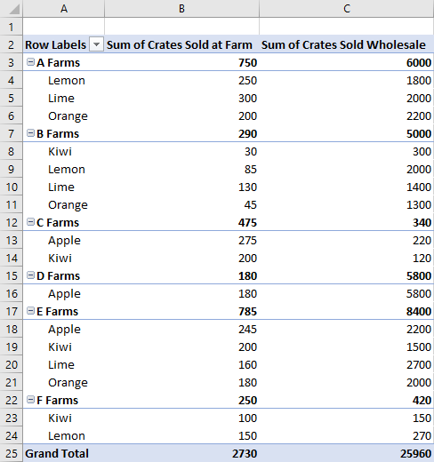
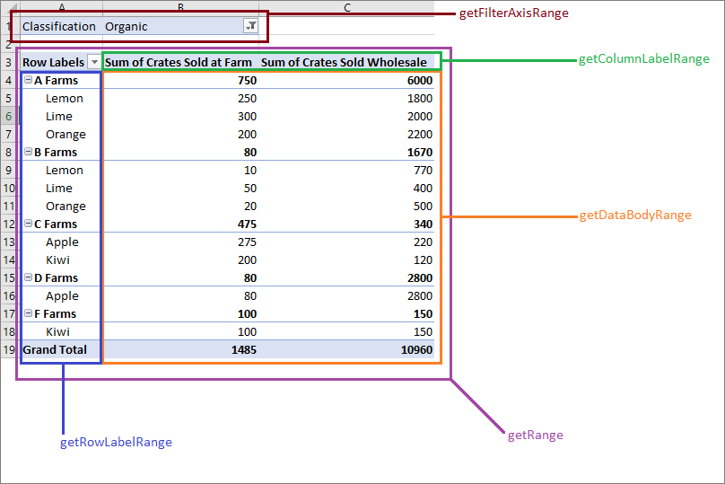
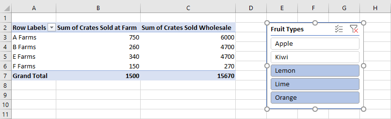

# <a name="work-with-pivottables-using-the-excel-javascript-api"></a><span data-ttu-id="cb087-103">Excel JavaScript API を使用してピボットテーブルを使用する</span><span class="sxs-lookup"><span data-stu-id="cb087-103">Work with PivotTables using the Excel JavaScript API</span></span>

<span data-ttu-id="cb087-104">ピボットテーブルは、より大きなデータ セットを合理化します。</span><span class="sxs-lookup"><span data-stu-id="cb087-104">PivotTables streamline larger data sets.</span></span> <span data-ttu-id="cb087-105">グループ化されたデータを迅速に操作できます。</span><span class="sxs-lookup"><span data-stu-id="cb087-105">They allow the quick manipulation of grouped data.</span></span> <span data-ttu-id="cb087-106">Excel JavaScript API を使用すると、アドインでピボットテーブルを作成し、それらのコンポーネントを操作できます。</span><span class="sxs-lookup"><span data-stu-id="cb087-106">The Excel JavaScript API lets your add-in create PivotTables and interact with their components.</span></span> <span data-ttu-id="cb087-107">この記事では、Office JavaScript API によってピボットテーブルがどのように表現されるのかについて説明し、主要なシナリオのコード サンプルを提供します。</span><span class="sxs-lookup"><span data-stu-id="cb087-107">This article describes how PivotTables are represented by the Office JavaScript API and provides code samples for key scenarios.</span></span>

<span data-ttu-id="cb087-108">ピボットテーブルの機能に慣れていない場合は、エンド ユーザーとして探索を検討してください。</span><span class="sxs-lookup"><span data-stu-id="cb087-108">If you are unfamiliar with the functionality of PivotTables, consider exploring them as an end user.</span></span>
<span data-ttu-id="cb087-109">これらの [ツールの優れた入門情報については、「](https://support.office.com/article/Import-and-analyze-data-ccd3c4a6-272f-4c97-afbb-d3f27407fcde#ID0EAABAAA=PivotTables) ピボットテーブルを作成してワークシート データを分析する」を参照してください。</span><span class="sxs-lookup"><span data-stu-id="cb087-109">See [Create a PivotTable to analyze worksheet data](https://support.office.com/article/Import-and-analyze-data-ccd3c4a6-272f-4c97-afbb-d3f27407fcde#ID0EAABAAA=PivotTables) for a good primer on these tools.</span></span>

> [!IMPORTANT]
> <span data-ttu-id="cb087-110">OLAP で作成されたピボットテーブルは現在サポートされていません。</span><span class="sxs-lookup"><span data-stu-id="cb087-110">PivotTables created with OLAP are not currently supported.</span></span> <span data-ttu-id="cb087-111">Power Pivot もサポートされていません。</span><span class="sxs-lookup"><span data-stu-id="cb087-111">There is also no support for Power Pivot.</span></span>

## <a name="object-model"></a><span data-ttu-id="cb087-112">オブジェクト モデル</span><span class="sxs-lookup"><span data-stu-id="cb087-112">Object model</span></span>

<span data-ttu-id="cb087-113">ピボット [テーブルは](/javascript/api/excel/excel.pivottable) 、JavaScript API のピボットテーブルOfficeオブジェクトです。</span><span class="sxs-lookup"><span data-stu-id="cb087-113">The [PivotTable](/javascript/api/excel/excel.pivottable) is the central object for PivotTables in the Office JavaScript API.</span></span>

- <span data-ttu-id="cb087-114">`Workbook.pivotTables`は、ブックとワークシートのピボットテーブルをそれぞれ含む `Worksheet.pivotTables` [PivotTableCollection](/javascript/api/excel/excel.pivottablecollection)です。 [](/javascript/api/excel/excel.pivottable)</span><span class="sxs-lookup"><span data-stu-id="cb087-114">`Workbook.pivotTables` and `Worksheet.pivotTables` are [PivotTableCollections](/javascript/api/excel/excel.pivottablecollection) that contain the [PivotTables](/javascript/api/excel/excel.pivottable) in the workbook and worksheet, respectively.</span></span>
- <span data-ttu-id="cb087-115">ピボット[テーブルには、](/javascript/api/excel/excel.pivottable)複数の PivotHierarchies を持つ[PivotHierarchyCollection が含まれる](/javascript/api/excel/excel.pivothierarchy)。 [](/javascript/api/excel/excel.pivothierarchycollection)</span><span class="sxs-lookup"><span data-stu-id="cb087-115">A [PivotTable](/javascript/api/excel/excel.pivottable) contains a [PivotHierarchyCollection](/javascript/api/excel/excel.pivothierarchycollection) that has multiple [PivotHierarchies](/javascript/api/excel/excel.pivothierarchy).</span></span>
- <span data-ttu-id="cb087-116">これらの [PivotHierarchies](/javascript/api/excel/excel.pivothierarchy) を特定の階層コレクションに追加して、ピボットテーブルのピボットデータの方法を定義できます (以下のセクション [で説明します](#hierarchies))。</span><span class="sxs-lookup"><span data-stu-id="cb087-116">These [PivotHierarchies](/javascript/api/excel/excel.pivothierarchy) can be added to specific hierarchy collections to define how the PivotTable pivots data (as explained in the [following section](#hierarchies)).</span></span>
- <span data-ttu-id="cb087-117">[PivotHierarchy](/javascript/api/excel/excel.pivothierarchy)には、PivotField が 1 つ正確に含まれる[PivotFieldCollection](/javascript/api/excel/excel.pivotfieldcollection) [が含まれる](/javascript/api/excel/excel.pivotfield)。</span><span class="sxs-lookup"><span data-stu-id="cb087-117">A [PivotHierarchy](/javascript/api/excel/excel.pivothierarchy) contains a [PivotFieldCollection](/javascript/api/excel/excel.pivotfieldcollection) that has exactly one [PivotField](/javascript/api/excel/excel.pivotfield).</span></span> <span data-ttu-id="cb087-118">OLAP ピボットテーブルを含むデザインが拡張された場合、これは変更される可能性があります。</span><span class="sxs-lookup"><span data-stu-id="cb087-118">If the design expands to include OLAP PivotTables, this may change.</span></span>
- <span data-ttu-id="cb087-119">[](/javascript/api/excel/excel.pivotfilters)ピボット[フィールドの](/javascript/api/excel/excel.pivotfield) [PivotHierarchy](/javascript/api/excel/excel.pivothierarchy)が階層カテゴリに割り当てられている限り、ピボットフィールドには 1 つ以上のピボットフィルターを適用できます。</span><span class="sxs-lookup"><span data-stu-id="cb087-119">A [PivotField](/javascript/api/excel/excel.pivotfield) can have one or more [PivotFilters](/javascript/api/excel/excel.pivotfilters) applied, as long as the field's [PivotHierarchy](/javascript/api/excel/excel.pivothierarchy) is assigned to a hierarchy category.</span></span> 
- <span data-ttu-id="cb087-120">ピボット [フィールドには](/javascript/api/excel/excel.pivotfield) 、複数の [PivotItem を持つ PivotItemCollection](/javascript/api/excel/excel.pivotitemcollection) [が含まれる](/javascript/api/excel/excel.pivotitem)。</span><span class="sxs-lookup"><span data-stu-id="cb087-120">A [PivotField](/javascript/api/excel/excel.pivotfield) contains a [PivotItemCollection](/javascript/api/excel/excel.pivotitemcollection) that has multiple [PivotItems](/javascript/api/excel/excel.pivotitem).</span></span>
- <span data-ttu-id="cb087-121">ピボット[テーブルには](/javascript/api/excel/excel.pivottable)、ピボットフィールドとピボットアイテムがワークシート内で表示[](/javascript/api/excel/excel.pivotfield)される場所を定義する[PivotLayout](/javascript/api/excel/excel.pivotlayout)が含まれる。 [](/javascript/api/excel/excel.pivotitem)</span><span class="sxs-lookup"><span data-stu-id="cb087-121">A [PivotTable](/javascript/api/excel/excel.pivottable) contains a [PivotLayout](/javascript/api/excel/excel.pivotlayout) that defines where the [PivotFields](/javascript/api/excel/excel.pivotfield) and [PivotItems](/javascript/api/excel/excel.pivotitem) are displayed in the worksheet.</span></span>

<span data-ttu-id="cb087-122">これらの関係がいくつかのサンプル データに適用される方法を見てみしましょう。</span><span class="sxs-lookup"><span data-stu-id="cb087-122">Let's look at how these relationships apply to some example data.</span></span> <span data-ttu-id="cb087-123">次のデータは、さまざまなファームからの青果売上を示しています。</span><span class="sxs-lookup"><span data-stu-id="cb087-123">The following data describes fruit sales from various farms.</span></span> <span data-ttu-id="cb087-124">この記事全体の例を示します。</span><span class="sxs-lookup"><span data-stu-id="cb087-124">It will be the example throughout this article.</span></span>


<span data-ttu-id="cb087-126">このファームの売上データは、ピボットテーブルの作成に使用されます。</span><span class="sxs-lookup"><span data-stu-id="cb087-126">This fruit farm sales data will be used to make a PivotTable.</span></span> <span data-ttu-id="cb087-127">型などの **各列は**、 `PivotHierarchy` .</span><span class="sxs-lookup"><span data-stu-id="cb087-127">Each column, such as **Types**, is a `PivotHierarchy`.</span></span> <span data-ttu-id="cb087-128">Types **階層には** 、Types フィールド **が含** まれます。</span><span class="sxs-lookup"><span data-stu-id="cb087-128">The **Types** hierarchy contains the **Types** field.</span></span> <span data-ttu-id="cb087-129">Types **フィールドには**、Apple、Kiwi、Orange、**および Orange** の各項目 **が含\*\*\*\*まれます**。 </span><span class="sxs-lookup"><span data-stu-id="cb087-129">The **Types** field contains the items **Apple**, **Kiwi**, **Lemon**, **Lime**, and **Orange**.</span></span>

### <a name="hierarchies"></a><span data-ttu-id="cb087-130">Hierarchies</span><span class="sxs-lookup"><span data-stu-id="cb087-130">Hierarchies</span></span>

<span data-ttu-id="cb087-131">ピボットテーブルは、行、列、データ、およびフィルター[](/javascript/api/excel/excel.rowcolumnpivothierarchy)の[](/javascript/api/excel/excel.rowcolumnpivothierarchy)4 つの階層[カテゴリに基](/javascript/api/excel/excel.datapivothierarchy)づいて編成[されます](/javascript/api/excel/excel.filterpivothierarchy)。</span><span class="sxs-lookup"><span data-stu-id="cb087-131">PivotTables are organized based on four hierarchy categories: [row](/javascript/api/excel/excel.rowcolumnpivothierarchy), [column](/javascript/api/excel/excel.rowcolumnpivothierarchy), [data](/javascript/api/excel/excel.datapivothierarchy), and [filter](/javascript/api/excel/excel.filterpivothierarchy).</span></span>

<span data-ttu-id="cb087-132">前に示したファーム データには 5 つの階層があります。**ファーム**、種類、**分類**、ファームで販売されたクレート、および販売された区分 **。** </span><span class="sxs-lookup"><span data-stu-id="cb087-132">The farm data shown earlier has five hierarchies: **Farms**, **Type**, **Classification**, **Crates Sold at Farm**, and **Crates Sold Wholesale**.</span></span> <span data-ttu-id="cb087-133">各階層は、4 つのカテゴリの 1 つにのみ存在できます。</span><span class="sxs-lookup"><span data-stu-id="cb087-133">Each hierarchy can only exist in one of the four categories.</span></span> <span data-ttu-id="cb087-134">Type **が** 列階層に追加された場合は、行、データ、またはフィルター階層にも追加できません。</span><span class="sxs-lookup"><span data-stu-id="cb087-134">If **Type** is added to column hierarchies, it cannot also be in the row, data, or filter hierarchies.</span></span> <span data-ttu-id="cb087-135">その **後** 、Type が行階層に追加されると、列階層から削除されます。</span><span class="sxs-lookup"><span data-stu-id="cb087-135">If **Type** is subsequently added to row hierarchies, it is removed from the column hierarchies.</span></span> <span data-ttu-id="cb087-136">この動作は、階層の割り当てが Excel UI または Excel JavaScript API を使用して行われる場合でも同じです。</span><span class="sxs-lookup"><span data-stu-id="cb087-136">This behavior is the same whether hierarchy assignment is done through the Excel UI or the Excel JavaScript APIs.</span></span>

<span data-ttu-id="cb087-137">行と列の階層は、データをグループ化する方法を定義します。</span><span class="sxs-lookup"><span data-stu-id="cb087-137">Row and column hierarchies define how data will be grouped.</span></span> <span data-ttu-id="cb087-138">たとえば、ファームの行階層 **は** 、同じファームのすべてのデータ セットをグループ化します。</span><span class="sxs-lookup"><span data-stu-id="cb087-138">For example, a row hierarchy of **Farms** will group together all the data sets from the same farm.</span></span> <span data-ttu-id="cb087-139">行と列の階層を選択すると、ピボットテーブルの向きが定義されます。</span><span class="sxs-lookup"><span data-stu-id="cb087-139">The choice between row and column hierarchy defines the orientation of the PivotTable.</span></span>

<span data-ttu-id="cb087-140">データ階層は、行と列の階層に基づいて集計される値です。</span><span class="sxs-lookup"><span data-stu-id="cb087-140">Data hierarchies are the values to be aggregated based on the row and column hierarchies.</span></span> <span data-ttu-id="cb087-141">ファームの行階層と **Crates Sold Sold の** データ階層を持つピボットテーブルには、ファームごとに異なるすべての青果の合計 (既定) が表示されます。</span><span class="sxs-lookup"><span data-stu-id="cb087-141">A PivotTable with a row hierarchy of **Farms** and a data hierarchy of **Crates Sold Wholesale** shows the sum total (by default) of all the different fruits for each farm.</span></span>

<span data-ttu-id="cb087-142">フィルター階層は、フィルター処理された型内の値に基づいてピボットからデータを含めるか除外します。</span><span class="sxs-lookup"><span data-stu-id="cb087-142">Filter hierarchies include or exclude data from the pivot based on values within that filtered type.</span></span> <span data-ttu-id="cb087-143">分類のフィルター階層で、種類が **[\*\*\*\*組織**] で選択されている場合は、青い青果のデータだけが表示されます。</span><span class="sxs-lookup"><span data-stu-id="cb087-143">A filter hierarchy of **Classification** with the type **Organic** selected only shows data for organic fruit.</span></span>

<span data-ttu-id="cb087-144">ここでは、ピボットテーブルと共にファーム データを再び示します。</span><span class="sxs-lookup"><span data-stu-id="cb087-144">Here is the farm data again, alongside a PivotTable.</span></span> <span data-ttu-id="cb087-145">ピボットテーブルでは、行階層として **Farm** と **Type** を使用し、データ階層として (合計の既定の集計関数を使用して) ファームで販売された **Crates** **と Crates Sold Hierarchie** を使用し、分類をフィルター階層として ([組織的] を選択した場合) 使用します。 </span><span class="sxs-lookup"><span data-stu-id="cb087-145">The PivotTable is using **Farm** and **Type** as the row hierarchies, **Crates Sold at Farm** and **Crates Sold Wholesale** as the data hierarchies (with the default aggregation function of sum), and **Classification** as a filter hierarchy (with **Organic** selected).</span></span>


<span data-ttu-id="cb087-147">このピボットテーブルは、JavaScript API または Excel UI を使用して生成できます。</span><span class="sxs-lookup"><span data-stu-id="cb087-147">This PivotTable could be generated through the JavaScript API or through the Excel UI.</span></span> <span data-ttu-id="cb087-148">どちらのオプションでも、アドインを介してさらに操作できます。</span><span class="sxs-lookup"><span data-stu-id="cb087-148">Both options allow for further manipulation through add-ins.</span></span>

## <a name="create-a-pivottable"></a><span data-ttu-id="cb087-149">ピボットテーブルを作成する</span><span class="sxs-lookup"><span data-stu-id="cb087-149">Create a PivotTable</span></span>

<span data-ttu-id="cb087-150">ピボットテーブルには、名前、ソース、および変換先が必要です。</span><span class="sxs-lookup"><span data-stu-id="cb087-150">PivotTables need a name, source, and destination.</span></span> <span data-ttu-id="cb087-151">ソースには、範囲のアドレスまたはテーブル名を指定できます (型 `Range` として `string` 渡 `Table` されます)。</span><span class="sxs-lookup"><span data-stu-id="cb087-151">The source can be a range address or table name (passed as a `Range`, `string`, or `Table` type).</span></span> <span data-ttu-id="cb087-152">宛先は、範囲アドレス (a または ) `Range` です `string` 。</span><span class="sxs-lookup"><span data-stu-id="cb087-152">The destination is a range address (given as either a `Range` or `string`).</span></span>
<span data-ttu-id="cb087-153">次のサンプルは、さまざまなピボットテーブル作成の手法を示しています。</span><span class="sxs-lookup"><span data-stu-id="cb087-153">The following samples show various PivotTable creation techniques.</span></span>

### <a name="create-a-pivottable-with-range-addresses"></a><span data-ttu-id="cb087-154">範囲アドレスを含むピボットテーブルを作成する</span><span class="sxs-lookup"><span data-stu-id="cb087-154">Create a PivotTable with range addresses</span></span>

```js
Excel.run(function (context) {
    // Create a PivotTable named "Farm Sales" on the current worksheet at cell
    // A22 with data from the range A1:E21.
    context.workbook.worksheets.getActiveWorksheet().pivotTables.add(
      "Farm Sales", "A1:E21", "A22");

    return context.sync();
});
```

### <a name="create-a-pivottable-with-range-objects"></a><span data-ttu-id="cb087-155">Range オブジェクトを使用してピボットテーブルを作成する</span><span class="sxs-lookup"><span data-stu-id="cb087-155">Create a PivotTable with Range objects</span></span>

```js
Excel.run(function (context) {
    // Create a PivotTable named "Farm Sales" on a worksheet called "PivotWorksheet" at cell A2
    // the data comes from the worksheet "DataWorksheet" across the range A1:E21.
    var rangeToAnalyze = context.workbook.worksheets.getItem("DataWorksheet").getRange("A1:E21");
    var rangeToPlacePivot = context.workbook.worksheets.getItem("PivotWorksheet").getRange("A2");
    context.workbook.worksheets.getItem("PivotWorksheet").pivotTables.add(
      "Farm Sales", rangeToAnalyze, rangeToPlacePivot);

    return context.sync();
});
```

### <a name="create-a-pivottable-at-the-workbook-level"></a><span data-ttu-id="cb087-156">ブック レベルでピボットテーブルを作成する</span><span class="sxs-lookup"><span data-stu-id="cb087-156">Create a PivotTable at the workbook level</span></span>

```js
Excel.run(function (context) {
    // Create a PivotTable named "Farm Sales" on a worksheet called "PivotWorksheet" at cell A2
    // the data is from the worksheet "DataWorksheet" across the range A1:E21.
    context.workbook.pivotTables.add(
        "Farm Sales", "DataWorksheet!A1:E21", "PivotWorksheet!A2");

    return context.sync();
});
```

## <a name="use-an-existing-pivottable"></a><span data-ttu-id="cb087-157">既存のピボットテーブルを使用する</span><span class="sxs-lookup"><span data-stu-id="cb087-157">Use an existing PivotTable</span></span>

<span data-ttu-id="cb087-158">手動で作成されたピボットテーブルには、ブックのピボットテーブル コレクションまたは個々のワークシートからアクセスすることもできます。</span><span class="sxs-lookup"><span data-stu-id="cb087-158">Manually created PivotTables are also accessible through the PivotTable collection of the workbook or of individual worksheets.</span></span> <span data-ttu-id="cb087-159">次のコードは、ブックから **My Pivot という名前のピボット** テーブルを取得します。</span><span class="sxs-lookup"><span data-stu-id="cb087-159">The following code gets a PivotTable named **My Pivot** from the workbook.</span></span>

```js
Excel.run(function (context) {
    var pivotTable = context.workbook.pivotTables.getItem("My Pivot");
    return context.sync();
});
```

## <a name="add-rows-and-columns-to-a-pivottable"></a><span data-ttu-id="cb087-160">ピボットテーブルに行と列を追加する</span><span class="sxs-lookup"><span data-stu-id="cb087-160">Add rows and columns to a PivotTable</span></span>

<span data-ttu-id="cb087-161">行と列は、これらのフィールドの値を中心にデータをピボットします。</span><span class="sxs-lookup"><span data-stu-id="cb087-161">Rows and columns pivot the data around those fields' values.</span></span>

<span data-ttu-id="cb087-162">ファーム列 **を追加** すると、各ファームのすべての売上がピボットされます。</span><span class="sxs-lookup"><span data-stu-id="cb087-162">Adding the **Farm** column pivots all the sales around each farm.</span></span> <span data-ttu-id="cb087-163">[種類 **] 行と** **[分類** ] 行を追加すると、販売された青の種類と、その商品の種類や種類に基づいてデータがさらに分類されます。</span><span class="sxs-lookup"><span data-stu-id="cb087-163">Adding the **Type** and **Classification** rows further breaks down the data based on what fruit was sold and whether it was organic or not.</span></span>

![[ファーム] 列と [種類] 行と [分類] 行があるピボットテーブル。](../images/excel-pivots-table-rows-and-columns.png)

```js
Excel.run(function (context) {
    var pivotTable = context.workbook.worksheets.getActiveWorksheet().pivotTables.getItem("Farm Sales");

    pivotTable.rowHierarchies.add(pivotTable.hierarchies.getItem("Type"));
    pivotTable.rowHierarchies.add(pivotTable.hierarchies.getItem("Classification"));

    pivotTable.columnHierarchies.add(pivotTable.hierarchies.getItem("Farm"));

    return context.sync();
});
```

<span data-ttu-id="cb087-165">行または列のみを含むピボットテーブルを作成することもできます。</span><span class="sxs-lookup"><span data-stu-id="cb087-165">You can also have a PivotTable with only rows or columns.</span></span>

```js
Excel.run(function (context) {
    var pivotTable = context.workbook.worksheets.getActiveWorksheet().pivotTables.getItem("Farm Sales");
    pivotTable.rowHierarchies.add(pivotTable.hierarchies.getItem("Farm"));
    pivotTable.rowHierarchies.add(pivotTable.hierarchies.getItem("Type"));
    pivotTable.rowHierarchies.add(pivotTable.hierarchies.getItem("Classification"));

    return context.sync();
});
```

## <a name="add-data-hierarchies-to-the-pivottable"></a><span data-ttu-id="cb087-166">ピボットテーブルにデータ階層を追加する</span><span class="sxs-lookup"><span data-stu-id="cb087-166">Add data hierarchies to the PivotTable</span></span>

<span data-ttu-id="cb087-167">データ階層は、行と列に基づいて結合する情報でピボットテーブルを埋め込む。</span><span class="sxs-lookup"><span data-stu-id="cb087-167">Data hierarchies fill the PivotTable with information to combine based on the rows and columns.</span></span> <span data-ttu-id="cb087-168">ファームで販売されたクレートと販売された製品版のクレートのデータ階層を追加すると、各行と列のこれらの数値の合計が提供されます。</span><span class="sxs-lookup"><span data-stu-id="cb087-168">Adding the data hierarchies of **Crates Sold at Farm** and **Crates Sold Wholesale** gives sums of those figures for each row and column.</span></span>

<span data-ttu-id="cb087-169">この例では **、Farm** と Type の **両方** が行であり、クレート売上がデータです。</span><span class="sxs-lookup"><span data-stu-id="cb087-169">In the example, both **Farm** and **Type** are rows, with the crate sales as the data.</span></span>



```js
Excel.run(function (context) {
    var pivotTable = context.workbook.worksheets.getActiveWorksheet().pivotTables.getItem("Farm Sales");

    // "Farm" and "Type" are the hierarchies on which the aggregation is based.
    pivotTable.rowHierarchies.add(pivotTable.hierarchies.getItem("Farm"));
    pivotTable.rowHierarchies.add(pivotTable.hierarchies.getItem("Type"));

    // "Crates Sold at Farm" and "Crates Sold Wholesale" are the hierarchies
    // that will have their data aggregated (summed in this case).
    pivotTable.dataHierarchies.add(pivotTable.hierarchies.getItem("Crates Sold at Farm"));
    pivotTable.dataHierarchies.add(pivotTable.hierarchies.getItem("Crates Sold Wholesale"));

    return context.sync();
});
```

## <a name="pivottable-layouts-and-getting-pivoted-data"></a><span data-ttu-id="cb087-171">ピボットテーブルレイアウトとピボットデータの取得</span><span class="sxs-lookup"><span data-stu-id="cb087-171">PivotTable layouts and getting pivoted data</span></span>

<span data-ttu-id="cb087-172">[PivotLayout は、](/javascript/api/excel/excel.pivotlayout)階層とそのデータの配置を定義します。</span><span class="sxs-lookup"><span data-stu-id="cb087-172">A [PivotLayout](/javascript/api/excel/excel.pivotlayout) defines the placement of hierarchies and their data.</span></span> <span data-ttu-id="cb087-173">レイアウトにアクセスして、データが格納される範囲を決定します。</span><span class="sxs-lookup"><span data-stu-id="cb087-173">You access the layout to determine the ranges where data is stored.</span></span>

<span data-ttu-id="cb087-174">次の図は、ピボットテーブルの範囲に対応するレイアウト関数の呼び出しを示しています。</span><span class="sxs-lookup"><span data-stu-id="cb087-174">The following diagram shows which layout function calls correspond to which ranges of the PivotTable.</span></span>



### <a name="get-data-from-the-pivottable"></a><span data-ttu-id="cb087-176">ピボットテーブルからデータを取得する</span><span class="sxs-lookup"><span data-stu-id="cb087-176">Get data from the PivotTable</span></span>

<span data-ttu-id="cb087-177">レイアウトは、ワークシートでのピボットテーブルの表示方法を定義します。</span><span class="sxs-lookup"><span data-stu-id="cb087-177">The layout defines how the PivotTable is displayed in the worksheet.</span></span> <span data-ttu-id="cb087-178">つまり、オブジェクト `PivotLayout` はピボットテーブル要素に使用される範囲を制御します。</span><span class="sxs-lookup"><span data-stu-id="cb087-178">This means the `PivotLayout` object controls the ranges used for PivotTable elements.</span></span> <span data-ttu-id="cb087-179">ピボットテーブルによって収集および集計されるデータを取得するには、レイアウトによって提供される範囲を使用します。</span><span class="sxs-lookup"><span data-stu-id="cb087-179">Use the ranges provided by the layout to get data collected and aggregated by the PivotTable.</span></span> <span data-ttu-id="cb087-180">特に、ピボット `PivotLayout.getDataBodyRange` テーブルが生成するデータにアクセスするために使用します。</span><span class="sxs-lookup"><span data-stu-id="cb087-180">In particular, use `PivotLayout.getDataBodyRange` to access what the PivotTable produces.</span></span>

<span data-ttu-id="cb087-181">次のコードは、レイアウト (前の例では[ファームで販売されたクレートの合計] 列と [販売されたクレートの合計] 列の両方の総計) を使用して、ピボットテーブル データの最後の行を取得する方法を示しています。 </span><span class="sxs-lookup"><span data-stu-id="cb087-181">The following code demonstrates how to get the last row of the PivotTable data by going through the layout (the **Grand Total** of both the **Sum of Crates Sold at Farm** and **Sum of Crates Sold Wholesale** columns in the earlier example).</span></span> <span data-ttu-id="cb087-182">これらの値は、セル **E30** (ピボットテーブルの外側) に表示される最終的な合計に合わせて合計されます。</span><span class="sxs-lookup"><span data-stu-id="cb087-182">Those values are then summed together for a final total, which is displayed in cell **E30** (outside of the PivotTable).</span></span>

```js
Excel.run(function (context) {
    var pivotTable = context.workbook.worksheets.getActiveWorksheet().pivotTables.getItem("Farm Sales");

    // Get the totals for each data hierarchy from the layout.
    var range = pivotTable.layout.getDataBodyRange();
    var grandTotalRange = range.getLastRow();
    grandTotalRange.load("address");
    return context.sync().then(function () {
        // Sum the totals from the PivotTable data hierarchies and place them in a new range, outside of the PivotTable.
        var masterTotalRange = context.workbook.worksheets.getActiveWorksheet().getRange("E30");
        masterTotalRange.formulas = [["=SUM(" + grandTotalRange.address + ")"]];
    });
});
```

### <a name="layout-types"></a><span data-ttu-id="cb087-183">レイアウトの種類</span><span class="sxs-lookup"><span data-stu-id="cb087-183">Layout types</span></span>

<span data-ttu-id="cb087-184">ピボットテーブルには、コンパクト、アウトライン、表形式の 3 つのレイアウト スタイルがあります。</span><span class="sxs-lookup"><span data-stu-id="cb087-184">PivotTables have three layout styles: Compact, Outline, and Tabular.</span></span> <span data-ttu-id="cb087-185">前の例では、コンパクトなスタイルを確認しました。</span><span class="sxs-lookup"><span data-stu-id="cb087-185">We've seen the compact style in the previous examples.</span></span>

<span data-ttu-id="cb087-186">次の例では、アウトラインスタイルと表形式スタイルをそれぞれ使用します。</span><span class="sxs-lookup"><span data-stu-id="cb087-186">The following examples use the outline and tabular styles, respectively.</span></span> <span data-ttu-id="cb087-187">コード サンプルは、さまざまなレイアウト間を切り替える方法を示しています。</span><span class="sxs-lookup"><span data-stu-id="cb087-187">The code sample shows how to cycle between the different layouts.</span></span>

#### <a name="outline-layout"></a><span data-ttu-id="cb087-188">アウトライン レイアウト</span><span class="sxs-lookup"><span data-stu-id="cb087-188">Outline layout</span></span>


#### <a name="tabular-layout"></a><span data-ttu-id="cb087-190">表形式レイアウト</span><span class="sxs-lookup"><span data-stu-id="cb087-190">Tabular layout</span></span>


## <a name="delete-a-pivottable"></a><span data-ttu-id="cb087-192">ピボットテーブルを削除する</span><span class="sxs-lookup"><span data-stu-id="cb087-192">Delete a PivotTable</span></span>

<span data-ttu-id="cb087-193">ピボットテーブルは、名前を使用して削除されます。</span><span class="sxs-lookup"><span data-stu-id="cb087-193">PivotTables are deleted by using their name.</span></span>

```js
Excel.run(function (context) {
    context.workbook.worksheets.getItem("Pivot").pivotTables.getItem("Farm Sales").delete();
    return context.sync();
});
```

## <a name="filter-a-pivottable"></a><span data-ttu-id="cb087-194">ピボットテーブルをフィルター処理する</span><span class="sxs-lookup"><span data-stu-id="cb087-194">Filter a PivotTable</span></span>

<span data-ttu-id="cb087-195">ピボットテーブル データをフィルター処理する主な方法は、PivotFilters です。</span><span class="sxs-lookup"><span data-stu-id="cb087-195">The primary method for filtering PivotTable data is with PivotFilters.</span></span> <span data-ttu-id="cb087-196">スライサーは、代替の柔軟性の低いフィルタリング方法を提供します。</span><span class="sxs-lookup"><span data-stu-id="cb087-196">Slicers offer an alternate, less flexible filtering method.</span></span> 

<span data-ttu-id="cb087-197">[ピボットフィルターは、](/javascript/api/excel/excel.pivotfilters) ピボットテーブルの 4 つの階層カテゴリ [(フィルター](#hierarchies) 、列、行、値) に基づいてデータをフィルター処理します。</span><span class="sxs-lookup"><span data-stu-id="cb087-197">[PivotFilters](/javascript/api/excel/excel.pivotfilters) filter data based on a PivotTable's four [hierarchy categories](#hierarchies) (filters, columns, rows, and values).</span></span> <span data-ttu-id="cb087-198">PivotFilter には、カレンダーの日付ベースのフィルター処理、文字列解析、数値比較、カスタム入力に基づくフィルター処理の 4 種類があります。</span><span class="sxs-lookup"><span data-stu-id="cb087-198">There are four types of PivotFilters, allowing calendar date-based filtering, string parsing, number comparison, and filtering based on a custom input.</span></span> 

<span data-ttu-id="cb087-199">[スライサー](/javascript/api/excel/excel.slicer) は、ピボットテーブルと通常の Excel テーブルの両方に適用できます。</span><span class="sxs-lookup"><span data-stu-id="cb087-199">[Slicers](/javascript/api/excel/excel.slicer) can be applied to both PivotTables and regular Excel tables.</span></span> <span data-ttu-id="cb087-200">ピボットテーブルに適用すると、スライサーは [PivotManualFilter](#pivotmanualfilter) のように機能し、カスタム入力に基づいてフィルター処理を実行できます。</span><span class="sxs-lookup"><span data-stu-id="cb087-200">When applied to a PivotTable, slicers function like a [PivotManualFilter](#pivotmanualfilter) and allow filtering based on a custom input.</span></span> <span data-ttu-id="cb087-201">PivotFilters とは異なり、スライサーには [Excel UI コンポーネントがあります](https://support.office.com/article/Use-slicers-to-filter-data-249f966b-a9d5-4b0f-b31a-12651785d29d)。</span><span class="sxs-lookup"><span data-stu-id="cb087-201">Unlike PivotFilters, slicers have an [Excel UI component](https://support.office.com/article/Use-slicers-to-filter-data-249f966b-a9d5-4b0f-b31a-12651785d29d).</span></span> <span data-ttu-id="cb087-202">クラスを `Slicer` 使って、この UI コンポーネントを作成し、フィルター処理を管理し、その外観を制御します。</span><span class="sxs-lookup"><span data-stu-id="cb087-202">With the `Slicer` class, you create this UI component, manage filtering, and control its visual appearance.</span></span> 

### <a name="filter-with-pivotfilters"></a><span data-ttu-id="cb087-203">PivotFilters でフィルター処理する</span><span class="sxs-lookup"><span data-stu-id="cb087-203">Filter with PivotFilters</span></span>

<span data-ttu-id="cb087-204">[ピボットフィルターを使用](/javascript/api/excel/excel.pivotfilters) すると、4 つの階層カテゴリ [(フィルター](#hierarchies) 、列、行、値) に基づいてピボットテーブル データをフィルター処理できます。</span><span class="sxs-lookup"><span data-stu-id="cb087-204">[PivotFilters](/javascript/api/excel/excel.pivotfilters) allow you to filter PivotTable data based on the four [hierarchy categories](#hierarchies) (filters, columns, rows, and values).</span></span> <span data-ttu-id="cb087-205">ピボットテーブル オブジェクト モデルでは、ピボットフィールドに適用され、それぞれが 1 つ以上を割り `PivotFilters` [](/javascript/api/excel/excel.pivotfield) `PivotField` 当てることができます `PivotFilters` 。</span><span class="sxs-lookup"><span data-stu-id="cb087-205">In the PivotTable object model, `PivotFilters` are applied to a [PivotField](/javascript/api/excel/excel.pivotfield), and each `PivotField` can have one or more assigned `PivotFilters`.</span></span> <span data-ttu-id="cb087-206">ピボットフィールドにピボットフィルターを適用するには、フィールドに対応する [PivotHierarchy](/javascript/api/excel/excel.pivothierarchy) を階層カテゴリに割り当てる必要があります。</span><span class="sxs-lookup"><span data-stu-id="cb087-206">To apply PivotFilters to a PivotField, the field's corresponding [PivotHierarchy](/javascript/api/excel/excel.pivothierarchy) must be assigned to a hierarchy category.</span></span> 

#### <a name="types-of-pivotfilters"></a><span data-ttu-id="cb087-207">PivotFilters の種類</span><span class="sxs-lookup"><span data-stu-id="cb087-207">Types of PivotFilters</span></span>

| <span data-ttu-id="cb087-208">フィルターの種類</span><span class="sxs-lookup"><span data-stu-id="cb087-208">Filter type</span></span> | <span data-ttu-id="cb087-209">フィルターの目的</span><span class="sxs-lookup"><span data-stu-id="cb087-209">Filter purpose</span></span> | <span data-ttu-id="cb087-210">Excel JavaScript API リファレンス</span><span class="sxs-lookup"><span data-stu-id="cb087-210">Excel JavaScript API reference</span></span> |
|:--- |:--- |:--- |
| <span data-ttu-id="cb087-211">DateFilter</span><span class="sxs-lookup"><span data-stu-id="cb087-211">DateFilter</span></span> | <span data-ttu-id="cb087-212">カレンダーの日付ベースのフィルター。</span><span class="sxs-lookup"><span data-stu-id="cb087-212">Calendar date-based filtering.</span></span> | [<span data-ttu-id="cb087-213">PivotDateFilter</span><span class="sxs-lookup"><span data-stu-id="cb087-213">PivotDateFilter</span></span>](/javascript/api/excel/excel.pivotdatefilter) |
| <span data-ttu-id="cb087-214">LabelFilter</span><span class="sxs-lookup"><span data-stu-id="cb087-214">LabelFilter</span></span> | <span data-ttu-id="cb087-215">テキスト比較フィルター。</span><span class="sxs-lookup"><span data-stu-id="cb087-215">Text comparison filtering.</span></span> | [<span data-ttu-id="cb087-216">PivotLabelFilter</span><span class="sxs-lookup"><span data-stu-id="cb087-216">PivotLabelFilter</span></span>](/javascript/api/excel/excel.pivotlabelfilter) |
| <span data-ttu-id="cb087-217">ManualFilter</span><span class="sxs-lookup"><span data-stu-id="cb087-217">ManualFilter</span></span> | <span data-ttu-id="cb087-218">カスタム入力フィルター。</span><span class="sxs-lookup"><span data-stu-id="cb087-218">Custom input filtering.</span></span> | [<span data-ttu-id="cb087-219">PivotManualFilter</span><span class="sxs-lookup"><span data-stu-id="cb087-219">PivotManualFilter</span></span>](/javascript/api/excel/excel.pivotmanualfilter) |
| <span data-ttu-id="cb087-220">ValueFilter</span><span class="sxs-lookup"><span data-stu-id="cb087-220">ValueFilter</span></span> | <span data-ttu-id="cb087-221">数値比較フィルター。</span><span class="sxs-lookup"><span data-stu-id="cb087-221">Number comparison filtering.</span></span> | [<span data-ttu-id="cb087-222">PivotValueFilter</span><span class="sxs-lookup"><span data-stu-id="cb087-222">PivotValueFilter</span></span>](/javascript/api/excel/excel.pivotvaluefilter) |

#### <a name="create-a-pivotfilter"></a><span data-ttu-id="cb087-223">PivotFilter を作成する</span><span class="sxs-lookup"><span data-stu-id="cb087-223">Create a PivotFilter</span></span>

<span data-ttu-id="cb087-224">ピボットテーブル データをフィルター処理する (a など) には、ピボット `Pivot*Filter` `PivotDateFilter` フィールドにフィルター [を適用します](/javascript/api/excel/excel.pivotfield)。</span><span class="sxs-lookup"><span data-stu-id="cb087-224">To filter PivotTable data with a `Pivot*Filter` (such as a `PivotDateFilter`), apply the filter to a [PivotField](/javascript/api/excel/excel.pivotfield).</span></span> <span data-ttu-id="cb087-225">次の 4 つのコード サンプルは、4 種類の PivotFilter のそれぞれを使用する方法を示しています。</span><span class="sxs-lookup"><span data-stu-id="cb087-225">The following four code samples show how to use each of the four types of PivotFilters.</span></span> 

##### <a name="pivotdatefilter"></a><span data-ttu-id="cb087-226">PivotDateFilter</span><span class="sxs-lookup"><span data-stu-id="cb087-226">PivotDateFilter</span></span>

<span data-ttu-id="cb087-227">最初のコード サンプルでは [、PivotDateFilter](/javascript/api/excel/excel.pivotdatefilter) を Date **Updated** PivotField に適用し **、2020-08-01** より前のデータを非表示にしています。</span><span class="sxs-lookup"><span data-stu-id="cb087-227">The first code sample applies a [PivotDateFilter](/javascript/api/excel/excel.pivotdatefilter) to the **Date Updated** PivotField, hiding any data prior to **2020-08-01**.</span></span> 

> [!IMPORTANT] 
> <span data-ttu-id="cb087-228">A は、そのフィールドの PivotHierarchy が階層カテゴリに割り当てられていない限り、 `Pivot*Filter` ピボットフィールドに適用できません。</span><span class="sxs-lookup"><span data-stu-id="cb087-228">A `Pivot*Filter` can't be applied to a PivotField unless that field's PivotHierarchy is assigned to a hierarchy category.</span></span> <span data-ttu-id="cb087-229">次のコード サンプルでは、フィルター処理に使用する前にピボットテーブルのカテゴリに追加 `dateHierarchy` `rowHierarchies` する必要があります。</span><span class="sxs-lookup"><span data-stu-id="cb087-229">In the following code sample, the `dateHierarchy` must be added to the PivotTable's `rowHierarchies` category before it can be used for filtering.</span></span>

```js
Excel.run(function (context) {
    // Get the PivotTable and the date hierarchy.
    var pivotTable = context.workbook.worksheets.getActiveWorksheet().pivotTables.getItem("Farm Sales");
    var dateHierarchy = pivotTable.rowHierarchies.getItemOrNullObject("Date Updated");
    
    return context.sync().then(function () {
        // PivotFilters can only be applied to PivotHierarchies that are being used for pivoting.
        // If it's not already there, add "Date Updated" to the hierarchies.
        if (dateHierarchy.isNullObject) {
          dateHierarchy = pivotTable.rowHierarchies.add(pivotTable.hierarchies.getItem("Date Updated"));
        }

        // Apply a date filter to filter out anything logged before August.
        var filterField = dateHierarchy.fields.getItem("Date Updated");
        var dateFilter = {
          condition: Excel.DateFilterCondition.afterOrEqualTo,
          comparator: {
            date: "2020-08-01",
            specificity: Excel.FilterDatetimeSpecificity.month
          }
        };
        filterField.applyFilter({ dateFilter: dateFilter });
        
        return context.sync();
    });
});
```

> [!NOTE]
> <span data-ttu-id="cb087-230">次の 3 つのコード スニペットは、完全な呼び出しではなく、フィルター固有の抜粋のみを表示 `Excel.run` します。</span><span class="sxs-lookup"><span data-stu-id="cb087-230">The following three code snippets only display filter-specific excerpts, instead of full `Excel.run` calls.</span></span>

##### <a name="pivotlabelfilter"></a><span data-ttu-id="cb087-231">PivotLabelFilter</span><span class="sxs-lookup"><span data-stu-id="cb087-231">PivotLabelFilter</span></span>

<span data-ttu-id="cb087-232">2 番目のコード スニペットは、プロパティを使用して文字 L で始まるラベルを除外して [、PivotLabelFilter](/javascript/api/excel/excel.pivotlabelfilter) を **タイプ** ピボットフィールドに適用する方法 `LabelFilterCondition.beginsWith` を **示しています**。</span><span class="sxs-lookup"><span data-stu-id="cb087-232">The second code snippet demonstrates how to apply a [PivotLabelFilter](/javascript/api/excel/excel.pivotlabelfilter) to the **Type** PivotField, using the `LabelFilterCondition.beginsWith` property to exclude labels that start with the letter **L**.</span></span> 

```js
    // Get the "Type" field.
    var filterField = pivotTable.hierarchies.getItem("Type").fields.getItem("Type");

    // Filter out any types that start with "L" ("Lemons" and "Limes" in this case).
    var filter: Excel.PivotLabelFilter = {
      condition: Excel.LabelFilterCondition.beginsWith,
      substring: "L",
      exclusive: true
    };

    // Apply the label filter to the field.
    filterField.applyFilter({ labelFilter: filter });
```

##### <a name="pivotmanualfilter"></a><span data-ttu-id="cb087-233">PivotManualFilter</span><span class="sxs-lookup"><span data-stu-id="cb087-233">PivotManualFilter</span></span>

<span data-ttu-id="cb087-234">3 番目のコード スニペットでは [、PivotManualFilter](/javascript/api/excel/excel.pivotmanualfilter) を含む手動フィルターを **Classification** フィールドに適用し、分類の [グループ化] を含むデータをフィルター **処理します**。</span><span class="sxs-lookup"><span data-stu-id="cb087-234">The third code snippet applies a manual filter with [PivotManualFilter](/javascript/api/excel/excel.pivotmanualfilter) to the the **Classification** field, filtering out data that doesn't include the classification **Organic**.</span></span> 

```js
    // Apply a manual filter to include only a specific PivotItem (the string "Organic").
    var filterField = classHierarchy.fields.getItem("Classification");
    var manualFilter = { selectedItems: ["Organic"] };
    filterField.applyFilter({ manualFilter: manualFilter });
```

##### <a name="pivotvaluefilter"></a><span data-ttu-id="cb087-235">PivotValueFilter</span><span class="sxs-lookup"><span data-stu-id="cb087-235">PivotValueFilter</span></span>

<span data-ttu-id="cb087-236">数値を比較するには、最終的なコード スニペットに示すように、値フィルターと [PivotValueFilter](/javascript/api/excel/excel.pivotvaluefilter)を使用します。</span><span class="sxs-lookup"><span data-stu-id="cb087-236">To compare numbers, use a value filter with [PivotValueFilter](/javascript/api/excel/excel.pivotvaluefilter), as shown in the final code snippet.</span></span> <span data-ttu-id="cb087-237">The `PivotValueFilter` compares the data in the **Farm** PivotField to the data in the **Crates Sold PivotField,** including only farms whose sum of crates sold exceeds the value **500**.</span><span class="sxs-lookup"><span data-stu-id="cb087-237">The `PivotValueFilter` compares the data in the **Farm** PivotField to the data in the **Crates Sold Wholesale** PivotField, including only farms whose sum of crates sold exceeds the value **500**.</span></span> 

```js
    // Get the "Farm" field.
    var filterField = pivotTable.hierarchies.getItem("Farm").fields.getItem("Farm");
    
    // Filter to only include rows with more than 500 wholesale crates sold.
    var filter: Excel.PivotValueFilter = {
      condition: Excel.ValueFilterCondition.greaterThan,
      comparator: 500,
      value: "Sum of Crates Sold Wholesale"
    };
    
    // Apply the value filter to the field.
    filterField.applyFilter({ valueFilter: filter });
```

#### <a name="remove-pivotfilters"></a><span data-ttu-id="cb087-238">PivotFilters を削除する</span><span class="sxs-lookup"><span data-stu-id="cb087-238">Remove PivotFilters</span></span>

<span data-ttu-id="cb087-239">すべての PivotFilter を削除するには、次のコード サンプルに示すように、各 PivotField にメソッド `clearAllFilters` を適用します。</span><span class="sxs-lookup"><span data-stu-id="cb087-239">To remove all PivotFilters, apply the `clearAllFilters` method to each PivotField, as shown in the following code sample.</span></span> 

```js
Excel.run(function (context) {
    // Get the PivotTable.
    var pivotTable = context.workbook.worksheets.getActiveWorksheet().pivotTables.getItem("Farm Sales");
    pivotTable.hierarchies.load("name");
    
    return context.sync().then(function () {
        // Clear the filters on each PivotField.
        pivotTable.hierarchies.items.forEach(function (hierarchy) {
          hierarchy.fields.getItem(hierarchy.name).clearAllFilters();
        });
        return context.sync();
    });
});
```

### <a name="filter-with-slicers"></a><span data-ttu-id="cb087-240">スライサーでフィルター処理する</span><span class="sxs-lookup"><span data-stu-id="cb087-240">Filter with slicers</span></span>

<span data-ttu-id="cb087-241">[スライサー](/javascript/api/excel/excel.slicer) を使用すると、Excel ピボットテーブルまたはテーブルからデータをフィルター処理できます。</span><span class="sxs-lookup"><span data-stu-id="cb087-241">[Slicers](/javascript/api/excel/excel.slicer) allow data to be filtered from an Excel PivotTable or table.</span></span> <span data-ttu-id="cb087-242">スライサーは、指定された列またはピボットフィールドの値を使用して、対応する行をフィルター処理します。</span><span class="sxs-lookup"><span data-stu-id="cb087-242">A slicer uses values from a specified column or PivotField to filter corresponding rows.</span></span> <span data-ttu-id="cb087-243">これらの値は [、SlicerItem オブジェクトとして](/javascript/api/excel/excel.sliceritem) 格納されます `Slicer` 。</span><span class="sxs-lookup"><span data-stu-id="cb087-243">These values are stored as [SlicerItem](/javascript/api/excel/excel.sliceritem) objects in the `Slicer`.</span></span> <span data-ttu-id="cb087-244">アドインは、(Excel UI を使用して) ユーザーと同様に[、これらのフィルターを調整できます](https://support.office.com/article/Use-slicers-to-filter-data-249f966b-a9d5-4b0f-b31a-12651785d29d)。</span><span class="sxs-lookup"><span data-stu-id="cb087-244">Your add-in can adjust these filters, as can users ([through the Excel UI](https://support.office.com/article/Use-slicers-to-filter-data-249f966b-a9d5-4b0f-b31a-12651785d29d)).</span></span> <span data-ttu-id="cb087-245">スライサーは、次のスクリーンショットに示すように、描画レイヤーのワークシートの上に配置されます。</span><span class="sxs-lookup"><span data-stu-id="cb087-245">The slicer sits on top of the worksheet in the drawing layer, as shown in the following screenshot.</span></span>



> [!NOTE]
> <span data-ttu-id="cb087-247">このセクションで説明する手法では、ピボットテーブルに接続されたスライサーの使い方に重点を置いて説明します。</span><span class="sxs-lookup"><span data-stu-id="cb087-247">The techniques described in this section focus on how to use slicers connected to PivotTables.</span></span> <span data-ttu-id="cb087-248">テーブルに接続されたスライサーの使用にも同じ手法が適用されます。</span><span class="sxs-lookup"><span data-stu-id="cb087-248">The same techniques also apply to using slicers connected to tables.</span></span>

#### <a name="create-a-slicer"></a><span data-ttu-id="cb087-249">スライサーを作成する</span><span class="sxs-lookup"><span data-stu-id="cb087-249">Create a slicer</span></span>

<span data-ttu-id="cb087-250">このメソッドまたはメソッドを使用して、ブックまたはワークシートにスライサー `Workbook.slicers.add` を作成 `Worksheet.slicers.add` できます。</span><span class="sxs-lookup"><span data-stu-id="cb087-250">You can create a slicer in a workbook or worksheet by using the `Workbook.slicers.add` method or `Worksheet.slicers.add` method.</span></span> <span data-ttu-id="cb087-251">これにより、指定したオブジェクトの [SlicerCollection](/javascript/api/excel/excel.slicercollection) にスライサーが `Workbook` 追加 `Worksheet` されます。</span><span class="sxs-lookup"><span data-stu-id="cb087-251">Doing so adds a slicer to the [SlicerCollection](/javascript/api/excel/excel.slicercollection) of the specified `Workbook` or `Worksheet` object.</span></span> <span data-ttu-id="cb087-252">この `SlicerCollection.add` メソッドには、次の 3 つのパラメーターがあります。</span><span class="sxs-lookup"><span data-stu-id="cb087-252">The `SlicerCollection.add` method has three parameters:</span></span>

- <span data-ttu-id="cb087-253">`slicerSource`: 新しいスライサーが基づくデータ ソース。</span><span class="sxs-lookup"><span data-stu-id="cb087-253">`slicerSource`: The data source on which the new slicer is based.</span></span> <span data-ttu-id="cb087-254">名前または ID を表す 、または文字列 `PivotTable` `Table` を指定 `PivotTable` できます `Table` 。</span><span class="sxs-lookup"><span data-stu-id="cb087-254">It can be a `PivotTable`, `Table`, or string representing the name or ID of a `PivotTable` or `Table`.</span></span>
- <span data-ttu-id="cb087-255">`sourceField`: フィルター処理に使用するデータ ソースのフィールドです。</span><span class="sxs-lookup"><span data-stu-id="cb087-255">`sourceField`: The field in the data source by which to filter.</span></span> <span data-ttu-id="cb087-256">名前または ID を表す 、または文字列 `PivotField` `TableColumn` を指定 `PivotField` できます `TableColumn` 。</span><span class="sxs-lookup"><span data-stu-id="cb087-256">It can be a `PivotField`, `TableColumn`, or string representing the name or ID of a `PivotField` or `TableColumn`.</span></span>
- <span data-ttu-id="cb087-257">`slicerDestination`: 新しいスライサーが作成されるワークシートです。</span><span class="sxs-lookup"><span data-stu-id="cb087-257">`slicerDestination`: The worksheet where the new slicer will be created.</span></span> <span data-ttu-id="cb087-258">オブジェクト、 `Worksheet` またはオブジェクトの名前または ID を指定できます `Worksheet` 。</span><span class="sxs-lookup"><span data-stu-id="cb087-258">It can be a `Worksheet` object or the name or ID of a `Worksheet`.</span></span> <span data-ttu-id="cb087-259">このパラメーターは、アクセスするときに `SlicerCollection` 不要です `Worksheet.slicers` 。</span><span class="sxs-lookup"><span data-stu-id="cb087-259">This parameter is unnecessary when the `SlicerCollection` is accessed through `Worksheet.slicers`.</span></span> <span data-ttu-id="cb087-260">この場合、コレクションのワークシートが移動先として使用されます。</span><span class="sxs-lookup"><span data-stu-id="cb087-260">In this case, the collection's worksheet is used as the destination.</span></span>

<span data-ttu-id="cb087-261">次のコード サンプルでは、ピボット ワークシートに新しいスライサー **を追加** します。</span><span class="sxs-lookup"><span data-stu-id="cb087-261">The following code sample adds a new slicer to the **Pivot** worksheet.</span></span> <span data-ttu-id="cb087-262">スライサーのソースは **Farm Sales ピボット** テーブルで、種類データを使用して **フィルター処理** します。</span><span class="sxs-lookup"><span data-stu-id="cb087-262">The slicer's source is the **Farm Sales** PivotTable and filters using the **Type** data.</span></span> <span data-ttu-id="cb087-263">スライサーは、今後の参照用 **に"Slicer"** という名前も付けます。</span><span class="sxs-lookup"><span data-stu-id="cb087-263">The slicer is also named **Fruit Slicer** for future reference.</span></span>

```js
Excel.run(function (context) {
    var sheet = context.workbook.worksheets.getItem("Pivot");
    var slicer = sheet.slicers.add(
        "Farm Sales" /* The slicer data source. For PivotTables, this can be the PivotTable object reference or name. */,
        "Type" /* The field in the data to filter by. For PivotTables, this can be a PivotField object reference or ID. */
    );
    slicer.name = "Fruit Slicer";
    return context.sync();
});
```

#### <a name="filter-items-with-a-slicer"></a><span data-ttu-id="cb087-264">スライサーでアイテムをフィルター処理する</span><span class="sxs-lookup"><span data-stu-id="cb087-264">Filter items with a slicer</span></span>

<span data-ttu-id="cb087-265">スライサーは、 `sourceField` .</span><span class="sxs-lookup"><span data-stu-id="cb087-265">The slicer filters the PivotTable with items from the `sourceField`.</span></span> <span data-ttu-id="cb087-266">この `Slicer.selectItems` メソッドは、スライサーに残っているアイテムを設定します。</span><span class="sxs-lookup"><span data-stu-id="cb087-266">The `Slicer.selectItems` method sets the items that remain in the slicer.</span></span> <span data-ttu-id="cb087-267">これらの項目は、項目のキーを表すメソッドとして `string[]` 渡されます。</span><span class="sxs-lookup"><span data-stu-id="cb087-267">These items are passed to the method as a `string[]`, representing the keys of the items.</span></span> <span data-ttu-id="cb087-268">これらのアイテムを含む行は、ピボットテーブルの集計に残ります。</span><span class="sxs-lookup"><span data-stu-id="cb087-268">Any rows containing those items remain in the PivotTable's aggregation.</span></span> <span data-ttu-id="cb087-269">後続の呼 `selectItems` び出しで、それらの呼び出しで指定されたキーにリストを設定します。</span><span class="sxs-lookup"><span data-stu-id="cb087-269">Subsequent calls to `selectItems` set the list to the keys specified in those calls.</span></span>

> [!NOTE]
> <span data-ttu-id="cb087-270">データ `Slicer.selectItems` ソースに含めされていないアイテムが渡された場合は、 `InvalidArgument` エラーがスローされます。</span><span class="sxs-lookup"><span data-stu-id="cb087-270">If `Slicer.selectItems` is passed an item that's not in the data source, an `InvalidArgument` error is thrown.</span></span> <span data-ttu-id="cb087-271">内容は、プロパティ `Slicer.slicerItems` [(SlicerItemCollection)](/javascript/api/excel/excel.sliceritemcollection)を通じて確認できます。</span><span class="sxs-lookup"><span data-stu-id="cb087-271">The contents can be verified through the `Slicer.slicerItems` property, which is a [SlicerItemCollection](/javascript/api/excel/excel.sliceritemcollection).</span></span>

<span data-ttu-id="cb087-272">次のコード サンプルは、スライサーに対して選択されている 3 つの項目を示 **しています。** </span><span class="sxs-lookup"><span data-stu-id="cb087-272">The following code sample shows three items being selected for the slicer: **Lemon**, **Lime**, and **Orange**.</span></span>

```js
Excel.run(function (context) {
    var slicer = context.workbook.slicers.getItem("Fruit Slicer");
    // Anything other than the following three values will be filtered out of the PivotTable for display and aggregation.
    slicer.selectItems(["Lemon", "Lime", "Orange"]);
    return context.sync();
});
```

<span data-ttu-id="cb087-273">スライサーからすべてのフィルターを削除するには、次のサンプルに示 `Slicer.clearFilters` すようにメソッドを使用します。</span><span class="sxs-lookup"><span data-stu-id="cb087-273">To remove all filters from the slicer, use the `Slicer.clearFilters` method, as shown in the following sample.</span></span>

```js
Excel.run(function (context) {
    var slicer = context.workbook.slicers.getItem("Fruit Slicer");
    slicer.clearFilters();
    return context.sync();
});
```

#### <a name="style-and-format-a-slicer"></a><span data-ttu-id="cb087-274">スライサーのスタイルと書式設定</span><span class="sxs-lookup"><span data-stu-id="cb087-274">Style and format a slicer</span></span>

<span data-ttu-id="cb087-275">アドインでは、プロパティを使用してスライサーの表示設定を調整 `Slicer` できます。</span><span class="sxs-lookup"><span data-stu-id="cb087-275">You add-in can adjust a slicer's display settings through `Slicer` properties.</span></span> <span data-ttu-id="cb087-276">次のコード サンプルでは、スタイルを **SlicerStyleLight6** に設定し、スライサーの上部にあるテキストを **[種類**] に設定し、スライサーを描画レイヤー上の位置 **(395、15)** に配置し、スライサーのサイズを **135x150** ピクセルに設定します。</span><span class="sxs-lookup"><span data-stu-id="cb087-276">The following code sample sets the style to **SlicerStyleLight6**, sets the text at the top of the slicer to **Fruit Types**, places the slicer at the position **(395, 15)** on the drawing layer, and sets the slicer's size to **135x150** pixels.</span></span>

```js
Excel.run(function (context) {
    var slicer = context.workbook.slicers.getItem("Fruit Slicer");
    slicer.caption = "Fruit Types";
    slicer.left = 395;
    slicer.top = 15;
    slicer.height = 135;
    slicer.width = 150;
    slicer.style = "SlicerStyleLight6";
    return context.sync();
});
```

#### <a name="delete-a-slicer"></a><span data-ttu-id="cb087-277">スライサーを削除する</span><span class="sxs-lookup"><span data-stu-id="cb087-277">Delete a slicer</span></span>

<span data-ttu-id="cb087-278">スライサーを削除するには、メソッドを呼び出 `Slicer.delete` します。</span><span class="sxs-lookup"><span data-stu-id="cb087-278">To delete a slicer, call the `Slicer.delete` method.</span></span> <span data-ttu-id="cb087-279">次のコード サンプルでは、現在のワークシートから最初のスライサーを削除します。</span><span class="sxs-lookup"><span data-stu-id="cb087-279">The following code sample deletes the first slicer from the current worksheet.</span></span>

```js
Excel.run(function (context) {
    var sheet = context.workbook.worksheets.getActiveWorksheet();
    sheet.slicers.getItemAt(0).delete();
    return context.sync();
});
```

## <a name="change-aggregation-function"></a><span data-ttu-id="cb087-280">変更集計関数</span><span class="sxs-lookup"><span data-stu-id="cb087-280">Change aggregation function</span></span>

<span data-ttu-id="cb087-281">データ階層の値は集計されます。</span><span class="sxs-lookup"><span data-stu-id="cb087-281">Data hierarchies have their values aggregated.</span></span> <span data-ttu-id="cb087-282">数値のデータセットの場合、これは既定で合計です。</span><span class="sxs-lookup"><span data-stu-id="cb087-282">For datasets of numbers, this is a sum by default.</span></span> <span data-ttu-id="cb087-283">この `summarizeBy` プロパティは [、AggregationFunction](/javascript/api/excel/excel.aggregationfunction) 型に基づいてこの動作を定義します。</span><span class="sxs-lookup"><span data-stu-id="cb087-283">The `summarizeBy` property defines this behavior based on an [AggregationFunction](/javascript/api/excel/excel.aggregationfunction) type.</span></span>

<span data-ttu-id="cb087-284">現在サポートされている集計関数の種類は、,, `Sum` `Count` `Average` `Max` and `Min` `Product` `CountNumbers` `StandardDeviation` `StandardDeviationP` `Variance` `VarianceP` `Automatic` (既定値) です。</span><span class="sxs-lookup"><span data-stu-id="cb087-284">The currently supported aggregation function types are `Sum`, `Count`, `Average`, `Max`, `Min`, `Product`, `CountNumbers`, `StandardDeviation`, `StandardDeviationP`, `Variance`, `VarianceP`, and `Automatic` (the default).</span></span>

<span data-ttu-id="cb087-285">次のコード サンプルでは、集計をデータの平均に変更します。</span><span class="sxs-lookup"><span data-stu-id="cb087-285">The following code samples changes the aggregation to be averages of the data.</span></span>

```js
Excel.run(function (context) {
    var pivotTable = context.workbook.worksheets.getActiveWorksheet().pivotTables.getItem("Farm Sales");
    pivotTable.dataHierarchies.load("no-properties-needed");
    return context.sync().then(function() {

        // Change the aggregation from the default sum to an average of all the values in the hierarchy.
        pivotTable.dataHierarchies.items[0].summarizeBy = Excel.AggregationFunction.average;
        pivotTable.dataHierarchies.items[1].summarizeBy = Excel.AggregationFunction.average;
        return context.sync();
    });
});
```

## <a name="change-calculations-with-a-showasrule"></a><span data-ttu-id="cb087-286">ShowAsRule を使用して計算を変更する</span><span class="sxs-lookup"><span data-stu-id="cb087-286">Change calculations with a ShowAsRule</span></span>

<span data-ttu-id="cb087-287">ピボットテーブルは、既定では、行階層と列階層のデータを個別に集計します。</span><span class="sxs-lookup"><span data-stu-id="cb087-287">PivotTables, by default, aggregate the data of their row and column hierarchies independently.</span></span> <span data-ttu-id="cb087-288">[ShowAsRule は](/javascript/api/excel/excel.showasrule)、ピボットテーブル内の他のアイテムに基づいて、データ階層を出力値に変更します。</span><span class="sxs-lookup"><span data-stu-id="cb087-288">A [ShowAsRule](/javascript/api/excel/excel.showasrule) changes the data hierarchy to output values based on other items in the PivotTable.</span></span>

<span data-ttu-id="cb087-289">オブジェクト `ShowAsRule` には次の 3 つのプロパティがあります。</span><span class="sxs-lookup"><span data-stu-id="cb087-289">The `ShowAsRule` object has three properties:</span></span>

- <span data-ttu-id="cb087-290">`calculation`: データ階層に適用する相対的な計算の種類を指定します (既定値は次の値です `none` )。</span><span class="sxs-lookup"><span data-stu-id="cb087-290">`calculation`: The type of relative calculation to apply to the data hierarchy (the default is `none`).</span></span>
- <span data-ttu-id="cb087-291">`baseField`: 計算 [を適用](/javascript/api/excel/excel.pivotfield) する前の基本データを含む階層内のピボットフィールド。</span><span class="sxs-lookup"><span data-stu-id="cb087-291">`baseField`: The [PivotField](/javascript/api/excel/excel.pivotfield) in the hierarchy containing the base data before the calculation is applied.</span></span> <span data-ttu-id="cb087-292">Excel のピボットテーブルには、階層とフィールドの 1 対 1 のマッピングが含まれます。この名前を使用して、階層とフィールドの両方にアクセスします。</span><span class="sxs-lookup"><span data-stu-id="cb087-292">Since Excel PivotTables have a one-to-one mapping of hierarchy to field, you'll use the same name to access both the hierarchy and the field.</span></span>
- <span data-ttu-id="cb087-293">`baseItem`: 計算の種類に基づいて、各 [PivotItem](/javascript/api/excel/excel.pivotitem) が基本フィールドの値と比較されます。</span><span class="sxs-lookup"><span data-stu-id="cb087-293">`baseItem`: The individual [PivotItem](/javascript/api/excel/excel.pivotitem) compared against the values of the base fields based on the calculation type.</span></span> <span data-ttu-id="cb087-294">すべての計算でこのフィールドが必要な場合があります。</span><span class="sxs-lookup"><span data-stu-id="cb087-294">Not all calculations require this field.</span></span>

<span data-ttu-id="cb087-295">次の使用例は、ファームデータ階層で販売された商品の合計の計算を、列の合計に対する割合に設定します。</span><span class="sxs-lookup"><span data-stu-id="cb087-295">The following example sets the calculation on the **Sum of Crates Sold at Farm** data hierarchy to be a percentage of the column total.</span></span>
<span data-ttu-id="cb087-296">この場合も、粒度を青の種類のレベルまで拡張する必要があります。したがって **、Type** 行階層とその基になるフィールドを使用します。</span><span class="sxs-lookup"><span data-stu-id="cb087-296">We still want the granularity to extend to the fruit type level, so we'll use the **Type** row hierarchy and its underlying field.</span></span>
<span data-ttu-id="cb087-297">この例では **、1** 行目の階層として Farm も含まれています。したがって、ファームの合計エントリ数には、各ファームが生成する割合も表示されます。</span><span class="sxs-lookup"><span data-stu-id="cb087-297">The example also has **Farm** as the first row hierarchy, so the farm total entries display the percentage each farm is responsible for producing as well.</span></span>


```js
Excel.run(function (context) {
    var pivotTable = context.workbook.worksheets.getActiveWorksheet().pivotTables.getItem("Farm Sales");
    var farmDataHierarchy = pivotTable.dataHierarchies.getItem("Sum of Crates Sold at Farm");

    farmDataHierarchy.load("showAs");
    return context.sync().then(function () {

        // Show the crates of each fruit type sold at the farm as a percentage of the column's total.
        var farmShowAs = farmDataHierarchy.showAs;
        farmShowAs.calculation = Excel.ShowAsCalculation.percentOfColumnTotal;
        farmShowAs.baseField = pivotTable.rowHierarchies.getItem("Type").fields.getItem("Type");
        farmDataHierarchy.showAs = farmShowAs;
        farmDataHierarchy.name = "Percentage of Total Farm Sales";
    });
});
```

<span data-ttu-id="cb087-299">前の例では、個々の行階層のフィールドを基準に計算を列に設定します。</span><span class="sxs-lookup"><span data-stu-id="cb087-299">The previous example set the calculation to the column, relative to the field of an individual row hierarchy.</span></span> <span data-ttu-id="cb087-300">計算が個々のアイテムに関連する場合は、プロパティを使用 `baseItem` します。</span><span class="sxs-lookup"><span data-stu-id="cb087-300">When the calculation relates to an individual item, use the `baseItem` property.</span></span>

<span data-ttu-id="cb087-301">次の例は、計算を示 `differenceFrom` しています。</span><span class="sxs-lookup"><span data-stu-id="cb087-301">The following example shows the `differenceFrom` calculation.</span></span> <span data-ttu-id="cb087-302">ファームの売上データ階層エントリの違いを、A ファームのエントリに対して **表示します**。</span><span class="sxs-lookup"><span data-stu-id="cb087-302">It displays the difference of the farm crate sales data hierarchy entries relative to those of **A Farms**.</span></span>
<span data-ttu-id="cb087-303">The `baseField` is **Farm,** so we see the differences between the other farms, as well as breakdowns for each type of like farm **(Type** is also a row hierarchy in this example).</span><span class="sxs-lookup"><span data-stu-id="cb087-303">The `baseField` is **Farm**, so we see the differences between the other farms, as well as breakdowns for each type of like fruit (**Type** is also a row hierarchy in this example).</span></span>


```js
Excel.run(function (context) {
    var pivotTable = context.workbook.worksheets.getActiveWorksheet().pivotTables.getItem("Farm Sales");
    var farmDataHierarchy = pivotTable.dataHierarchies.getItem("Sum of Crates Sold at Farm");

    farmDataHierarchy.load("showAs");
    return context.sync().then(function () {
        // Show the difference between crate sales of the "A Farms" and the other farms.
        // This difference is both aggregated and shown for individual fruit types (where applicable).
        var farmShowAs = farmDataHierarchy.showAs;
        farmShowAs.calculation = Excel.ShowAsCalculation.differenceFrom;
        farmShowAs.baseField = pivotTable.rowHierarchies.getItem("Farm").fields.getItem("Farm");
        farmShowAs.baseItem = pivotTable.rowHierarchies.getItem("Farm").fields.getItem("Farm").items.getItem("A Farms");
        farmDataHierarchy.showAs = farmShowAs;
        farmDataHierarchy.name = "Difference from A Farms";
    });
});
```

## <a name="change-hierarchy-names"></a><span data-ttu-id="cb087-307">階層名を変更する</span><span class="sxs-lookup"><span data-stu-id="cb087-307">Change hierarchy names</span></span>

<span data-ttu-id="cb087-308">階層フィールドは編集可能です。</span><span class="sxs-lookup"><span data-stu-id="cb087-308">Hierarchy fields are editable.</span></span> <span data-ttu-id="cb087-309">次のコードは、2 つのデータ階層の表示名を変更する方法を示しています。</span><span class="sxs-lookup"><span data-stu-id="cb087-309">The following code demonstrates how to change the displayed names of two data hierarchies.</span></span>

```js
Excel.run(function (context) {
    var dataHierarchies = context.workbook.worksheets.getActiveWorksheet()
        .pivotTables.getItem("Farm Sales").dataHierarchies;
    dataHierarchies.load("no-properties-needed");
    return context.sync().then(function () {
        // changing the displayed names of these entries
        dataHierarchies.items[0].name = "Farm Sales";
        dataHierarchies.items[1].name = "Wholesale";
    });
});
```

## <a name="see-also"></a><span data-ttu-id="cb087-310">関連項目</span><span class="sxs-lookup"><span data-stu-id="cb087-310">See also</span></span>

- [<span data-ttu-id="cb087-311">Office アドインの Excel JavaScript オブジェクト モデル</span><span class="sxs-lookup"><span data-stu-id="cb087-311">Excel JavaScript object model in Office Add-ins</span></span>](excel-add-ins-core-concepts.md)
- [<span data-ttu-id="cb087-312">Excel JavaScript API リファレンス</span><span class="sxs-lookup"><span data-stu-id="cb087-312">Excel JavaScript API Reference</span></span>](/javascript/api/excel)
