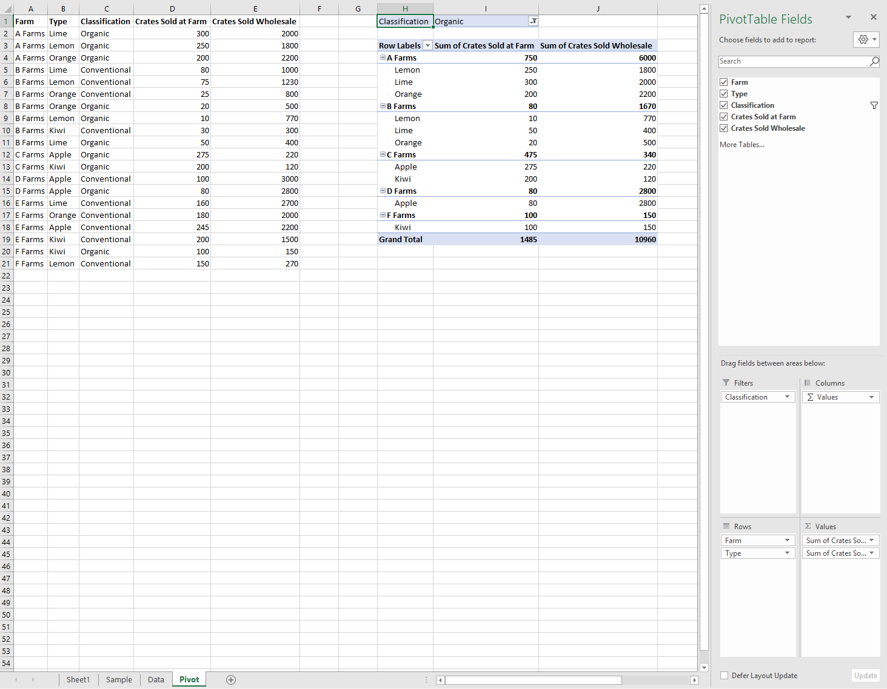

# <a name="work-with-pivottables-using-the-excel-javascript-api"></a><span data-ttu-id="e2e8f-103">Excel JavaScript API を使用してピボットテーブルを操作する</span><span class="sxs-lookup"><span data-stu-id="e2e8f-103">Work with PivotTables using the Excel JavaScript API</span></span>

<span data-ttu-id="e2e8f-104">ピボットテーブルは、より大きなデータセットを合理化します。</span><span class="sxs-lookup"><span data-stu-id="e2e8f-104">PivotTables streamline larger data sets.</span></span> <span data-ttu-id="e2e8f-105">グループ化されたデータのクイック操作を可能にします。</span><span class="sxs-lookup"><span data-stu-id="e2e8f-105">They allow the quick manipulation of grouped data.</span></span> <span data-ttu-id="e2e8f-106">Excel JavaScript API を使用すると、アドインでピボットテーブルを作成し、それらのコンポーネントを操作できます。</span><span class="sxs-lookup"><span data-stu-id="e2e8f-106">The Excel JavaScript API lets your add-in create PivotTables and interact with their components.</span></span> <span data-ttu-id="e2e8f-107">この記事では、Office JavaScript API によってピボットテーブルがどのように表現されるかについて説明し、主要なシナリオのコードサンプルを示します。</span><span class="sxs-lookup"><span data-stu-id="e2e8f-107">This article describes how PivotTables are represented by the Office JavaScript API and provides code samples for key scenarios.</span></span>

<span data-ttu-id="e2e8f-108">ピボットテーブルの機能についてよく知らない場合は、エンドユーザーとしての調査を検討してください。</span><span class="sxs-lookup"><span data-stu-id="e2e8f-108">If you are unfamiliar with the functionality of PivotTables, consider exploring them as an end user.</span></span>
<span data-ttu-id="e2e8f-109">これらのツールの詳細については、「 [ワークシートデータを分析するためのピボットテーブルを作成する](https://support.office.com/article/Import-and-analyze-data-ccd3c4a6-272f-4c97-afbb-d3f27407fcde#ID0EAABAAA=PivotTables) 」を参照してください。</span><span class="sxs-lookup"><span data-stu-id="e2e8f-109">See [Create a PivotTable to analyze worksheet data](https://support.office.com/article/Import-and-analyze-data-ccd3c4a6-272f-4c97-afbb-d3f27407fcde#ID0EAABAAA=PivotTables) for a good primer on these tools.</span></span>

> [!IMPORTANT]
> <span data-ttu-id="e2e8f-110">OLAP を使用して作成されたピボットテーブルは現在サポートされていません。</span><span class="sxs-lookup"><span data-stu-id="e2e8f-110">PivotTables created with OLAP are not currently supported.</span></span> <span data-ttu-id="e2e8f-111">Power Pivot もサポートされていません。</span><span class="sxs-lookup"><span data-stu-id="e2e8f-111">There is also no support for Power Pivot.</span></span>

## <a name="object-model"></a><span data-ttu-id="e2e8f-112">オブジェクト モデル</span><span class="sxs-lookup"><span data-stu-id="e2e8f-112">Object model</span></span>

<span data-ttu-id="e2e8f-113">[PivotTable](/javascript/api/excel/excel.pivottable)は、OFFICE JavaScript API のピボットテーブルの中心的なオブジェクトです。</span><span class="sxs-lookup"><span data-stu-id="e2e8f-113">The [PivotTable](/javascript/api/excel/excel.pivottable) is the central object for PivotTables in the Office JavaScript API.</span></span>

- <span data-ttu-id="e2e8f-114">`Workbook.pivotTables`および `Worksheet.pivotTables` は、ブックとワークシートの[ピボットテーブル](/javascript/api/excel/excel.pivottable)をそれぞれ含む[PivotTableCollections](/javascript/api/excel/excel.pivottablecollection)です。</span><span class="sxs-lookup"><span data-stu-id="e2e8f-114">`Workbook.pivotTables` and `Worksheet.pivotTables` are [PivotTableCollections](/javascript/api/excel/excel.pivottablecollection) that contain the [PivotTables](/javascript/api/excel/excel.pivottable) in the workbook and worksheet, respectively.</span></span>
- <span data-ttu-id="e2e8f-115">[ピボットテーブル](/javascript/api/excel/excel.pivottable)に、複数の[PivotHierarchies](/javascript/api/excel/excel.pivothierarchy)を持つ[PivotHierarchyCollection](/javascript/api/excel/excel.pivothierarchycollection)が含まれています。</span><span class="sxs-lookup"><span data-stu-id="e2e8f-115">A [PivotTable](/javascript/api/excel/excel.pivottable) contains a [PivotHierarchyCollection](/javascript/api/excel/excel.pivothierarchycollection) that has multiple [PivotHierarchies](/javascript/api/excel/excel.pivothierarchy).</span></span>
- <span data-ttu-id="e2e8f-116">これらの [PivotHierarchies](/javascript/api/excel/excel.pivothierarchy) は、 [次のセクション](#hierarchies)で説明するように、PivotTable がデータをピボットする方法を定義するために、特定の階層コレクションに追加できます。</span><span class="sxs-lookup"><span data-stu-id="e2e8f-116">These [PivotHierarchies](/javascript/api/excel/excel.pivothierarchy) can be added to specific hierarchy collections to define how the PivotTable pivots data (as explained in the [following section](#hierarchies)).</span></span>
- <span data-ttu-id="e2e8f-117">[PivotHierarchy](/javascript/api/excel/excel.pivothierarchy)には、1つだけの[PivotField](/javascript/api/excel/excel.pivotfield)を持つ[pivotfieldcollection](/javascript/api/excel/excel.pivotfieldcollection)が含まれています。</span><span class="sxs-lookup"><span data-stu-id="e2e8f-117">A [PivotHierarchy](/javascript/api/excel/excel.pivothierarchy) contains a [PivotFieldCollection](/javascript/api/excel/excel.pivotfieldcollection) that has exactly one [PivotField](/javascript/api/excel/excel.pivotfield).</span></span> <span data-ttu-id="e2e8f-118">デザインを拡張して OLAP ピボットテーブルが含まれる場合は、これが変更されることがあります。</span><span class="sxs-lookup"><span data-stu-id="e2e8f-118">If the design expands to include OLAP PivotTables, this may change.</span></span>
- <span data-ttu-id="e2e8f-119">[PivotField](/javascript/api/excel/excel.pivotfield)には、フィールドの[PivotHierarchy](/javascript/api/excel/excel.pivothierarchy)が階層カテゴリに割り当てられている限り、1つまたは複数の[PivotFilters](/javascript/api/excel/excel.pivotfilters)を適用できます。</span><span class="sxs-lookup"><span data-stu-id="e2e8f-119">A [PivotField](/javascript/api/excel/excel.pivotfield) can have one or more [PivotFilters](/javascript/api/excel/excel.pivotfilters) applied, as long as the field's [PivotHierarchy](/javascript/api/excel/excel.pivothierarchy) is assigned to a hierarchy category.</span></span> 
- <span data-ttu-id="e2e8f-120">[PivotField](/javascript/api/excel/excel.pivotfield)には、複数の[PivotItems](/javascript/api/excel/excel.pivotitem)を持つ[PivotItemCollection](/javascript/api/excel/excel.pivotitemcollection)が含まれています。</span><span class="sxs-lookup"><span data-stu-id="e2e8f-120">A [PivotField](/javascript/api/excel/excel.pivotfield) contains a [PivotItemCollection](/javascript/api/excel/excel.pivotitemcollection) that has multiple [PivotItems](/javascript/api/excel/excel.pivotitem).</span></span>
- <span data-ttu-id="e2e8f-121">[ピボットテーブル](/javascript/api/excel/excel.pivottable)には、ピボット[フィールド](/javascript/api/excel/excel.pivotfield)と[PivotItems](/javascript/api/excel/excel.pivotitem)をワークシートのどこに表示するかを定義する[PivotLayout](/javascript/api/excel/excel.pivotlayout)が含まれています。</span><span class="sxs-lookup"><span data-stu-id="e2e8f-121">A [PivotTable](/javascript/api/excel/excel.pivottable) contains a [PivotLayout](/javascript/api/excel/excel.pivotlayout) that defines where the [PivotFields](/javascript/api/excel/excel.pivotfield) and [PivotItems](/javascript/api/excel/excel.pivotitem) are displayed in the worksheet.</span></span>

<span data-ttu-id="e2e8f-122">これらの関係がいくつかの例のデータにどのように適用されるかを見てみましょう。</span><span class="sxs-lookup"><span data-stu-id="e2e8f-122">Let's look at how these relationships apply to some example data.</span></span> <span data-ttu-id="e2e8f-123">次のデータは、さまざまなファームからの果物販売を示しています。</span><span class="sxs-lookup"><span data-stu-id="e2e8f-123">The following data describes fruit sales from various farms.</span></span> <span data-ttu-id="e2e8f-124">この記事全体の例を示します。</span><span class="sxs-lookup"><span data-stu-id="e2e8f-124">It will be the example throughout this article.</span></span>


<span data-ttu-id="e2e8f-126">この果物 farm sales データは、ピボットテーブルを作成するために使用されます。</span><span class="sxs-lookup"><span data-stu-id="e2e8f-126">This fruit farm sales data will be used to make a PivotTable.</span></span> <span data-ttu-id="e2e8f-127">**Types** などの各列は、 `PivotHierarchy` です。</span><span class="sxs-lookup"><span data-stu-id="e2e8f-127">Each column, such as **Types**, is a `PivotHierarchy`.</span></span> <span data-ttu-id="e2e8f-128">**種類** の階層には、[**種類**] フィールドが含まれています。</span><span class="sxs-lookup"><span data-stu-id="e2e8f-128">The **Types** hierarchy contains the **Types** field.</span></span> <span data-ttu-id="e2e8f-129">[ **種類** ] フィールドには、 **Apple**、 **Kiwi**、 **レモン**、 **黄**、 **オレンジ色** の項目が含まれています。</span><span class="sxs-lookup"><span data-stu-id="e2e8f-129">The **Types** field contains the items **Apple**, **Kiwi**, **Lemon**, **Lime**, and **Orange**.</span></span>

### <a name="hierarchies"></a><span data-ttu-id="e2e8f-130">Hierarchies</span><span class="sxs-lookup"><span data-stu-id="e2e8f-130">Hierarchies</span></span>

<span data-ttu-id="e2e8f-131">ピボットテーブルは、 [行](/javascript/api/excel/excel.rowcolumnpivothierarchy)、 [列](/javascript/api/excel/excel.rowcolumnpivothierarchy)、 [データ](/javascript/api/excel/excel.datapivothierarchy)、および [フィルター](/javascript/api/excel/excel.filterpivothierarchy)の4つの階層カテゴリに基づいて編成されます。</span><span class="sxs-lookup"><span data-stu-id="e2e8f-131">PivotTables are organized based on four hierarchy categories: [row](/javascript/api/excel/excel.rowcolumnpivothierarchy), [column](/javascript/api/excel/excel.rowcolumnpivothierarchy), [data](/javascript/api/excel/excel.datapivothierarchy), and [filter](/javascript/api/excel/excel.filterpivothierarchy).</span></span>

<span data-ttu-id="e2e8f-132">前に示したファームデータには、ファーム、**種類**、**分類**、 **Crates で販売** されたファーム、 **Crates 販売** された卸売の5つの階層が **あります。**</span><span class="sxs-lookup"><span data-stu-id="e2e8f-132">The farm data shown earlier has five hierarchies: **Farms**, **Type**, **Classification**, **Crates Sold at Farm**, and **Crates Sold Wholesale**.</span></span> <span data-ttu-id="e2e8f-133">各階層は、4つのカテゴリのいずれかにのみ存在できます。</span><span class="sxs-lookup"><span data-stu-id="e2e8f-133">Each hierarchy can only exist in one of the four categories.</span></span> <span data-ttu-id="e2e8f-134">**型** が列階層に追加されている場合は、行、データ、またはフィルター階層に配置することもできません。</span><span class="sxs-lookup"><span data-stu-id="e2e8f-134">If **Type** is added to column hierarchies, it cannot also be in the row, data, or filter hierarchies.</span></span> <span data-ttu-id="e2e8f-135">その後、 **型** が行階層に追加されると、列階層から削除されます。</span><span class="sxs-lookup"><span data-stu-id="e2e8f-135">If **Type** is subsequently added to row hierarchies, it is removed from the column hierarchies.</span></span> <span data-ttu-id="e2e8f-136">この動作は、階層の割り当てが Excel UI または Excel JavaScript Api のどちらで行われた場合でも同じです。</span><span class="sxs-lookup"><span data-stu-id="e2e8f-136">This behavior is the same whether hierarchy assignment is done through the Excel UI or the Excel JavaScript APIs.</span></span>

<span data-ttu-id="e2e8f-137">行と列の階層は、データをグループ化する方法を定義します。</span><span class="sxs-lookup"><span data-stu-id="e2e8f-137">Row and column hierarchies define how data will be grouped.</span></span> <span data-ttu-id="e2e8f-138">たとえば、 **ファーム** の行階層は、同じファームのすべてのデータセットをグループ化します。</span><span class="sxs-lookup"><span data-stu-id="e2e8f-138">For example, a row hierarchy of **Farms** will group together all the data sets from the same farm.</span></span> <span data-ttu-id="e2e8f-139">行と列の階層を選択すると、ピボットテーブルの向きが定義されます。</span><span class="sxs-lookup"><span data-stu-id="e2e8f-139">The choice between row and column hierarchy defines the orientation of the PivotTable.</span></span>

<span data-ttu-id="e2e8f-140">データ階層は、行と列の階層に基づいて集計される値です。</span><span class="sxs-lookup"><span data-stu-id="e2e8f-140">Data hierarchies are the values to be aggregated based on the row and column hierarchies.</span></span> <span data-ttu-id="e2e8f-141">**ファームの行** 階層があり、 **Crates** のデータ階層があるピボットテーブルには、各ファームのすべての異なる fruits の合計 (既定では) が表示されます。</span><span class="sxs-lookup"><span data-stu-id="e2e8f-141">A PivotTable with a row hierarchy of **Farms** and a data hierarchy of **Crates Sold Wholesale** shows the sum total (by default) of all the different fruits for each farm.</span></span>

<span data-ttu-id="e2e8f-142">フィルター階層では、フィルター処理された種類の値に基づいて、ピボットのデータが含まれるか、除外されます。</span><span class="sxs-lookup"><span data-stu-id="e2e8f-142">Filter hierarchies include or exclude data from the pivot based on values within that filtered type.</span></span> <span data-ttu-id="e2e8f-143">**有機** 的に選択された種類の **分類** のフィルター階層は、有機フルーツのデータのみを表示します。</span><span class="sxs-lookup"><span data-stu-id="e2e8f-143">A filter hierarchy of **Classification** with the type **Organic** selected only shows data for organic fruit.</span></span>

<span data-ttu-id="e2e8f-144">次に、ファームデータをピボットテーブルと共に示します。</span><span class="sxs-lookup"><span data-stu-id="e2e8f-144">Here is the farm data again, alongside a PivotTable.</span></span> <span data-ttu-id="e2e8f-145">ピボットテーブルは、**ファーム** と **タイプ** を行階層として使用し、**ファームで販売** された Crates と **Crates** がデータ階層として (既定の集計関数を使用して)、データ階層として (**有機** が選択された状態で)**分類** しています。</span><span class="sxs-lookup"><span data-stu-id="e2e8f-145">The PivotTable is using **Farm** and **Type** as the row hierarchies, **Crates Sold at Farm** and **Crates Sold Wholesale** as the data hierarchies (with the default aggregation function of sum), and **Classification** as a filter hierarchy (with **Organic** selected).</span></span>



<span data-ttu-id="e2e8f-147">このピボットテーブルは、JavaScript API または Excel UI を使用して生成できます。</span><span class="sxs-lookup"><span data-stu-id="e2e8f-147">This PivotTable could be generated through the JavaScript API or through the Excel UI.</span></span> <span data-ttu-id="e2e8f-148">両方のオプションを使用すると、アドインをさらに操作できます。</span><span class="sxs-lookup"><span data-stu-id="e2e8f-148">Both options allow for further manipulation through add-ins.</span></span>

## <a name="create-a-pivottable"></a><span data-ttu-id="e2e8f-149">ピボットテーブルを作成する</span><span class="sxs-lookup"><span data-stu-id="e2e8f-149">Create a PivotTable</span></span>

<span data-ttu-id="e2e8f-150">ピボットテーブルには、名前、ソース、および出力先が必要です。</span><span class="sxs-lookup"><span data-stu-id="e2e8f-150">PivotTables need a name, source, and destination.</span></span> <span data-ttu-id="e2e8f-151">ソースは、範囲内のアドレスまたはテーブル名 (、、、または型として渡さ `Range` `string` `Table` れます) を指定できます。</span><span class="sxs-lookup"><span data-stu-id="e2e8f-151">The source can be a range address or table name (passed as a `Range`, `string`, or `Table` type).</span></span> <span data-ttu-id="e2e8f-152">宛先は、またはのいずれかとして指定された範囲のアドレスです `Range` `string` 。</span><span class="sxs-lookup"><span data-stu-id="e2e8f-152">The destination is a range address (given as either a `Range` or `string`).</span></span>
<span data-ttu-id="e2e8f-153">次のサンプルは、さまざまなピボットテーブル作成手法を示しています。</span><span class="sxs-lookup"><span data-stu-id="e2e8f-153">The following samples show various PivotTable creation techniques.</span></span>

### <a name="create-a-pivottable-with-range-addresses"></a><span data-ttu-id="e2e8f-154">範囲のアドレスを使用してピボットテーブルを作成する</span><span class="sxs-lookup"><span data-stu-id="e2e8f-154">Create a PivotTable with range addresses</span></span>

```js
Excel.run(function (context) {
    // Create a PivotTable named "Farm Sales" on the current worksheet at cell
    // A22 with data from the range A1:E21.
    context.workbook.worksheets.getActiveWorksheet().pivotTables.add(
      "Farm Sales", "A1:E21", "A22");

    return context.sync();
});
```

### <a name="create-a-pivottable-with-range-objects"></a><span data-ttu-id="e2e8f-155">Range オブジェクトを使用してピボットテーブルを作成する</span><span class="sxs-lookup"><span data-stu-id="e2e8f-155">Create a PivotTable with Range objects</span></span>

```js
Excel.run(function (context) {
    // Create a PivotTable named "Farm Sales" on a worksheet called "PivotWorksheet" at cell A2
    // the data comes from the worksheet "DataWorksheet" across the range A1:E21.
    var rangeToAnalyze = context.workbook.worksheets.getItem("DataWorksheet").getRange("A1:E21");
    var rangeToPlacePivot = context.workbook.worksheets.getItem("PivotWorksheet").getRange("A2");
    context.workbook.worksheets.getItem("PivotWorksheet").pivotTables.add(
      "Farm Sales", rangeToAnalyze, rangeToPlacePivot);

    return context.sync();
});
```

### <a name="create-a-pivottable-at-the-workbook-level"></a><span data-ttu-id="e2e8f-156">ブックレベルでピボットテーブルを作成する</span><span class="sxs-lookup"><span data-stu-id="e2e8f-156">Create a PivotTable at the workbook level</span></span>

```js
Excel.run(function (context) {
    // Create a PivotTable named "Farm Sales" on a worksheet called "PivotWorksheet" at cell A2
    // the data is from the worksheet "DataWorksheet" across the range A1:E21.
    context.workbook.pivotTables.add(
        "Farm Sales", "DataWorksheet!A1:E21", "PivotWorksheet!A2");

    return context.sync();
});
```

## <a name="use-an-existing-pivottable"></a><span data-ttu-id="e2e8f-157">既存のピボットテーブルを使用する</span><span class="sxs-lookup"><span data-stu-id="e2e8f-157">Use an existing PivotTable</span></span>

<span data-ttu-id="e2e8f-158">手動で作成したピボットテーブルは、ブックまたは個々のワークシートの PivotTable コレクションからアクセスすることもできます。</span><span class="sxs-lookup"><span data-stu-id="e2e8f-158">Manually created PivotTables are also accessible through the PivotTable collection of the workbook or of individual worksheets.</span></span> <span data-ttu-id="e2e8f-159">次のコードは、ブックから **My Pivot** という名前のピボットテーブルを取得します。</span><span class="sxs-lookup"><span data-stu-id="e2e8f-159">The following code gets a PivotTable named **My Pivot** from the workbook.</span></span>

```js
Excel.run(function (context) {
    var pivotTable = context.workbook.pivotTables.getItem("My Pivot");
    return context.sync();
});
```

## <a name="add-rows-and-columns-to-a-pivottable"></a><span data-ttu-id="e2e8f-160">ピボットテーブルに行と列を追加する</span><span class="sxs-lookup"><span data-stu-id="e2e8f-160">Add rows and columns to a PivotTable</span></span>

<span data-ttu-id="e2e8f-161">行と列は、それらのフィールド値を中心にデータをピボットします。</span><span class="sxs-lookup"><span data-stu-id="e2e8f-161">Rows and columns pivot the data around those fields' values.</span></span>

<span data-ttu-id="e2e8f-162">[ **ファーム** ] 列を追加すると、各ファームのすべての売上が回転します。</span><span class="sxs-lookup"><span data-stu-id="e2e8f-162">Adding the **Farm** column pivots all the sales around each farm.</span></span> <span data-ttu-id="e2e8f-163">**種類** と **分類** 行を追加すると、果物が販売されたものと、それが有機であったかどうかに基づいてデータがさらに分解されます。</span><span class="sxs-lookup"><span data-stu-id="e2e8f-163">Adding the **Type** and **Classification** rows further breaks down the data based on what fruit was sold and whether it was organic or not.</span></span>


```js
Excel.run(function (context) {
    var pivotTable = context.workbook.worksheets.getActiveWorksheet().pivotTables.getItem("Farm Sales");

    pivotTable.rowHierarchies.add(pivotTable.hierarchies.getItem("Type"));
    pivotTable.rowHierarchies.add(pivotTable.hierarchies.getItem("Classification"));

    pivotTable.columnHierarchies.add(pivotTable.hierarchies.getItem("Farm"));

    return context.sync();
});
```

<span data-ttu-id="e2e8f-165">行または列だけのピボットテーブルを作成することもできます。</span><span class="sxs-lookup"><span data-stu-id="e2e8f-165">You can also have a PivotTable with only rows or columns.</span></span>

```js
Excel.run(function (context) {
    var pivotTable = context.workbook.worksheets.getActiveWorksheet().pivotTables.getItem("Farm Sales");
    pivotTable.rowHierarchies.add(pivotTable.hierarchies.getItem("Farm"));
    pivotTable.rowHierarchies.add(pivotTable.hierarchies.getItem("Type"));
    pivotTable.rowHierarchies.add(pivotTable.hierarchies.getItem("Classification"));

    return context.sync();
});
```

## <a name="add-data-hierarchies-to-the-pivottable"></a><span data-ttu-id="e2e8f-166">データ階層をピボットテーブルに追加する</span><span class="sxs-lookup"><span data-stu-id="e2e8f-166">Add data hierarchies to the PivotTable</span></span>

<span data-ttu-id="e2e8f-167">データ階層は、行と列に基づいて結合する情報で、ピボットテーブルに格納されます。</span><span class="sxs-lookup"><span data-stu-id="e2e8f-167">Data hierarchies fill the PivotTable with information to combine based on the rows and columns.</span></span> <span data-ttu-id="e2e8f-168">**ファームで販売** された Crates のデータ階層を追加し、 **Crates に販売** されたものは、行と列ごとにこれらの数値を合計します。</span><span class="sxs-lookup"><span data-stu-id="e2e8f-168">Adding the data hierarchies of **Crates Sold at Farm** and **Crates Sold Wholesale** gives sums of those figures for each row and column.</span></span>

<span data-ttu-id="e2e8f-169">この例では、 **ファーム** と **種類** の両方が行で、箱 sales がデータとして含まれています。</span><span class="sxs-lookup"><span data-stu-id="e2e8f-169">In the example, both **Farm** and **Type** are rows, with the crate sales as the data.</span></span>


```js
Excel.run(function (context) {
    var pivotTable = context.workbook.worksheets.getActiveWorksheet().pivotTables.getItem("Farm Sales");

    // "Farm" and "Type" are the hierarchies on which the aggregation is based.
    pivotTable.rowHierarchies.add(pivotTable.hierarchies.getItem("Farm"));
    pivotTable.rowHierarchies.add(pivotTable.hierarchies.getItem("Type"));

    // "Crates Sold at Farm" and "Crates Sold Wholesale" are the hierarchies
    // that will have their data aggregated (summed in this case).
    pivotTable.dataHierarchies.add(pivotTable.hierarchies.getItem("Crates Sold at Farm"));
    pivotTable.dataHierarchies.add(pivotTable.hierarchies.getItem("Crates Sold Wholesale"));

    return context.sync();
});
```

## <a name="pivottable-layouts-and-getting-pivoted-data"></a><span data-ttu-id="e2e8f-171">ピボットテーブルのレイアウトとピボットデータの取得</span><span class="sxs-lookup"><span data-stu-id="e2e8f-171">PivotTable layouts and getting pivoted data</span></span>

<span data-ttu-id="e2e8f-172">[PivotLayout](/javascript/api/excel/excel.pivotlayout)は、階層とそのデータの配置を定義します。</span><span class="sxs-lookup"><span data-stu-id="e2e8f-172">A [PivotLayout](/javascript/api/excel/excel.pivotlayout) defines the placement of hierarchies and their data.</span></span> <span data-ttu-id="e2e8f-173">レイアウトにアクセスして、データが格納される範囲を決定します。</span><span class="sxs-lookup"><span data-stu-id="e2e8f-173">You access the layout to determine the ranges where data is stored.</span></span>

<span data-ttu-id="e2e8f-174">次の図は、ピボットテーブルの範囲に対応するどの layout 関数呼び出しを示しています。</span><span class="sxs-lookup"><span data-stu-id="e2e8f-174">The following diagram shows which layout function calls correspond to which ranges of the PivotTable.</span></span>


### <a name="get-data-from-the-pivottable"></a><span data-ttu-id="e2e8f-176">ピボットテーブルからデータを取得する</span><span class="sxs-lookup"><span data-stu-id="e2e8f-176">Get data from the PivotTable</span></span>

<span data-ttu-id="e2e8f-177">レイアウトは、ピボットテーブルをワークシートに表示する方法を定義します。</span><span class="sxs-lookup"><span data-stu-id="e2e8f-177">The layout defines how the PivotTable is displayed in the worksheet.</span></span> <span data-ttu-id="e2e8f-178">これは、 `PivotLayout` オブジェクトがピボットテーブル要素で使用される範囲を制御することを意味します。</span><span class="sxs-lookup"><span data-stu-id="e2e8f-178">This means the `PivotLayout` object controls the ranges used for PivotTable elements.</span></span> <span data-ttu-id="e2e8f-179">レイアウトによって提供される範囲を使用して、ピボットテーブルによって収集および集計されるデータを取得します。</span><span class="sxs-lookup"><span data-stu-id="e2e8f-179">Use the ranges provided by the layout to get data collected and aggregated by the PivotTable.</span></span> <span data-ttu-id="e2e8f-180">特に、を使用し `PivotLayout.getDataBodyRange` て、ピボットテーブルによって生成されるものにアクセスします。</span><span class="sxs-lookup"><span data-stu-id="e2e8f-180">In particular, use `PivotLayout.getDataBodyRange` to access what the PivotTable produces.</span></span>

<span data-ttu-id="e2e8f-181">次のコードでは、レイアウト (**ファームで販売される Crates の合計** と、前の例で **Crates に販売** された卸売列の **合計の両方**) によって、ピボットテーブルデータの最後の行を取得する方法を示します。</span><span class="sxs-lookup"><span data-stu-id="e2e8f-181">The following code demonstrates how to get the last row of the PivotTable data by going through the layout (the **Grand Total** of both the **Sum of Crates Sold at Farm** and **Sum of Crates Sold Wholesale** columns in the earlier example).</span></span> <span data-ttu-id="e2e8f-182">これらの値は、最終的な合計として集計され、セル **E30** (ピボットテーブルの外側) に表示されます。</span><span class="sxs-lookup"><span data-stu-id="e2e8f-182">Those values are then summed together for a final total, which is displayed in cell **E30** (outside of the PivotTable).</span></span>

```js
Excel.run(function (context) {
    var pivotTable = context.workbook.worksheets.getActiveWorksheet().pivotTables.getItem("Farm Sales");

    // Get the totals for each data hierarchy from the layout.
    var range = pivotTable.layout.getDataBodyRange();
    var grandTotalRange = range.getLastRow();
    grandTotalRange.load("address");
    return context.sync().then(function () {
        // Sum the totals from the PivotTable data hierarchies and place them in a new range, outside of the PivotTable.
        var masterTotalRange = context.workbook.worksheets.getActiveWorksheet().getRange("E30");
        masterTotalRange.formulas = [["=SUM(" + grandTotalRange.address + ")"]];
    });
});
```

### <a name="layout-types"></a><span data-ttu-id="e2e8f-183">レイアウトの種類</span><span class="sxs-lookup"><span data-stu-id="e2e8f-183">Layout types</span></span>

<span data-ttu-id="e2e8f-184">ピボットテーブルには、コンパクト、アウトライン、表形式という3つのレイアウトスタイルがあります。</span><span class="sxs-lookup"><span data-stu-id="e2e8f-184">PivotTables have three layout styles: Compact, Outline, and Tabular.</span></span> <span data-ttu-id="e2e8f-185">前の例ではコンパクトなスタイルを見てきました。</span><span class="sxs-lookup"><span data-stu-id="e2e8f-185">We've seen the compact style in the previous examples.</span></span>

<span data-ttu-id="e2e8f-186">次の例では、アウトラインスタイルと表形式スタイルをそれぞれ使用します。</span><span class="sxs-lookup"><span data-stu-id="e2e8f-186">The following examples use the outline and tabular styles, respectively.</span></span> <span data-ttu-id="e2e8f-187">このコードサンプルは、さまざまなレイアウト間で循環する方法を示しています。</span><span class="sxs-lookup"><span data-stu-id="e2e8f-187">The code sample shows how to cycle between the different layouts.</span></span>

#### <a name="outline-layout"></a><span data-ttu-id="e2e8f-188">アウトラインレイアウト</span><span class="sxs-lookup"><span data-stu-id="e2e8f-188">Outline layout</span></span>


#### <a name="tabular-layout"></a><span data-ttu-id="e2e8f-190">表形式レイアウト</span><span class="sxs-lookup"><span data-stu-id="e2e8f-190">Tabular layout</span></span>


## <a name="delete-a-pivottable"></a><span data-ttu-id="e2e8f-192">ピボットテーブルを削除する</span><span class="sxs-lookup"><span data-stu-id="e2e8f-192">Delete a PivotTable</span></span>

<span data-ttu-id="e2e8f-193">ピボットテーブルは、名前を使用して削除されます。</span><span class="sxs-lookup"><span data-stu-id="e2e8f-193">PivotTables are deleted by using their name.</span></span>

```js
Excel.run(function (context) {
    context.workbook.worksheets.getItem("Pivot").pivotTables.getItem("Farm Sales").delete();
    return context.sync();
});
```

## <a name="filter-a-pivottable"></a><span data-ttu-id="e2e8f-194">ピボットテーブルのフィルター処理</span><span class="sxs-lookup"><span data-stu-id="e2e8f-194">Filter a PivotTable</span></span>

<span data-ttu-id="e2e8f-195">ピボットテーブルのデータをフィルター処理するための主な方法は、PivotFilters を使用する方法です。</span><span class="sxs-lookup"><span data-stu-id="e2e8f-195">The primary method for filtering PivotTable data is with PivotFilters.</span></span> <span data-ttu-id="e2e8f-196">スライサーは、柔軟な代替のフィルター方法を提供します。</span><span class="sxs-lookup"><span data-stu-id="e2e8f-196">Slicers offer an alternate, less flexible filtering method.</span></span> 

<span data-ttu-id="e2e8f-197">[PivotFilters](/javascript/api/excel/excel.pivotfilters) は、ピボットテーブルの4つの [階層カテゴリ](#hierarchies) (フィルター、列、行、および値) に基づいてデータをフィルター処理します。</span><span class="sxs-lookup"><span data-stu-id="e2e8f-197">[PivotFilters](/javascript/api/excel/excel.pivotfilters) filter data based on a PivotTable's four [hierarchy categories](#hierarchies) (filters, columns, rows, and values).</span></span> <span data-ttu-id="e2e8f-198">PivotFilters には4つの種類があり、カレンダーの日付に基づくフィルター処理、文字列解析、数字比較、およびカスタム入力に基づくフィルター処理を行うことができます。</span><span class="sxs-lookup"><span data-stu-id="e2e8f-198">There are four types of PivotFilters, allowing calendar date-based filtering, string parsing, number comparison, and filtering based on a custom input.</span></span> 

<span data-ttu-id="e2e8f-199">[スライサー](/javascript/api/excel/excel.slicer) は、ピボットテーブルと通常の Excel テーブルの両方に適用できます。</span><span class="sxs-lookup"><span data-stu-id="e2e8f-199">[Slicers](/javascript/api/excel/excel.slicer) can be applied to both PivotTables and regular Excel tables.</span></span> <span data-ttu-id="e2e8f-200">ピボットテーブル (PivotTable) に適用すると、 [PivotManualFilter](#pivotmanualfilter) のように機能し、カスタム入力に基づいてフィルターを適用することができます。</span><span class="sxs-lookup"><span data-stu-id="e2e8f-200">When applied to a PivotTable, slicers function like a [PivotManualFilter](#pivotmanualfilter) and allow filtering based on a custom input.</span></span> <span data-ttu-id="e2e8f-201">PivotFilters とは異なり、スライサーには [EXCEL UI コンポーネント](https://support.office.com/article/Use-slicers-to-filter-data-249f966b-a9d5-4b0f-b31a-12651785d29d)があります。</span><span class="sxs-lookup"><span data-stu-id="e2e8f-201">Unlike PivotFilters, slicers have an [Excel UI component](https://support.office.com/article/Use-slicers-to-filter-data-249f966b-a9d5-4b0f-b31a-12651785d29d).</span></span> <span data-ttu-id="e2e8f-202">クラスを使用して、 `Slicer` この UI コンポーネントを作成し、フィルター処理を管理して、視覚的な外観を制御します。</span><span class="sxs-lookup"><span data-stu-id="e2e8f-202">With the `Slicer` class, you create this UI component, manage filtering, and control its visual appearance.</span></span> 

### <a name="filter-with-pivotfilters"></a><span data-ttu-id="e2e8f-203">PivotFilters を使用してフィルターを適用する</span><span class="sxs-lookup"><span data-stu-id="e2e8f-203">Filter with PivotFilters</span></span>

<span data-ttu-id="e2e8f-204">[PivotFilters](/javascript/api/excel/excel.pivotfilters) では、4つの [階層カテゴリ](#hierarchies) (フィルター、列、行、および値) に基づいてピボットテーブルデータをフィルターできます。</span><span class="sxs-lookup"><span data-stu-id="e2e8f-204">[PivotFilters](/javascript/api/excel/excel.pivotfilters) allow you to filter PivotTable data based on the four [hierarchy categories](#hierarchies) (filters, columns, rows, and values).</span></span> <span data-ttu-id="e2e8f-205">PivotTable オブジェクトモデルでは、 `PivotFilters` [PivotField](/javascript/api/excel/excel.pivotfield)に適用され、それぞれに `PivotField` 1 つ以上の割り当てることができ `PivotFilters` ます。</span><span class="sxs-lookup"><span data-stu-id="e2e8f-205">In the PivotTable object model, `PivotFilters` are applied to a [PivotField](/javascript/api/excel/excel.pivotfield), and each `PivotField` can have one or more assigned `PivotFilters`.</span></span> <span data-ttu-id="e2e8f-206">PivotFilters を PivotField に適用するには、フィールドに対応する [PivotHierarchy](/javascript/api/excel/excel.pivothierarchy) を階層カテゴリに割り当てる必要があります。</span><span class="sxs-lookup"><span data-stu-id="e2e8f-206">To apply PivotFilters to a PivotField, the field's corresponding [PivotHierarchy](/javascript/api/excel/excel.pivothierarchy) must be assigned to a hierarchy category.</span></span> 

#### <a name="types-of-pivotfilters"></a><span data-ttu-id="e2e8f-207">PivotFilters の種類</span><span class="sxs-lookup"><span data-stu-id="e2e8f-207">Types of PivotFilters</span></span>

| <span data-ttu-id="e2e8f-208">フィルターの種類</span><span class="sxs-lookup"><span data-stu-id="e2e8f-208">Filter type</span></span> | <span data-ttu-id="e2e8f-209">フィルターの目的</span><span class="sxs-lookup"><span data-stu-id="e2e8f-209">Filter purpose</span></span> | <span data-ttu-id="e2e8f-210">Excel JavaScript API リファレンス</span><span class="sxs-lookup"><span data-stu-id="e2e8f-210">Excel JavaScript API reference</span></span> |
|:--- |:--- |:--- |
| <span data-ttu-id="e2e8f-211">DateFilter</span><span class="sxs-lookup"><span data-stu-id="e2e8f-211">DateFilter</span></span> | <span data-ttu-id="e2e8f-212">カレンダーの日付ベースのフィルター処理。</span><span class="sxs-lookup"><span data-stu-id="e2e8f-212">Calendar date-based filtering.</span></span> | [<span data-ttu-id="e2e8f-213">PivotDateFilter</span><span class="sxs-lookup"><span data-stu-id="e2e8f-213">PivotDateFilter</span></span>](/javascript/api/excel/excel.pivotdatefilter) |
| <span data-ttu-id="e2e8f-214">LabelFilter</span><span class="sxs-lookup"><span data-stu-id="e2e8f-214">LabelFilter</span></span> | <span data-ttu-id="e2e8f-215">テキスト比較フィルター処理。</span><span class="sxs-lookup"><span data-stu-id="e2e8f-215">Text comparison filtering.</span></span> | [<span data-ttu-id="e2e8f-216">PivotLabelFilter</span><span class="sxs-lookup"><span data-stu-id="e2e8f-216">PivotLabelFilter</span></span>](/javascript/api/excel/excel.pivotlabelfilter) |
| <span data-ttu-id="e2e8f-217">ManualFilter</span><span class="sxs-lookup"><span data-stu-id="e2e8f-217">ManualFilter</span></span> | <span data-ttu-id="e2e8f-218">カスタム入力フィルター。</span><span class="sxs-lookup"><span data-stu-id="e2e8f-218">Custom input filtering.</span></span> | [<span data-ttu-id="e2e8f-219">PivotManualFilter</span><span class="sxs-lookup"><span data-stu-id="e2e8f-219">PivotManualFilter</span></span>](/javascript/api/excel/excel.pivotmanualfilter) |
| <span data-ttu-id="e2e8f-220">ValueFilter</span><span class="sxs-lookup"><span data-stu-id="e2e8f-220">ValueFilter</span></span> | <span data-ttu-id="e2e8f-221">数値比較フィルター処理。</span><span class="sxs-lookup"><span data-stu-id="e2e8f-221">Number comparison filtering.</span></span> | [<span data-ttu-id="e2e8f-222">PivotValueFilter</span><span class="sxs-lookup"><span data-stu-id="e2e8f-222">PivotValueFilter</span></span>](/javascript/api/excel/excel.pivotvaluefilter) |

#### <a name="create-a-pivotfilter"></a><span data-ttu-id="e2e8f-223">PivotFilter を作成する</span><span class="sxs-lookup"><span data-stu-id="e2e8f-223">Create a PivotFilter</span></span>

<span data-ttu-id="e2e8f-224">ピボットテーブルの \* フィルター (PivotDateFilter など) を使用してピボットテーブルデータをフィルター処理するには、ピボット [フィールド](/javascript/api/excel/excel.pivotfield)にフィルターを適用します。</span><span class="sxs-lookup"><span data-stu-id="e2e8f-224">To filter PivotTable data with a Pivot\*Filter (such as a PivotDateFilter), apply the filter to a [PivotField](/javascript/api/excel/excel.pivotfield).</span></span> <span data-ttu-id="e2e8f-225">次の4つのコードサンプルは、4種類の PivotFilters を使用する方法を示しています。</span><span class="sxs-lookup"><span data-stu-id="e2e8f-225">The following four code samples show how to use each of the four types of PivotFilters.</span></span> 

##### <a name="pivotdatefilter"></a><span data-ttu-id="e2e8f-226">PivotDateFilter</span><span class="sxs-lookup"><span data-stu-id="e2e8f-226">PivotDateFilter</span></span>

<span data-ttu-id="e2e8f-227">最初のコード例では、**更新さ** れた PivotField 日付に [pivotdatefilter](/javascript/api/excel/excel.pivotdatefilter)を適用し、 **2020-08-01** より前のデータを非表示にします。</span><span class="sxs-lookup"><span data-stu-id="e2e8f-227">The first code sample applies a [PivotDateFilter](/javascript/api/excel/excel.pivotdatefilter) to the **Date Updated** PivotField, hiding any data prior to **2020-08-01**.</span></span> 

> [!IMPORTANT] 
> <span data-ttu-id="e2e8f-228">ピボット \* フィルターは、そのフィールドの PivotHierarchy が階層カテゴリに割り当てられていない限り、PivotField に適用できません。</span><span class="sxs-lookup"><span data-stu-id="e2e8f-228">A Pivot\*Filter can't be applied to a PivotField unless that field's PivotHierarchy is assigned to a hierarchy category.</span></span> <span data-ttu-id="e2e8f-229">次のコードサンプルでは、を `dateHierarchy` ピボットテーブルのカテゴリに追加してから、 `rowHierarchies` フィルター処理に使用できるようにする必要があります。</span><span class="sxs-lookup"><span data-stu-id="e2e8f-229">In the following code sample, the `dateHierarchy` must be added to the PivotTable's `rowHierarchies` category before it can be used for filtering.</span></span>

```js
Excel.run(function (context) {
    // Get the PivotTable and the date hierarchy.
    var pivotTable = context.workbook.worksheets.getActiveWorksheet().pivotTables.getItem("Farm Sales");
    var dateHierarchy = pivotTable.rowHierarchies.getItemOrNullObject("Date Updated");
    
    return context.sync().then(function () {
        // PivotFilters can only be applied to PivotHierarchies that are being used for pivoting.
        // If it's not already there, add "Date Updated" to the hierarchies.
        if (dateHierarchy.isNullObject) {
          dateHierarchy = pivotTable.rowHierarchies.add(pivotTable.hierarchies.getItem("Date Updated"));
        }

        // Apply a date filter to filter out anything logged before August.
        var filterField = dateHierarchy.fields.getItem("Date Updated");
        var dateFilter = {
          condition: Excel.DateFilterCondition.afterOrEqualTo,
          comparator: {
            date: "2020-08-01",
            specificity: Excel.FilterDatetimeSpecificity.month
          }
        };
        filterField.applyFilter({ dateFilter: dateFilter });
        
        return context.sync();
    });
});
```

> [!NOTE]
> <span data-ttu-id="e2e8f-230">次の3つのコードスニペットでは、完全な呼び出しではなく、フィルター固有の抜粋のみが表示され `Excel.run` ます。</span><span class="sxs-lookup"><span data-stu-id="e2e8f-230">The following three code snippets only display filter-specific excerpts, instead of full `Excel.run` calls.</span></span>

##### <a name="pivotlabelfilter"></a><span data-ttu-id="e2e8f-231">PivotLabelFilter</span><span class="sxs-lookup"><span data-stu-id="e2e8f-231">PivotLabelFilter</span></span>

<span data-ttu-id="e2e8f-232">2番目のコードスニペットでは、プロパティを使用して **Type** 、文字 L で始まるラベルを除外することにより、 [Pivotlabelfilter](/javascript/api/excel/excel.pivotlabelfilter)を型の PivotField に適用する方法を示します `LabelFilterCondition.beginsWith` **L**。</span><span class="sxs-lookup"><span data-stu-id="e2e8f-232">The second code snippet demonstrates how to apply a [PivotLabelFilter](/javascript/api/excel/excel.pivotlabelfilter) to the **Type** PivotField, using the `LabelFilterCondition.beginsWith` property to exclude labels that start with the letter **L**.</span></span> 

```js
    // Get the "Type" field.
    var filterField = pivotTable.hierarchies.getItem("Type").fields.getItem("Type");

    // Filter out any types that start with "L" ("Lemons" and "Limes" in this case).
    var filter: Excel.PivotLabelFilter = {
      condition: Excel.LabelFilterCondition.beginsWith,
      substring: "L",
      exclusive: true
    };

    // Apply the label filter to the field.
    filterField.applyFilter({ labelFilter: filter });
```

##### <a name="pivotmanualfilter"></a><span data-ttu-id="e2e8f-233">PivotManualFilter</span><span class="sxs-lookup"><span data-stu-id="e2e8f-233">PivotManualFilter</span></span>

<span data-ttu-id="e2e8f-234">3番目のコードスニペットは、 [PivotManualFilter](/javascript/api/excel/excel.pivotmanualfilter) を使用した手動フィルターを **分類** フィールドに適用し、その分類の **有機** を含まないデータをフィルターで除外します。</span><span class="sxs-lookup"><span data-stu-id="e2e8f-234">The third code snippet applies a manual filter with [PivotManualFilter](/javascript/api/excel/excel.pivotmanualfilter) to the the **Classification** field, filtering out data that doesn't include the classification **Organic**.</span></span> 

```js
    // Apply a manual filter to include only a specific PivotItem (the string "Organic").
    var filterField = classHierarchy.fields.getItem("Classification");
    var manualFilter = { selectedItems: ["Organic"] };
    filterField.applyFilter({ manualFilter: manualFilter });
```

##### <a name="pivotvaluefilter"></a><span data-ttu-id="e2e8f-235">PivotValueFilter</span><span class="sxs-lookup"><span data-stu-id="e2e8f-235">PivotValueFilter</span></span>

<span data-ttu-id="e2e8f-236">数値を比較するには、最後のコードスニペットに示されているように、 [Pivotvaluefilter](/javascript/api/excel/excel.pivotvaluefilter)で値フィルターを使用します。</span><span class="sxs-lookup"><span data-stu-id="e2e8f-236">To compare numbers, use a value filter with [PivotValueFilter](/javascript/api/excel/excel.pivotvaluefilter), as shown in the final code snippet.</span></span> <span data-ttu-id="e2e8f-237">は、 `PivotValueFilter` **ファーム** のピボットテーブル内のデータと **Crates 販売** された卸売のピボットフィールドのデータを比較します。これには、Crates の合計が **500** を超えるファームのみが含まれます。</span><span class="sxs-lookup"><span data-stu-id="e2e8f-237">The `PivotValueFilter` compares the data in the **Farm** PivotField to the data in the **Crates Sold Wholesale** PivotField, including only farms whose sum of crates sold exceeds the value **500**.</span></span> 

```js
    // Get the "Farm" field.
    var filterField = pivotTable.hierarchies.getItem("Farm").fields.getItem("Farm");
    
    // Filter to only include rows with more than 500 wholesale crates sold.
    var filter: Excel.PivotValueFilter = {
      condition: Excel.ValueFilterCondition.greaterThan,
      comparator: 500,
      value: "Sum of Crates Sold Wholesale"
    };
    
    // Apply the value filter to the field.
    filterField.applyFilter({ valueFilter: filter });
```

#### <a name="remove-pivotfilters"></a><span data-ttu-id="e2e8f-238">PivotFilters の削除</span><span class="sxs-lookup"><span data-stu-id="e2e8f-238">Remove PivotFilters</span></span>

<span data-ttu-id="e2e8f-239">すべての PivotFilters を削除するには、 `clearAllFilters` 次のコードサンプルに示すように、各 PivotField にメソッドを適用します。</span><span class="sxs-lookup"><span data-stu-id="e2e8f-239">To remove all PivotFilters, apply the `clearAllFilters` method to each PivotField, as shown in the following code sample.</span></span> 

```js
Excel.run(function (context) {
    // Get the PivotTable.
    var pivotTable = context.workbook.worksheets.getActiveWorksheet().pivotTables.getItem("Farm Sales");
    pivotTable.hierarchies.load("name");
    
    return context.sync().then(function () {
        // Clear the filters on each PivotField.
        pivotTable.hierarchies.items.forEach(function (hierarchy) {
          hierarchy.fields.getItem(hierarchy.name).clearAllFilters();
        });
        return context.sync();
    });
});
```

### <a name="filter-with-slicers"></a><span data-ttu-id="e2e8f-240">スライサーを使用してフィルターを適用する</span><span class="sxs-lookup"><span data-stu-id="e2e8f-240">Filter with slicers</span></span>

<span data-ttu-id="e2e8f-241">[スライサー](/javascript/api/excel/excel.slicer) を使用すると、Excel のピボットテーブルまたはテーブルからデータをフィルターできます。</span><span class="sxs-lookup"><span data-stu-id="e2e8f-241">[Slicers](/javascript/api/excel/excel.slicer) allow data to be filtered from an Excel PivotTable or table.</span></span> <span data-ttu-id="e2e8f-242">スライサーは、指定された列またはピボットテーブルの値を使用して、対応する行にフィルターを適用します。</span><span class="sxs-lookup"><span data-stu-id="e2e8f-242">A slicer uses values from a specified column or PivotField to filter corresponding rows.</span></span> <span data-ttu-id="e2e8f-243">これらの値は、 [SlicerItem](/javascript/api/excel/excel.sliceritem) オブジェクトとしてに格納され `Slicer` ます。</span><span class="sxs-lookup"><span data-stu-id="e2e8f-243">These values are stored as [SlicerItem](/javascript/api/excel/excel.sliceritem) objects in the `Slicer`.</span></span> <span data-ttu-id="e2e8f-244">アドインでは、ユーザーと同様に ([EXCEL UI を介し](https://support.office.com/article/Use-slicers-to-filter-data-249f966b-a9d5-4b0f-b31a-12651785d29d)て) これらのフィルターを調整できます。</span><span class="sxs-lookup"><span data-stu-id="e2e8f-244">Your add-in can adjust these filters, as can users ([through the Excel UI](https://support.office.com/article/Use-slicers-to-filter-data-249f966b-a9d5-4b0f-b31a-12651785d29d)).</span></span> <span data-ttu-id="e2e8f-245">スライサーは、次のスクリーンショットに示されているように、描画層のワークシートの一番上にあります。</span><span class="sxs-lookup"><span data-stu-id="e2e8f-245">The slicer sits on top of the worksheet in the drawing layer, as shown in the following screenshot.</span></span>


> [!NOTE]
> <span data-ttu-id="e2e8f-247">このセクションで説明する手法は、ピボットテーブルに接続されたスライサーの使用方法に重点を置いています。</span><span class="sxs-lookup"><span data-stu-id="e2e8f-247">The techniques described in this section focus on how to use slicers connected to PivotTables.</span></span> <span data-ttu-id="e2e8f-248">テーブルに接続されたスライサーを使用する場合にも同じ方法が適用されます。</span><span class="sxs-lookup"><span data-stu-id="e2e8f-248">The same techniques also apply to using slicers connected to tables.</span></span>

#### <a name="create-a-slicer"></a><span data-ttu-id="e2e8f-249">スライサーを作成する</span><span class="sxs-lookup"><span data-stu-id="e2e8f-249">Create a slicer</span></span>

<span data-ttu-id="e2e8f-250">メソッドまたはメソッドを使用して、ブックまたはワークシートにスライサーを作成でき `Workbook.slicers.add` `Worksheet.slicers.add` ます。</span><span class="sxs-lookup"><span data-stu-id="e2e8f-250">You can create a slicer in a workbook or worksheet by using the `Workbook.slicers.add` method or `Worksheet.slicers.add` method.</span></span> <span data-ttu-id="e2e8f-251">これにより、指定したオブジェクトまたはオブジェクトの [SlicerCollection](/javascript/api/excel/excel.slicercollection) にスライサーが追加され `Workbook` `Worksheet` ます。</span><span class="sxs-lookup"><span data-stu-id="e2e8f-251">Doing so adds a slicer to the [SlicerCollection](/javascript/api/excel/excel.slicercollection) of the specified `Workbook` or `Worksheet` object.</span></span> <span data-ttu-id="e2e8f-252">`SlicerCollection.add`メソッドには、次の3つのパラメーターがあります。</span><span class="sxs-lookup"><span data-stu-id="e2e8f-252">The `SlicerCollection.add` method has three parameters:</span></span>

- <span data-ttu-id="e2e8f-253">`slicerSource`: 新しいスライサーの基になるデータソース。</span><span class="sxs-lookup"><span data-stu-id="e2e8f-253">`slicerSource`: The data source on which the new slicer is based.</span></span> <span data-ttu-id="e2e8f-254">、、または `PivotTable` `Table` の名前または ID を表す文字列を指定でき `PivotTable` `Table` ます。</span><span class="sxs-lookup"><span data-stu-id="e2e8f-254">It can be a `PivotTable`, `Table`, or string representing the name or ID of a `PivotTable` or `Table`.</span></span>
- <span data-ttu-id="e2e8f-255">`sourceField`: フィルター処理の対象となるデータソース内のフィールド。</span><span class="sxs-lookup"><span data-stu-id="e2e8f-255">`sourceField`: The field in the data source by which to filter.</span></span> <span data-ttu-id="e2e8f-256">、、または `PivotField` `TableColumn` の名前または ID を表す文字列を指定でき `PivotField` `TableColumn` ます。</span><span class="sxs-lookup"><span data-stu-id="e2e8f-256">It can be a `PivotField`, `TableColumn`, or string representing the name or ID of a `PivotField` or `TableColumn`.</span></span>
- <span data-ttu-id="e2e8f-257">`slicerDestination`: 新しいスライサーを作成するワークシートを指定します。</span><span class="sxs-lookup"><span data-stu-id="e2e8f-257">`slicerDestination`: The worksheet where the new slicer will be created.</span></span> <span data-ttu-id="e2e8f-258">オブジェクト、または `Worksheet` の名前または ID を指定でき `Worksheet` ます。</span><span class="sxs-lookup"><span data-stu-id="e2e8f-258">It can be a `Worksheet` object or the name or ID of a `Worksheet`.</span></span> <span data-ttu-id="e2e8f-259">を経由してアクセスする場合、このパラメーターは必要あり `SlicerCollection` `Worksheet.slicers` ません。</span><span class="sxs-lookup"><span data-stu-id="e2e8f-259">This parameter is unnecessary when the `SlicerCollection` is accessed through `Worksheet.slicers`.</span></span> <span data-ttu-id="e2e8f-260">この例では、コレクションのワークシートがコピー先として使用されます。</span><span class="sxs-lookup"><span data-stu-id="e2e8f-260">In this case, the collection's worksheet is used as the destination.</span></span>

<span data-ttu-id="e2e8f-261">次のコードサンプルでは、新しいスライサーを **ピボット** ワークシートに追加します。</span><span class="sxs-lookup"><span data-stu-id="e2e8f-261">The following code sample adds a new slicer to the **Pivot** worksheet.</span></span> <span data-ttu-id="e2e8f-262">スライサーのソースは、 **ファームの売上** ピボットテーブルで、 **型** データを使用してフィルター処理されます。</span><span class="sxs-lookup"><span data-stu-id="e2e8f-262">The slicer's source is the **Farm Sales** PivotTable and filters using the **Type** data.</span></span> <span data-ttu-id="e2e8f-263">スライサーは、後で参照するために **フルーツスライサー** という名前も付けられています。</span><span class="sxs-lookup"><span data-stu-id="e2e8f-263">The slicer is also named **Fruit Slicer** for future reference.</span></span>

```js
Excel.run(function (context) {
    var sheet = context.workbook.worksheets.getItem("Pivot");
    var slicer = sheet.slicers.add(
        "Farm Sales" /* The slicer data source. For PivotTables, this can be the PivotTable object reference or name. */,
        "Type" /* The field in the data to filter by. For PivotTables, this can be a PivotField object reference or ID. */
    );
    slicer.name = "Fruit Slicer";
    return context.sync();
});
```

#### <a name="filter-items-with-a-slicer"></a><span data-ttu-id="e2e8f-264">スライサーを使用してアイテムをフィルターにかける</span><span class="sxs-lookup"><span data-stu-id="e2e8f-264">Filter items with a slicer</span></span>

<span data-ttu-id="e2e8f-265">スライサーは、からのアイテムを使用して、ピボットテーブルをフィルターし `sourceField` ます。</span><span class="sxs-lookup"><span data-stu-id="e2e8f-265">The slicer filters the PivotTable with items from the `sourceField`.</span></span> <span data-ttu-id="e2e8f-266">この `Slicer.selectItems` メソッドは、スライサーに残っているアイテムを設定します。</span><span class="sxs-lookup"><span data-stu-id="e2e8f-266">The `Slicer.selectItems` method sets the items that remain in the slicer.</span></span> <span data-ttu-id="e2e8f-267">これらのアイテムは、アイテムのキーを表すとしてメソッドに渡され `string[]` ます。</span><span class="sxs-lookup"><span data-stu-id="e2e8f-267">These items are passed to the method as a `string[]`, representing the keys of the items.</span></span> <span data-ttu-id="e2e8f-268">これらのアイテムを含む行は、ピボットテーブルの集計に残ります。</span><span class="sxs-lookup"><span data-stu-id="e2e8f-268">Any rows containing those items remain in the PivotTable's aggregation.</span></span> <span data-ttu-id="e2e8f-269">以降の呼び出し `selectItems` では、これらの呼び出しで指定されたキーにリストを設定します。</span><span class="sxs-lookup"><span data-stu-id="e2e8f-269">Subsequent calls to `selectItems` set the list to the keys specified in those calls.</span></span>

> [!NOTE]
> <span data-ttu-id="e2e8f-270">`Slicer.selectItems`データソースに含まれていないアイテムが渡されると、 `InvalidArgument` エラーがスローされます。</span><span class="sxs-lookup"><span data-stu-id="e2e8f-270">If `Slicer.selectItems` is passed an item that's not in the data source, an `InvalidArgument` error is thrown.</span></span> <span data-ttu-id="e2e8f-271">このプロパティを使用して、 `Slicer.slicerItems` [SlicerItemCollection](/javascript/api/excel/excel.sliceritemcollection)の内容を確認できます。</span><span class="sxs-lookup"><span data-stu-id="e2e8f-271">The contents can be verified through the `Slicer.slicerItems` property, which is a [SlicerItemCollection](/javascript/api/excel/excel.sliceritemcollection).</span></span>

<span data-ttu-id="e2e8f-272">次のコードサンプルでは、スライサーに対して選択されている3つのアイテム ( **レモン**、 **黄**、 **オレンジ色**) を示します。</span><span class="sxs-lookup"><span data-stu-id="e2e8f-272">The following code sample shows three items being selected for the slicer: **Lemon**, **Lime**, and **Orange**.</span></span>

```js
Excel.run(function (context) {
    var slicer = context.workbook.slicers.getItem("Fruit Slicer");
    // Anything other than the following three values will be filtered out of the PivotTable for display and aggregation.
    slicer.selectItems(["Lemon", "Lime", "Orange"]);
    return context.sync();
});
```

<span data-ttu-id="e2e8f-273">スライサーからすべてのフィルターを削除するには、 `Slicer.clearFilters` 次の例に示すようにメソッドを使用します。</span><span class="sxs-lookup"><span data-stu-id="e2e8f-273">To remove all filters from the slicer, use the `Slicer.clearFilters` method, as shown in the following sample.</span></span>

```js
Excel.run(function (context) {
    var slicer = context.workbook.slicers.getItem("Fruit Slicer");
    slicer.clearFilters();
    return context.sync();
});
```

#### <a name="style-and-format-a-slicer"></a><span data-ttu-id="e2e8f-274">スライサーのスタイルと書式設定</span><span class="sxs-lookup"><span data-stu-id="e2e8f-274">Style and format a slicer</span></span>

<span data-ttu-id="e2e8f-275">アドインでは、プロパティを使用してスライサーの表示設定を調整でき `Slicer` ます。</span><span class="sxs-lookup"><span data-stu-id="e2e8f-275">You add-in can adjust a slicer's display settings through `Slicer` properties.</span></span> <span data-ttu-id="e2e8f-276">次のコードサンプルでは、スタイルを **SlicerStyleLight6** に設定し、スライサーの上部のテキストを **果物の種類** に設定し、スライサーを描画レイヤーの位置 **(395, 15)** に配置し、スライサーのサイズを **135x150** ピクセルに設定します。</span><span class="sxs-lookup"><span data-stu-id="e2e8f-276">The following code sample sets the style to **SlicerStyleLight6**, sets the text at the top of the slicer to **Fruit Types**, places the slicer at the position **(395, 15)** on the drawing layer, and sets the slicer's size to **135x150** pixels.</span></span>

```js
Excel.run(function (context) {
    var slicer = context.workbook.slicers.getItem("Fruit Slicer");
    slicer.caption = "Fruit Types";
    slicer.left = 395;
    slicer.top = 15;
    slicer.height = 135;
    slicer.width = 150;
    slicer.style = "SlicerStyleLight6";
    return context.sync();
});
```

#### <a name="delete-a-slicer"></a><span data-ttu-id="e2e8f-277">スライサーを削除する</span><span class="sxs-lookup"><span data-stu-id="e2e8f-277">Delete a slicer</span></span>

<span data-ttu-id="e2e8f-278">スライサーを削除するには、 `Slicer.delete` メソッドを呼び出します。</span><span class="sxs-lookup"><span data-stu-id="e2e8f-278">To delete a slicer, call the `Slicer.delete` method.</span></span> <span data-ttu-id="e2e8f-279">次のコードサンプルでは、現在のワークシートから最初のスライサーを削除します。</span><span class="sxs-lookup"><span data-stu-id="e2e8f-279">The following code sample deletes the first slicer from the current worksheet.</span></span>

```js
Excel.run(function (context) {
    var sheet = context.workbook.worksheets.getActiveWorksheet();
    sheet.slicers.getItemAt(0).delete();
    return context.sync();
});
```

## <a name="change-aggregation-function"></a><span data-ttu-id="e2e8f-280">集計関数を変更する</span><span class="sxs-lookup"><span data-stu-id="e2e8f-280">Change aggregation function</span></span>

<span data-ttu-id="e2e8f-281">データ階層の値が集計されます。</span><span class="sxs-lookup"><span data-stu-id="e2e8f-281">Data hierarchies have their values aggregated.</span></span> <span data-ttu-id="e2e8f-282">数値のデータセットの場合は、既定でこれが合計になります。</span><span class="sxs-lookup"><span data-stu-id="e2e8f-282">For datasets of numbers, this is a sum by default.</span></span> <span data-ttu-id="e2e8f-283">`summarizeBy`このプロパティは、この動作を[集約 ationfunction](/javascript/api/excel/excel.aggregationfunction)型に基づいて定義します。</span><span class="sxs-lookup"><span data-stu-id="e2e8f-283">The `summarizeBy` property defines this behavior based on an [AggregationFunction](/javascript/api/excel/excel.aggregationfunction) type.</span></span>

<span data-ttu-id="e2e8f-284">現在サポートされている集計関数の種類は、、、、、、、、、、、、 `Sum` `Count` `Average` `Max` `Min` `Product` `CountNumbers` `StandardDeviation` `StandardDeviationP` `Variance` `VarianceP` および `Automatic` (既定値) です。</span><span class="sxs-lookup"><span data-stu-id="e2e8f-284">The currently supported aggregation function types are `Sum`, `Count`, `Average`, `Max`, `Min`, `Product`, `CountNumbers`, `StandardDeviation`, `StandardDeviationP`, `Variance`, `VarianceP`, and `Automatic` (the default).</span></span>

<span data-ttu-id="e2e8f-285">次のコードサンプルでは、集計をデータの平均値に変更します。</span><span class="sxs-lookup"><span data-stu-id="e2e8f-285">The following code samples changes the aggregation to be averages of the data.</span></span>

```js
Excel.run(function (context) {
    var pivotTable = context.workbook.worksheets.getActiveWorksheet().pivotTables.getItem("Farm Sales");
    pivotTable.dataHierarchies.load("no-properties-needed");
    return context.sync().then(function() {

        // Change the aggregation from the default sum to an average of all the values in the hierarchy.
        pivotTable.dataHierarchies.items[0].summarizeBy = Excel.AggregationFunction.average;
        pivotTable.dataHierarchies.items[1].summarizeBy = Excel.AggregationFunction.average;
        return context.sync();
    });
});
```

## <a name="change-calculations-with-a-showasrule"></a><span data-ttu-id="e2e8f-286">ShowAsRule を使用して計算を変更する</span><span class="sxs-lookup"><span data-stu-id="e2e8f-286">Change calculations with a ShowAsRule</span></span>

<span data-ttu-id="e2e8f-287">既定では、ピボットテーブルでは、行と列の階層のデータが個別に集計されます。</span><span class="sxs-lookup"><span data-stu-id="e2e8f-287">PivotTables, by default, aggregate the data of their row and column hierarchies independently.</span></span> <span data-ttu-id="e2e8f-288">[Showasrule](/javascript/api/excel/excel.showasrule)は、データ階層を、ピボットテーブル内の他のアイテムに基づいて出力値に変更します。</span><span class="sxs-lookup"><span data-stu-id="e2e8f-288">A [ShowAsRule](/javascript/api/excel/excel.showasrule) changes the data hierarchy to output values based on other items in the PivotTable.</span></span>

<span data-ttu-id="e2e8f-289">`ShowAsRule`オブジェクトには、次の3つのプロパティがあります。</span><span class="sxs-lookup"><span data-stu-id="e2e8f-289">The `ShowAsRule` object has three properties:</span></span>

- <span data-ttu-id="e2e8f-290">`calculation`: データ階層に適用する相対的な計算の種類 (既定値は `none` )。</span><span class="sxs-lookup"><span data-stu-id="e2e8f-290">`calculation`: The type of relative calculation to apply to the data hierarchy (the default is `none`).</span></span>
- <span data-ttu-id="e2e8f-291">`baseField`: 計算を適用する前に、基本データを含む階層の [PivotField](/javascript/api/excel/excel.pivotfield) 。</span><span class="sxs-lookup"><span data-stu-id="e2e8f-291">`baseField`: The [PivotField](/javascript/api/excel/excel.pivotfield) in the hierarchy containing the base data before the calculation is applied.</span></span> <span data-ttu-id="e2e8f-292">Excel ピボットテーブルには、階層とフィールドの間に一対一のマッピングがあるため、階層とフィールドの両方にアクセスするには同じ名前を使用します。</span><span class="sxs-lookup"><span data-stu-id="e2e8f-292">Since Excel PivotTables have a one-to-one mapping of hierarchy to field, you'll use the same name to access both the hierarchy and the field.</span></span>
- <span data-ttu-id="e2e8f-293">`baseItem`: 計算の種類に基づいて、基準フィールドの値と比較した個々の [ピボット](/javascript/api/excel/excel.pivotitem) テーブル。</span><span class="sxs-lookup"><span data-stu-id="e2e8f-293">`baseItem`: The individual [PivotItem](/javascript/api/excel/excel.pivotitem) compared against the values of the base fields based on the calculation type.</span></span> <span data-ttu-id="e2e8f-294">すべての計算にこのフィールドが必要なわけではありません。</span><span class="sxs-lookup"><span data-stu-id="e2e8f-294">Not all calculations require this field.</span></span>

<span data-ttu-id="e2e8f-295">次の例では、ファームデータ階層で販売された **Crates の合計** の計算を列の合計のパーセンテージに設定します。</span><span class="sxs-lookup"><span data-stu-id="e2e8f-295">The following example sets the calculation on the **Sum of Crates Sold at Farm** data hierarchy to be a percentage of the column total.</span></span>
<span data-ttu-id="e2e8f-296">さらに、粒度をフルーツの種類レベルにまで拡張する必要があるので、 **type** 行階層とその基になるフィールドを使用します。</span><span class="sxs-lookup"><span data-stu-id="e2e8f-296">We still want the granularity to extend to the fruit type level, so we'll use the **Type** row hierarchy and its underlying field.</span></span>
<span data-ttu-id="e2e8f-297">この例は、最初の行階層としても **ファーム** を持っているので、farm total エントリには各ファームがそれぞれを生成する割合が表示されます。</span><span class="sxs-lookup"><span data-stu-id="e2e8f-297">The example also has **Farm** as the first row hierarchy, so the farm total entries display the percentage each farm is responsible for producing as well.</span></span>


```js
Excel.run(function (context) {
    var pivotTable = context.workbook.worksheets.getActiveWorksheet().pivotTables.getItem("Farm Sales");
    var farmDataHierarchy = pivotTable.dataHierarchies.getItem("Sum of Crates Sold at Farm");

    farmDataHierarchy.load("showAs");
    return context.sync().then(function () {

        // Show the crates of each fruit type sold at the farm as a percentage of the column's total.
        var farmShowAs = farmDataHierarchy.showAs;
        farmShowAs.calculation = Excel.ShowAsCalculation.percentOfColumnTotal;
        farmShowAs.baseField = pivotTable.rowHierarchies.getItem("Type").fields.getItem("Type");
        farmDataHierarchy.showAs = farmShowAs;
        farmDataHierarchy.name = "Percentage of Total Farm Sales";
    });
});
```

<span data-ttu-id="e2e8f-299">前の例では、列に対して、個々の行階層のフィールドを基準にして計算を行います。</span><span class="sxs-lookup"><span data-stu-id="e2e8f-299">The previous example set the calculation to the column, relative to the field of an individual row hierarchy.</span></span> <span data-ttu-id="e2e8f-300">計算が個々のアイテムに関連している場合は、プロパティを使用し `baseItem` ます。</span><span class="sxs-lookup"><span data-stu-id="e2e8f-300">When the calculation relates to an individual item, use the `baseItem` property.</span></span>

<span data-ttu-id="e2e8f-301">次の例は、計算を示して `differenceFrom` います。</span><span class="sxs-lookup"><span data-stu-id="e2e8f-301">The following example shows the `differenceFrom` calculation.</span></span> <span data-ttu-id="e2e8f-302">ファームの箱売上データ階層エントリの違いが **、ファームの** ものと比較して表示されます。</span><span class="sxs-lookup"><span data-stu-id="e2e8f-302">It displays the difference of the farm crate sales data hierarchy entries relative to those of **A Farms**.</span></span>
<span data-ttu-id="e2e8f-303">`baseField`は **ファーム** ですので、他のファームの違いと、果物などの種類ごとの内訳 (この例では、**type** が行階層になっています) を確認しています。</span><span class="sxs-lookup"><span data-stu-id="e2e8f-303">The `baseField` is **Farm**, so we see the differences between the other farms, as well as breakdowns for each type of like fruit (**Type** is also a row hierarchy in this example).</span></span>


```js
Excel.run(function (context) {
    var pivotTable = context.workbook.worksheets.getActiveWorksheet().pivotTables.getItem("Farm Sales");
    var farmDataHierarchy = pivotTable.dataHierarchies.getItem("Sum of Crates Sold at Farm");

    farmDataHierarchy.load("showAs");
    return context.sync().then(function () {
        // Show the difference between crate sales of the "A Farms" and the other farms.
        // This difference is both aggregated and shown for individual fruit types (where applicable).
        var farmShowAs = farmDataHierarchy.showAs;
        farmShowAs.calculation = Excel.ShowAsCalculation.differenceFrom;
        farmShowAs.baseField = pivotTable.rowHierarchies.getItem("Farm").fields.getItem("Farm");
        farmShowAs.baseItem = pivotTable.rowHierarchies.getItem("Farm").fields.getItem("Farm").items.getItem("A Farms");
        farmDataHierarchy.showAs = farmShowAs;
        farmDataHierarchy.name = "Difference from A Farms";
    });
});
```

## <a name="change-hierarchy-names"></a><span data-ttu-id="e2e8f-307">階層名を変更する</span><span class="sxs-lookup"><span data-stu-id="e2e8f-307">Change hierarchy names</span></span>

<span data-ttu-id="e2e8f-308">階層フィールドは編集できます。</span><span class="sxs-lookup"><span data-stu-id="e2e8f-308">Hierarchy fields are editable.</span></span> <span data-ttu-id="e2e8f-309">次のコードは、2つのデータ階層の表示名を変更する方法を示しています。</span><span class="sxs-lookup"><span data-stu-id="e2e8f-309">The following code demonstrates how to change the displayed names of two data hierarchies.</span></span>

```js
Excel.run(function (context) {
    var dataHierarchies = context.workbook.worksheets.getActiveWorksheet()
        .pivotTables.getItem("Farm Sales").dataHierarchies;
    dataHierarchies.load("no-properties-needed");
    return context.sync().then(function () {
        // changing the displayed names of these entries
        dataHierarchies.items[0].name = "Farm Sales";
        dataHierarchies.items[1].name = "Wholesale";
    });
});
```

## <a name="see-also"></a><span data-ttu-id="e2e8f-310">関連項目</span><span class="sxs-lookup"><span data-stu-id="e2e8f-310">See also</span></span>

- [<span data-ttu-id="e2e8f-311">Office アドインでの Excel JavaScript オブジェクトモデル</span><span class="sxs-lookup"><span data-stu-id="e2e8f-311">Excel JavaScript object model in Office Add-ins</span></span>](excel-add-ins-core-concepts.md)
- [<span data-ttu-id="e2e8f-312">Excel JavaScript API リファレンス</span><span class="sxs-lookup"><span data-stu-id="e2e8f-312">Excel JavaScript API Reference</span></span>](/javascript/api/excel)
