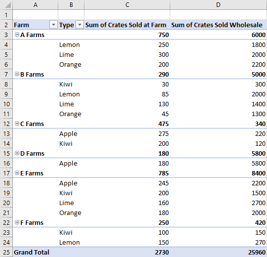

# <a name="work-with-pivottables-using-the-excel-javascript-api"></a>Excel の JavaScript API を使用してピボット テーブルで作業します

ピボット テーブルより大きなデータ セットを効率化します。このことにより、グループ化されたデータのクイック操作が可能になります。Excel の JavaScript API では、アドインにピボット テーブルを作成させ、それらのコンポーネントと対話することができます。 

ピボット テーブルの機能に慣れていない場合は、エンド ユーザーとしてこれらの調査を検討してください。これらのツールの適切な入門書には、 [ワークシートのデータを分析するピボット テーブルの作成](https://support.office.com/en-us/article/Import-and-analyze-data-ccd3c4a6-272f-4c97-afbb-d3f27407fcde#ID0EAABAAA=PivotTables) を参照してください。 

この資料では、一般的なシナリオのコード サンプルを提供します。ピボットテーブル API の理解をさらに深めるには、 [**PivotTable**](https://docs.microsoft.com/javascript/api/excel/excel.pivottable) と [**PivotTableCollection**](https://docs.microsoft.com/javascript/api/excel/excel.pivottable) を参照してください。

> [!IMPORTANT]
> OLAP で作成されたピボット テーブルは、現在サポートされていません。

## <a name="hierarchies"></a>階層

ピボット テーブルは、行、列、データ、フィルターの 4 つの階層カテゴリに基づいて構成されています。この記事全体を通して、さまざまな農場の果物の売り上げを記述した次のデータを使用します。


このデータには **農家**、 **種類**、 **分類**、**農場で販売された箱数**、および **卸売りで販売された箱数** の 5 つの階層があります。各階層は、 4 つのカテゴリのいずれかにのみ存在できます。 ** 種類** が列の階層に追加され、さらに行の階層に追加された場合、行の階層にのみ残ります。

行と列の階層は、データをグループ化する方法を定義します。たとえば、 **農場** の行の階層は、同じ農場のすべてのデータ セットをまとめてグループ化します。行と列の階層から選択すると、ピボット テーブルの向きが定義されます。

データ階層は、行と列の階層に基づいて集計する値です。**農場** の行の階層と **卸売りで販売された木箱** のデータ階層からなるピボット テーブルは、各農場のさまざまな種類の果物の総計 (既定) を示します。

フィルター階層は、フィルターされた種類の中の値に基づいてピボットにデータを取り込むか、取り除きます。**分類** のフィルター階層で **有機栽培** を選択すると、有機栽培の果物のデータのみが表示されます。

こちらにもまた、ピボット テーブルを添えた農場のデータがあります。ピボット テーブルは、**農場** と **種類**を行階層、 **農場で販売された箱数** と**卸売りで販売された箱数** をデータ階層 (既定の合計の集計関数)、**分類**  をフィルター階層 (**有機栽培**を選択) として使用しています。 


このピボット テーブルは、JavaScript API または Excel の UI で作られた可能性があります。両方のオプションで、アドインを通じ、さらに操作することができます。

## <a name="create-a-pivottable"></a>ピボット テーブルの作成

ピボット テーブルには、名前、ソース、および宛先を必要とします。ソースは、範囲アドレス、またはテーブル名を指定できます ( `Range`、 `string`、`Table` 型として渡されます)。同期先は、範囲アドレスです (`Range`  または `string`  のいずれかとして付与されます)。

### <a name="create-a-pivottable-with-range-addresses"></a>範囲アドレスを使用してピボット テーブルを作成

```typescript
await Excel.run(async (context) => {
    // creating a PivotTable named "Farm Sales" on the current worksheet at cell A22 with data from the range A1:E21
    context.workbook.worksheets.getActiveWorksheet().pivotTables.add("Farm Sales", "A1:E21", "A22");

    await context.sync();
});
```

### <a name="create-a-pivottable-with-range-objects"></a>Range オブジェクトを使用してピボット テーブルを作成

```typescript
await Excel.run(async (context) => {    
    // creating a PivotTable named "Farm Sales" on a worksheet called "PivotWorksheet" at cell A2
    // the data comes from the worksheet "DataWorksheet" across the range A1:E21
    const rangeToAnalyze = context.workbook.worksheets.getItem("DataWorksheet").getRange("A1:E21");
    const rangeToPlacePivot = context.workbook.worksheets.getItem("PivotWorksheet").getRange("A2");
    context.workbook.worksheets.getItem("PivotWorksheet").pivotTables.add(
        "Farm Sales", rangeToAnalyze, rangeToPlacePivot);
    
    await context.sync();
});
```

### <a name="create-a-pivottable-at-the-workbook-level"></a>ワークブック レベルでピボット テーブルを作成

```typescript
await Excel.run(async (context) => {
    // creating a PivotTable named "Farm Sales" on a worksheet called "PivotWorksheet" at cell A2
    // the data is from the worksheet "DataWorksheet" across the range A1:E21
    context.workbook.pivotTables.add("Farm Sales", "DataWorksheet!A1:E21", "PivotWorksheet!A2");

    await context.sync();
});
```

## <a name="use-an-existing-pivottable"></a>既存のピボット テーブルの使用

手動で作成したピボット テーブルも、ブックのピボット テーブルのコレクションまたはここのワークシートを使用してアクセス可能です。 

次のコードは、ブックに最初のピボットテーブルを追加します。以降に参照しやすくするため、テーブルに名前を付与します。

```typescript
await Excel.run(async (context) => {
    const pivotTable = context.workbook.pivotTables.getItem("My Pivot");
    await context.sync();
});
```

## <a name="add-rows-and-columns-to-a-pivottable"></a>ピボット テーブルに行と列を追加

行と列は、これらのフィールドの値の周りでデータをピボットします。

**農場** 列を追加すると、各農場のすべての売り上げをピボットします。** 種類** と ** 分類** 行を追加すると、どの果物が販売されたか、そしてそれが有機栽培かどうかに基づいて、データがさらに分解されます。


```typescript
await Excel.run(async (context) => {
    const pivotTable = context.workbook.worksheets.getActiveWorksheet().pivotTables.getItem("Farm Sales");

    pivotTable.rowHierarchies.add(pivotTable.hierarchies.getItem("Type"));
    pivotTable.rowHierarchies.add(pivotTable.hierarchies.getItem("Classification"));
    
    pivotTable.columnHierarchies.add(pivotTable.hierarchies.getItem("Farm"));

    await context.sync();
});
```

行または列のみを含むピボット テーブルも可能です。

```typescript
await Excel.run(async (context) => {
    const pivotTable = context.workbook.worksheets.getActiveWorksheet().pivotTables.getItem("Farm Sales");
    pivotTable.rowHierarchies.add(pivotTable.hierarchies.getItem("Farm"));
    pivotTable.rowHierarchies.add(pivotTable.hierarchies.getItem("Type"));
    pivotTable.rowHierarchies.add(pivotTable.hierarchies.getItem("Classification"));
    
    await context.sync();
});
```

## <a name="add-data-hierarchies-to-the-pivottable"></a>ピボット テーブルへのデータ階層の追加

データ階層は、行と列に基づいて組み合わせる情報でピボット テーブルを入力します。 **農場で販売された箱数** と **卸売りで販売された箱数** のデータ階層を追加すると、各行と列にそれらの数値の合計が表示されます。 

この例では、 **農場** と **種類** はともに行となり、箱の販売数をデータとして表示します。 


```typescript
await Excel.run(async (context) => {
    const pivotTable = context.workbook.worksheets.getActiveWorksheet().pivotTables.getItem("Farm Sales");

    // "Farm" and "Type" are the hierarchies on which the aggregation is based
    pivotTable.rowHierarchies.add(pivotTable.hierarchies.getItem("Farm"));
    pivotTable.rowHierarchies.add(pivotTable.hierarchies.getItem("Type"));

    // "Crates Sold at Farm" and "Crates Sold Wholesale" are the hierarchies
    // that will have their data aggregated (summed in this case)
    pivotTable.dataHierarchies.add(pivotTable.hierarchies.getItem("Crates Sold at Farm"));
    pivotTable.dataHierarchies.add(pivotTable.hierarchies.getItem("Crates Sold Wholesale"));

    await context.sync();
});
```

## <a name="change-aggregation-function"></a>集計関数を変更する

データの階層の値は集計されています。数値のデータセットの場合、規定で和となります。`summarizeBy` プロパティは `AggregrationFunction`  タイプに基づいてこの動作を定義します。 

現在サポートされている集計関数のタイプは、 `Sum`, `Count`, `Average`, `Max`, `Min`, `Product`, `CountNumbers`, `StandardDeviation`, `StandardDeviationP`, `Variance`, `VarianceP`,  `Automatic` (既定値) です。

次のコード サンプルでは、データの平均値を使用する集計を変更します。

```typescript
await Excel.run(async (context) => {
    const pivotTable = context.workbook.worksheets.getActiveWorksheet().pivotTables.getItem("Farm Sales");
    pivotTable.dataHierarchies.load("no-properties-needed");
    await context.sync();

    // changing the aggregation from the default sum to an average of all the values in the hierarchy
    pivotTable.dataHierarchies.items[0].summarizeBy = Excel.AggregationFunction.average;
    pivotTable.dataHierarchies.items[1].summarizeBy = Excel.AggregationFunction.average;
    await context.sync();
});
```

## <a name="change-calculations-with-a-showasrule"></a>ShowAsRule を使用しての計算の変更

規定でピボット テーブルは、行と列の階層のデータを個別に集計します。 `ShowAsRule` は、ピボット テーブル内の他の項目に基づいた値を出力するために、データの階層を変更します。

`ShowAsRule` オブジェクトには次の 3 つのプロパティがあります。
-   `calculation`: データの階層に適用する相対的な計算の種類 (既定値は `none`)。
-   `baseField`: 計算が適用される前の基本データを含む階層内のフィールド。通常、`PivotField` は親階層と同じ名前です。
-   `baseItem`:計算の種類に基づいた基本フィールドの値と比較した個々の項目。すべての計算にこのフィールドが必要なわけではありません。

次の例では、 **農場で販売された木箱の合計** のデータ階層の計算を、列合計のパーセント値に設定します。粒度を果物の種類レベルに拡張するため、 ** 種類** の行の階層と基になるフィールドを使用するようにします。この例でも、最初の行の階層として **農場**  も示しているため、農場の合計エントリは、各農場の生産責任の割合も表示します。


``` TypeScript
await Excel.run(async (context) => {
    const pivotTable = context.workbook.worksheets.getActiveWorksheet().pivotTables.getItem("Farm Sales");
    const farmDataHierarchy = pivotTable.dataHierarchies.getItem("Sum of Crates Sold at Farm");

    farmDataHierarchy.load("showAs");
    await context.sync();

    // show the crates of each fruit type sold at the farm as a percentage of the column's total
    let farmShowAs = farmDataHierarchy.showAs;
    farmShowAs.calculation = Excel.ShowAsCalculation.percentOfColumnTotal;
    farmShowAs.baseField = pivotTable.rowHierarchies.getItem("Type").fields.getItem("Type");
    farmDataHierarchy.showAs = farmShowAs; 
    farmDataHierarchy.name = "Percentage of Total Farm Sales";

    await context.sync();
});
```

前の例では、個別の行階層に関して、列に計算を設定します。計算が個々の項目に関連する場合は、 `baseItem` プロパティを使用します。 

次の例では、 `differenceFrom` 計算を示します。「A農場」に関する、農場で販売された木箱のデータ階層の入力値の差を表示します。`baseField`  は **農場**なので、各果物の種類のブレークダウン図形と同様に、他の農場間の差がわかります (この例では**種類** も行の階層) 。


``` TypeScript
await Excel.run(async (context) => {
    const pivotTable = context.workbook.worksheets.getActiveWorksheet().pivotTables.getItem("Farm Sales");
    const farmDataHierarchy = pivotTable.dataHierarchies.getItem("Sum of Crates Sold at Farm");

    farmDataHierarchy.load("showAs");
    await context.sync();

    // show the difference between crate sales of the "A Farms" and the other farms
    // this difference is both aggregated and shown for individual fruit types (where applicable)
    let farmShowAs = farmDataHierarchy.showAs;
    farmShowAs.calculation = Excel.ShowAsCalculation.differenceFrom;
    farmShowAs.baseField = pivotTable.rowHierarchies.getItem("Farm").fields.getItem("Farm");
    farmShowAs.baseItem = pivotTable.rowHierarchies.getItem("Farm").fields.getItem("Farm").items.getItem("A Farms");
    farmDataHierarchy.showAs = farmShowAs;
    farmDataHierarchy.name = "Difference from A Farms";
    await context.sync();
});
```

## <a name="pivottable-layouts"></a>ピボット テーブルのレイアウト

ピボット テーブルのレイアウトは、階層とそのデータの配置を定義します。データが保存されている範囲を決定するためレイアウトにアクセスします。 

次のダイアグラムは、どのレイアウト関数の呼び出しがピボット テーブルのどの範囲に対応しているか示しています。


次のコードでは、レイアウトを使用するピボット テーブルのデータの最後の行を取得する方法を示します。これらの値は、総計用にまとめて集計されます。

```typescript
await Excel.run(async (context) => {
    const pivotTable = context.workbook.worksheets.getActiveWorksheet().pivotTables.getItem("Farm Sales");

    // get the totals for each data hierarchy from the layout
    const range = pivotTable.layout.getDataBodyRange();
    const grandTotalRange = range.getLastRow();
    grandTotalRange.load("address");
    await context.sync();

    // sum the totals from the PivotTable data hierarchies and place them in a new range
    const masterTotalRange = context.workbook.worksheets.getActiveWorksheet().getRange("B27:C27");
    masterTotalRange.formulas = [["All Crates", "=SUM(" + grandTotalRange.address + ")"]];
    await context.sync();
});
```

ピボット テーブルには、コンパクト、アウトラインおよび表形式の3 つのレイアウトがあります。前の例はコンパクトスタイルです。 

次の例は、アウトライン、表形式のスタイルをそれぞれ使用します。コード サンプルでは、さまざまなレイアウトを交互に表示する方法を示します。

### <a name="outline-layout"></a>アウトライン レイアウト表示



### <a name="tabular-layout"></a>表形式のレイアウト


## <a name="change-hierarchy-names"></a>階層名の変更

階層のフィールドは編集できます。次のコードでは、2 つのデータ階層の表示名をどのように変更するかを説明します。

```typescript
await Excel.run(async (context) => {
    const dataHierarchies = context.workbook.worksheets.getActiveWorksheet()
        .pivotTables.getItem("Farm Sales").dataHierarchies;
    dataHierarchies.load("no-properties-needed");
    await context.sync();
    
    // changing the displayed names of these entries
    dataHierarchies.items[0].name = "Farm Sales";
    dataHierarchies.items[1].name = "Wholesale";
    await context.sync();
});
```

## <a name="delete-a-pivottable"></a>ピボット テーブルの削除

ピボットテーブルをその名前を用いて削除します。

```typescript
await Excel.run(async (context) => {
    context.workbook.worksheets.getItem("Pivot").pivotTables.getItem("Farm Sales").delete();

    await context.sync();
});
```

## <a name="see-also"></a>関連項目

- [Excel の JavaScript API を使用した基本的なプログラミングの概念](excel-add-ins-core-concepts.md)
- [Excel の JavaScript API リファレンス](https://docs.microsoft.com/javascript/api/excel)
