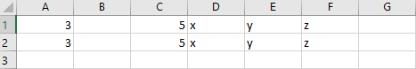
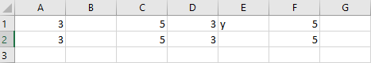

# <a name="work-with-ranges-using-the-excel-javascript-api-advanced"></a>Excel JavaScript API を使用して範囲を操作する (高度)

この記事は、「[Excel JavaScript API を使用して範囲を操作する (基本)](excel-add-ins-ranges.md)」の情報に基づいており、コード サンプルでは Excel JavaScript API を使って範囲のより高度なタスクを実行する方法を示します。 オブジェクトが`Range`サポートするプロパティとメソッドの完全な一覧については、「 [Range オブジェクト (JavaScript API for Excel)](/javascript/api/excel/excel.range)」を参照してください。

## <a name="work-with-dates-using-the-moment-msdate-plug-in"></a>Moment-MSDate プラグインを使用した日付の操作

[Moment JavaScript ライブラリ](https://momentjs.com/)により、日付とタイムスタンプが便利に使用できるようになります。 [Moment-MSDate プラグイン](https://www.npmjs.com/package/moment-msdate)は、日付と時刻の形式を Excel に適したものに変換します。 これは、[NOW 関数](https://support.office.com/article/now-function-3337fd29-145a-4347-b2e6-20c904739c46)から返される形式と同じです。

次のコードは、範囲 **B4** に時刻のタイムスタンプを設定する方法を示しています。

```js
Excel.run(function (context) {
    var sheet = context.workbook.worksheets.getItem("Sample");

    var now = Date.now();
    var nowMoment = moment(now);
    var nowMS = nowMoment.toOADate();

    var dateRange = sheet.getRange("B4");
    dateRange.values = [[nowMS]];

    dateRange.numberFormat = [["[$-409]m/d/yy h:mm AM/PM;@"]];

    return context.sync();
}).catch(errorHandlerFunction);
```

これは、次の例に示すように、セルから日付を取得して、その日付を時刻などの形式に変換するのと同様の手法です。

```js
Excel.run(function (context) {
    var sheet = context.workbook.worksheets.getItem("Sample");

    var dateRange = sheet.getRange("B4");
    dateRange.load("values");

    return context.sync().then(function () {
        var nowMS = dateRange.values[0][0];

        // log the date as a moment
        var nowMoment = moment.fromOADate(nowMS);
        console.log(`get (moment): ${JSON.stringify(nowMoment)}`);

        // log the date as a UNIX-style timestamp
        var now = nowMoment.unix();
        console.log(`get (timestamp): ${now}`);
    });
}).catch(errorHandlerFunction);
```

アドインでは、わかりやすい形式で日付が表示されるように、範囲の書式を設定する必要があります。 たとえば、`"[$-409]m/d/yy h:mm AM/PM;@"` では時刻が "12/3/18 3:57 PM" のように表示されます。 日付と時刻の数値書式の詳細については、「[表示形式のカスタマイズに関するガイドラインを確認する](https://support.office.com/article/review-guidelines-for-customizing-a-number-format-c0a1d1fa-d3f4-4018-96b7-9c9354dd99f5)」の記事で「日付と時刻の表示に関するガイドライン」を参照してください。

## <a name="work-with-multiple-ranges-simultaneously"></a>複数の範囲を同時に操作する

[Rangeareas](/javascript/api/excel/excel.rangeareas)オブジェクトを使用すると、アドインで複数の範囲に対して一度に操作を実行できます。 これらの範囲は、連続していても連続していなくても構いません。 `RangeAreas` については、「[Excel アドインで複数の範囲を同時に操作する](excel-add-ins-multiple-ranges.md)」にさらに詳しい説明があります。

## <a name="find-special-cells-within-a-range"></a>範囲内の特殊なセルを検索する

[範囲](/javascript/api/excel/excel.range#getspecialcells-celltype--cellvaluetype-)の[getSpecialCellsOrNullObject](/javascript/api/excel/excel.range#getspecialcellsornullobject-celltype--cellvaluetype-)メソッドは、セルの特性とセルの値の種類に基づいて範囲を検索します。 これらのメソッドでは両方とも、`RangeAreas` オブジェクトが返されます。 次に示すのは、TypeScript データ型ファイルの、このメソッドのシグネチャです。

```typescript
getSpecialCells(cellType: Excel.SpecialCellType, cellValueType?: Excel.SpecialCellValueType): Excel.RangeAreas;
```

```typescript
getSpecialCellsOrNullObject(cellType: Excel.SpecialCellType, cellValueType?: Excel.SpecialCellValueType): Excel.RangeAreas;
```

次の例では、`getSpecialCells` メソッドを使用して、数式を含むすべてのセルを検索します。 このコードについては、以下の点に注意してください。

- 検索が必要なシートの部分を制限するために、まず `Worksheet.getUsedRange` を呼び出し、その範囲に関してのみ `getSpecialCells` を呼び出します。
- `getSpecialCells` メソッドは `RangeAreas` オブジェクトを返すため、数式を含むセルはすべて、連続していないセルであっても、ピンク色になります。

```js
Excel.run(function (context) {
    var sheet = context.workbook.worksheets.getActiveWorksheet();
    var usedRange = sheet.getUsedRange();
    var formulaRanges = usedRange.getSpecialCells(Excel.SpecialCellType.formulas);
    formulaRanges.format.fill.color = "pink";

    return context.sync();
})
```

対象の特性を含むセルが範囲内に存在しない場合、`getSpecialCells` によって **ItemNotFound** エラーがスローされます。 この場合、制御のフローが `catch` ブロックに移ります (存在する場合)。 `catch`ブロックがない場合、エラーによってメソッドは停止します。

対象の特性を含むセルが常に存在するはずである場合、そうしたセルが存在しないなら、コードを使ってエラーをスローする必要があるかもしれません。 一致するセルがないということが有効なシナリオでは、コードでこのような可能性があるかどうかを確認し、あれば、エラーをスローせずに適切に処理するようにしておく必要があります。 `getSpecialCellsOrNullObject` メソッドと、返された `isNullObject` プロパティを使用して、この動作を実現できます。 次のサンプルでは、このパターンを使用しています。 このコードについては、以下の点に注意してください。

- `getSpecialCellsOrNullObject` メソッドは常にプロキシ オブジェクトを返します。そのため、通常の JavaScript 使用環境では `null` となることはありません。 ただし一致するセルが見つからなかった場合、オブジェクトの `isNullObject` プロパティは `true` に設定されます。
- `isNullObject` プロパティをテストする*前*に、`context.sync` を呼び出します。 これは、すべての `*OrNullObject` メソッドとプロパティの必要条件です。プロパティを読み取るためには常に、そのプロパティをロードして同期する必要があるためです。 ただし、*明示的*に `isNullObject` プロパティをロードする必要はありません。 `load` がオブジェクトに対して呼び出されていない場合であっても、プロパティは `context.sync` によって自動的にロードされます。 詳細については、「[\*OrNullObject メソッド](../excel/excel-add-ins-advanced-concepts.md#ornullobject-methods)」を参照してください。
- このコードをテストするには、最初に数式を含まないセルの範囲を選択してからコードを実行します。 次に、少なくとも 1 つのセルが数式を含む範囲を選択してからコードを再実行します。

```js
Excel.run(function (context) {
    var range = context.workbook.getSelectedRange();
    var formulaRanges = range.getSpecialCellsOrNullObject(Excel.SpecialCellType.formulas);
    return context.sync()
        .then(function() {
            if (formulaRanges.isNullObject) {
                console.log("No cells have formulas");
            }
            else {
                formulaRanges.format.fill.color = "pink";
            }
        })
        .then(context.sync);
})
```

わかりやすくするため、この記事内のすべての他の例では、`getSpecialCells` メソッドを `getSpecialCellsOrNullObject` の代わりに使用しています。

### <a name="narrow-the-target-cells-with-cell-value-types"></a>セルの値の型に応じて対象のセルを絞り込む

`Range.getSpecialCells()` メソッドと `Range.getSpecialCellsOrNullObject()` メソッドでは、対象セルをさらに絞り込むためにオプションとして使用される 2 番目のパラメーターを承諾します。 この 2 番目のパラメーターは、特定の種類の値を含むセルのみを指定するために使用される `Excel.SpecialCellValueType` パラメーターです。

> [!NOTE]
> `Excel.SpecialCellValueType` パラメーターは、`Excel.SpecialCellType` が `Excel.SpecialCellType.formulas` または `Excel.SpecialCellType.constants` の場合にのみ使用できます。

#### <a name="test-for-a-single-cell-value-type"></a>単一のセル値の型のテスト

`Excel.SpecialCellValueType` 列挙型には、次の 4 つの基本型があります (このセクションで後述する他の値の組み合わせに加えて)。

- `Excel.SpecialCellValueType.errors`
- `Excel.SpecialCellValueType.logical` (ブール型)
- `Excel.SpecialCellValueType.numbers`
- `Excel.SpecialCellValueType.text`

次の例では、数値定数である特殊なセルを検索し、そのセルをピンク色にします。 このコードの注意点は次のとおりです。

- リテラル数値を持つセルのみ強調表示されます。 数式 (結果が数字の場合であっても)、ブール値、テキストを持つセル、およびエラー状態にあるセルは強調表示されません。
- コードをテストするには、リテラル数値を持ついくつかのセル、他の型のリテラル値を持ついくつかのセル、そして数式を持ついくつかのセルをそれぞれワークシートに含めるようにしてください。

```js
Excel.run(function (context) {
    var sheet = context.workbook.worksheets.getActiveWorksheet();
    var usedRange = sheet.getUsedRange();
    var constantNumberRanges = usedRange.getSpecialCells(
        Excel.SpecialCellType.constants,
        Excel.SpecialCellValueType.numbers);
    constantNumberRanges.format.fill.color = "pink";

    return context.sync();
})
```

#### <a name="test-for-multiple-cell-value-types"></a>複数のセル値の型のテスト

テキスト値のセルすべてとブール値 (`Excel.SpecialCellValueType.logical`) のセルすべてなど、セル値の型を複数操作する必要がある場合もあります。 `Excel.SpecialCellValueType` 列挙型には、結合された型の値があります。 たとえば、`Excel.SpecialCellValueType.logicalText` は、すべてのブール値のセルとテキスト値のセルを対象としています。 `Excel.SpecialCellValueType.all` は既定値であり、返されるセル値の型は制限されません。 次の例では、結果が数値またはブール値となる数式を含むすべてのセルが色付けされます。

```js
Excel.run(function (context) {
    var sheet = context.workbook.worksheets.getActiveWorksheet();
    var usedRange = sheet.getUsedRange();
    var formulaLogicalNumberRanges = usedRange.getSpecialCells(
        Excel.SpecialCellType.formulas,
        Excel.SpecialCellValueType.logicalNumbers);
    formulaLogicalNumberRanges.format.fill.color = "pink";

    return context.sync();
})
```

## <a name="cut-copy-and-paste"></a>切り取り、コピー、および貼り付け

### <a name="copy-and-paste"></a>Copy and paste

このメソッドは、Excel UI の**コピー**と**貼り付け**の操作をレプリケートします[。](/javascript/api/excel/excel.range#copyfrom-sourcerange--copytype--skipblanks--transpose-) `copyFrom` が呼び出される範囲オブジェクトがコピー先になります。 コピーされるソースは、範囲または範囲を表す文字列のアドレスとして渡されます。

次のコード サンプルでは、**A1:E1** のデータを **G1** で始まる範囲にコピーします (この貼り付けは **G1:K1** で終わります)。

```js
Excel.run(function (context) {
    var sheet = context.workbook.worksheets.getItem("Sample");
    // copy everything from "A1:E1" into "G1" and the cells afterwards ("G1:K1")
    sheet.getRange("G1").copyFrom("A1:E1");
    return context.sync();
}).catch(errorHandlerFunction);
```

`Range.copyFrom` には、省略可能なパラメーターが 3 つあります。

```TypeScript
copyFrom(sourceRange: Range | RangeAreas | string, copyType?: Excel.RangeCopyType, skipBlanks?: boolean, transpose?: boolean): void;
```

`copyType` では、ソースからコピー先にコピーされるデータを指定します。

- `Excel.RangeCopyType.formulas`元のセルの数式を移動し、それらの数式の範囲の相対的な位置を保持します。 任意の数式以外のエントリはそのままコピーされます。
- `Excel.RangeCopyType.values` では、データ値と、数式の場合は数式の結果をコピーします。
- `Excel.RangeCopyType.formats` では、フォント、色、およびその他の書式設定を含む、範囲の書式設定をコピーしますが、値はコピーしません。
- `Excel.RangeCopyType.all`(既定のオプション) を選択すると、データと書式設定の両方がコピーされます。

`skipBlanks` では、空白セルをコピー先にコピーするかどうかを設定します。 true の場合、`copyFrom` ではソースの範囲にある空白セルはスキップされます。
スキップされたセルでは、コピー先の範囲内の対応するセルにある既存のデータを上書きすることはありません。 既定値は false です。

`transpose` では、ソースの場所へのデータの行と列の入れ替えを行うかどうかを決定します。
行と列を入れ替える範囲は対角線で反転されるため、行 **1**、**2**、**3** が列 **A**、**B**、**C** になります。

次のコード サンプルと画像は、この動作をシンプルなシナリオで示しています。

```js
Excel.run(function (context) {
    var sheet = context.workbook.worksheets.getItem("Sample");
    // copy a range, omitting the blank cells so existing data is not overwritten in those cells
    sheet.getRange("D1").copyFrom("A1:C1",
        Excel.RangeCopyType.all,
        true, // skipBlanks
        false); // transpose
    // copy a range, including the blank cells which will overwrite existing data in the target cells
    sheet.getRange("D2").copyFrom("A2:C2",
        Excel.RangeCopyType.all,
        false, // skipBlanks
        false); // transpose
    return context.sync();
}).catch(errorHandlerFunction);
```

*前の関数が実行される前。*



*前の関数が実行された後。*



### <a name="cut-and-paste-move-cells"></a>セルの切り取りと貼り付け (移動)

[指定範囲の moveTo](/javascript/api/excel/excel.range#moveto-destinationrange-)メソッドは、セルをブック内の新しい位置に移動します。 このセルの移動動作は、セル[範囲をドラッグ](https://support.office.com/article/Move-or-copy-cells-and-cell-contents-803d65eb-6a3e-4534-8c6f-ff12d1c4139e)してセルを移動した場合や、**切り取り**と**貼り付け**の操作を行った場合と同じです。 範囲の書式設定と値の両方が、 `destinationRange`パラメーターとして指定された場所に移動します。

次のコードサンプルは、 `Range.moveTo`メソッドを使用して移動する範囲を示しています。 コピー先の範囲がソースよりも小さい場合は、ソースコンテンツを含むように展開されます。

```js
Excel.run(function (context) {
    var sheet = context.workbook.worksheets.getActiveWorksheet();
    sheet.getRange("F1").values = [["Moved Range"]];

    // Move the cells "A1:E1" to "G1" (which fills the range "G1:K1").
    sheet.getRange("A1:E1").moveTo("G1");
    return context.sync();
});
```

## <a name="remove-duplicates"></a>重複の削除

指定した列に重複するエントリがある行を削除するには、このメソッドを使用し[ます。](/javascript/api/excel/excel.range#removeduplicates-columns--includesheader-) このメソッドは、値が最小のインデックスから、範囲内の最大値のインデックス (上から下) までの範囲にある各行を処理します。 任意の行で、指定された 1 つまたは複数の列が範囲より前に表示されている場合、その行は削除されます。 範囲にある削除された行の下の行が上に移動します。 `removeDuplicates` は、範囲外にあるセルの位置には影響しません。

`removeDuplicates` は、どの重複をチェックするかを示す列インデックスを表す `number[]` を受け取ります。 この配列は、0 から始まり、ワークシートではなく範囲を基準にしています。 メソッドには、最初の行がヘッダーであるかどうかを指定するブール値のパラメーターもあります。 **true** の場合、重複について考慮するとき最初の行は無視されます。 メソッド`removeDuplicates`は、削除`RemoveDuplicatesResult`された行数と、残っている一意の行の数を指定するオブジェクトを返します。

範囲の`removeDuplicates`メソッドを使用する場合は、次の点に注意してください。

- `removeDuplicates` は、関数の結果ではなくセルの値を考慮します。 2 つの異なる関数が同じ結果として評価される場合、セルの値は重複と見なしません。
- 空のセルは、`removeDuplicates` に無視されることはありません。 空のセルの値は、その他の値と同様に扱われます。 つまり、範囲に含まれる空の行は `RemoveDuplicatesResult` に含まれることになります。

次の例では、最初の列に重複する値があるエントリを削除する方法を示します。

```js
Excel.run(function (context) {
    var sheet = context.workbook.worksheets.getItem("Sample");
    var range = sheet.getRange("B2:D11");

    var deleteResult = range.removeDuplicates([0],true);
    deleteResult.load();

    return context.sync().then(function () {
        console.log(deleteResult.removed + " entries with duplicate names removed.");
        console.log(deleteResult.uniqueRemaining + " entries with unique names remain in the range.");
    });
}).catch(errorHandlerFunction);
```

*前の関数が実行される前。*


*前の関数が実行された後。*


## <a name="group-data-for-an-outline"></a>アウトラインのデータをグループ化する

行またはセル範囲の列は、[アウトライン](https://support.office.com/article/Outline-group-data-in-a-worksheet-08CE98C4-0063-4D42-8AC7-8278C49E9AFF)を作成するためにまとめてグループ化することができます。 これらのグループを折りたたんで展開し、対応するセルを非表示にして表示することができます。 これにより、トップ行のデータの簡単な分析が容易になります。 これらのアウトライングループを作成するには、[範囲グループ](/javascript/api/excel/excel.range#group-groupoption-)を使用します。

アウトラインには階層を設定できます。小さなグループは、より大きいグループの下にネストされています。 これにより、アウトラインを異なるレベルで表示できるようになります。 表示されるアウトラインレベルを変更するには、 [showOutlineLevels](/javascript/api/excel/excel.worksheet#showoutlinelevels-rowlevels--columnlevels-)メソッドを使用してプログラムで実行できます。 Excel では8レベルのアウトライングループのみがサポートされることに注意してください。

次のコードサンプルでは、行と列の両方に対して2つのレベルのグループを持つアウトラインを作成する方法を示します。 次の図は、そのアウトラインのグループを示しています。 コードサンプルでは、グループ化されている範囲に、アウトラインコントロールの行または列が含まれていないことに注意してください (この例の場合は "集計")。 グループは、コントロールのある行または列ではなく、折りたたまれる内容を定義します。

```js
Excel.run(function (context) {
    var sheet = context.workbook.worksheets.getItem("Sample");

    // Group the larger, main level. Note that the outline controls
    // will be on row 10, meaning 4-9 will collapse and expand.
    sheet.getRange("4:9").group(Excel.GroupOption.byRows);

    // Group the smaller, sublevels. Note that the outline controls
    // will be on rows 6 and 9, meaning 4-5 and 7-8 will collapse and expand.
    sheet.getRange("4:5").group(Excel.GroupOption.byRows);
    sheet.getRange("7:8").group(Excel.GroupOption.byRows);

    // Group the larger, main level. Note that the outline controls
    // will be on column R, meaning C-Q will collapse and expand.
    sheet.getRange("C:Q").group(Excel.GroupOption.byColumns);

    // Group the smaller, sublevels. Note that the outline controls
    // will be on columns G, L, and R, meaning C-F, H-K, and M-P will collapse and expand.
    sheet.getRange("C:F").group(Excel.GroupOption.byColumns);
    sheet.getRange("H:K").group(Excel.GroupOption.byColumns);
    sheet.getRange("M:P").group(Excel.GroupOption.byColumns);
    return context.sync();
}).catch(errorHandlerFunction);

```


行または列グループのグループを解除するには、グループ化を解除するメソッドを使用します[。](/javascript/api/excel/excel.range#ungroup-groupoption-) これにより、アウトラインから最上位レベルが削除されます。 同じ行または列の種類の複数のグループが指定された範囲内の同じレベルにある場合、それらすべてのグループはグループ解除されます。

## <a name="see-also"></a>関連項目

- [Excel JavaScript API を使用して範囲を操作する](excel-add-ins-ranges.md)
- [Excel JavaScript API を使用した基本的なプログラミングの概念](excel-add-ins-core-concepts.md)
- [Excel アドインで複数の範囲を同時に操作する](excel-add-ins-multiple-ranges.md)
