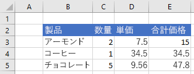

# <a name="clear-or-delete-ranges-using-the-excel-javascript-api"></a>Excel JavaScript API を使用して範囲をクリアまたは削除する

この記事では、Excel JavaScript API を使用して範囲をクリアおよび削除するコード サンプルを提供します。 オブジェクトでサポートされるプロパティとメソッドの完全な一覧については `Range` [、「Excel.Range クラス」を参照してください](/javascript/api/excel/excel.range)。

[!include[Excel cells and ranges note](../includes/note-excel-cells-and-ranges.md)]

## <a name="clear-a-range-of-cells"></a>セルの範囲をクリアする

次のコード サンプルは、範囲 **E2：E5** のセルの内容と書式をすべてクリアします。  

```js
Excel.run(function (context) {
    var sheet = context.workbook.worksheets.getItem("Sample");
    var range = sheet.getRange("E2:E5");

    range.clear();

    return context.sync();
}).catch(errorHandlerFunction);
```

### <a name="data-before-range-is-cleared"></a>範囲をクリアする前のデータ



### <a name="data-after-range-is-cleared"></a>範囲をクリアした後のデータ


## <a name="delete-a-range-of-cells"></a>セルの範囲を削除する

次のコード サンプルでは、 **範囲 B4:E4** のセルを削除し、他のセルを上に移動して、削除されたセルで空いた領域を埋める。

```js
Excel.run(function (context) {
    var sheet = context.workbook.worksheets.getItem("Sample");
    var range = sheet.getRange("B4:E4");

    range.delete(Excel.DeleteShiftDirection.up);

    return context.sync();
}).catch(errorHandlerFunction);
```

### <a name="data-before-range-is-deleted"></a>範囲を削除する前のデータ


### <a name="data-after-range-is-deleted"></a>範囲を削除した後のデータ


## <a name="see-also"></a>関連項目

- [Excel JavaScript API を使用してセルを使用する](excel-add-ins-cells.md)
- [Excel JavaScript API を使用して範囲を設定および取得する](excel-add-ins-ranges-set-get.md)
- [Office アドインの Excel JavaScript オブジェクト モデル](excel-add-ins-core-concepts.md)
