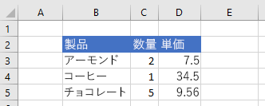

# <a name="clear-or-delete-ranges-using-the-excel-javascript-api"></a><span data-ttu-id="b7a53-103">JavaScript API を使用して範囲をクリアExcel削除する</span><span class="sxs-lookup"><span data-stu-id="b7a53-103">Clear or delete ranges using the Excel JavaScript API</span></span>

<span data-ttu-id="b7a53-104">この記事では、JavaScript API を使用して範囲をクリアおよび削除するコード Excel示します。</span><span class="sxs-lookup"><span data-stu-id="b7a53-104">This article provides code samples that clear and delete ranges with the Excel JavaScript API.</span></span> <span data-ttu-id="b7a53-105">オブジェクトでサポートされるプロパティとメソッドの完全な一覧については `Range` [、「Excel。Range クラス](/javascript/api/excel/excel.range)。</span><span class="sxs-lookup"><span data-stu-id="b7a53-105">For the complete list of properties and methods supported by the `Range` object, see [Excel.Range class](/javascript/api/excel/excel.range).</span></span>

[!include[Excel cells and ranges note](../includes/note-excel-cells-and-ranges.md)]

## <a name="clear-a-range-of-cells"></a><span data-ttu-id="b7a53-106">セルの範囲をクリアする</span><span class="sxs-lookup"><span data-stu-id="b7a53-106">Clear a range of cells</span></span>

<span data-ttu-id="b7a53-107">次のコード サンプルは、範囲 **E2：E5** のセルの内容と書式をすべてクリアします。</span><span class="sxs-lookup"><span data-stu-id="b7a53-107">The following code sample clears all contents and formatting of cells in the range **E2:E5**.</span></span>  

```js
Excel.run(function (context) {
    var sheet = context.workbook.worksheets.getItem("Sample");
    var range = sheet.getRange("E2:E5");

    range.clear();

    return context.sync();
}).catch(errorHandlerFunction);
```

### <a name="data-before-range-is-cleared"></a><span data-ttu-id="b7a53-108">範囲をクリアする前のデータ</span><span class="sxs-lookup"><span data-stu-id="b7a53-108">Data before range is cleared</span></span>


### <a name="data-after-range-is-cleared"></a><span data-ttu-id="b7a53-110">範囲をクリアした後のデータ</span><span class="sxs-lookup"><span data-stu-id="b7a53-110">Data after range is cleared</span></span>



## <a name="delete-a-range-of-cells"></a><span data-ttu-id="b7a53-112">セルの範囲を削除する</span><span class="sxs-lookup"><span data-stu-id="b7a53-112">Delete a range of cells</span></span>

<span data-ttu-id="b7a53-113">次のコード サンプルでは、 **範囲 B4:E4** のセルを削除し、他のセルを上に移動して、削除されたセルで空いた領域を埋める。</span><span class="sxs-lookup"><span data-stu-id="b7a53-113">The following code sample deletes the cells in the range **B4:E4** and shifts other cells up to fill the space that was vacated by the deleted cells.</span></span>

```js
Excel.run(function (context) {
    var sheet = context.workbook.worksheets.getItem("Sample");
    var range = sheet.getRange("B4:E4");

    range.delete(Excel.DeleteShiftDirection.up);

    return context.sync();
}).catch(errorHandlerFunction);
```

### <a name="data-before-range-is-deleted"></a><span data-ttu-id="b7a53-114">範囲を削除する前のデータ</span><span class="sxs-lookup"><span data-stu-id="b7a53-114">Data before range is deleted</span></span>


### <a name="data-after-range-is-deleted"></a><span data-ttu-id="b7a53-116">範囲を削除した後のデータ</span><span class="sxs-lookup"><span data-stu-id="b7a53-116">Data after range is deleted</span></span>


## <a name="see-also"></a><span data-ttu-id="b7a53-118">関連項目</span><span class="sxs-lookup"><span data-stu-id="b7a53-118">See also</span></span>

- [<span data-ttu-id="b7a53-119">JavaScript API を使用してセルExcelする</span><span class="sxs-lookup"><span data-stu-id="b7a53-119">Work with cells using the Excel JavaScript API</span></span>](excel-add-ins-cells.md)
- [<span data-ttu-id="b7a53-120">JavaScript API を使用して範囲を設定Excel取得する</span><span class="sxs-lookup"><span data-stu-id="b7a53-120">Set and get ranges using the Excel JavaScript API</span></span>](excel-add-ins-ranges-set-get.md)
- [<span data-ttu-id="b7a53-121">Office アドインの Excel JavaScript オブジェクト モデル</span><span class="sxs-lookup"><span data-stu-id="b7a53-121">Excel JavaScript object model in Office Add-ins</span></span>](excel-add-ins-core-concepts.md)
