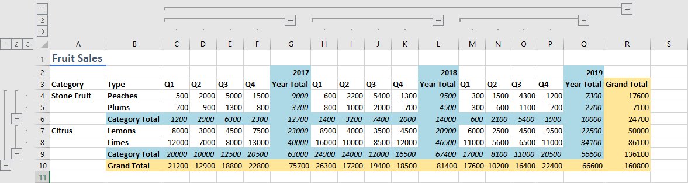

# <a name="group-ranges-for-an-outline-using-the-excel-javascript-api"></a>JavaScript API を使用してアウトラインExcelグループ化する

この記事では、JavaScript API を使用してアウトラインの範囲をグループ化するExcel示します。 オブジェクトがサポートするプロパティとメソッドの`Range`完全な一覧については、「Excel[。Range クラス](/javascript/api/excel/excel.range)。

## <a name="group-rows-or-columns-of-a-range-for-an-outline"></a>アウトラインの範囲の行または列をグループ化する

範囲の行または列をグループ化してアウトラインを作成 [できます](https://support.microsoft.com/office/08ce98c4-0063-4d42-8ac7-8278c49e9aff)。 これらのグループを折りたたみ、展開して、対応するセルを非表示にし、表示できます。 これにより、トップライン データの迅速な分析が容易になります。 [Range.group を使用して](/javascript/api/excel/excel.range#excel-excel-range-group-member(1))、これらのアウトライン グループを作成します。

アウトラインには階層を含め、小さなグループは大きなグループの下に入れ子にできます。 これにより、アウトラインをさまざまなレベルで表示できます。 表示されるアウトライン レベルを変更するには、 [Worksheet.showOutlineLevels](/javascript/api/excel/excel.worksheet#excel-excel-worksheet-showoutlinelevels-member(1)) メソッドを使用してプログラムを使用します。 ただし、Excelは 8 つのレベルのアウトライン グループのみをサポートしています。

次のコード サンプルでは、行と列の両方に 2 つのレベルのグループを含むアウトラインを作成します。 次の図は、そのアウトラインのグループ化を示しています。 コード サンプルでは、グループ化されている範囲にアウトライン コントロールの行または列 (この例の "Totals") は含めされません。 グループは、コントロールの行または列ではなく、折りたたむものを定義します。

```js
Excel.run(function (context) {
    var sheet = context.workbook.worksheets.getItem("Sample");

    // Group the larger, main level. Note that the outline controls
    // will be on row 10, meaning 4-9 will collapse and expand.
    sheet.getRange("4:9").group(Excel.GroupOption.byRows);

    // Group the smaller, sublevels. Note that the outline controls
    // will be on rows 6 and 9, meaning 4-5 and 7-8 will collapse and expand.
    sheet.getRange("4:5").group(Excel.GroupOption.byRows);
    sheet.getRange("7:8").group(Excel.GroupOption.byRows);

    // Group the larger, main level. Note that the outline controls
    // will be on column R, meaning C-Q will collapse and expand.
    sheet.getRange("C:Q").group(Excel.GroupOption.byColumns);

    // Group the smaller, sublevels. Note that the outline controls
    // will be on columns G, L, and R, meaning C-F, H-K, and M-P will collapse and expand.
    sheet.getRange("C:F").group(Excel.GroupOption.byColumns);
    sheet.getRange("H:K").group(Excel.GroupOption.byColumns);
    sheet.getRange("M:P").group(Excel.GroupOption.byColumns);
    return context.sync();
}).catch(errorHandlerFunction);
```



## <a name="remove-grouping-from-rows-or-columns-of-a-range"></a>範囲の行または列からグループ化を削除する

行または列グループのグループ化を解除するには、 [Range.ungroup メソッドを使用](/javascript/api/excel/excel.range#excel-excel-range-ungroup-member(1)) します。 これにより、アウトラインから最も外側のレベルが削除されます。 同じ行または列の種類の複数のグループが指定した範囲内で同じレベルにある場合、それらのグループはすべてグループ化解除されます。

## <a name="see-also"></a>関連項目

- [Office アドインの Excel JavaScript オブジェクト モデル](excel-add-ins-core-concepts.md)
- [JavaScript API を使用してセルExcelする](excel-add-ins-cells.md)
- [Excel アドインで複数の範囲を同時に操作する](excel-add-ins-multiple-ranges.md)
