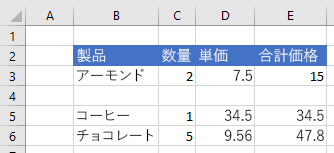

# <a name="insert-a-range-of-cells-using-the-excel-javascript-api"></a>Excel JavaScript API を使用してセル範囲を挿入する

この記事では、Excel JavaScript API を使用してセル範囲を挿入するコード サンプルを提供します。 オブジェクトがサポートするプロパティとメソッドの完全な一覧については `Range` [、Excel.Range クラスを参照してください](/javascript/api/excel/excel.range)。

[!include[Excel cells and ranges note](../includes/note-excel-cells-and-ranges.md)]

## <a name="insert-a-range-of-cells"></a>セルの範囲を挿入する

次のコードサンプルは、場所 **B4:E4** にセルの範囲を挿入し、他のセルを下にシフトして、新しいセルのためのスペースを提供します。

```js
Excel.run(function (context) {
    var sheet = context.workbook.worksheets.getItem("Sample");
    var range = sheet.getRange("B4:E4");

    range.insert(Excel.InsertShiftDirection.down);

    return context.sync();
}).catch(errorHandlerFunction);
```

### <a name="data-before-range-is-inserted"></a>範囲を挿入する前のデータ


### <a name="data-after-range-is-inserted"></a>範囲を挿入した後のデータ



## <a name="see-also"></a>関連項目

- [Office アドインの Excel JavaScript オブジェクト モデル](excel-add-ins-core-concepts.md)
- [Excel JavaScript API を使用してセルを使用する](excel-add-ins-cells.md)
- [Excel JavaScript API を使用して範囲をクリアまたは削除する](excel-add-ins-ranges-clear-delete.md)
