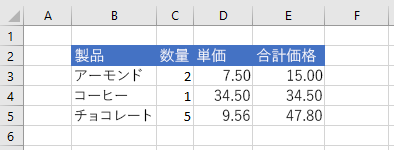

# <a name="set-range-format-using-the-excel-javascript-api"></a>Excel JavaScript API を使用して範囲の形式を設定する

この記事では、Excel JavaScript API を使用して範囲内のセルのフォントの色、塗りつぶしの色、および数値の形式を設定するコード サンプルを提供します。 オブジェクトがサポートするプロパティとメソッドの完全な一覧については `Range` [、「Excel.Range クラス」を参照してください](/javascript/api/excel/excel.range)。

[!include[Excel cells and ranges note](../includes/note-excel-cells-and-ranges.md)]

## <a name="set-font-color-and-fill-color"></a>フォントの色と塗りつぶしの色を設定する

次のコード サンプルは、範囲 **B2：E2** のセルのフォントの色と塗りつぶしの色を設定します。

```js
Excel.run(function (context) {
    var sheet = context.workbook.worksheets.getItem("Sample");

    var range = sheet.getRange("B2:E2");
    range.format.fill.color = "#4472C4";
    range.format.font.color = "white";

    return context.sync();
}).catch(errorHandlerFunction);
```

### <a name="data-in-range-before-font-color-and-fill-color-are-set"></a>フォントの色と塗りつぶしの色を設定する前の範囲内のデータ


### <a name="data-in-range-after-font-color-and-fill-color-are-set"></a>フォントの色と塗りつぶしの色を設定した後の範囲内のデータ


## <a name="set-number-format"></a>数値の書式を設定する

次のコード サンプルは、範囲 **D3：E5** のセルの数値を書式を設定します。

```js
Excel.run(function (context) {
    var sheet = context.workbook.worksheets.getItem("Sample");

    var formats = [
        ["0.00", "0.00"],
        ["0.00", "0.00"],
        ["0.00", "0.00"]
    ];

    var range = sheet.getRange("D3:E5");
    range.numberFormat = formats;

    return context.sync();
}).catch(errorHandlerFunction);
```

### <a name="data-in-range-before-number-format-is-set"></a>数値の書式を設定する前の範囲内のデータ


### <a name="data-in-range-after-number-format-is-set"></a>数値の書式を設定した後の範囲内のデータ



## <a name="see-also"></a>関連項目

- [Office アドインの Excel JavaScript オブジェクト モデル](excel-add-ins-core-concepts.md)
- [Excel JavaScript API を使用してセルを使用する](excel-add-ins-cells.md)
- [Excel JavaScript API を使用して範囲を設定および取得する](excel-add-ins-ranges-set-get.md)
- [Excel JavaScript API を使用して範囲の値、テキスト、または数式を設定および取得する](excel-add-ins-ranges-set-get-values.md)
