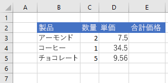

# <a name="set-and-get-range-values-text-or-formulas-using-the-excel-javascript-api"></a>JavaScript API を使用して範囲の値、テキスト、または数式を設定Excel取得する

この記事では、JavaScript API を使用して範囲の値、テキスト、または数式を設定および取得するExcelします。 オブジェクトがサポートするプロパティとメソッドの`Range`完全な一覧については、「Excel[。Range クラス](/javascript/api/excel/excel.range)。

[!include[Excel cells and ranges note](../includes/note-excel-cells-and-ranges.md)]

## <a name="set-values-or-formulas"></a>値または数式を設定する

次のコード サンプルでは、1 つのセルまたはセル範囲の値と数式を設定します。

### <a name="set-value-for-a-single-cell"></a>1 つのセルの値を設定する

次のコード サンプルでは、セル **C3** の値を "5" に設定し、データに最も適した列の幅を設定します。

```js
await Excel.run(async (context) => {
    let sheet = context.workbook.worksheets.getItem("Sample");

    let range = sheet.getRange("C3");
    range.values = [[ 5 ]];
    range.format.autofitColumns();

    await context.sync();
});
```

#### <a name="data-before-cell-value-is-updated"></a>セルの値が更新される前のデータ


#### <a name="data-after-cell-value-is-updated"></a>セルの値が更新された後のデータ


### <a name="set-values-for-a-range-of-cells"></a>複数のセルの範囲の値を設定する

次のコード サンプルでは、範囲 **B5：D5** のセルの値を設定し、データに最も適した列の幅を設定します。

```js
await Excel.run(async (context) => {
    let sheet = context.workbook.worksheets.getItem("Sample");

    let data = [
        ["Potato Chips", 10, 1.80],
    ];

    let range = sheet.getRange("B5:D5");
    range.values = data;
    range.format.autofitColumns();

    await context.sync();
});
```

#### <a name="data-before-cell-values-are-updated"></a>複数のセルの値が更新される前のデータ


#### <a name="data-after-cell-values-are-updated"></a>複数のセルの値が更新された後のデータ


### <a name="set-formula-for-a-single-cell"></a>1 つのセルの数式を設定する

次のコード サンプルでは、セル **E3** の数式を設定し、データに最も適した列の幅を設定します。

```js
await Excel.run(async (context) => {
    let sheet = context.workbook.worksheets.getItem("Sample");

    let range = sheet.getRange("E3");
    range.formulas = [[ "=C3 * D3" ]];
    range.format.autofitColumns();

    await context.sync();
});
```

#### <a name="data-before-cell-formula-is-set"></a>セルの数式が設定される前のデータ



#### <a name="data-after-cell-formula-is-set"></a>セルの数式が設定された後のデータ


### <a name="set-formulas-for-a-range-of-cells"></a>セルの範囲の数式を設定する

次のコード サンプルでは、範囲 **E2:E6** のセルの数式を設定し、データに最も適した列の幅を設定します。

```js
await Excel.run(async (context) => {
    let sheet = context.workbook.worksheets.getItem("Sample");

    let data = [
        ["=C3 * D3"],
        ["=C4 * D4"],
        ["=C5 * D5"],
        ["=SUM(E3:E5)"]
    ];

    let range = sheet.getRange("E3:E6");
    range.formulas = data;
    range.format.autofitColumns();

    await context.sync();
});
```

#### <a name="data-before-cell-formulas-are-set"></a>複数のセルの数式が設定される前のデータ


#### <a name="data-after-cell-formulas-are-set"></a>複数のセルの数式が設定された後のデータ


## <a name="get-values-text-or-formulas"></a>値、テキスト、または数式を取得する

これらのコード サンプルは、セルの範囲から値、テキスト、および数式を取得します。

### <a name="get-values-from-a-range-of-cells"></a>セルの範囲から値を取得する

次のコード サンプルは、**範囲 B2:E6**`values` を取得し、プロパティを読み込み、コンソールに値を書き込みます。 範囲 `values` のプロパティは、セルに含まれる生の値を指定します。 範囲内の一部のセル `values` に数式が含まれている場合でも、範囲のプロパティは、これらのセルの生の値を指定し、数式は指定しない。

```js
await Excel.run(async (context) => {
    let sheet = context.workbook.worksheets.getItem("Sample");

    let range = sheet.getRange("B2:E6");
    range.load("values");
    await context.sync();

    console.log(JSON.stringify(range.values, null, 4));
});
```

#### <a name="data-in-range-values-in-column-e-are-a-result-of-formulas"></a>範囲内のデータ (列 E の値は数式の結果)


#### <a name="rangevalues-as-logged-to-the-console-by-the-code-sample-above"></a>range.values (上記のコード サンプルによりコンソールに記録される)

```json
[
    [
        "Product",
        "Qty",
        "Unit Price",
        "Total Price"
    ],
    [
        "Almonds",
        2,
        7.5,
        15
    ],
    [
        "Coffee",
        1,
        34.5,
        34.5
    ],
    [
        "Chocolate",
        5,
        9.56,
        47.8
    ],
    [
        "",
        "",
        "",
        97.3
    ]
]
```

### <a name="get-text-from-a-range-of-cells"></a>セルの範囲からテキストを取得する

次のコード サンプルでは、**範囲 B2:E6**`text` を取得し、プロパティを読み込み、コンソールに書き込みます。 範囲 `text` のプロパティは、範囲内のセルの表示値を指定します。 範囲内の一部のセル `text` に数式が含まれている場合でも、範囲のプロパティは、これらのセルの表示値を指定します。数式は指定されません。

```js
await Excel.run(async (context) => {
    let sheet = context.workbook.worksheets.getItem("Sample");

    let range = sheet.getRange("B2:E6");
    range.load("text");
    await context.sync();

    console.log(JSON.stringify(range.text, null, 4));
});
```

#### <a name="data-in-range-values-in-column-e-are-a-result-of-formulas"></a>範囲内のデータ (列 E の値は数式の結果)


#### <a name="rangetext-as-logged-to-the-console-by-the-code-sample-above"></a>range.text (上記のコード サンプルによりコンソールに記録される)

```json
[
    [
        "Product",
        "Qty",
        "Unit Price",
        "Total Price"
    ],
    [
        "Almonds",
        "2",
        "7.5",
        "15"
    ],
    [
        "Coffee",
        "1",
        "34.5",
        "34.5"
    ],
    [
        "Chocolate",
        "5",
        "9.56",
        "47.8"
    ],
    [
        "",
        "",
        "",
        "97.3"
    ]
]
```

### <a name="get-formulas-from-a-range-of-cells"></a>セルの範囲から数式を取得する

次のコード サンプルでは、**範囲 B2:E6**`formulas` を取得し、プロパティを読み込み、コンソールに書き込みます。 範囲 `formulas` のプロパティは、数式を含むセルの数式と、数式を含むセルの生の値を指定します。

```js
await Excel.run(async (context) => {
    let sheet = context.workbook.worksheets.getItem("Sample");

    let range = sheet.getRange("B2:E6");
    range.load("formulas");
    await context.sync();

    console.log(JSON.stringify(range.formulas, null, 4));
});
```

#### <a name="data-in-range-values-in-column-e-are-a-result-of-formulas"></a>範囲内のデータ (列 E の値は数式の結果)


#### <a name="rangeformulas-as-logged-to-the-console-by-the-code-sample-above"></a>range.formulas (上記のコード サンプルによりコンソールに記録される)

```json
[
    [
        "Product",
        "Qty",
        "Unit Price",
        "Total Price"
    ],
    [
        "Almonds",
        2,
        7.5,
        "=C3 * D3"
    ],
    [
        "Coffee",
        1,
        34.5,
        "=C4 * D4"
    ],
    [
        "Chocolate",
        5,
        9.56,
        "=C5 * D5"
    ],
    [
        "",
        "",
        "",
        "=SUM(E3:E5)"
    ]
]
```

## <a name="see-also"></a>関連項目

- [Office アドインの Excel JavaScript オブジェクト モデル](excel-add-ins-core-concepts.md)
- [JavaScript API を使用してセルExcelする](excel-add-ins-cells.md)
- [JavaScript API を使用して範囲を設定Excel取得する](excel-add-ins-ranges-set-get.md)
- [JavaScript API を使用して範囲Excel設定する](excel-add-ins-ranges-set-format.md)
