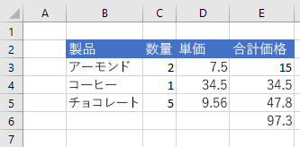

# <a name="work-with-ranges-using-the-excel-javascript-api"></a><span data-ttu-id="a8e1b-102">Excel JavaScript API を使用して範囲を操作する</span><span class="sxs-lookup"><span data-stu-id="a8e1b-102">Work with ranges using the Excel JavaScript API</span></span>

<span data-ttu-id="a8e1b-103">この記事では、Excel JavaScript API を使用して、範囲に関する一般的なタスクを実行する方法を示すサンプル コードを提供します。</span><span class="sxs-lookup"><span data-stu-id="a8e1b-103">This article provides code samples that show how to perform common tasks with ranges using the Excel JavaScript API.</span></span> <span data-ttu-id="a8e1b-104">**Range** オブジェクトがサポートするプロパティとメソッドの完全な一覧については、「[Range オブジェクト (JavaScript API for Excel)](https://docs.microsoft.com/javascript/api/excel/excel.range)」を参照してください。</span><span class="sxs-lookup"><span data-stu-id="a8e1b-104">For the complete list of properties and methods that the **Range** object supports, see [Range Object (JavaScript API for Excel)](https://docs.microsoft.com/javascript/api/excel/excel.range).</span></span>

## <a name="get-a-range"></a><span data-ttu-id="a8e1b-105">範囲を取得する</span><span class="sxs-lookup"><span data-stu-id="a8e1b-105">Get a range</span></span>

<span data-ttu-id="a8e1b-106">次の例では、ワークシート内の範囲への参照を取得する、さまざまな方法を示しています。</span><span class="sxs-lookup"><span data-stu-id="a8e1b-106">The following examples show different ways to get a reference to a range within a worksheet.</span></span>

### <a name="get-range-by-address"></a><span data-ttu-id="a8e1b-107">アドレスによって範囲を取得する</span><span class="sxs-lookup"><span data-stu-id="a8e1b-107">Get range by address</span></span>

<span data-ttu-id="a8e1b-108">次のコード サンプルでは、**Sample** という名前のワークシートからアドレス **B2:B5** の範囲を取得し、**address** プロパティを読み込んで、コンソールにメッセージを書き込みます。</span><span class="sxs-lookup"><span data-stu-id="a8e1b-108">The following code sample gets the range with address **B2:B5** from the worksheet named **Sample**, loads its **address** property, and writes a message to the console.</span></span>

```js
Excel.run(function (context) {
    var sheet = context.workbook.worksheets.getItem("Sample");
    var range = sheet.getRange("B2:C5");
    range.load("address");

    return context.sync()
        .then(function () {
            console.log(`The address of the range B2:C5 is "${range.address}"`);
        });
}).catch(errorHandlerFunction);
```

### <a name="get-range-by-name"></a><span data-ttu-id="a8e1b-109">名前によって範囲を取得する</span><span class="sxs-lookup"><span data-stu-id="a8e1b-109">Get range by name</span></span>

<span data-ttu-id="a8e1b-110">次のコード サンプルでは、**Sample** という名前のワークシートから **MyRange** という名前の範囲を取得し、**address** プロパティを読み込んで、コンソールにメッセージを書き込みます。</span><span class="sxs-lookup"><span data-stu-id="a8e1b-110">The following code sample gets the range named **MyRange** from the worksheet named **Sample**, loads its **address** property, and writes a message to the console.</span></span>

```js
Excel.run(function (context) {
    var sheet = context.workbook.worksheets.getItem("Sample");
    var range = sheet.getRange("MyRange");
    range.load("address");

    return context.sync()
        .then(function () {
            console.log(`The address of the range "MyRange" is "${range.address}"`);
        });
}).catch(errorHandlerFunction);
```

### <a name="get-used-range"></a><span data-ttu-id="a8e1b-111">使用範囲を取得する</span><span class="sxs-lookup"><span data-stu-id="a8e1b-111">Get used range</span></span>

<span data-ttu-id="a8e1b-112">次のコード サンプルでは、**Sample** という名前のワークシートから使用範囲を取得し、**address** プロパティを読み込んで、コンソールにメッセージを書き込みます。</span><span class="sxs-lookup"><span data-stu-id="a8e1b-112">The following code sample gets the used range from the worksheet named **Sample**, loads its **address** property, and writes a message to the console.</span></span> <span data-ttu-id="a8e1b-113">使用範囲とは、値または書式設定が割り当てられているワークシート内のセルを含む、最小の範囲です。</span><span class="sxs-lookup"><span data-stu-id="a8e1b-113">The used range is the smallest range that encompasses any cells in the worksheet that have a value or formatting assigned to them.</span></span> <span data-ttu-id="a8e1b-114">ワークシート全体が空白の場合、**getUsedRange()** メソッドは、ワークシートの左上のセルのみで構成される範囲を返します。</span><span class="sxs-lookup"><span data-stu-id="a8e1b-114">If the entire worksheet is blank, the **getUsedRange()** method returns a range that consists of only the top-left cell in the worksheet.</span></span>

```js
Excel.run(function (context) {
    var sheet = context.workbook.worksheets.getItem("Sample");
    var range = sheet.getUsedRange();
    range.load("address");

    return context.sync()
        .then(function () {
            console.log(`The address of the used range in the worksheet is "${range.address}"`);
        });
}).catch(errorHandlerFunction);
```

### <a name="get-entire-range"></a><span data-ttu-id="a8e1b-115">範囲全体を取得する</span><span class="sxs-lookup"><span data-stu-id="a8e1b-115">Get entire range</span></span>

<span data-ttu-id="a8e1b-116">次のコード サンプルでは、**Sample** という名前のワークシートからワークシートの範囲全体を取得し、**address** プロパティを読み込んで、コンソールにメッセージを書き込みます。</span><span class="sxs-lookup"><span data-stu-id="a8e1b-116">The following code sample gets the entire worksheet range from the worksheet named **Sample**, loads its **address** property, and writes a message to the console.</span></span>

```js
Excel.run(function (context) {
    var sheet = context.workbook.worksheets.getItem("Sample");
    var range = sheet.getRange();
    range.load("address");

    return context.sync()
        .then(function () {
            console.log(`The address of the entire worksheet range is "${range.address}"`);
        });
}).catch(errorHandlerFunction);
```

## <a name="insert-a-range-of-cells"></a><span data-ttu-id="a8e1b-117">セルの範囲を挿入する</span><span class="sxs-lookup"><span data-stu-id="a8e1b-117">Insert a range of cells</span></span>

<span data-ttu-id="a8e1b-118">次のコードサンプルは、場所 **B4:E4** にセルの範囲を挿入し、他のセルを下にシフトして、新しいセルのためのスペースを提供します。</span><span class="sxs-lookup"><span data-stu-id="a8e1b-118">The following code sample inserts a range of cells in location **B4:E4** and shifts other cells down to provide space for the new cells.</span></span>

```js
Excel.run(function (context) {
    var sheet = context.workbook.worksheets.getItem("Sample");
    var range = sheet.getRange("B4:E4");

    range.insert(Excel.InsertShiftDirection.down);
    
    return context.sync();
}).catch(errorHandlerFunction);
```

<span data-ttu-id="a8e1b-119">**範囲を挿入する前のデータ**</span><span class="sxs-lookup"><span data-stu-id="a8e1b-119">**Data before range is inserted**</span></span>


<span data-ttu-id="a8e1b-121">**範囲を挿入した後のデータ**</span><span class="sxs-lookup"><span data-stu-id="a8e1b-121">**Data after range is inserted**</span></span>


## <a name="clear-a-range-of-cells"></a><span data-ttu-id="a8e1b-123">セルの範囲をクリアする</span><span class="sxs-lookup"><span data-stu-id="a8e1b-123">Clear a range of cells</span></span>

<span data-ttu-id="a8e1b-124">次のコード サンプルは、範囲 **E2：E5** のセルの内容と書式をすべてクリアします。</span><span class="sxs-lookup"><span data-stu-id="a8e1b-124">The following code sample clears all contents and formatting of cells in the range **E2:E5**.</span></span>  

```js
Excel.run(function (context) {
    var sheet = context.workbook.worksheets.getItem("Sample");
    var range = sheet.getRange("E2:E5");

    range.clear();

    return context.sync();
}).catch(errorHandlerFunction);
```

<span data-ttu-id="a8e1b-125">**範囲をクリアする前のデータ**</span><span class="sxs-lookup"><span data-stu-id="a8e1b-125">**Data before range is cleared**</span></span>


<span data-ttu-id="a8e1b-127">**範囲をクリアした後のデータ**</span><span class="sxs-lookup"><span data-stu-id="a8e1b-127">**Data after range is cleared**</span></span>


## <a name="delete-a-range-of-cells"></a><span data-ttu-id="a8e1b-129">セルの範囲を削除する</span><span class="sxs-lookup"><span data-stu-id="a8e1b-129">Delete a range of cells</span></span>

<span data-ttu-id="a8e1b-130">次のコード サンプルは、範囲 **B4:E4** のセルを削除し、他のセルを上にシフトして、削除されたセルのために空いたスペースに入力します。</span><span class="sxs-lookup"><span data-stu-id="a8e1b-130">The following code sample deletes the cells in the range **B4:E4** and shift other cells up to fill the space that was vacated by the deleted cells.</span></span>

```js
Excel.run(function (context) {
    var sheet = context.workbook.worksheets.getItem("Sample");
    var range = sheet.getRange("B4:E4");

    range.delete(Excel.DeleteShiftDirection.up);

    return context.sync();
}).catch(errorHandlerFunction);
```

<span data-ttu-id="a8e1b-131">**範囲を削除する前のデータ**</span><span class="sxs-lookup"><span data-stu-id="a8e1b-131">**Data before range is deleted**</span></span>


<span data-ttu-id="a8e1b-133">**範囲を削除した後のデータ**</span><span class="sxs-lookup"><span data-stu-id="a8e1b-133">**Data after range is deleted**</span></span>


## <a name="set-the-selected-range"></a><span data-ttu-id="a8e1b-135">選択範囲を設定する</span><span class="sxs-lookup"><span data-stu-id="a8e1b-135">Set the selected range</span></span>

<span data-ttu-id="a8e1b-136">次のコード サンプルは、作業中のワークシートの範囲 **B2:E6** を選択します。</span><span class="sxs-lookup"><span data-stu-id="a8e1b-136">The following code sample selects the range **B2:E6** in the active worksheet.</span></span>

```js
Excel.run(function (context) {
    var sheet = context.workbook.worksheets.getActiveWorksheet();
    var range = sheet.getRange("B2:E6");

    range.select();

    return context.sync();
}).catch(errorHandlerFunction);
```

<span data-ttu-id="a8e1b-137">**選択範囲 B2:E6**</span><span class="sxs-lookup"><span data-stu-id="a8e1b-137">**Selected range B2:E6**</span></span>


## <a name="get-the-selected-range"></a><span data-ttu-id="a8e1b-139">選択範囲を取得する</span><span class="sxs-lookup"><span data-stu-id="a8e1b-139">Get the selected range</span></span>

<span data-ttu-id="a8e1b-140">次のコード サンプルでは、選択範囲を取得し、**address** プロパティを読み込んで、コンソールにメッセージを書き込みます。</span><span class="sxs-lookup"><span data-stu-id="a8e1b-140">The following code sample gets the selected range, loads its **address** property, and writes a message to the console.</span></span> 

```js
Excel.run(function (context) {
    var range = context.workbook.getSelectedRange();
    range.load("address");

    return context.sync()
        .then(function () {
            console.log(`The address of the selected range is "${range.address}"`);
        });
}).catch(errorHandlerFunction);
```

## <a name="set-values-or-formulas"></a><span data-ttu-id="a8e1b-141">値または数式を設定する</span><span class="sxs-lookup"><span data-stu-id="a8e1b-141">Set values or formulas</span></span>

<span data-ttu-id="a8e1b-142">次の例は、1 つのセルまたはセルの範囲の値と数式を設定する方法を示しています。</span><span class="sxs-lookup"><span data-stu-id="a8e1b-142">The following examples show how to set values and formulas for a single cell or a range of cells.</span></span>

### <a name="set-value-for-a-single-cell"></a><span data-ttu-id="a8e1b-143">1 つのセルの値を設定する</span><span class="sxs-lookup"><span data-stu-id="a8e1b-143">Set value for a single cell</span></span>

<span data-ttu-id="a8e1b-144">次のコード サンプルでは、セル **C3** の値を "5" に設定し、データに最も適した列の幅を設定します。</span><span class="sxs-lookup"><span data-stu-id="a8e1b-144">The following code sample sets the value of cell **C3** to "5" and then sets the width of the columns to best fit the data.</span></span>

```js
Excel.run(function (context) {
    var sheet = context.workbook.worksheets.getItem("Sample");

    var range = sheet.getRange("C3");
    range.values = [[ 5 ]];
    range.format.autofitColumns();

    return context.sync();
}).catch(errorHandlerFunction);
```

<span data-ttu-id="a8e1b-145">**セルの値が更新される前のデータ**</span><span class="sxs-lookup"><span data-stu-id="a8e1b-145">**Data before cell value is updated**</span></span>


<span data-ttu-id="a8e1b-147">**セルの値が更新された後のデータ**</span><span class="sxs-lookup"><span data-stu-id="a8e1b-147">**Data after cell value is updated**</span></span>


### <a name="set-values-for-a-range-of-cells"></a><span data-ttu-id="a8e1b-149">複数のセルの範囲の値を設定する</span><span class="sxs-lookup"><span data-stu-id="a8e1b-149">Set values for a range of cells</span></span>

<span data-ttu-id="a8e1b-150">次のコード サンプルでは、範囲 **B5：D5** のセルの値を設定し、データに最も適した列の幅を設定します。</span><span class="sxs-lookup"><span data-stu-id="a8e1b-150">The following code sample sets values for the cells in the range **B5:D5** and then sets the width of the columns to best fit the data.</span></span>

```js
Excel.run(function (context) {
    var sheet = context.workbook.worksheets.getItem("Sample");

    var data = [
        ["Potato Chips", 10, 1.80],
    ];
    
    var range = sheet.getRange("B5:D5");
    range.values = data;
    range.format.autofitColumns();

    return context.sync();
}).catch(errorHandlerFunction);
```

<span data-ttu-id="a8e1b-151">**複数のセルの値が更新される前のデータ**</span><span class="sxs-lookup"><span data-stu-id="a8e1b-151">**Data before cell values are updated**</span></span>


<span data-ttu-id="a8e1b-153">**複数のセルの値が更新された後のデータ**</span><span class="sxs-lookup"><span data-stu-id="a8e1b-153">**Data after cell values are updated**</span></span>


### <a name="set-formula-for-a-single-cell"></a><span data-ttu-id="a8e1b-155">1 つのセルの数式を設定する</span><span class="sxs-lookup"><span data-stu-id="a8e1b-155">Set formula for a single cell</span></span>

<span data-ttu-id="a8e1b-156">次のコード サンプルでは、セル **E3** の数式を設定し、データに最も適した列の幅を設定します。</span><span class="sxs-lookup"><span data-stu-id="a8e1b-156">The following code sample sets a formula for cell **E3** and then sets the width of the columns to best fit the data.</span></span>

```js
Excel.run(function (context) {
    var sheet = context.workbook.worksheets.getItem("Sample");

    var range = sheet.getRange("E3");
    range.formulas = [[ "=C3 * D3" ]];
    range.format.autofitColumns();

    return context.sync();
}).catch(errorHandlerFunction);
```

<span data-ttu-id="a8e1b-157">**セルの数式が設定される前のデータ**</span><span class="sxs-lookup"><span data-stu-id="a8e1b-157">**Data before cell formula is set**</span></span>


<span data-ttu-id="a8e1b-159">**セルの数式が設定された後のデータ**</span><span class="sxs-lookup"><span data-stu-id="a8e1b-159">**Data after cell formula is set**</span></span>


### <a name="set-formulas-for-a-range-of-cells"></a><span data-ttu-id="a8e1b-161">セルの範囲の数式を設定する</span><span class="sxs-lookup"><span data-stu-id="a8e1b-161">Set formulas for a range of cells</span></span>

<span data-ttu-id="a8e1b-162">次のコード サンプルでは、範囲 **E2:E6** のセルの数式を設定し、データに最も適した列の幅を設定します。</span><span class="sxs-lookup"><span data-stu-id="a8e1b-162">The following code sample sets formulas for cells in the range **E2:E6** and then sets the width of the columns to best fit the data.</span></span>

```js
Excel.run(function (context) {
    var sheet = context.workbook.worksheets.getItem("Sample");

    var data = [
        ["=C3 * D3"],
        ["=C4 * D4"],
        ["=C5 * D5"],
        ["=SUM(E3:E5)"]
    ];
    
    var range = sheet.getRange("E3:E6");
    range.formulas = data;
    range.format.autofitColumns();

    return context.sync();
}).catch(errorHandlerFunction);
```

<span data-ttu-id="a8e1b-163">**複数のセルの数式が設定される前のデータ**</span><span class="sxs-lookup"><span data-stu-id="a8e1b-163">**Data before cell formulas are set**</span></span>


<span data-ttu-id="a8e1b-165">**複数のセルの数式が設定された後のデータ**</span><span class="sxs-lookup"><span data-stu-id="a8e1b-165">**Data after cell formulas are set**</span></span>



## <a name="get-values-text-or-formulas"></a><span data-ttu-id="a8e1b-167">値、テキスト、または数式を取得する</span><span class="sxs-lookup"><span data-stu-id="a8e1b-167">Get values, text, or formulas</span></span>

<span data-ttu-id="a8e1b-168">次の例は、セルの範囲から値、テキスト、および数式を取得する方法を示しています。</span><span class="sxs-lookup"><span data-stu-id="a8e1b-168">These examples show how to get values, text, and formulas from a range of cells.</span></span>

### <a name="get-values-from-a-range-of-cells"></a><span data-ttu-id="a8e1b-169">セルの範囲から値を取得する</span><span class="sxs-lookup"><span data-stu-id="a8e1b-169">Get values from a range of cells</span></span>

<span data-ttu-id="a8e1b-170">次のコード サンプルでは、範囲 **B2:E6** を取得し、**values** プロパティを読み込んで、コンソールに値を書き込みます。</span><span class="sxs-lookup"><span data-stu-id="a8e1b-170">The following code sample gets the range **B2:E6**, loads its **values** property, and writes the values to the console.</span></span> <span data-ttu-id="a8e1b-171">範囲の **values** プロパティは、セルに含まれる未処理の値を指定します。</span><span class="sxs-lookup"><span data-stu-id="a8e1b-171">The **values** property of a range specifies the raw values that the cells contain.</span></span> <span data-ttu-id="a8e1b-172">範囲内の一部のセルに数式が含まれている場合でも、範囲の **values** プロパティは、それらのセルの未処理の値 (数式ではなく) を指定します。</span><span class="sxs-lookup"><span data-stu-id="a8e1b-172">Even if some cells in a range contain formulas, the **values** property of the range specifies the raw values for those cells, not any of the formulas.</span></span>

```js
Excel.run(function (context) {
    var sheet = context.workbook.worksheets.getItem("Sample");
    var range = sheet.getRange("B2:E6");
    range.load("values");

    return context.sync()
        .then(function () {
            console.log(JSON.stringify(range.values, null, 4));
        });
}).catch(errorHandlerFunction);
```

<span data-ttu-id="a8e1b-173">**範囲内のデータ (列 E の値は数式の結果)**</span><span class="sxs-lookup"><span data-stu-id="a8e1b-173">**Data in range (values in column E are a result of formulas)**</span></span>


<span data-ttu-id="a8e1b-175">**range.values (上記のコード サンプルによりコンソールに記録される)**</span><span class="sxs-lookup"><span data-stu-id="a8e1b-175">**range.values (as logged to the console by the code sample above)**</span></span>

```json
[
    [
        "Product",
        "Qty",
        "Unit Price",
        "Total Price"
    ],
    [
        "Almonds",
        2,
        7.5,
        15
    ],
    [
        "Coffee",
        1,
        34.5,
        34.5
    ],
    [
        "Chocolate",
        5,
        9.56,
        47.8
    ],
    [
        "",
        "",
        "",
        97.3
    ]
]
```

### <a name="get-text-from-a-range-of-cells"></a><span data-ttu-id="a8e1b-176">セルの範囲からテキストを取得する</span><span class="sxs-lookup"><span data-stu-id="a8e1b-176">Get text from a range of cells</span></span>

<span data-ttu-id="a8e1b-177">次のコード サンプルでは、範囲 **B2:E6** を取得し、**text** プロパティを読み込んでコンソールに書き込みます。</span><span class="sxs-lookup"><span data-stu-id="a8e1b-177">The following code sample gets the range **B2:E6**, loads its **text** property, and writes it to the console.</span></span>  <span data-ttu-id="a8e1b-178">範囲の **text** プロパティは、範囲内のセルの表示値を指定します。</span><span class="sxs-lookup"><span data-stu-id="a8e1b-178">The **text** property of a range specifies the display values for cells in the range.</span></span> <span data-ttu-id="a8e1b-179">範囲内の一部のセルに数式が含まれている場合でも、範囲の **text** プロパティは、それらのセルの表示値 (数式ではなく) を指定します。</span><span class="sxs-lookup"><span data-stu-id="a8e1b-179">Even if some cells in a range contain formulas, the **text** property of the range specifies the display values for those cells, not any of the formulas.</span></span>

```js
Excel.run(function (context) {
    var sheet = context.workbook.worksheets.getItem("Sample");
    var range = sheet.getRange("B2:E6");
    range.load("text");

    return context.sync()
        .then(function () {
            console.log(JSON.stringify(range.text, null, 4));
        });
}).catch(errorHandlerFunction);
```

<span data-ttu-id="a8e1b-180">**範囲内のデータ (列 E の値は数式の結果)**</span><span class="sxs-lookup"><span data-stu-id="a8e1b-180">**Data in range (values in column E are a result of formulas)**</span></span>


<span data-ttu-id="a8e1b-182">**range.text (上記のコード サンプルによりコンソールに記録される)**</span><span class="sxs-lookup"><span data-stu-id="a8e1b-182">**range.text (as logged to the console by the code sample above)**</span></span>

```json
[
    [
        "Product",
        "Qty",
        "Unit Price",
        "Total Price"
    ],
    [
        "Almonds",
        "2",
        "7.5",
        "15"
    ],
    [
        "Coffee",
        "1",
        "34.5",
        "34.5"
    ],
    [
        "Chocolate",
        "5",
        "9.56",
        "47.8"
    ],
    [
        "",
        "",
        "",
        "97.3"
    ]
]
```

### <a name="get-formulas-from-a-range-of-cells"></a><span data-ttu-id="a8e1b-183">セルの範囲から数式を取得する</span><span class="sxs-lookup"><span data-stu-id="a8e1b-183">Get formulas from a range of cells</span></span>

<span data-ttu-id="a8e1b-184">次のコード サンプルでは、範囲 **B2:E6** を取得し、**formulas** プロパティを読み込んでコンソールに書き込みます。</span><span class="sxs-lookup"><span data-stu-id="a8e1b-184">The following code sample gets the range **B2:E6**, loads its **formulas** property, and writes it to the console.</span></span>  <span data-ttu-id="a8e1b-185">範囲の **formulas** プロパティは、数式と数式を含まない範囲のセルの未処理の値が含まれる、範囲内のセルの数式を指定します。</span><span class="sxs-lookup"><span data-stu-id="a8e1b-185">The **formulas** property of a range specifies the formulas for cells in the range that contain formulas and the raw values for cells in the range that do not contain formulas.</span></span>

```js
Excel.run(function (context) {
    var sheet = context.workbook.worksheets.getItem("Sample");
    var range = sheet.getRange("B2:E6");
    range.load("formulas");

    return context.sync()
        .then(function () {
            console.log(JSON.stringify(range.formulas, null, 4));
        });
}).catch(errorHandlerFunction);
```

<span data-ttu-id="a8e1b-186">**範囲内のデータ (列 E の値は数式の結果)**</span><span class="sxs-lookup"><span data-stu-id="a8e1b-186">**Data in range (values in column E are a result of formulas)**</span></span>


<span data-ttu-id="a8e1b-188">**range.formulas (上記のコード サンプルによりコンソールに記録される)**</span><span class="sxs-lookup"><span data-stu-id="a8e1b-188">**range.formulas (as logged to the console by the code sample above)**</span></span>

```json
[
    [
        "Product",
        "Qty",
        "Unit Price",
        "Total Price"
    ],
    [
        "Almonds",
        2,
        7.5,
        "=C3 * D3"
    ],
    [
        "Coffee",
        1,
        34.5,
        "=C4 * D4"
    ],
    [
        "Chocolate",
        5,
        9.56,
        "=C5 * D5"
    ],
    [
        "",
        "",
        "",
        "=SUM(E3:E5)"
    ]
]
```

## <a name="set-range-format"></a><span data-ttu-id="a8e1b-189">範囲の書式を設定する</span><span class="sxs-lookup"><span data-stu-id="a8e1b-189">Set range format</span></span>

<span data-ttu-id="a8e1b-190">次の例は、範囲内のセルのフォントの色、塗りつぶしの色、および数値の書式を設定する方法を示しています。</span><span class="sxs-lookup"><span data-stu-id="a8e1b-190">The following examples show how to set font color, fill color, and number format for cells in a range.</span></span>

### <a name="set-font-color-and-fill-color"></a><span data-ttu-id="a8e1b-191">フォントの色と塗りつぶしの色を設定する</span><span class="sxs-lookup"><span data-stu-id="a8e1b-191">Set font color and fill color</span></span>

<span data-ttu-id="a8e1b-192">次のコード サンプルは、範囲 **B2：E2** のセルのフォントの色と塗りつぶしの色を設定します。</span><span class="sxs-lookup"><span data-stu-id="a8e1b-192">The following code sample sets the font color and fill color for cells in range **B2:E2**.</span></span>

```js
Excel.run(function (context) {
    var sheet = context.workbook.worksheets.getItem("Sample");

    var range = sheet.getRange("B2:E2");
    range.format.fill.color = "#4472C4";;
    range.format.font.color = "white";

    return context.sync();
}).catch(errorHandlerFunction);
```

<span data-ttu-id="a8e1b-193">**フォントの色と塗りつぶしの色を設定する前の範囲内のデータ**</span><span class="sxs-lookup"><span data-stu-id="a8e1b-193">**Data in range before font color and fill color are set**</span></span>


<span data-ttu-id="a8e1b-195">**フォントの色と塗りつぶしの色を設定した後の範囲内のデータ**</span><span class="sxs-lookup"><span data-stu-id="a8e1b-195">**Data in range after font color and fill color are set**</span></span>


### <a name="set-number-format"></a><span data-ttu-id="a8e1b-197">数値の書式を設定する</span><span class="sxs-lookup"><span data-stu-id="a8e1b-197">Set number format</span></span>

<span data-ttu-id="a8e1b-198">次のコード サンプルは、範囲 **D3：E5** のセルの数値を書式を設定します。</span><span class="sxs-lookup"><span data-stu-id="a8e1b-198">The following code sample sets the number format for the cells in range **D3:E5**.</span></span>

```js
Excel.run(function (context) {
    var sheet = context.workbook.worksheets.getItem("Sample");

    var formats = [
        ["0.00", "0.00"],
        ["0.00", "0.00"],
        ["0.00", "0.00"]
    ];

    var range = sheet.getRange("D3:E5");
    range.numberFormat = formats;

    return context.sync();
}).catch(errorHandlerFunction);
```

<span data-ttu-id="a8e1b-199">**数値の書式を設定する前の範囲内のデータ**</span><span class="sxs-lookup"><span data-stu-id="a8e1b-199">**Data in range before number format is set**</span></span>


<span data-ttu-id="a8e1b-201">**数値の書式を設定した後の範囲内のデータ**</span><span class="sxs-lookup"><span data-stu-id="a8e1b-201">**Data in range after number format is set**</span></span>


## <a name="copy-and-paste"></a><span data-ttu-id="a8e1b-203">コピーと貼り付け</span><span class="sxs-lookup"><span data-stu-id="a8e1b-203">Copy and Paste</span></span>

> [!NOTE]
> <span data-ttu-id="a8e1b-204">copyFrom 関数は現在、パブリック プレビュー (ベータ版) でのみ利用できます。</span><span class="sxs-lookup"><span data-stu-id="a8e1b-204">The copyFrom function is currently available only in public preview (beta).</span></span> <span data-ttu-id="a8e1b-205">この機能を使用するには、Office.js CDN のベータ版のライブラリ: https://appsforoffice.microsoft.com/lib/beta/hosted/office.js を使用する必要があります。</span><span class="sxs-lookup"><span data-stu-id="a8e1b-205">To use these features, you must use the beta library of the Office.js CDN: https://appsforoffice.microsoft.com/lib/beta/hosted/office.js.</span></span>
> <span data-ttu-id="a8e1b-206">TypeScript を使用している場合、またはコードエディタで Intellisense 用の TypeScript 型定義ファイルを使用している場合は、https://appsforoffice.microsoft.com/lib/beta/hosted/office.d.ts を使用してください。</span><span class="sxs-lookup"><span data-stu-id="a8e1b-206">If you are using TypeScript or your code editor uses a TypeScript type definition file for intellisense, use https://appsforoffice.microsoft.com/lib/beta/hosted/office.d.ts.</span></span>

<span data-ttu-id="a8e1b-207">範囲の copyFrom 関数は、Excel の UI のコピーと貼り付けの動作を複製します。</span><span class="sxs-lookup"><span data-stu-id="a8e1b-207">Range’s copyFrom function replicates the copy-and-paste behavior of the Excel UI.</span></span> <span data-ttu-id="a8e1b-208">その copyFrom が呼び出された範囲オブジェクトがコピーする宛先です。</span><span class="sxs-lookup"><span data-stu-id="a8e1b-208">The range object that copyFrom is called on is the destination.</span></span> <span data-ttu-id="a8e1b-209">コピー元のソースは、範囲または範囲を表す文字列のアドレスとして渡されます。</span><span class="sxs-lookup"><span data-stu-id="a8e1b-209">The source to be copied is passed as a range or a string address representing a range.</span></span> <span data-ttu-id="a8e1b-210">次のコード サンプルでは、 \*\* G1**から始まる範囲に \*\*  A1:E1**からデータをコピーします  (これは最終的には G1:K1 の範囲に貼り付けられます) 。\*\*\*\*</span><span class="sxs-lookup"><span data-stu-id="a8e1b-210">The following code sample copies the data from **A1:E1** into the range starting at **G1** (which ends up pasting into **G1:K1**).</span></span>

```js
Excel.run(function (context) {
    var sheet = context.workbook.worksheets.getItem("Sample");
    // copy a range starting at a single cell destination
    sheet.getRange("G1").copyFrom("A1:E1");
    return context.sync();
}).catch(errorHandlerFunction);
```

<span data-ttu-id="a8e1b-211">Range.copyFrom には、次の 3 つの省略可能なパラメーターがあります。</span><span class="sxs-lookup"><span data-stu-id="a8e1b-211">Range.copyFrom has three optional parameters.</span></span>

```ts
copyFrom(sourceRange: Range | string, copyType?: "All" | "Formulas" | "Values" | "Formats", skipBlanks?: boolean, transpose?: boolean): void;
``` 

<span data-ttu-id="a8e1b-212">`copyType` は、どのようなデータがソースからターゲットにコピーされるかを指定します。</span><span class="sxs-lookup"><span data-stu-id="a8e1b-212">`copyType` specifies what data gets copied from the source to the destination.</span></span> 
<span data-ttu-id="a8e1b-213">`“Formulas”` は、コピー元のセルの数式を転送し、その数式の範囲の相対位置を保持します。</span><span class="sxs-lookup"><span data-stu-id="a8e1b-213">`“Formulas”` transfers the formulas in the source cells and preserves the relative positioning of those formulas’ ranges.</span></span> <span data-ttu-id="a8e1b-214">数式ではないエントリはすべて、そのままコピーされます。</span><span class="sxs-lookup"><span data-stu-id="a8e1b-214">Any non-formula entries are copied as-is.</span></span> 
<span data-ttu-id="a8e1b-215">`“Values”` は、データ値をコピーします。数式の場合は、数式の結果をコピーします。</span><span class="sxs-lookup"><span data-stu-id="a8e1b-215">`“Values”` copies the data values and, in the case of formulas, the result of the formula.</span></span> 
<span data-ttu-id="a8e1b-216">`“Formats”` 値を除く、フォント、色、およびその他の書式設定の設定など、範囲の書式設定をコピーします。</span><span class="sxs-lookup"><span data-stu-id="a8e1b-216">`“Formats”` copies the formatting of the range, including font, color, and other format settings, but no values.</span></span> 
<span data-ttu-id="a8e1b-217">`”All”` は (デフォルトのオプションです) は、データと書式設定の両方をコピーし、セルに数式があれば、これを保持します。</span><span class="sxs-lookup"><span data-stu-id="a8e1b-217">`”All”` (the default option) copies both data and formatting, preserving cells’ formulas if found.</span></span>

<span data-ttu-id="a8e1b-218">`skipBlanks` は、空白のセルが宛先にコピーされているかどうかを設定します。</span><span class="sxs-lookup"><span data-stu-id="a8e1b-218">`skipBlanks` sets whether blank cells are copied into the destination.</span></span> <span data-ttu-id="a8e1b-219">True の場合、`copyFrom` は、ソース範囲内の空白のセルをスキップします。</span><span class="sxs-lookup"><span data-stu-id="a8e1b-219">When true, `copyFrom` skips blank cells in the source range.</span></span> <span data-ttu-id="a8e1b-220">スキップしたセルは、コピー先の範囲で対応するセルにある既存のデータを上書きすることはありません。</span><span class="sxs-lookup"><span data-stu-id="a8e1b-220">Skipped cells will not overwrite the existing data of their corresponding cells in the destination range.</span></span> <span data-ttu-id="a8e1b-221">既定値は false です。</span><span class="sxs-lookup"><span data-stu-id="a8e1b-221">The default is  False.</span></span>

<span data-ttu-id="a8e1b-222">次のコード サンプルとイメージは、単純なシナリオの場合のこの動作をデモンストレーションしています。</span><span class="sxs-lookup"><span data-stu-id="a8e1b-222">The following code sample and images demonstrate this behavior in a simple scenario.</span></span> 

```js
Excel.run(function (context) {
    var sheet = context.workbook.worksheets.getItem("Sample");
    // copy a range, omitting the blank cells so existing data is not overwritten in those cells
    sheet.getRange("D1").copyFrom("A1:C1",
        Excel.RangeCopyType.all,
        true, // skipBlanks
        false); // transpose
    // copy a range, including the blank cells which will overwrite existing data in the target cells
    sheet.getRange("D2").copyFrom("A2:C2",
        Excel.RangeCopyType.all,
        false, // skipBlanks
        false); // transpose
    return context.sync();
}).catch(errorHandlerFunction);
```

<span data-ttu-id="a8e1b-223">*前出の関数を実行する前。*</span><span class="sxs-lookup"><span data-stu-id="a8e1b-223">*Before the preceeding function has been run.*</span></span>


<span data-ttu-id="a8e1b-225">*前出の関数を実行した後。*</span><span class="sxs-lookup"><span data-stu-id="a8e1b-225">*After the preceeding function has been run.*</span></span>


<span data-ttu-id="a8e1b-227">`transpose` データをコピー元の場所に転置するかどうか、つまり行と列の順番を入れ替えるかどうかを決定します。</span><span class="sxs-lookup"><span data-stu-id="a8e1b-227">`transpose` determines whether or not the data is transposed, meaning its rows and columns are switched, into the source location.</span></span> <span data-ttu-id="a8e1b-228">転置の範囲は、主な対角線に沿って反転します。行 **1**、**2**、**3** は列 **A**、**B**、**C**になります。</span><span class="sxs-lookup"><span data-stu-id="a8e1b-228">A transposed range is flipped along the main diagonal, so rows **1**, **2**, and **3** will become columns **A**, **B**, and **C**.</span></span> 


## <a name="see-also"></a><span data-ttu-id="a8e1b-229">関連項目</span><span class="sxs-lookup"><span data-stu-id="a8e1b-229">See also</span></span>

- [<span data-ttu-id="a8e1b-230">Excel JavaScript API の中心概念</span><span class="sxs-lookup"><span data-stu-id="a8e1b-230">Excel JavaScript API core concepts</span></span>](excel-add-ins-core-concepts.md)

