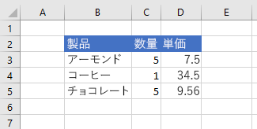

# <a name="work-with-ranges-using-the-excel-javascript-api"></a>Excel JavaScript API を使用して範囲を操作する

この記事では、Excel の JavaScript API を使用して範囲の共通のタスクを実行する方法を示すコード サンプルを提供します。**Range** オブジェクトでサポートされているプロパティとメソッドの完全なリストについては、「[Range オブジェクト (Excel の JavaScript API)](https://docs.microsoft.com/javascript/api/excel/excel.range)」をご覧ください。

## <a name="get-a-range"></a>範囲を取得する

次の例では、ワークシート内の範囲への参照を取得するさまざまな方法を示しています。

### <a name="get-range-by-address"></a>アドレスによって範囲を取得する

次のコード サンプルでは、**Sample** という名前のワークシートからアドレス **B2:B5** の範囲を取得し、その **address** プロパティを読み込んで、コンソールにメッセージを書き込みます。

```js
Excel.run(function (context) {
    var sheet = context.workbook.worksheets.getItem("Sample");
    var range = sheet.getRange("B2:C5");
    range.load("address");

    return context.sync()
        .then(function () {
            console.log(`The address of the range B2:C5 is "${range.address}"`);
        });
}).catch(errorHandlerFunction);
```

### <a name="get-range-by-name"></a>名前によって範囲を取得する

次のコード サンプルでは、**Sample** という名前のワークシートから **MyRange** という名前の範囲を取得し、その **address** プロパティを読み込んで、コンソールにメッセージを書き込みます。

```js
Excel.run(function (context) {
    var sheet = context.workbook.worksheets.getItem("Sample");
    var range = sheet.getRange("MyRange");
    range.load("address");

    return context.sync()
        .then(function () {
            console.log(`The address of the range "MyRange" is "${range.address}"`);
        });
}).catch(errorHandlerFunction);
```

### <a name="get-used-range"></a>使用範囲を取得する

次のコード サンプルでは、**Sample** という名前のワークシートから使用済みの範囲を取得し、その **address** プロパティを読み込んで、コンソールにメッセージを書き込みます。使用済みの範囲とは、値または書式が割り当てられているワークシート内の任意のセルを含む最小の範囲です。ワークシート全体が空白の場合、**getUsedRange()** メソッドは、ワークシートの左上のセルのみで構成される範囲を返します。

```js
Excel.run(function (context) {
    var sheet = context.workbook.worksheets.getItem("Sample");
    var range = sheet.getUsedRange();
    range.load("address");

    return context.sync()
        .then(function () {
            console.log(`The address of the used range in the worksheet is "${range.address}"`);
        });
}).catch(errorHandlerFunction);
```

### <a name="get-entire-range"></a>範囲全体を取得する

次のコード サンプルでは、**Sample** という名前のワークシートからワークシート全体の範囲を取得し、その **address** プロパティを読み込んで、コンソールにメッセージを書き込みます。

```js
Excel.run(function (context) {
    var sheet = context.workbook.worksheets.getItem("Sample");
    var range = sheet.getRange();
    range.load("address");

    return context.sync()
        .then(function () {
            console.log(`The address of the entire worksheet range is "${range.address}"`);
        });
}).catch(errorHandlerFunction);
```

## <a name="insert-a-range-of-cells"></a>セルの範囲を挿入する

次のコードサンプルは、場所 **B4:E4** にセルの範囲を挿入し、新しいセルのためのスペースを確保するために他のセルを下にシフトします。

```js
Excel.run(function (context) {
    var sheet = context.workbook.worksheets.getItem("Sample");
    var range = sheet.getRange("B4:E4");

    range.insert(Excel.InsertShiftDirection.down);
    
    return context.sync();
}).catch(errorHandlerFunction);
```

**範囲を挿入する前のデータ**


**範囲を挿入した後のデータ**


## <a name="clear-a-range-of-cells"></a>セルの範囲をクリアする

次のコード サンプルでは、範囲 **E2:E5** のセルの内容と書式をすべてクリアします。  

```js
Excel.run(function (context) {
    var sheet = context.workbook.worksheets.getItem("Sample");
    var range = sheet.getRange("E2:E5");

    range.clear();

    return context.sync();
}).catch(errorHandlerFunction);
```

**範囲をクリアする前のデータ**


**範囲をクリアした後のデータ**


## <a name="delete-a-range-of-cells"></a>セルの範囲を削除する

次のコード サンプルでは、範囲 **B4:E4** のセルを削除し、他のセルを上にシフトして、削除されたセルによって空いたスペースを充填します。

```js
Excel.run(function (context) {
    var sheet = context.workbook.worksheets.getItem("Sample");
    var range = sheet.getRange("B4:E4");

    range.delete(Excel.DeleteShiftDirection.up);

    return context.sync();
}).catch(errorHandlerFunction);
```

**範囲を削除する前のデータ**


**範囲を削除した後のデータ**


## <a name="set-the-selected-range"></a>選択範囲を設定する

次のコード サンプルでは、作業中のワークシートの範囲 **B2:E6** を選択します。

```js
Excel.run(function (context) {
    var sheet = context.workbook.worksheets.getActiveWorksheet();
    var range = sheet.getRange("B2:E6");

    range.select();

    return context.sync();
}).catch(errorHandlerFunction);
```

**選択範囲 B2:E6**


## <a name="get-the-selected-range"></a>選択範囲を取得する

次のコード サンプルでは、選択範囲を取得し、その **address** プロパティを読み込んで、コンソールにメッセージを書き込みます。 

```js
Excel.run(function (context) {
    var range = context.workbook.getSelectedRange();
    range.load("address");

    return context.sync()
        .then(function () {
            console.log(`The address of the selected range is "${range.address}"`);
        });
}).catch(errorHandlerFunction);
```

## <a name="set-values-or-formulas"></a>値または数式を設定する

次の例は、1 つのセルまたはセルの範囲の値と数式を設定する方法を示しています。

### <a name="set-value-for-a-single-cell"></a>1 つのセルの値を設定する

次のコード サンプルでは、セル **C3** の値を "5" に設定し、データに最も適した列の幅を設定します。

```js
Excel.run(function (context) {
    var sheet = context.workbook.worksheets.getItem("Sample");

    var range = sheet.getRange("C3");
    range.values = [[ 5 ]];
    range.format.autofitColumns();

    return context.sync();
}).catch(errorHandlerFunction);
```

**セルの値が更新される前のデータ**


**セルの値が更新された後のデータ**



### <a name="set-values-for-a-range-of-cells"></a>複数のセルの範囲の値を設定する

次のコード サンプルでは、範囲 **B5:D5** のセルの値を設定し、データに最も適した列の幅を設定します。

```js
Excel.run(function (context) {
    var sheet = context.workbook.worksheets.getItem("Sample");

    var data = [
        ["Potato Chips", 10, 1.80],
    ];
    
    var range = sheet.getRange("B5:D5");
    range.values = data;
    range.format.autofitColumns();

    return context.sync();
}).catch(errorHandlerFunction);
```

**複数のセルの値が更新される前のデータ**


**複数のセルの値が更新された後のデータ**


### <a name="set-formula-for-a-single-cell"></a>1 つのセルの数式を設定する

次のコード サンプルでは、セル **E3** の数式を設定し、データに最も適した列の幅を設定します。

```js
Excel.run(function (context) {
    var sheet = context.workbook.worksheets.getItem("Sample");

    var range = sheet.getRange("E3");
    range.formulas = [[ "=C3 * D3" ]];
    range.format.autofitColumns();

    return context.sync();
}).catch(errorHandlerFunction);
```

**セルの数式が設定される前のデータ**


**セルの数式が設定された後のデータ**


### <a name="set-formulas-for-a-range-of-cells"></a>複数のセルの範囲の数式を設定する

次のコード サンプルでは、範囲 **E2:E6** のセルの数式を設定し、データに最も適した列の幅を設定します。

```js
Excel.run(function (context) {
    var sheet = context.workbook.worksheets.getItem("Sample");

    var data = [
        ["=C3 * D3"],
        ["=C4 * D4"],
        ["=C5 * D5"],
        ["=SUM(E3:E5)"]
    ];
    
    var range = sheet.getRange("E3:E6");
    range.formulas = data;
    range.format.autofitColumns();

    return context.sync();
}).catch(errorHandlerFunction);
```

**複数のセルの数式が設定される前のデータ**


**複数のセルの数式が設定された後のデータ**


## <a name="get-values-text-or-formulas"></a>値、テキスト、または数式を取得する

次の例は、セルの範囲から値、テキスト、および数式を取得する方法を示しています。

### <a name="get-values-from-a-range-of-cells"></a>セルの範囲から値を取得する

次のコード サンプルでは、範囲 **B2:E6**を取得し、その  **values** プロパティを読み込み、その値をコンソールに書き込みます。範囲の **values** プロパティは、セルに含まれている生の値を指定します。範囲内のいくつかのセルに数式が含まれている場合でも、範囲の **values** プロパティは数式ではなく、それらのセルの生の値を指定します。

```js
Excel.run(function (context) {
    var sheet = context.workbook.worksheets.getItem("Sample");
    var range = sheet.getRange("B2:E6");
    range.load("values");

    return context.sync()
        .then(function () {
            console.log(JSON.stringify(range.values, null, 4));
        });
}).catch(errorHandlerFunction);
```

**範囲内のデータ (列 E の値は数式の結果)**


**range.values (上のコード サンプルによりコンソールに記録される)**

```json
[
    [
        "Product",
        "Qty",
        "Unit Price",
        "Total Price"
    ],
    [
        "Almonds",
        2,
        7.5,
        15
    ],
    [
        "Coffee",
        1,
        34.5,
        34.5
    ],
    [
        "Chocolate",
        5,
        9.56,
        47.8
    ],
    [
        "",
        "",
        "",
        97.3
    ]
]
```

### <a name="get-text-from-a-range-of-cells"></a>セルの範囲からテキストを取得する

次のコード サンプルでは、範囲 **B2:E6** を取得し、その **text** プロパティを読み込んで、コンソールに書き込みます。範囲の **text** プロパティは、範囲内のセルの表示値を指定します。範囲内のいくつかのセルに数式が含まれている場合でも、範囲の **text** プロパティは数式ではなく、それらのセルの表示値を指定します。

```js
Excel.run(function (context) {
    var sheet = context.workbook.worksheets.getItem("Sample");
    var range = sheet.getRange("B2:E6");
    range.load("text");

    return context.sync()
        .then(function () {
            console.log(JSON.stringify(range.text, null, 4));
        });
}).catch(errorHandlerFunction);
```

**範囲内のデータ (列 E の値は数式の結果)**


**range.text (上のコード サンプルによりコンソールに記録される)**

```json
[
    [
        "Product",
        "Qty",
        "Unit Price",
        "Total Price"
    ],
    [
        "Almonds",
        "2",
        "7.5",
        "15"
    ],
    [
        "Coffee",
        "1",
        "34.5",
        "34.5"
    ],
    [
        "Chocolate",
        "5",
        "9.56",
        "47.8"
    ],
    [
        "",
        "",
        "",
        "97.3"
    ]
]
```

### <a name="get-formulas-from-a-range-of-cells"></a>セルの範囲から数式を取得する

次のコード例では、範囲 **B2:E6** を取得し、その **formulas** プロパティを読み込んで、コンソールに書き込みます。範囲の **formulas** プロパティは、数式が含まれている範囲内のセルの数式と、数式が含まれていない範囲内のセルの生の値を指定します。

```js
Excel.run(function (context) {
    var sheet = context.workbook.worksheets.getItem("Sample");
    var range = sheet.getRange("B2:E6");
    range.load("formulas");

    return context.sync()
        .then(function () {
            console.log(JSON.stringify(range.formulas, null, 4));
        });
}).catch(errorHandlerFunction);
```

**範囲内のデータ (列 E の値は数式の結果)**


**range.formulas (上のコード サンプルによりコンソールに記録される)**

```json
[
    [
        "Product",
        "Qty",
        "Unit Price",
        "Total Price"
    ],
    [
        "Almonds",
        2,
        7.5,
        "=C3 * D3"
    ],
    [
        "Coffee",
        1,
        34.5,
        "=C4 * D4"
    ],
    [
        "Chocolate",
        5,
        9.56,
        "=C5 * D5"
    ],
    [
        "",
        "",
        "",
        "=SUM(E3:E5)"
    ]
]
```

## <a name="set-range-format"></a>範囲の書式を設定する

次の例は、範囲内のセルのフォントの色、塗りつぶしの色、および数値の書式を設定する方法を示します。

### <a name="set-font-color-and-fill-color"></a>フォントの色と塗りつぶしの色を設定する

次のコード サンプルでは、範囲 **B2:E2** のセルのフォントの色と塗りつぶしの色を設定します。

```js
Excel.run(function (context) {
    var sheet = context.workbook.worksheets.getItem("Sample");

    var range = sheet.getRange("B2:E2");
    range.format.fill.color = "#4472C4";;
    range.format.font.color = "white";

    return context.sync();
}).catch(errorHandlerFunction);
```

**フォントの色と塗りつぶしの色を設定する前の範囲内のデータ**


**フォントの色と塗りつぶしの色を設定した後の範囲内のデータ**


### <a name="set-number-format"></a>数値の書式を設定する

次のコード サンプルでは、範囲 **D3:E5** のセルの数値を書式を設定します。

```js
Excel.run(function (context) {
    var sheet = context.workbook.worksheets.getItem("Sample");

    var formats = [
        ["0.00", "0.00"],
        ["0.00", "0.00"],
        ["0.00", "0.00"]
    ];

    var range = sheet.getRange("D3:E5");
    range.numberFormat = formats;

    return context.sync();
}).catch(errorHandlerFunction);
```

**数値の書式を設定する前の範囲内のデータ**


**数値の書式を設定した後の範囲内のデータ**


## <a name="copy-and-paste"></a>コピーと貼り付け

> [!NOTE]
> CopyFrom 関数は現在、パブリック プレビュー (ベータ版) でのみ使用可能です。この機能を使用するには、Office.js CDN のベータ版のライブラリを使用する必要があります: https://appsforoffice.microsoft.com/lib/beta/hosted/office.js。TypeScript を使用している場合、またはコード エディターで IntelliSense 用の TypeScript 型定義ファイルを使用している場合は、https://appsforoffice.microsoft.com/lib/beta/hosted/office.d.ts を使用してください。

範囲の copyFrom 関数は、Excel の UI のコピーと貼り付けの動作と同じ動作をします。copyFrom が呼び出された範囲オブジェクトがコピー先です。コピー元のソースは、範囲、または範囲を表す文字列のアドレスとして渡されます。次のコード サンプルでは、**A1:E1** からデータを **G1** で始まる範囲にコピーします (これは **G1:K1** への貼り付けとなります)。

```js
Excel.run(function (context) {
    var sheet = context.workbook.worksheets.getItem("Sample");
    // copy a range starting at a single cell destination
    sheet.getRange("G1").copyFrom("A1:E1");
    return context.sync();
}).catch(errorHandlerFunction);
```

Range.copyFrom には、次の 3 つの省略可能なパラメーターがあります。

```ts
copyFrom(sourceRange: Range | string, copyType?: "All" | "Formulas" | "Values" | "Formats", skipBlanks?: boolean, transpose?: boolean): void;
``` 

`copyType` はコピー元からコピー先へコピーするデータを指定します。`“Formulas”` はコピー元のセル内の数式を移動し、それらの数式の範囲の相対的な位置を保存します。数式でない内容はそのままコピーされます。`“Values”` はデータの値をコピーしますが、数式の場合は数式の結果をコピーします。`“Formats”` はフォント、色、その他の書式設定を含めた範囲の書式をコピーしますが、値はコピーしません。`”All”` (規定の選択肢) はデータと書式の両方をコピーし、セルに数式がある場合はそれを保存します。

`skipBlanks` は空白のセルをコピー先にコピーするかどうかを設定します。True の場合、`copyFrom` はコピー元範囲内の空白のセルをスキップします。スキップしたセルは、コピー先範囲内の対応するセルの既存のデータに上書きされることはありません。既定では false です。

次のコード サンプルとイメージは、簡単なシナリオでのこの動作を示しています。 

```js
Excel.run(function (context) {
    var sheet = context.workbook.worksheets.getItem("Sample");
    // copy a range, omitting the blank cells so existing data is not overwritten in those cells
    sheet.getRange("D1").copyFrom("A1:C1",
        Excel.RangeCopyType.all,
        true, // skipBlanks
        false); // transpose
    // copy a range, including the blank cells which will overwrite existing data in the target cells
    sheet.getRange("D2").copyFrom("A2:C2",
        Excel.RangeCopyType.all,
        false, // skipBlanks
        false); // transpose
    return context.sync();
}).catch(errorHandlerFunction);
```

*前出の関数を実行する前。*


*前出の関数を実行した後。*


`transpose` はデータが転置されているかどうか、すなわち行と列が交換されているかどうかを決定します。転置された範囲は主な対角線に沿って反転し、行 **1**、**2**、および **3** は列 **A**、**B**、および **C** になります。 


## <a name="see-also"></a>関連項目

- [Excel の JavaScript API を使用した基本的なプログラミングの概念](excel-add-ins-core-concepts.md)

