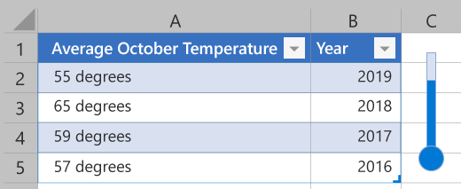

# <a name="work-with-shapes-using-the-excel-javascript-api"></a><span data-ttu-id="01b3e-103">JavaScript API を使用して図形Excelする</span><span class="sxs-lookup"><span data-stu-id="01b3e-103">Work with shapes using the Excel JavaScript API</span></span>

<span data-ttu-id="01b3e-104">Excel図形は、図形の描画レイヤーに配置されるオブジェクトとして定義Excel。</span><span class="sxs-lookup"><span data-stu-id="01b3e-104">Excel defines shapes as any object that sits on the drawing layer of Excel.</span></span> <span data-ttu-id="01b3e-105">つまり、セルの外側にあるものは図形です。</span><span class="sxs-lookup"><span data-stu-id="01b3e-105">That means anything outside of a cell is a shape.</span></span> <span data-ttu-id="01b3e-106">この記事では、図形および[ShapeCollection](/javascript/api/excel/excel.shapecollection) API と組み合[](/javascript/api/excel/excel.shape)わせて幾何学的図形、線、および画像を使用する方法について説明します。</span><span class="sxs-lookup"><span data-stu-id="01b3e-106">This article describes how to use geometric shapes, lines, and images in conjunction with the [Shape](/javascript/api/excel/excel.shape) and [ShapeCollection](/javascript/api/excel/excel.shapecollection) APIs.</span></span> <span data-ttu-id="01b3e-107">[グラフ](/javascript/api/excel/excel.chart)については、独自の記事[「JavaScript API](excel-add-ins-charts.md)を使用してグラフをExcelします。</span><span class="sxs-lookup"><span data-stu-id="01b3e-107">[Charts](/javascript/api/excel/excel.chart) are covered in their own article, [Work with charts using the Excel JavaScript API](excel-add-ins-charts.md).</span></span>

<span data-ttu-id="01b3e-108">次の図は、体温計を形成する図形を示しています。</span><span class="sxs-lookup"><span data-stu-id="01b3e-108">The following image shows shapes which form a thermometer.</span></span>
<span data-ttu-id="01b3e-109"></span><span class="sxs-lookup"><span data-stu-id="01b3e-109"></span></span>

## <a name="create-shapes"></a><span data-ttu-id="01b3e-110">図形を作成する</span><span class="sxs-lookup"><span data-stu-id="01b3e-110">Create shapes</span></span>

<span data-ttu-id="01b3e-111">図形は、ワークシートの図形コレクション () を通じて作成され、格納されます `Worksheet.shapes` 。</span><span class="sxs-lookup"><span data-stu-id="01b3e-111">Shapes are created through and stored in a worksheet's shape collection (`Worksheet.shapes`).</span></span> <span data-ttu-id="01b3e-112">`ShapeCollection` この目的 `.add*` のためにいくつかのメソッドがあります。</span><span class="sxs-lookup"><span data-stu-id="01b3e-112">`ShapeCollection` has several `.add*` methods for this purpose.</span></span> <span data-ttu-id="01b3e-113">すべての図形には、コレクションに追加するときに名前と ID が生成されます。</span><span class="sxs-lookup"><span data-stu-id="01b3e-113">All shapes have names and IDs generated for them when they are added to the collection.</span></span> <span data-ttu-id="01b3e-114">これらは、それぞれ `name` プロパティ `id` とプロパティです。</span><span class="sxs-lookup"><span data-stu-id="01b3e-114">These are the `name` and `id` properties, respectively.</span></span> <span data-ttu-id="01b3e-115">`name` メソッドを使用して簡単に取得できるようアドインで設定 `ShapeCollection.getItem(name)` できます。</span><span class="sxs-lookup"><span data-stu-id="01b3e-115">`name` can be set by your add-in for easy retrieval with the `ShapeCollection.getItem(name)` method.</span></span>

<span data-ttu-id="01b3e-116">次の種類の図形は、関連付けられたメソッドを使用して追加されます。</span><span class="sxs-lookup"><span data-stu-id="01b3e-116">The following types of shapes are added using the associated method.</span></span>

| <span data-ttu-id="01b3e-117">Shape</span><span class="sxs-lookup"><span data-stu-id="01b3e-117">Shape</span></span> | <span data-ttu-id="01b3e-118">Tabs.Add メソッド (Outlook フォーム スクリプト)</span><span class="sxs-lookup"><span data-stu-id="01b3e-118">Add Method</span></span> | <span data-ttu-id="01b3e-119">署名</span><span class="sxs-lookup"><span data-stu-id="01b3e-119">Signature</span></span> |
|-------|------------|-----------|
| <span data-ttu-id="01b3e-120">ジオメトリック シェイプ</span><span class="sxs-lookup"><span data-stu-id="01b3e-120">Geometric Shape</span></span> | [<span data-ttu-id="01b3e-121">addGeometricShape</span><span class="sxs-lookup"><span data-stu-id="01b3e-121">addGeometricShape</span></span>](/javascript/api/excel/excel.shapecollection#addgeometricshape-geometricshapetype-) | `addGeometricShape(geometricShapeType: Excel.GeometricShapeType): Excel.Shape` |
| <span data-ttu-id="01b3e-122">画像 (JPEG または PNG)</span><span class="sxs-lookup"><span data-stu-id="01b3e-122">Image (either JPEG or PNG)</span></span> | [<span data-ttu-id="01b3e-123">addImage</span><span class="sxs-lookup"><span data-stu-id="01b3e-123">addImage</span></span>](/javascript/api/excel/excel.shapecollection#addimage-base64imagestring-) | `addImage(base64ImageString: string): Excel.Shape` |
| <span data-ttu-id="01b3e-124">Line</span><span class="sxs-lookup"><span data-stu-id="01b3e-124">Line</span></span> | [<span data-ttu-id="01b3e-125">addLine</span><span class="sxs-lookup"><span data-stu-id="01b3e-125">addLine</span></span>](/javascript/api/excel/excel.shapecollection#addline-startleft--starttop--endleft--endtop--connectortype-) | `addLine(startLeft: number, startTop: number, endLeft: number, endTop: number, connectorType?: Excel.ConnectorType): Excel.Shape` |
| <span data-ttu-id="01b3e-126">SVG</span><span class="sxs-lookup"><span data-stu-id="01b3e-126">SVG</span></span> | [<span data-ttu-id="01b3e-127">addSvg</span><span class="sxs-lookup"><span data-stu-id="01b3e-127">addSvg</span></span>](/javascript/api/excel/excel.shapecollection#addsvg-xml-) | `addSvg(xml: string): Excel.Shape` |
| <span data-ttu-id="01b3e-128">テキスト ボックス</span><span class="sxs-lookup"><span data-stu-id="01b3e-128">Text Box</span></span> | [<span data-ttu-id="01b3e-129">addTextBox</span><span class="sxs-lookup"><span data-stu-id="01b3e-129">addTextBox</span></span>](/javascript/api/excel/excel.shapecollection#addtextbox-text-) | `addTextBox(text?: string): Excel.Shape` |

### <a name="geometric-shapes"></a><span data-ttu-id="01b3e-130">幾何学的図形</span><span class="sxs-lookup"><span data-stu-id="01b3e-130">Geometric shapes</span></span>

<span data-ttu-id="01b3e-131">で幾何学的な図形が作成されます `ShapeCollection.addGeometricShape` 。</span><span class="sxs-lookup"><span data-stu-id="01b3e-131">A geometric shape is created with `ShapeCollection.addGeometricShape`.</span></span> <span data-ttu-id="01b3e-132">このメソッドは、 [引数として GeometricShapeType](/javascript/api/excel/excel.geometricshapetype) 列挙型を受け取ります。</span><span class="sxs-lookup"><span data-stu-id="01b3e-132">That method takes a [GeometricShapeType](/javascript/api/excel/excel.geometricshapetype) enum as an argument.</span></span>

<span data-ttu-id="01b3e-133">次のコード サンプルでは、ワークシートの上辺と左側から 100 ピクセルの位置にある **"Square"** という名前の 150x150 ピクセルの四角形を作成します。</span><span class="sxs-lookup"><span data-stu-id="01b3e-133">The following code sample creates a 150x150-pixel rectangle named **"Square"** that is positioned 100 pixels from the top and left sides of the worksheet.</span></span>

```js
// This sample creates a rectangle positioned 100 pixels from the top and left sides
// of the worksheet and is 150x150 pixels.
Excel.run(function (context) {
    var shapes = context.workbook.worksheets.getItem("MyWorksheet").shapes;
    var rectangle = shapes.addGeometricShape(Excel.GeometricShapeType.rectangle);
    rectangle.left = 100;
    rectangle.top = 100;
    rectangle.height = 150;
    rectangle.width = 150;
    rectangle.name = "Square";
    return context.sync();
}).catch(errorHandlerFunction);
```

### <a name="images"></a><span data-ttu-id="01b3e-134">画像</span><span class="sxs-lookup"><span data-stu-id="01b3e-134">Images</span></span>

<span data-ttu-id="01b3e-135">JPEG、PNG、SVG 画像は、ワークシートに図形として挿入できます。</span><span class="sxs-lookup"><span data-stu-id="01b3e-135">JPEG, PNG, and SVG images can be inserted into a worksheet as shapes.</span></span> <span data-ttu-id="01b3e-136">メソッド `ShapeCollection.addImage` は引数として base64 でエンコードされた文字列を受け取ります。</span><span class="sxs-lookup"><span data-stu-id="01b3e-136">The `ShapeCollection.addImage` method takes a base64-encoded string as an argument.</span></span> <span data-ttu-id="01b3e-137">これは、文字列形式の JPEG または PNG イメージのいずれかです。</span><span class="sxs-lookup"><span data-stu-id="01b3e-137">This is either a JPEG or PNG image in string form.</span></span> <span data-ttu-id="01b3e-138">`ShapeCollection.addSvg` この引数はグラフィックを定義する XML ですが、文字列も取り込まれます。</span><span class="sxs-lookup"><span data-stu-id="01b3e-138">`ShapeCollection.addSvg` also takes in a string, though this argument is XML that defines the graphic.</span></span>

<span data-ttu-id="01b3e-139">次のコード サンプルは [、FileReader](https://developer.mozilla.org/docs/Web/API/FileReader) が文字列として読み込むイメージ ファイルを示しています。</span><span class="sxs-lookup"><span data-stu-id="01b3e-139">The following code sample shows an image file being loaded by a [FileReader](https://developer.mozilla.org/docs/Web/API/FileReader) as a string.</span></span> <span data-ttu-id="01b3e-140">この文字列には、図形が作成される前にメタデータ "base64" が削除されます。</span><span class="sxs-lookup"><span data-stu-id="01b3e-140">The string has the metadata "base64," removed before the shape is created.</span></span>

```js
// This sample creates an image as a Shape object in the worksheet.
var myFile = document.getElementById("selectedFile");
var reader = new FileReader();

reader.onload = (event) => {
    Excel.run(function (context) {
        var startIndex = reader.result.toString().indexOf("base64,");
        var myBase64 = reader.result.toString().substr(startIndex + 7);
        var sheet = context.workbook.worksheets.getItem("MyWorksheet");
        var image = sheet.shapes.addImage(myBase64);
        image.name = "Image";
        return context.sync();
    }).catch(errorHandlerFunction);
};

// Read in the image file as a data URL.
reader.readAsDataURL(myFile.files[0]);
```

### <a name="lines"></a><span data-ttu-id="01b3e-141">Lines</span><span class="sxs-lookup"><span data-stu-id="01b3e-141">Lines</span></span>

<span data-ttu-id="01b3e-142">行がで作成されます `ShapeCollection.addLine` 。</span><span class="sxs-lookup"><span data-stu-id="01b3e-142">A line is created with `ShapeCollection.addLine`.</span></span> <span data-ttu-id="01b3e-143">このメソッドには、行の開始点と終了点の左余白と上余白が必要です。</span><span class="sxs-lookup"><span data-stu-id="01b3e-143">That method needs the left and top margins of the line's start and end points.</span></span> <span data-ttu-id="01b3e-144">また [、ConnectorType 列挙型を使用](/javascript/api/excel/excel.connectortype) して、エンドポイント間の行のコントルト方法を指定します。</span><span class="sxs-lookup"><span data-stu-id="01b3e-144">It also takes a [ConnectorType](/javascript/api/excel/excel.connectortype) enum to specify how the line contorts between endpoints.</span></span> <span data-ttu-id="01b3e-145">次のコード サンプルでは、ワークシートに直線を作成します。</span><span class="sxs-lookup"><span data-stu-id="01b3e-145">The following code sample creates a straight line on the worksheet.</span></span>

```js
// This sample creates a straight line from [200,50] to [300,150] on the worksheet
Excel.run(function (context) {
    var shapes = context.workbook.worksheets.getItem("MyWorksheet").shapes;
    var line = shapes.addLine(200, 50, 300, 150, Excel.ConnectorType.straight);
    line.name = "StraightLine";
    return context.sync();
}).catch(errorHandlerFunction);
```

<span data-ttu-id="01b3e-146">線は他の Shape オブジェクトに接続できます。</span><span class="sxs-lookup"><span data-stu-id="01b3e-146">Lines can be connected to other Shape objects.</span></span> <span data-ttu-id="01b3e-147">and メソッドは、指定した接続ポイントの図形に線の開始位置と終了 `connectBeginShape` `connectEndShape` 位置をアタッチします。</span><span class="sxs-lookup"><span data-stu-id="01b3e-147">The `connectBeginShape` and `connectEndShape` methods attach the beginning and ending of a line to shapes at the specified connection points.</span></span> <span data-ttu-id="01b3e-148">これらのポイントの位置は図形によって異なりますが、アドインが境界外のポイントに接続しない場合に使用 `Shape.connectionSiteCount` できます。</span><span class="sxs-lookup"><span data-stu-id="01b3e-148">The locations of these points vary by shape, but the `Shape.connectionSiteCount` can be used to ensure your add-in does not connect to a point that's out-of-bounds.</span></span> <span data-ttu-id="01b3e-149">線は、and メソッドを使用して、接続されている図形 `disconnectBeginShape` から `disconnectEndShape` 切断されます。</span><span class="sxs-lookup"><span data-stu-id="01b3e-149">A line is disconnected from any attached shapes using the `disconnectBeginShape` and `disconnectEndShape` methods.</span></span>

<span data-ttu-id="01b3e-150">次のコード サンプルでは **、"MyLine"** 行を **"LeftShape" と "RightShape"** という名前の 2 つの図形 **に接続します**。</span><span class="sxs-lookup"><span data-stu-id="01b3e-150">The following code sample connects the **"MyLine"** line to two shapes named **"LeftShape"** and **"RightShape"**.</span></span>

```js
// This sample connects a line between two shapes at connection points '0' and '3'.
Excel.run(function (context) {
    var shapes = context.workbook.worksheets.getItem("MyWorksheet").shapes;
    var line = shapes.getItem("MyLine").line;
    line.connectBeginShape(shapes.getItem("LeftShape"), 0);
    line.connectEndShape(shapes.getItem("RightShape"), 3);
    return context.sync();
}).catch(errorHandlerFunction);
```

## <a name="move-and-resize-shapes"></a><span data-ttu-id="01b3e-151">図形の移動とサイズ変更</span><span class="sxs-lookup"><span data-stu-id="01b3e-151">Move and resize shapes</span></span>

<span data-ttu-id="01b3e-152">図形はワークシートの上に表示されます。</span><span class="sxs-lookup"><span data-stu-id="01b3e-152">Shapes sit on top of the worksheet.</span></span> <span data-ttu-id="01b3e-153">配置は and プロパティによって `left` 定義 `top` されます。</span><span class="sxs-lookup"><span data-stu-id="01b3e-153">Their placement is defined by the `left` and `top` property.</span></span> <span data-ttu-id="01b3e-154">これらはワークシートのそれぞれのエッジの余白として機能し、[0, 0] は左上隅になります。</span><span class="sxs-lookup"><span data-stu-id="01b3e-154">These act as margins from worksheet's respective edges, with [0, 0] being the upper-left corner.</span></span> <span data-ttu-id="01b3e-155">これらは、and メソッドを使用して、直接設定するか、現在の位置から `incrementLeft` `incrementTop` 調整できます。</span><span class="sxs-lookup"><span data-stu-id="01b3e-155">These can either be set directly or adjusted from their current position with the `incrementLeft` and `incrementTop` methods.</span></span> <span data-ttu-id="01b3e-156">既定の位置から回転する図形の量も、この方法で確立され、プロパティは絶対量であり、メソッドは既存の回転 `rotation` `incrementRotation` を調整します。</span><span class="sxs-lookup"><span data-stu-id="01b3e-156">How much a shape is rotated from the default position is also established in this manner, with the `rotation` property being the absolute amount and the `incrementRotation` method adjusting the existing rotation.</span></span>

<span data-ttu-id="01b3e-157">他の図形に対する図形の深さは、プロパティによって定義 `zorderPosition` されます。</span><span class="sxs-lookup"><span data-stu-id="01b3e-157">A shape's depth relative to other shapes is defined by the `zorderPosition` property.</span></span> <span data-ttu-id="01b3e-158">これは `setZOrder` [、ShapeZOrder](/javascript/api/excel/excel.shapezorder)を受け取るメソッドを使用して設定されます。</span><span class="sxs-lookup"><span data-stu-id="01b3e-158">This is set using the `setZOrder` method, which takes a [ShapeZOrder](/javascript/api/excel/excel.shapezorder).</span></span> <span data-ttu-id="01b3e-159">`setZOrder` 他の図形を基準に現在の図形の順序を調整します。</span><span class="sxs-lookup"><span data-stu-id="01b3e-159">`setZOrder` adjusts the ordering of the current shape relative to the other shapes.</span></span>

<span data-ttu-id="01b3e-160">アドインには、図形の高さと幅を変更するためのいくつかのオプションがあります。</span><span class="sxs-lookup"><span data-stu-id="01b3e-160">Your add-in has a couple options for changing the height and width of shapes.</span></span> <span data-ttu-id="01b3e-161">またはプロパティを `height` 設定 `width` すると、他のディメンションを変更せずに指定したディメンションが変更されます。</span><span class="sxs-lookup"><span data-stu-id="01b3e-161">Setting either the `height` or `width` property changes the specified dimension without changing the other dimension.</span></span> <span data-ttu-id="01b3e-162">現在のサイズまたは元のサイズ (指定された ShapeScaleType の値に基づいて) を基準に図形のそれぞれの寸法を `scaleHeight` `scaleWidth` [調整します](/javascript/api/excel/excel.shapescaletype)。</span><span class="sxs-lookup"><span data-stu-id="01b3e-162">The `scaleHeight` and `scaleWidth` adjust the shape's respective dimensions relative to either the current or original size (based on the value of the provided [ShapeScaleType](/javascript/api/excel/excel.shapescaletype)).</span></span> <span data-ttu-id="01b3e-163">省略可能 [な ShapeScaleFrom](/javascript/api/excel/excel.shapescalefrom) パラメーターは、図形のスケールの場所 (左上隅、中央、右下隅) を指定します。</span><span class="sxs-lookup"><span data-stu-id="01b3e-163">An optional [ShapeScaleFrom](/javascript/api/excel/excel.shapescalefrom) parameter specifies from where the shape scales (top-left corner, middle, or bottom-right corner).</span></span> <span data-ttu-id="01b3e-164">プロパティが true の場合、スケール メソッドは他の次元も調整することで、図形の現在の縦横比 `lockAspectRatio` を維持します。 </span><span class="sxs-lookup"><span data-stu-id="01b3e-164">If the `lockAspectRatio` property is **true**, the scale methods maintain the shape's current aspect ratio by also adjusting the other dimension.</span></span>

> [!NOTE]
> <span data-ttu-id="01b3e-165">プロパティへの直接の `height` 変更 `width` は、プロパティの値に関係なく、そのプロパティ `lockAspectRatio` にのみ影響します。</span><span class="sxs-lookup"><span data-stu-id="01b3e-165">Direct changes to the `height` and `width` properties only affect that property, regardless of the `lockAspectRatio` property's value.</span></span>

<span data-ttu-id="01b3e-166">次のコード サンプルは、元のサイズの 1.25 倍に拡大縮小され、30 度回転された図形を示しています。</span><span class="sxs-lookup"><span data-stu-id="01b3e-166">The following code sample shows a shape being scaled to 1.25 times its original size and rotated 30 degrees.</span></span>

```js
// In this sample, the shape "Octagon" is rotated 30 degrees clockwise
// and scaled 25% larger, with the upper-left corner remaining in place.
Excel.run(function (context) {
    var sheet = context.workbook.worksheets.getItem("MyWorksheet");
    var shape = sheet.shapes.getItem("Octagon");
    shape.incrementRotation(30);
    shape.lockAspectRatio = true;
    shape.scaleWidth(
        1.25,
        Excel.ShapeScaleType.currentSize,
        Excel.ShapeScaleFrom.scaleFromTopLeft);
    return context.sync();
}).catch(errorHandlerFunction);
```

## <a name="text-in-shapes"></a><span data-ttu-id="01b3e-167">図形内のテキスト</span><span class="sxs-lookup"><span data-stu-id="01b3e-167">Text in shapes</span></span>

<span data-ttu-id="01b3e-168">幾何学的図形にはテキストを含めできます。</span><span class="sxs-lookup"><span data-stu-id="01b3e-168">Geometric Shapes can contain text.</span></span> <span data-ttu-id="01b3e-169">図形には `textFrame` 、TextFrame 型の [プロパティがあります](/javascript/api/excel/excel.textframe)。</span><span class="sxs-lookup"><span data-stu-id="01b3e-169">Shapes have a `textFrame` property of type [TextFrame](/javascript/api/excel/excel.textframe).</span></span> <span data-ttu-id="01b3e-170">オブジェクト `TextFrame` は、テキスト表示オプション (余白やテキスト オーバーフローなど) を管理します。</span><span class="sxs-lookup"><span data-stu-id="01b3e-170">The `TextFrame` object manages the text display options (such as margins and text overflow).</span></span> <span data-ttu-id="01b3e-171">`TextFrame.textRange` は、 [テキストコンテンツと](/javascript/api/excel/excel.textrange) フォント設定を持つ TextRange オブジェクトです。</span><span class="sxs-lookup"><span data-stu-id="01b3e-171">`TextFrame.textRange` is a [TextRange](/javascript/api/excel/excel.textrange) object with the text content and font settings.</span></span>

<span data-ttu-id="01b3e-172">次のコード サンプルでは、"Shape Text" というテキストを持つ "Wave" という名前の幾何学的な図形を作成します。</span><span class="sxs-lookup"><span data-stu-id="01b3e-172">The following code sample creates a geometric shape named "Wave" with the text "Shape Text".</span></span> <span data-ttu-id="01b3e-173">また、図形とテキストの色を調整し、テキストの水平方向の配置を中央に設定します。</span><span class="sxs-lookup"><span data-stu-id="01b3e-173">It also adjusts the shape and text colors, as well as sets the text's horizontal alignment to the center.</span></span>

```js
// This sample creates a light-blue wave shape and adds the purple text "Shape text" to the center.
Excel.run(function (context) {
    var shapes = context.workbook.worksheets.getItem("MyWorksheet").shapes;
    var wave = shapes.addGeometricShape(Excel.GeometricShapeType.wave);
    wave.left = 100;
    wave.top = 400;
    wave.height = 50;
    wave.width = 150;
    wave.name = "Wave";
    wave.fill.setSolidColor("lightblue");
    wave.textFrame.textRange.text = "Shape text";
    wave.textFrame.textRange.font.color = "purple";
    wave.textFrame.horizontalAlignment = Excel.ShapeTextHorizontalAlignment.center;
    return context.sync();
}).catch(errorHandlerFunction);
```

<span data-ttu-id="01b3e-174">この `addTextBox` メソッドは `ShapeCollection` 、白い背景 `GeometricShape` と黒いテキスト `Rectangle` を持つ型を作成します。</span><span class="sxs-lookup"><span data-stu-id="01b3e-174">The `addTextBox` method of `ShapeCollection` creates a `GeometricShape` of type `Rectangle` with a white background and black text.</span></span> <span data-ttu-id="01b3e-175">これは、[挿入] タブの [テキスト Excel] ボタンによって作成される操作と **同** じです。 `addTextBox`のテキストを設定する引数 string を受け取ります `TextRange` 。</span><span class="sxs-lookup"><span data-stu-id="01b3e-175">This is the same as what is created by Excel's **Text Box** button on the **Insert** tab. `addTextBox` takes a string argument to set the text of the `TextRange`.</span></span>

<span data-ttu-id="01b3e-176">次のコード サンプルは、テキスト "Hello!" を含むテキスト ボックスの作成を示しています。</span><span class="sxs-lookup"><span data-stu-id="01b3e-176">The following code sample shows the creation of a text box with the text "Hello!".</span></span>

```js
// This sample creates a text box with the text "Hello!" and sizes it appropriately.
Excel.run(function (context) {
    var shapes = context.workbook.worksheets.getItem("MyWorksheet").shapes;
    var textbox = shapes.addTextBox("Hello!");
    textbox.left = 100;
    textbox.top = 100;
    textbox.height = 20;
    textbox.width = 45;
    textbox.name = "Textbox";
    return context.sync();
}).catch(errorHandlerFunction);
```

## <a name="shape-groups"></a><span data-ttu-id="01b3e-177">図形グループ</span><span class="sxs-lookup"><span data-stu-id="01b3e-177">Shape groups</span></span>

<span data-ttu-id="01b3e-178">図形はグループ化できます。</span><span class="sxs-lookup"><span data-stu-id="01b3e-178">Shapes can be grouped together.</span></span> <span data-ttu-id="01b3e-179">これにより、ユーザーはそれらを配置、サイズ変更、その他の関連タスク用の 1 つのエンティティとして扱うことができます。</span><span class="sxs-lookup"><span data-stu-id="01b3e-179">This allows a user to treat them as a single entity for positioning, sizing, and other related tasks.</span></span> <span data-ttu-id="01b3e-180">[ShapeGroup は](/javascript/api/excel/excel.shapegroup)タイプの 1 つなので、アドインはグループを 1 つの `Shape` 図形として扱います。</span><span class="sxs-lookup"><span data-stu-id="01b3e-180">A [ShapeGroup](/javascript/api/excel/excel.shapegroup) is a type of `Shape`, so your add-in treats the group as a single shape.</span></span>

<span data-ttu-id="01b3e-181">次のコード サンプルは、グループ化されている 3 つの図形を示しています。</span><span class="sxs-lookup"><span data-stu-id="01b3e-181">The following code sample shows three shapes being grouped together.</span></span> <span data-ttu-id="01b3e-182">以降のコード サンプルは、図形グループが右 50 ピクセルに移動されているのを示しています。</span><span class="sxs-lookup"><span data-stu-id="01b3e-182">The subsequent code sample shows that shape group being moved to the right 50 pixels.</span></span>

```js
// This sample takes three previously-created shapes ("Square", "Pentagon", and "Octagon")
// and groups them into a single ShapeGroup.
Excel.run(function (context) {
    var shapes = context.workbook.worksheets.getItem("MyWorksheet").shapes;
    var square = shapes.getItem("Square");
    var pentagon = shapes.getItem("Pentagon");
    var octagon = shapes.getItem("Octagon");

    var shapeGroup = shapes.addGroup([square, pentagon, octagon]);
    shapeGroup.name = "Group";
    console.log("Shapes grouped");

    return context.sync();
}).catch(errorHandlerFunction);

// This sample moves the previously created shape group to the right by 50 pixels.
Excel.run(function (context) {
    var shapes = context.workbook.worksheets.getItem("MyWorksheet").shapes;
    var shapeGroup = sheet.shapes.getItem("Group");
    shapeGroup.incrementLeft(50);
    return context.sync();
}).catch(errorHandlerFunction);
```

> [!IMPORTANT]
> <span data-ttu-id="01b3e-183">グループ内の個々の図形は `ShapeGroup.shapes` [、GroupShapeCollection](/javascript/api/excel/excel.GroupShapeCollection)型のプロパティを介して参照されます。</span><span class="sxs-lookup"><span data-stu-id="01b3e-183">Individual shapes within the group are referenced through the `ShapeGroup.shapes` property, which is of type [GroupShapeCollection](/javascript/api/excel/excel.GroupShapeCollection).</span></span> <span data-ttu-id="01b3e-184">グループ化された後、ワークシートの図形コレクションからアクセスできなくなりました。</span><span class="sxs-lookup"><span data-stu-id="01b3e-184">They are no longer accessible through the worksheet's shape collection after being grouped.</span></span> <span data-ttu-id="01b3e-185">たとえば、ワークシートに 3 つの図形が含み、すべての図形がグループ化されている場合、ワークシートのメソッドは `shapes.getCount` カウント 1 を返します。</span><span class="sxs-lookup"><span data-stu-id="01b3e-185">As an example, if your worksheet had three shapes and they were all grouped together, the worksheet's `shapes.getCount` method would return a count of 1.</span></span>

## <a name="export-shapes-as-images"></a><span data-ttu-id="01b3e-186">図形をイメージとしてエクスポートする</span><span class="sxs-lookup"><span data-stu-id="01b3e-186">Export shapes as images</span></span>

<span data-ttu-id="01b3e-187">任意 `Shape` のオブジェクトをイメージに変換できます。</span><span class="sxs-lookup"><span data-stu-id="01b3e-187">Any `Shape` object can be converted to an image.</span></span> <span data-ttu-id="01b3e-188">[Shape.getAsImage](/javascript/api/excel/excel.shape#getasimage-format-) は base64 エンコードされた文字列を返します。</span><span class="sxs-lookup"><span data-stu-id="01b3e-188">[Shape.getAsImage](/javascript/api/excel/excel.shape#getasimage-format-) returns base64-encoded string.</span></span> <span data-ttu-id="01b3e-189">イメージの形式は、に渡される [PictureFormat](/javascript/api/excel/excel.pictureformat) 列挙型として指定されます `getAsImage` 。</span><span class="sxs-lookup"><span data-stu-id="01b3e-189">The image's format is specified as a [PictureFormat](/javascript/api/excel/excel.pictureformat) enum passed to `getAsImage`.</span></span>

```js
Excel.run(function (context) {
    var shapes = context.workbook.worksheets.getItem("MyWorksheet").shapes;
    var shape = sheet.shapes.getItem("Image");
    var stringResult = shape.getAsImage(Excel.PictureFormat.png);

    return context.sync().then(function () {
        console.log(stringResult.value);
        // Instead of logging, your add-in may use the base64-encoded string to save the image as a file or insert it in HTML.
    });
}).catch(errorHandlerFunction);
```

## <a name="delete-shapes"></a><span data-ttu-id="01b3e-190">図形を削除する</span><span class="sxs-lookup"><span data-stu-id="01b3e-190">Delete shapes</span></span>

<span data-ttu-id="01b3e-191">図形は、オブジェクトのメソッドを使用して `Shape` ワークシートから削除 `delete` されます。</span><span class="sxs-lookup"><span data-stu-id="01b3e-191">Shapes are removed from the worksheet with the `Shape` object's `delete` method.</span></span> <span data-ttu-id="01b3e-192">他のメタデータは不要です。</span><span class="sxs-lookup"><span data-stu-id="01b3e-192">No other metadata is needed.</span></span>

<span data-ttu-id="01b3e-193">次のコード サンプルでは **、MyWorksheet** からすべての図形を削除します。</span><span class="sxs-lookup"><span data-stu-id="01b3e-193">The following code sample deletes all the shapes from **MyWorksheet**.</span></span>

```js
// This deletes all the shapes from "MyWorksheet".
Excel.run(function (context) {
    var sheet = context.workbook.worksheets.getItem("MyWorksheet");
    var shapes = sheet.shapes;

    // We'll load all the shapes in the collection without loading their properties.
    shapes.load("items/$none");
    return context.sync().then(function () {
        shapes.items.forEach(function (shape) {
            shape.delete()
        });
        return context.sync();
    }).catch(errorHandlerFunction);
}).catch(errorHandlerFunction);
```

## <a name="see-also"></a><span data-ttu-id="01b3e-194">関連項目</span><span class="sxs-lookup"><span data-stu-id="01b3e-194">See also</span></span>

- [<span data-ttu-id="01b3e-195">Excel JavaScript API を使用した基本的なプログラミングの概念</span><span class="sxs-lookup"><span data-stu-id="01b3e-195">Fundamental programming concepts with the Excel JavaScript API</span></span>](../reference/overview/excel-add-ins-reference-overview.md)
- [<span data-ttu-id="01b3e-196">Excel JavaScript API を使用してグラフを操作する</span><span class="sxs-lookup"><span data-stu-id="01b3e-196">Work with charts using the Excel JavaScript API</span></span>](excel-add-ins-charts.md)
