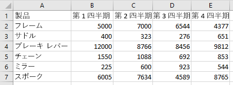

# <a name="work-with-tables-using-the-excel-javascript-api"></a><span data-ttu-id="9dc0f-102">Excel JavaScript API を使用して表を操作する</span><span class="sxs-lookup"><span data-stu-id="9dc0f-102">Work with tables using the Excel JavaScript API</span></span>

<span data-ttu-id="9dc0f-p101">この記事では、Excel JavaScript API を使用して、表に関する一般的なタスクを実行する方法を示すサンプル コードを提供します。 **Table** および **TableCollection** オブジェクトをサポートするプロパティとメソッドの完全なリストについては、「[Table オブジェクト (JavaScript API for Excel)](/javascript/api/excel/excel.table)」および「[TableCollection オブジェクト (JavaScript API for Excel)](/javascript/api/excel/excel.tablecollection)」を参照してください。</span><span class="sxs-lookup"><span data-stu-id="9dc0f-p101">This article provides code samples that show how to perform common tasks with tables using the Excel JavaScript API. For the complete list of properties and methods that the **Table** and **TableCollection** objects support, see [Table Object (JavaScript API for Excel)](/javascript/api/excel/excel.table) and [TableCollection Object (JavaScript API for Excel)](/javascript/api/excel/excel.tablecollection).</span></span>

## <a name="create-a-table"></a><span data-ttu-id="9dc0f-105">表を作成する</span><span class="sxs-lookup"><span data-stu-id="9dc0f-105">Create a table</span></span>

<span data-ttu-id="9dc0f-p102">次のコード サンプルでは、**Sample** というワークシートに表を作成します。 表にはヘッダーがあり、4 つの列と 7 つのデータ行が含まれています。 コードが実行されている Excel ホスト アプリケーションが[要件セット](/office/dev/add-ins/reference/requirement-sets/excel-api-requirement-sets) **ExcelApi 1.2** をサポートしている場合、列の幅と行の高さは表内の現在のデータに最適になるよう設定されます。</span><span class="sxs-lookup"><span data-stu-id="9dc0f-p102">The following code sample creates a table in the worksheet named **Sample**. The table has headers and contains four columns and seven rows of data. If the Excel host application where the code is running supports [requirement set](/office/dev/add-ins/reference/requirement-sets/excel-api-requirement-sets) **ExcelApi 1.2**, the width of the columns and height of the rows are set to best fit the current data in the table.</span></span>

> [!NOTE]
> <span data-ttu-id="9dc0f-109">表名を指定するには、次の例に示すように、最初に表を作成し、その **name** プロパティを設定します。</span><span class="sxs-lookup"><span data-stu-id="9dc0f-109">To specify a name for a table, you must first create the table and then set its **name** property, as shown in the example below.</span></span>

```js
Excel.run(function (context) {
    var sheet = context.workbook.worksheets.getItem("Sample");
    var expensesTable = sheet.tables.add("A1:D1", true /*hasHeaders*/);
    expensesTable.name = "ExpensesTable";

    expensesTable.getHeaderRowRange().values = [["Date", "Merchant", "Category", "Amount"]];

    expensesTable.rows.add(null /*add rows to the end of the table*/, [
        ["1/1/2017", "The Phone Company", "Communications", "$120"],
        ["1/2/2017", "Northwind Electric Cars", "Transportation", "$142"],
        ["1/5/2017", "Best For You Organics Company", "Groceries", "$27"],
        ["1/10/2017", "Coho Vineyard", "Restaurant", "$33"],
        ["1/11/2017", "Bellows College", "Education", "$350"],
        ["1/15/2017", "Trey Research", "Other", "$135"],
        ["1/15/2017", "Best For You Organics Company", "Groceries", "$97"]
    ]);

    if (Office.context.requirements.isSetSupported("ExcelApi", "1.2")) {
        sheet.getUsedRange().format.autofitColumns();
        sheet.getUsedRange().format.autofitRows();
    }

    sheet.activate();

    return context.sync();
}).catch(errorHandlerFunction);
```

<span data-ttu-id="9dc0f-110">**新しい表**</span><span class="sxs-lookup"><span data-stu-id="9dc0f-110">**New table**</span></span>


## <a name="add-rows-to-a-table"></a><span data-ttu-id="9dc0f-112">表に行を追加する</span><span class="sxs-lookup"><span data-stu-id="9dc0f-112">Add rows to a table</span></span>

<span data-ttu-id="9dc0f-p103">次のコード サンプルでは、**Sample** ワークシート内の **ExpensesTable** という表に 7 つの新しい行を追加します。 新しい行は表の末尾に追加されます。 コードが実行されている Excel ホスト アプリケーションが[要件セット](/office/dev/add-ins/reference/requirement-sets/excel-api-requirement-sets) **ExcelApi 1.2** をサポートしている場合、列の幅と行の高さは表内の現在のデータに最適になるよう設定されます。</span><span class="sxs-lookup"><span data-stu-id="9dc0f-p103">The following code sample adds seven new rows to the table named **ExpensesTable** within the worksheet named **Sample**. The new rows are added to the end of the table. If the Excel host application where the code is running supports [requirement set](/office/dev/add-ins/reference/requirement-sets/excel-api-requirement-sets) **ExcelApi 1.2**, the width of the columns and height of the rows are set to best fit the current data in the table.</span></span>

> [!NOTE]
> <span data-ttu-id="9dc0f-p104">**TableRow** オブジェクトの [index](/javascript/api/excel/excel.tablerow) プロパティは、表の行コレクション内の行のインデックス番号を示しています。 **TableRow** オブジェクトには、行を一意に識別できる **id** プロパティは含まれていません。</span><span class="sxs-lookup"><span data-stu-id="9dc0f-p104">The **index** property of a [TableRow](/javascript/api/excel/excel.tablerow) object indicates the index number of the row within the rows collection of the table. A **TableRow** object does not contain an **id** property that can be used as a unique key to identify the row.</span></span>

```js
Excel.run(function (context) {
    var sheet = context.workbook.worksheets.getItem("Sample");
    var expensesTable = sheet.tables.getItem("ExpensesTable");

    expensesTable.rows.add(null /*add rows to the end of the table*/, [
        ["1/16/2017", "THE PHONE COMPANY", "Communications", "$120"],
        ["1/20/2017", "NORTHWIND ELECTRIC CARS", "Transportation", "$142"],
        ["1/20/2017", "BEST FOR YOU ORGANICS COMPANY", "Groceries", "$27"],
        ["1/21/2017", "COHO VINEYARD", "Restaurant", "$33"],
        ["1/25/2017", "BELLOWS COLLEGE", "Education", "$350"],
        ["1/28/2017", "TREY RESEARCH", "Other", "$135"],
        ["1/31/2017", "BEST FOR YOU ORGANICS COMPANY", "Groceries", "$97"]
    ]);

    if (Office.context.requirements.isSetSupported("ExcelApi", 1.2)) {
        sheet.getUsedRange().format.autofitColumns();
        sheet.getUsedRange().format.autofitRows();
    }

    return context.sync();
}).catch(errorHandlerFunction);
```

<span data-ttu-id="9dc0f-118">**新しい行を含む表**</span><span class="sxs-lookup"><span data-stu-id="9dc0f-118">**Table with new rows**</span></span>


## <a name="add-a-column-to-a-table"></a><span data-ttu-id="9dc0f-120">表に列を追加する</span><span class="sxs-lookup"><span data-stu-id="9dc0f-120">Add a column to a table</span></span>

<span data-ttu-id="9dc0f-p105">以下の例では、表に列を追加する方法を示します。 最初の例では、新しい列に静的な値を作成し、2 番目の例では新しい列に数式を作成します。</span><span class="sxs-lookup"><span data-stu-id="9dc0f-p105">These examples show how to add a column to a table. The first example populates the new column with static values; the second example populates the new column with formulas.</span></span>

> [!NOTE]
> <span data-ttu-id="9dc0f-p106">**TableColumn** オブジェクトの [index](/javascript/api/excel/excel.tablecolumn) プロパティは、表の列コレクション内の列のインデックス番号を示しています。 **TableColumn** オブジェクトの **id** プロパティには、列を識別する一意のキーが含まれています。</span><span class="sxs-lookup"><span data-stu-id="9dc0f-p106">The **index** property of a [TableColumn](/javascript/api/excel/excel.tablecolumn) object indicates the index number of the column within the columns collection of the table. The **id** property of a **TableColumn** object contains a unique key that identifies the column.</span></span>

### <a name="add-a-column-that-contains-static-values"></a><span data-ttu-id="9dc0f-125">静的な値を含む列を追加する</span><span class="sxs-lookup"><span data-stu-id="9dc0f-125">Add a column that contains static values</span></span>

<span data-ttu-id="9dc0f-p107">次のコード サンプルでは、**Sample** ワークシート内の **ExpensesTable** という表に新しい列を追加します。 新しい列は、表内の既存の列すべての後に追加され、ヘッダー (「曜日」) を含み、列内のセルにデータが作成されます。 コードが実行されている Excel ホスト アプリケーションが[要件セット](/office/dev/add-ins/reference/requirement-sets/excel-api-requirement-sets) **ExcelApi 1.2** をサポートしている場合、列の幅と行の高さは表内の現在のデータに最適になるよう設定されます。</span><span class="sxs-lookup"><span data-stu-id="9dc0f-p107">The following code sample adds a new column to the table named **ExpensesTable** within the worksheet named **Sample**. The new column is added after all existing columns in the table and contains a header ("Day of the Week") as well as data to populate the cells in the column. If the Excel host application where the code is running supports [requirement set](/office/dev/add-ins/reference/requirement-sets/excel-api-requirement-sets) **ExcelApi 1.2**, the width of the columns and height of the rows are set to best fit the current data in the table.</span></span>

```js
Excel.run(function (context) {
    var sheet = context.workbook.worksheets.getItem("Sample");
    var expensesTable = sheet.tables.getItem("ExpensesTable");

    expensesTable.columns.add(null /*add columns to the end of the table*/, [
        ["Day of the Week"],
        ["Saturday"],
        ["Friday"],
        ["Monday"],
        ["Thursday"],
        ["Sunday"],
        ["Saturday"],
        ["Monday"]
    ]);

    if (Office.context.requirements.isSetSupported("ExcelApi", 1.2)) {
        sheet.getUsedRange().format.autofitColumns();
        sheet.getUsedRange().format.autofitRows();
    }

    return context.sync();
}).catch(errorHandlerFunction);
```

<span data-ttu-id="9dc0f-129">**新しい列を含む表**</span><span class="sxs-lookup"><span data-stu-id="9dc0f-129">**Table with new column**</span></span>


### <a name="add-a-column-that-contains-formulas"></a><span data-ttu-id="9dc0f-131">数式を含む列を追加する</span><span class="sxs-lookup"><span data-stu-id="9dc0f-131">Add a column that contains formulas</span></span>

<span data-ttu-id="9dc0f-p108">次のコード サンプルでは、**Sample** ワークシート内の **ExpensesTable** という表に新しい列を追加します。 新しい列は表の末尾に追加され、ヘッダー (「曜日」) を含み、数式を使用して列内のそれぞれのデータ セルを作成します。 コードが実行されている Excel ホスト アプリケーションが[要件セット](/office/dev/add-ins/reference/requirement-sets/excel-api-requirement-sets) **ExcelApi 1.2** をサポートしている場合、列の幅と行の高さは表内の現在のデータに最適になるよう設定されます。</span><span class="sxs-lookup"><span data-stu-id="9dc0f-p108">The following code sample adds a new column to the table named **ExpensesTable** within the worksheet named **Sample**. The new column is added to the end of the table, contains a header ("Type of the Day"), and uses a formula to populate each data cell in the column. If the Excel host application where the code is running supports [requirement set](/office/dev/add-ins/reference/requirement-sets/excel-api-requirement-sets) **ExcelApi 1.2**, the width of the columns and height of the rows are set to best fit the current data in the table.</span></span>

```js
Excel.run(function (context) {
    var sheet = context.workbook.worksheets.getItem("Sample");
    var expensesTable = sheet.tables.getItem("ExpensesTable");

    expensesTable.columns.add(null /*add columns to the end of the table*/, [
        ["Type of the Day"],
        ['=IF(OR((TEXT([DATE], "dddd") = "Saturday"), (TEXT([DATE], "dddd") = "Sunday")), "Weekend", "Weekday")'],
        ['=IF(OR((TEXT([DATE], "dddd") = "Saturday"), (TEXT([DATE], "dddd") = "Sunday")), "Weekend", "Weekday")'],
        ['=IF(OR((TEXT([DATE], "dddd") = "Saturday"), (TEXT([DATE], "dddd") = "Sunday")), "Weekend", "Weekday")'],
        ['=IF(OR((TEXT([DATE], "dddd") = "Saturday"), (TEXT([DATE], "dddd") = "Sunday")), "Weekend", "Weekday")'],
        ['=IF(OR((TEXT([DATE], "dddd") = "Saturday"), (TEXT([DATE], "dddd") = "Sunday")), "Weekend", "Weekday")'],
        ['=IF(OR((TEXT([DATE], "dddd") = "Saturday"), (TEXT([DATE], "dddd") = "Sunday")), "Weekend", "Weekday")'],
        ['=IF(OR((TEXT([DATE], "dddd") = "Saturday"), (TEXT([DATE], "dddd") = "Sunday")), "Weekend", "Weekday")']
    ]);

    if (Office.context.requirements.isSetSupported("ExcelApi", 1.2)) {
        sheet.getUsedRange().format.autofitColumns();
        sheet.getUsedRange().format.autofitRows();
    }

    return context.sync();
}).catch(errorHandlerFunction);
```

<span data-ttu-id="9dc0f-135">**新しい集計列を含む表**</span><span class="sxs-lookup"><span data-stu-id="9dc0f-135">**Table with new calculated column**</span></span>


## <a name="update-column-name"></a><span data-ttu-id="9dc0f-137">列名を更新する</span><span class="sxs-lookup"><span data-stu-id="9dc0f-137">Update column name</span></span>

<span data-ttu-id="9dc0f-p109">次のコード サンプルでは、表の最初の列の名前を **Purchase date** に更新します。コードが実行されている Excel ホスト アプリケーションが [要件セット](/office/dev/add-ins/reference/requirement-sets/excel-api-requirement-sets) **ExcelApi 1.2** をサポートしている場合、列の幅と行の高さは表内の現在のデータに最適になるよう設定されます。</span><span class="sxs-lookup"><span data-stu-id="9dc0f-p109">The following code sample updates the name of the first column in the table to **Purchase date**. If the Excel host application where the code is running supports [requirement set](/office/dev/add-ins/reference/requirement-sets/excel-api-requirement-sets) **ExcelApi 1.2**, the width of the columns and height of the rows are set to best fit the current data in the table.</span></span>

```js
Excel.run(function (context) {
    var sheet = context.workbook.worksheets.getItem("Sample");

    var expensesTable = sheet.tables.getItem("ExpensesTable");
    expensesTable.columns.load("items");

    return context.sync()
        .then(function () {
            expensesTable.columns.items[0].name = "Purchase date";

            if (Office.context.requirements.isSetSupported("ExcelApi", 1.2)) {
                sheet.getUsedRange().format.autofitColumns();
                sheet.getUsedRange().format.autofitRows();
            }

            return context.sync();
        });
}).catch(errorHandlerFunction);
```

<span data-ttu-id="9dc0f-140">**新しい列名を含む表**</span><span class="sxs-lookup"><span data-stu-id="9dc0f-140">**Table with new column name**</span></span>


## <a name="get-data-from-a-table"></a><span data-ttu-id="9dc0f-142">表からデータを取得する</span><span class="sxs-lookup"><span data-stu-id="9dc0f-142">Get data from a table</span></span>

<span data-ttu-id="9dc0f-143">次のコード サンプルでは、**Sample** ワークシートから **ExpensesTable** という表のデータを読み取り、そのデータを同じワークシートの表の下に出力します。</span><span class="sxs-lookup"><span data-stu-id="9dc0f-143">The following code sample reads data from a table named **ExpensesTable** in the worksheet named **Sample** and then outputs that data below the table in the same worksheet.</span></span>

```js
Excel.run(function (context) {
    var sheet = context.workbook.worksheets.getItem("Sample");
    var expensesTable = sheet.tables.getItem("ExpensesTable");

    // Get data from the header row
    var headerRange = expensesTable.getHeaderRowRange().load("values");

    // Get data from the table
    var bodyRange = expensesTable.getDataBodyRange().load("values");

    // Get data from a single column
    var columnRange = expensesTable.columns.getItem("Merchant").getDataBodyRange().load("values");

    // Get data from a single row
    var rowRange = expensesTable.rows.getItemAt(1).load("values");

    // Sync to populate proxy objects with data from Excel
    return context.sync()
        .then(function () {
            var headerValues = headerRange.values;
            var bodyValues = bodyRange.values;
            var merchantColumnValues = columnRange.values;
            var secondRowValues = rowRange.values;

            // Write data from table back to the sheet
            sheet.getRange("A11:A11").values = [["Results"]];
            sheet.getRange("A13:D13").values = headerValues;
            sheet.getRange("A14:D20").values = bodyValues;
            sheet.getRange("B23:B29").values = merchantColumnValues;
            sheet.getRange("A32:D32").values = secondRowValues;

            // Sync to update the sheet in Excel
            return context.sync();
        });
}).catch(errorHandlerFunction);
```

<span data-ttu-id="9dc0f-144">**表とデータの出力**</span><span class="sxs-lookup"><span data-stu-id="9dc0f-144">**Table and data output**</span></span>


## <a name="detect-data-changes"></a><span data-ttu-id="9dc0f-146">データの変更の検出</span><span class="sxs-lookup"><span data-stu-id="9dc0f-146">Detect data changes</span></span>

<span data-ttu-id="9dc0f-147">表のデータをユーザーが変更した場合に、アドインを使用して対応する必要がある場合があります。</span><span class="sxs-lookup"><span data-stu-id="9dc0f-147">Your add-in may need to react to users changing the data in a table.</span></span> <span data-ttu-id="9dc0f-148">そのような変更を検出するには、表の `onChanged` イベントについて[イベント ハンドラーを登録](excel-add-ins-events.md#register-an-event-handler)します。</span><span class="sxs-lookup"><span data-stu-id="9dc0f-148">To detect these changes, you can [register an event handler](excel-add-ins-events.md#register-an-event-handler) for the `onChanged` event of a table.</span></span> <span data-ttu-id="9dc0f-149">`onChanged`イベントのイベント ハンドラーは、そのイベントが発生した際に [TableChangedEventArgs](/javascript/api/excel/excel.tablechangedeventargs) オブジェクトを受け取ります。</span><span class="sxs-lookup"><span data-stu-id="9dc0f-149">Event handlers for the `onChanged` event receive a [TableChangedEventArgs](/javascript/api/excel/excel.tablechangedeventargs) object when the event fires.</span></span>

<span data-ttu-id="9dc0f-150">`TableChangedEventArgs` オブジェクトは、変更内容とソースに関する情報を提供します。</span><span class="sxs-lookup"><span data-stu-id="9dc0f-150">The `TableChangedEventArgs` object provides information about the changes and the source.</span></span> <span data-ttu-id="9dc0f-151">`onChanged` が発生するのは書式設定またはデータの値が変更された時であるため、値が実際に変更されたかどうかを確認するのにアドインを使用すると便利です。</span><span class="sxs-lookup"><span data-stu-id="9dc0f-151">Since `onChanged` fires when either the format or value of the data changes, it can be useful to have your add-in check if the values have actually changed.</span></span> <span data-ttu-id="9dc0f-152">`details`プロパティは、この情報を [ChangedEventDetail](/javascript/api/excel/excel.changedeventdetail) としてカプセル化します。</span><span class="sxs-lookup"><span data-stu-id="9dc0f-152">The `details` property encapsulates this information as a [ChangedEventDetail](/javascript/api/excel/excel.changedeventdetail).</span></span> <span data-ttu-id="9dc0f-153">次のコード サンプルでは、変更前と変更後の値および変更されたセルの種類を表示する方法を表示します。</span><span class="sxs-lookup"><span data-stu-id="9dc0f-153">The following code sample shows how to display the before and after values and types of a cell that has been changed.</span></span>

```js
// This function would be used as an event handler for the Table.onChanged event.
function onTableChanged(eventArgs) {
    Excel.run(function (context) {
        var details = eventArgs.details;
        var address = eventArgs.address;

        // Print the before and after types and values to the console.
        console.log(`Change at ${address}: was ${details.valueBefore}(${details.valueTypeBefore}),`
            + ` now is ${details.valueAfter}(${details.valueTypeAfter})`);
        return context.sync();
    });
}
```

## <a name="sort-data-in-a-table"></a><span data-ttu-id="9dc0f-154">表のデータを並べ替える</span><span class="sxs-lookup"><span data-stu-id="9dc0f-154">Sort data in a table</span></span>

<span data-ttu-id="9dc0f-155">次のコード サンプルでは、表の 4 番目の列の値に従って降順で表データを並べ替えます。</span><span class="sxs-lookup"><span data-stu-id="9dc0f-155">The following code sample sorts table data in descending order according to the values in the fourth column of the table.</span></span>

```js
Excel.run(function (context) {
    var sheet = context.workbook.worksheets.getItem("Sample");
    var expensesTable = sheet.tables.getItem("ExpensesTable");

    // Queue a command to sort data by the fourth column of the table (descending)
    var sortRange = expensesTable.getDataBodyRange();
    sortRange.sort.apply([
        {
            key: 3,
            ascending: false,
        },
    ]);

    // Sync to run the queued command in Excel
    return context.sync();
}).catch(errorHandlerFunction);
```

<span data-ttu-id="9dc0f-156">**金額 (降順) で並べ替えた表データ**</span><span class="sxs-lookup"><span data-stu-id="9dc0f-156">**Table data sorted by Amount (descending)**</span></span>


## <a name="apply-filters-to-a-table"></a><span data-ttu-id="9dc0f-158">表にフィルターを適用する</span><span class="sxs-lookup"><span data-stu-id="9dc0f-158">Apply filters to a table</span></span>

<span data-ttu-id="9dc0f-p112">次のコード サンプルでは、表内の **Amount** 列と **Category** 列にフィルターを適用しています。 フィルター処理の結果、**Category** が指定した値であり、**Amount** が表示されている行の平均値未満の行のみが表示されます。</span><span class="sxs-lookup"><span data-stu-id="9dc0f-p112">The following code sample applies filters to the **Amount** column and the **Category** column within a table. As a result of the filters, only rows where **Category** is one of the specified values and **Amount** is below the average value for all rows is shown.</span></span>

```js
Excel.run(function (context) {
    var sheet = context.workbook.worksheets.getItem("Sample");
    var expensesTable = sheet.tables.getItem("ExpensesTable");

    // Queue a command to apply a filter on the Category column
    filter = expensesTable.columns.getItem("Category").filter;
    filter.apply({
        filterOn: Excel.FilterOn.values,
        values: ["Restaurant", "Groceries"]
    });

    // Queue a command to apply a filter on the Amount column
    var filter = expensesTable.columns.getItem("Amount").filter;
    filter.apply({
        filterOn: Excel.FilterOn.dynamic,
        dynamicCriteria: Excel.DynamicFilterCriteria.belowAverage
    });

    // Sync to run the queued commands in Excel
    return context.sync();
}).catch(errorHandlerFunction);
```

<span data-ttu-id="9dc0f-161">**Category と Amount にフィルターを適用した表データ**</span><span class="sxs-lookup"><span data-stu-id="9dc0f-161">**Table data with filters applied for Category and Amount**</span></span>


## <a name="clear-table-filters"></a><span data-ttu-id="9dc0f-163">表フィルターのクリア</span><span class="sxs-lookup"><span data-stu-id="9dc0f-163">Clear table filters</span></span>

<span data-ttu-id="9dc0f-164">次のコード サンプルでは、表に現在適用されているフィルターをクリアします。</span><span class="sxs-lookup"><span data-stu-id="9dc0f-164">The following code sample clears any filters currently applied on the table.</span></span>

```js
Excel.run(function (context) {
    var sheet = context.workbook.worksheets.getItem("Sample");
    var expensesTable = sheet.tables.getItem("ExpensesTable");

    expensesTable.clearFilters();

    return context.sync();
}).catch(errorHandlerFunction);
```

<span data-ttu-id="9dc0f-165">**フィルターが適用されていない表データ**</span><span class="sxs-lookup"><span data-stu-id="9dc0f-165">**Table data with no filters applied**</span></span>


## <a name="get-the-visible-range-from-a-filtered-table"></a><span data-ttu-id="9dc0f-167">フィルター処理された表から、表示されている範囲を取得します。</span><span class="sxs-lookup"><span data-stu-id="9dc0f-167">Get the visible range from a filtered table</span></span>

<span data-ttu-id="9dc0f-p113">次のコード サンプルでは、指定した表内で現在表示されているセルのデータのみを含む範囲を取得し、その範囲の値をコンソールに書き込みます。 次に示すとおり、**getVisibleView()** メソッドを使用して、列フィルターが適用されているときに表に表示されるコンテンツを取得します。</span><span class="sxs-lookup"><span data-stu-id="9dc0f-p113">The following code sample gets a range that contains data only for cells that are currently visible within the specified table, and then writes the values of that range to the console. You can use the **getVisibleView()** method as shown below to get the visible contents of a table whenever column filters have been applied.</span></span>

```js
Excel.run(function (context) {
    var sheet = context.workbook.worksheets.getItem("Sample");
    var expensesTable = sheet.tables.getItem("ExpensesTable");

    var visibleRange = expensesTable.getDataBodyRange().getVisibleView();
    visibleRange.load("values");

    return context.sync()
        .then(function() {
            console.log(visibleRange.values);
        });
}).catch(errorHandlerFunction);
```

## <a name="autofilter"></a><span data-ttu-id="9dc0f-170">オートフィルター</span><span class="sxs-lookup"><span data-stu-id="9dc0f-170">AutoFilter</span></span>

<span data-ttu-id="9dc0f-171">アドインは、テーブルの[AutoFilter](/javascript/api/excel/excel.autofilter)オブジェクトを使用してデータをフィルタ処理できます。</span><span class="sxs-lookup"><span data-stu-id="9dc0f-171">An add-in can use the table's [AutoFilter](/javascript/api/excel/excel.autofilter) object to filter data.</span></span> <span data-ttu-id="9dc0f-172">`AutoFilter` オブジェクトは、テーブルまたは範囲のフィルタ構造全体です。</span><span class="sxs-lookup"><span data-stu-id="9dc0f-172">An `AutoFilter` object is the entire filter structure of a table or range.</span></span> <span data-ttu-id="9dc0f-173">この記事で前述したすべてのフィルター操作は、自動フィルターと互換性があります。</span><span class="sxs-lookup"><span data-stu-id="9dc0f-173">All of the filter operations discussed earlier in this article are compatible with the auto-filter.</span></span> <span data-ttu-id="9dc0f-174">単一のアクセスポイントにより、複数のフィルタへのアクセスと管理が簡単になります。</span><span class="sxs-lookup"><span data-stu-id="9dc0f-174">The single access point does make it easier to access and manage multiple filters.</span></span>

<span data-ttu-id="9dc0f-175">次のコードサンプルは、[前のコードサンプルと同じデータフィルタリング](#apply-filters-to-a-table)を示していますが、完全に自動フィルタを介して行われます。</span><span class="sxs-lookup"><span data-stu-id="9dc0f-175">The following code sample shows the same [data filtering as the earlier code sample](#apply-filters-to-a-table), but done entirely through the auto-filter.</span></span>

```js
Excel.run(function (context) {
    var sheet = context.workbook.worksheets.getItem("Sample");
    var expensesTable = sheet.tables.getItem("ExpensesTable");

    expensesTable.autoFilter.apply(expensesTable.getRange(), 2, {
        filterOn: Excel.FilterOn.values,
        values: ["Restaurant", "Groceries"]
    });
    expensesTable.autoFilter.apply(expensesTable.getRange(), 3, {
        filterOn: Excel.FilterOn.dynamic,
        dynamicCriteria: Excel.DynamicFilterCriteria.belowAverage
    });

    return context.sync();
}).catch(errorHandlerFunction);
```

<span data-ttu-id="9dc0f-176">`AutoFilter` は、ワークシートレベルでの範囲にも適用できます。</span><span class="sxs-lookup"><span data-stu-id="9dc0f-176">An `AutoFilter` can also be applied to a range at the worksheet level.</span></span> <span data-ttu-id="9dc0f-177">詳しくは、[Excel JavaScript APIを使用したワークシートの処理](excel-add-ins-worksheets.md#filter-data)を参照してください。</span><span class="sxs-lookup"><span data-stu-id="9dc0f-177">See [Work with worksheets using the Excel JavaScript API](excel-add-ins-worksheets.md#filter-data) for more information.</span></span>

## <a name="format-a-table"></a><span data-ttu-id="9dc0f-178">表を書式設定する</span><span class="sxs-lookup"><span data-stu-id="9dc0f-178">Format a table</span></span>

<span data-ttu-id="9dc0f-p116">次のコード サンプルでは、表に書式を適用します。 表のヘッダー行、表の本体、表の 2 行目、表の 1 列目にそれぞれ別の塗りつぶし色を指定します。 書式の指定に使用できるプロパティの詳細については、「[RangeFormat オブジェクト (JavaScript API for Excel)](/javascript/api/excel/excel.rangeformat)」を参照してください。</span><span class="sxs-lookup"><span data-stu-id="9dc0f-p116">The following code sample applies formatting to a table. It specifies different fill colors for the header row of the table, the body of the table, the second row of the table, and the first column of the table. For information about the properties you can use to specify format, see [RangeFormat Object (JavaScript API for Excel)](/javascript/api/excel/excel.rangeformat).</span></span>

```js
Excel.run(function (context) {
    var sheet = context.workbook.worksheets.getItem("Sample");
    var expensesTable = sheet.tables.getItem("ExpensesTable");

    expensesTable.getHeaderRowRange().format.fill.color = "#C70039";
    expensesTable.getDataBodyRange().format.fill.color = "#DAF7A6";
    expensesTable.rows.getItemAt(1).getRange().format.fill.color = "#FFC300";
    expensesTable.columns.getItemAt(0).getDataBodyRange().format.fill.color = "#FFA07A";

    return context.sync();
}).catch(errorHandlerFunction);
```

<span data-ttu-id="9dc0f-182">**書式設定を適用後の表**</span><span class="sxs-lookup"><span data-stu-id="9dc0f-182">**Table after formatting is applied**</span></span>


## <a name="convert-a-range-to-a-table"></a><span data-ttu-id="9dc0f-184">範囲を表に変換する</span><span class="sxs-lookup"><span data-stu-id="9dc0f-184">Convert a range to a table</span></span>

<span data-ttu-id="9dc0f-185">次のコード サンプルでは、データ範囲を作成し、その範囲を表に変換します。</span><span class="sxs-lookup"><span data-stu-id="9dc0f-185">The following code sample creates a range of data and then converts that range to a table.</span></span>

```js
Excel.run(function (context) {
    var sheet = context.workbook.worksheets.getItem("Sample");

    // Define values for the range
    var values = [["Product", "Qtr1", "Qtr2", "Qtr3", "Qtr4"],
    ["Frames", 5000, 7000, 6544, 4377],
    ["Saddles", 400, 323, 276, 651],
    ["Brake levers", 12000, 8766, 8456, 9812],
    ["Chains", 1550, 1088, 692, 853],
    ["Mirrors", 225, 600, 923, 544],
    ["Spokes", 6005, 7634, 4589, 8765]];

    // Create the range
    var range = sheet.getRange("A1:E7");
    range.values = values;

    if (Office.context.requirements.isSetSupported("ExcelApi", 1.2)) {
        sheet.getUsedRange().format.autofitColumns();
        sheet.getUsedRange().format.autofitRows();
    }

    sheet.activate();

    // Convert the range to a table
    var expensesTable = sheet.tables.add('A1:E7', true);
    expensesTable.name = "ExpensesTable";

    return context.sync();
}).catch(errorHandlerFunction);
```

<span data-ttu-id="9dc0f-186">**範囲データ (範囲を表に変換する前)**</span><span class="sxs-lookup"><span data-stu-id="9dc0f-186">**Data in the range (before the range is converted to a table)**</span></span>



<span data-ttu-id="9dc0f-188">**範囲データ (範囲を表に変換した後)**</span><span class="sxs-lookup"><span data-stu-id="9dc0f-188">**Data in the table (after the range is converted to a table)**</span></span>


## <a name="import-json-data-into-a-table"></a><span data-ttu-id="9dc0f-190">JSON データを表にインポートする</span><span class="sxs-lookup"><span data-stu-id="9dc0f-190">Import JSON data into a table</span></span>

<span data-ttu-id="9dc0f-p117">次のコード サンプルでは、**Sample** ワークシートに表を作成し、2 行のデータを定義する JSON オブジェクトを使用して表にデータを入力します。 コードが実行されている Excel ホスト アプリケーションが[要件セット](/office/dev/add-ins/reference/requirement-sets/excel-api-requirement-sets) **ExcelApi 1.2** をサポートしている場合、列の幅と行の高さは表内の現在のデータに最適になるよう設定されます。</span><span class="sxs-lookup"><span data-stu-id="9dc0f-p117">The following code sample creates a table in the worksheet named **Sample** and then populates the table by using a JSON object that defines two rows of data. If the Excel host application where the code is running supports [requirement set](/office/dev/add-ins/reference/requirement-sets/excel-api-requirement-sets) **ExcelApi 1.2**, the width of the columns and height of the rows are set to best fit the current data in the table.</span></span>

```js
Excel.run(function (context) {
    var sheet = context.workbook.worksheets.getItem("Sample");

    var expensesTable = sheet.tables.add("A1:D1", true /*hasHeaders*/);
    expensesTable.name = "ExpensesTable";
    expensesTable.getHeaderRowRange().values = [["Date", "Merchant", "Category", "Amount"]];

    var transactions = [
      {
        "DATE": "1/1/2017",
        "MERCHANT": "The Phone Company",
        "CATEGORY": "Communications",
        "AMOUNT": "$120"
      },
      {
        "DATE": "1/1/2017",
        "MERCHANT": "Southridge Video",
        "CATEGORY": "Entertainment",
        "AMOUNT": "$40"
      }
    ];

    var newData = transactions.map(item =>
        [item.DATE, item.MERCHANT, item.CATEGORY, item.AMOUNT]);

    expensesTable.rows.add(null, newData);

    if (Office.context.requirements.isSetSupported("ExcelApi", 1.2)) {
        sheet.getUsedRange().format.autofitColumns();
        sheet.getUsedRange().format.autofitRows();
    }

    sheet.activate();

    return context.sync();
}).catch(errorHandlerFunction);
```

<span data-ttu-id="9dc0f-193">**新しい表**</span><span class="sxs-lookup"><span data-stu-id="9dc0f-193">**New table**</span></span>


## <a name="see-also"></a><span data-ttu-id="9dc0f-195">関連項目</span><span class="sxs-lookup"><span data-stu-id="9dc0f-195">See also</span></span>

- [<span data-ttu-id="9dc0f-196">Excel JavaScript API を使用した基本的なプログラミングの概念</span><span class="sxs-lookup"><span data-stu-id="9dc0f-196">Fundamental programming concepts with the Excel JavaScript API</span></span>](excel-add-ins-core-concepts.md)
