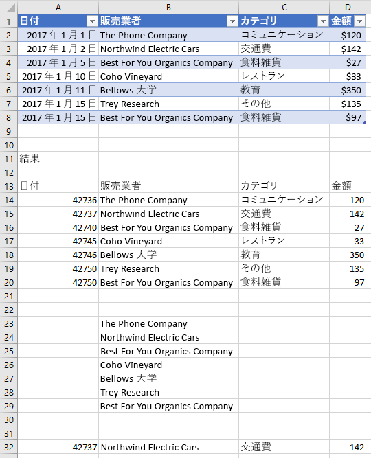
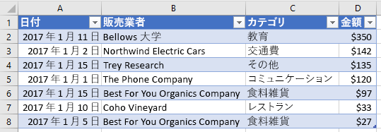

# <a name="work-with-tables-using-the-excel-javascript-api"></a>Excel JavaScript API を使用して表を操作する

この記事では、Excel JavaScript API を使用して、表に関する一般的なタスクを実行する方法を示すサンプル コードを提供します。 およびオブジェクトがサポートするプロパティとメソッドの完全な一覧につい `Table` `TableCollection` ては、「 [Table オブジェクト (Javascript api for excel)](/javascript/api/excel/excel.table) 」および「 [tablecollection オブジェクト (javascript api for excel)](/javascript/api/excel/excel.tablecollection)」を参照してください。

## <a name="create-a-table"></a>表を作成する

次のコード サンプルでは、**Sample** というワークシートに表を作成します。 表にはヘッダーがあり、4 つの列と 7 つのデータ行が含まれています。 コードが実行されている Excel アプリケーションで、 [要件セット](../reference/requirement-sets/excel-api-requirement-sets.md)の **excelapi 1.2**がサポートされている場合は、列の幅と行の高さがテーブルの現在のデータに最適になるように設定されます。

> [!NOTE]
> テーブルの名前を指定するには、 `name` 次の例に示すように、最初にテーブルを作成し、そのプロパティを設定する必要があります。

```js
Excel.run(function (context) {
    var sheet = context.workbook.worksheets.getItem("Sample");
    var expensesTable = sheet.tables.add("A1:D1", true /*hasHeaders*/);
    expensesTable.name = "ExpensesTable";

    expensesTable.getHeaderRowRange().values = [["Date", "Merchant", "Category", "Amount"]];

    expensesTable.rows.add(null /*add rows to the end of the table*/, [
        ["1/1/2017", "The Phone Company", "Communications", "$120"],
        ["1/2/2017", "Northwind Electric Cars", "Transportation", "$142"],
        ["1/5/2017", "Best For You Organics Company", "Groceries", "$27"],
        ["1/10/2017", "Coho Vineyard", "Restaurant", "$33"],
        ["1/11/2017", "Bellows College", "Education", "$350"],
        ["1/15/2017", "Trey Research", "Other", "$135"],
        ["1/15/2017", "Best For You Organics Company", "Groceries", "$97"]
    ]);

    if (Office.context.requirements.isSetSupported("ExcelApi", "1.2")) {
        sheet.getUsedRange().format.autofitColumns();
        sheet.getUsedRange().format.autofitRows();
    }

    sheet.activate();

    return context.sync();
}).catch(errorHandlerFunction);
```

**新しい表**


## <a name="add-rows-to-a-table"></a>表に行を追加する

次のコード サンプルでは、**Sample** ワークシート内の **ExpensesTable** という表に 7 つの新しい行を追加します。 新しい行は表の末尾に追加されます。 コードが実行されている Excel アプリケーションで、 [要件セット](../reference/requirement-sets/excel-api-requirement-sets.md)の **excelapi 1.2**がサポートされている場合は、列の幅と行の高さがテーブルの現在のデータに最適になるように設定されます。

> [!NOTE]
> `index` [TableRow](/javascript/api/excel/excel.tablerow)オブジェクトのプロパティは、テーブルの rows コレクション内の行のインデックス番号を示します。 オブジェクトには、 `TableRow` 行を `id` 識別するための一意のキーとして使用できるプロパティが含まれていません。

```js
Excel.run(function (context) {
    var sheet = context.workbook.worksheets.getItem("Sample");
    var expensesTable = sheet.tables.getItem("ExpensesTable");

    expensesTable.rows.add(null /*add rows to the end of the table*/, [
        ["1/16/2017", "THE PHONE COMPANY", "Communications", "$120"],
        ["1/20/2017", "NORTHWIND ELECTRIC CARS", "Transportation", "$142"],
        ["1/20/2017", "BEST FOR YOU ORGANICS COMPANY", "Groceries", "$27"],
        ["1/21/2017", "COHO VINEYARD", "Restaurant", "$33"],
        ["1/25/2017", "BELLOWS COLLEGE", "Education", "$350"],
        ["1/28/2017", "TREY RESEARCH", "Other", "$135"],
        ["1/31/2017", "BEST FOR YOU ORGANICS COMPANY", "Groceries", "$97"]
    ]);

    if (Office.context.requirements.isSetSupported("ExcelApi", "1.2")) {
        sheet.getUsedRange().format.autofitColumns();
        sheet.getUsedRange().format.autofitRows();
    }

    return context.sync();
}).catch(errorHandlerFunction);
```

**新しい行を含む表**


## <a name="add-a-column-to-a-table"></a>表に列を追加する

以下の例では、表に列を追加する方法を示します。 最初の例では、新しい列に静的な値を作成し、2 番目の例では新しい列に数式を作成します。

> [!NOTE]
> **TableColumn** オブジェクトの [index](/javascript/api/excel/excel.tablecolumn) プロパティは、表の列コレクション内の列のインデックス番号を示しています。 **TableColumn** オブジェクトの **id** プロパティには、列を識別する一意のキーが含まれています。

### <a name="add-a-column-that-contains-static-values"></a>静的な値を含む列を追加する

次のコード サンプルでは、**Sample** ワークシート内の **ExpensesTable** という表に新しい列を追加します。 新しい列は、表内の既存の列すべての後に追加され、ヘッダー (「曜日」) を含み、列内のセルにデータが作成されます。 コードが実行されている Excel アプリケーションで、 [要件セット](../reference/requirement-sets/excel-api-requirement-sets.md)の **excelapi 1.2**がサポートされている場合は、列の幅と行の高さがテーブルの現在のデータに最適になるように設定されます。

```js
Excel.run(function (context) {
    var sheet = context.workbook.worksheets.getItem("Sample");
    var expensesTable = sheet.tables.getItem("ExpensesTable");

    expensesTable.columns.add(null /*add columns to the end of the table*/, [
        ["Day of the Week"],
        ["Saturday"],
        ["Friday"],
        ["Monday"],
        ["Thursday"],
        ["Sunday"],
        ["Saturday"],
        ["Monday"]
    ]);

    if (Office.context.requirements.isSetSupported("ExcelApi", "1.2")) {
        sheet.getUsedRange().format.autofitColumns();
        sheet.getUsedRange().format.autofitRows();
    }

    return context.sync();
}).catch(errorHandlerFunction);
```

**新しい列を含む表**


### <a name="add-a-column-that-contains-formulas"></a>数式を含む列を追加する

次のコード サンプルでは、**Sample** ワークシート内の **ExpensesTable** という表に新しい列を追加します。 新しい列は表の末尾に追加され、ヘッダー (「曜日」) を含み、数式を使用して列内のそれぞれのデータ セルを作成します。 コードが実行されている Excel アプリケーションで、 [要件セット](../reference/requirement-sets/excel-api-requirement-sets.md)の **excelapi 1.2**がサポートされている場合は、列の幅と行の高さがテーブルの現在のデータに最適になるように設定されます。

```js
Excel.run(function (context) {
    var sheet = context.workbook.worksheets.getItem("Sample");
    var expensesTable = sheet.tables.getItem("ExpensesTable");

    expensesTable.columns.add(null /*add columns to the end of the table*/, [
        ["Type of the Day"],
        ['=IF(OR((TEXT([DATE], "dddd") = "Saturday"), (TEXT([DATE], "dddd") = "Sunday")), "Weekend", "Weekday")'],
        ['=IF(OR((TEXT([DATE], "dddd") = "Saturday"), (TEXT([DATE], "dddd") = "Sunday")), "Weekend", "Weekday")'],
        ['=IF(OR((TEXT([DATE], "dddd") = "Saturday"), (TEXT([DATE], "dddd") = "Sunday")), "Weekend", "Weekday")'],
        ['=IF(OR((TEXT([DATE], "dddd") = "Saturday"), (TEXT([DATE], "dddd") = "Sunday")), "Weekend", "Weekday")'],
        ['=IF(OR((TEXT([DATE], "dddd") = "Saturday"), (TEXT([DATE], "dddd") = "Sunday")), "Weekend", "Weekday")'],
        ['=IF(OR((TEXT([DATE], "dddd") = "Saturday"), (TEXT([DATE], "dddd") = "Sunday")), "Weekend", "Weekday")'],
        ['=IF(OR((TEXT([DATE], "dddd") = "Saturday"), (TEXT([DATE], "dddd") = "Sunday")), "Weekend", "Weekday")']
    ]);

    if (Office.context.requirements.isSetSupported("ExcelApi", "1.2")) {
        sheet.getUsedRange().format.autofitColumns();
        sheet.getUsedRange().format.autofitRows();
    }

    return context.sync();
}).catch(errorHandlerFunction);
```

**新しい集計列を含む表**


## <a name="update-column-name"></a>列名を更新する

次のコード サンプルでは、表の最初の列の名前を **Purchase date** に更新します。 コードが実行されている Excel アプリケーションで、 [要件セット](../reference/requirement-sets/excel-api-requirement-sets.md)の **excelapi 1.2**がサポートされている場合は、列の幅と行の高さがテーブルの現在のデータに最適になるように設定されます。

```js
Excel.run(function (context) {
    var sheet = context.workbook.worksheets.getItem("Sample");

    var expensesTable = sheet.tables.getItem("ExpensesTable");
    expensesTable.columns.load("items");

    return context.sync()
        .then(function () {
            expensesTable.columns.items[0].name = "Purchase date";

            if (Office.context.requirements.isSetSupported("ExcelApi", "1.2")) {
                sheet.getUsedRange().format.autofitColumns();
                sheet.getUsedRange().format.autofitRows();
            }

            return context.sync();
        });
}).catch(errorHandlerFunction);
```

**新しい列名を含む表**


## <a name="get-data-from-a-table"></a>表からデータを取得する

次のコード サンプルでは、**Sample** ワークシートから **ExpensesTable** という表のデータを読み取り、そのデータを同じワークシートの表の下に出力します。

```js
Excel.run(function (context) {
    var sheet = context.workbook.worksheets.getItem("Sample");
    var expensesTable = sheet.tables.getItem("ExpensesTable");

    // Get data from the header row
    var headerRange = expensesTable.getHeaderRowRange().load("values");

    // Get data from the table
    var bodyRange = expensesTable.getDataBodyRange().load("values");

    // Get data from a single column
    var columnRange = expensesTable.columns.getItem("Merchant").getDataBodyRange().load("values");

    // Get data from a single row
    var rowRange = expensesTable.rows.getItemAt(1).load("values");

    // Sync to populate proxy objects with data from Excel
    return context.sync()
        .then(function () {
            var headerValues = headerRange.values;
            var bodyValues = bodyRange.values;
            var merchantColumnValues = columnRange.values;
            var secondRowValues = rowRange.values;

            // Write data from table back to the sheet
            sheet.getRange("A11:A11").values = [["Results"]];
            sheet.getRange("A13:D13").values = headerValues;
            sheet.getRange("A14:D20").values = bodyValues;
            sheet.getRange("B23:B29").values = merchantColumnValues;
            sheet.getRange("A32:D32").values = secondRowValues;

            // Sync to update the sheet in Excel
            return context.sync();
        });
}).catch(errorHandlerFunction);
```

**表とデータの出力**



## <a name="detect-data-changes"></a>データの変更の検出

表のデータをユーザーが変更した場合に、アドインを使用して対応する必要がある場合があります。 そのような変更を検出するには、表の `onChanged` イベントについて[イベント ハンドラーを登録](excel-add-ins-events.md#register-an-event-handler)します。 `onChanged`イベントのイベント ハンドラーは、そのイベントが発生した際に [TableChangedEventArgs](/javascript/api/excel/excel.tablechangedeventargs) オブジェクトを受け取ります。

`TableChangedEventArgs` オブジェクトは、変更内容とソースに関する情報を提供します。 `onChanged` が発生するのは書式設定またはデータの値が変更された時であるため、値が実際に変更されたかどうかを確認するのにアドインを使用すると便利です。 `details`プロパティは、この情報を [ChangedEventDetail](/javascript/api/excel/excel.changedeventdetail) としてカプセル化します。 次のコード サンプルでは、変更前と変更後の値および変更されたセルの種類を表示する方法を表示します。

```js
// This function would be used as an event handler for the Table.onChanged event.
function onTableChanged(eventArgs) {
    Excel.run(function (context) {
        var details = eventArgs.details;
        var address = eventArgs.address;

        // Print the before and after types and values to the console.
        console.log(`Change at ${address}: was ${details.valueBefore}(${details.valueTypeBefore}),`
            + ` now is ${details.valueAfter}(${details.valueTypeAfter})`);
        return context.sync();
    });
}
```

## <a name="sort-data-in-a-table"></a>表のデータを並べ替える

次のコード サンプルでは、表の 4 番目の列の値に従って降順で表データを並べ替えます。

```js
Excel.run(function (context) {
    var sheet = context.workbook.worksheets.getItem("Sample");
    var expensesTable = sheet.tables.getItem("ExpensesTable");

    // Queue a command to sort data by the fourth column of the table (descending)
    var sortRange = expensesTable.getDataBodyRange();
    sortRange.sort.apply([
        {
            key: 3,
            ascending: false,
        },
    ]);

    // Sync to run the queued command in Excel
    return context.sync();
}).catch(errorHandlerFunction);
```

**金額 (降順) で並べ替えた表データ**



ワークシートでデータを並べ替えると、イベント通知が発生します。 並べ替え関連のイベントと、アドインがイベント ハンドラーを登録してそのようなイベントに応答する方法の詳細については、「[並べ替えイベントを処理する](excel-add-ins-worksheets.md#handle-sorting-events)」を参照してください。

## <a name="apply-filters-to-a-table"></a>表にフィルターを適用する

次のコード サンプルでは、表内の **Amount** 列と **Category** 列にフィルターを適用しています。 フィルター処理の結果、**Category** が指定した値であり、**Amount** が表示されている行の平均値未満の行のみが表示されます。

```js
Excel.run(function (context) {
    var sheet = context.workbook.worksheets.getItem("Sample");
    var expensesTable = sheet.tables.getItem("ExpensesTable");

    // Queue a command to apply a filter on the Category column
    filter = expensesTable.columns.getItem("Category").filter;
    filter.apply({
        filterOn: Excel.FilterOn.values,
        values: ["Restaurant", "Groceries"]
    });

    // Queue a command to apply a filter on the Amount column
    var filter = expensesTable.columns.getItem("Amount").filter;
    filter.apply({
        filterOn: Excel.FilterOn.dynamic,
        dynamicCriteria: Excel.DynamicFilterCriteria.belowAverage
    });

    // Sync to run the queued commands in Excel
    return context.sync();
}).catch(errorHandlerFunction);
```

**Category と Amount にフィルターを適用した表データ**


## <a name="clear-table-filters"></a>表フィルターのクリア

次のコード サンプルでは、表に現在適用されているフィルターをクリアします。

```js
Excel.run(function (context) {
    var sheet = context.workbook.worksheets.getItem("Sample");
    var expensesTable = sheet.tables.getItem("ExpensesTable");

    expensesTable.clearFilters();

    return context.sync();
}).catch(errorHandlerFunction);
```

**フィルターが適用されていない表データ**


## <a name="get-the-visible-range-from-a-filtered-table"></a>フィルター処理された表から、表示されている範囲を取得します。

次のコード サンプルでは、指定した表内で現在表示されているセルのデータのみを含む範囲を取得し、その範囲の値をコンソールに書き込みます。 次に示すメソッドを使用する `getVisibleView()` と、列フィルターが適用されている場合にテーブルの表示可能な内容を取得できます。

```js
Excel.run(function (context) {
    var sheet = context.workbook.worksheets.getItem("Sample");
    var expensesTable = sheet.tables.getItem("ExpensesTable");

    var visibleRange = expensesTable.getDataBodyRange().getVisibleView();
    visibleRange.load("values");

    return context.sync()
        .then(function() {
            console.log(visibleRange.values);
        });
}).catch(errorHandlerFunction);
```

## <a name="autofilter"></a>オートフィルター

アドインは、テーブルの[AutoFilter](/javascript/api/excel/excel.autofilter)オブジェクトを使用してデータをフィルタ処理できます。 `AutoFilter` オブジェクトは、テーブルまたは範囲のフィルタ構造全体です。 この記事で前述したすべてのフィルター操作は、自動フィルターと互換性があります。 単一のアクセスポイントにより、複数のフィルタへのアクセスと管理が簡単になります。

次のコードサンプルは、[前のコードサンプルと同じデータフィルタリング](#apply-filters-to-a-table)を示していますが、完全に自動フィルタを介して行われます。

```js
Excel.run(function (context) {
    var sheet = context.workbook.worksheets.getItem("Sample");
    var expensesTable = sheet.tables.getItem("ExpensesTable");

    expensesTable.autoFilter.apply(expensesTable.getRange(), 2, {
        filterOn: Excel.FilterOn.values,
        values: ["Restaurant", "Groceries"]
    });
    expensesTable.autoFilter.apply(expensesTable.getRange(), 3, {
        filterOn: Excel.FilterOn.dynamic,
        dynamicCriteria: Excel.DynamicFilterCriteria.belowAverage
    });

    return context.sync();
}).catch(errorHandlerFunction);
```

`AutoFilter` は、ワークシートレベルでの範囲にも適用できます。 詳しくは、[Excel JavaScript APIを使用したワークシートの処理](excel-add-ins-worksheets.md#filter-data)を参照してください。

## <a name="format-a-table"></a>表を書式設定する

次のコード サンプルでは、表に書式を適用します。 表のヘッダー行、表の本体、表の 2 行目、表の 1 列目にそれぞれ別の塗りつぶし色を指定します。 書式の指定に使用できるプロパティの詳細については、「[RangeFormat オブジェクト (JavaScript API for Excel)](/javascript/api/excel/excel.rangeformat)」を参照してください。

```js
Excel.run(function (context) {
    var sheet = context.workbook.worksheets.getItem("Sample");
    var expensesTable = sheet.tables.getItem("ExpensesTable");

    expensesTable.getHeaderRowRange().format.fill.color = "#C70039";
    expensesTable.getDataBodyRange().format.fill.color = "#DAF7A6";
    expensesTable.rows.getItemAt(1).getRange().format.fill.color = "#FFC300";
    expensesTable.columns.getItemAt(0).getDataBodyRange().format.fill.color = "#FFA07A";

    return context.sync();
}).catch(errorHandlerFunction);
```

**書式設定を適用後の表**


## <a name="convert-a-range-to-a-table"></a>範囲を表に変換する

次のコード サンプルでは、データ範囲を作成し、その範囲を表に変換します。

```js
Excel.run(function (context) {
    var sheet = context.workbook.worksheets.getItem("Sample");

    // Define values for the range
    var values = [["Product", "Qtr1", "Qtr2", "Qtr3", "Qtr4"],
    ["Frames", 5000, 7000, 6544, 4377],
    ["Saddles", 400, 323, 276, 651],
    ["Brake levers", 12000, 8766, 8456, 9812],
    ["Chains", 1550, 1088, 692, 853],
    ["Mirrors", 225, 600, 923, 544],
    ["Spokes", 6005, 7634, 4589, 8765]];

    // Create the range
    var range = sheet.getRange("A1:E7");
    range.values = values;

    if (Office.context.requirements.isSetSupported("ExcelApi", "1.2")) {
        sheet.getUsedRange().format.autofitColumns();
        sheet.getUsedRange().format.autofitRows();
    }

    sheet.activate();

    // Convert the range to a table
    var expensesTable = sheet.tables.add('A1:E7', true);
    expensesTable.name = "ExpensesTable";

    return context.sync();
}).catch(errorHandlerFunction);
```

**範囲データ (範囲を表に変換する前)**


**範囲データ (範囲を表に変換した後)**


## <a name="import-json-data-into-a-table"></a>JSON データを表にインポートする

次のコード サンプルでは、**Sample** ワークシートに表を作成し、2 行のデータを定義する JSON オブジェクトを使用して表にデータを入力します。 コードが実行されている Excel アプリケーションで、 [要件セット](../reference/requirement-sets/excel-api-requirement-sets.md)の **excelapi 1.2**がサポートされている場合は、列の幅と行の高さがテーブルの現在のデータに最適になるように設定されます。

```js
Excel.run(function (context) {
    var sheet = context.workbook.worksheets.getItem("Sample");

    var expensesTable = sheet.tables.add("A1:D1", true /*hasHeaders*/);
    expensesTable.name = "ExpensesTable";
    expensesTable.getHeaderRowRange().values = [["Date", "Merchant", "Category", "Amount"]];

    var transactions = [
      {
        "DATE": "1/1/2017",
        "MERCHANT": "The Phone Company",
        "CATEGORY": "Communications",
        "AMOUNT": "$120"
      },
      {
        "DATE": "1/1/2017",
        "MERCHANT": "Southridge Video",
        "CATEGORY": "Entertainment",
        "AMOUNT": "$40"
      }
    ];

    var newData = transactions.map(item =>
        [item.DATE, item.MERCHANT, item.CATEGORY, item.AMOUNT]);

    expensesTable.rows.add(null, newData);

    if (Office.context.requirements.isSetSupported("ExcelApi", "1.2")) {
        sheet.getUsedRange().format.autofitColumns();
        sheet.getUsedRange().format.autofitRows();
    }

    sheet.activate();

    return context.sync();
}).catch(errorHandlerFunction);
```

**新しい表**


## <a name="see-also"></a>関連項目

- [Excel JavaScript API を使用した基本的なプログラミングの概念](excel-add-ins-core-concepts.md)
