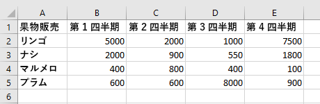
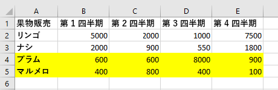
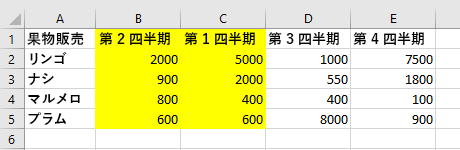

# <a name="work-with-worksheets-using-the-excel-javascript-api"></a><span data-ttu-id="a06ef-103">Excel JavaScript API を使用してワークシートを操作する</span><span class="sxs-lookup"><span data-stu-id="a06ef-103">Work with worksheets using the Excel JavaScript API</span></span>

<span data-ttu-id="a06ef-p101">この記事では、Excel JavaScript API を使用して、ワークシートでタスクを実行する方法のコード サンプルを示しています。 `Worksheet` オブジェクトおよび `WorksheetCollection` オブジェクトがサポートするプロパティとメソッドの完全なリストについては、「[Worksheet オブジェクト (JavaScript API for Excel)](/javascript/api/excel/excel.worksheet)」および「[WorksheetCollection オブジェクト (JavaScript API for Excel)](/javascript/api/excel/excel.worksheetcollection)」を参照してください。</span><span class="sxs-lookup"><span data-stu-id="a06ef-p101">This article provides code samples that show how to perform common tasks with worksheets using the Excel JavaScript API. For the complete list of properties and methods that the `Worksheet` and `WorksheetCollection` objects support, see [Worksheet Object (JavaScript API for Excel)](/javascript/api/excel/excel.worksheet) and [WorksheetCollection Object (JavaScript API for Excel)](/javascript/api/excel/excel.worksheetcollection).</span></span>

> [!NOTE]
> <span data-ttu-id="a06ef-106">この記事の情報は標準のワークシートにのみ適用されます。"グラフ" シートや "マクロ" シートには適用されません。</span><span class="sxs-lookup"><span data-stu-id="a06ef-106">The information in this article applies only to regular worksheets; it does not apply to "chart" sheets or "macro" sheets.</span></span>

## <a name="get-worksheets"></a><span data-ttu-id="a06ef-107">ワークシートを取得する</span><span class="sxs-lookup"><span data-stu-id="a06ef-107">Get worksheets</span></span>

<span data-ttu-id="a06ef-108">次のコード サンプルでは、ワークシートのコレクションを取得し、各ワークシートの `name` プロパティを読み込み、コンソールにメッセージを書き込みます。</span><span class="sxs-lookup"><span data-stu-id="a06ef-108">The following code sample gets the collection of worksheets, loads the `name` property of each worksheet, and writes a message to the console.</span></span>

```js
Excel.run(function (context) {
    var sheets = context.workbook.worksheets;
    sheets.load("items/name");

    return context.sync()
        .then(function () {
            if (sheets.items.length > 1) {
                console.log(`There are ${sheets.items.length} worksheets in the workbook:`);
            } else {
                console.log(`There is one worksheet in the workbook:`);
            }
            sheets.items.forEach(function (sheet) {
              console.log(sheet.name);
            });
        });
}).catch(errorHandlerFunction);
```

> [!NOTE]
> <span data-ttu-id="a06ef-p102">ワークシートの `id` プロパティは、指定されたブックのワークシートを一意に識別します。その値は、ワークシートの名前変更や移動をしても同じままです。Mac 版の Excel のブックからワークシートを削除すると、削除されたワークシートの `id` はそれ以降に作成される新規ワークシートに再割り当てされる可能性があります。</span><span class="sxs-lookup"><span data-stu-id="a06ef-p102">The `id` property of a worksheet uniquely identifies the worksheet in a given workbook and its value will remain the same even when the worksheet is renamed or moved. When a worksheet is deleted from a workbook in Excel on Mac, the `id` of the deleted worksheet may be reassigned to a new worksheet that is subsequently created.</span></span>

## <a name="get-the-active-worksheet"></a><span data-ttu-id="a06ef-111">作業中のワークシートを取得する</span><span class="sxs-lookup"><span data-stu-id="a06ef-111">Get the active worksheet</span></span>

<span data-ttu-id="a06ef-112">次のコード サンプルでは、作業中のワークシートを取得し、`name` プロパティを読み込み、コンソールにメッセージを書き込みます。</span><span class="sxs-lookup"><span data-stu-id="a06ef-112">The following code sample gets the active worksheet, loads its `name` property, and writes a message to the console.</span></span>

```js
Excel.run(function (context) {
    var sheet = context.workbook.worksheets.getActiveWorksheet();
    sheet.load("name");

    return context.sync()
        .then(function () {
            console.log(`The active worksheet is "${sheet.name}"`);
        });
}).catch(errorHandlerFunction);
```

## <a name="set-the-active-worksheet"></a><span data-ttu-id="a06ef-113">作業中のワークシートを設定する</span><span class="sxs-lookup"><span data-stu-id="a06ef-113">Set the active worksheet</span></span>

<span data-ttu-id="a06ef-p103">次のコード サンプルでは、作業中のワークシートを **Sample** という名前のワークシートに設定し、`name` プロパティを読み込み、コンソールにメッセージを書き込みます。 その名前を持つワークシートが存在しない場合、`activate()` メソッドにより `ItemNotFound` エラーがスローされます。</span><span class="sxs-lookup"><span data-stu-id="a06ef-p103">The following code sample sets the active worksheet to the worksheet named **Sample**, loads its `name` property, and writes a message to the console. If there is no worksheet with that name, the `activate()` method throws an `ItemNotFound` error.</span></span>

```js
Excel.run(function (context) {
    var sheet = context.workbook.worksheets.getItem("Sample");
    sheet.activate();
    sheet.load("name");

    return context.sync()
        .then(function () {
            console.log(`The active worksheet is "${sheet.name}"`);
        });
}).catch(errorHandlerFunction);
```

## <a name="reference-worksheets-by-relative-position"></a><span data-ttu-id="a06ef-116">相対位置でワークシートを参照する</span><span class="sxs-lookup"><span data-stu-id="a06ef-116">Reference worksheets by relative position</span></span>

<span data-ttu-id="a06ef-117">以下の例は、相対位置でワークシートを参照する方法を示しています。</span><span class="sxs-lookup"><span data-stu-id="a06ef-117">These examples show how to reference a worksheet by its relative position.</span></span>

### <a name="get-the-first-worksheet"></a><span data-ttu-id="a06ef-118">最初のワークシートを取得する</span><span class="sxs-lookup"><span data-stu-id="a06ef-118">Get the first worksheet</span></span>

<span data-ttu-id="a06ef-119">次のコード サンプルでは、ブックの最初のワークシートを取得し、`name` プロパティを読み込み、コンソールにメッセージを書き込みます。</span><span class="sxs-lookup"><span data-stu-id="a06ef-119">The following code sample gets the first worksheet in the workbook, loads its `name` property, and writes a message to the console.</span></span>

```js
Excel.run(function (context) {
    var firstSheet = context.workbook.worksheets.getFirst();
    firstSheet.load("name");

    return context.sync()
        .then(function () {
            console.log(`The name of the first worksheet is "${firstSheet.name}"`);
        });
}).catch(errorHandlerFunction);
```

### <a name="get-the-last-worksheet"></a><span data-ttu-id="a06ef-120">最後のワークシートを取得する</span><span class="sxs-lookup"><span data-stu-id="a06ef-120">Get the last worksheet</span></span>

<span data-ttu-id="a06ef-121">次のコード サンプルでは、ブックの最後のワークシートを取得し、`name` プロパティを読み込み、コンソールにメッセージを書き込みます。</span><span class="sxs-lookup"><span data-stu-id="a06ef-121">The following code sample gets the last worksheet in the workbook, loads its `name` property, and writes a message to the console.</span></span>

```js
Excel.run(function (context) {
    var lastSheet = context.workbook.worksheets.getLast();
    lastSheet.load("name");

    return context.sync()
        .then(function () {
            console.log(`The name of the last worksheet is "${lastSheet.name}"`);
        });
}).catch(errorHandlerFunction);
```

### <a name="get-the-next-worksheet"></a><span data-ttu-id="a06ef-122">次のワークシートを取得する</span><span class="sxs-lookup"><span data-stu-id="a06ef-122">Get the next worksheet</span></span>

<span data-ttu-id="a06ef-p104">次のコード サンプルでは、ブックで作業中のワークシートの後のワークシートを取得し、`name` プロパティを読み込み、コンソールにメッセージを書き込みます。 作業中のワークシートの後にワークシートがない場合、`getNext()` メソッドにより `ItemNotFound` エラーがスローされます。</span><span class="sxs-lookup"><span data-stu-id="a06ef-p104">The following code sample gets the worksheet that follows the active worksheet in the workbook, loads its `name` property, and writes a message to the console. If there is no worksheet after the active worksheet, the `getNext()` method throws an `ItemNotFound` error.</span></span>

```js
 Excel.run(function (context) {
    var currentSheet = context.workbook.worksheets.getActiveWorksheet();
    var nextSheet = currentSheet.getNext();
    nextSheet.load("name");

    return context.sync()
        .then(function () {
            console.log(`The name of the sheet that follows the active worksheet is "${nextSheet.name}"`);
        });
}).catch(errorHandlerFunction);
```

### <a name="get-the-previous-worksheet"></a><span data-ttu-id="a06ef-125">前のワークシートを取得する</span><span class="sxs-lookup"><span data-stu-id="a06ef-125">Get the previous worksheet</span></span>

<span data-ttu-id="a06ef-p105">次のコード サンプルでは、ブックで作業中のワークシートの前のワークシートを取得し、`name` プロパティを読み込み、コンソールにメッセージを書き込みます。 作業中のワークシートの前にワークシートが存在しない場合、`getPrevious()` メソッドにより `ItemNotFound` エラーがスローされます。</span><span class="sxs-lookup"><span data-stu-id="a06ef-p105">The following code sample gets the worksheet that precedes the active worksheet in the workbook, loads its `name` property, and writes a message to the console. If there is no worksheet before the active worksheet, the `getPrevious()` method throws an `ItemNotFound` error.</span></span>

```js
Excel.run(function (context) {
    var currentSheet = context.workbook.worksheets.getActiveWorksheet();
    var previousSheet = currentSheet.getPrevious();
    previousSheet.load("name");

    return context.sync()
        .then(function () {
            console.log(`The name of the sheet that precedes the active worksheet is "${previousSheet.name}"`);
        });
}).catch(errorHandlerFunction);
```

## <a name="add-a-worksheet"></a><span data-ttu-id="a06ef-128">ワークシートを追加する</span><span class="sxs-lookup"><span data-stu-id="a06ef-128">Add a worksheet</span></span>

<span data-ttu-id="a06ef-p106">次のコード サンプルでは、**Sample** という名前の新しいワークシートをブックに追加し、`name` プロパティと `position` プロパティを読み込み、コンソールにメッセージを書き込みます。新しいワークシートは既存の全ワークシートの後に追加されます。</span><span class="sxs-lookup"><span data-stu-id="a06ef-p106">The following code sample adds a new worksheet named **Sample** to the workbook, loads its `name` and `position` properties, and writes a message to the console. The new worksheet is added after all existing worksheets.</span></span>

```js
Excel.run(function (context) {
    var sheets = context.workbook.worksheets;

    var sheet = sheets.add("Sample");
    sheet.load("name, position");

    return context.sync()
        .then(function () {
            console.log(`Added worksheet named "${sheet.name}" in position ${sheet.position}`);
        });
}).catch(errorHandlerFunction);
```

### <a name="copy-an-existing-worksheet"></a><span data-ttu-id="a06ef-131">既存のワークシートをコピーする</span><span class="sxs-lookup"><span data-stu-id="a06ef-131">Copy an existing worksheet</span></span>

<span data-ttu-id="a06ef-132">`Worksheet.copy` は、既存のワークシートのコピーである新しいワークシートを追加します。</span><span class="sxs-lookup"><span data-stu-id="a06ef-132">`Worksheet.copy` adds a new worksheet that is a copy of an existing worksheet.</span></span> <span data-ttu-id="a06ef-133">新しいワークシートの名前には、Excel UI を介してワークシートをコピーするのと一貫した方法で、末尾に番号が追加されます (たとえば、**MySheet (2)**)。</span><span class="sxs-lookup"><span data-stu-id="a06ef-133">The new worksheet's name will have a number appended to the end, in a manner consistent with copying a worksheet through the Excel UI (for example, **MySheet (2)**).</span></span> <span data-ttu-id="a06ef-134">`Worksheet.copy` は 2 つのパラメーターを取ることができますが、どちらもオプションです。</span><span class="sxs-lookup"><span data-stu-id="a06ef-134">`Worksheet.copy` can take two parameters, both of which are optional:</span></span>

- <span data-ttu-id="a06ef-135">`positionType` - ブック内の新しいワークシートを追加する場所を指定する [WorksheetPositionType](/javascript/api/excel/excel.worksheetpositiontype) 列挙。</span><span class="sxs-lookup"><span data-stu-id="a06ef-135">`positionType` - A [WorksheetPositionType](/javascript/api/excel/excel.worksheetpositiontype) enum specifying where in the workbook the new worksheet is to be added.</span></span>
- <span data-ttu-id="a06ef-136">`relativeTo` - `positionType` が `Before` または `After` である場合、新しいシートを追加するワークシートを指定する必要があります (このパラメーターは、「何の前か後に?」という質問に答えます)。</span><span class="sxs-lookup"><span data-stu-id="a06ef-136">`relativeTo` - If the `positionType` is `Before` or `After`, you need to specify a worksheet relative to which the new sheet is to be added (this parameter answers the question "Before or after what?").</span></span>

<span data-ttu-id="a06ef-137">次のコード サンプルは、現在のワークシートをコピーし、現在のワークシートの直後に新しいシートを挿入します。</span><span class="sxs-lookup"><span data-stu-id="a06ef-137">The following code sample copies the current worksheet and inserts the new sheet directly after the current worksheet.</span></span>

```js
Excel.run(function (context) {
    var myWorkbook = context.workbook;
    var sampleSheet = myWorkbook.worksheets.getActiveWorksheet();
    var copiedSheet = sampleSheet.copy(Excel.WorksheetPositionType.after, sampleSheet);
    return context.sync();
});
```

## <a name="delete-a-worksheet"></a><span data-ttu-id="a06ef-138">ワークシートの削除</span><span class="sxs-lookup"><span data-stu-id="a06ef-138">Delete a worksheet</span></span>

<span data-ttu-id="a06ef-139">次のコード サンプルでは、ブックの最後のワークシートを (ただし、ブック内の唯一のシートでない場合に) 削除し、コンソールにメッセージを書き込みます。</span><span class="sxs-lookup"><span data-stu-id="a06ef-139">The following code sample deletes the final worksheet in the workbook (as long as it's not the only sheet in the workbook) and writes a message to the console.</span></span>

```js
Excel.run(function (context) {
    var sheets = context.workbook.worksheets;
    sheets.load("items/name");

    return context.sync()
        .then(function () {
            if (sheets.items.length === 1) {
                console.log("Unable to delete the only worksheet in the workbook");
            } else {
                var lastSheet = sheets.items[sheets.items.length - 1];

                console.log(`Deleting worksheet named "${lastSheet.name}"`);
                lastSheet.delete();

                return context.sync();
            };
        });
}).catch(errorHandlerFunction);
```

> [!NOTE]
> <span data-ttu-id="a06ef-140">可視性が [Very Hidden](/javascript/api/excel/excel.sheetvisibility) のワークシートは、`delete` メソッドで削除することはできません。</span><span class="sxs-lookup"><span data-stu-id="a06ef-140">A worksheet with a visibility of "[Very Hidden](/javascript/api/excel/excel.sheetvisibility)" cannot be deleted with the `delete` method.</span></span> <span data-ttu-id="a06ef-141">このワークシートを削除する場合には、最初に可視性を変更する必要があります。</span><span class="sxs-lookup"><span data-stu-id="a06ef-141">If you wish to delete the worksheet anyway, you must first change the visibility.</span></span>

## <a name="rename-a-worksheet"></a><span data-ttu-id="a06ef-142">ワークシートの名前を変更する</span><span class="sxs-lookup"><span data-stu-id="a06ef-142">Rename a worksheet</span></span>

<span data-ttu-id="a06ef-143">次のコード サンプルでは、作業中のワークシートの名前を **New Name** に変更します。</span><span class="sxs-lookup"><span data-stu-id="a06ef-143">The following code sample changes the name of the active worksheet to **New Name**.</span></span>

```js
Excel.run(function (context) {
    var currentSheet = context.workbook.worksheets.getActiveWorksheet();
    currentSheet.name = "New Name";

    return context.sync();
}).catch(errorHandlerFunction);
```

## <a name="move-a-worksheet"></a><span data-ttu-id="a06ef-144">ワークシートを移動する</span><span class="sxs-lookup"><span data-stu-id="a06ef-144">Move a worksheet</span></span>

<span data-ttu-id="a06ef-145">次のコード サンプルでは、ブックの最後の位置からブックの最初の位置にワークシートを移動します。</span><span class="sxs-lookup"><span data-stu-id="a06ef-145">The following code sample moves a worksheet from the last position in the workbook to the first position in the workbook.</span></span>

```js
Excel.run(function (context) {
    var sheets = context.workbook.worksheets;
    sheets.load("items");

    return context.sync()
        .then(function () {
            var lastSheet = sheets.items[sheets.items.length - 1];
            lastSheet.position = 0;

            return context.sync();
        });
}).catch(errorHandlerFunction);
```

## <a name="set-worksheet-visibility"></a><span data-ttu-id="a06ef-146">ワークシートの可視性を設定する</span><span class="sxs-lookup"><span data-stu-id="a06ef-146">Set worksheet visibility</span></span>

<span data-ttu-id="a06ef-147">これらの例では、ワークシートの可視性を設定する方法を示します。</span><span class="sxs-lookup"><span data-stu-id="a06ef-147">These examples show how to set the visibility of a worksheet.</span></span>

### <a name="hide-a-worksheet"></a><span data-ttu-id="a06ef-148">ワークシートを非表示にする</span><span class="sxs-lookup"><span data-stu-id="a06ef-148">Hide a worksheet</span></span>

<span data-ttu-id="a06ef-149">次のコード サンプルでは、**Sample** という名前のワークシートの可視性を非表示に設定し、`name` プロパティを読み込み、コンソールにメッセージを書き込みます。</span><span class="sxs-lookup"><span data-stu-id="a06ef-149">The following code sample sets the visibility of worksheet named **Sample** to hidden, loads its `name` property, and writes a message to the console.</span></span>

```js
Excel.run(function (context) {
    var sheet = context.workbook.worksheets.getItem("Sample");
    sheet.visibility = Excel.SheetVisibility.hidden;
    sheet.load("name");

    return context.sync()
        .then(function () {
            console.log(`Worksheet with name "${sheet.name}" is hidden`);
        });
}).catch(errorHandlerFunction);
```

### <a name="unhide-a-worksheet"></a><span data-ttu-id="a06ef-150">ワークシートを再表示する</span><span class="sxs-lookup"><span data-stu-id="a06ef-150">Unhide a worksheet</span></span>

<span data-ttu-id="a06ef-151">次のコード サンプルでは、**Sample** という名前のワークシートの可視性を表示に設定し、`name` プロパティを読み込み、コンソールにメッセージを書き込みます。</span><span class="sxs-lookup"><span data-stu-id="a06ef-151">The following code sample sets the visibility of worksheet named **Sample** to visible, loads its `name` property, and writes a message to the console.</span></span>

```js
Excel.run(function (context) {
    var sheet = context.workbook.worksheets.getItem("Sample");
    sheet.visibility = Excel.SheetVisibility.visible;
    sheet.load("name");

    return context.sync()
        .then(function () {
            console.log(`Worksheet with name "${sheet.name}" is visible`);
        });
}).catch(errorHandlerFunction);
```

## <a name="get-a-single-cell-within-a-worksheet"></a><span data-ttu-id="a06ef-152">ワークシート内で単一のセルを取得する</span><span class="sxs-lookup"><span data-stu-id="a06ef-152">Get a single cell within a worksheet</span></span>

<span data-ttu-id="a06ef-153">次のコード サンプルでは、**Sample** という名前のワークシートの 2 行目、5 列目にあるセルを取得し、`address` プロパティと `values` プロパティを読み込み、コンソールにメッセージを書き込みます。</span><span class="sxs-lookup"><span data-stu-id="a06ef-153">The following code sample gets the cell that is located in row 2, column 5 of the worksheet named **Sample**, loads its `address` and `values` properties, and writes a message to the console.</span></span> <span data-ttu-id="a06ef-154">`getCell(row: number, column:number)` メソッドに渡される値は、取得するセルの 0 から始まる行番号および列番号です。</span><span class="sxs-lookup"><span data-stu-id="a06ef-154">The values that are passed into the `getCell(row: number, column:number)` method are the zero-indexed row number and column number for the cell that is being retrieved.</span></span>

```js
Excel.run(function (context) {
    var sheet = context.workbook.worksheets.getItem("Sample");
    var cell = sheet.getCell(1, 4);
    cell.load("address, values");

    return context.sync()
        .then(function() {
            console.log(`The value of the cell in row 2, column 5 is "${cell.values[0][0]}" and the address of that cell is "${cell.address}"`);
        })
}).catch(errorHandlerFunction);
```

## <a name="detect-data-changes"></a><span data-ttu-id="a06ef-155">データ変更を検出します</span><span class="sxs-lookup"><span data-stu-id="a06ef-155">Detect data changes</span></span>

<span data-ttu-id="a06ef-156">表のデータをユーザーが変更した場合に、アドインを使用して対応する必要がある場合があります。</span><span class="sxs-lookup"><span data-stu-id="a06ef-156">Your add-in may need to react to users changing the data in a worksheet.</span></span> <span data-ttu-id="a06ef-157">これらの変更を検出するために、`onChanged`ワークシートのイベントに対する[イベントハンドラを登録できます](excel-add-ins-events.md#register-an-event-handler)。</span><span class="sxs-lookup"><span data-stu-id="a06ef-157">To detect these changes, you can [register an event handler](excel-add-ins-events.md#register-an-event-handler) for the `onChanged` event of a worksheet.</span></span> <span data-ttu-id="a06ef-158">`onChanged`イベントのイベント ハンドラーは、そのイベントが発生した際に [TableChangedEventArgs](/javascript/api/excel/excel.worksheetchangedeventargs) オブジェクトを受け取ります。</span><span class="sxs-lookup"><span data-stu-id="a06ef-158">Event handlers for the `onChanged` event receive a [WorksheetChangedEventArgs](/javascript/api/excel/excel.worksheetchangedeventargs) object when the event fires.</span></span>

<span data-ttu-id="a06ef-159">この`WorksheetChangedEventArgs`オブジェクトは、変更とソースに関する情報を提供します。</span><span class="sxs-lookup"><span data-stu-id="a06ef-159">The `WorksheetChangedEventArgs` object provides information about the changes and the source.</span></span> <span data-ttu-id="a06ef-160">`onChanged` が発生するのは書式設定またはデータの値が変更された時であるため、値が実際に変更されたかどうかを確認するのにアドインを使用すると便利です。</span><span class="sxs-lookup"><span data-stu-id="a06ef-160">Since `onChanged` fires when either the format or value of the data changes, it can be useful to have your add-in check if the values have actually changed.</span></span> <span data-ttu-id="a06ef-161">`details`プロパティは、この情報を [ChangedEventDetail](/javascript/api/excel/excel.changedeventdetail) としてカプセル化します。</span><span class="sxs-lookup"><span data-stu-id="a06ef-161">The `details` property encapsulates this information as a [ChangedEventDetail](/javascript/api/excel/excel.changedeventdetail).</span></span> <span data-ttu-id="a06ef-162">次のコード サンプルでは、変更前と変更後の値および変更されたセルの種類を表示する方法を表示します。</span><span class="sxs-lookup"><span data-stu-id="a06ef-162">The following code sample shows how to display the before and after values and types of a cell that has been changed.</span></span>

```js
// This function would be used as an event handler for the Worksheet.onChanged event.
function onWorksheetChanged(eventArgs) {
    Excel.run(function (context) {
        var details = eventArgs.details;
        var address = eventArgs.address;

        // Print the before and after types and values to the console.
        console.log(`Change at ${address}: was ${details.valueBefore}(${details.valueTypeBefore}),`
            + ` now is ${details.valueAfter}(${details.valueTypeAfter})`);
        return context.sync();
    });
}
```

## <a name="handle-sorting-events"></a><span data-ttu-id="a06ef-163">並べ替えイベントを処理する</span><span class="sxs-lookup"><span data-stu-id="a06ef-163">Handle sorting events</span></span>

<span data-ttu-id="a06ef-164">`onColumnSorted` および `onRowSorted` イベントは、ワークシート データがいつ並べ替えられるかを示します。</span><span class="sxs-lookup"><span data-stu-id="a06ef-164">The `onColumnSorted` and `onRowSorted` events indicate when any worksheet data is sorted.</span></span> <span data-ttu-id="a06ef-165">これらのイベントは、個々の `Worksheet` オブジェクトおよびブックの `WorkbookCollection` に接続されています。</span><span class="sxs-lookup"><span data-stu-id="a06ef-165">These events are connected to individual `Worksheet` objects and to the workbook's `WorkbookCollection`.</span></span> <span data-ttu-id="a06ef-166">これらは、並べ替えがプログラムで実行されるか、Excel ユーザー インターフェイスを介して手動で実行されるかに関係なく起動します。</span><span class="sxs-lookup"><span data-stu-id="a06ef-166">They fire whether the sorting is done programmatically or manually through the Excel user interface.</span></span>

> [!NOTE]
> <span data-ttu-id="a06ef-167">`onColumnSorted` は、左から右への並べ替え操作の結果として列が並べ替えされたときに起動します。</span><span class="sxs-lookup"><span data-stu-id="a06ef-167">`onColumnSorted` fires when columns are sorted as the result of a left-to-right sort operation.</span></span> <span data-ttu-id="a06ef-168">`onRowSorted` は、上から下への並べ替え操作の結果として行が並べ替えされたときに起動します。</span><span class="sxs-lookup"><span data-stu-id="a06ef-168">`onRowSorted` fires when rows are sorted as the result of a top-to-bottom sort operation.</span></span> <span data-ttu-id="a06ef-169">列のヘッダーのドロップダウン メニューを使用してテーブルを並べ替えると、`onRowSorted` イベントが発生します。</span><span class="sxs-lookup"><span data-stu-id="a06ef-169">Sorting a table using the drop-down menu on a column header results in an `onRowSorted` event.</span></span> <span data-ttu-id="a06ef-170">イベントは、並べ替え条件として考慮されているものではなく、移動しているものに対応します。</span><span class="sxs-lookup"><span data-stu-id="a06ef-170">The event corresponds with what is moving, not what is being considered as the sorting criteria.</span></span>

<span data-ttu-id="a06ef-171">`onColumnSorted` および `onRowSorted` イベントは、それぞれ [WorksheetColumnSortedEventArgs](/javascript/api/excel/excel.worksheetcolumnsortedeventargs) または [WorksheetRowSortedEventArgs](/javascript/api/excel/excel.worksheetrowsortedeventargs) でコールバックを提供します。</span><span class="sxs-lookup"><span data-stu-id="a06ef-171">The `onColumnSorted` and `onRowSorted` events provide their callbacks with [WorksheetColumnSortedEventArgs](/javascript/api/excel/excel.worksheetcolumnsortedeventargs) or [WorksheetRowSortedEventArgs](/javascript/api/excel/excel.worksheetrowsortedeventargs), respectively.</span></span> <span data-ttu-id="a06ef-172">これらは、イベントの詳細を提供します。</span><span class="sxs-lookup"><span data-stu-id="a06ef-172">These give more details about the event.</span></span> <span data-ttu-id="a06ef-173">特に、両方の `EventArgs` には、並べ替え操作の結果として移動された行または列を表す `address` プロパティがあります。</span><span class="sxs-lookup"><span data-stu-id="a06ef-173">In particular, both `EventArgs` have an `address` property that represents the rows or columns moved as a result of the sort operation.</span></span> <span data-ttu-id="a06ef-174">セルの値が並べ替え条件の一部ではない場合でも、並べ替えられたコンテンツを持つセルが含まれます。</span><span class="sxs-lookup"><span data-stu-id="a06ef-174">Any cell with sorted content is included, even if that cell's value was not part of the sorting criteria.</span></span>

<span data-ttu-id="a06ef-175">以下の画像は、並べ替えイベントの `address` プロパティによって返される範囲を示しています。</span><span class="sxs-lookup"><span data-stu-id="a06ef-175">The following images show the ranges returned by the `address` property for sort events.</span></span> <span data-ttu-id="a06ef-176">まず、並べ替えの前のサンプル データを次に示します。</span><span class="sxs-lookup"><span data-stu-id="a06ef-176">First, here is the sample data before sorting:</span></span>



<span data-ttu-id="a06ef-178">「**Q1**」(「**B**」の値) で上から下への並べ替えが実行される場合、次の強調表示された行が `WorksheetRowSortedEventArgs.address` によって返されます。</span><span class="sxs-lookup"><span data-stu-id="a06ef-178">If a top-to-bottom sort is performed on "**Q1**" (the values in "**B**"), the following highlighted rows are returned by `WorksheetRowSortedEventArgs.address`:</span></span>



<span data-ttu-id="a06ef-181">元のデータの「**Quinces**」(「**4**」の値) で左から右への並べ替えが実行される場合、次の強調表示された列が `WorksheetColumnsSortedEventArgs.address` によって返されます。</span><span class="sxs-lookup"><span data-stu-id="a06ef-181">If a left-to-right sort is performed on "**Quinces**" (the values in "**4**") on the original data, the following highlighted columns are returned by `WorksheetColumnsSortedEventArgs.address`:</span></span>



<span data-ttu-id="a06ef-184">次のコード サンプルは、`Worksheet.onRowSorted` イベントのイベント ハンドラーを登録する方法を示しています。</span><span class="sxs-lookup"><span data-stu-id="a06ef-184">The following code sample shows how to register an event handler for the `Worksheet.onRowSorted` event.</span></span> <span data-ttu-id="a06ef-185">ハンドラーのコールバックは、範囲の塗りつぶしの色をクリアし、移動した行のセルを塗りつぶします。</span><span class="sxs-lookup"><span data-stu-id="a06ef-185">The handler's callback clears the fill color for the range, then fills the cells of the moved rows.</span></span>

```js
Excel.run(function (context) {
    var sheet = context.workbook.worksheets.getActiveWorksheet();

    // This will fire whenever a row has been moved as the result of a sort action.
    sheet.onRowSorted.add(function (event) {
        return Excel.run(function (context) {
            console.log("Row sorted: " + event.address);
            var sheet = context.workbook.worksheets.getActiveWorksheet();

            // Clear formatting for section, then highlight the sorted area.
            sheet.getRange("A1:E5").format.fill.clear();
            if (event.address !== "") {
                sheet.getRanges(event.address).format.fill.color = "yellow";
            }

            return context.sync();
        });
    });

    return context.sync();
}).catch(errorHandlerFunction);
```

## <a name="find-all-cells-with-matching-text"></a><span data-ttu-id="a06ef-186">一致するテキストがあるすべてのセルを検索する</span><span class="sxs-lookup"><span data-stu-id="a06ef-186">Find all cells with matching text</span></span>

<span data-ttu-id="a06ef-187">`Worksheet` オブジェクトには、ワークシート内の指定された文字列を検索するための `find` メソッドがあります。</span><span class="sxs-lookup"><span data-stu-id="a06ef-187">The `Worksheet` object has a `find` method to search for a specified string within the worksheet.</span></span> <span data-ttu-id="a06ef-188">このメソッドは `RangeAreas` オブジェクトを返します。これは、一度に編集できる `Range` オブジェクトのコレクションとなります。</span><span class="sxs-lookup"><span data-stu-id="a06ef-188">It returns a `RangeAreas` object, which is a collection of `Range` objects that can be edited all at once.</span></span> <span data-ttu-id="a06ef-189">以下のコード サンプルは、文字列 **Complete** と等しいすべてのセルを検索し、そのセルの色を緑色にします。</span><span class="sxs-lookup"><span data-stu-id="a06ef-189">The following code sample finds all cells with values equal to the string **Complete** and colors them green.</span></span> <span data-ttu-id="a06ef-190">指定した文字列がワークシートに存在しない場合、`ItemNotFound` エラーが `findAll` によってスローされます。</span><span class="sxs-lookup"><span data-stu-id="a06ef-190">Note that `findAll` will throw an `ItemNotFound` error if the specified string doesn't exist in the worksheet.</span></span> <span data-ttu-id="a06ef-191">指定した文字列がワークシートに存在しない可能性がある場合は、自分のコードで適切にシナリオを処理できるように、[findAllOrNullObject](../develop/application-specific-api-model.md#ornullobject-methods-and-properties) メソッドを使用するようにしてください。</span><span class="sxs-lookup"><span data-stu-id="a06ef-191">If you expect that the specified string may not exist in the worksheet, use the [findAllOrNullObject](../develop/application-specific-api-model.md#ornullobject-methods-and-properties) method instead, so your code gracefully handles that scenario.</span></span>

```js
Excel.run(function (context) {
    var sheet = context.workbook.worksheets.getItem("Sample");
    var foundRanges = sheet.findAll("Complete", {
        completeMatch: true, // findAll will match the whole cell value
        matchCase: false // findAll will not match case
    });

    return context.sync()
        .then(function() {
            foundRanges.format.fill.color = "green"
    });
}).catch(errorHandlerFunction);
```

> [!NOTE]
> <span data-ttu-id="a06ef-192">このセクションでは、`Worksheet` オブジェクトの関数を使用してセルと範囲を検索する方法について説明します。</span><span class="sxs-lookup"><span data-stu-id="a06ef-192">This section describes how to find cells and ranges using the `Worksheet` object's functions.</span></span> <span data-ttu-id="a06ef-193">範囲の取得の詳細については、オブジェクト専用の記事で確認することができます。</span><span class="sxs-lookup"><span data-stu-id="a06ef-193">More range retrieval information can be found in object-specific articles.</span></span>
> - <span data-ttu-id="a06ef-194">`Range` オブジェクトを使用して、ワークシート内の範囲を取得する方法を示す例については、「[Excel JavaScript API を使用して範囲を操作する](excel-add-ins-ranges.md)」を参照してください。</span><span class="sxs-lookup"><span data-stu-id="a06ef-194">For examples that show how to get a range within a worksheet using the `Range` object, see [Work with ranges using the Excel JavaScript API](excel-add-ins-ranges.md).</span></span>
> - <span data-ttu-id="a06ef-195">`Table` オブジェクトから範囲を取得する方法を示す例については、「[Excel JavaScript API を使用して表を操作する](excel-add-ins-tables.md)」を参照してください。</span><span class="sxs-lookup"><span data-stu-id="a06ef-195">For examples that show how to get ranges from a `Table` object, see [Work with tables using the Excel JavaScript API](excel-add-ins-tables.md).</span></span>
> - <span data-ttu-id="a06ef-196">セルの特性に基づいて複数の副範囲を幅広く検索する方法の例については、「[Excel アドインで複数の範囲を同時に操作する](excel-add-ins-multiple-ranges.md)」を参照してください。</span><span class="sxs-lookup"><span data-stu-id="a06ef-196">For examples that show how to search a large range for multiple sub-ranges based on cell characteristics, see [Work with multiple ranges simultaneously in Excel add-ins](excel-add-ins-multiple-ranges.md).</span></span>

## <a name="filter-data"></a><span data-ttu-id="a06ef-197">データをフィルター処理する</span><span class="sxs-lookup"><span data-stu-id="a06ef-197">Filter data</span></span>

<span data-ttu-id="a06ef-198">[AutoFilter](/javascript/api/excel/excel.autofilter) はワークシート内の範囲にわたってデータ フィルターを適用します。</span><span class="sxs-lookup"><span data-stu-id="a06ef-198">An [AutoFilter](/javascript/api/excel/excel.autofilter) applies data filters across a range within the worksheet.</span></span> <span data-ttu-id="a06ef-199">これは、次のパラメータを持つ `Worksheet.autoFilter.apply` で作成されます。</span><span class="sxs-lookup"><span data-stu-id="a06ef-199">This is created with `Worksheet.autoFilter.apply`, which has the following parameters:</span></span>

- <span data-ttu-id="a06ef-200">`range`: フィルターが適用される範囲を、`Range` オブジェクトまたは文字列の範囲として指定します。</span><span class="sxs-lookup"><span data-stu-id="a06ef-200">`range`: The range to which the filter is applied, specified as either a `Range` object or a string.</span></span>
- <span data-ttu-id="a06ef-201">`columnIndex`: フィルター条件が評価される 0 から始まる列インデックス。</span><span class="sxs-lookup"><span data-stu-id="a06ef-201">`columnIndex`: The zero-based column index against which the filter criteria is evaluated.</span></span>
- <span data-ttu-id="a06ef-202">`criteria`: 列のセルに基づいてどの行をフィルター処理するかを決定する [FilterCriteria](/javascript/api/excel/excel.filtercriteria) オブジェクト。</span><span class="sxs-lookup"><span data-stu-id="a06ef-202">`criteria`: A [FilterCriteria](/javascript/api/excel/excel.filtercriteria) object determining which rows should be filtered based on the column's cell.</span></span>

<span data-ttu-id="a06ef-203">最初のコード サンプルは、ワークシートの使用範囲にフィルターを追加する方法を示しています。</span><span class="sxs-lookup"><span data-stu-id="a06ef-203">The first code sample shows how to add a filter to the worksheet's used range.</span></span> <span data-ttu-id="a06ef-204">このフィルタは、列 **3** の値に基づいて、上位 25% にないエントリを非表示にします。</span><span class="sxs-lookup"><span data-stu-id="a06ef-204">This filter will hide entries that are not in the top 25%, based on the values in column **3**.</span></span>

```js
Excel.run(function (context) {
    var sheet = context.workbook.worksheets.getActiveWorksheet();
    var farmData = sheet.getUsedRange();

    // This filter will only show the rows with the top 25% of values in column 3.
    sheet.autoFilter.apply(farmData, 3, { criterion1: "25", filterOn: Excel.FilterOn.topPercent });
    return context.sync();
}).catch(errorHandlerFunction);
```

<span data-ttu-id="a06ef-205">次のコード サンプルでは、`reapply` メソッドを使用してオート フィルターを更新する方法を示します。</span><span class="sxs-lookup"><span data-stu-id="a06ef-205">The next code sample shows how to refresh the auto-filter using the `reapply` method.</span></span> <span data-ttu-id="a06ef-206">これは、範囲内のデータが変更されたときに実行する必要があります。</span><span class="sxs-lookup"><span data-stu-id="a06ef-206">This should be done when the data in the range changes.</span></span>

```js
Excel.run(function (context) {
    var sheet = context.workbook.worksheets.getActiveWorksheet();
    sheet.autoFilter.reapply();
    return context.sync();
}).catch(errorHandlerFunction);
```

<span data-ttu-id="a06ef-207">最後のオート フィルター コード サンプルでは、`remove` メソッドを使用してワークシートからオート フィルターを削除する方法を示します。</span><span class="sxs-lookup"><span data-stu-id="a06ef-207">The final auto-filter code sample shows how to remove the auto-filter from the worksheet with the `remove` method.</span></span>

```js
Excel.run(function (context) {
    var sheet = context.workbook.worksheets.getActiveWorksheet();
    sheet.autoFilter.remove();
    return context.sync();
}).catch(errorHandlerFunction);
```

<span data-ttu-id="a06ef-208">`AutoFilter` を個々のテーブルに適用することもできます。</span><span class="sxs-lookup"><span data-stu-id="a06ef-208">An `AutoFilter` can also be applied to individual tables.</span></span> <span data-ttu-id="a06ef-209">詳しくは、[Excel JavaScript API を使用して表を操作する](excel-add-ins-tables.md#autofilter)を参照してください。</span><span class="sxs-lookup"><span data-stu-id="a06ef-209">See [Work with tables using the Excel JavaScript API](excel-add-ins-tables.md#autofilter) for more information.</span></span>

## <a name="data-protection"></a><span data-ttu-id="a06ef-210">データの保護</span><span class="sxs-lookup"><span data-stu-id="a06ef-210">Data protection</span></span>

<span data-ttu-id="a06ef-211">ご使用のアドインでは、ワークシート内のデータを編集するユーザー機能を制御できます。</span><span class="sxs-lookup"><span data-stu-id="a06ef-211">Your add-in can control a user's ability to edit data in a worksheet.</span></span> <span data-ttu-id="a06ef-212">ワークシートの `protection` プロパティは [WorksheetProtection](/javascript/api/excel/excel.worksheetprotection) オブジェクトであり、`protect()` メソッドを備えています。</span><span class="sxs-lookup"><span data-stu-id="a06ef-212">The worksheet's `protection` property is a [WorksheetProtection](/javascript/api/excel/excel.worksheetprotection) object with a `protect()` method.</span></span> <span data-ttu-id="a06ef-213">次の例では、アクティブなワークシートの完全な保護を切り替える基本的なシナリオを示します。</span><span class="sxs-lookup"><span data-stu-id="a06ef-213">The following example shows a basic scenario toggling the complete protection of the active worksheet.</span></span>

```js
Excel.run(function (context) {
    var activeSheet = context.workbook.worksheets.getActiveWorksheet();
    activeSheet.load("protection/protected");

    return context.sync().then(function() {
        if (!activeSheet.protection.protected) {
            activeSheet.protection.protect();
        }
    })
}).catch(errorHandlerFunction);
```

<span data-ttu-id="a06ef-214">`protect` メソッドには、2 つの省略可能なパラメーターがあります。</span><span class="sxs-lookup"><span data-stu-id="a06ef-214">The `protect` method has two optional parameters:</span></span>

- <span data-ttu-id="a06ef-215">`options`: 特定の編集制限を定義する [WorksheetProtectionOptions](/javascript/api/excel/excel.worksheetprotectionoptions) オブジェクト。</span><span class="sxs-lookup"><span data-stu-id="a06ef-215">`options`: A [WorksheetProtectionOptions](/javascript/api/excel/excel.worksheetprotectionoptions) object defining specific editing restrictions.</span></span>
- <span data-ttu-id="a06ef-216">`password`: ユーザーが保護をバイパスしてワークシートを編集するために必要なパスワードを表す文字列。</span><span class="sxs-lookup"><span data-stu-id="a06ef-216">`password`: A string representing the password needed for a user to bypass protection and edit the worksheet.</span></span>

<span data-ttu-id="a06ef-217">ワークシートの保護と、Excel の UI を使用してそれを変更する方法の詳細については、記事「[ワークシートを保護する](https://support.office.com/article/protect-a-worksheet-3179efdb-1285-4d49-a9c3-f4ca36276de6)」を参照してください。</span><span class="sxs-lookup"><span data-stu-id="a06ef-217">The article [Protect a worksheet](https://support.office.com/article/protect-a-worksheet-3179efdb-1285-4d49-a9c3-f4ca36276de6) has more information about worksheet protection and how to change it through the Excel UI.</span></span>

## <a name="page-layout-and-print-settings"></a><span data-ttu-id="a06ef-218">ページ レイアウトと印刷の設定</span><span class="sxs-lookup"><span data-stu-id="a06ef-218">Page layout and print settings</span></span>

<span data-ttu-id="a06ef-219">アドインは、ワークシート レベルでページ レイアウトの設定にアクセスできます。</span><span class="sxs-lookup"><span data-stu-id="a06ef-219">Add-ins have access to page layout settings at a worksheet level.</span></span> <span data-ttu-id="a06ef-220">シートの印刷方法は、これらの設定により制御されます。</span><span class="sxs-lookup"><span data-stu-id="a06ef-220">These control how the sheet is printed.</span></span> <span data-ttu-id="a06ef-221">`Worksheet` オブジェクトには、レイアウト関連のプロパティが 3 つ含まれます: `horizontalPageBreaks`、`verticalPageBreaks`、`pageLayout`。</span><span class="sxs-lookup"><span data-stu-id="a06ef-221">A `Worksheet` object has three layout-related properties: `horizontalPageBreaks`, `verticalPageBreaks`, `pageLayout`.</span></span>

<span data-ttu-id="a06ef-222">`Worksheet.horizontalPageBreaks` と `Worksheet.verticalPageBreaks` は [PageBreakCollections](/javascript/api/excel/excel.pagebreakcollection) です。</span><span class="sxs-lookup"><span data-stu-id="a06ef-222">`Worksheet.horizontalPageBreaks` and `Worksheet.verticalPageBreaks` are [PageBreakCollections](/javascript/api/excel/excel.pagebreakcollection).</span></span> <span data-ttu-id="a06ef-223">これらは [PageBreak](/javascript/api/excel/excel.pagebreak) のコレクションで、手動改ページを挿入する範囲を指定します。</span><span class="sxs-lookup"><span data-stu-id="a06ef-223">These are collections of [PageBreaks](/javascript/api/excel/excel.pagebreak), which specify ranges where manual page breaks are inserted.</span></span> <span data-ttu-id="a06ef-224">次のコード サンプルは、水平の改ページを行 **21** の上に追加します。</span><span class="sxs-lookup"><span data-stu-id="a06ef-224">The following code sample adds a horizontal page break above row **21**.</span></span>

```js
Excel.run(function (context) {
    var sheet = context.workbook.worksheets.getActiveWorksheet();
    sheet.horizontalPageBreaks.add("A21:E21"); // The page break is added above this range.
    return context.sync();
}).catch(errorHandlerFunction);
```

<span data-ttu-id="a06ef-225">`Worksheet.pageLayout` は、[PageLayout](/javascript/api/excel/excel.pagelayout) オブジェクトです。</span><span class="sxs-lookup"><span data-stu-id="a06ef-225">`Worksheet.pageLayout` is a [PageLayout](/javascript/api/excel/excel.pagelayout) object.</span></span> <span data-ttu-id="a06ef-226">このオブジェクトには、プリンター固有の実装に依存しないレイアウト設定とプリント設定が含まれています。</span><span class="sxs-lookup"><span data-stu-id="a06ef-226">This object contains layout and print settings that are not dependent any printer-specific implementation.</span></span> <span data-ttu-id="a06ef-227">これらの設定には、余白、印刷の向き、ページ番号、タイトル行、および印刷範囲が含まれます。</span><span class="sxs-lookup"><span data-stu-id="a06ef-227">These settings include margins, orientation, page numbering, title rows, and print area.</span></span>

<span data-ttu-id="a06ef-228">次のコード サンプルは、ページを縦方向と横方向ともに中央に配置、すべてのページの上部に印刷するタイトル行を設定し、ワークシートのサブセクションで印刷範囲を設定します。</span><span class="sxs-lookup"><span data-stu-id="a06ef-228">The following code sample centers the page (both vertically and horizontally), sets a title row that will be printed at the top of every page, and sets the printed area to a subsection of the worksheet.</span></span>

```js
Excel.run(function (context) {
    var sheet = context.workbook.worksheets.getActiveWorksheet();

    // Center the page in both directions.
    sheet.pageLayout.centerHorizontally = true;
    sheet.pageLayout.centerVertically = true;

    // Set the first row as the title row for every page.
    sheet.pageLayout.setPrintTitleRows("$1:$1");

    // Limit the area to be printed to the range "A1:D100".
    sheet.pageLayout.setPrintArea("A1:D100");

    return context.sync();
}).catch(errorHandlerFunction);
```

## <a name="see-also"></a><span data-ttu-id="a06ef-229">関連項目</span><span class="sxs-lookup"><span data-stu-id="a06ef-229">See also</span></span>

- [<span data-ttu-id="a06ef-230">Office アドインでの Excel JavaScript オブジェクトモデル</span><span class="sxs-lookup"><span data-stu-id="a06ef-230">Excel JavaScript object model in Office Add-ins</span></span>](excel-add-ins-core-concepts.md)
