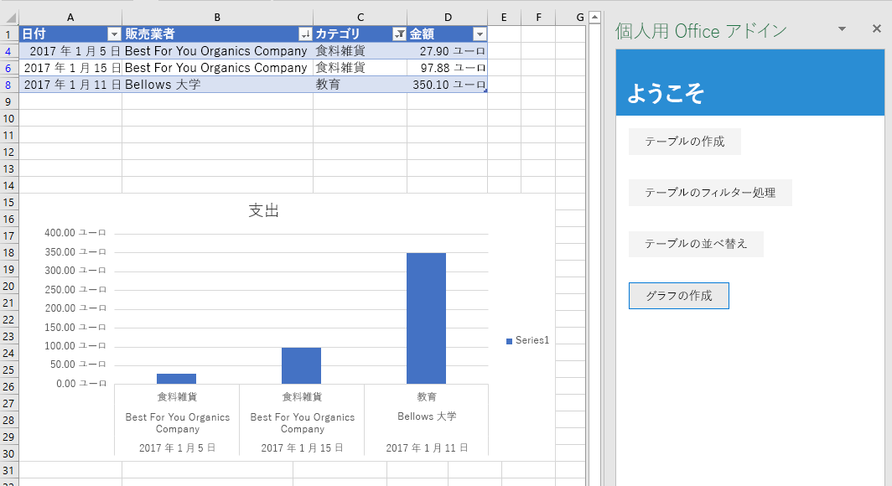

チュートリアルのこの手順では、前の手順で作成したテーブルのデータを使用してグラフを作成して、そのグラフの書式を設定します。

## <a name="chart-table-data"></a>テーブル データのグラフを作成する

1. コード エディターでプロジェクトを開きます。 
2. index.html ファイルを開きます。
3. `sort-table` ボタンを格納している `div` の下に、次のマークアップを追加します。

    ```html
    <div class="padding">            
        <button class="ms-Button" id="create-chart">Create Chart</button>            
    </div>
    ```

4. app.js ファイルを開きます。

5. `sort-chart` ボタンにクリック ハンドラーを割り当てる行の下に、次のコードを追加します。

    ```js
    $('#create-chart').click(createChart);
    ```

6. `sortTable` 関数の下に、次の関数を追加します。

    ```js
    function createChart() {
        Excel.run(function (context) {
            
            // TODO1: Queue commands to get the range of data to be charted.

            // TODO2: Queue command to create the chart and define its type.

            // TODO3: Queue commands to position and format the chart.

            return context.sync();
        })
        .catch(function (error) {
            console.log("Error: " + error);
            if (error instanceof OfficeExtension.Error) {
                console.log("Debug info: " + JSON.stringify(error.debugInfo));
            }
        });
    }
    ``` 

7. `TODO1` を次のコードに置き換えます。 ヘッダー行を除外するために、このコードでは、`getRange` メソッドではなく `Table.getDataBodyRange` メソッドを使用してグラフを作成するデータの範囲を取得しています。

    ```js
    const currentWorksheet = context.workbook.worksheets.getActiveWorksheet();
    const expensesTable = currentWorksheet.tables.getItem('ExpensesTable');
    const dataRange = expensesTable.getDataBodyRange();
    ``` 

8. `TODO2` を次のコードに置き換えます。 次のパラメーターに注意してください。
   - `add` への最初のパラメーターでは、グラフの種類を指定します。 数十種類あります。 
   - 2 番目のパラメーターでは、グラフに含めるデータの範囲を指定します。 
   - 3 番目のパラメーターでは、テーブルからの一連のデータ ポイントを行方向と列方向のどちらでグラフ化する必要があるかを決定します。 オプション `auto` は、最適な方法を判断するように Excel に指示します。

    ```js
    let chart = currentWorksheet.charts.add('ColumnClustered', dataRange, 'auto');
    ``` 

9. `TODO3` を次のコードに置き換えます。 このコードのほとんどの部分は、わかりやすく説明不要なものです。 次の点に注意してください。
   - `setPosition` メソッドへのパラメーターでは、グラフを収容するワークシート領域の左上と右下のセルを指定します。 Excel では、所定の空間内でグラフの外観を整えるために線幅などを調整できます。
   - "series" は、テーブルに含まれる列からのデータ ポイントのセットです。 このテーブルに存在する文字列以外の列は 1 列のみであるため、Excel は、その列がグラフ化するデータ ポイントの唯一の列であることを推測します。 その他の列は、グラフのラベルとして解釈されます。 そのため、グラフの series は 1 つ存在することになり、インデックス 0 を含みます。 これに、"Value in €" のラベルを付けます。 

    ```js
    chart.setPosition("A15", "F30");
    chart.title.text = "Expenses";
    chart.legend.position = "right"
    chart.legend.format.fill.setSolidColor("white");
    chart.dataLabels.format.font.size = 15;
    chart.dataLabels.format.font.color = "black";
    chart.series.getItemAt(0).name = 'Value in €';
    ``` 

## <a name="test-the-add-in"></a>アドインをテストする


1. Git bash ウィンドウまたは Node.JS 対応のシステム プロンプトが前の段階のチュートリアルから開いたままになっている場合は、Ctrl-C を 2 回入力して実行中の Web サーバーを停止します。 それ以外の場合は、Git bash ウィンドウまたは Node.JS 対応のシステム プロンプトを開いて、プロジェクトの **Start** フォルダーに移動します。

     > [!NOTE]
     > ブラウザー同期サーバーは、app.js ファイルなどのファイルに変更を加えるたびに作業ウィンドウ内のアドインを再読み込みしますが、JavaScript を再トランスパイルしないため、ビルド コマンドを繰り返し実行して、app.js への変更を反映させる必要があります。 そのためには、ビルド コマンドの入力を求めるプロンプトが表示されるように、サーバー プロセスを強制終了する必要があります。 ビルド後に、サーバーを再起動します。 次の数ステップで、このプロセスを実行します。

1. `npm run build` コマンドを実行して、ES6 ソース コードを Internet Explorer でサポートされている以前のバージョンの JavaScript にトランスパイルします (これは、Excel アドインを実行するために Excel の内部で使用されます)。
2. `npm start` コマンドを実行して、ローカルホストで稼働する Web サーバーを起動します。
4. 作業ウィンドウを再読み込みするために、そのウィンドウを閉じて、**[ホーム]** メニューの **[作業ウィンドウの表示]** を選択してアドインを再度開きます。
5. 何らかの理由から開いているワークシートにテーブルが含まれていない場合は、**[Create Table]** (テーブルの作成) ボタンをクリックしてから、**[Filter Table]** (テーブルのフィルター) ボタンと **[Sort Table]** (テーブルの並べ替え) ボタンを任意の順序でクリックします。
6. **[グラフの作成]** ボタンをクリックします。 グラフが作成され、フィルターが適用された行からのデータのみが含まれます。 データ ポイントの下側のラベルは、グラフの並べ替え順序になります。つまり、[Merchant] (業者) の名前の逆アルファベット順になります。

    
