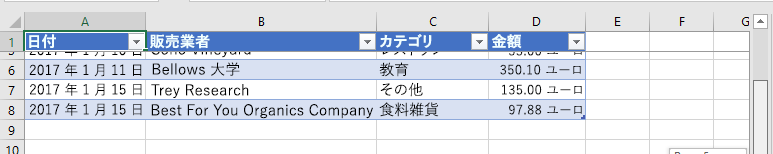

表がとても長く、行を参照するためにスクロールしなければならない場合、ヘッダー行が画面の外に移動して見えなくなることがあります。 チュートリアルのこの手順では、以前に作成した表のヘッダー行を固定して、ワークシートを下にスクロールしても表示されるようにします。 

> [!NOTE]
> このページでは、Excel のアドインのチュートリアルの個々 の手順について説明します。 このページに検索エンジンの結果から、または直接リンクからアクセスした場合は、「[Excel アドインのチュートリアル](../tutorials/excel-tutorial.yml)」の紹介ページに移動し、チュートリアルを最初から始めてください。

## <a name="freeze-the-tables-header-row"></a>表のヘッダー行を固定する

1. コード エディターでプロジェクトを開きます。 
2. index.html ファイルを開きます。
3. `create-chart` ボタンを格納している `div` の下に、次のマークアップを追加します。

    ```html
    <div class="padding">            
        <button class="ms-Button" id="freeze-header">Freeze Header</button>            
    </div>
    ```

4. app.js ファイルを開きます。

5. `create-chart` ボタンにクリック ハンドラーを割り当てる行の下に、次のコードを追加します。

    ```js
    $('#freeze-header').click(freezeHeader);
    ```

6. `createChart` 関数の下に、次の関数を追加します。

    ```js
    function freezeHeader() {
        Excel.run(function (context) {
            
            // TODO1: Queue commands to keep the header visible when the user scrolls.

            return context.sync();
        })
        .catch(function (error) {
            console.log("Error: " + error);
            if (error instanceof OfficeExtension.Error) {
                console.log("Debug info: " + JSON.stringify(error.debugInfo));
            }
        });
    }
    ``` 

7. `TODO1` を次のコードに置き換えます。次の点に注意してください。
   - `Worksheet.freezePanes` コレクションは、ワークシートのスクロール操作時に、ワークシート上でピン留めつまり固定される一式のペインのことです。
   - `freezeRows` メソッドでは、上から数えた行数を、ピン留めする位置のパラメーターとして使用します。`1` を渡して最初の行を適所にピン留めします。

    ```js
    const currentWorksheet = context.workbook.worksheets.getActiveWorksheet();
    currentWorksheet.freezePanes.freezeRows(1);
    ``` 

## <a name="test-the-add-in"></a>アドインのテスト

1. Git bash ウィンドウまたは Node.JS 対応のシステム プロンプトが前の段階のチュートリアルから開いたままになっている場合は、Ctrl-C を 2 回入力して実行中の Web サーバーを停止します。 それ以外の場合は、Git bash ウィンドウまたは Node.JS 対応のシステム プロンプトを開いて、プロジェクトの **Start** フォルダーに移動します。

     > [!NOTE]
     > ブラウザー同期サーバーは、app.js ファイルなどのファイルに変更を加えるたびに作業ウィンドウ内のアドインを再読み込みしますが、JavaScript を再トランスパイルしないため、ビルド コマンドを繰り返し実行して、app.js への変更を反映させる必要があります。 そのためには、ビルド コマンドの入力を求めるプロンプトが表示されるように、サーバー プロセスを強制終了する必要があります。 ビルド後に、サーバーを再起動します。 次の数ステップで、このプロセスを実行します。

1. `npm run build` コマンドを実行して、ES6 ソース コードを Internet Explorer でサポートされている以前のバージョンの JavaScript にトランスパイルします (これは、Excel アドインを実行するために Excel の内部で使用されます)。
2. `npm start` コマンドを実行して、ローカルホストで稼働する Web サーバーを起動します。
4. 作業ウィンドウを再読み込みするために、そのウィンドウを閉じ、**[ホーム]** メニューの **[作業ウィンドウの表示]** を選択してアドインを再度開きます。
6. ワークシート内に表があれば、削除します。
7. 作業ウィンドウで、**[Create Table]** (表の作成) を選択します。 
8. **[Freeze Header]** (ヘッダーを固定) ボタンを選択します。
9. ヘッダー以降の行が画面の外に出て見えなくなるまでワークシートを下にスクロールしても、表のヘッダーが最上部に表示されていることを確認します。

    
