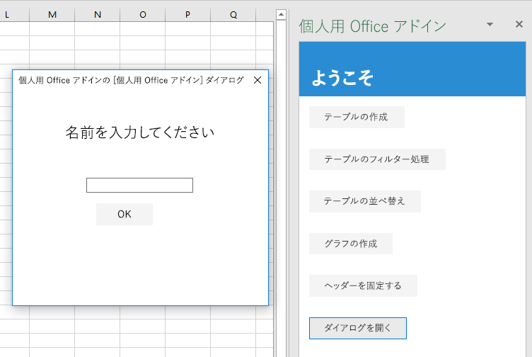

このチュートリアルの最後の手順では、アドインでダイアログを開いて、ダイアログのプロセスから作業ウィンドウのプロセスにメッセージを渡して、ダイアログを閉じます。 Office アドインのダイアログは、*モードレス*です。ユーザーは、ホスト Office アプリケーション内のドキュメントと作業ウィンドウ内のホスト ページの両方の操作を続行できます。

## <a name="create-the-dialog-page"></a>ダイアログ ページを作成する

1. コード エディターでプロジェクトを開きます。
2. プロジェクトのルート (index.html がある場所) で、popup.html というファイルを作成します。
3. popup.html に、次のコードを追加します。 次の点に注意してください。
   - このページには、ユーザーが自分の名前を入力する `<input>` と、その名前を作業ウィンドウ内のページ (入力した名前が表示されるページ) に送信するボタンが含まれています。
   - このマークアップでは、popup.js というスクリプトを読み込みます。このスクリプトは、この後の手順で作成します。
   - また、popup.js で使用することになる Office.JS ライブラリと jQuery も読み込みます。

    ```html
    <!DOCTYPE html>
    <html>
        <head lang="en">
            <title>Dialog for My Office Add-in</title>
            <meta charset="UTF-8">
            <meta name="viewport" content="width=device-width, initial-scale=1">
        
            <link rel="stylesheet" href="node_modules/office-ui-fabric-js/dist/css/fabric.min.css" />
            <link rel="stylesheet" href="node_modules/office-ui-fabric-js/dist/css/fabric.components.css" />
            <link rel="stylesheet" href="app.css">
    
            <script type="text/javascript" src="https://appsforoffice.microsoft.com/lib/1.1/hosted/office.js"></script>
            <script type="text/javascript" src="https://ajax.aspnetcdn.com/ajax/jQuery/jquery-2.2.1.min.js"></script>
            <script type="text/javascript" src="popup.js"></script>
    
        </head>
         <body style="display:flex;flex-direction:column;align-items:center;justify-content:center">
         <div class="padding">
            <p class="ms-font-xl">ENTER YOUR NAME</p>
         </div>        
        <div class="padding">
            <input id="name-box" type="text"/>
        <div>
        <div class="padding">
            <button id="ok-button" class="ms-Button">OK</button>
        </div>
    </body>
    </html>
    ```

4. プロジェクトのルートに popup.js というファイルを作成します。
5. popup.js に、次のコードを追加します。 次の点に注意してください。
   - *Office.JS 内の API を呼び出すページは、どのページでも `Office.initialize` プロパティに関数を割り当てる必要があります。* 初期化が不要な場合は、関数の本体を空にすることができますが、プロパティを未定義のままにすることや、Null または関数以外の値を割り当てることはできません。 たとえば、プロジェクト ルートにある app.js ファイルを確認してください。 この割り当てを実施するコードは、Office.JS を呼び出す前に実行する必要があります。そのため、この例で示すように、割り当てはページによって読み込まれるスクリプト ファイル内に入れてあります。
   - jQuery の `ready` 関数は、`initialize` メソッドの内側から呼び出します。 別の JavaScript ライブラリのコードの読み込み、初期化、またはブートストラップを `Office.initialize` 関数の内側に入れることは、ほとんどすべての場合に通用するルールです。

    ```js
    (function () {
    "use strict";

        Office.initialize = function() {        
            $(document).ready(function () {  
    
                // TODO1: Assign handler to the OK button.
    
            });
        }

        // TODO2: Create the OK button handler
    
    }());    
    ```

6. `TODO1` を次のコードに置き換えます。 `sendStringToParentPage` 関数は、この後の手順で作成します。

    ```js
    $('#ok-button').click(sendStringToParentPage);
    ```

7. `TODO2` を次のコードに置き換えます。 `messageParent` メソッドは、パラメーターを親ページ (この例では、作業ウィンドウ内のページ) に渡します。 パラメーターには、ブール値または文字列を使用できます (XML や JSON など、文字列としてシリアル化できるすべてのものが含まれます)。 

    ```js
    function sendStringToParentPage() {
        var userName = $('#name-box').val();
        Office.context.ui.messageParent(userName);
    }
    ```

8. ファイルを保存します。

   > [!NOTE]
   > popup.html ファイルと、そのファイルで読み込む popup.js ファイルは、アドインの作業ウィンドウとは完全に別な Internet Explorer プロセスで実行されます。 popup.js が app.js ファイルと同じ bundle.js ファイルからトランスパイルされていた場合、アドインでは bundle.js の 2 つのコピーを読み込むことが必要になり、バンドル化の意味がなくなります。 さらに、popup.js ファイルには IE で未サポートの JavaScript は含まれていません。 これら 2 つの理由から、このアドインでは popup.js を一切トランスパイルしていません。 


## <a name="open-the-dialog-from-the-task-pane"></a>作業ウィンドウからダイアログを開く

1. index.html ファイルを開きます。
2. `freeze-header` ボタンを格納している `div` の下に、次のマークアップを追加します。

    ```html
    <div class="padding">            
        <button class="ms-Button" id="open-dialog">Open Dialog</button>          
    </div>
    ```

3. このダイアログでは、ユーザーに名前の入力を求めて、ユーザーの名前を作業ウィンドウに渡します。 作業ウィンドウでは、それがラベルに表示されます。 前の手順で追加した `div` のすぐ下に、次のマークアップを追加します。

    ```html
    <div class="padding">            
        <label id="user-name"></label>            
    </div>
    ```

4. app.js ファイルを開きます。

5. `freeze-header` ボタンにクリック ハンドラーを割り当てる行の下に、次のコードを追加します。 `openDialog` メソッドは、この後の手順で作成します。

    ```js
    $('#open-dialog').click(openDialog);
    ```

6. `freezeHeader` 関数の下に、次の宣言を追加します。 この変数は、親ページの実行コンテキスト内のオブジェクトを保持するために使用され、ダイアログ ページの実行コンテキストへの仲介者として機能します。

    ```js
    let dialog = null;
    ```

7. `dialog` の宣言の下に、次の関数を追加します。 このコードで注目する重要な点は、そこに `Excel.run` の呼び出しが存在*しない*ことです。 これは、ダイアログを開く API はすべての Office ホストで共有されるため、Excel 固有の API ではなく Office JavaScript 共通 API に含まれているからです。

    ```js
    function openDialog() {
        // TODO1: Call the Office Shared API that opens a dialog
    }
    ``` 

8. `TODO1` を次のコードに置き換えます。次の点に注意してください。
   - `displayDialogAsync` メソッドでは、画面の中央にダイアログを開きます。
   - 最初のパラメーターは、開くページの URL です。
   - 2 番目のパラメーターでオプションを渡します。 `height` と `width` は、Office アプリケーションのウィンドウ サイズの比率です。 
   
    ```js
    Office.context.ui.displayDialogAsync(
        'https://localhost:3000/popup.html',
        {height: 45, width: 55},
        
        // TODO2: Add callback parameter.
    );
    ``` 

## <a name="process-the-message-from-the-dialog-and-close-the-dialog"></a>ダイアログからのメッセージを処理してダイアログを閉じる

1. app.js ファイルでの作業を続けます。`TODO2` を次のコードに置き換えます。 次の点に注意してください。
   - コールバックは、ダイアログが正常に開いた直後、ユーザーがダイアログで操作を行う前に実行されます。
   - `result.value` は、親ページとダイアログ ページの実行コンテキストの間で仲介者のように機能するオブジェクトです。
   - `processMessage` 関数は、この後の手順で作成します。 このハンドラーは、`messageParent` 関数の呼び出しによって、ダイアログから送信されるあらゆる値を処理します。

    ```js
    function (result) {
        dialog = result.value;
        dialog.addEventHandler(Microsoft.Office.WebExtension.EventType.DialogMessageReceived, processMessage);
    }
    ```

2. `openDialog` 関数の下に、次の関数を追加します。

    ```js
    function processMessage(arg) {
        $('#user-name').text(arg.message);
        dialog.close();
    }
    ```

## <a name="test-the-add-in"></a>アドインをテストする

1. Git bash ウィンドウまたは Node.JS 対応のシステム プロンプトが前の段階のチュートリアルから開いたままになっている場合は、Ctrl-C を 2 回入力して実行中の Web サーバーを停止します。 それ以外の場合は、Git bash ウィンドウまたは Node.JS 対応のシステム プロンプトを開いて、プロジェクトの **Start** フォルダーに移動します。

     > [!NOTE]
     > ブラウザー同期サーバーは、app.js ファイルなどのファイルに変更を加えるたびに作業ウィンドウ内のアドインを再読み込みしますが、JavaScript を再トランスパイルしないため、ビルド コマンドを繰り返し実行して、app.js への変更を反映させる必要があります。 そのためには、ビルド コマンドの入力を求めるプロンプトが表示されるように、サーバー プロセスを強制終了する必要があります。 ビルド後に、サーバーを再起動します。 次の数手順で、このプロセスを実行します。

1. `npm run build` コマンドを実行して、ES6 ソース コードを Internet Explorer でサポートされている以前のバージョンの JavaScript にトランスパイルします (これは、Excel アドインを実行するために Excel の内部で使用されます)。
2. `npm start` コマンドを実行して、ローカルホストで稼働する Web サーバーを起動します。
4. 作業ウィンドウを再読み込みするために、そのウィンドウを閉じて、**[ホーム]** メニューの **[作業ウィンドウの表示]** を選択してアドインを再度開きます。
6. 作業ウィンドウで、**[Open Dialog]** ボタンをクリックします。 
7. ダイアログが開いたら、ドラッグしたりサイズ変更したりします。 ワークシートの操作と作業ウィンドウの別のボタンのクリックができるようになっています。 ただし、同じ作業ウィンドウ ページから 2 番目のダイアログを起動することはできません。
8. ダイアログで、名前を入力して **[OK]** をクリックします。 作業ウィンドウに名前が表示され、ダイアログが閉じられます。
9. オプションとして、`processMessage` 関数内の行 `dialog.close();` をコメントにします。 その後で、このセクションの手順を繰り返します。 ダイアログを開いたまま名前を変更できます。 右上の **[X]** ボタンをクリックすることで、手動で閉じることができます。

    

