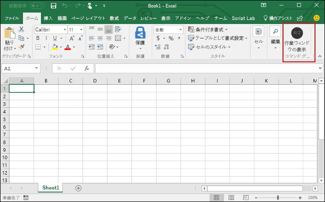

# <a name="build-an-excel-add-in-using-jquery"></a><span data-ttu-id="a30a8-101">jQuery を使用して Excel のアドインを作成する</span><span class="sxs-lookup"><span data-stu-id="a30a8-101">Build an Excel add-in using jQuery</span></span>

<span data-ttu-id="a30a8-102">この記事では、jQuery と Excel の JavaScript API を使用して Excel アドインを作成する手順について説明します。</span><span class="sxs-lookup"><span data-stu-id="a30a8-102">In this article, you'll walk through the process of building an Excel add-in by using jQuery and the Excel JavaScript API.</span></span> 

## <a name="create-the-add-in"></a><span data-ttu-id="a30a8-103">アドインを作成する</span><span class="sxs-lookup"><span data-stu-id="a30a8-103">Create the add-in</span></span> 

[!include[Choose your editor](../includes/quickstart-choose-editor.md)]

# <a name="visual-studiotabvisual-studio"></a>[<span data-ttu-id="a30a8-104">Visual Studio</span><span class="sxs-lookup"><span data-stu-id="a30a8-104">Visual Studio</span></span>](#tab/visual-studio)

### <a name="prerequisites"></a><span data-ttu-id="a30a8-105">前提条件</span><span class="sxs-lookup"><span data-stu-id="a30a8-105">Prerequisites</span></span>

[!include[Quick Start prerequisites](../includes/quickstart-vs-prerequisites.md)]

### <a name="create-the-add-in-project"></a><span data-ttu-id="a30a8-106">アドイン プロジェクトを作成する</span><span class="sxs-lookup"><span data-stu-id="a30a8-106">Create the add-in project</span></span>

1. <span data-ttu-id="a30a8-107">[Visual Studio] メニュー バーで、**[ファイル]**  >  **[新規作成]**  >  **[プロジェクト]** の順に選択します。</span><span class="sxs-lookup"><span data-stu-id="a30a8-107">On the Visual Studio menu bar, choose  **File** > **New** > **Project**.</span></span>
    
2. <span data-ttu-id="a30a8-108">**[Visual C#]** または **[Visual Basic]** の下にあるプロジェクトの種類の一覧で、**[Office/SharePoint]** を展開して、**[アドイン]** を選択し、プロジェクトの種類として **[Excel Web アドイン]** を選択します。</span><span class="sxs-lookup"><span data-stu-id="a30a8-108">In the list of project types under **Visual C#** or **Visual Basic**, expand  **Office/SharePoint**, choose **Add-ins**, and then choose **Excel Web Add-in** as the project type.</span></span> 

3. <span data-ttu-id="a30a8-109">プロジェクトに名前を付けて、**[OK]** を選択します。</span><span class="sxs-lookup"><span data-stu-id="a30a8-109">Name the project, and then choose **OK**.</span></span>

4. <span data-ttu-id="a30a8-110">**[Office アドインの作成]** ダイアログ ウィンドウで、**[新機能を Excel に追加する]** を選択してから、**[完了]** を選択してプロジェクトを作成します。</span><span class="sxs-lookup"><span data-stu-id="a30a8-110">In the **Create Office Add-in** dialog window, choose **Add new functionalities to Excel**, and then choose **Finish** to create the project.</span></span>

5. <span data-ttu-id="a30a8-p101">Visual Studio によってソリューションが作成され、そのソリューションの 2 つのプロジェクトが**ソリューション エクスプローラ**に表示されます。**Home.html** ファイルが Visual Studio で開きます。</span><span class="sxs-lookup"><span data-stu-id="a30a8-p101">Visual Studio creates a solution and its two projects appear in **Solution Explorer**. The **Home.html** file opens in Visual Studio.</span></span>
    
### <a name="explore-the-visual-studio-solution"></a><span data-ttu-id="a30a8-113">Visual Studio ソリューションについて理解する</span><span class="sxs-lookup"><span data-stu-id="a30a8-113">Explore the Visual Studio solution</span></span>

[!include[Description of Visual Studio projects](../includes/quickstart-vs-solution.md)]

### <a name="update-the-code"></a><span data-ttu-id="a30a8-114">コードを更新する</span><span class="sxs-lookup"><span data-stu-id="a30a8-114">Update the code</span></span>

1. <span data-ttu-id="a30a8-p102">**Home.html** は、アドインの作業ウィンドウにレンダリングされる HTML を指定します。**Home.html** は `<body>` 要素を以下のマークアップと置き換え、ファイルを保存します。</span><span class="sxs-lookup"><span data-stu-id="a30a8-p102">**Home.html** specifies the HTML that will be rendered in the add-in's task pane. In **Home.html**, replace the `<body>` element with the following markup and save the file.</span></span>
 
    ```html
    <body class="ms-font-m ms-welcome">
        <div id="content-header">
            <div class="padding">
                <h1>Welcome</h1>
            </div>
        </div>
        <div id="content-main">
            <div class="padding">
                <p>Choose the button below to set the color of the selected range to green.</p>
                <br />
                <h3>Try it out</h3>
                <button class="ms-Button" id="set-color">Set color</button>
            </div>
        </div>
    </body>
    ```

2. <span data-ttu-id="a30a8-p103">Web アプリケーション プロジェクトのルートで **Home.js** ファイルを開きます。このファイルは、アドインのスクリプトを指定します。内容全体を以下のコードで置き換え、ファイルを保存します。</span><span class="sxs-lookup"><span data-stu-id="a30a8-p103">Open the file **Home.js** in the root of the web application project. This file specifies the script for the add-in. Replace the entire contents with the following code and save the file.</span></span> 

    ```js
    'use strict';

    (function () {
        Office.initialize = function (reason) {
            $(document).ready(function () {
                $('#set-color').click(setColor);
            });
        };

        function setColor() {
            Excel.run(function (context) {
                var range = context.workbook.getSelectedRange();
                range.format.fill.color = 'green';

                return context.sync();
            }).catch(function (error) {
                console.log("Error: " + error);
                if (error instanceof OfficeExtension.Error) {
                    console.log("Debug info: " + JSON.stringify(error.debugInfo));
                }
            });
        }
    })();
    ```

3. <span data-ttu-id="a30a8-p104">Web アプリケーション プロジェクトのルートで **Home.css** ファイルを開きます。このファイルは、アドインのカスタム スタイルを指定します。内容全体を以下のコードで置き換え、ファイルを保存します。</span><span class="sxs-lookup"><span data-stu-id="a30a8-p104">Open the file **Home.css** in the root of the web application project. This file specifies the custom styles for the add-in. Replace the entire contents with the following code and save the file.</span></span> 

    ```css
    #content-header {
        background: #2a8dd4;
        color: #fff;
        position: absolute;
        top: 0;
        left: 0;
        width: 100%;
        height: 80px; 
        overflow: hidden;
    }

    #content-main {
        background: #fff;
        position: fixed;
        top: 80px;
        left: 0;
        right: 0;
        bottom: 0;
        overflow: auto; 
    }

    .padding {
        padding: 15px;
    }
    ```

### <a name="update-the-manifest"></a><span data-ttu-id="a30a8-123">マニフェストを更新する</span><span class="sxs-lookup"><span data-stu-id="a30a8-123">Update the manifest</span></span>

1. <span data-ttu-id="a30a8-p105">アドイン プロジェクトで XML マニフェスト ファイルを開きます。このファイルはアドインの設定と機能を定義します。</span><span class="sxs-lookup"><span data-stu-id="a30a8-p105">Open the XML manifest file in the add-in project. This file defines the add-in's settings and capabilities.</span></span>

2. <span data-ttu-id="a30a8-p106">`ProviderName` 要素にはプレースホルダーの値があります。これを自分の名前で置き換えます。</span><span class="sxs-lookup"><span data-stu-id="a30a8-p106">The `ProviderName` element has a placeholder value. Replace it with your name.</span></span>

3. <span data-ttu-id="a30a8-p107">`DisplayName` 要素の `DefaultValue` 属性にはプレースホルダーがあります。これを **My Office アドイン** で置き換えます。</span><span class="sxs-lookup"><span data-stu-id="a30a8-p107">The `DefaultValue` attribute of the `DisplayName` element has a placeholder. Replace it with **My Office Add-in**.</span></span>

4. <span data-ttu-id="a30a8-p108">`Description` 要素の `DefaultValue` 属性にはプレースホルダーがあります。これを **Excel の作業ウィンドウ アドイン** で置き換えます。</span><span class="sxs-lookup"><span data-stu-id="a30a8-p108">The `DefaultValue` attribute of the `Description` element has a placeholder. Replace it with **A task pane add-in for Excel**.</span></span>

5. <span data-ttu-id="a30a8-132">ファイルを保存します。</span><span class="sxs-lookup"><span data-stu-id="a30a8-132">Save the file.</span></span>

    ```xml
    ...
    <ProviderName>John Doe</ProviderName>
    <DefaultLocale>en-US</DefaultLocale>
    <!-- The display name of your add-in. Used on the store and various places of the Office UI such as the add-ins dialog. -->
    <DisplayName DefaultValue="My Office Add-in" />
    <Description DefaultValue="A task pane add-in for Excel"/>
    ...
    ```

### <a name="try-it-out"></a><span data-ttu-id="a30a8-133">試してみる</span><span class="sxs-lookup"><span data-stu-id="a30a8-133">Try it out</span></span>

1. <span data-ttu-id="a30a8-p109">Visual Studio を使用して、新しく作成した Excel アドインをテストします。F5 キーを押すか **[開始]** ボタンをクリックして、リボンに **[作業ウィンドウの表示]** アドイン ボタンが表示された Excel を起動します。アドインは IIS 上でローカルにホストされます。</span><span class="sxs-lookup"><span data-stu-id="a30a8-p109">Using Visual Studio, test the newly created Excel add-in by pressing F5 or choosing the **Start** button to launch Excel with the **Show Taskpane** add-in button displayed in the ribbon. The add-in will be hosted locally on IIS.</span></span>

2. <span data-ttu-id="a30a8-136">Excel で、**[ホーム]** タブを選択し、リボンの **[作業ウィンドウの表示]** ボタンをクリックして、アドインの作業ウィンドウを開きます。</span><span class="sxs-lookup"><span data-stu-id="a30a8-136">In Excel, choose the **Home** tab, and then choose the **Show Taskpane** button in the ribbon to open the add-in task pane.</span></span>

    

3. <span data-ttu-id="a30a8-138">ワークシート内で任意のセル範囲を選択します。</span><span class="sxs-lookup"><span data-stu-id="a30a8-138">Select any range of cells in the worksheet.</span></span>

4. <span data-ttu-id="a30a8-139">作業ウィンドウで、**[色の設定]** ボタンをクリックして、選択範囲の色を緑に設定します。</span><span class="sxs-lookup"><span data-stu-id="a30a8-139">In the task pane, choose the **Set color** button to set the color of the selected range to green.</span></span>

    

# <a name="any-editortabvisual-studio-code"></a>[<span data-ttu-id="a30a8-141">任意のエディター</span><span class="sxs-lookup"><span data-stu-id="a30a8-141">Any editor</span></span>](#tab/visual-studio-code)

### <a name="prerequisites"></a><span data-ttu-id="a30a8-142">前提条件</span><span class="sxs-lookup"><span data-stu-id="a30a8-142">Prerequisites</span></span>

- [<span data-ttu-id="a30a8-143">Node.js</span><span class="sxs-lookup"><span data-stu-id="a30a8-143">Node.js</span></span>](https://nodejs.org)

- <span data-ttu-id="a30a8-144">[Yeoman](https://github.com/yeoman/yo) の最新バージョンと [Office アドイン用の Yeoman ジェネレーター](https://github.com/OfficeDev/generator-office)をグローバルにインストールします。</span><span class="sxs-lookup"><span data-stu-id="a30a8-144">Install the latest version of [Yeoman](https://github.com/yeoman/yo) and the [Yeoman generator for Office Add-ins](https://github.com/OfficeDev/generator-office) globally.</span></span>
    ```bash
    npm install -g yo generator-office
    ```

### <a name="create-the-web-app"></a><span data-ttu-id="a30a8-145">Web アプリを作成する</span><span class="sxs-lookup"><span data-stu-id="a30a8-145">Create the web app</span></span>

1. <span data-ttu-id="a30a8-p110">ローカル ドライブにフォルダーを作成し、**my-addin** という名前を付けます。ここにアプリのファイルを作成します。</span><span class="sxs-lookup"><span data-stu-id="a30a8-p110">Create a folder on your local drive and name it **my-addin**. This is where you'll create the files for your app.</span></span>

2. <span data-ttu-id="a30a8-148">アプリ フォルダーに移動します。</span><span class="sxs-lookup"><span data-stu-id="a30a8-148">Navigate to your app folder.</span></span>

    ```bash
    cd my-addin
    ```

3. <span data-ttu-id="a30a8-p111">Yeoman ジェネレーターを使用して、アドインのマニフェスト ファイルを生成します。以下のコマンドを実行して、以下のスクリーンショットに示すようにプロンプトに応答します。</span><span class="sxs-lookup"><span data-stu-id="a30a8-p111">Use the Yeoman generator to generate the manifest file for your add-in. Run the following command and then answer the prompts as shown in the following screenshot:</span></span>

    ```bash
    yo office
    ```

    - <span data-ttu-id="a30a8-151">**プロジェクトの種類を選択します。** `Office Add-in project using Jquery framework`</span><span class="sxs-lookup"><span data-stu-id="a30a8-151">**Choose a project type:** `Office Add-in project using Jquery framework`</span></span>
    - <span data-ttu-id="a30a8-152">**Choose a script type: (スクリプト タイプを選択してください)** `Javascript`</span><span class="sxs-lookup"><span data-stu-id="a30a8-152">**Choose a script type:** `Javascript`</span></span>
    - <span data-ttu-id="a30a8-153">**What would you want to name your add-in?: (アドインの名前を何にしますか)** `My Office Add-in`</span><span class="sxs-lookup"><span data-stu-id="a30a8-153">**What do you want to name your add-in?:** `My Office Add-in`</span></span>
    - <span data-ttu-id="a30a8-154">**Which Office client application would you like to support?: (どの Office クライアント アプリケーションをサポートしますか)** `Excel`</span><span class="sxs-lookup"><span data-stu-id="a30a8-154">**Which Office client application would you like to support?:** `Excel`</span></span>

    
    
    <span data-ttu-id="a30a8-156">ウィザードが完了すると、ジェネレーターはプロジェクトを作成し、サポートする Node コンポーネントをインストールします。</span><span class="sxs-lookup"><span data-stu-id="a30a8-156">After you complete the wizard, the generator will create the project and install supporting Node components.</span></span>

4. <span data-ttu-id="a30a8-157">Web アプリケーション プロジェクトのルート フォルダーに移動します。</span><span class="sxs-lookup"><span data-stu-id="a30a8-157">Navigate to the root folder of the web application project.</span></span>

    ```bash
    cd "My Office Add-in"
    ```

5. <span data-ttu-id="a30a8-p112">コード エディターで、プロジェクトのルートに**index.html** を開きます。このファイルは、アドインの作業ウィンドウでレンダリングされる HTML を指定します。</span><span class="sxs-lookup"><span data-stu-id="a30a8-p112">In your code editor, open **index.html** in the root of the project. This file specifies the HTML that will be rendered in the add-in's task pane.</span></span> 
 
6. <span data-ttu-id="a30a8-160">**index.html** 内で、生成された `header` タグを以下のマークアップに置き換えます。</span><span class="sxs-lookup"><span data-stu-id="a30a8-160">Within **index.html**, replace the generated `header` tag with the following markup.</span></span>
 
    ```html
    <div id="content-header">
        <div class="padding">
            <h1>Welcome</h1>
        </div>
    </div>
    ```

7. <span data-ttu-id="a30a8-161">**index.html** 内で、生成された `main` タグを以下のマークアップに置き換えて、ファイルを保存します。</span><span class="sxs-lookup"><span data-stu-id="a30a8-161">Within **index.html**, replace the generated `main` tag with the following markup, and save the file.</span></span>

    ```html
    <div id="content-main">
        <div class="padding">
            <p>Choose the button below to set the color of the selected range to green.</p>
            <br />
            <h3>Try it out</h3>
            <button class="ms-Button" id="set-color">Set color</button>
        </div>
    </div>
    ```

8. <span data-ttu-id="a30a8-p113">ファイル **src\index.js** を開いてアドインのスクリプトを指定します。内容全体を以下のコードで置き換え、ファイルを保存します。</span><span class="sxs-lookup"><span data-stu-id="a30a8-p113">Open the file **src\index.js** to specify the script for the add-in. Replace the entire contents with the following code and save the file.</span></span>

    ```js
    'use strict';
    
    (function () {
        Office.initialize = function (reason) {
            $(document).ready(function () {
                $('#set-color').click(setColor);
            });
        };

        function setColor() {
            Excel.run(function (context) {
                var range = context.workbook.getSelectedRange();
                range.format.fill.color = 'green';

                return context.sync();
            }).catch(function (error) {
                console.log("Error: " + error);
                if (error instanceof OfficeExtension.Error) {
                    console.log("Debug info: " + JSON.stringify(error.debugInfo));
                }
            });
        }
    })();
    ```

9. <span data-ttu-id="a30a8-p114">ファイル **app.css** を開いてアドインのカスタム スタイルを指定します。内容全体を以下のコードで置き換え、ファイルを保存します。</span><span class="sxs-lookup"><span data-stu-id="a30a8-p114">Open the file **app.css** to specify the custom styles for the add-in. Replace the entire contents with the following code and save the file.</span></span>

    ```css
    #content-header {
        background: #2a8dd4;
        color: #fff;
        position: absolute;
        top: 0;
        left: 0;
        width: 100%;
        height: 80px; 
        overflow: hidden;
    }

    #content-main {
        background: #fff;
        position: fixed;
        top: 80px;
        left: 0;
        right: 0;
        bottom: 0;
        overflow: auto; 
    }

    .padding {
        padding: 15px;
    }
    ```

### <a name="update-the-manifest"></a><span data-ttu-id="a30a8-166">マニフェストを更新する</span><span class="sxs-lookup"><span data-stu-id="a30a8-166">Update the manifest</span></span>

1. <span data-ttu-id="a30a8-167">ファイル **my-office-add-in-manifest.xml** ファイルを開いて、アドインの設定と機能を定義します。</span><span class="sxs-lookup"><span data-stu-id="a30a8-167">Open the file **my-office-add-in-manifest.xml** to define the add-in's settings and capabilities.</span></span> 

2. <span data-ttu-id="a30a8-p115">`ProviderName` 要素にはプレースホルダーの値があります。これを自分の名前で置き換えます。</span><span class="sxs-lookup"><span data-stu-id="a30a8-p115">The `ProviderName` element has a placeholder value. Replace it with your name.</span></span>

3. <span data-ttu-id="a30a8-p116">`DisplayName` 要素の `DefaultValue` 属性にはプレースホルダーがあります。これを **My Office アドイン** で置き換えます。</span><span class="sxs-lookup"><span data-stu-id="a30a8-p116">The `DefaultValue` attribute of the `DisplayName` element has a placeholder. Replace it with **My Office Add-in**.</span></span>

4. <span data-ttu-id="a30a8-p117">`Description` 要素の `DefaultValue` 属性にはプレースホルダーがあります。これを **Excel の作業ウィンドウ アドイン** で置き換えます。</span><span class="sxs-lookup"><span data-stu-id="a30a8-p117">The `DefaultValue` attribute of the `Description` element has a placeholder. Replace it with **A task pane add-in for Excel**.</span></span>

5. <span data-ttu-id="a30a8-174">ファイルを保存します。</span><span class="sxs-lookup"><span data-stu-id="a30a8-174">Save the file.</span></span>

    ```xml
    ...
    <ProviderName>John Doe</ProviderName>
    <DefaultLocale>en-US</DefaultLocale>
    <!-- The display name of your add-in. Used on the store and various places of the Office UI such as the add-ins dialog. -->
    <DisplayName DefaultValue="My Office Add-in" />
    <Description DefaultValue="A task pane add-in for Excel"/>
    ...
    ```

### <a name="start-the-dev-server"></a><span data-ttu-id="a30a8-175">開発用サーバーを起動する</span><span class="sxs-lookup"><span data-stu-id="a30a8-175">Start the dev server</span></span>

[!include[Start server section](../includes/quickstart-yo-start-server.md)] 

### <a name="try-it-out"></a><span data-ttu-id="a30a8-176">お試しください</span><span class="sxs-lookup"><span data-stu-id="a30a8-176">Try it out</span></span>

1. <span data-ttu-id="a30a8-177">アドインを実行するのに使用するプラットフォームの手順に従い、Excel 内でアドインをサイドロードします。</span><span class="sxs-lookup"><span data-stu-id="a30a8-177">Follow the instructions for the platform you'll use to run your add-in to sideload the add-in within Excel.</span></span>

    - <span data-ttu-id="a30a8-178">Windows: [Windows で Office アドインをサイドロードする](../testing/create-a-network-shared-folder-catalog-for-task-pane-and-content-add-ins.md)</span><span class="sxs-lookup"><span data-stu-id="a30a8-178">Windows: [Sideload Office Add-ins on Windows](../testing/create-a-network-shared-folder-catalog-for-task-pane-and-content-add-ins.md)</span></span>
    - <span data-ttu-id="a30a8-179">Excel Online:[Office Online で Office アドインをサイドロードする](../testing/sideload-office-add-ins-for-testing.md#sideload-an-office-add-in-on-office-online)</span><span class="sxs-lookup"><span data-stu-id="a30a8-179">Excel Online: [Sideload Office Add-ins in Office Online](../testing/sideload-office-add-ins-for-testing.md#sideload-an-office-add-in-on-office-online)</span></span>
    - <span data-ttu-id="a30a8-180">iPad および Mac: [iPad と Mac で Office アドインをサイドロードする](../testing/sideload-an-office-add-in-on-ipad-and-mac.md)</span><span class="sxs-lookup"><span data-stu-id="a30a8-180">iPad and Mac: [Sideload Office Add-ins on iPad and Mac](../testing/sideload-an-office-add-in-on-ipad-and-mac.md)</span></span>

2. <span data-ttu-id="a30a8-181">Excel で、**[ホーム]** タブを選択し、リボンの **[作業ウィンドウの表示]** ボタンをクリックして、アドインの作業ウィンドウを開きます。</span><span class="sxs-lookup"><span data-stu-id="a30a8-181">In Excel, choose the **Home** tab, and then choose the **Show Taskpane** button in the ribbon to open the add-in task pane.</span></span>

    

3. <span data-ttu-id="a30a8-183">ワークシート内で任意のセル範囲を選択します。</span><span class="sxs-lookup"><span data-stu-id="a30a8-183">Select any range of cells in the worksheet.</span></span>

4. <span data-ttu-id="a30a8-184">作業ウィンドウで、**[色の設定]** ボタンをクリックして、選択範囲の色を緑に設定します。</span><span class="sxs-lookup"><span data-stu-id="a30a8-184">In the task pane, choose the **Set color** button to set the color of the selected range to green.</span></span>

    

---

## <a name="next-steps"></a><span data-ttu-id="a30a8-186">次の手順</span><span class="sxs-lookup"><span data-stu-id="a30a8-186">Next steps</span></span>

<span data-ttu-id="a30a8-p118">これで完了です。jQuery を使用して Excel アドインが正常に作成されました。次に、Excel アドインの機能の詳細について説明します。Excel アドインのチュートリアルに従って、より複雑なアドインを作成します。</span><span class="sxs-lookup"><span data-stu-id="a30a8-p118">Congratulations, you've successfully created an Excel add-in using jQuery! Next, learn more about the capabilities of an Excel add-in and build a more complex add-in by following along with the Excel add-in tutorial.</span></span>

> [!div class="nextstepaction"]
> [<span data-ttu-id="a30a8-189">Excel アドインのチュートリアル</span><span class="sxs-lookup"><span data-stu-id="a30a8-189">Excel add-in tutorial</span></span>](../tutorials/excel-tutorial.yml)

## <a name="see-also"></a><span data-ttu-id="a30a8-190">関連項目</span><span class="sxs-lookup"><span data-stu-id="a30a8-190">See also</span></span>

* [<span data-ttu-id="a30a8-191">Excel アドインのチュートリアル</span><span class="sxs-lookup"><span data-stu-id="a30a8-191">Excel add-in tutorial</span></span>](../tutorials/excel-tutorial-create-table.md)
* [<span data-ttu-id="a30a8-192">Excel の JavaScript API を使用した基本的なプログラミングの概念</span><span class="sxs-lookup"><span data-stu-id="a30a8-192">Fundamental programming concepts with the Excel JavaScript API</span></span>](../excel/excel-add-ins-core-concepts.md)
* [<span data-ttu-id="a30a8-193">Excel アドインのコード サンプル</span><span class="sxs-lookup"><span data-stu-id="a30a8-193">Excel add-in code samples</span></span>](https://developer.microsoft.com/office/gallery/?filterBy=Samples,Excel)
* [<span data-ttu-id="a30a8-194">Excel JavaScript API リファレンス</span><span class="sxs-lookup"><span data-stu-id="a30a8-194">Excel JavaScript API reference</span></span>](https://docs.microsoft.com/javascript/office/overview/excel-add-ins-reference-overview?view=office-js)
