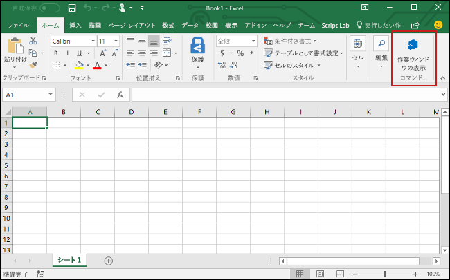

# <a name="build-an-excel-add-in-using-jquery"></a><span data-ttu-id="88f19-101">jQuery を使用して Excel のアドインを作成する</span><span class="sxs-lookup"><span data-stu-id="88f19-101">Build an Excel add-in using jQuery</span></span>

<span data-ttu-id="88f19-102">この記事では、jQuery と Excel の JavaScript API を使用して Excel アドインを構築する手順について説明します。</span><span class="sxs-lookup"><span data-stu-id="88f19-102">In this article, you'll walk through the process of building an Excel add-in by using jQuery and the Excel JavaScript API.</span></span> 

## <a name="create-the-add-in"></a><span data-ttu-id="88f19-103">アドインを作成する</span><span class="sxs-lookup"><span data-stu-id="88f19-103">Create the add-in</span></span> 

[!include[Choose your editor](../includes/quickstart-choose-editor.md)]

# <a name="visual-studiotabvisual-studio"></a>[<span data-ttu-id="88f19-104">Visual Studio</span><span class="sxs-lookup"><span data-stu-id="88f19-104">Visual Studio</span></span>](#tab/visual-studio)

### <a name="prerequisites"></a><span data-ttu-id="88f19-105">前提条件</span><span class="sxs-lookup"><span data-stu-id="88f19-105">Prerequisites</span></span>

[!include[Quick Start prerequisites](../includes/quickstart-vs-prerequisites.md)]

### <a name="create-the-add-in-project"></a><span data-ttu-id="88f19-106">アドイン プロジェクトの作成</span><span class="sxs-lookup"><span data-stu-id="88f19-106">Create the add-in project</span></span>

1. <span data-ttu-id="88f19-107">[Visual Studio] メニュー バーで、**[ファイル]**  >  **[新規作成]**  >  **[プロジェクト]** の順に選択します。</span><span class="sxs-lookup"><span data-stu-id="88f19-107">On the Visual Studio menu bar, choose  **File** > **New** > **Project**.</span></span>
    
2. <span data-ttu-id="88f19-108">**[Visual C#]** または **[Visual Basic]** の下にあるプロジェクトの種類の一覧で、**[Office/SharePoint]** を展開して、**[アドイン]** を選択し、プロジェクトの種類として **[Excel Web アドイン]** を選択します。</span><span class="sxs-lookup"><span data-stu-id="88f19-108">In the list of project types under **Visual C#** or **Visual Basic**, expand  **Office/SharePoint**, choose **Add-ins**, and then choose **Excel Web Add-in** as the project type.</span></span> 

3. <span data-ttu-id="88f19-109">プロジェクトに名前を付けて、**[OK]** を選択します。</span><span class="sxs-lookup"><span data-stu-id="88f19-109">Name the project, and then choose **OK**.</span></span>

4. <span data-ttu-id="88f19-110">**[Office アドインの作成]** ダイアログ ウィンドウで、**[新機能を Excel に追加する]** を選択してから、**[完了]** を選択してプロジェクトを作成します。</span><span class="sxs-lookup"><span data-stu-id="88f19-110">In the **Create Office Add-in** dialog window, choose **Add new functionalities to Excel**, and then choose **Finish** to create the project.</span></span>

5. <span data-ttu-id="88f19-p101">Visual Studio によってソリューションとその 2 つのプロジェクトが作成され、**ソリューション エクスプローラー**に表示されます。**Home.html** ファイルが Visual Studio で開かれます。</span><span class="sxs-lookup"><span data-stu-id="88f19-p101">Visual Studio creates a solution and its two projects appear in **Solution Explorer**. The **Home.html** file opens in Visual Studio.</span></span>
    
### <a name="explore-the-visual-studio-solution"></a><span data-ttu-id="88f19-113">Visual Studio ソリューションについて理解する</span><span class="sxs-lookup"><span data-stu-id="88f19-113">Explore the Visual Studio solution</span></span>

[!include[Description of Visual Studio projects](../includes/quickstart-vs-solution.md)]

### <a name="update-the-code"></a><span data-ttu-id="88f19-114">コードを更新する</span><span class="sxs-lookup"><span data-stu-id="88f19-114">Update the code</span></span>

1. <span data-ttu-id="88f19-115">**Home.html** では、アドインの作業ウィンドウにレンダリングされる HTML を指定します。</span><span class="sxs-lookup"><span data-stu-id="88f19-115">**Home.html** specifies the HTML that will be rendered in the add-in's task pane.</span></span> <span data-ttu-id="88f19-116">**Home.html** で、`<body>` 要素を次のマークアップに置き換えて、ファイルを保存します。</span><span class="sxs-lookup"><span data-stu-id="88f19-116">In **Home.html**, replace the `<body>` element with the following markup and save the file.</span></span>
 
    ```html
    <body class="ms-font-m ms-welcome">
        <div id="content-header">
            <div class="padding">
                <h1>Welcome</h1>
            </div>
        </div>
        <div id="content-main">
            <div class="padding">
                <p>Choose the button below to set the color of the selected range to green.</p>
                <br />
                <h3>Try it out</h3>
                <button class="ms-Button" id="set-color">Set color</button>
            </div>
        </div>
    </body>
    ```

2. <span data-ttu-id="88f19-117">Web アプリケーション プロジェクトのルートにあるファイル **Home.js** を開きます。</span><span class="sxs-lookup"><span data-stu-id="88f19-117">Open the file **Home.js** in the root of the web application project.</span></span> <span data-ttu-id="88f19-118">このファイルは、アドイン用のスクリプトを指定します。</span><span class="sxs-lookup"><span data-stu-id="88f19-118">This file specifies the script for the add-in.</span></span> <span data-ttu-id="88f19-119">すべての内容を次のコードに置き換え、ファイルを保存します。</span><span class="sxs-lookup"><span data-stu-id="88f19-119">Replace the entire contents with the following code and save the file.</span></span> 

    ```js
    'use strict';

    (function () {
        Office.initialize = function (reason) {
            $(document).ready(function () {
                $('#set-color').click(setColor);
            });
        };

        function setColor() {
            Excel.run(function (context) {
                var range = context.workbook.getSelectedRange();
                range.format.fill.color = 'green';

                return context.sync();
            }).catch(function (error) {
                console.log("Error: " + error);
                if (error instanceof OfficeExtension.Error) {
                    console.log("Debug info: " + JSON.stringify(error.debugInfo));
                }
            });
        }
    })();
    ```

3. <span data-ttu-id="88f19-120">Web アプリケーション プロジェクトのルートにあるファイル **Home.css** を開きます。</span><span class="sxs-lookup"><span data-stu-id="88f19-120">Open the file **Home.css** in the root of the web application project.</span></span> <span data-ttu-id="88f19-121">このファイルは、アドイン用のユーザー設定のスタイルを指定します。</span><span class="sxs-lookup"><span data-stu-id="88f19-121">This file specifies the custom styles for the add-in.</span></span> <span data-ttu-id="88f19-122">すべての内容を次のコードに置き換え、ファイルを保存します。</span><span class="sxs-lookup"><span data-stu-id="88f19-122">Replace the entire contents with the following code and save the file.</span></span> 

    ```css
    #content-header {
        background: #2a8dd4;
        color: #fff;
        position: absolute;
        top: 0;
        left: 0;
        width: 100%;
        height: 80px; 
        overflow: hidden;
    }

    #content-main {
        background: #fff;
        position: fixed;
        top: 80px;
        left: 0;
        right: 0;
        bottom: 0;
        overflow: auto; 
    }

    .padding {
        padding: 15px;
    }
    ```

### <a name="update-the-manifest"></a><span data-ttu-id="88f19-123">マニフェストを更新する</span><span class="sxs-lookup"><span data-stu-id="88f19-123">Update the manifest</span></span>

1. <span data-ttu-id="88f19-124">アドイン プロジェクト内の XML マニフェスト ファイルを開きます。</span><span class="sxs-lookup"><span data-stu-id="88f19-124">Open the XML manifest file in the Add-in project.</span></span> <span data-ttu-id="88f19-125">このファイルは、アドインの設定と機能を定義します。</span><span class="sxs-lookup"><span data-stu-id="88f19-125">This file defines the add-in's settings and capabilities.</span></span>

2. <span data-ttu-id="88f19-126">要素にはプレースホルダー値が含まれています。`ProviderName`</span><span class="sxs-lookup"><span data-stu-id="88f19-126">The `ProviderName` element has a placeholder value.</span></span> <span data-ttu-id="88f19-127">それを自分の名前に置き換えます。</span><span class="sxs-lookup"><span data-stu-id="88f19-127">Replace it with your name.</span></span>

3. <span data-ttu-id="88f19-128">要素の `DefaultValue` 属性にはプレースホルダー値が含まれています。`DisplayName`</span><span class="sxs-lookup"><span data-stu-id="88f19-128">The `DefaultValue` attribute of the `DisplayName` element has a placeholder.</span></span> <span data-ttu-id="88f19-129">これは、**My Office Add-in** に置き換えてください。</span><span class="sxs-lookup"><span data-stu-id="88f19-129">Replace it with **My Office Add-in**.</span></span>

4. <span data-ttu-id="88f19-130">要素の `DefaultValue` 属性にはプレースホルダー値が含まれています。`Description`</span><span class="sxs-lookup"><span data-stu-id="88f19-130">The `DefaultValue` attribute of the `Description` element has a placeholder.</span></span> <span data-ttu-id="88f19-131">これは、**A task pane add-in for Excel** に置き換えてください。</span><span class="sxs-lookup"><span data-stu-id="88f19-131">Replace it with **A task pane add-in for Excel**.</span></span>

5. <span data-ttu-id="88f19-132">ファイルを保存します。</span><span class="sxs-lookup"><span data-stu-id="88f19-132">Save the file.</span></span>

    ```xml
    ...
    <ProviderName>John Doe</ProviderName>
    <DefaultLocale>en-US</DefaultLocale>
    <!-- The display name of your add-in. Used on the store and various places of the Office UI such as the add-ins dialog. -->
    <DisplayName DefaultValue="My Office Add-in" />
    <Description DefaultValue="A task pane add-in for Excel"/>
    ...
    ```

### <a name="try-it-out"></a><span data-ttu-id="88f19-133">お試しください</span><span class="sxs-lookup"><span data-stu-id="88f19-133">Try it out</span></span>

1. <span data-ttu-id="88f19-p109">Visual Studio を使用して、新しく作成した Excel アドインをテストします。そのために、F5 キーを押すか **[開始]** ボタンをクリックして、リボンに **[作業ウィンドウの表示]** アドイン ボタンが表示された Excel を起動します。アドインは IIS 上でローカルにホストされます。</span><span class="sxs-lookup"><span data-stu-id="88f19-p109">Using Visual Studio, test the newly created Excel add-in by pressing F5 or choosing the **Start** button to launch Excel with the **Show Taskpane** add-in button displayed in the ribbon. The add-in will be hosted locally on IIS.</span></span>

2. <span data-ttu-id="88f19-136">Excel で、**[ホーム]** タブを選択し、リボンの **[作業ウィンドウの表示]** ボタンをクリックして、アドインの作業ウィンドウを開きます。</span><span class="sxs-lookup"><span data-stu-id="88f19-136">In Excel, choose the **Home** tab, and then choose the **Show Taskpane** button in the ribbon to open the add-in task pane.</span></span>

    

3. <span data-ttu-id="88f19-138">ワークシート内で任意のセルの範囲を選択します。</span><span class="sxs-lookup"><span data-stu-id="88f19-138">Select any range of cells in the worksheet.</span></span>

4. <span data-ttu-id="88f19-139">作業ウィンドウで、**[色の設定]** ボタンをクリックして、選択範囲の色を緑に設定します。</span><span class="sxs-lookup"><span data-stu-id="88f19-139">In the task pane, choose the **Set color** button to set the color of the selected range to green.</span></span>

    

# <a name="any-editortabvisual-studio-code"></a>[<span data-ttu-id="88f19-141">任意のエディター</span><span class="sxs-lookup"><span data-stu-id="88f19-141">Any editor</span></span>](#tab/visual-studio-code)

### <a name="prerequisites"></a><span data-ttu-id="88f19-142">前提条件</span><span class="sxs-lookup"><span data-stu-id="88f19-142">Prerequisites</span></span>

- [<span data-ttu-id="88f19-143">Node.js</span><span class="sxs-lookup"><span data-stu-id="88f19-143">Node.js</span></span>](https://nodejs.org)

- <span data-ttu-id="88f19-144">[Yeoman](https://github.com/yeoman/yo) の最新バージョンと [Office アドイン用の Yeoman ジェネレーター](https://github.com/OfficeDev/generator-office)をグローバルにインストールします。</span><span class="sxs-lookup"><span data-stu-id="88f19-144">Install the latest version of [Yeoman](https://github.com/yeoman/yo) and the [Yeoman generator for Office Add-ins](https://github.com/OfficeDev/generator-office) globally.</span></span>

    ```bash
    npm install -g yo generator-office
    ```

### <a name="create-the-web-app"></a><span data-ttu-id="88f19-145">Web アプリを作成する</span><span class="sxs-lookup"><span data-stu-id="88f19-145">Create the web app</span></span>

1. <span data-ttu-id="88f19-146">ローカル ドライブにフォルダーを作成し、**my-addin** という名前を付けます。</span><span class="sxs-lookup"><span data-stu-id="88f19-146">Create a folder on your local drive and name it **my-addin**.</span></span> <span data-ttu-id="88f19-147">ここにアプリのファイルを作成します。</span><span class="sxs-lookup"><span data-stu-id="88f19-147">This is where you'll create the files for your app.</span></span>

2. <span data-ttu-id="88f19-148">アプリ フォルダーに移動します。</span><span class="sxs-lookup"><span data-stu-id="88f19-148">Navigate to your app folder.</span></span>

    ```bash
    cd my-addin
    ```

3. <span data-ttu-id="88f19-149">Yeoman ジェネレーター使用して、アドインのマニフェスト ファイルを生成します。</span><span class="sxs-lookup"><span data-stu-id="88f19-149">Use the Yeoman generator to generate the manifest file for your add-in.</span></span> <span data-ttu-id="88f19-150">次のコマンドを実行し、以下のスクリーンショットに示すとおり、プロンプトに応答します。</span><span class="sxs-lookup"><span data-stu-id="88f19-150">Run the following command and then answer the prompts as shown in the following screenshot:</span></span>

    ```bash
    yo office
    ```

    - <span data-ttu-id="88f19-151">**Would you like to create a new subfolder for your project?: (プロジェクト用の新しいサブフォルダーを作成しますか)** `No`</span><span class="sxs-lookup"><span data-stu-id="88f19-151">**Would you like to create a new subfolder for your project?:** `No`</span></span>
    - <span data-ttu-id="88f19-152">**What would you want to name your add-in?: (アドインの名前を何にしますか)** `My Office Add-in`</span><span class="sxs-lookup"><span data-stu-id="88f19-152">**What do you want to name your add-in?:** `My Office Add-in`</span></span>
    - <span data-ttu-id="88f19-153">**Which Office client application would you like to support?: (どの Office クライアント アプリケーションをサポートしますか)** `Excel`</span><span class="sxs-lookup"><span data-stu-id="88f19-153">**Which Office client application would you like to support?:** `Excel`</span></span>
    - <span data-ttu-id="88f19-154">**Would you like to create a new add-in?: (新しいアドインを作成しますか)** `Yes`</span><span class="sxs-lookup"><span data-stu-id="88f19-154">**Would you like to create a new add-in?:** `Yes`</span></span>
    - <span data-ttu-id="88f19-155">**Would you like to use TypeScript?: (TypeScript を使用しますか)** `No`</span><span class="sxs-lookup"><span data-stu-id="88f19-155">**Would you like to use TypeScript?:** `No`</span></span>
    - <span data-ttu-id="88f19-156">**Choose a framework: (フレームワークを選択してください)** `Jquery`</span><span class="sxs-lookup"><span data-stu-id="88f19-156">**Choose a framework:** `Jquery`</span></span>

    <span data-ttu-id="88f19-p112">次に、**resource.html** を開くかどうかを確認するメッセージがジェネレーターによって表示されます。このチュートリアルでは開く必要はありませんが、関心がある場合は自由に開くことができます。[はい] または [いいえ] を選択してウィザードを完了し、ジェネレーターが作業を実行することを許可します。</span><span class="sxs-lookup"><span data-stu-id="88f19-p112">The generator will then ask you if you want to open **resource.html**. It isn't necessary to open it for this tutorial, but feel free to open it if you're curious! Choose yes or no to complete the wizard and allow the generator to do its work.</span></span>

    


4. <span data-ttu-id="88f19-161">コード エディターで、プロジェクトのルートにある **index.html** を開きます。</span><span class="sxs-lookup"><span data-stu-id="88f19-161">In your code editor, open **index.html** in the root of the project.</span></span> <span data-ttu-id="88f19-162">このファイルでは、アドインの作業ウィンドウにレンダリングされる HTML を指定します。</span><span class="sxs-lookup"><span data-stu-id="88f19-162">This file specifies the HTML that will be rendered in the add-in's task pane.</span></span> 
 
5. <span data-ttu-id="88f19-163">**index.html** 内で、生成された `header` タグを次に示すマークアップに置き換えます。</span><span class="sxs-lookup"><span data-stu-id="88f19-163">Within **index.html**, replace the generated `header` tag with the following markup.</span></span>
 
    ```html
    <div id="content-header">
        <div class="padding">
            <h1>Welcome</h1>
        </div>
    </div>
    ```

6. <span data-ttu-id="88f19-164">**index.html** 内で、生成された `main` タグを次に示すマークアップに置き換えて、ファイルを保存します。</span><span class="sxs-lookup"><span data-stu-id="88f19-164">Within **index.html**, replace the generated `main` tag with the following markup, and save the file.</span></span>

    ```html
    <div id="content-main">
        <div class="padding">
            <p>Choose the button below to set the color of the selected range to green.</p>
            <br />
            <h3>Try it out</h3>
            <button class="ms-Button" id="set-color">Set color</button>
        </div>
    </div>
    ```

7. <span data-ttu-id="88f19-165">**app.js** ファイルを開いて、アドインのスクリプトを指定します。</span><span class="sxs-lookup"><span data-stu-id="88f19-165">Open the file **app.js** to specify the script for the add-in.</span></span> <span data-ttu-id="88f19-166">すべての内容を次のコードに置き換え、ファイルを保存します。</span><span class="sxs-lookup"><span data-stu-id="88f19-166">Replace the entire contents with the following code and save the file.</span></span>

    ```js
    'use strict';
    
    (function () {
        Office.initialize = function (reason) {
            $(document).ready(function () {
                $('#set-color').click(setColor);
            });
        };

        function setColor() {
            Excel.run(function (context) {
                var range = context.workbook.getSelectedRange();
                range.format.fill.color = 'green';

                return context.sync();
            }).catch(function (error) {
                console.log("Error: " + error);
                if (error instanceof OfficeExtension.Error) {
                    console.log("Debug info: " + JSON.stringify(error.debugInfo));
                }
            });
        }
    })();
    ```

8. <span data-ttu-id="88f19-167">**app.css** ファイルを開いて、アドインのカスタム スタイルを指定します。</span><span class="sxs-lookup"><span data-stu-id="88f19-167">Open the file **app.css** to specify the custom styles for the add-in.</span></span> <span data-ttu-id="88f19-168">すべての内容を次のコードに置き換え、ファイルを保存します。</span><span class="sxs-lookup"><span data-stu-id="88f19-168">Replace the entire contents with the following code and save the file.</span></span>

    ```css
    #content-header {
        background: #2a8dd4;
        color: #fff;
        position: absolute;
        top: 0;
        left: 0;
        width: 100%;
        height: 80px; 
        overflow: hidden;
    }

    #content-main {
        background: #fff;
        position: fixed;
        top: 80px;
        left: 0;
        right: 0;
        bottom: 0;
        overflow: auto; 
    }

    .padding {
        padding: 15px;
    }
    ```

### <a name="update-the-manifest"></a><span data-ttu-id="88f19-169">マニフェストを更新する</span><span class="sxs-lookup"><span data-stu-id="88f19-169">Update the manifest</span></span>

1. <span data-ttu-id="88f19-170">**my-office-add-in-manifest.xml** ファイルを開いて、アドインの設定と機能を定義します。</span><span class="sxs-lookup"><span data-stu-id="88f19-170">Open the file **my-office-add-in-manifest.xml** to define the add-in's settings and capabilities.</span></span> 

2. <span data-ttu-id="88f19-171">要素にはプレースホルダー値が含まれています。`ProviderName`</span><span class="sxs-lookup"><span data-stu-id="88f19-171">The `ProviderName` element has a placeholder value.</span></span> <span data-ttu-id="88f19-172">それを自分の名前に置き換えます。</span><span class="sxs-lookup"><span data-stu-id="88f19-172">Replace it with your name.</span></span>

3. <span data-ttu-id="88f19-173">要素の `DefaultValue` 属性にはプレースホルダー値が含まれています。`DisplayName`</span><span class="sxs-lookup"><span data-stu-id="88f19-173">The `DefaultValue` attribute of the `DisplayName` element has a placeholder.</span></span> <span data-ttu-id="88f19-174">これは、**My Office Add-in** に置き換えてください。</span><span class="sxs-lookup"><span data-stu-id="88f19-174">Replace it with **My Office Add-in**.</span></span>

4. <span data-ttu-id="88f19-175">要素の `DefaultValue` 属性にはプレースホルダー値が含まれています。`Description`</span><span class="sxs-lookup"><span data-stu-id="88f19-175">The `DefaultValue` attribute of the `Description` element has a placeholder.</span></span> <span data-ttu-id="88f19-176">これは、**A task pane add-in for Excel** に置き換えてください。</span><span class="sxs-lookup"><span data-stu-id="88f19-176">Replace it with **A task pane add-in for Excel**.</span></span>

5. <span data-ttu-id="88f19-177">ファイルを保存します。</span><span class="sxs-lookup"><span data-stu-id="88f19-177">Save the file.</span></span>

    ```xml
    ...
    <ProviderName>John Doe</ProviderName>
    <DefaultLocale>en-US</DefaultLocale>
    <!-- The display name of your add-in. Used on the store and various places of the Office UI such as the add-ins dialog. -->
    <DisplayName DefaultValue="My Office Add-in" />
    <Description DefaultValue="A task pane add-in for Excel"/>
    ...
    ```

### <a name="start-the-dev-server"></a><span data-ttu-id="88f19-178">開発用サーバーの起動</span><span class="sxs-lookup"><span data-stu-id="88f19-178">Start the dev server</span></span>

[!include[Start server section](../includes/quickstart-yo-start-server.md)] 

### <a name="try-it-out"></a><span data-ttu-id="88f19-179">試してみる</span><span class="sxs-lookup"><span data-stu-id="88f19-179">Try it out</span></span>

1. <span data-ttu-id="88f19-180">アドインを実行して、Excel 内のアドインをサイドロードするのに使用するプラットフォームの手順に従います。</span><span class="sxs-lookup"><span data-stu-id="88f19-180">Follow the instructions for the platform you'll use to run your add-in to sideload the add-in within Excel.</span></span>

    - <span data-ttu-id="88f19-181">Windows: [Windows で Office アドインをサイドロードする](../testing/create-a-network-shared-folder-catalog-for-task-pane-and-content-add-ins.md)</span><span class="sxs-lookup"><span data-stu-id="88f19-181">Windows: [Sideload Office Add-ins on Windows](../testing/create-a-network-shared-folder-catalog-for-task-pane-and-content-add-ins.md)</span></span>
    - <span data-ttu-id="88f19-182">Excel Online:[Office Online で Office アドインをサイドロードする](../testing/sideload-office-add-ins-for-testing.md#sideload-an-office-add-in-on-office-online)</span><span class="sxs-lookup"><span data-stu-id="88f19-182">Excel Online: [Sideload Office Add-ins in Office Online](../testing/sideload-office-add-ins-for-testing.md#sideload-an-office-add-in-on-office-online)</span></span>
    - <span data-ttu-id="88f19-183">iPad および Mac: [iPad と Mac で Office アドインをサイドロードする](../testing/sideload-an-office-add-in-on-ipad-and-mac.md)</span><span class="sxs-lookup"><span data-stu-id="88f19-183">iPad and Mac: [Sideload Office Add-ins on iPad and Mac](../testing/sideload-an-office-add-in-on-ipad-and-mac.md)</span></span>

2. <span data-ttu-id="88f19-184">Excel で、**[ホーム]** タブを選択し、リボンの **[作業ウィンドウの表示]** ボタンをクリックして、アドインの作業ウィンドウを開きます。</span><span class="sxs-lookup"><span data-stu-id="88f19-184">In Excel, choose the **Home** tab, and then choose the **Show Taskpane** button in the ribbon to open the add-in task pane.</span></span>

    

3. <span data-ttu-id="88f19-186">ワークシート内で任意のセルの範囲を選択します。</span><span class="sxs-lookup"><span data-stu-id="88f19-186">Select any range of cells in the worksheet.</span></span>

4. <span data-ttu-id="88f19-187">作業ウィンドウで、**[色の設定]** ボタンをクリックして、選択範囲の色を緑に設定します。</span><span class="sxs-lookup"><span data-stu-id="88f19-187">In the task pane, choose the **Set color** button to set the color of the selected range to green.</span></span>

    

---

## <a name="next-steps"></a><span data-ttu-id="88f19-189">次の手順</span><span class="sxs-lookup"><span data-stu-id="88f19-189">Next steps</span></span>

<span data-ttu-id="88f19-p119">これで完了です。jQuery を使用して Excel アドインが正常に作成されました。次に、Excel アドインの機能の詳細について説明します。Excel アドインのチュートリアルに従って、より複雑なアドインをビルドします。</span><span class="sxs-lookup"><span data-stu-id="88f19-p119">Congratulations, you've successfully created an Excel add-in using jQuery! Next, learn more about the capabilities of an Excel add-in and build a more complex add-in by following along with the Excel add-in tutorial.</span></span>

> [!div class="nextstepaction"]
> [<span data-ttu-id="88f19-192">Excel アドインのチュートリアル</span><span class="sxs-lookup"><span data-stu-id="88f19-192">Excel add-in tutorial</span></span>](../tutorials/excel-tutorial.yml)

## <a name="see-also"></a><span data-ttu-id="88f19-193">関連項目</span><span class="sxs-lookup"><span data-stu-id="88f19-193">See also</span></span>

* [<span data-ttu-id="88f19-194">Excel アドインのチュートリアル</span><span class="sxs-lookup"><span data-stu-id="88f19-194">Excel add-in tutorial</span></span>](../tutorials/excel-tutorial-create-table.md)
* [<span data-ttu-id="88f19-195">Excel JavaScript API の中心概念</span><span class="sxs-lookup"><span data-stu-id="88f19-195">Excel JavaScript API core concepts</span></span>](../excel/excel-add-ins-core-concepts.md)
* [<span data-ttu-id="88f19-196">Excel アドインのコード サンプル</span><span class="sxs-lookup"><span data-stu-id="88f19-196">Excel add-in code samples</span></span>](http://dev.office.com/code-samples#?filters=excel,office%20add-ins)
* [<span data-ttu-id="88f19-197">Excel JavaScript API リファレンス</span><span class="sxs-lookup"><span data-stu-id="88f19-197">Excel JavaScript API reference</span></span>](https://dev.office.com/reference/add-ins/excel/excel-add-ins-reference-overview)
