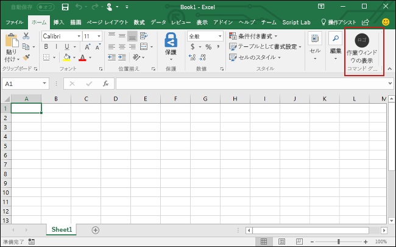

# <a name="build-an-excel-add-in-using-react"></a>React を使用して Excel のアドインを作成する

この記事では、React と Excel の JavaScript API を使用して Excel アドインを構築する手順について説明します。

## <a name="environment"></a>環境

- **Office Desktop**最新バージョンのOfficeがインストールされていることを確認してください。 アドインコマンドにはビルド16.0.6769.0000以上が必要です（**16.0.6868.0000** 推奨）。 [Officeアプリケーションの最新バージョンをインストールする](http://aka.ms/latestoffice)のやり方を学ぼう。 
 
- **Office Online**：追加設定はありません。 Office Online の職場/学校アカウント用コマンドのサポートはプレビューになっています。

## <a name="prerequisites"></a>前提条件

- [Create React App](https://github.com/facebookincubator/create-react-app) をグローバルにインストールします。

    ```bash
    npm install -g create-react-app
    ```

- [Yeoman](https://github.com/yeoman/yo) の最新バージョンと [Office アドイン用の Yeoman ジェネレーター](https://github.com/OfficeDev/generator-office)をグローバルにインストールします。

    ```bash
    npm install -g yo generator-office
    ```

## <a name="generate-a-new-react-app"></a>新しい React アプリを生成する

Create React App を使用して、React アプリを生成します。 ターミナルから、次のコマンドを実行します。

```bash
create-react-app my-addin
```

## <a name="generate-the-manifest-file-and-sideload-the-add-in"></a>マニフェスト ファイルを生成し、アドインをサイドロードする

各アドインには、設定と機能を定義するマニフェスト ファイルが必要です。

1. アプリ フォルダーに移動します。

    ```bash
    cd my-addin
    ```

2. Yeoman ジェネレーター使用して、アドインのマニフェスト ファイルを生成します。 次のコマンドを実行し、以下のスクリーンショットに示すとおり、プロンプトに応答します。

    ```bash
    yo office 
    ```

    - **Choose a project type:​ (プロジェクト タイプを選択してください)** `Manifest`
    - **What would you want to name your add-in?: (アドインの名前を何にしますか)** `My Office Add-in`
    - **Which Office client application would you like to support?: (どの Office クライアント アプリケーションをサポートしますか)** `Excel`


    ウィザードを完了すると、マニフェスト ファイルとリソース ファイルを使用してプロジェクトをビルドできます。
    
    
    
    > [!NOTE]
    > **package.json** を上書きするメッセージが表示された場合は、**No** (上書きしない) と応答します。

3. アドインを実行して、Excel 内のアドインをサイドロードするのに使用するプラットフォームの手順に従います。

    - Windows: [Windows で Office アドインをサイドロードする](../testing/create-a-network-shared-folder-catalog-for-task-pane-and-content-add-ins.md)
    - Excel Online:[Office Online で Office アドインをサイドロードする](../testing/sideload-office-add-ins-for-testing.md#sideload-an-office-add-in-on-office-online)
    - iPad および Mac:[iPad と Mac で Office アドインをサイドロードする](../testing/sideload-an-office-add-in-on-ipad-and-mac.md)

## <a name="update-the-app"></a>アプリを更新する

1. **public/index.html** を開き、`</head>` タグの直前に次の `<script>` タグを追加し、ファイルを保存します。

    ```html
    <script src="https://appsforoffice.microsoft.com/lib/1/hosted/office.js"></script>
    ```

2. **src/index.js** を開き、`ReactDOM.render(<App />, document.getElementById('root'));` を次のコードで置き換えて、ファイルを保存します。 

    ```typescript
    const Office = window.Office;
    
    Office.initialize = () => {
      ReactDOM.render(<App />, document.getElementById('root'));
    };
    ```

3. **src/App.js** を開き、ファイルのコンテンツを次のコードで置き換えて、ファイルを保存します。 

    ```js
    import React, { Component } from 'react';
    import './App.css';

    class App extends Component {
      constructor(props) {
        super(props);

        this.onSetColor = this.onSetColor.bind(this);
      }

      onSetColor() {
        window.Excel.run(async (context) => {
          const range = context.workbook.getSelectedRange();
          range.format.fill.color = 'green';
          await context.sync();
        });
      }

      render() {
        return (
          <div id="content">
            <div id="content-header">
              <div className="padding">
                  <h1>Welcome</h1>
              </div>
            </div>
            <div id="content-main">
              <div className="padding">
                  <p>Choose the button below to set the color of the selected range to green.</p>
                  <br />
                  <h3>Try it out</h3>
                  <button onClick={this.onSetColor}>Set color</button>
              </div>
            </div>
          </div>
        );
      }
    }

    export default App;
    ```

4. **src/App.css** を開き、ファイルのコンテンツを次の CSS コードで置き換えて、ファイルを保存します。 

    ```css
    #content-header {
        background: #2a8dd4;
        color: #fff;
        position: absolute;
        top: 0;
        left: 0;
        width: 100%;
        height: 80px; 
        overflow: hidden;
    }

    #content-main {
        background: #fff;
        position: fixed;
        top: 80px;
        left: 0;
        right: 0;
        bottom: 0;
        overflow: auto; 
    }

    .padding {
        padding: 15px;
    }
    ```

## <a name="try-it-out"></a>お試しください

1. ターミナルから、次のコマンドを実行してデベロッパー サーバーを起動します。

    Windows
    ```bash
    set HTTPS=true&&npm start
    ```

    macOS
    ```bash
    HTTPS=true npm start
    ```

   > [!NOTE]
   > アドインが含まれているブラウザー ウィンドウが開きます。このウィンドウを閉じます。

2. Excel で、**[ホーム]** タブを選択し、リボンの **[作業ウィンドウの表示]** ボタンをクリックして、アドインの作業ウィンドウを開きます。

    

3. ワークシート内で任意のセルの範囲を選択します。

4. 作業ウィンドウで、**[色の設定]** ボタンをクリックして、選択範囲の色を緑に設定します。

    

## <a name="next-steps"></a>次の手順

これで完了です。React を使用して Excel アドインが正常に作成されました。次に、Excel アドインの機能の詳細について説明します。Excel アドインのチュートリアルに従って、より複雑なアドインをビルドします。

> [!div class="nextstepaction"]
> [Excel アドインのチュートリアル](../tutorials/excel-tutorial.yml)

## <a name="see-also"></a>関連項目

* [Excel アドインのチュートリアル](../tutorials/excel-tutorial-create-table.md)
* [Excel JavaScript API の中心概念](../excel/excel-add-ins-core-concepts.md)
* [Excel アドインのコード サンプル](http://dev.office.com/code-samples#?filters=excel,office%20add-ins)
* [Excel JavaScript API リファレンス](https://dev.office.com/reference/add-ins/excel/excel-add-ins-reference-overview)
