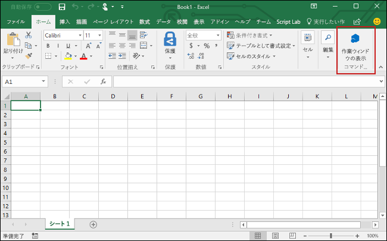

# <a name="build-an-excel-add-in-using-vue"></a><span data-ttu-id="a439e-101">Vue を使用して Excel アドインを構築する</span><span class="sxs-lookup"><span data-stu-id="a439e-101">Build an Excel add-in using Vue</span></span>

<span data-ttu-id="a439e-102">この記事では、Vue と Excel の JavaScript API を使用して Excel アドインを構築する手順について説明します。</span><span class="sxs-lookup"><span data-stu-id="a439e-102">In this article, you'll walk through the process of building an Excel add-in using Vue and the Excel JavaScript API.</span></span>

## <a name="prerequisites"></a><span data-ttu-id="a439e-103">前提条件</span><span class="sxs-lookup"><span data-stu-id="a439e-103">Prerequisites</span></span>

- [<span data-ttu-id="a439e-104">Node.js</span><span class="sxs-lookup"><span data-stu-id="a439e-104">Node.js</span></span>](https://nodejs.org)

- <span data-ttu-id="a439e-105">[Vue CLI](https://github.com/vuejs/vue-cli) をグローバルにインストールします。</span><span class="sxs-lookup"><span data-stu-id="a439e-105">Install the [Vue CLI](https://github.com/vuejs/vue-cli) globally.</span></span>

    ```bash
    npm install -g vue-cli
    ```

- <span data-ttu-id="a439e-106">[Yeoman](https://github.com/yeoman/yo) の最新バージョンと [Office アドイン用の Yeoman ジェネレーター](https://github.com/OfficeDev/generator-office)をグローバルにインストールします。</span><span class="sxs-lookup"><span data-stu-id="a439e-106">Install the latest version of [Yeoman](https://github.com/yeoman/yo) and the [Yeoman generator for Office Add-ins](https://github.com/OfficeDev/generator-office) globally.</span></span>

    ```bash
    npm install -g yo generator-office
    ```

## <a name="generate-a-new-vue-app"></a><span data-ttu-id="a439e-107">新しい Vue アプリを生成する</span><span class="sxs-lookup"><span data-stu-id="a439e-107">Generate a new Vue app</span></span>

<span data-ttu-id="a439e-p101">Vue CLI を使用して新しい Vue アプリを生成します。端末から次のコマンドを実行して、下記のようにプロンプトに応答します。</span><span class="sxs-lookup"><span data-stu-id="a439e-p101">Use the Vue CLI to generate a new Vue app. From the terminal, run the following command and then answer the prompts as described below.</span></span>

```bash
vue init webpack my-add-in
```

<span data-ttu-id="a439e-p102">前のコマンドで生成されたプロンプトに応答すると、次の 3 つのプロンプトの既定の応答を上書きします。その他のプロンプトについては、すべて既定の応答を受け入れることができます。</span><span class="sxs-lookup"><span data-stu-id="a439e-p102">When responding to the prompts that are generated by the previous command, override the default answers for the following 3 prompts. You can accept the default answers for all other prompts.</span></span>

- <span data-ttu-id="a439e-112">**Install vue-router? (Vue ルーターをインストールしますか？)**</span><span class="sxs-lookup"><span data-stu-id="a439e-112">**Install vue-router?**</span></span> `No`
- <span data-ttu-id="a439e-113">**Set up unit tests: (単体テストのセットアップ:)** `No`</span><span class="sxs-lookup"><span data-stu-id="a439e-113">**Set up unit tests:** `No`</span></span>
- <span data-ttu-id="a439e-114">**Setup e2e tests with Nightwatch? (Nightwatch とともに e2e テストをセットアップしますか？)**</span><span class="sxs-lookup"><span data-stu-id="a439e-114">**Setup e2e tests with Nightwatch?**</span></span> `No`


## <a name="generate-the-manifest-file"></a><span data-ttu-id="a439e-116">マニフェスト ファイルを生成する</span><span class="sxs-lookup"><span data-stu-id="a439e-116">Generate the manifest file</span></span>

<span data-ttu-id="a439e-117">各アドインには、設定と機能を定義するマニフェスト ファイルが必要です。</span><span class="sxs-lookup"><span data-stu-id="a439e-117">Each add-in requires a manifest file to define its settings and capabilities.</span></span>

1. <span data-ttu-id="a439e-118">アプリ フォルダーに移動します。</span><span class="sxs-lookup"><span data-stu-id="a439e-118">Navigate to your app folder.</span></span>

    ```bash
    cd my-add-in
    ```

2. <span data-ttu-id="a439e-p103">Yeoman ジェネレーター使用して、アドインのマニフェスト ファイルを生成します。次のコマンドを実行し、以下に示すとおりにプロンプトに応答します。</span><span class="sxs-lookup"><span data-stu-id="a439e-p103">Use the Yeoman generator to generate the manifest file for your add-in. Run the following command and then answer the prompts as shown below.</span></span>

    ```bash
    yo office 
    ```

    - <span data-ttu-id="a439e-121">**Choose a project type:​ (プロジェクト タイプを選択してください:)** `Office Add-in containing the manifest only`</span><span class="sxs-lookup"><span data-stu-id="a439e-121">**Choose a project type:** `Office Add-in containing the manifest only`</span></span>
    - <span data-ttu-id="a439e-122">**What would you want to name your add-in?: (アドインの名前を何にしますか)** `My Office Add-in`</span><span class="sxs-lookup"><span data-stu-id="a439e-122">**What do you want to name your add-in?:** `My Office Add-in`</span></span>
    - <span data-ttu-id="a439e-123">**Which Office client application would you like to support?: (どの Office クライアント アプリケーションをサポートしますか)** `Excel`</span><span class="sxs-lookup"><span data-stu-id="a439e-123">**Which Office client application would you like to support?:** `Excel`</span></span>

    
    
    <span data-ttu-id="a439e-125">ウィザードを完了すると、ジェネレーターは、マニフェスト ファイルを作成します。</span><span class="sxs-lookup"><span data-stu-id="a439e-125">After you complete the wizard, the generator creates the manifest file.</span></span>

## <a name="secure-the-app"></a><span data-ttu-id="a439e-126">アプリをセキュリティ保護する</span><span class="sxs-lookup"><span data-stu-id="a439e-126">Secure the app</span></span>

[!include[HTTPS guidance](../includes/https-guidance.md)]

<span data-ttu-id="a439e-127">アプリに対して HTTPS を有効にするには、Vue プロジェクトのルート フォルダー内のファイル **package.json** を開き、`--https` フラグを追加するよう `dev` スクリプトを変更して、ファイルを保存します。</span><span class="sxs-lookup"><span data-stu-id="a439e-127">To enable HTTPS for your app, open **package.json** in the root of the project, modify the `dev` script to add the `--https` flag, and save the file.</span></span>

```json
"dev": "webpack-dev-server --https --inline --progress --config build/webpack.dev.conf.js"
```

## <a name="update-the-app"></a><span data-ttu-id="a439e-128">アプリを更新する</span><span class="sxs-lookup"><span data-stu-id="a439e-128">Update the app</span></span>

1. <span data-ttu-id="a439e-129">コード エディターで Yo Office が Vue プロジェクトのルートに作成したフォルダー、 **My Office アドイン** を開きます。</span><span class="sxs-lookup"><span data-stu-id="a439e-129">In your code editor, open the folder **My Office Add-in** that Yo Office created at the root of your Vue project.</span></span> <span data-ttu-id="a439e-130">フォルダーに、アドインの設定を定義するマニフェスト ファイルが表示されます: **manifest.xml**。</span><span class="sxs-lookup"><span data-stu-id="a439e-130">In that folder, you'll see the manifest file that defines the settings for your add-in: **manifest.xml**.</span></span>

2. <span data-ttu-id="a439e-131">マニフェスト ファイルを開き、 `https://localhost:3000` のすべての出現箇所を `https://localhost:8080` と置換し、ファイルを保存します。</span><span class="sxs-lookup"><span data-stu-id="a439e-131">Open the manifest file, replace all occurrences of `https://localhost:3000` with `https://localhost:8080`, and save the file.</span></span>

3. <span data-ttu-id="a439e-132">(Vue プロジェクトのルートにある) **index.html** ファイルを開き、次の追加 `<script>` タグの直前に、 `</head>` タグ、およびファイルを保存します。</span><span class="sxs-lookup"><span data-stu-id="a439e-132">Open the file **index.html** (located at the root of your Vue project), add the following `<script>` tag immediately before the `</head>` tag, and save the file.</span></span>

    ```html
    <script src="https://appsforoffice.microsoft.com/lib/1/hosted/office.js"></script>
    ```

3. <span data-ttu-id="a439e-133">**src/main.js** を開き、次のコード ブロックを*削除*します。</span><span class="sxs-lookup"><span data-stu-id="a439e-133">Open **src/main.js** and *remove* the following block of code:</span></span>

    ```js
    new Vue({
        el: '#app',
        components: {App},
        template: '<App/>'
    })
    ```
    
    <span data-ttu-id="a439e-134">その後、同じ場所に次のコードを追加し、ファイルを保存します。</span><span class="sxs-lookup"><span data-stu-id="a439e-134">Then add the following code in that same location, and save the file.</span></span> 
                                                         
    ```js
    const Office = window.Office
    Office.initialize = () => {
      new Vue({
        el: '#app',
        components: {App},
        template: '<App/>'
      })
    }
    ```

4. <span data-ttu-id="a439e-135">**src/App.vue** を開き、ファイルの内容を次のコードに置き換え、ファイルの末尾 (つまり、`</style>` タグの直後) に改行を追加して、ファイルを保存します。</span><span class="sxs-lookup"><span data-stu-id="a439e-135">Open **src/App.vue**, replace file contents with the following code, add a line break at the end of the file (i.e., after the `</style>` tag), and save the file.</span></span> 

    ```html
    <template>
    <div id="app">
        <div id="content">
        <div id="content-header">
            <div class="padding">
            <h1>Welcome</h1>
            </div>
        </div>
        <div id="content-main">
            <div class="padding">
            <p>Choose the button below to set the color of the selected range to green.</p>
            <br/>
            <h3>Try it out</h3>
            <button @click="onSetColor">Set color</button>
            </div>
        </div>
        </div>
    </div>
    </template>

    <script>
    export default {
      name: 'App',
      methods: {
        onSetColor () {
          window.Excel.run(async (context) => {
            const range = context.workbook.getSelectedRange()
            range.format.fill.color = 'green'
            await context.sync()
          })
        }
      }
    }
    </script>

    <style>
    #content-header {
        background: #2a8dd4;
        color: #fff;
        position: absolute;
        top: 0;
        left: 0;
        width: 100%;
        height: 80px;
        overflow: hidden;
    }

    #content-main {
        background: #fff;
        position: fixed;
        top: 80px;
        left: 0;
        right: 0;
        bottom: 0;
        overflow: auto;
    }

    .padding {
        padding: 15px;
    }
    </style>
    ```

## <a name="start-the-dev-server"></a><span data-ttu-id="a439e-136">開発用サーバーを起動する</span><span class="sxs-lookup"><span data-stu-id="a439e-136">Start the dev server</span></span>

1. <span data-ttu-id="a439e-137">ターミナルから、次のコマンドを実行してデベロッパー サーバーを起動します。</span><span class="sxs-lookup"><span data-stu-id="a439e-137">From the terminal, run the following command to start the dev server.</span></span>

    ```bash
    npm start
    ```

2. <span data-ttu-id="a439e-p105">Web ブラウザで `https://localhost:8080` に移動します。ブラウザにサイトの証明書が信頼されていないことが示された場合は、その証明書を信頼するようコンピュータを構成する必要があります。</span><span class="sxs-lookup"><span data-stu-id="a439e-p105">In a web browser, navigate to `https://localhost:8080`. If your browser indicates that the site's certificate is not trusted, you will need to configure your computer to trust the certificate.</span></span> 

3. <span data-ttu-id="a439e-140">証明書エラーなしにブラウザにアドイン ページが読み込まれたら、アドインをテストする準備ができています。</span><span class="sxs-lookup"><span data-stu-id="a439e-140">After your browser loads the add-in page without any certificate errors, you're ready test your add-in.</span></span> 

## <a name="try-it-out"></a><span data-ttu-id="a439e-141">お試しください</span><span class="sxs-lookup"><span data-stu-id="a439e-141">Try it out</span></span>

1. <span data-ttu-id="a439e-142">アドインを実行して、Excel 内のアドインをサイドロードするために使用するプラットフォームの手順に従います。</span><span class="sxs-lookup"><span data-stu-id="a439e-142">Follow the instructions for the platform you'll be using to run your add-in and sideload the add-in within Excel.</span></span>

    - <span data-ttu-id="a439e-143">Windows: [Windows で Office アドインをサイドロードする](../testing/create-a-network-shared-folder-catalog-for-task-pane-and-content-add-ins.md)</span><span class="sxs-lookup"><span data-stu-id="a439e-143">Windows: [Sideload Office Add-ins on Windows](../testing/create-a-network-shared-folder-catalog-for-task-pane-and-content-add-ins.md)</span></span>
    - <span data-ttu-id="a439e-144">Excel Online:[Office Online で Office アドインをサイドロードする](../testing/sideload-office-add-ins-for-testing.md#sideload-an-office-add-in-on-office-online)</span><span class="sxs-lookup"><span data-stu-id="a439e-144">Excel Online: [Sideload Office Add-ins in Office Online](../testing/sideload-office-add-ins-for-testing.md#sideload-an-office-add-in-on-office-online)</span></span>
    - <span data-ttu-id="a439e-145">iPad および Mac: [iPad と Mac で Office アドインをサイドロードする](../testing/sideload-an-office-add-in-on-ipad-and-mac.md)</span><span class="sxs-lookup"><span data-stu-id="a439e-145">iPad and Mac: [Sideload Office Add-ins on iPad and Mac](../testing/sideload-an-office-add-in-on-ipad-and-mac.md)</span></span>

2. <span data-ttu-id="a439e-146">Excel で、**[ホーム]** タブを選択し、リボンの **[作業ウィンドウの表示]** ボタンをクリックして、アドインの作業ウィンドウを開きます。</span><span class="sxs-lookup"><span data-stu-id="a439e-146">In Excel, choose the **Home** tab, and then choose the **Show Taskpane** button in the ribbon to open the add-in task pane.</span></span>

    

3. <span data-ttu-id="a439e-148">ワークシート内で任意のセル範囲を選択します。</span><span class="sxs-lookup"><span data-stu-id="a439e-148">Select any range of cells in the worksheet.</span></span>

4. <span data-ttu-id="a439e-149">作業ウィンドウで、**[色の設定]** ボタンをクリックして、選択範囲の色を緑に設定します。</span><span class="sxs-lookup"><span data-stu-id="a439e-149">In the task pane, choose the **Set color** button to set the color of the selected range to green.</span></span>

    

## <a name="next-steps"></a><span data-ttu-id="a439e-151">次のステップ</span><span class="sxs-lookup"><span data-stu-id="a439e-151">Next steps</span></span>

<span data-ttu-id="a439e-p106">これで完了です。Vue を使用して Excel アドインが正常に作成されました。次に、Excel アドインの機能の詳細を説明します。Excel アドインのチュートリアルに従って、より複雑なアドインを構築します。</span><span class="sxs-lookup"><span data-stu-id="a439e-p106">Congratulations, you've successfully created an Excel add-in using Vue! Next, learn more about the capabilities of an Excel add-in and build a more complex add-in by following along with the Excel add-in tutorial.</span></span>

> [!div class="nextstepaction"]
> [<span data-ttu-id="a439e-154">Excel アドインのチュートリアル</span><span class="sxs-lookup"><span data-stu-id="a439e-154">Excel add-in tutorial</span></span>](../tutorials/excel-tutorial.yml)

## <a name="see-also"></a><span data-ttu-id="a439e-155">関連項目</span><span class="sxs-lookup"><span data-stu-id="a439e-155">See also</span></span>

* [<span data-ttu-id="a439e-156">Excel アドインのチュートリアル</span><span class="sxs-lookup"><span data-stu-id="a439e-156">Excel add-in tutorial</span></span>](../tutorials/excel-tutorial-create-table.md)
* [<span data-ttu-id="a439e-157">Excel の JavaScript API を使用した基本的なプログラミングの概念</span><span class="sxs-lookup"><span data-stu-id="a439e-157">Fundamental programming concepts with the Excel JavaScript API</span></span>](../excel/excel-add-ins-core-concepts.md)
* [<span data-ttu-id="a439e-158">Excel アドインのコード サンプル</span><span class="sxs-lookup"><span data-stu-id="a439e-158">Excel add-in code samples</span></span>](https://developer.microsoft.com/office/gallery/?filterBy=Samples,Excel)
* [<span data-ttu-id="a439e-159">Excel JavaScript API リファレンス</span><span class="sxs-lookup"><span data-stu-id="a439e-159">Excel JavaScript API reference</span></span>](https://docs.microsoft.com/office/dev/add-ins/reference/overview/excel-add-ins-reference-overview?view=office-js)
