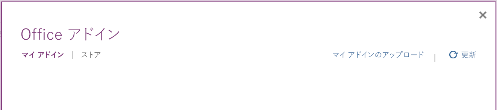

# <a name="build-your-first-onenote-add-in"></a>最初の OneNote アドインをビルドする

この記事では、jQuery と Office JavaScript API を使用して OneNote アドインを作成する手順について説明します。

## <a name="prerequisites"></a>前提条件

- [Node.js](https://nodejs.org)

- [Yeoman](https://github.com/yeoman/yo) の最新バージョンと [Office アドイン用の Yeoman ジェネレーター](https://github.com/OfficeDev/generator-office)をグローバルにインストールします。

    ```bash
    npm install -g yo generator-office
    ```

## <a name="create-the-add-in-project"></a>アドイン プロジェクトの作成

1. ローカル ドライブにフォルダーを作成し、`my-onenote-addin` という名前を付けます。 ここにアドインのファイルを作成します。

2. 新しいフォルダーに移動します。

    ```bash
    cd my-onenote-addin
    ```

3. Yeoman ジェネレーターを使用して、OneNote アドイン プロジェクトを作成します。 次のコマンドを実行し、以下のプロンプトに応答します。

    ```bash
    yo office
    ```

    - **Choose a project type:​ (プロジェクト タイプを選択してください)** `Jquery`
    - **Choose a script type: (スクリプト タイプを選択してください)** `Javascript`
    - **What would you want to name your add-in?: (アドインの名前を何にしますか)** `My Office Add-in`
    - **Which Office client application would you like to support?: (どの Office クライアント アプリケーションをサポートしますか)** `Onenote`

    
    
    ウィザードが完了すると、ジェネレーターはプロジェクトを作成し、サポートする Node コンポーネントをインストールします。


## <a name="update-the-code"></a>コードを更新する

1. コード エディターで、プロジェクトのルートにある **index.html** を開きます。 このファイルには、アドインの作業ウィンドウにレンダリングされる HTML が含まれています。

2. 要素内の `<main>` 要素を次のマークアップに置き換えて、ファイルを保存します。`<body>` これは、[Office UI Fabric コンポーネント](http://dev.office.com/fabric/components)を使用してテキスト領域とボタンを追加します。

    ```html
    <main class="ms-welcome__main">
        <br />
        <p class="ms-font-l">Enter content below</p>
        <div class="ms-TextField ms-TextField--placeholder">
            <textarea id="textBox" rows="5"></textarea>
        </div>
        <button id="addOutline" class="ms-welcome__action ms-Button ms-Button--hero ms-u-slideUpIn20">
            <span class="ms-Button-label">Add Outline</span>
            <span class="ms-Button-icon"><i class="ms-Icon"></i></span>
            <span class="ms-Button-description">Adds the content above to the current page.</span>
        </button>
    </main>
    ```

3. **src\index.js** ファイルを開いて、アドインのスクリプトを特定します。 すべての内容を次のコードに置き換え、ファイルを保存します。

    ```js
    'use strict';

    (function () {

        Office.initialize = function (reason) {
            $(document).ready(function () {
                // Set up event handler for the UI.
                $('#addOutline').click(addOutlineToPage);
            });
        };

        // Add the contents of the text area to the page.
        function addOutlineToPage() {        
            OneNote.run(function (context) {
                var html = '<p>' + $('#textBox').val() + '</p>';

                // Get the current page.
                var page = context.application.getActivePage();

                // Queue a command to load the page with the title property.             
                page.load('title'); 

                // Add an outline with the specified HTML to the page.
                var outline = page.addOutline(40, 90, html);

                // Run the queued commands, and return a promise to indicate task completion.
                return context.sync()
                    .then(function() {
                        console.log('Added outline to page ' + page.title);
                    })
                    .catch(function(error) {
                        app.showNotification("Error: " + error); 
                        console.log("Error: " + error); 
                        if (error instanceof OfficeExtension.Error) { 
                            console.log("Debug info: " + JSON.stringify(error.debugInfo)); 
                        } 
                    }); 
            });
        }
    })();
    ```

## <a name="update-the-manifest"></a>マニフェストを更新する

1. **one-note-add-in-manifest.xml** ファイルを開いて、アドインの設定と機能を定義します。

2. 要素にはプレースホルダー値が含まれています。`ProviderName` それを自分の名前に置き換えます。

3. 要素の `DefaultValue` 属性にはプレースホルダー値が含まれています。`Description` これは、**A task pane add-in for OneNote** に置き換えてください。

4. ファイルを保存します。

    ```xml
    ...
    <ProviderName>John Doe</ProviderName>
    <DefaultLocale>en-US</DefaultLocale>
    <!-- The display name of your add-in. Used on the store and various places of the Office UI such as the add-ins dialog. -->
    <DisplayName DefaultValue="OneNote Add-in" />
    <Description DefaultValue="A task pane add-in for OneNote"/>
    ...
    ```

## <a name="start-the-dev-server"></a>開発用サーバーの起動

[!include[Start server section](../includes/quickstart-yo-start-server.md)]

## <a name="try-it-out"></a>試してみる

1. [OneNote Online](https://www.onenote.com/notebooks) でノートブックを開きます。

2. **[挿入] > [Office アドイン]** の順に選択し、[Office アドイン] ダイアログを開きます。

    - コンシューマー アカウントでサインインしている場合は、**[マイ アドイン]** タブを選択し、**[マイ アドインのアップロード]** を選択します。

    - 職場または学校アカウントでサインインしている場合は、**[自分の所属組織]** タブを選択し、**[マイ アドインのアップロード]** を選択します。 

    次の図は、コンシューマー ノートブックの **[マイ アドイン]** タブを示しています。

    

3. [アドインのアップロード] ダイアログで、プロジェクト フォルダー内の **one-note-add-in-manifest.xml** を参照し、**[アップロード]** を選択します。 

4. **ホーム**タブから、リボンの**タスクペインを表示**ボタンを選択します。 アドインは、OneNote ページの横にある iFrame で開きます。

5. テキスト領域にテキストを入力し、**[枠線の追加]** を選択します。 入力したテキストは、ページに追加されます。 

    

## <a name="troubleshooting-and-tips"></a>トラブルシューティングとヒント

- ブラウザーの開発者ツールを使ってアドインをデバッグできます。Gulp Web サーバーを使っており、Internet Explorer や Chrome でデバッグしている場合は、ローカルで変更を保存して、アドインの iFrame を更新するだけです。

- OneNote オブジェクトを調べる場合、現在使用可能なプロパティに実際の値が表示されます。読み込む必要のあるプロパティには、*undefined* と表示されます。`_proto_` ノードを展開し、オブジェクトで定義されているものの、まだ読み込まれていないプロパティを確認します。

   

- アドインで任意の HTTP リソースを使っている場合は、ブラウザーで混在したコンテンツを有効にする必要があります。運用アドインでは、セキュリティで保護された HTTPS リソースのみを使う必要があります。

- 作業ウィンドウ アドインは、任意の場所から開くことができますが、コンテンツアドインは、通常のページ コンテンツ (タイトル、イメージ、iframe などは含まない) の内部にのみ挿入できます。 

## <a name="next-steps"></a>次の手順

これで完了です。OneNote アドインが正常に作成されました。 次に、OneNote アドイン構築の中心概念の詳細について説明します。

> [!div class="nextstepaction"]
> [OneNote の JavaScript API のプログラミングの概要](../onenote/onenote-add-ins-programming-overview.md)

## <a name="see-also"></a>関連項目

- [OneNote の JavaScript API のプログラミングの概要](../onenote/onenote-add-ins-programming-overview.md)
- [OneNote JavaScript API リファレンス](https://dev.office.com/reference/add-ins/onenote/onenote-add-ins-javascript-reference)
- [Rubric Grader のサンプル](https://github.com/OfficeDev/OneNote-Add-in-Rubric-Grader)
- [Office アドイン プラットフォームの概要](../overview/office-add-ins.md)
