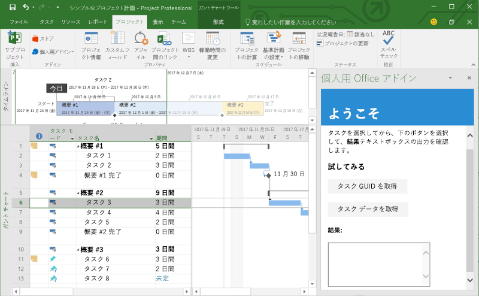
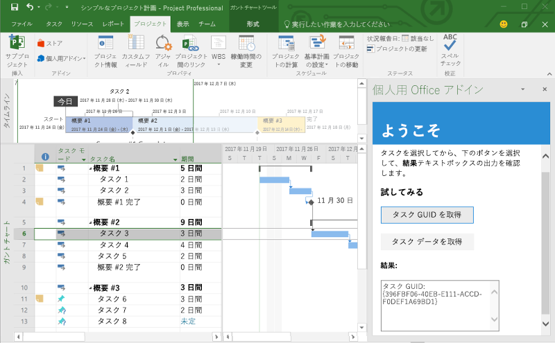
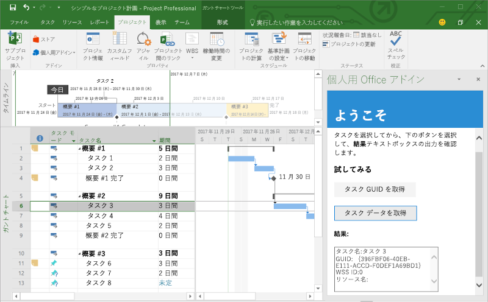

# <a name="build-your-first-project-add-in"></a><span data-ttu-id="0dadd-101">最初の Project アドインをビルドする</span><span class="sxs-lookup"><span data-stu-id="0dadd-101">Build your first Project add-in</span></span>

<span data-ttu-id="0dadd-102">この記事では、jQuery と Office JavaScript API を使用して Project アドインを作成する手順について説明します。</span><span class="sxs-lookup"><span data-stu-id="0dadd-102">In this article, you'll walk through the process of building a Project add-in by using jQuery and the Office JavaScript API.</span></span>

## <a name="prerequisites"></a><span data-ttu-id="0dadd-103">前提条件</span><span class="sxs-lookup"><span data-stu-id="0dadd-103">Prerequisites</span></span>

- [<span data-ttu-id="0dadd-104">Node.js</span><span class="sxs-lookup"><span data-stu-id="0dadd-104">Node.js</span></span>](https://nodejs.org)

- <span data-ttu-id="0dadd-105">[Yeoman](https://github.com/yeoman/yo) の最新バージョンと [Office アドイン用の Yeoman ジェネレーター](https://github.com/OfficeDev/generator-office)をグローバルにインストールします。</span><span class="sxs-lookup"><span data-stu-id="0dadd-105">Install the latest version of [Yeoman](https://github.com/yeoman/yo) and the [Yeoman generator for Office Add-ins](https://github.com/OfficeDev/generator-office) globally.</span></span>

    ```bash
    npm install -g yo generator-office
    ```

## <a name="create-the-add-in"></a><span data-ttu-id="0dadd-106">アドインを作成する</span><span class="sxs-lookup"><span data-stu-id="0dadd-106">Create the add-in</span></span>

1. <span data-ttu-id="0dadd-107">ローカル ドライブにフォルダーを作成し、`my-project-addin` という名前を付けます。</span><span class="sxs-lookup"><span data-stu-id="0dadd-107">Create a folder on your local drive and name it `my-project-addin`.</span></span> <span data-ttu-id="0dadd-108">ここにアドインのファイルを作成します。</span><span class="sxs-lookup"><span data-stu-id="0dadd-108">This is where you'll create the files for your add-in.</span></span>

2. <span data-ttu-id="0dadd-109">新しいフォルダーに移動します。</span><span class="sxs-lookup"><span data-stu-id="0dadd-109">Navigate to your new folder.</span></span>

    ```bash
    cd my-project-addin
    ```

3. <span data-ttu-id="0dadd-110">Yeoman ジェネレーターを使用して、Project アドイン プロジェクトを作成します。</span><span class="sxs-lookup"><span data-stu-id="0dadd-110">Use the Yeoman generator to create a Project add-in project.</span></span> <span data-ttu-id="0dadd-111">次のコマンドを実行し、以下のプロンプトに応答します。</span><span class="sxs-lookup"><span data-stu-id="0dadd-111">Run the following command and then answer the prompts as follows:</span></span>

    ```bash
    yo office
    ```

    - <span data-ttu-id="0dadd-112">**Choose a project type:​ (プロジェクト タイプを選択してください)** `Office Add-in project using Jquery framework`</span><span class="sxs-lookup"><span data-stu-id="0dadd-112">**Choose a project type:** `Office Add-in project using Jquery framework`</span></span>
    - <span data-ttu-id="0dadd-113">**Choose a script type: (スクリプト タイプを選択してください)** `Javascript`</span><span class="sxs-lookup"><span data-stu-id="0dadd-113">**Choose a script type:** `Javascript`</span></span>
    - <span data-ttu-id="0dadd-114">**What would you want to name your add-in?: (アドインの名前を何にしますか)** `My Office Add-in`</span><span class="sxs-lookup"><span data-stu-id="0dadd-114">**What do you want to name your add-in?:** `My Office Add-in`</span></span>
    - <span data-ttu-id="0dadd-115">**Which Office client application would you like to support?: (どの Office クライアント アプリケーションをサポートしますか)** `Project`</span><span class="sxs-lookup"><span data-stu-id="0dadd-115">**Which Office client application would you like to support?:** `Project`</span></span>

    
    
    <span data-ttu-id="0dadd-117">ウィザードが完了すると、ジェネレーターはプロジェクトを作成し、サポートする Node コンポーネントをインストールします。</span><span class="sxs-lookup"><span data-stu-id="0dadd-117">After you complete the wizard, the generator will create the project and install supporting Node components.</span></span>

## <a name="update-the-code"></a><span data-ttu-id="0dadd-118">コードを更新する</span><span class="sxs-lookup"><span data-stu-id="0dadd-118">Update the code</span></span>

1. <span data-ttu-id="0dadd-119">コード エディターで、プロジェクトのルートにある **index.html** を開きます。</span><span class="sxs-lookup"><span data-stu-id="0dadd-119">In your code editor, open **index.html** in the root of the project.</span></span> <span data-ttu-id="0dadd-120">このファイルには、アドインの作業ウィンドウにレンダリングされる HTML が含まれています。</span><span class="sxs-lookup"><span data-stu-id="0dadd-120">This file contains the HTML that will be rendered in the add-in's task pane.</span></span>

2. <span data-ttu-id="0dadd-121">要素内の `<header>` 要素を次のマークアップに置き換えます。`<body>`</span><span class="sxs-lookup"><span data-stu-id="0dadd-121">Replace the `<header>` element inside the `<body>` element with the following markup.</span></span>

    ```html
    <div id="content-header">
        <div class="padding">
            <h1>Welcome</h1>
        </div>
    </div>
    ```

3. <span data-ttu-id="0dadd-122">要素内の `<main>` 要素を次のマークアップに置き換えて、ファイルを保存します。`<body>`</span><span class="sxs-lookup"><span data-stu-id="0dadd-122">Replace the `<main>` element inside the `<body>` element with the following markup and save the file.</span></span>

    ```html
    <div id="content-main">
        <div class="padding">
            <p>Select a task and then choose the buttons below and observe the output in the <b>Results</b> textbox.</p>
            <h3>Try it out</h3>
            <button class="ms-Button" id="get-task-guid">Get Task GUID</button>
            <br/><br/>
            <button class="ms-Button" id="get-task">Get Task data</button>
            <br/>
            <h4>Results:</h4>
            <textarea id="result" rows="6" cols="25"></textarea>
        </div>
    </div>
    ```

4. <span data-ttu-id="0dadd-123">**app.js** ファイルを開いて、アドインのスクリプトを指定します。</span><span class="sxs-lookup"><span data-stu-id="0dadd-123">Open the file **app.js** to specify the script for the add-in.</span></span> <span data-ttu-id="0dadd-124">すべての内容を次のコードに置き換え、ファイルを保存します。</span><span class="sxs-lookup"><span data-stu-id="0dadd-124">Replace the entire contents with the following code and save the file.</span></span>

    ```js
    'use strict';

    (function () {

        var taskGuid;

        // The initialize function must be run each time a new page is loaded
        Office.initialize = function (reason) {
            $(document).ready(function () {
                $('#get-task-guid').click(getTaskGUID);
                $('#get-task').click(getTask);
            });
        };

        function getTaskGUID() {
            Office.context.document.getSelectedTaskAsync(function (asyncResult) {
                if (asyncResult.status == Office.AsyncResultStatus.Succeeded) {
                    result.value = "Task GUID: " + asyncResult.value;
                    taskGuid = asyncResult.value;
                }
                else {
                    console.log(asyncResult.error.message);
                }
            });
        }

        function getTask() {
            if (taskGuid != undefined) {
                Office.context.document.getTaskAsync(
                    taskGuid,
                    function (asyncResult) {
                        if (asyncResult.status === Office.AsyncResultStatus.Succeeded) {
                            var taskInfo = asyncResult.value;
                            var taskOutput = "Task name: " + taskInfo.taskName +
                                            "\nGUID: " + taskGuid +
                                            "\nWSS Id: " + taskInfo.wssTaskId +
                                            "\nResource names: " + taskInfo.resourceNames;
                            result.value = taskOutput;
                        } else {
                            console.log(asyncResult.error.message);
                        }
                    }
                );
            } else {
                result.value = 'Task GUID not valid:\n' + taskGuid;
            } 
        }
    })();
    ```

4. <span data-ttu-id="0dadd-125">プロジェクトのルートにある **app.css** ファイルを開いて、アドインのカスタム スタイルを指定します。</span><span class="sxs-lookup"><span data-stu-id="0dadd-125">Open the file **app.css** in the root of the project to specify the custom styles for the add-in.</span></span> <span data-ttu-id="0dadd-126">すべての内容を次の内容に置き換えて、ファイルを保存します。</span><span class="sxs-lookup"><span data-stu-id="0dadd-126">Replace the entire contents with the following and save the file.</span></span>

    ```css
    #content-header {
        background: #2a8dd4;
        color: #fff;
        position: absolute;
        top: 0;
        left: 0;
        width: 100%;
        height: 80px; 
        overflow: hidden;
    }

    #content-main {
        background: #fff;
        position: fixed;
        top: 80px;
        left: 0;
        right: 0;
        bottom: 0;
        overflow: auto; 
    }

    .padding {
        padding: 15px;
    }
    ```

## <a name="update-the-manifest"></a><span data-ttu-id="0dadd-127">マニフェストを更新する</span><span class="sxs-lookup"><span data-stu-id="0dadd-127">Update the manifest</span></span>

1. <span data-ttu-id="0dadd-128">**my-office-add-in-manifest.xml** ファイルを開いて、アドインの設定と機能を定義します。</span><span class="sxs-lookup"><span data-stu-id="0dadd-128">Open the file **my-office-add-in-manifest.xml** to define the add-in's settings and capabilities.</span></span>

2. <span data-ttu-id="0dadd-129">要素にはプレースホルダー値が含まれています。`ProviderName`</span><span class="sxs-lookup"><span data-stu-id="0dadd-129">The `ProviderName` element has a placeholder value.</span></span> <span data-ttu-id="0dadd-130">それを自分の名前に置き換えます。</span><span class="sxs-lookup"><span data-stu-id="0dadd-130">Replace it with your name.</span></span>

3. <span data-ttu-id="0dadd-131">要素の `DefaultValue` 属性にはプレースホルダー値が含まれています。`Description`</span><span class="sxs-lookup"><span data-stu-id="0dadd-131">The `DefaultValue` attribute of the `Description` element has a placeholder.</span></span> <span data-ttu-id="0dadd-132">これは、**A task pane add-in for Project** に置き換えてください。</span><span class="sxs-lookup"><span data-stu-id="0dadd-132">Replace it with **A task pane add-in for Project**.</span></span>

4. <span data-ttu-id="0dadd-133">ファイルを保存します。</span><span class="sxs-lookup"><span data-stu-id="0dadd-133">Save the file.</span></span>

    ```xml
    ...
    <ProviderName>John Doe</ProviderName>
    <DefaultLocale>en-US</DefaultLocale>
    <!-- The display name of your add-in. Used on the store and various places of the Office UI such as the add-ins dialog. -->
    <DisplayName DefaultValue="My Office Add-in" />
    <Description DefaultValue="A task pane add-in for Project"/>
    ...
    ```

## <a name="start-the-dev-server"></a><span data-ttu-id="0dadd-134">開発用サーバーの起動</span><span class="sxs-lookup"><span data-stu-id="0dadd-134">Start the dev server</span></span>

[!include[Start server section](../includes/quickstart-yo-start-server.md)] 

## <a name="try-it-out"></a><span data-ttu-id="0dadd-135">試してみる</span><span class="sxs-lookup"><span data-stu-id="0dadd-135">Try it out</span></span>

1. <span data-ttu-id="0dadd-136">少なくとも 1 つのタスクを含むシンプルなプロジェクトを Project で作成します。</span><span class="sxs-lookup"><span data-stu-id="0dadd-136">In Project, create a simple project that has at least one task.</span></span>

2. <span data-ttu-id="0dadd-137">アドインを実行して、Project 内のアドインをサイドロードするのに使用するプラットフォームの手順に従います。</span><span class="sxs-lookup"><span data-stu-id="0dadd-137">Follow the instructions for the platform you'll use to run your add-in to sideload the add-in within Project.</span></span>

    - <span data-ttu-id="0dadd-138">Windows: [Windows で Office アドインをサイドロードする](../testing/create-a-network-shared-folder-catalog-for-task-pane-and-content-add-ins.md)</span><span class="sxs-lookup"><span data-stu-id="0dadd-138">Windows: [Sideload Office Add-ins on Windows](../testing/create-a-network-shared-folder-catalog-for-task-pane-and-content-add-ins.md)</span></span>
    - <span data-ttu-id="0dadd-139">Project Online:[Office Online で Office アドインをサイドロードする](../testing/sideload-office-add-ins-for-testing.md#sideload-an-office-add-in-on-office-online)</span><span class="sxs-lookup"><span data-stu-id="0dadd-139">Project Online: [Sideload Office Add-ins in Office Online](../testing/sideload-office-add-ins-for-testing.md#sideload-an-office-add-in-on-office-online)</span></span>
    - <span data-ttu-id="0dadd-140">iPad および Mac: [iPad と Mac で Office アドインをサイドロードする](../testing/sideload-an-office-add-in-on-ipad-and-mac.md)</span><span class="sxs-lookup"><span data-stu-id="0dadd-140">iPad and Mac: [Sideload Office Add-ins on iPad and Mac](../testing/sideload-an-office-add-in-on-ipad-and-mac.md)</span></span>

3. <span data-ttu-id="0dadd-141">Project でタスクを選択します。</span><span class="sxs-lookup"><span data-stu-id="0dadd-141">In Project, select a task.</span></span>

    

4. <span data-ttu-id="0dadd-143">作業ウィンドウで **[タスク GUID を取得]** ボタンを選択して、タスク GUID を **[結果]** テキストボックスに記入します。</span><span class="sxs-lookup"><span data-stu-id="0dadd-143">In the task pane, choose the **Get Task GUID** button to write the task GUID to the **Results** textbox.</span></span>

    

5. <span data-ttu-id="0dadd-145">作業ウィンドウで **[タスク データを取得]** ボタンを選択して、選択したタスクのいくつかのプロパティを **[結果]** テキストボックスに記入します。</span><span class="sxs-lookup"><span data-stu-id="0dadd-145">In the task pane, choose the **Get Task data** button to write several properties of the selected task to the **Results** textbox.</span></span>

    

## <a name="next-steps"></a><span data-ttu-id="0dadd-147">次の手順</span><span class="sxs-lookup"><span data-stu-id="0dadd-147">Next steps</span></span>

<span data-ttu-id="0dadd-148">これで完了です。Project アドインが正常に作成されました。</span><span class="sxs-lookup"><span data-stu-id="0dadd-148">Congratulations, you've successfully created a Project add-in!</span></span> <span data-ttu-id="0dadd-149">この後は、Project アドインの機能と一般的なシナリオについて調べます。</span><span class="sxs-lookup"><span data-stu-id="0dadd-149">Next, learn more about the capabilities of a Project add-in and explore common scenarios.</span></span>

> [!div class="nextstepaction"]
> [<span data-ttu-id="0dadd-150">Project 用アドイン</span><span class="sxs-lookup"><span data-stu-id="0dadd-150">Project add-ins</span></span>](../project/project-add-ins.md)
