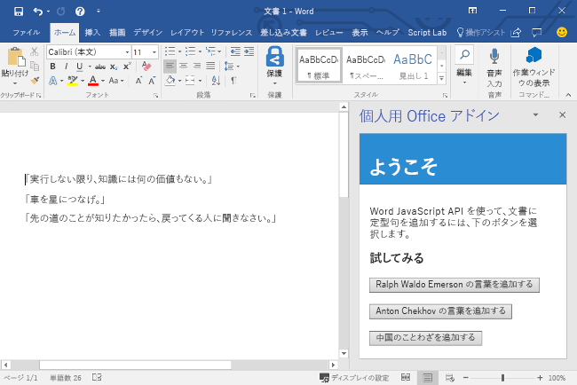
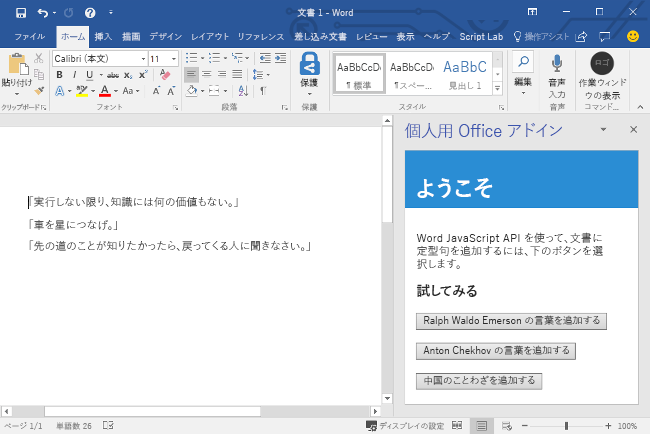

# <a name="build-your-first-word-add-in"></a><span data-ttu-id="7106f-101">最初の Word アドインをビルドする</span><span class="sxs-lookup"><span data-stu-id="7106f-101">Build your first Word add-in</span></span>

<span data-ttu-id="7106f-102">_適用対象: Word 2016、Word for iPad、Word for Mac_</span><span class="sxs-lookup"><span data-stu-id="7106f-102">_Applies to: Word 2016, Word for iPad, Word for Mac_</span></span>

<span data-ttu-id="7106f-103">この記事では、jQuery と Word JavaScript API を使用して Word アドインを構築する手順について説明します。</span><span class="sxs-lookup"><span data-stu-id="7106f-103">In this article, you'll walk through the process of building a Word add-in by using jQuery and the Word JavaScript API.</span></span> 

## <a name="create-the-add-in"></a><span data-ttu-id="7106f-104">アドインを作成する</span><span class="sxs-lookup"><span data-stu-id="7106f-104">Create the add-in</span></span> 

[!include[Choose your editor](../includes/quickstart-choose-editor.md)]

# <a name="visual-studiotabvisual-studio"></a>[<span data-ttu-id="7106f-105">Visual Studio</span><span class="sxs-lookup"><span data-stu-id="7106f-105">Visual Studio</span></span>](#tab/visual-studio)

### <a name="prerequisites"></a><span data-ttu-id="7106f-106">前提条件</span><span class="sxs-lookup"><span data-stu-id="7106f-106">Prerequisites</span></span>

[!include[Quick Start prerequisites](../includes/quickstart-vs-prerequisites.md)]

### <a name="create-the-add-in-project"></a><span data-ttu-id="7106f-107">アドイン プロジェクトの作成</span><span class="sxs-lookup"><span data-stu-id="7106f-107">Create the add-in project</span></span>

1. <span data-ttu-id="7106f-108">[Visual Studio] メニュー バーで、**[ファイル]**  >  **[新規作成]**  >  **[プロジェクト]** の順に選択します。</span><span class="sxs-lookup"><span data-stu-id="7106f-108">On the Visual Studio menu bar, choose  **File** > **New** > **Project**.</span></span>
    
2. <span data-ttu-id="7106f-109">**[Visual C#]** または **[Visual Basic]** の下にあるプロジェクトの種類の一覧で、**[Office/SharePoint]** を展開して、**[アドイン]** を選択し、プロジェクトの種類として **[Word Web アドイン]** を選択します。</span><span class="sxs-lookup"><span data-stu-id="7106f-109">In the list of project types under **Visual C#** or **Visual Basic**, expand  **Office/SharePoint**, choose **Add-ins**, and then choose **Word Web Add-in** as the project type.</span></span> 

3. <span data-ttu-id="7106f-110">プロジェクトに名前を付けて、**[OK]** を選択します。</span><span class="sxs-lookup"><span data-stu-id="7106f-110">Name the project, and then choose **OK**.</span></span>

4. <span data-ttu-id="7106f-p101">Visual Studio によってソリューションとその 2 つのプロジェクトが作成され、**ソリューション エクスプローラー**に表示されます。**Home.html** ファイルが Visual Studio で開かれます。</span><span class="sxs-lookup"><span data-stu-id="7106f-p101">Visual Studio creates a solution and its two projects appear in **Solution Explorer**. The **Home.html** file opens in Visual Studio.</span></span>
    
### <a name="explore-the-visual-studio-solution"></a><span data-ttu-id="7106f-113">Visual Studio ソリューションについて理解する</span><span class="sxs-lookup"><span data-stu-id="7106f-113">Explore the Visual Studio solution</span></span>

[!include[Description of Visual Studio projects](../includes/quickstart-vs-solution.md)]

### <a name="update-the-code"></a><span data-ttu-id="7106f-114">コードを更新する</span><span class="sxs-lookup"><span data-stu-id="7106f-114">Update the code</span></span>

1. <span data-ttu-id="7106f-115">**Home.html** では、アドインの作業ウィンドウにレンダリングされる HTML を指定します。</span><span class="sxs-lookup"><span data-stu-id="7106f-115">**Home.html** specifies the HTML that will be rendered in the add-in's task pane.</span></span> <span data-ttu-id="7106f-116">**Home.html** で、`<body>` 要素を次のマークアップに置き換えて、ファイルを保存します。</span><span class="sxs-lookup"><span data-stu-id="7106f-116">In **Home.html**, replace the `<body>` element with the following markup and save the file.</span></span>
 
    ```html
    <body>
        <div id="content-header">
            <div class="padding">
                <h1>Welcome</h1>
            </div>
        </div>    
        <div id="content-main">
            <div class="padding">
                <p>Choose the buttons below to add boilerplate text to the document by using the Word JavaScript API.</p>
                <br />
                <h3>Try it out</h3>
                <button id="emerson">Add quote from Ralph Waldo Emerson</button>
                <br /><br />
                <button id="checkhov">Add quote from Anton Chekhov</button>
                <br /><br />
                <button id="proverb">Add Chinese proverb</button>
            </div>
        </div>
        <br />
        <div id="supportedVersion"/>
    </body>
    ```

2. <span data-ttu-id="7106f-117">Web アプリケーション プロジェクトのルートにあるファイル **Home.js** を開きます。</span><span class="sxs-lookup"><span data-stu-id="7106f-117">Open the file **Home.js** in the root of the web application project.</span></span> <span data-ttu-id="7106f-118">このファイルは、アドイン用のスクリプトを指定します。</span><span class="sxs-lookup"><span data-stu-id="7106f-118">This file specifies the script for the add-in.</span></span> <span data-ttu-id="7106f-119">すべての内容を次のコードに置き換え、ファイルを保存します。</span><span class="sxs-lookup"><span data-stu-id="7106f-119">Replace the entire contents with the following code and save the file.</span></span>

    ```js
    'use strict';
    
    (function () {

        // The initialize function is run each time the page is loaded.
        Office.initialize = function (reason) {
            $(document).ready(function () {

                // Use this to check whether the API is supported in the Word client.
                if (Office.context.requirements.isSetSupported('WordApi', 1.1)) {
                    // Do something that is only available via the new APIs
                    $('#emerson').click(insertEmersonQuoteAtSelection);
                    $('#checkhov').click(insertChekhovQuoteAtTheBeginning);
                    $('#proverb').click(insertChineseProverbAtTheEnd);
                    $('#supportedVersion').html('This code is using Word 2016 or later.');
                }
                else {
                    // Just letting you know that this code will not work with your version of Word.
                    $('#supportedVersion').html('This code requires Word 2016 or later.');
                }
            });
        };

        function insertEmersonQuoteAtSelection() {
            Word.run(function (context) {

                // Create a proxy object for the document.
                var thisDocument = context.document;

                // Queue a command to get the current selection.
                // Create a proxy range object for the selection.
                var range = thisDocument.getSelection();

                // Queue a command to replace the selected text.
                range.insertText('"Hitch your wagon to a star."\n', Word.InsertLocation.replace);

                // Synchronize the document state by executing the queued commands,
                // and return a promise to indicate task completion.
                return context.sync().then(function () {
                    console.log('Added a quote from Ralph Waldo Emerson.');
                });
            })
            .catch(function (error) {
                console.log('Error: ' + JSON.stringify(error));
                if (error instanceof OfficeExtension.Error) {
                    console.log('Debug info: ' + JSON.stringify(error.debugInfo));
                }
            });
        }

        function insertChekhovQuoteAtTheBeginning() {
            Word.run(function (context) {

                // Create a proxy object for the document body.
                var body = context.document.body;

                // Queue a command to insert text at the start of the document body.
                body.insertText('"Knowledge is of no value unless you put it into practice."\n', Word.InsertLocation.start);

                // Synchronize the document state by executing the queued commands,
                // and return a promise to indicate task completion.
                return context.sync().then(function () {
                    console.log('Added a quote from Anton Chekhov.');
                });
            })
            .catch(function (error) {
                console.log('Error: ' + JSON.stringify(error));
                if (error instanceof OfficeExtension.Error) {
                    console.log('Debug info: ' + JSON.stringify(error.debugInfo));
                }
            });
        }

        function insertChineseProverbAtTheEnd() {
            Word.run(function (context) {

                // Create a proxy object for the document body.
                var body = context.document.body;

                // Queue a command to insert text at the end of the document body.
                body.insertText('"To know the road ahead, ask those coming back."\n', Word.InsertLocation.end);

                // Synchronize the document state by executing the queued commands,
                // and return a promise to indicate task completion.
                return context.sync().then(function () {
                    console.log('Added a quote from a Chinese proverb.');
                });
            })
            .catch(function (error) {
                console.log('Error: ' + JSON.stringify(error));
                if (error instanceof OfficeExtension.Error) {
                    console.log('Debug info: ' + JSON.stringify(error.debugInfo));
                }
            });
        }
    })();
    ```

3. <span data-ttu-id="7106f-120">Web アプリケーション プロジェクトのルートにあるファイル **Home.css** を開きます。</span><span class="sxs-lookup"><span data-stu-id="7106f-120">Open the file **Home.css** in the root of the web application project.</span></span> <span data-ttu-id="7106f-121">このファイルは、アドイン用のユーザー設定のスタイルを指定します。</span><span class="sxs-lookup"><span data-stu-id="7106f-121">This file specifies the custom styles for the add-in.</span></span> <span data-ttu-id="7106f-122">すべての内容を次のコードに置き換え、ファイルを保存します。</span><span class="sxs-lookup"><span data-stu-id="7106f-122">Replace the entire contents with the following code and save the file.</span></span>

    ```css
    #content-header {
        background: #2a8dd4;
        color: #fff;
        position: absolute;
        top: 0;
        left: 0;
        width: 100%;
        height: 80px; 
        overflow: hidden;
    }

    #content-main {
        background: #fff;
        position: fixed;
        top: 80px;
        left: 0;
        right: 0;
        bottom: 0;
        overflow: auto; 
    }

    .padding {
        padding: 15px;
    }
    ```

### <a name="update-the-manifest"></a><span data-ttu-id="7106f-123">マニフェストを更新する</span><span class="sxs-lookup"><span data-stu-id="7106f-123">Update the manifest</span></span>

1. <span data-ttu-id="7106f-p105">アドイン プロジェクト内の XML マニフェスト ファイルを開きます。このファイルは、アドインの設定と機能を定義します。</span><span class="sxs-lookup"><span data-stu-id="7106f-p105">Open the XML manifest file in the Add-in project. This file defines the add-in's settings and capabilities.</span></span>

2. <span data-ttu-id="7106f-126">要`ProviderName`素にはプレースホルダー値が含まれています。</span><span class="sxs-lookup"><span data-stu-id="7106f-126">The `ProviderName` element has a placeholder value.</span></span> <span data-ttu-id="7106f-127">それを自分の名前に置き換えます。</span><span class="sxs-lookup"><span data-stu-id="7106f-127">Replace it with your name.</span></span>

3. <span data-ttu-id="7106f-128">要素の `DefaultValue` 属性にはプレースホルダー値が含まれています。`DisplayName`</span><span class="sxs-lookup"><span data-stu-id="7106f-128">The `DefaultValue` attribute of the `DisplayName` element has a placeholder.</span></span> <span data-ttu-id="7106f-129">これは、**My Office Add-in** に置き換えてください。</span><span class="sxs-lookup"><span data-stu-id="7106f-129">Replace it with **My Office Add-in**.</span></span>

4. <span data-ttu-id="7106f-130">要素の `DefaultValue` 属性にはプレースホルダー値が含まれています。`Description`</span><span class="sxs-lookup"><span data-stu-id="7106f-130">The `DefaultValue` attribute of the `Description` element has a placeholder.</span></span> <span data-ttu-id="7106f-131">これは、**A task pane add-in for Word** に置き換えてください。</span><span class="sxs-lookup"><span data-stu-id="7106f-131">Replace it with **A task pane add-in for Word**.</span></span>

5. <span data-ttu-id="7106f-132">ファイルを保存します。</span><span class="sxs-lookup"><span data-stu-id="7106f-132">Save the file.</span></span>

    ```xml
    ...
    <ProviderName>John Doe</ProviderName>
    <DefaultLocale>en-US</DefaultLocale>
    <!-- The display name of your add-in. Used on the store and various places of the Office UI such as the add-ins dialog. -->
    <DisplayName DefaultValue="My Office Add-in" />
    <Description DefaultValue="A task pane add-in for Word"/>
    ...
    ```

### <a name="try-it-out"></a><span data-ttu-id="7106f-133">お試しください</span><span class="sxs-lookup"><span data-stu-id="7106f-133">Try it out</span></span>

1. <span data-ttu-id="7106f-p109">Visual Studio を使用して、新しく作成した Word アドインをテストします。そのために、F5 キーを押すか **[開始]** ボタンをクリックして、リボンに **[作業ウィンドウの表示]** アドイン ボタンが表示された Word を起動します。アドインは IIS 上でローカルにホストされます。</span><span class="sxs-lookup"><span data-stu-id="7106f-p109">Using Visual Studio, test the newly created Word add-in by pressing F5 or choosing the **Start** button to launch Word with the **Show Taskpane** add-in button displayed in the ribbon. The add-in will be hosted locally on IIS.</span></span>

2. <span data-ttu-id="7106f-136">Word で、**[ホーム]** タブを選択し、リボンの **[作業ウィンドウの表示]** ボタンをクリックして、アドインの作業ウィンドウを開きます。</span><span class="sxs-lookup"><span data-stu-id="7106f-136">In Word, choose the **Home** tab, and then choose the **Show Taskpane** button in the ribbon to open the add-in task pane.</span></span>

    ![[作業ウィンドウの表示] ボタンが強調表示されている Word アプリケーションのスクリーンショット](../images/word-quickstart-addin-0.png)

3. <span data-ttu-id="7106f-138">作業ウィンドウで、いずれかのボタンを選択して文書に定型句を追加します。</span><span class="sxs-lookup"><span data-stu-id="7106f-138">In the task pane, choose any of the buttons to add boilerplate text to the document.</span></span>

    

# <a name="any-editortabvisual-studio-code"></a>[<span data-ttu-id="7106f-140">任意のエディター</span><span class="sxs-lookup"><span data-stu-id="7106f-140">Any editor</span></span>](#tab/visual-studio-code)

### <a name="prerequisites"></a><span data-ttu-id="7106f-141">前提条件</span><span class="sxs-lookup"><span data-stu-id="7106f-141">Prerequisites</span></span>

- [<span data-ttu-id="7106f-142">Node.js</span><span class="sxs-lookup"><span data-stu-id="7106f-142">Node.js</span></span>](https://nodejs.org)

- <span data-ttu-id="7106f-143">[Yeoman](https://github.com/yeoman/yo) の最新バージョンと [Office アドイン用の Yeoman ジェネレーター](https://github.com/OfficeDev/generator-office)をグローバルにインストールします。</span><span class="sxs-lookup"><span data-stu-id="7106f-143">Install the latest version of [Yeoman](https://github.com/yeoman/yo) and the [Yeoman generator for Office Add-ins](https://github.com/OfficeDev/generator-office) globally.</span></span>

    ```bash
    npm install -g yo generator-office
    ```

### <a name="create-the-add-in-project"></a><span data-ttu-id="7106f-144">アドイン プロジェクトの作成</span><span class="sxs-lookup"><span data-stu-id="7106f-144">Create the add-in project</span></span>

1. <span data-ttu-id="7106f-145">ローカル ドライブにフォルダーを作成し、`my-word-addin` という名前を付けます。</span><span class="sxs-lookup"><span data-stu-id="7106f-145">Create a folder on your local drive and name it `my-word-addin`.</span></span> <span data-ttu-id="7106f-146">ここにアドインのファイルを作成します。</span><span class="sxs-lookup"><span data-stu-id="7106f-146">This is where you'll create the files for your add-in.</span></span>

2. <span data-ttu-id="7106f-147">新しいフォルダーに移動します。</span><span class="sxs-lookup"><span data-stu-id="7106f-147">Navigate to your new folder.</span></span>

    ```bash
    cd my-word-addin
    ```

3. <span data-ttu-id="7106f-148">Yeoman ジェネレーターを使用して、Word アドイン プロジェクトを作成します。</span><span class="sxs-lookup"><span data-stu-id="7106f-148">Use the Yeoman generator to create a Word add-in project.</span></span> <span data-ttu-id="7106f-149">次のコマンドを実行し、以下のプロンプトに応答します。</span><span class="sxs-lookup"><span data-stu-id="7106f-149">Run the following command and then answer the prompts as follows:</span></span>

    ```bash
    yo office
    ```

    - <span data-ttu-id="7106f-150">**Choose a project type (プロジェクト タイプを選んでください):** `Office Add-in project using Jquery framework`</span><span class="sxs-lookup"><span data-stu-id="7106f-150">**Choose a project type:** `Office Add-in project using Jquery framework`</span></span>
    - <span data-ttu-id="7106f-151">**Choose a script type (スクリプト タイプを選んでください):** `Javascript`</span><span class="sxs-lookup"><span data-stu-id="7106f-151">**Choose a script type:** `Javascript`</span></span>
    - <span data-ttu-id="7106f-152">**What would you want to name your add-in?: (アドインの名前を何にしますか)** `My Office Add-in`</span><span class="sxs-lookup"><span data-stu-id="7106f-152">**What do you want to name your add-in?:** `My Office Add-in`</span></span>
    - <span data-ttu-id="7106f-153">**Which Office client application would you like to support?: (どの Office クライアント アプリケーションをサポートしますか)** `Word`</span><span class="sxs-lookup"><span data-stu-id="7106f-153">**Which Office client application would you like to support?:** `Word`</span></span>

    
    
    <span data-ttu-id="7106f-155">ウィザードが完了すると、ジェネレーターはプロジェクトを作成し、サポートする Node コンポーネントをインストールします。</span><span class="sxs-lookup"><span data-stu-id="7106f-155">After you complete the wizard, the generator will create the project and install supporting Node components.</span></span>

### <a name="update-the-code"></a><span data-ttu-id="7106f-156">コードを更新する</span><span class="sxs-lookup"><span data-stu-id="7106f-156">Update the code</span></span>

1. <span data-ttu-id="7106f-157">コード エディターで、プロジェクトのルートにある **index.html** を開きます。</span><span class="sxs-lookup"><span data-stu-id="7106f-157">In your code editor, open **index.html** in the root of the project.</span></span> <span data-ttu-id="7106f-158">このファイルには、アドインの作業ウィンドウにレンダリングされる HTML が含まれています。</span><span class="sxs-lookup"><span data-stu-id="7106f-158">This file contains the HTML that will be rendered in the add-in's task pane.</span></span> <span data-ttu-id="7106f-159">すべての内容を次のコードに置き換え、ファイルを保存します。</span><span class="sxs-lookup"><span data-stu-id="7106f-159">Replace the entire contents with the following code and save the file.</span></span> <span data-ttu-id="7106f-160">このアドインには、3 つのボタンが表示されます。いずれかのボタンを選択すると、文書に定型句が追加されます。</span><span class="sxs-lookup"><span data-stu-id="7106f-160">This add-in will display three buttons and when any of the buttons are chosen, boilerplate text will be added to the document.</span></span>

    ```html
    <!DOCTYPE html>
    <html>
        <head>
            <meta charset="UTF-8" />
            <meta http-equiv="X-UA-Compatible" content="IE=Edge" />
            <title>Boilerplate text app</title>
            <script src="https://ajax.aspnetcdn.com/ajax/jQuery/jquery-2.1.4.min.js"></script>
            <script src="https://appsforoffice.microsoft.com/lib/1/hosted/office.js" type="text/javascript"></script>
            <link href="app.css" rel="stylesheet" type="text/css" />
        </head>
        <body>
            <div id="content-header">
                <div class="padding">
                    <h1>Welcome</h1>
                </div>
            </div>    
            <div id="content-main">
                <div class="padding">
                    <p>Choose the buttons below to add boilerplate text to the document by using the Word JavaScript API.</p>
                    <br />
                    <h3>Try it out</h3>
                    <button id="emerson">Add quote from Ralph Waldo Emerson</button>
                    <br /><br />
                    <button id="checkhov">Add quote from Anton Chekhov</button>
                    <br /><br />
                    <button id="proverb">Add Chinese proverb</button>
                </div>
            </div>
            <br />
            <div id="supportedVersion"/>
        </body>
    </html>
    ```

2. <span data-ttu-id="7106f-161">**src/index.js** ファイルを開いて、アドインのスクリプトを指定します。</span><span class="sxs-lookup"><span data-stu-id="7106f-161">Open the file **app.js** to specify the script for the add-in.</span></span> <span data-ttu-id="7106f-162">すべての内容を次のコードに置き換え、ファイルを保存します。</span><span class="sxs-lookup"><span data-stu-id="7106f-162">Replace the entire contents with the following code and save the file.</span></span> <span data-ttu-id="7106f-163">このスクリプトには、初期化のコードと、Word 文書に変更を加える (ボタンが選択されたときに、ドキュメントにテキストを挿入する) コードが含まれています。</span><span class="sxs-lookup"><span data-stu-id="7106f-163">This script contains initialization code as well as the code that makes changes to the Word document, by inserting text into the document when a button is chosen.</span></span> 

    ```js
    'use strict';
    
    (function () {

        // The initialize function is run each time the page is loaded.
        Office.initialize = function (reason) {
            $(document).ready(function () {

                // Use this to check whether the API is supported in the Word client.
                if (Office.context.requirements.isSetSupported('WordApi', 1.1)) {
                    // Do something that is only available via the new APIs
                    $('#emerson').click(insertEmersonQuoteAtSelection);
                    $('#checkhov').click(insertChekhovQuoteAtTheBeginning);
                    $('#proverb').click(insertChineseProverbAtTheEnd);
                    $('#supportedVersion').html('This code is using Word 2016 or later.');
                }
                else {
                    // Just letting you know that this code will not work with your version of Word.
                    $('#supportedVersion').html('This code requires Word 2016 or later.');
                }
            });
        };

        function insertEmersonQuoteAtSelection() {
            Word.run(function (context) {

                // Create a proxy object for the document.
                var thisDocument = context.document;

                // Queue a command to get the current selection.
                // Create a proxy range object for the selection.
                var range = thisDocument.getSelection();

                // Queue a command to replace the selected text.
                range.insertText('"Hitch your wagon to a star."\n', Word.InsertLocation.replace);

                // Synchronize the document state by executing the queued commands,
                // and return a promise to indicate task completion.
                return context.sync().then(function () {
                    console.log('Added a quote from Ralph Waldo Emerson.');
                });
            })
            .catch(function (error) {
                console.log('Error: ' + JSON.stringify(error));
                if (error instanceof OfficeExtension.Error) {
                    console.log('Debug info: ' + JSON.stringify(error.debugInfo));
                }
            });
        }

        function insertChekhovQuoteAtTheBeginning() {
            Word.run(function (context) {

                // Create a proxy object for the document body.
                var body = context.document.body;

                // Queue a command to insert text at the start of the document body.
                body.insertText('"Knowledge is of no value unless you put it into practice."\n', Word.InsertLocation.start);

                // Synchronize the document state by executing the queued commands,
                // and return a promise to indicate task completion.
                return context.sync().then(function () {
                    console.log('Added a quote from Anton Chekhov.');
                });
            })
            .catch(function (error) {
                console.log('Error: ' + JSON.stringify(error));
                if (error instanceof OfficeExtension.Error) {
                    console.log('Debug info: ' + JSON.stringify(error.debugInfo));
                }
            });
        }

        function insertChineseProverbAtTheEnd() {
            Word.run(function (context) {

                // Create a proxy object for the document body.
                var body = context.document.body;

                // Queue a command to insert text at the end of the document body.
                body.insertText('"To know the road ahead, ask those coming back."\n', Word.InsertLocation.end);

                // Synchronize the document state by executing the queued commands,
                // and return a promise to indicate task completion.
                return context.sync().then(function () {
                    console.log('Added a quote from a Chinese proverb.');
                });
            })
            .catch(function (error) {
                console.log('Error: ' + JSON.stringify(error));
                if (error instanceof OfficeExtension.Error) {
                    console.log('Debug info: ' + JSON.stringify(error.debugInfo));
                }
            });
        }
    })();
    ```

3. <span data-ttu-id="7106f-164">プロジェクトのルートにある **app.css** ファイルを開いて、アドインのカスタム スタイルを指定します。</span><span class="sxs-lookup"><span data-stu-id="7106f-164">Open the file **app.css** in the root of the project to specify the custom styles for the add-in.</span></span> <span data-ttu-id="7106f-165">すべての内容を次の内容に置き換えて、ファイルを保存します。</span><span class="sxs-lookup"><span data-stu-id="7106f-165">Replace the entire contents with the following and save the file.</span></span>

    ```css
    #content-header {
        background: #2a8dd4;
        color: #fff;
        position: absolute;
        top: 0;
        left: 0;
        width: 100%;
        height: 80px; 
        overflow: hidden;
    }

    #content-main {
        background: #fff;
        position: fixed;
        top: 80px;
        left: 0;
        right: 0;
        bottom: 0;
        overflow: auto; 
    }

    .padding {
        padding: 15px;
    }
    ```

### <a name="update-the-manifest"></a><span data-ttu-id="7106f-166">マニフェストを更新する</span><span class="sxs-lookup"><span data-stu-id="7106f-166">Update the manifest</span></span>

1. <span data-ttu-id="7106f-167">**my-office-add-in-manifest.xml** ファイルを開いて、アドインの設定と機能を定義します。</span><span class="sxs-lookup"><span data-stu-id="7106f-167">Open the file **my-office-add-in-manifest.xml** to define the add-in's settings and capabilities.</span></span>

2. <span data-ttu-id="7106f-168">要`ProviderName`素にはプレースホルダー値が含まれています。</span><span class="sxs-lookup"><span data-stu-id="7106f-168">The `ProviderName` element has a placeholder value.</span></span> <span data-ttu-id="7106f-169">それを自分の名前に置き換えます。</span><span class="sxs-lookup"><span data-stu-id="7106f-169">Replace it with your name.</span></span>

3. <span data-ttu-id="7106f-170">要素の `DefaultValue` 属性にはプレースホルダー値が含まれています。`Description`</span><span class="sxs-lookup"><span data-stu-id="7106f-170">The `DefaultValue` attribute of the `Description` element has a placeholder.</span></span> <span data-ttu-id="7106f-171">これは、**A task pane add-in for Word** に置き換えてください。</span><span class="sxs-lookup"><span data-stu-id="7106f-171">Replace it with **A task pane add-in for Word**.</span></span>

4. <span data-ttu-id="7106f-172">ファイルを保存します。</span><span class="sxs-lookup"><span data-stu-id="7106f-172">Save the file.</span></span>

    ```xml
    ...
    <ProviderName>John Doe</ProviderName>
    <DefaultLocale>en-US</DefaultLocale>
    <!-- The display name of your add-in. Used on the store and various places of the Office UI such as the add-ins dialog. -->
    <DisplayName DefaultValue="My Office Add-in" />
    <Description DefaultValue="A task pane add-in for Word"/>
    ...
    ```

### <a name="start-the-dev-server"></a><span data-ttu-id="7106f-173">開発用サーバーの起動</span><span class="sxs-lookup"><span data-stu-id="7106f-173">Start the dev server</span></span>

[!include[Start server section](../includes/quickstart-yo-start-server.md)] 

### <a name="try-it-out"></a><span data-ttu-id="7106f-174">試してみる</span><span class="sxs-lookup"><span data-stu-id="7106f-174">Try it out</span></span>

1. <span data-ttu-id="7106f-175">Word 内でアドインをサイドロードするには、アドインの実行に使用するプラットフォームの指示に従います。</span><span class="sxs-lookup"><span data-stu-id="7106f-175">To sideload the add-in within Word, follow the instructions for the platform you'll use to run your add-in.</span></span>

    - <span data-ttu-id="7106f-176">Windows: [Windows で Office アドインをサイドロードする](../testing/create-a-network-shared-folder-catalog-for-task-pane-and-content-add-ins.md)</span><span class="sxs-lookup"><span data-stu-id="7106f-176">Windows: [Sideload Office Add-ins on Windows](../testing/create-a-network-shared-folder-catalog-for-task-pane-and-content-add-ins.md)</span></span>
    - <span data-ttu-id="7106f-177">Word Online: [Office Online で Office アドインをサイドロードする](../testing/sideload-office-add-ins-for-testing.md#sideload-an-office-add-in-on-office-online)</span><span class="sxs-lookup"><span data-stu-id="7106f-177">Word Online: [Sideload Office Add-ins in Office Online](../testing/sideload-office-add-ins-for-testing.md#sideload-an-office-add-in-on-office-online)</span></span>
    - <span data-ttu-id="7106f-178">iPad および Mac: [iPad と Mac で Office アドインをサイドロードする](../testing/sideload-an-office-add-in-on-ipad-and-mac.md)</span><span class="sxs-lookup"><span data-stu-id="7106f-178">iPad and Mac: [Sideload Office Add-ins on iPad and Mac](../testing/sideload-an-office-add-in-on-ipad-and-mac.md)</span></span>

2. <span data-ttu-id="7106f-179">Word で、**[ホーム]** タブを選択し、リボンの **[作業ウィンドウの表示]** ボタンをクリックして、アドインの作業ウィンドウを開きます。</span><span class="sxs-lookup"><span data-stu-id="7106f-179">In Word, choose the **Home** tab, and then choose the **Show Taskpane** button in the ribbon to open the add-in task pane.</span></span>

    ![[作業ウィンドウの表示] ボタンが強調表示されている Word アプリケーションのスクリーンショット](../images/word-quickstart-addin-2.png)

3. <span data-ttu-id="7106f-181">作業ウィンドウで、いずれかのボタンを選択して文書に定型句を追加します。</span><span class="sxs-lookup"><span data-stu-id="7106f-181">In the task pane, choose any of the buttons to add boilerplate text to the document.</span></span>

    

---

## <a name="next-steps"></a><span data-ttu-id="7106f-183">次の手順</span><span class="sxs-lookup"><span data-stu-id="7106f-183">Next steps</span></span>

<span data-ttu-id="7106f-184">これで完了です。jQuery を使用して Word アドインが正常に作成されました。</span><span class="sxs-lookup"><span data-stu-id="7106f-184">Congratulations, you've successfully created a Word add-in using jQuery!</span></span> <span data-ttu-id="7106f-185">次に、Word アドインの機能の詳細について説明し、Word アドインのチュートリアルにしたがい、さらに複雑なアドインを構築します。</span><span class="sxs-lookup"><span data-stu-id="7106f-185">Next, learn more about the capabilities of an Excel add-in and build a more complex add-in by following along with the Excel add-in tutorial.</span></span>

> [!div class="nextstepaction"]
> [<span data-ttu-id="7106f-186">Word アドイン チュートリアル</span><span class="sxs-lookup"><span data-stu-id="7106f-186">Word add-in tutorial</span></span>](../tutorials/word-tutorial.yml)

## <a name="see-also"></a><span data-ttu-id="7106f-187">関連項目</span><span class="sxs-lookup"><span data-stu-id="7106f-187">See also</span></span>

* [<span data-ttu-id="7106f-188">Word アドインの概要</span><span class="sxs-lookup"><span data-stu-id="7106f-188">Word add-ins overview</span></span>](../word/word-add-ins-programming-overview.md)
* [<span data-ttu-id="7106f-189">Word アドインのコード サンプル</span><span class="sxs-lookup"><span data-stu-id="7106f-189">Word add-in code samples</span></span>](https://developer.microsoft.com/en-us/office/gallery/?filterBy=Samples,Word)
* [<span data-ttu-id="7106f-190">Word JavaScript API リファレンス</span><span class="sxs-lookup"><span data-stu-id="7106f-190">Word JavaScript API reference</span></span>](https://docs.microsoft.com/javascript/office/overview/word-add-ins-reference-overview?view=office-js)
