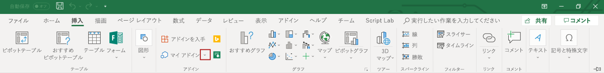

# <a name="tutorial-create-custom-functions-in-excel"></a><span data-ttu-id="3a3fc-101">チュートリアル: Excel でのカスタム関数の作成</span><span class="sxs-lookup"><span data-stu-id="3a3fc-101">Tutorial: Create custom functions in Excel</span></span>

## <a name="introduction"></a><span data-ttu-id="3a3fc-102">概要</span><span class="sxs-lookup"><span data-stu-id="3a3fc-102">Introduction</span></span>

<span data-ttu-id="3a3fc-103">カスタム関数では、関数をアドインの一部として JavaScript で定義することによって、Excel に新しい関数を追加できます。</span><span class="sxs-lookup"><span data-stu-id="3a3fc-103">Custom functions enable you to add new functions to Excel by defining those functions in JavaScript as part of an add-in.</span></span> <span data-ttu-id="3a3fc-104">ユーザーは Excel 内から、`SUM()` などの Excel のあらゆるネイティブ関数の場合と同じようにカスタム関数にアクセスできます。</span><span class="sxs-lookup"><span data-stu-id="3a3fc-104">Users within Excel can access custom functions just as they would any native function in Excel, such as `SUM()`.</span></span> <span data-ttu-id="3a3fc-105">ユーザー定義の計算のような単純なタスク、または Web からワークシートへのデータのリアルタイム ストリーミングのようなより複雑なタスクを実行するカスタム関数を作成できます。</span><span class="sxs-lookup"><span data-stu-id="3a3fc-105">You can create custom functions that perform simple tasks such as custom calculations or more complex tasks such as streaming real-time data from the web into a worksheet.</span></span>

<span data-ttu-id="3a3fc-106">このチュートリアルの内容:</span><span class="sxs-lookup"><span data-stu-id="3a3fc-106">In this tutorial, you will:</span></span>
> [!div class="checklist"]
> * <span data-ttu-id="3a3fc-107">Yo Office ジェネレーターを使用してカスタム関数プロジェクトを作成する</span><span class="sxs-lookup"><span data-stu-id="3a3fc-107">Create a custom functions project by using the Yo Office generator</span></span>
> * <span data-ttu-id="3a3fc-108">あらかじめ用意されているカスタム関数を使用し、単純な計算を実行する</span><span class="sxs-lookup"><span data-stu-id="3a3fc-108">Use a prebuilt custom function to perform a simple calculation</span></span>
> * <span data-ttu-id="3a3fc-109">Web からデータを要求するカスタム関数を作成する</span><span class="sxs-lookup"><span data-stu-id="3a3fc-109">Create a custom function that requests data from the web</span></span>
> * <span data-ttu-id="3a3fc-110">Web からデータをリアルタイムでストリーミングするカスタム関数を作成する</span><span class="sxs-lookup"><span data-stu-id="3a3fc-110">Create a custom function that streams real-time data from the web</span></span>

[!include[Excel custom functions note](../includes/excel-custom-functions-note.md)]

## <a name="prerequisites"></a><span data-ttu-id="3a3fc-111">前提条件</span><span class="sxs-lookup"><span data-stu-id="3a3fc-111">Prerequisites</span></span>

* <span data-ttu-id="3a3fc-112">[Node.js](https://nodejs.org/en/) (バージョン 8.0.0 以降)</span><span class="sxs-lookup"><span data-stu-id="3a3fc-112">[Node.js](https://nodejs.org/en/) (version 8.0.0 or later)</span></span>

* <span data-ttu-id="3a3fc-113">[Git バッシュ](https://git-scm.com/downloads) (または別の Git クライアント)</span><span class="sxs-lookup"><span data-stu-id="3a3fc-113">[Git Bash](https://git-scm.com/downloads) (or another Git client)</span></span>

* <span data-ttu-id="3a3fc-114">最新バージョンの [Yeoman](https://yeoman.io/) と [Office アドイン用の Yeoman ジェネレーター](https://www.npmjs.com/package/generator-office)。これらのツールをグローバルにインストールするには、コマンド プロンプトから次のコマンドを実行します。</span><span class="sxs-lookup"><span data-stu-id="3a3fc-114">The latest version of [Yeoman](https://yeoman.io/) and the [Yeoman generator for Office Add-ins](https://www.npmjs.com/package/generator-office). To install these tools globally, run the following command from the command prompt:</span></span>

    ```
    npm install -g yo generator-office
    ```

    > [!NOTE]
    > <span data-ttu-id="3a3fc-115">以前に Yeoman ジェネレーターをインストールしている場合でも、npm からパッケージを最新バージョンに更新することをお勧めします。</span><span class="sxs-lookup"><span data-stu-id="3a3fc-115">Even if you have previously installed the Yeoman generator, we recommend updating your package to the latest version from npm.</span></span>

* <span data-ttu-id="3a3fc-116">Windows 版 Excel (64 ビット バージョン 1810 以降) または Excel Online</span><span class="sxs-lookup"><span data-stu-id="3a3fc-116">Excel for Windows (version 1810 or later) or Excel Online</span></span>

* <span data-ttu-id="3a3fc-117">[Office Insider プログラム](https://products.office.com/office-insider)に加入する (**Insider** レベル -- 以前は "Insider Fast" と呼ばれていたもの)</span><span class="sxs-lookup"><span data-stu-id="3a3fc-117">Join the [Office Insider program](https://products.office.com/office-insider) (**Insider** level -- formerly called "Insider Fast")</span></span>

## <a name="create-a-custom-functions-project"></a><span data-ttu-id="3a3fc-118">カスタム関数プロジェクトを作成する</span><span class="sxs-lookup"><span data-stu-id="3a3fc-118">Create a custom functions project</span></span>

 <span data-ttu-id="3a3fc-119">はじめに、Yeoman ジェネレーターを使って、カスタム関数プロジェクトを作成します。</span><span class="sxs-lookup"><span data-stu-id="3a3fc-119">To start, you'll use the Yeoman generator to create the custom functions project.</span></span> <span data-ttu-id="3a3fc-120">これにより、カスタム関数のコーディングを開始するための正しいフォルダー構造、ソース ファイル、依存関係によるプロジェクトがセットアップされます。</span><span class="sxs-lookup"><span data-stu-id="3a3fc-120">This will set up your project with the correct folder structure, source files, and dependencies to begin coding your custom functions.</span></span>

1. <span data-ttu-id="3a3fc-121">次のコマンドを実行し、以下のようにプロンプトに応答します。</span><span class="sxs-lookup"><span data-stu-id="3a3fc-121">Run the following command and then answer the prompts as follows.</span></span>

    ```
    yo office
    ```

    * <span data-ttu-id="3a3fc-122">Choose a project type (プロジェクトの種類を選択): `Excel Custom Functions Add-in project (...)`</span><span class="sxs-lookup"><span data-stu-id="3a3fc-122">Choose a project type: `Excel Custom Functions Add-in project (...)`</span></span>

    * <span data-ttu-id="3a3fc-123">Choose a script type (スクリプトの種類を選択): `JavaScript`</span><span class="sxs-lookup"><span data-stu-id="3a3fc-123">Choose a script type: `JavaScript`</span></span>

    * <span data-ttu-id="3a3fc-124">What would you want to name your add-in? (アドインの名前を何にしますか)</span><span class="sxs-lookup"><span data-stu-id="3a3fc-124">What do you want to name your add-in?</span></span> `stock-ticker`

    

    <span data-ttu-id="3a3fc-126">Yeoman ジェネレーターはプロジェクト ファイルを作成し、サポートしているノード コンポーネントをインストールします。</span><span class="sxs-lookup"><span data-stu-id="3a3fc-126">The generator will create the project and install supporting Node components.</span></span> <span data-ttu-id="3a3fc-127">プロジェクト ファイルは [Excel-Custom-Functions](https://github.com/OfficeDev/Excel-Custom-Functions) GitHub リポジトリにあります。</span><span class="sxs-lookup"><span data-stu-id="3a3fc-127">The project files come from the [Excel-Custom-Functions](https://github.com/OfficeDev/Excel-Custom-Functions) GitHub repository.</span></span>

2. <span data-ttu-id="3a3fc-128">プロジェクト フォルダーに移動します。</span><span class="sxs-lookup"><span data-stu-id="3a3fc-128">Go to the project folder.</span></span>

    ```
    cd stock-ticker
    ```

3. <span data-ttu-id="3a3fc-129">このプロジェクトを実行するために必要な自己署名証明書を信頼します。</span><span class="sxs-lookup"><span data-stu-id="3a3fc-129">Trust the self-signed certificate that is needed to run this project.</span></span> <span data-ttu-id="3a3fc-130">Windows または Mac についての詳細な手順については、「[自己署名証明書を信頼済みルート証明書として追加する](https://github.com/OfficeDev/generator-office/blob/master/src/docs/ssl.md)」を参照してください。</span><span class="sxs-lookup"><span data-stu-id="3a3fc-130">For detailed instructions for either Windows or Mac, see [Adding Self Signed Certificates as Trusted Root Certificate](https://github.com/OfficeDev/generator-office/blob/master/src/docs/ssl.md).</span></span>  

4. <span data-ttu-id="3a3fc-131">プロジェクトをビルドします。</span><span class="sxs-lookup"><span data-stu-id="3a3fc-131">Build the project.</span></span>

    ```
    npm run build
    ```

5. <span data-ttu-id="3a3fc-132">Node.js で実行しているローカル Web サーバーを開始します。</span><span class="sxs-lookup"><span data-stu-id="3a3fc-132">Start the local web server, which runs in Node.js.</span></span>

    * <span data-ttu-id="3a3fc-133">Windows 版 Excel を使用してカスタム関数をテストする場合、次のコマンドを実行してローカル Web サーバーを開始し、Excel を起動し、アドインをサイドロードします。</span><span class="sxs-lookup"><span data-stu-id="3a3fc-133">If you'll be using Excel for Windows to test your custom functions, run the following command to start the local web server, launch Excel, and sideload the add-in:</span></span>

        ```
         npm run start
        ```
        <span data-ttu-id="3a3fc-134">次のコマンドを実行すると、コマンド プロンプトに実行した作業についての詳細が表示され、別の npm ウィンドウが開いてビルドの詳細が表示され、アドインを読み込んだ状態で Excel が起動します。</span><span class="sxs-lookup"><span data-stu-id="3a3fc-134">After running this command, your command prompt will show details about what has been done, another npm window will open showing the details of the build, and Excel will start with your add-in loaded.</span></span> <span data-ttu-id="3a3fc-135">アドインが読み込まれない場合は、手順 3 が正しく完了しているか確認してください。</span><span class="sxs-lookup"><span data-stu-id="3a3fc-135">If you add-in does not load, check that you have completed step 3 properly.</span></span>

    * <span data-ttu-id="3a3fc-136">Excel Online を使用してカスタム関数をテストする場合、次のコマンドを実行してローカル Web サーバーを開始します。</span><span class="sxs-lookup"><span data-stu-id="3a3fc-136">If you'll be using Excel Online to test your custom functions, run the following command to start the local web server:</span></span>

        ```
        npm run start-web
        ```

         <span data-ttu-id="3a3fc-137">次のコマンドを実行すると、別のウィンドウが開いてビルドの詳細が表示されます。</span><span class="sxs-lookup"><span data-stu-id="3a3fc-137">After running this command, another window will open showing you the details of the build.</span></span> <span data-ttu-id="3a3fc-138">関数を使って、Office Online に新しいブックを開きます。</span><span class="sxs-lookup"><span data-stu-id="3a3fc-138">To use your functions, open a new workbook in Office Online.</span></span>

## <a name="try-out-a-prebuilt-custom-function"></a><span data-ttu-id="3a3fc-139">あらかじめ用意されているカスタム関数を試す</span><span class="sxs-lookup"><span data-stu-id="3a3fc-139">Try out a prebuilt custom function</span></span>

<span data-ttu-id="3a3fc-140">Yeoman ジェネレーターで作成したカスタム関数プロジェクトには、あらかじめ用意されているカスタム関数がいくつか含まれており、**src/customfunctions.js** ファイル内で定義されています。</span><span class="sxs-lookup"><span data-stu-id="3a3fc-140">The custom functions project that you created by using the Yo Office generator contains some prebuilt custom functions, defined within the **src/functions/functions.js** file.</span></span> <span data-ttu-id="3a3fc-141">プロジェクトのルート ディレクトリの **manifest.xml** ファイルによって、カスタム関数はすべて `CONTOSO` 名前空間に属することが指定されます。</span><span class="sxs-lookup"><span data-stu-id="3a3fc-141">The **manifest.xml** file in the root directory of the project specifies that all custom functions belong to the `CONTOSO` namespace.</span></span>

<span data-ttu-id="3a3fc-142">Excel の Excel ブックで次の手順を実行し、`ADD` カスタム関数を試してみてください。</span><span class="sxs-lookup"><span data-stu-id="3a3fc-142">In your Excel workbook, try out the `ADD` custom function by completing the following steps in Excel:</span></span>

1. <span data-ttu-id="3a3fc-143">セル内に **=CONTOSO** と入力します。</span><span class="sxs-lookup"><span data-stu-id="3a3fc-143">Within a cell, type **=CONTOSO**.</span></span> <span data-ttu-id="3a3fc-144">`CONTOSO` 名前空間にあるすべての関数がオートコンプリート メニューに一覧表示されます。</span><span class="sxs-lookup"><span data-stu-id="3a3fc-144">Notice that the autocomplete menu shows the list of all functions in the `CONTOSO` namespace.</span></span>

2. <span data-ttu-id="3a3fc-145">セル内で値 `=CONTOSO.ADD(10,200)` を入力して Enter キーを押し、入力パラメーターとして `10` と `200` を指定して、`CONTOSO.ADD` 関数を実行します。</span><span class="sxs-lookup"><span data-stu-id="3a3fc-145">Run the `CONTOSO.ADD` function, with numbers `10` and `200` as input parameters, by typing the value `=CONTOSO.ADD(10,200)` in the cell and pressing enter.</span></span>

<span data-ttu-id="3a3fc-146">`ADD` カスタム関数によって、入力パラメーターとして指定した 2 つの数字の合計が計算されます。</span><span class="sxs-lookup"><span data-stu-id="3a3fc-146">The `ADD` custom function computes the sum of the two numbers that you specify as input parameters.</span></span> <span data-ttu-id="3a3fc-147">「`=CONTOSO.ADD(10,200)`」と入力して Enter キーを押すと、**210** という結果が生成されるはずです。</span><span class="sxs-lookup"><span data-stu-id="3a3fc-147">Typing `=CONTOSO.ADD(10,200)` should produce the result **210** in the cell after you press enter.</span></span>

## <a name="create-a-custom-function-that-requests-data-from-the-web"></a><span data-ttu-id="3a3fc-148">Web からデータを要求するカスタム関数を作成する</span><span class="sxs-lookup"><span data-stu-id="3a3fc-148">Create a custom function that requests data from the web</span></span>

<span data-ttu-id="3a3fc-149">API に株価を要求し、ワークシートのセルに結果を表示する関数が必要になった場合、どうすればよいでしょうか。</span><span class="sxs-lookup"><span data-stu-id="3a3fc-149">What if you needed a function that could request the price of a stock from an API and display the result in the cell of a worksheet?</span></span> <span data-ttu-id="3a3fc-150">カスタム関数は、Web にデータを非同期で簡単に要求できるように設計されています。</span><span class="sxs-lookup"><span data-stu-id="3a3fc-150">Custom functions are designed so that you can easily request data from the web asynchronously.</span></span>

<span data-ttu-id="3a3fc-151">次の手順を実行し、銘柄コード (**MSFT** など) を受け取り、その株価を返す、`stockPrice` という名前のカスタム関数を作成します。</span><span class="sxs-lookup"><span data-stu-id="3a3fc-151">Complete the following steps to create a custom function named `stockPrice` that accepts a stock ticker (e.g., **MSFT**) and returns the price of that stock.</span></span> <span data-ttu-id="3a3fc-152">このカスタム関数では、IEX Trading API が使用されます。これは無料であり、認証を必要としません。</span><span class="sxs-lookup"><span data-stu-id="3a3fc-152">This custom function uses the IEX Trading API, which is free and does not require authentication.</span></span>

1. <span data-ttu-id="3a3fc-153">Yeoman ジェネレーターによって作成された**銘柄コード**プロジェクトで**src/customfunctions.js** ファイルを見つけ、それをコード エディターで開きます。</span><span class="sxs-lookup"><span data-stu-id="3a3fc-153">In the **stock-ticker** project that the Yo Office generator created, find the file **src/customfunctions.js** and open it in your code editor.</span></span>

2. <span data-ttu-id="3a3fc-154">**customfunctions.js** で、`increment` 関数を見つけ、その関数の直後に次のコードを追加します。</span><span class="sxs-lookup"><span data-stu-id="3a3fc-154">In **customfunctions.js**, locate the `increment` function and add the following code immediately after that function.</span></span>

    ```js
    function stockPrice(ticker) {
        var url = "https://api.iextrading.com/1.0/stock/" + ticker + "/price";
        return fetch(url)
            .then(function(response) {
                return response.text();
            })
            .then(function(text) {
                return parseFloat(text);
            });

        // Note: in case of an error, the returned rejected Promise
        //    will be bubbled up to Excel to indicate an error.
    }

3. In **customfunctions.js**, locate the line`CustomFunctionMappings.INCREMENT = increment;`, add the following line of code immediately after that line, and save the file.

    ```js
    CustomFunctionMappings.STOCKPRICE = stockPrice;
    ```

4. <span data-ttu-id="3a3fc-155">Excel でこの新しい関数を使用できるようにするには、Excel で関数について説明するメタデータを指定する必要があります。</span><span class="sxs-lookup"><span data-stu-id="3a3fc-155">Before Excel can make this new function available to end-users, you must specify metadata that describes this function.</span></span> <span data-ttu-id="3a3fc-156">**config/customfunctions.json** ファイルを開きます。</span><span class="sxs-lookup"><span data-stu-id="3a3fc-156">Open the **config/customfunctions.json** file.</span></span> <span data-ttu-id="3a3fc-157">'関数' 配列に次の JSON オブジェクトを追加し、ファイルを保存します。</span><span class="sxs-lookup"><span data-stu-id="3a3fc-157">Add the following object to the  array within the src/functions/functions.json file and save the file.</span></span>

    <span data-ttu-id="3a3fc-158">この JSON では、`stockPrice` 関数について説明しています。</span><span class="sxs-lookup"><span data-stu-id="3a3fc-158">This JSON describes the `stockPrice` function.</span></span>

    ```JSON
    {
        "id": "STOCKPRICE",
        "name": "STOCKPRICE",
        "description": "Fetches current stock price",
        "helpUrl": "http://www.contoso.com/help",
        "result": {
            "type": "number",
            "dimensionality": "scalar"
        },  
        "parameters": [
            {
                "name": "ticker",
                "description": "stock ticker name",
                "type": "string",
                "dimensionality": "scalar"
            }
        ]
    }
    ```

5. <span data-ttu-id="3a3fc-159">新しい関数をエンドユーザーが使用できるようにするには、Excel にアドインを再登録する必要があります。</span><span class="sxs-lookup"><span data-stu-id="3a3fc-159">You must reregister the add-in in Excel in order for the new function to be available to end-users.</span></span> <span data-ttu-id="3a3fc-160">このチュートリアルで使用しているプラットフォームの場合、次の手順を実行します。</span><span class="sxs-lookup"><span data-stu-id="3a3fc-160">Complete the following steps for the platform that you're using in this tutorial.</span></span>

    * <span data-ttu-id="3a3fc-161">Windows 版 Excel を使用する場合:</span><span class="sxs-lookup"><span data-stu-id="3a3fc-161">If you're using Excel for Windows:</span></span>

        1. <span data-ttu-id="3a3fc-162">Excel を閉じて再び開きます。</span><span class="sxs-lookup"><span data-stu-id="3a3fc-162">Close Excel and then reopen Excel.</span></span>

        2. <span data-ttu-id="3a3fc-163">Excel で [**挿入**] タブを選択し、[**個人用アドイン**] の右にある下向き矢印を選択します。![[個人用アドイン] 矢印が強調表示されている Windows 版 Excel の [挿入] リボン](../images/excel-cf-register-add-in-1b.png)</span><span class="sxs-lookup"><span data-stu-id="3a3fc-163">In Excel, choose the **Insert** tab and then choose the down-arrow located to the right of **My Add-ins**.  </span></span>

        3. <span data-ttu-id="3a3fc-164">使用可能なアドインの一覧から **[開発者向けアドイン]** セクションを見つけ、**銘柄コード** アドインを選択して登録します。</span><span class="sxs-lookup"><span data-stu-id="3a3fc-164">In the list of available add-ins, find the **Developer Add-ins** section and select the **Excel Custom Functions** add-in to register it.</span></span>
            <span data-ttu-id="3a3fc-165">![[個人用アドイン] 一覧で [Excel カスタム関数] アドインが強調表示されている Windows 版 Excel の [挿入] リボン](../images/excel-cf-register-add-in-2.png)</span><span class="sxs-lookup"><span data-stu-id="3a3fc-165"></span></span>

    * <span data-ttu-id="3a3fc-166">Excel Online を使用する場合:</span><span class="sxs-lookup"><span data-stu-id="3a3fc-166">If you're using Excel Online:</span></span>

        1. <span data-ttu-id="3a3fc-167">Excel Online で [**挿入**] タブを選択し、[**アドイン**] を選択します。![[個人用アドイン] アイコンが強調表示されている Excel Online の [挿入] リボン](../images/excel-cf-online-register-add-in-1.png)</span><span class="sxs-lookup"><span data-stu-id="3a3fc-167">In Excel Online, choose the **Insert** tab and then choose **Add-ins**.  </span></span>

        2. <span data-ttu-id="3a3fc-168">**[マイ アドインの管理]** を選択し、**[マイ アドインのアップロード]** を選択します。</span><span class="sxs-lookup"><span data-stu-id="3a3fc-168">Choose **Manage My Add-ins** and select **Upload My Add-in**.</span></span> 

        3. <span data-ttu-id="3a3fc-169">**[参照...]** を選択し、Yeoman ジェネレーターによって作成されたプロジェクトのルート ディレクトリに移動します。</span><span class="sxs-lookup"><span data-stu-id="3a3fc-169">Choose **Browse...** and navigate to the root directory of the project that the Yo Office generator created.</span></span> 

        4. <span data-ttu-id="3a3fc-170">**manifest.xml** ファイルを選択し、**[開く]** を選択し、**[アップロード]** を選択します。</span><span class="sxs-lookup"><span data-stu-id="3a3fc-170">Select the file **manifest.xml** and choose **Open**, then choose **Upload**.</span></span>

6. <span data-ttu-id="3a3fc-171">それでは、新しい関数を試してみましょう。</span><span class="sxs-lookup"><span data-stu-id="3a3fc-171">Now, let's try out the new function.</span></span> <span data-ttu-id="3a3fc-172">セル **B1** にテキスト `=CONTOSO.STOCKPRICE("MSFT")` を入力し、Enter キーを押します。</span><span class="sxs-lookup"><span data-stu-id="3a3fc-172">In cell **B1**, type the text `=CONTOSO.STOCKPRICE("MSFT")` and press enter.</span></span> <span data-ttu-id="3a3fc-173">セル **B1** の結果が Microsoft の最新株価になっているはずです。</span><span class="sxs-lookup"><span data-stu-id="3a3fc-173">You should see that the result in cell **B1** is the current stock price for one share of Microsoft stock.</span></span>

## <a name="create-a-streaming-asynchronous-custom-function"></a><span data-ttu-id="3a3fc-174">非同期でデータをストリーミングするカスタム関数を作成する</span><span class="sxs-lookup"><span data-stu-id="3a3fc-174">Create a streaming asynchronous custom function</span></span>

<span data-ttu-id="3a3fc-175">作成した `stockPrice` 関数では、特定の時点での株価が返されますが、株価は常に変動するものです。</span><span class="sxs-lookup"><span data-stu-id="3a3fc-175">The `stockPrice` function that you just created returns the price of a stock at a specific moment in time, but stock prices are always changing.</span></span> <span data-ttu-id="3a3fc-176">API からデータをストリーミングし、株価をリアルタイム更新するカスタム関数を作成しましょう。</span><span class="sxs-lookup"><span data-stu-id="3a3fc-176">Let's create a custom function that streams data from an API to get real-time updates on a stock price.</span></span>

<span data-ttu-id="3a3fc-177">次の手順を実行し、(前の要求が完了しているという条件で) 1,000 ミリ秒ごとに指定の株価を要求する、`stockPriceStream` という名前のカスタム関数を作成します。</span><span class="sxs-lookup"><span data-stu-id="3a3fc-177">Complete the following steps to create a custom function named `stockPriceStream` that requests the price of the specified stock every 1000 milliseconds (provided that the previous request has completed).</span></span> <span data-ttu-id="3a3fc-178">最初の要求が進行中のとき、関数が呼び出されているセルに **#GETTING_DATA** というプレースホルダー値が表示されることがあります。</span><span class="sxs-lookup"><span data-stu-id="3a3fc-178">While the initial request is in-progress, you may see the placeholder value **#GETTING_DATA** the cell where the function is being called.</span></span> <span data-ttu-id="3a3fc-179">関数によって値が返されると、そのセルの **#GETTING_DATA** がその値で置換られます。</span><span class="sxs-lookup"><span data-stu-id="3a3fc-179">When a value is returned by the function, **#GETTING_DATA** will be replaced by that value in the cell.</span></span>

1. <span data-ttu-id="3a3fc-180">Yeoman ジェネレーターによって作成された**銘柄コード** プロジェクトで、次のコードを **src/customfunctions.js** に追加し、ファイルを保存します。</span><span class="sxs-lookup"><span data-stu-id="3a3fc-180">In the **stock-ticker** project that the Yo Office generator created, add the following code to **src/customfunctions.js** and save the file.</span></span>

    ```js
    function stockPriceStream(ticker, handler) {
        var updateFrequency = 1000 /* milliseconds*/;
        var isPending = false;

        var timer = setInterval(function() {
            // If there is already a pending request, skip this iteration:
            if (isPending) {
                return;
            }

            var url = "https://api.iextrading.com/1.0/stock/" + ticker + "/price";
            isPending = true;

            fetch(url)
                .then(function(response) {
                    return response.text();
                })
                .then(function(text) {
                    handler.setResult(parseFloat(text));
                })
                .catch(function(error) {
                    handler.setResult(error);
                })
                .then(function() {
                    isPending = false;
                });
        }, updateFrequency);

        handler.onCanceled = () => {
            clearInterval(timer);
        };
    }

    CustomFunctionMappings.STOCKPRICESTREAM = stockPriceStream;
    ```

2. <span data-ttu-id="3a3fc-181">Excel のユーザーがこの新しい関数を使用できるようにするには、この関数について説明するメタデータを指定します。</span><span class="sxs-lookup"><span data-stu-id="3a3fc-181">Before Excel can make this new function available to end-users, you must specify metadata that describes this function.</span></span> <span data-ttu-id="3a3fc-182">Yeoman ジェネレーターによって作成された**銘柄コード** プロジェクトで、**config/customfunctions.json** ファイル内の `functions` 配列に次のオブジェクトを追加し、ファイルを保存します。</span><span class="sxs-lookup"><span data-stu-id="3a3fc-182">In the **stock-ticker** project that the Yo Office generator created, add the following object to the `functions` array within the **config/customfunctions.json** file and save the file.</span></span>

    <span data-ttu-id="3a3fc-183">この JSON では、`stockPriceStream` 関数について説明しています。</span><span class="sxs-lookup"><span data-stu-id="3a3fc-183">This JSON describes the `stockPriceStream` function.</span></span> <span data-ttu-id="3a3fc-184">ストリーミング関数の場合、このコード サンプルで示すように、`options` オブジェクト内で `stream` プロパティと `cancelable` プロパティを `true` に設定する必要があります。</span><span class="sxs-lookup"><span data-stu-id="3a3fc-184">For any streaming function, the `stream` property and the `cancelable` property must be set to `true` within the `options` object, as shown in this code sample.</span></span>

    ```json
    { 
        "id": "STOCKPRICESTREAM",
        "name": "STOCKPRICESTREAM",
        "description": "Streams real time stock price",
        "helpUrl": "http://www.contoso.com/help",
        "result": {
            "type": "number",
            "dimensionality": "scalar"
        },  
        "parameters": [
            {
                "name": "ticker",
                "description": "stock ticker name",
                "type": "string",
                "dimensionality": "scalar"
            }
        ],
        "options": {
            "stream": true,
            "cancelable": true
        }
    }
    ```

3. <span data-ttu-id="3a3fc-185">新しい関数をエンドユーザーが使用できるようにするには、Excel にアドインを再登録する必要があります。</span><span class="sxs-lookup"><span data-stu-id="3a3fc-185">You must reregister the add-in in Excel in order for the new function to be available to end-users.</span></span> <span data-ttu-id="3a3fc-186">このチュートリアルで使用しているプラットフォームの場合、次の手順を実行します。</span><span class="sxs-lookup"><span data-stu-id="3a3fc-186">Complete the following steps for the platform that you're using in this tutorial.</span></span>

    * <span data-ttu-id="3a3fc-187">Windows 版 Excel を使用する場合:</span><span class="sxs-lookup"><span data-stu-id="3a3fc-187">If you're using Excel for Windows:</span></span>

        1. <span data-ttu-id="3a3fc-188">Excel を閉じて再び開きます。</span><span class="sxs-lookup"><span data-stu-id="3a3fc-188">Close Excel and then reopen Excel.</span></span>
        
        2. <span data-ttu-id="3a3fc-189">Excel で [**挿入**] タブを選択し、[**個人用アドイン**] の右にある下向き矢印を選択します。![[個人用アドイン] 矢印が強調表示されている Windows 版 Excel の [挿入] リボン](../images/excel-cf-register-add-in-1b.png)</span><span class="sxs-lookup"><span data-stu-id="3a3fc-189">In Excel, choose the **Insert** tab and then choose the down-arrow located to the right of **My Add-ins**.  </span></span>

        3. <span data-ttu-id="3a3fc-190">使用可能なアドインの一覧から **[開発者向けアドイン]** セクションを見つけ、**銘柄コード** アドインを選択して登録します。</span><span class="sxs-lookup"><span data-stu-id="3a3fc-190">In the list of available add-ins, find the **Developer Add-ins** section and select the **Excel Custom Functions** add-in to register it.</span></span>
            <span data-ttu-id="3a3fc-191">![[個人用アドイン] 一覧で [Excel カスタム関数] アドインが強調表示されている Windows 版 Excel の [挿入] リボン](../images/excel-cf-register-add-in-2.png)</span><span class="sxs-lookup"><span data-stu-id="3a3fc-191"></span></span>

    * <span data-ttu-id="3a3fc-192">Excel Online を使用する場合:</span><span class="sxs-lookup"><span data-stu-id="3a3fc-192">If you're using Excel Online:</span></span>

        1. <span data-ttu-id="3a3fc-193">Excel Online で [**挿入**] タブを選択し、[**アドイン**] を選択します。![[個人用アドイン] アイコンが強調表示されている Excel Online の [挿入] リボン](../images/excel-cf-online-register-add-in-1.png)</span><span class="sxs-lookup"><span data-stu-id="3a3fc-193">In Excel Online, choose the **Insert** tab and then choose **Add-ins**.  </span></span>

        2. <span data-ttu-id="3a3fc-194">**[マイ アドインの管理]** を選択し、**[マイ アドインのアップロード]** を選択します。</span><span class="sxs-lookup"><span data-stu-id="3a3fc-194">Choose **Manage My Add-ins** and select **Upload My Add-in**.</span></span>

        3. <span data-ttu-id="3a3fc-195">**[参照...]** を選択し、Yeoman ジェネレーターによって作成されたプロジェクトのルート ディレクトリに移動します。</span><span class="sxs-lookup"><span data-stu-id="3a3fc-195">Choose **Browse...** and navigate to the root directory of the project that the Yo Office generator created.</span></span>

        4. <span data-ttu-id="3a3fc-196">**manifest.xml** ファイルを選択し、**[開く]** を選択し、**[アップロード]** を選択します。</span><span class="sxs-lookup"><span data-stu-id="3a3fc-196">Select the file **manifest.xml** and choose **Open**, then choose **Upload**.</span></span>

4. <span data-ttu-id="3a3fc-197">それでは、新しい関数を試してみましょう。</span><span class="sxs-lookup"><span data-stu-id="3a3fc-197">Now, let's try out the new function.</span></span> <span data-ttu-id="3a3fc-198">セル **C1** にテキスト `=CONTOSO.STOCKPRICESTREAM("MSFT")` を入力し、Enter キーを押します。</span><span class="sxs-lookup"><span data-stu-id="3a3fc-198">In cell **C1**, type the text `=CONTOSO.STOCKPRICESTREAM("MSFT")` and press enter.</span></span> <span data-ttu-id="3a3fc-199">株式市場が開いている場合、セル **C1** の結果が継続的に更新され、Microsoft の株価がリアルタイムで反映されます。</span><span class="sxs-lookup"><span data-stu-id="3a3fc-199">Provided that the stock market is open, you should see that the result in cell **C1** is constantly updated to reflect the real-time price for one share of Microsoft stock.</span></span>

## <a name="next-steps"></a><span data-ttu-id="3a3fc-200">次の手順</span><span class="sxs-lookup"><span data-stu-id="3a3fc-200">Next steps</span></span>

<span data-ttu-id="3a3fc-201">このチュートリアルでは、新しいカスタム関数プロジェクトを作成し、あらかじめ用意されている関数を試し、Web にデータを要求するカスタム関数を作成し、Web からデータをリアルタイムでストリーミングするカスタム関数を作成しました。</span><span class="sxs-lookup"><span data-stu-id="3a3fc-201">In this tutorial, you've created a new custom functions project, tried out a prebuilt function, created a custom function that requests data from the web, and created a custom function that streams real-time data from the web.</span></span> <span data-ttu-id="3a3fc-202">Excel のカスタム関数に関する詳細については、次の記事にお進みください。</span><span class="sxs-lookup"><span data-stu-id="3a3fc-202">To learn more about custom functions in Excel, continue to the following article:</span></span>

> [!div class="nextstepaction"]
> [<span data-ttu-id="3a3fc-203">Excel でカスタム関数を作成する</span><span class="sxs-lookup"><span data-stu-id="3a3fc-203">Create custom functions in Excel</span></span>](../excel/custom-functions-overview.md)

## <a name="legal-information"></a><span data-ttu-id="3a3fc-204">法的情報</span><span class="sxs-lookup"><span data-stu-id="3a3fc-204">Legal information</span></span>

<span data-ttu-id="3a3fc-205">データは [IEX](https://iextrading.com/developer/) より無料提供されました。</span><span class="sxs-lookup"><span data-stu-id="3a3fc-205">Data provided free by [IEX](https://iextrading.com/developer/).</span></span> <span data-ttu-id="3a3fc-206">[IEX の利用規約](https://iextrading.com/api-exhibit-a/)をご覧ください。</span><span class="sxs-lookup"><span data-stu-id="3a3fc-206">View [IEX's Terms of Use](https://iextrading.com/api-exhibit-a/).</span></span> <span data-ttu-id="3a3fc-207">Microsoft はこのチュートリアルで IEX API を教育目的でのみ使用しています。</span><span class="sxs-lookup"><span data-stu-id="3a3fc-207">Microsoft's use of the IEX API in this tutorial is for educational purposes only.</span></span>
