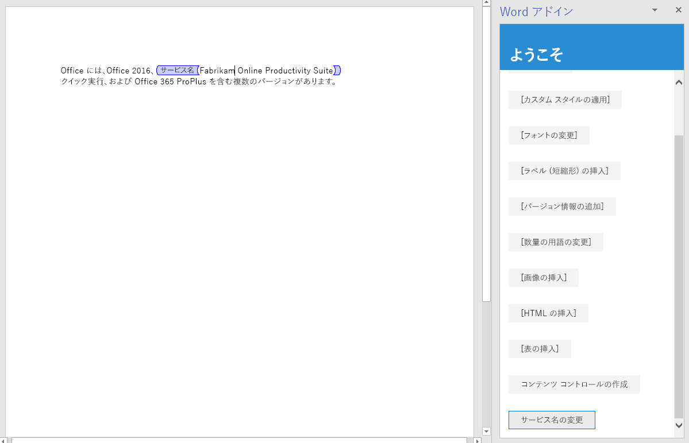

このチュートリアルの手順では、ドキュメント内にリッチ テキスト コンテンツ コントロールを作成する方法、およびそのコントロールにコンテンツを挿入したり置き換えたりする方法について説明します。 

> [!NOTE]
> このページでは、Word アドインのチュートリアルの個々の手順について説明します。このページに検索エンジンの結果から、またはその他の直接リンクからアクセスした場合は、「[Word アドインのチュートリアル](../tutorials/word-tutorial.yml)」の紹介ページに移動し、チュートリアルを最初から始めてください。

チュートリアルのこの手順を開始する前に、Word UI からリッチ テキスト コンテンツ コントロールを作成して操作し、コントロールとそのプロパティを理解しておくことをお勧めします。 詳細については、「[ユーザーが Word 上で記入または印刷するフォームを作成する](https://support.office.com/article/create-forms-that-users-complete-or-print-in-word-040c5cc1-e309-445b-94ac-542f732c8c8b)」を参照してください。

> [!NOTE]
> UI から Word 文書に追加できるコンテンツ コントロールにはいくつかの種類がありますが、Word.js では現在のところリッチ テキスト コンテンツ コントロールのみがサポートされています。


## <a name="create-a-content-control"></a>コンテンツ コントロールを作成する

1. コード エディターでプロジェクトを開きます。 
2. index.html ファイルを開きます。
3. ボタンを格納している `div` の下に、次のマークアップを追加します。`replace-text`

    ```html
    <div class="padding">            
        <button class="ms-Button" id="create-content-control">Create Content Control</button>            
    </div>
    ```

4. app.js ファイルを開きます。

5. ボタンにクリック ハンドラーを割り当てる行の下に、次のコードを追加します。`insert-table`

    ```js
    $('#create-content-control').click(createContentControl);
    ```

6. 関数の下に、次の関数を追加します。`insertTable`

    ```js
    function createContentControl() {
        Word.run(function (context) {
            
            // TODO1: Queue commands to create a content control.

            return context.sync();
        })
        .catch(function (error) {
            console.log("Error: " + error);
            if (error instanceof OfficeExtension.Error) {
                console.log("Debug info: " + JSON.stringify(error.debugInfo));
            }
        });
    }
    ``` 

7. |||UNTRANSLATED_CONTENT_START|||Replace `TODO1` with the following code. Note:|||UNTRANSLATED_CONTENT_END|||
   - このコードの目的は、コンテンツ コントロール内の Office 365 という語句をラップすることです。 これは前提を単純化し、文字列は存在しており、ユーザーがその文字列を選択したものとしています。
   - プロパティは、コンテンツ コントロールの表示タイトルを指定します。`ContentControl.title` 
   - プロパティは、`ContentControlCollection.getByTag` メソッドを使用してコンテンツ コントロールへの参照を取得するために使用できるタグを指定します。これを後述する関数で使用します。`ContentControl.tag` 
   - プロパティは、コントロールの外観を指定します。`ContentControl.appearance` Tags という値を使用すると、コントロールは開始タグと終了タグにラップされます。開始タグには、コンテンツ コントロールのタイトルが設定されます。 その他の値として、BoundingBox と None が使用できます。
   - プロパティは、タグまたは境界ボックスの境界線の色を指定します。`ContentControl.color`

    ```js
    const serviceNameRange = context.document.getSelection();
    const serviceNameContentControl = serviceNameRange.insertContentControl();
    serviceNameContentControl.title = "Service Name";
    serviceNameContentControl.tag = "serviceName";
    serviceNameContentControl.appearance = "Tags";
    serviceNameContentControl.color = "blue";
    ``` 

## <a name="replace-the-content-of-the-content-control"></a>コンテンツ コントロールのコンテンツを置き換える

1. index.html ファイルを開きます。
2. ボタンを格納している `div` の下に、次のマークアップを追加します。`create-content-control`

    ```html
    <div class="padding">            
        <button class="ms-Button" id="replace-content-in-control">Rename Service</button>            
    </div>
    ```

3. app.js ファイルを開きます。

4. ボタンにクリック ハンドラーを割り当てる行の下に、次のコードを追加します。`create-content-control`

    ```js
    $('#replace-content-in-control').click(replaceContentInControl);
    ```

5. 関数の下に、次の関数を追加します。`createContentControl`

    ```js
    function replaceContentInControl() {
        Word.run(function (context) {
            
            // TODO1: Queue commands to replace the text in the Service Name
            //        content control.

            return context.sync();
        })
        .catch(function (error) {
            console.log("Error: " + error);
            if (error instanceof OfficeExtension.Error) {
                console.log("Debug info: " + JSON.stringify(error.debugInfo));
            }
        });
    }
    ``` 

7. |||UNTRANSLATED_CONTENT_START|||Replace `TODO1` with the following code.|||UNTRANSLATED_CONTENT_END||| 
    > [!NOTE]
    > メソッドは、特定のタグの全てのコンテンツコントロールの `ContentControlCollection` を返します。`ContentControlCollection.getByTag` を使って、目的のコントロールへの参照を取得します。`getFirst`

    ```js
    const serviceNameContentControl = context.document.contentControls.getByTag("serviceName").getFirst();
    serviceNameContentControl.insertText("Fabrikam Online Productivity Suite", "Replace");
    ``` 

## <a name="test-the-add-in"></a>アドインをテストする

1. Git bash ウィンドウまたは Node.JS 対応のシステム プロンプトが前の段階のチュートリアルから開いたままになっている場合は、Ctrl + C を 2 回入力して実行中の Web サーバーを停止します。 それ以外の場合は、Git bash ウィンドウまたは Node.JS 対応のシステム プロンプトを開いて、プロジェクトの **Start** フォルダーに移動します。
     > [!NOTE]
     > ブラウザー同期サーバーは、app.js ファイルなどのファイルに変更を加えるたびに作業ウィンドウ内のアドインを再読み込みしますが、JavaScript を再トランスパイルしないため、ビルド コマンドを繰り返し実行して、app.js への変更を反映させる必要があります。 これを行うには、プロンプトが表示されてビルド コマンドを入力できるようにするため、サーバー プロセスを強制終了する必要があります。 ビルド後に、サーバーを再起動します。 次の数ステップで、このプロセスを実行します。
2. コマンドを実行し、Office アドインを実行できるすべてのホストでサポートされている以前のバージョンの JavaScript に ES6 ソース コードをトランスパイルします。`npm run build`
3. コマンドを実行して、ローカルホストで稼働する Web サーバーを起動します。`npm start`
4. 作業ウィンドウを再読み込みするために、そのウィンドウを閉じて、**[ホーム]** メニューの **[作業ウィンドウの表示]** を選択してアドインを再度開きます。
5. 作業ウィンドウで **[段落の挿入]** を選択し、文書の先頭が Office 365 となっている段落があることを確認します。
6. 追加した段落の Office 365 という語句を選択し、**[コンテンツ コントロールの作成]** ボタンを選択します。 Service Name というラベルが付いたタグで語句がラップされていることに注意してください。
7. **[サービス名の変更]** ボタンを選択し、コンテンツ コントロールのテキストが Fabrikam Online Productivity Suite に変わることに注意してください。

    
