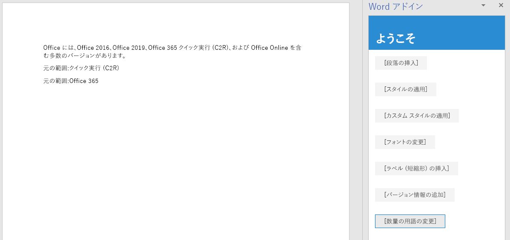

<span data-ttu-id="b0aa1-101">このチュートリアルの手順では、選択したテキスト範囲の内側や外側にテキストを追加したり、選択した範囲のテキストを置き換えたりします。</span><span class="sxs-lookup"><span data-stu-id="b0aa1-101">In this step of the tutorial, you'll add text inside and outside of selected ranges of text, and replace the text of a selected range.</span></span>

> [!NOTE]
> <span data-ttu-id="b0aa1-p101">このページでは、Word アドインのチュートリアルの個々の手順について説明します。このページに検索エンジンの結果から、またはその他の直接リンクからアクセスした場合は、「[Word アドインのチュートリアル](../tutorials/word-tutorial.yml)」の紹介ページに移動し、チュートリアルを最初から始めてください。</span><span class="sxs-lookup"><span data-stu-id="b0aa1-p101">This page describes an individual step of a Word add-in tutorial. If you’ve arrived at this page via search engine results or other direct link, please go to the [Word add-in tutorial](../tutorials/word-tutorial.yml) introduction page to start the tutorial from the beginning.</span></span>

## <a name="add-text-inside-a-range"></a><span data-ttu-id="b0aa1-104">範囲内にテキストを追加する</span><span class="sxs-lookup"><span data-stu-id="b0aa1-104">Add text inside a range</span></span>

1. <span data-ttu-id="b0aa1-105">コード エディターでプロジェクトを開きます。</span><span class="sxs-lookup"><span data-stu-id="b0aa1-105">Open the project in your code editor.</span></span>
2. <span data-ttu-id="b0aa1-106">index.html ファイルを開きます。</span><span class="sxs-lookup"><span data-stu-id="b0aa1-106">Open the file index.html.</span></span>
3. <span data-ttu-id="b0aa1-107">`change-font` ボタンを格納している `div` の下に、次のマークアップを追加します。</span><span class="sxs-lookup"><span data-stu-id="b0aa1-107">Below the `div` that contains the `change-font` button, add the following markup:</span></span>

    ```html
    <div class="padding">
        <button class="ms-Button" id="insert-text-into-range">Insert Abbreviation</button>
    </div>
    ```

4. <span data-ttu-id="b0aa1-108">app.js ファイルを開きます。</span><span class="sxs-lookup"><span data-stu-id="b0aa1-108">Open the app.js file.</span></span>

5. <span data-ttu-id="b0aa1-109">`change-font` ボタンにクリック ハンドラーを割り当てる行の下に、次のコードを追加します。</span><span class="sxs-lookup"><span data-stu-id="b0aa1-109">Below the line that assigns a click handler to the `change-font` button, add the following code:</span></span>

    ```js
    $('#insert-text-into-range').click(insertTextIntoRange);
    ```

6. <span data-ttu-id="b0aa1-110">`changeFont` 関数の下に、次の関数を追加します。</span><span class="sxs-lookup"><span data-stu-id="b0aa1-110">Below the `changeFont` function, add the following function:</span></span>

    ```js
    function insertTextIntoRange() {
        Word.run(function (context) {

            // TODO1: Queue commands to insert text into a selected range.

            // TODO2: Load the text of the range and sync so that the
            //        current range text can be read.

            // TODO3: Queue commands to repeat the text of the original
            //        range at the end of the document.

            return context.sync();
        })
        .catch(function (error) {
            console.log("Error: " + error);
            if (error instanceof OfficeExtension.Error) {
                console.log("Debug info: " + JSON.stringify(error.debugInfo));
            }
        });
    }
    ``` 

7. <span data-ttu-id="b0aa1-p102">`TODO1` を次のコードに置き換えます。次の点に注意してください。</span><span class="sxs-lookup"><span data-stu-id="b0aa1-p102">Replace `TODO1` with the following code. Note:</span></span>
   - <span data-ttu-id="b0aa1-113">このメソッドの目的は、テキストが Click-to-Run という範囲の末尾に (C2R) という省略形を挿入することです。</span><span class="sxs-lookup"><span data-stu-id="b0aa1-113">The method is intended to insert the abbreviation ["(C2R)"] into the end of the Range whose text is "Click-to-Run".</span></span> <span data-ttu-id="b0aa1-114">これは前提を単純化し、文字列は存在しており、ユーザーがその文字列を選択したものとしています。</span><span class="sxs-lookup"><span data-stu-id="b0aa1-114">It makes a simplifying assumption that the string is present and the user has selected it.</span></span>
   - <span data-ttu-id="b0aa1-115">`Range.insertText` メソッドの最初のパラメーターは、`Range` オブジェクトに挿入する文字列です。</span><span class="sxs-lookup"><span data-stu-id="b0aa1-115">The first parameter of the `Range.insertText` method is the string to insert into the `Range` object.</span></span>
   - <span data-ttu-id="b0aa1-116">2 番目のパラメーターは、範囲内のどの位置にテキストを挿入するかを指定します。</span><span class="sxs-lookup"><span data-stu-id="b0aa1-116">The second parameter specifies where in the range the additional text should be inserted.</span></span> <span data-ttu-id="b0aa1-117">End の他に、Start、Before、After、Replace が選択できます。</span><span class="sxs-lookup"><span data-stu-id="b0aa1-117">Besides "End", the other possible options are "Start", "Before", "After", and "Replace".</span></span> 
   - <span data-ttu-id="b0aa1-118">End と After の違いは、End が既存の範囲の内部の末尾に新しいテキストを挿入するのに対し、After の場合は文字列の入った新しい範囲を作成し、既存の範囲の後にその新しい範囲が挿入されることです。</span><span class="sxs-lookup"><span data-stu-id="b0aa1-118">The difference between "End" and "After" is that "End" inserts the new text inside the end of the existing range, but "After" creates a new range with the string and inserts the new range after the existing range.</span></span> <span data-ttu-id="b0aa1-119">同様に、Start はテキストを既存の範囲の内部の先頭に挿入しますが、Before の場合は新しい範囲を挿入します。</span><span class="sxs-lookup"><span data-stu-id="b0aa1-119">Similarly, "Start" inserts text inside the beginning of the existing range and "Before" inserts a new range.</span></span> <span data-ttu-id="b0aa1-120">Replace は、既存の範囲のテキストを最初のパラメーターで指定した文字列に置き換えます。</span><span class="sxs-lookup"><span data-stu-id="b0aa1-120">"Replace" replaces the text of the existing range with the string in the first parameter.</span></span>
   - <span data-ttu-id="b0aa1-121">チュートリアルの前の段階で示したとおり、ボディ オブジェクトの insert\* メソッドに Before オプションや After オプションはありません。</span><span class="sxs-lookup"><span data-stu-id="b0aa1-121">You saw in an earlier stage of the tutorial that the insert\* methods of the body object do not have the "Before" and "After" options.</span></span> <span data-ttu-id="b0aa1-122">これは、文書の本文の外部にはコンテンツを挿入できないからです。</span><span class="sxs-lookup"><span data-stu-id="b0aa1-122">This is because you can't put content outside of the document's body.</span></span>

    ```js
    const doc = context.document;
    const originalRange = doc.getSelection();
    originalRange.insertText(" (C2R)", "End");
    ```

8. <span data-ttu-id="b0aa1-123">`TODO2` はスキップし、次のセクションに移ります。</span><span class="sxs-lookup"><span data-stu-id="b0aa1-123">We'll skip over `TODO2` until the next section.</span></span> <span data-ttu-id="b0aa1-124">`TODO3` を次のコードに置き換えます。</span><span class="sxs-lookup"><span data-stu-id="b0aa1-124">Replace `TODO3` with the following code.</span></span> <span data-ttu-id="b0aa1-125">このコードは、このチュートリアルの最初の段階で作成したコードに似ていますが、文書の先頭ではなく末尾に新しい段落を挿入する点が異なります。</span><span class="sxs-lookup"><span data-stu-id="b0aa1-125">This code is similar to the code you created in the first stage of the tutorial, except that now you are inserting a new paragraph at the end of the document instead of at the start.</span></span> <span data-ttu-id="b0aa1-126">この新しい段落で、新しいテキストが元の範囲の一部になっていることが示されます。</span><span class="sxs-lookup"><span data-stu-id="b0aa1-126">This new paragraph will demonstrate that the new text is now part of the original range.</span></span>

    ```js
    doc.body.insertParagraph("Original range: " + originalRange.text,
                             "End");
    ```

## <a name="add-code-to-fetch-document-properties-into-the-task-panes-script-objects"></a><span data-ttu-id="b0aa1-127">ドキュメントのプロパティを作業ウィンドウのスクリプト オブジェクトにフェッチするコードを追加する</span><span class="sxs-lookup"><span data-stu-id="b0aa1-127">Add code to fetch document properties into the task pane's script objects</span></span>

<span data-ttu-id="b0aa1-128">このチュートリアルのシリーズで前述したすべての関数では、Office ドキュメントへの*書き込み*コマンドをキューに登録していました。</span><span class="sxs-lookup"><span data-stu-id="b0aa1-128">In all the previous functions in this series of tutorials, you queued commands to *write* to the Office document.</span></span> <span data-ttu-id="b0aa1-129">各関数は、キューに登録されたコマンドを実行対象のドキュメントに送信する `context.sync()` メソッドを呼び出すことで終了しています。</span><span class="sxs-lookup"><span data-stu-id="b0aa1-129">Each function ended with a call to the `context.sync()` method which sends the queued commands to the document to be executed.</span></span> <span data-ttu-id="b0aa1-130">ただし、最後の手順で追加したコードでは、`originalRange.text` プロパティを呼び出しています。このことが、これまでに作成した関数とは大きく異なります。`originalRange` オブジェクトは、この作業ウィンドウのスクリプトに存在する単なるプロキシ オブジェクトなので、</span><span class="sxs-lookup"><span data-stu-id="b0aa1-130">But the code you added in the last step calls the `originalRange.text` property, and this is a significant difference from the earlier functions you wrote, because the `originalRange` object is only a proxy object that exists in your task pane's script.</span></span> <span data-ttu-id="b0aa1-131">ドキュメントの指定された範囲にある実際のテキストを認識できません。そのため、その `text` プロパティでは実際の値が保持できません。</span><span class="sxs-lookup"><span data-stu-id="b0aa1-131">It doesn't know what the actual text of the range in the document is, so its `text` property can't have a real value.</span></span> <span data-ttu-id="b0aa1-132">まず、ドキュメントからその範囲のテキスト値をフェッチする必要があり、その値を使用して `originalRange.text` の値を設定します。</span><span class="sxs-lookup"><span data-stu-id="b0aa1-132">It is necessary to first fetch the text value of the range from the document and use it to set the value of `originalRange.text`.</span></span> <span data-ttu-id="b0aa1-133">そのようにした場合にのみ、例外がスローされることなく `originalRange.text` を呼び出せるようになります。</span><span class="sxs-lookup"><span data-stu-id="b0aa1-133">Only then can `originalRange.text` be called without causing an exception to be thrown.</span></span> <span data-ttu-id="b0aa1-134">このフェッチ処理には、3 つの手順があります。</span><span class="sxs-lookup"><span data-stu-id="b0aa1-134">This fetching process has three steps:</span></span>

   1. <span data-ttu-id="b0aa1-135">コードで読み取る必要があるプロパティをロードする (つまりフェッチする) コマンドをキューに登録します。</span><span class="sxs-lookup"><span data-stu-id="b0aa1-135">Queue a command to load (that is; fetch) the properties that your code needs to read.</span></span>
   2. <span data-ttu-id="b0aa1-136">コンテキスト オブジェクトの `sync` メソッドを呼び出します。このメソッドは、キューに登録されたコマンドを実行対象のドキュメントに送信して、要求された情報を返します。</span><span class="sxs-lookup"><span data-stu-id="b0aa1-136">Call the context object's `sync` method to send the queued command to the document for execution and return the requested information.</span></span>
   3. <span data-ttu-id="b0aa1-137">`sync` メソッドは非同期であるため、フェッチされたプロパティをコードで呼び出す前に、そのメソッドが完了していることを確認します。</span><span class="sxs-lookup"><span data-stu-id="b0aa1-137">Because the `sync` method is asynchronous, ensure that it has completed before your code calls the properties that were fetched.</span></span>

<span data-ttu-id="b0aa1-138">こうした手順は、コードで Office ドキュメントから情報を*読み取る*必要がある場合には必ず完了する必要があります。</span><span class="sxs-lookup"><span data-stu-id="b0aa1-138">These steps must be completed whenever your code needs to *read* information from the Office document.</span></span>

1. <span data-ttu-id="b0aa1-139">`TODO2` を次のコードに置き換えます。</span><span class="sxs-lookup"><span data-stu-id="b0aa1-139">Replace `TODO2` with the following code.</span></span>
  
    ```js
    originalRange.load("text");
    return context.sync()
        .then(function() {

                // TODO4: Move the doc.body.insertParagraph line here.

            }
        )
            // TODO5: Move the final call of context.sync here and ensure
            //        that it does not run until the insertParagraph has
            //        been queued.
    ```

2. <span data-ttu-id="b0aa1-p109">分岐していない同一のコード パスに 2 つの `return` ステートメントを含めることはできないため、`Word.run` の最後にある最終行の `return context.sync();` を削除します。新しい最後の `context.sync` は、このチュートリアルの後の方で追加します。</span><span class="sxs-lookup"><span data-stu-id="b0aa1-p109">You can't have two `return` statements in the same unbranching code path, so delete the final line `return context.sync();` at the end of the `Word.run`. You'll add a new final `context.sync` later in this tutorial.</span></span>
3. <span data-ttu-id="b0aa1-142">`doc.body.insertParagraph` 行を切り取り、`TODO4` の代わりに貼り付けます。</span><span class="sxs-lookup"><span data-stu-id="b0aa1-142">Cut the `doc.body.insertParagraph` line and paste in place of `TODO4`.</span></span>
4. <span data-ttu-id="b0aa1-p110">`TODO5` を次のコードに置き換えます。次の点に注意してください。</span><span class="sxs-lookup"><span data-stu-id="b0aa1-p110">Replace `TODO5` with the following code. Note:</span></span>
   - <span data-ttu-id="b0aa1-145">`sync` メソッドを `then` 関数に渡すことで、`insertParagraph` ロジックがキューに登録されるまで、そのメソッドが実行されないようにします。</span><span class="sxs-lookup"><span data-stu-id="b0aa1-145">Passing the `sync` method to a `then` function ensures that it does not run until the `insertParagraph` logic has been queued.</span></span>
   - <span data-ttu-id="b0aa1-146">`then` メソッドは渡されたどんな関数でも呼び出します。`sync` が 2 回呼び出されないように、context.sync の末尾の "()" は省略します。</span><span class="sxs-lookup"><span data-stu-id="b0aa1-146">The `then` method invokes whatever function is passed to it, and you don't want `sync` to be invoked twice, so leave off the "()" from the end of context.sync.</span></span>

    ```js
    .then(context.sync);
    ```

<span data-ttu-id="b0aa1-147">作業が完了すると、関数の全体は次のようになります。</span><span class="sxs-lookup"><span data-stu-id="b0aa1-147">When you are done, the entire function should look like the following:</span></span>


```js
function insertTextIntoRange() {
    Word.run(function (context) {

        const doc = context.document;
        const originalRange = doc.getSelection();
        originalRange.insertText(" (C2R)", "End");

        originalRange.load("text");
        return context.sync()
            .then(function() {
                        doc.body.insertParagraph("Current text of original range: " + originalRange.text,
                                                "End");
                }
            )
            .then(context.sync);
    })
    .catch(function (error) {
        console.log("Error: " + error);
        if (error instanceof OfficeExtension.Error) {
            console.log("Debug info: " + JSON.stringify(error.debugInfo));
        }
    });
}
```

## <a name="add-text-between-ranges"></a><span data-ttu-id="b0aa1-148">範囲間にテキストを追加する</span><span class="sxs-lookup"><span data-stu-id="b0aa1-148">Add text between ranges</span></span>

1. <span data-ttu-id="b0aa1-149">index.html ファイルを開きます。</span><span class="sxs-lookup"><span data-stu-id="b0aa1-149">Open the file index.html.</span></span>
2. <span data-ttu-id="b0aa1-150">`insert-text-into-range` ボタンを格納している `div` の下に、次のマークアップを追加します。</span><span class="sxs-lookup"><span data-stu-id="b0aa1-150">Below the `div` that contains the `insert-text-into-range` button, add the following markup:</span></span>

    ```html
    <div class="padding">
        <button class="ms-Button" id="insert-text-outside-range">Add Version Info</button>
    </div>
    ```

3. <span data-ttu-id="b0aa1-151">app.js ファイルを開きます。</span><span class="sxs-lookup"><span data-stu-id="b0aa1-151">Open the app.js file.</span></span>

4. <span data-ttu-id="b0aa1-152">`insert-text-into-range` ボタンにクリック ハンドラーを割り当てる行の下に、次のコードを追加します。</span><span class="sxs-lookup"><span data-stu-id="b0aa1-152">Below the line that assigns a click handler to the `insert-text-into-range` button, add the following code:</span></span>

    ```js
    $('#insert-text-outside-range').click(insertTextBeforeRange);
    ```

5. <span data-ttu-id="b0aa1-153">`insertTextIntoRange` 関数の下に、次の関数を追加します。</span><span class="sxs-lookup"><span data-stu-id="b0aa1-153">Below the `insertTextIntoRange` function, add the following function:</span></span>

    ```js
    function insertTextBeforeRange() {
        Word.run(function (context) {

            // TODO1: Queue commands to insert a new range before the
            //        selected range.

            // TODO2: Load the text of the original range and sync so that the
            //        range text can be read and inserted.

        })
        .catch(function (error) {
            console.log("Error: " + error);
            if (error instanceof OfficeExtension.Error) {
                console.log("Debug info: " + JSON.stringify(error.debugInfo));
            }
        });
    }
    ```

6. <span data-ttu-id="b0aa1-p111">`TODO1` を次のコードに置き換えます。次の点に注意してください。</span><span class="sxs-lookup"><span data-stu-id="b0aa1-p111">Replace `TODO1` with the following code. Note:</span></span>
   - <span data-ttu-id="b0aa1-156">このメソッドの目的は、Office 365 というテキストから成る範囲の前に Office 2019 というテキストの範囲を追加することです。</span><span class="sxs-lookup"><span data-stu-id="b0aa1-156">The method is intended to add a range whose text is "Office 2019, " before the range with text "Office 365".</span></span> <span data-ttu-id="b0aa1-157">これは前提を単純化し、文字列は存在しており、ユーザーがその文字列を選択したものとしています。</span><span class="sxs-lookup"><span data-stu-id="b0aa1-157">It makes a simplifying assumption that the string is present and the user has selected it.</span></span>
   - <span data-ttu-id="b0aa1-158">`Range.insertText` メソッドの最初のパラメーターは、追加する文字列です。</span><span class="sxs-lookup"><span data-stu-id="b0aa1-158">The first parameter of the `Range.insertText` method is the string to add.</span></span>
   - <span data-ttu-id="b0aa1-159">2 番目のパラメーターは、範囲内のどの位置にテキストを挿入するかを指定します。</span><span class="sxs-lookup"><span data-stu-id="b0aa1-159">The second parameter specifies where in the range the additional text should be inserted.</span></span> <span data-ttu-id="b0aa1-160">位置オプションの詳細については、`insertTextIntoRange` 関数に関する上記の説明を参照してください。</span><span class="sxs-lookup"><span data-stu-id="b0aa1-160">For more details about the location options, see the previous discussion of the `insertTextIntoRange` function.</span></span>

    ```js
    const doc = context.document;
    const originalRange = doc.getSelection();
    originalRange.insertText("Office 2019, ", "Before");
    ```

7. <span data-ttu-id="b0aa1-161">`TODO2` を次のコードに置き換えます。</span><span class="sxs-lookup"><span data-stu-id="b0aa1-161">Replace `TODO2` with the following code.</span></span>

     ```js
    originalRange.load("text");
    return context.sync()
        .then(function() {

                // TODO3: Queue commands to insert the original range as a
                //        paragraph at the end of the document.

                }
            )

            // TODO4: Make a final call of context.sync here and ensure
            //        that it does not run until the insertParagraph has
            //        been queued.
    ```

8. <span data-ttu-id="b0aa1-162">`TODO3` を次のコードに置き換えます。</span><span class="sxs-lookup"><span data-stu-id="b0aa1-162">Replace `TODO3` with the following code.</span></span> <span data-ttu-id="b0aa1-163">この新しい段落で、新しいテキストが元の選択範囲の一部になって***いない***ことが示されます。</span><span class="sxs-lookup"><span data-stu-id="b0aa1-163">This new paragraph will demonstrate the fact that the new text is ***not*** part of the original selected range.</span></span> <span data-ttu-id="b0aa1-164">元の範囲には、依然として選択時のテキストのみが含まれています。</span><span class="sxs-lookup"><span data-stu-id="b0aa1-164">The original range still has only the text it had when it was selected.</span></span>

    ```js
    doc.body.insertParagraph("Current text of original range: " + originalRange.text,
                             "End");
    ```

9. <span data-ttu-id="b0aa1-165">`TODO4` を次のコードに置き換えます。</span><span class="sxs-lookup"><span data-stu-id="b0aa1-165">Replace `TODO4` with the following code:</span></span>

    ```js
    .then(context.sync);
    ```


## <a name="replace-the-text-of-a-range"></a><span data-ttu-id="b0aa1-166">範囲のテキストを置き換える</span><span class="sxs-lookup"><span data-stu-id="b0aa1-166">Replace the text of a range</span></span>

1. <span data-ttu-id="b0aa1-167">index.html ファイルを開きます。</span><span class="sxs-lookup"><span data-stu-id="b0aa1-167">Open the file index.html.</span></span>
2. <span data-ttu-id="b0aa1-168">`insert-text-outside-range` ボタンを格納している `div` の下に、次のマークアップを追加します。</span><span class="sxs-lookup"><span data-stu-id="b0aa1-168">Below the `div` that contains the `insert-text-outside-range` button, add the following markup:</span></span>

    ```html
    <div class="padding">
        <button class="ms-Button" id="replace-text">Change Quantity Term</button>
    </div>
    ```

3. <span data-ttu-id="b0aa1-169">app.js ファイルを開きます。</span><span class="sxs-lookup"><span data-stu-id="b0aa1-169">Open the app.js file.</span></span>

4. <span data-ttu-id="b0aa1-170">`insert-text-outside-range` ボタンにクリック ハンドラーを割り当てる行の下に、次のコードを追加します。</span><span class="sxs-lookup"><span data-stu-id="b0aa1-170">Below the line that assigns a click handler to the `insert-text-outside-range` button, add the following code:</span></span>

    ```js
    $('#replace-text').click(replaceText);
    ```

5. <span data-ttu-id="b0aa1-171">`insertTextBeforeRange` 関数の下に、次の関数を追加します。</span><span class="sxs-lookup"><span data-stu-id="b0aa1-171">Below the `insertTextBeforeRange` function, add the following function:</span></span>

    ```js
    function replaceText() {
        Word.run(function (context) {

            // TODO1: Queue commands to replace the text.

            return context.sync();
        })
        .catch(function (error) {
            console.log("Error: " + error);
            if (error instanceof OfficeExtension.Error) {
                console.log("Debug info: " + JSON.stringify(error.debugInfo));
            }
        });
    }
    ```

6. <span data-ttu-id="b0aa1-172">`TODO1` を次のコードに置き換えます。</span><span class="sxs-lookup"><span data-stu-id="b0aa1-172">Replace `TODO1` with the following code.</span></span> <span data-ttu-id="b0aa1-173">このメソッドの目的は、several という文字列を many という文字列で置き換えることです。</span><span class="sxs-lookup"><span data-stu-id="b0aa1-173">Note that the method is intended to replace the string "several" with the string "many".</span></span> <span data-ttu-id="b0aa1-174">これは前提を単純化し、文字列は存在しており、ユーザーがその文字列を選択したものとしています。</span><span class="sxs-lookup"><span data-stu-id="b0aa1-174">It makes a simplifying assumption that the string is present and the user has selected it.</span></span>

    ```js
    const doc = context.document;
    const originalRange = doc.getSelection();
    originalRange.insertText("many", "Replace");
    ```

## <a name="test-the-add-in"></a><span data-ttu-id="b0aa1-175">アドインをテストする</span><span class="sxs-lookup"><span data-stu-id="b0aa1-175">Test the add-in</span></span>

1. <span data-ttu-id="b0aa1-176">Git bash ウィンドウまたは Node.JS 対応のシステム プロンプトが前の段階のチュートリアルから開いたままになっている場合は、Ctrl-C を 2 回入力して実行中の Web サーバーを停止します。</span><span class="sxs-lookup"><span data-stu-id="b0aa1-176">If the Git bash window, or Node.JS-enabled system prompt, from the previous stage tutorial is still open, enter Ctrl-C twice to stop the running web server.</span></span> <span data-ttu-id="b0aa1-177">それ以外の場合は、Git bash ウィンドウまたは Node.JS 対応のシステム プロンプトを開いて、プロジェクトの **Start** フォルダーに移動します。</span><span class="sxs-lookup"><span data-stu-id="b0aa1-177">Otherwise, open a Git bash window, or Node.JS-enabled system prompt, and navigate to the **Start** folder of the project.</span></span>

     > [!NOTE]
     > <span data-ttu-id="b0aa1-178">ブラウザー同期サーバーは、app.js ファイルなどのファイルに変更を加えるたびに作業ウィンドウ内のアドインを再読み込みしますが、JavaScript を再トランスパイルしないため、ビルド コマンドを繰り返し実行して、app.js への変更を反映させる必要があります。</span><span class="sxs-lookup"><span data-stu-id="b0aa1-178">Although the browser-sync server reloads your add-in in the task pane every time you make a change to any file, including the app.js file, it does not retranspile the JavaScript, so you must repeat the build command in order for your changes to app.js to take effect.</span></span> <span data-ttu-id="b0aa1-179">これを行うには、プロンプトが表示されてビルド コマンドを入力できるようにするため、サーバー プロセスを強制終了する必要があります。</span><span class="sxs-lookup"><span data-stu-id="b0aa1-179">In order to do this, you need to kill the server process so that the prompt appears and you can enter the build command.</span></span> <span data-ttu-id="b0aa1-180">ビルド後に、サーバーを再起動します。</span><span class="sxs-lookup"><span data-stu-id="b0aa1-180">After the build, restart the server.</span></span> <span data-ttu-id="b0aa1-181">次の数ステップで、このプロセスを実行します。</span><span class="sxs-lookup"><span data-stu-id="b0aa1-181">The next few steps carry out this process.</span></span>

2. <span data-ttu-id="b0aa1-182">`npm run build` コマンドを実行し、Office アドインを実行できるすべてのホストでサポートされている以前のバージョンの JavaScript に ES6 ソース コードをトランスパイルします。</span><span class="sxs-lookup"><span data-stu-id="b0aa1-182">Run the command `npm run build` to transpile your ES6 source code to an earlier version of JavaScript that is supported by all the hosts where Office Add-ins can run.</span></span>
3. <span data-ttu-id="b0aa1-183">`npm start` コマンドを実行して、ローカルホストで稼働する Web サーバーを起動します。</span><span class="sxs-lookup"><span data-stu-id="b0aa1-183">Run the command `npm start` to start a web server running on localhost.</span></span>
4. <span data-ttu-id="b0aa1-184">作業ウィンドウを再読み込みするために、そのウィンドウを閉じて、**[ホーム]** メニューの **[作業ウィンドウの表示]** を選択してアドインを再度開きます。</span><span class="sxs-lookup"><span data-stu-id="b0aa1-184">Reload the task pane by closing it, and then on the **Home** menu, select **Show Taskpane** to reopen the add-in.</span></span>
5. <span data-ttu-id="b0aa1-185">作業ウィンドウで **[段落の挿入]** を選択し、文書の先頭に段落があることを確認します。</span><span class="sxs-lookup"><span data-stu-id="b0aa1-185">In the taskpane, choose **Insert Paragraph** to ensure that there is a paragraph at the start of the document.</span></span>
6. <span data-ttu-id="b0aa1-186">一部のテキストを選択します。</span><span class="sxs-lookup"><span data-stu-id="b0aa1-186">Select some text.</span></span> <span data-ttu-id="b0aa1-187">Click-to-Run という語句を選択します。</span><span class="sxs-lookup"><span data-stu-id="b0aa1-187">Selecting the phrase "Click-to-Run" will make the most sense.</span></span> <span data-ttu-id="b0aa1-188">*選択範囲の前後にあるスペースは含めないように注意してください。*</span><span class="sxs-lookup"><span data-stu-id="b0aa1-188">*Be careful not to include the preceding or following space in the selection.*</span></span>
7. <span data-ttu-id="b0aa1-189">**[ラベル (短縮形) の挿入]** ボタンを選択します。</span><span class="sxs-lookup"><span data-stu-id="b0aa1-189">Choose the **Insert Abbreviation** button.</span></span> <span data-ttu-id="b0aa1-190">(C2R) が追加されることに注意してください。</span><span class="sxs-lookup"><span data-stu-id="b0aa1-190">Note that " (C2R)" is added.</span></span> <span data-ttu-id="b0aa1-191">また、この新しい文字列は既存の範囲に追加されるため、文書の下部に新しい段落が追加され、拡張されたテキスト全体が含まれていることに注意してください。</span><span class="sxs-lookup"><span data-stu-id="b0aa1-191">Note also that at the bottom of the document a new paragraph is added with the entire expanded text because the new string was added to the existing range.</span></span>
8. <span data-ttu-id="b0aa1-192">一部のテキストを選択します。</span><span class="sxs-lookup"><span data-stu-id="b0aa1-192">Select some text.</span></span> <span data-ttu-id="b0aa1-193">Office 365 という語句を選択します。</span><span class="sxs-lookup"><span data-stu-id="b0aa1-193">Selecting the phrase "Office 365" will make the most sense.</span></span> <span data-ttu-id="b0aa1-194">*選択範囲の前後にあるスペースは含めないように注意してください。*</span><span class="sxs-lookup"><span data-stu-id="b0aa1-194">*Be careful not to include the preceding or following space in the selection.*</span></span>
9. <span data-ttu-id="b0aa1-195">**[バージョン情報の追加]** ボタンを選択します。</span><span class="sxs-lookup"><span data-stu-id="b0aa1-195">Choose the **Add Version Info** button.</span></span> <span data-ttu-id="b0aa1-196">Office 2019 が、Office 2016 と Office 365 の間に挿入されることに注意してください。</span><span class="sxs-lookup"><span data-stu-id="b0aa1-196">Note that "Office 2019, " is inserted between "Office 2016" and "Office 365".</span></span> <span data-ttu-id="b0aa1-197">また、この新しい文字列は元の範囲に追加されるのではなく新しい範囲になるため、文書の下部に新しい段落が追加されるものの、その段落には最初に選択したテキストのみが含まれることに注意してください。</span><span class="sxs-lookup"><span data-stu-id="b0aa1-197">Note also that at the bottom of the document a new paragraph is added but it contains only the originally selected text because the new string became a new range rather than being added to the original range.</span></span>
10. <span data-ttu-id="b0aa1-198">一部のテキストを選択します。</span><span class="sxs-lookup"><span data-stu-id="b0aa1-198">Select some text.</span></span> <span data-ttu-id="b0aa1-199">several という語句を選択します。</span><span class="sxs-lookup"><span data-stu-id="b0aa1-199">Selecting the word "several" will make the most sense.</span></span> <span data-ttu-id="b0aa1-200">*選択範囲の前後にあるスペースは含めないように注意してください。*</span><span class="sxs-lookup"><span data-stu-id="b0aa1-200">*Be careful not to include the preceding or following space in the selection.*</span></span>
11. <span data-ttu-id="b0aa1-201">**[数量の用語の変更]** ボタンを選択します。</span><span class="sxs-lookup"><span data-stu-id="b0aa1-201">Choose the **Change Quantity Term** button.</span></span> <span data-ttu-id="b0aa1-202">選択したテキストが many に置き換えられることに注意してください。</span><span class="sxs-lookup"><span data-stu-id="b0aa1-202">Note that "many" replaces the selected text.</span></span>

    
